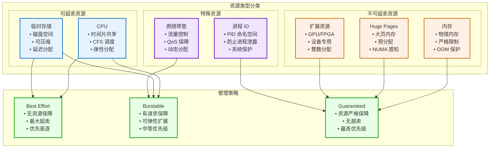
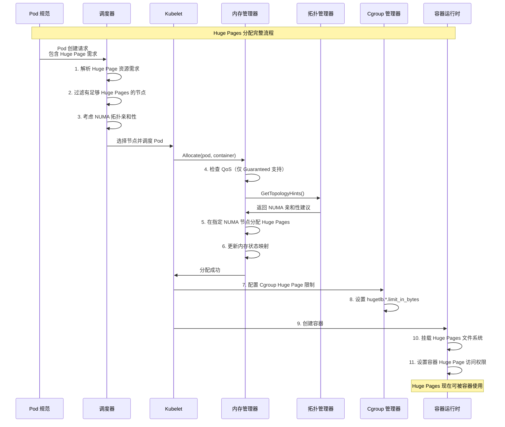
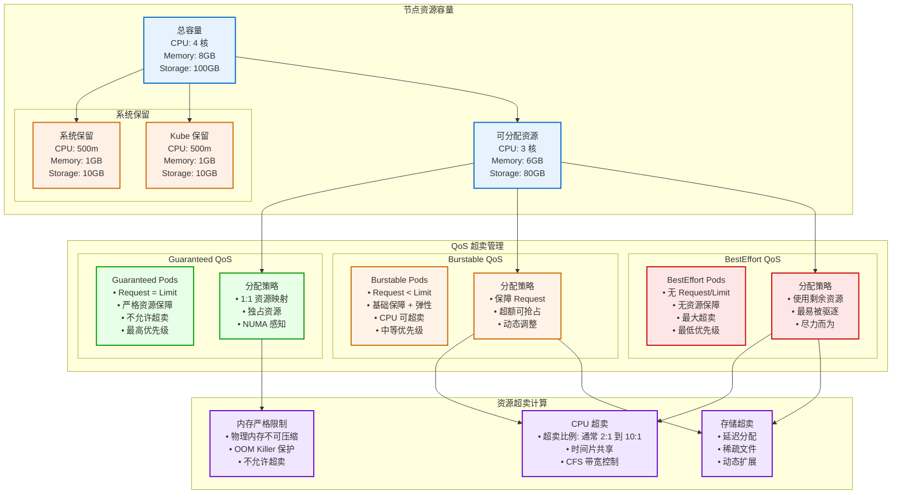
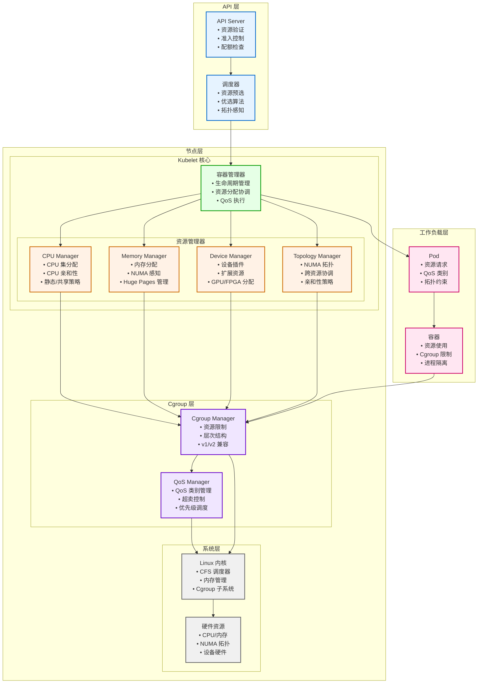
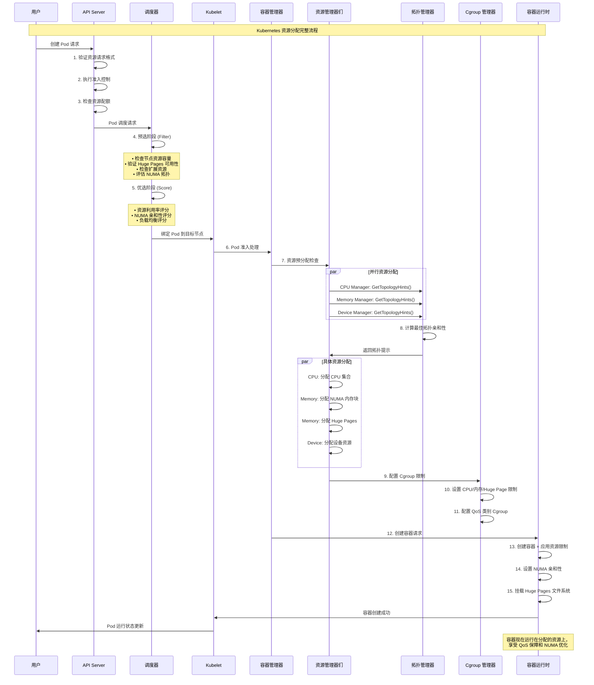
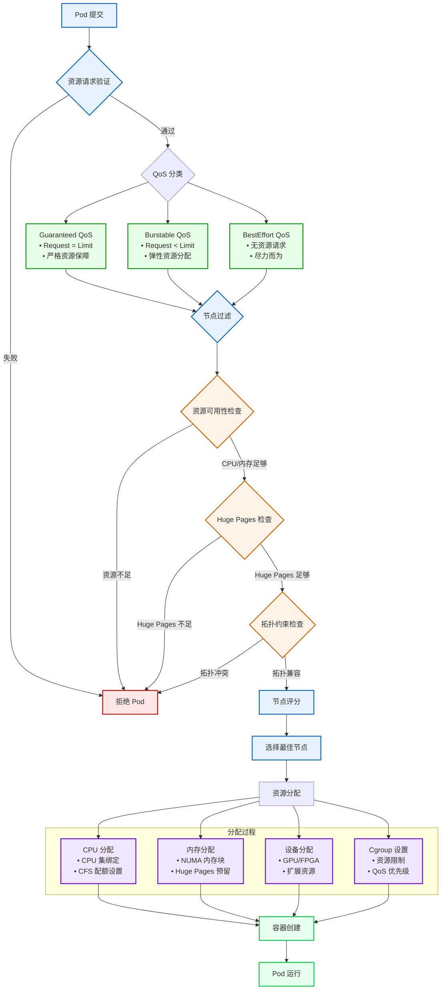
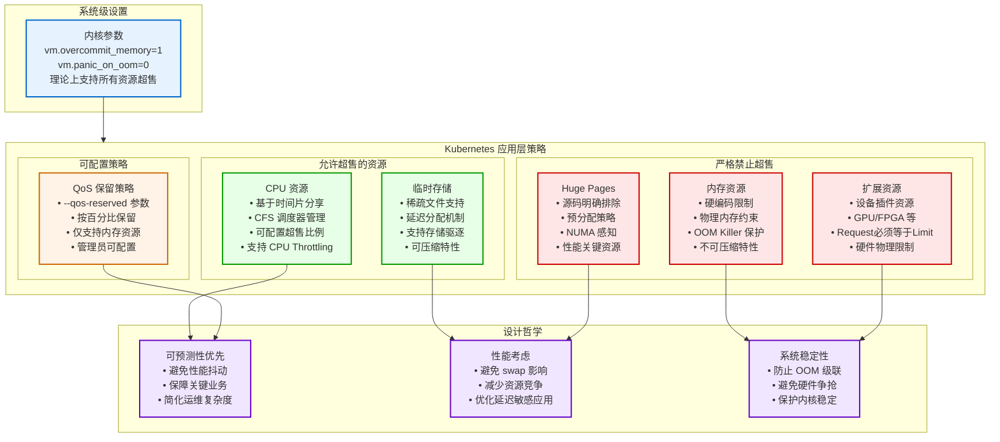
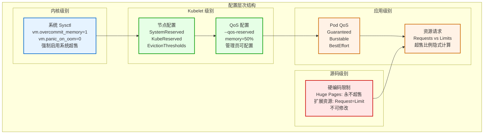

# Kubernetes 资源管理与分配机制深度解读

## 目录

1. [概述](#概述)
2. [Kubernetes 资源分类体系](#kubernetes-资源分类体系)
3. [Huge Pages 分配机制深度解析](#huge-pages-分配机制深度解析)
4. [资源超卖原理与 QoS 管理](#资源超卖原理与-qos-管理)
5. [资源管理架构](#资源管理架构)
6. [内存管理器与 NUMA 感知](#内存管理器与-numa-感知)
7. [拓扑管理器](#拓扑管理器)
8. [资源分配与调度流程](#资源分配与调度流程)
9. [使用样例与最佳实践](#使用样例与最佳实践)
10. [故障排查与监控](#故障排查与监控)
11. [总结](#总结)

---

## 概述

Kubernetes 资源管理是容器编排系统的核心功能之一，它负责在集群中高效地分配和管理各种计算资源。本文档基于 Kubernetes 源码深入解读资源管理机制，重点关注 Huge Pages 分配、资源超卖原理和 QoS 保障机制。

### 核心特性

- **多维度资源管理**：CPU、内存、存储、网络、扩展资源等
- **Huge Pages 支持**：大页内存的精确分配和 NUMA 感知
- **资源超卖机制**：通过 QoS 类别实现资源的弹性分配
- **拓扑感知**：基于 NUMA 拓扑的智能资源分配
- **精确计量**：细粒度的资源使用统计和限制

---

## Kubernetes 资源分类体系

### 1. 基础资源类型

Kubernetes 中的资源可以分为以下几个主要类别：

#### 1.1 标准计算资源

```go
// 基于 pkg/apis/core/types.go
const (
    // CPU 资源 - 可超卖
    ResourceCPU ResourceName = "cpu"
    
    // 内存资源 - 不可超卖（严格限制）
    ResourceMemory ResourceName = "memory"
    
    // 临时存储 - 可超卖
    ResourceEphemeralStorage ResourceName = "ephemeral-storage"
    
    // 存储资源
    ResourceStorage ResourceName = "storage"
)
```

#### 1.2 Huge Pages 资源

```go
// 基于 pkg/apis/core/v1/helper/helpers.go
const (
    // Huge Pages 资源前缀 - 绝不超卖
    ResourceHugePagesPrefix = "hugepages-"
    
    // 配额相关的 Huge Pages 前缀
    ResourceRequestsHugePagesPrefix = "requests.hugepages-"
)

// HugePageResourceName 生成标准化的 Huge Page 资源名称
func HugePageResourceName(pageSize resource.Quantity) v1.ResourceName {
    return v1.ResourceName(fmt.Sprintf("%s%s", v1.ResourceHugePagesPrefix, pageSize.String()))
}
```

#### 1.3 扩展资源

- **设备插件资源**：GPU、FPGA、网络设备等
- **自定义资源**：用户定义的特殊资源

### 2. 资源超卖特性对比



---

## Huge Pages 分配机制深度解析

### 1. Huge Pages 核心原理

Huge Pages（大页内存）是一种内存管理技术，使用更大的页面大小（通常是 2MB 或 1GB）来减少 TLB（Translation Lookaside Buffer）未命中，提高内存访问性能。

#### 1.1 Huge Pages 资源识别

基于 `pkg/apis/core/v1/helper/helpers.go`：

```go
// IsHugePageResourceName 判断是否为 Huge Page 资源
func IsHugePageResourceName(name v1.ResourceName) bool {
    return strings.HasPrefix(string(name), v1.ResourceHugePagesPrefix)
}

// HugePageSizeFromResourceName 从资源名称提取页面大小
func HugePageSizeFromResourceName(name v1.ResourceName) (resource.Quantity, error) {
    if !IsHugePageResourceName(name) {
        return resource.Quantity{}, fmt.Errorf("resource name: %s is an invalid hugepage name", name)
    }
    pageSize := strings.TrimPrefix(string(name), v1.ResourceHugePagesPrefix)
    return resource.ParseQuantity(pageSize)
}
```

#### 1.2 Huge Pages 限制提取

基于 `pkg/kubelet/kuberuntime/kuberuntime_container_linux.go`：

```go
// GetHugepageLimitsFromResources 从资源需求中提取 Huge Page 限制
func GetHugepageLimitsFromResources(resources v1.ResourceRequirements) []*runtimeapi.HugepageLimit {
    var hugepageLimits []*runtimeapi.HugepageLimit

    // 1. 为每种页面大小初始化限制为 0
    for _, pageSize := range libcontainercgroups.HugePageSizes() {
        hugepageLimits = append(hugepageLimits, &runtimeapi.HugepageLimit{
            PageSize: pageSize,
            Limit:    uint64(0),
        })
    }

    // 2. 解析容器资源限制中的 Huge Page 需求
    requiredHugepageLimits := map[string]uint64{}
    for resourceObj, amountObj := range resources.Limits {
        if !v1helper.IsHugePageResourceName(resourceObj) {
            continue
        }

        // 获取页面大小
        pageSize, err := v1helper.HugePageSizeFromResourceName(resourceObj)
        if err != nil {
            klog.InfoS("Failed to get hugepage size from resource", "object", resourceObj, "err", err)
            continue
        }

        // 转换为标准单位字符串
        sizeString, err := v1helper.HugePageUnitSizeFromByteSize(pageSize.Value())
        if err != nil {
            klog.InfoS("Size is invalid", "object", resourceObj, "err", err)
            continue
        }
        requiredHugepageLimits[sizeString] = uint64(amountObj.Value())
    }

    // 3. 设置实际限制值
    for _, hugepageLimit := range hugepageLimits {
        if limit, exists := requiredHugepageLimits[hugepageLimit.PageSize]; exists {
            hugepageLimit.Limit = limit
        }
    }

    return hugepageLimits
}
```

### 2. Huge Pages 内存管理

#### 2.1 静态内存管理策略

基于 `pkg/kubelet/cm/memorymanager/policy_static.go`：

```go
// getDefaultMachineState 构建默认的机器内存状态
func (p *staticPolicy) getDefaultMachineState() state.NUMANodeMap {
    defaultMachineState := state.NUMANodeMap{}
    nodeHugepages := map[int]uint64{}
    
    for _, node := range p.machineInfo.Topology {
        defaultMachineState[node.Id] = &state.NUMANodeState{
            NumberOfAssignments: 0,
            MemoryMap:           map[v1.ResourceName]*state.MemoryTable{},
            Cells:               []int{node.Id},
        }

        // 填充 Huge Pages 内存表
        for _, hugepage := range node.HugePages {
            // 计算 Huge Page 资源数量
            hugepageQuantity := resource.NewQuantity(
                int64(hugepage.PageSize)*1024, 
                resource.BinarySI,
            )
            resourceName := corehelper.HugePageResourceName(*hugepageQuantity)
            
            // 计算系统保留
            systemReserved := p.getResourceSystemReserved(node.Id, resourceName)
            totalHugepagesSize := hugepage.NumPages * hugepage.PageSize * 1024
            allocatable := totalHugepagesSize - systemReserved
            
            // 设置内存表
            defaultMachineState[node.Id].MemoryMap[resourceName] = &state.MemoryTable{
                Allocatable:    allocatable,
                Free:           allocatable,
                Reserved:       0,
                SystemReserved: systemReserved,
                TotalMemSize:   totalHugepagesSize,
            }
            
            // 累加节点 Huge Pages 总大小
            if _, ok := nodeHugepages[node.Id]; !ok {
                nodeHugepages[node.Id] = 0
            }
            nodeHugepages[node.Id] += totalHugepagesSize
        }

        // 计算常规内存（扣除 Huge Pages 占用）
        systemReserved := p.getResourceSystemReserved(node.Id, v1.ResourceMemory)
        allocatable := node.Memory - systemReserved
        
        // 🔑 关键：从可分配内存中减去 Huge Pages 占用
        if allocatedByHugepages, ok := nodeHugepages[node.Id]; ok {
            allocatable -= allocatedByHugepages
        }
        
        defaultMachineState[node.Id].MemoryMap[v1.ResourceMemory] = &state.MemoryTable{
            Allocatable:    allocatable,
            Free:           allocatable,
            Reserved:       0,
            SystemReserved: systemReserved,
            TotalMemSize:   node.Memory,
        }
    }
    
    return defaultMachineState
}
```

### 3. Huge Pages 分配流程



### 4. Huge Pages 使用样例

#### 4.1 基础 Huge Pages Pod

```yaml
apiVersion: v1
kind: Pod
metadata:
  name: hugepages-pod
spec:
  containers:
  - name: hugepages-container
    image: fedora:latest
    command:
    - sleep
    - inf
    resources:
      requests:
        hugepages-2Mi: 256Mi  # 请求 256MB 的 2MB 大页
        memory: 256Mi         # 常规内存
        cpu: 500m
      limits:
        hugepages-2Mi: 256Mi  # 限制必须与请求相等
        memory: 256Mi
        cpu: 500m
    volumeMounts:
    - name: hugepage-volume
      mountPath: /hugepages
  volumes:
  - name: hugepage-volume
    emptyDir:
      medium: HugePages-2Mi  # 指定使用 2MB 大页
```

#### 4.2 多种大页尺寸的 Pod

```yaml
apiVersion: v1
kind: Pod
metadata:
  name: multi-hugepages-pod
spec:
  containers:
  - name: app-container
    image: nginx
    resources:
      requests:
        hugepages-2Mi: 512Mi   # 2MB 大页
        hugepages-1Gi: 2Gi     # 1GB 大页  
        memory: 1Gi            # 常规内存
        cpu: 1000m
      limits:
        hugepages-2Mi: 512Mi
        hugepages-1Gi: 2Gi
        memory: 1Gi
        cpu: 1000m
    volumeMounts:
    - name: hugepage-2m
      mountPath: /hugepages-2M
    - name: hugepage-1g  
      mountPath: /hugepages-1G
  volumes:
  - name: hugepage-2m
    emptyDir:
      medium: HugePages-2Mi
  - name: hugepage-1g
    emptyDir:
      medium: HugePages-1Gi
```

#### 4.3 NUMA 感知的 Huge Pages 配置

```yaml
apiVersion: v1
kind: Pod
metadata:
  name: numa-hugepages-pod
spec:
  # 使用拓扑管理器策略
  containers:
  - name: numa-aware-app
    image: high-performance-app:latest
    resources:
      requests:
        hugepages-1Gi: 4Gi     # 请求 4GB 的 1GB 大页
        memory: 2Gi            # 常规内存  
        cpu: 4000m
      limits:
        hugepages-1Gi: 4Gi
        memory: 2Gi
        cpu: 4000m
    volumeMounts:
    - name: hugepage-volume
      mountPath: /app/hugepages
  volumes:
  - name: hugepage-volume
    emptyDir:
      medium: HugePages-1Gi
  # 注意：需要在 kubelet 配置中启用拓扑管理器
  nodeSelector:
    topology.kubernetes.io/zone: numa-zone-0
```

---

## 资源超卖原理与 QoS 管理

### 1. QoS 类别计算逻辑

基于 `pkg/apis/core/helper/qos/qos.go`：

```go
// ComputePodQOS 计算 Pod 的 QoS 类别
func ComputePodQOS(pod *core.Pod) core.PodQOSClass {
    requests := core.ResourceList{}
    limits := core.ResourceList{}
    zeroQuantity := resource.MustParse("0")
    isGuaranteed := true
    
    // 处理所有容器（包括 init 容器）
    allContainers := []core.Container{}
    allContainers = append(allContainers, pod.Spec.Containers...)
    allContainers = append(allContainers, pod.Spec.InitContainers...)
    
    for _, container := range allContainers {
        // 🔑 处理资源请求
        for name, quantity := range container.Resources.Requests {
            if !isSupportedQoSComputeResource(name) {
                continue  // 跳过不支持的资源
            }
            if quantity.Cmp(zeroQuantity) == 1 {
                delta := quantity.DeepCopy()
                if _, exists := requests[name]; !exists {
                    requests[name] = delta
                } else {
                    delta.Add(requests[name])
                    requests[name] = delta
                }
            }
        }
        
        // 🔑 处理资源限制
        qosLimitsFound := sets.NewString()
        for name, quantity := range container.Resources.Limits {
            if !isSupportedQoSComputeResource(name) {
                continue
            }
            if quantity.Cmp(zeroQuantity) == 1 {
                qosLimitsFound.Insert(string(name))
                delta := quantity.DeepCopy()
                if _, exists := limits[name]; !exists {
                    limits[name] = delta
                } else {
                    delta.Add(limits[name])
                    limits[name] = delta
                }
            }
        }

        // 检查是否同时设置了 CPU 和内存限制
        if !qosLimitsFound.HasAll(string(core.ResourceMemory), string(core.ResourceCPU)) {
            isGuaranteed = false
        }
    }
    
    // QoS 类别判定逻辑
    if len(requests) == 0 && len(limits) == 0 {
        return core.PodQOSBestEffort  // 无任何资源请求和限制
    }
    
    // 检查请求和限制是否匹配
    if isGuaranteed {
        for name, req := range requests {
            if lim, exists := limits[name]; !exists || lim.Cmp(req) != 0 {
                isGuaranteed = false
                break
            }
        }
    }
    
    if isGuaranteed && len(requests) == len(limits) {
        return core.PodQOSGuaranteed  // 请求和限制完全匹配
    }
    
    return core.PodQOSBurstable  // 其他情况为 Burstable
}
```

### 2. QoS 超卖管理机制

#### 2.1 QoS 容器管理器实现

基于 `pkg/kubelet/cm/qos_container_manager_linux.go`：

```go
// setMemoryReserve 为不同 QoS 类别设置内存保留
func (m *qosContainerManagerImpl) setMemoryReserve(configs map[v1.PodQOSClass]*CgroupConfig, percentReserve int64) {
    qosMemoryRequests := m.getQoSMemoryRequests()
    
    resources := m.getNodeAllocatable()
    allocatableResource, ok := resources[v1.ResourceMemory]
    if !ok {
        klog.V(2).InfoS("Allocatable memory value could not be determined, not setting QoS memory limits")
        return
    }
    allocatable := allocatableResource.Value()
    
    // 🔑 计算各 QoS 级别的内存限制（超卖算法）
    // Burstable = 总可分配 - (Guaranteed 使用量 * 保留百分比)
    burstableLimit := allocatable - (qosMemoryRequests[v1.PodQOSGuaranteed] * percentReserve / 100)
    
    // BestEffort = Burstable 限制 - (Burstable 使用量 * 保留百分比)  
    bestEffortLimit := burstableLimit - (qosMemoryRequests[v1.PodQOSBurstable] * percentReserve / 100)
    
    configs[v1.PodQOSBurstable].ResourceParameters.Memory = &burstableLimit
    configs[v1.PodQOSBestEffort].ResourceParameters.Memory = &bestEffortLimit
}

// UpdateCgroups 更新 QoS Cgroup 配置
func (m *qosContainerManagerImpl) UpdateCgroups() error {
    m.Lock()
    defer m.Unlock()

    // 为三种 QoS 类别创建 Cgroup 配置
    qosConfigs := map[v1.PodQOSClass]*CgroupConfig{
        v1.PodQOSGuaranteed: {
            Name:               m.qosContainersInfo.Guaranteed,
            ResourceParameters: &ResourceConfig{},
        },
        v1.PodQOSBurstable: {
            Name:               m.qosContainersInfo.Burstable,
            ResourceParameters: &ResourceConfig{},
        },
        v1.PodQOSBestEffort: {
            Name:               m.qosContainersInfo.BestEffort,
            ResourceParameters: &ResourceConfig{},
        },
    }

    // 设置 CPU 共享配置
    if err := m.setCPUCgroupConfig(qosConfigs); err != nil {
        return err
    }

    // 🔑 确保 Huge Pages 保持无界限（不超卖）
    if err := m.setHugePagesConfig(qosConfigs); err != nil {
        return err
    }

    // 启用内存 QoS（如果支持 Cgroup v2）
    if utilfeature.DefaultFeatureGate.Enabled(kubefeatures.MemoryQoS) &&
        libcontainercgroups.IsCgroup2UnifiedMode() {
        m.setMemoryQoS(qosConfigs)
    }

    // 应用 QoS 保留策略
    if utilfeature.DefaultFeatureGate.Enabled(kubefeatures.QOSReserved) {
        for resource, percentReserve := range m.qosReserved {
            switch resource {
            case v1.ResourceMemory:
                m.setMemoryReserve(qosConfigs, percentReserve)
            }
        }
    }

    // 更新所有 QoS Cgroup
    for _, config := range qosConfigs {
        err := m.cgroupManager.Update(config)
        if err != nil {
            return err
        }
    }

    return nil
}
```

### 3. 超卖机制运作原理



### 4. 超卖比例计算公式

#### 4.1 CPU 超卖计算

```bash
# CPU 超卖比例计算
节点总 CPU 核数 = 物理核数
可分配 CPU = 总核数 - 系统保留 - Kube 保留

# 超卖场景示例
物理核数: 4 核
系统保留: 0.5 核  
Kube 保留: 0.5 核
可分配 CPU: 3 核

# Pod 分配示例
Guaranteed Pod: 1 核 (Request = Limit = 1 核)
Burstable Pod: Request 0.5 核, Limit 2 核
BestEffort Pod: 无限制

# 实际超卖比例
总 Request: 1.5 核
总 Limit: 3 核  
超卖比例: 3 / 3 = 1:1 (在这个例子中)
```

#### 4.2 内存超卖限制

```bash
# 内存严格不超卖
节点总内存 = 物理内存
可分配内存 = 总内存 - 系统保留 - Kube 保留 - Huge Pages

# 内存分配示例  
物理内存: 8GB
系统保留: 1GB
Kube 保留: 1GB
Huge Pages: 1GB
可分配内存: 5GB

# QoS 内存分配
Guaranteed: Request = Limit (严格 1:1)
Burstable: Request ≤ 实际使用 ≤ Limit
BestEffort: 使用剩余内存，随时可被驱逐
```

---

## 资源管理架构

### 1. 整体架构图



### 2. 节点资源可分配计算

基于 `pkg/kubelet/cm/node_container_manager_linux.go`：

```go
// GetNodeAllocatableAbsolute 计算节点绝对可分配资源
func (cm *containerManagerImpl) GetNodeAllocatableAbsolute() v1.ResourceList {
    return cm.getNodeAllocatableAbsoluteImpl(cm.capacity)
}

func (cm *containerManagerImpl) getNodeAllocatableAbsoluteImpl(capacity v1.ResourceList) v1.ResourceList {
    result := make(v1.ResourceList)
    
    for k, v := range capacity {
        value := v.DeepCopy()
        
        // 减去系统保留资源
        if cm.NodeConfig.SystemReserved != nil {
            value.Sub(cm.NodeConfig.SystemReserved[k])
        }
        
        // 减去 Kube 保留资源
        if cm.NodeConfig.KubeReserved != nil {
            value.Sub(cm.NodeConfig.KubeReserved[k])
        }
        
        // 确保不出现负值
        if value.Sign() < 0 {
            value.Set(0)
        }
        
        result[k] = value
    }
    
    return result
}

// GetNodeAllocatableReservation 计算需要从调度中保留的资源
func (cm *containerManagerImpl) GetNodeAllocatableReservation() v1.ResourceList {
    evictionReservation := hardEvictionReservation(cm.HardEvictionThresholds, cm.capacity)
    result := make(v1.ResourceList)
    
    for k := range cm.capacity {
        value := resource.NewQuantity(0, resource.DecimalSI)
        
        // 系统保留
        if cm.NodeConfig.SystemReserved != nil {
            value.Add(cm.NodeConfig.SystemReserved[k])
        }
        
        // Kube 保留
        if cm.NodeConfig.KubeReserved != nil {
            value.Add(cm.NodeConfig.KubeReserved[k])
        }
        
        // 驱逐保留
        if evictionReservation != nil {
            value.Add(evictionReservation[k])
        }
        
        if !value.IsZero() {
            result[k] = *value
        }
    }
    
    return result
}
```

---

## 内存管理器与 NUMA 感知

### 1. 内存管理器接口

基于 `pkg/kubelet/cm/memorymanager/memory_manager.go`：

```go
// Manager 内存管理器接口
type Manager interface {
    // Start 在 Kubelet 初始化时调用
    Start(activePods ActivePodsFunc, sourcesReady config.SourcesReady, 
          podStatusProvider status.PodStatusProvider, containerRuntime runtimeService, 
          initialContainers containermap.ContainerMap) error

    // AddContainer 添加容器到内存管理
    AddContainer(p *v1.Pod, c *v1.Container, containerID string)

    // Allocate 在 Pod 准入时预分配内存资源
    Allocate(pod *v1.Pod, container *v1.Container) error

    // RemoveContainer 移除容器后释放内存分配
    RemoveContainer(containerID string) error

    // State 返回内存管理器状态的只读接口
    State() state.Reader

    // GetTopologyHints 实现拓扑管理器提示提供接口
    // 用于在多个资源控制器之间实现 NUMA 感知的资源对齐
    GetTopologyHints(*v1.Pod, *v1.Container) map[string][]topologymanager.TopologyHint

    // GetPodTopologyHints 获取 Pod 级别的拓扑提示
    GetPodTopologyHints(*v1.Pod) map[string][]topologymanager.TopologyHint

    // GetMemoryNUMANodes 提供用于分配容器内存的 NUMA 节点
    GetMemoryNUMANodes(pod *v1.Pod, container *v1.Container) sets.Set[int]

    // GetAllocatableMemory 返回每个 NUMA 节点的可分配内存量
    GetAllocatableMemory() []state.Block

    // GetMemory 返回容器从 NUMA 节点分配的内存
    GetMemory(podUID, containerName string) []state.Block
}
```

### 2. 静态内存分配策略

基于 `pkg/kubelet/cm/memorymanager/policy_static.go`：

```go
// Allocate 分配内存（幂等调用）
func (p *staticPolicy) Allocate(s state.State, pod *v1.Pod, container *v1.Container) error {
    // 🔑 仅为 Guaranteed Pod 分配内存
    if v1qos.GetPodQOS(pod) != v1.PodQOSGuaranteed {
        return nil
    }

    podUID := string(pod.UID)
    klog.InfoS("Allocate", "pod", klog.KObj(pod), "containerName", container.Name)
    
    // 检查容器是否已在状态中存在
    if blocks := s.GetMemoryBlocks(podUID, container.Name); blocks != nil {
        p.updatePodReusableMemory(pod, container, blocks)
        klog.InfoS("Container already present in state, skipping", "pod", klog.KObj(pod), "containerName", container.Name)
        return nil
    }

    // 🔑 调用拓扑管理器获取跨所有提示提供者的对齐亲和性
    hint := p.affinity.GetAffinity(podUID, container.Name)
    klog.InfoS("Got topology affinity", "pod", klog.KObj(pod), "podUID", pod.UID, "containerName", container.Name, "hint", hint)

    // 获取请求的资源
    requestedResources, err := getRequestedResources(pod, container)
    if err != nil {
        return err
    }

    machineState := s.GetMachineState()
    bestHint := &hint
    
    // 如果拓扑管理器返回 nil NUMA 亲和性提示，使用默认亲和性
    if hint.NUMANodeAffinity == nil {
        defaultHint, err := p.getDefaultHint(machineState, pod, requestedResources)
        if err != nil {
            return err
        }

        if !defaultHint.Preferred && bestHint.Preferred {
            return fmt.Errorf("[memorymanager] failed to find the default preferred hint")
        }
        bestHint = defaultHint
    }

    // 🔑 检查亲和性是否满足容器请求
    if !isAffinitySatisfyRequest(machineState, bestHint.NUMANodeAffinity, requestedResources) {
        // 扩展提示以满足请求
        extendedHint, err := p.extendTopologyManagerHint(machineState, bestHint.NUMANodeAffinity, requestedResources)
        if err != nil {
            return err
        }
        bestHint.NUMANodeAffinity = extendedHint
    }

    // 分配内存块
    return p.allocateMemoryBlocks(s, pod, container, bestHint.NUMANodeAffinity, requestedResources)
}

// GetMemoryNUMANodes 获取容器内存的 NUMA 节点
func (m *manager) GetMemoryNUMANodes(pod *v1.Pod, container *v1.Container) sets.Set[int] {
    numaNodes := sets.New[int]()
    
    // 获取分配给容器的内存块的 NUMA 节点亲和性
    for _, block := range m.state.GetMemoryBlocks(string(pod.UID), container.Name) {
        for _, nodeID := range block.NUMAAffinity {
            numaNodes.Insert(nodeID)
        }
    }

    if numaNodes.Len() == 0 {
        klog.V(5).InfoS("No allocation is available", "pod", klog.KObj(pod), "containerName", container.Name)
        return nil
    }

    klog.InfoS("Memory affinity", "pod", klog.KObj(pod), "containerName", container.Name, "numaNodes", numaNodes)
    return numaNodes
}
```

---

## 拓扑管理器

### 1. 拓扑管理器实现

基于 `pkg/kubelet/cm/topologymanager/topology_manager.go`：

```go
// NewManager 基于策略和作用域创建新的拓扑管理器
func NewManager(topology []cadvisorapi.Node, topologyPolicyName string, topologyScopeName string, topologyPolicyOptions map[string]string) (Manager, error) {
    // 当策略为 none 时，作用域不相关，可以短路返回
    if topologyPolicyName == PolicyNone {
        klog.InfoS("Creating topology manager with none policy")
        return &manager{scope: NewNoneScope()}, nil
    }

    opts, err := NewPolicyOptions(topologyPolicyOptions)
    if err != nil {
        return nil, err
    }

    klog.InfoS("Creating topology manager with policy per scope", 
        "topologyPolicyName", topologyPolicyName, 
        "topologyScopeName", topologyScopeName, 
        "topologyPolicyOptions", opts)

    // 🔑 发现 NUMA 拓扑
    numaInfo, err := NewNUMAInfo(topology, opts)
    if err != nil {
        return nil, fmt.Errorf("cannot discover NUMA topology: %w", err)
    }

    // 检查 NUMA 节点数量限制
    if topologyPolicyName != PolicyNone && len(numaInfo.Nodes) > maxAllowableNUMANodes {
        return nil, fmt.Errorf("unsupported on machines with more than %v NUMA Nodes", maxAllowableNUMANodes)
    }

    // 🔑 根据策略名称创建策略
    var policy Policy
    switch topologyPolicyName {
    case PolicyBestEffort:
        policy = NewBestEffortPolicy(numaInfo, opts)
    case PolicyRestricted:
        policy = NewRestrictedPolicy(numaInfo, opts)
    case PolicySingleNumaNode:
        policy = NewSingleNumaNodePolicy(numaInfo, opts)
    default:
        return nil, fmt.Errorf("unknown policy: \"%s\"", topologyPolicyName)
    }

    // 🔑 根据作用域名称创建作用域
    var scope Scope
    switch topologyScopeName {
    case containerTopologyScope:
        scope = NewContainerScope(policy)
    case podTopologyScope:
        scope = NewPodScope(policy)
    default:
        return nil, fmt.Errorf("unknown scope: \"%s\"", topologyScopeName)
    }

    manager := &manager{
        scope: scope,
    }

    return manager, nil
}
```

### 2. 拓扑管理器策略

#### 2.1 策略类型

- **None**：不进行拓扑管理
- **BestEffort**：尽力而为，不强制拓扑对齐
- **Restricted**：严格拓扑对齐，失败时拒绝 Pod
- **SingleNumaNode**：强制单 NUMA 节点分配

#### 2.2 作用域类型

- **Container**：按容器级别进行拓扑管理
- **Pod**：按 Pod 级别进行拓扑管理

---

## 资源分配与调度流程

### 1. 完整的资源分配流程



### 2. 资源分配决策树



---

## 使用样例与最佳实践

### 1. 高性能计算 Pod 配置

#### 1.1 NUMA 感知的高性能应用

```yaml
apiVersion: v1
kind: Pod
metadata:
  name: hpc-workload
  annotations:
    # 启用拓扑管理器 - 单 NUMA 节点策略
    topology.kubernetes.io/preferred-affinity: "single-numa-node"
spec:
  # 设置 QoS 为 Guaranteed
  containers:
  - name: hpc-app
    image: hpc-application:latest
    resources:
      requests:
        cpu: 4000m              # 4 个完整 CPU 核心
        memory: 8Gi             # 8GB 常规内存
        hugepages-2Mi: 2Gi      # 2GB 的 2MB 大页
        hugepages-1Gi: 4Gi      # 4GB 的 1GB 大页
        nvidia.com/gpu: 1       # 1 个 GPU
      limits:
        cpu: 4000m              # 限制与请求相等
        memory: 8Gi
        hugepages-2Mi: 2Gi
        hugepages-1Gi: 4Gi
        nvidia.com/gpu: 1
    env:
    - name: NUMA_MEMORY_POLICY
      value: "bind"
    - name: HUGE_PAGES_2M_PATH
      value: "/hugepages-2M"
    - name: HUGE_PAGES_1G_PATH  
      value: "/hugepages-1G"
    volumeMounts:
    - name: hugepages-2m
      mountPath: /hugepages-2M
    - name: hugepages-1g
      mountPath: /hugepages-1G
    - name: shared-memory
      mountPath: /dev/shm
  volumes:
  - name: hugepages-2m
    emptyDir:
      medium: HugePages-2Mi
  - name: hugepages-1g
    emptyDir:
      medium: HugePages-1Gi
  - name: shared-memory
    emptyDir:
      medium: Memory
      sizeLimit: 1Gi
  # 节点选择器确保调度到支持的节点
  nodeSelector:
    feature.node.kubernetes.io/cpu-cpuid.AVX512F: "true"
    feature.node.kubernetes.io/memory-numa: "true"
```

#### 1.2 数据库工作负载配置

```yaml
apiVersion: v1
kind: Pod
metadata:
  name: database-server
spec:
  containers:
  - name: postgresql
    image: postgres:13
    resources:
      requests:
        cpu: 2000m
        memory: 4Gi
        hugepages-2Mi: 1Gi      # 数据库缓存使用大页
      limits:
        cpu: 4000m              # 允许 CPU 突发
        memory: 4Gi             # 内存严格限制
        hugepages-2Mi: 1Gi
    env:
    - name: POSTGRES_DB
      value: "application_db"
    - name: POSTGRES_USER
      value: "dbuser"
    - name: POSTGRES_PASSWORD
      valueFrom:
        secretKeyRef:
          name: db-credentials
          key: password
    - name: HUGE_PAGES_CONFIG
      value: "huge_pages = on"
    volumeMounts:
    - name: hugepages
      mountPath: /hugepages
    - name: postgres-data
      mountPath: /var/lib/postgresql/data
  volumes:
  - name: hugepages
    emptyDir:
      medium: HugePages-2Mi
  - name: postgres-data
    persistentVolumeClaim:
      claimName: postgres-pvc
```

### 2. 资源超卖配置示例

#### 2.1 混合工作负载部署

```yaml
# Guaranteed Pod - 关键业务应用
apiVersion: v1
kind: Pod
metadata:
  name: critical-service
  labels:
    priority-class: "high-priority"
spec:
  priorityClassName: high-priority
  containers:
  - name: service
    image: critical-app:latest
    resources:
      requests:
        cpu: 1000m
        memory: 2Gi
      limits:
        cpu: 1000m      # Guaranteed QoS
        memory: 2Gi
---
# Burstable Pod - 开发环境应用
apiVersion: v1
kind: Pod
metadata:
  name: development-app
  labels:
    priority-class: "medium-priority"
spec:
  priorityClassName: medium-priority
  containers:
  - name: dev-app
    image: dev-application:latest
    resources:
      requests:
        cpu: 100m       # 基础保障
        memory: 256Mi
      limits:
        cpu: 1000m      # 允许突发到 1 核
        memory: 1Gi     # 最大使用 1GB
---
# BestEffort Pod - 批处理任务
apiVersion: v1
kind: Pod
metadata:
  name: batch-job
  labels:
    priority-class: "low-priority"
spec:
  priorityClassName: low-priority
  containers:
  - name: batch-worker
    image: batch-processor:latest
    # 无 resources 配置 = BestEffort QoS
  restartPolicy: Never
```

#### 2.2 资源配额管理

```yaml
apiVersion: v1
kind: ResourceQuota
metadata:
  name: compute-resources
  namespace: production
spec:
  hard:
    # CPU 配额
    requests.cpu: "4"           # 总 CPU 请求
    limits.cpu: "8"             # 总 CPU 限制 (2:1 超卖)
    
    # 内存配额 (严格不超卖)
    requests.memory: 8Gi        
    limits.memory: 8Gi          
    
    # Huge Pages 配额 (严格不超卖)
    requests.hugepages-2Mi: 4Gi
    limits.hugepages-2Mi: 4Gi
    
    # 存储配额
    requests.storage: 100Gi
    ephemeral-storage: 50Gi
    
    # Pod 数量限制
    pods: "10"
    
    # 扩展资源
    requests.nvidia.com/gpu: "2"
    limits.nvidia.com/gpu: "2"
---
apiVersion: v1
kind: LimitRange
metadata:
  name: default-limits
  namespace: production
spec:
  limits:
  - default:                    # 默认限制
      cpu: 500m
      memory: 512Mi
    defaultRequest:             # 默认请求
      cpu: 100m
      memory: 128Mi
    max:                        # 最大资源
      cpu: 2000m
      memory: 4Gi
      hugepages-2Mi: 1Gi
    min:                        # 最小资源
      cpu: 50m
      memory: 64Mi
    type: Container
```

### 3. 节点资源管理配置

#### 3.1 Kubelet 配置

```yaml
# kubelet-config.yaml
apiVersion: kubelet.config.k8s.io/v1beta1
kind: KubeletConfiguration

# 基础配置
clusterDNS:
- "10.96.0.10"
clusterDomain: "cluster.local"

# 资源管理配置
systemReserved:
  cpu: 500m
  memory: 1Gi
  ephemeral-storage: 10Gi
  pid: "1000"

kubeReserved:
  cpu: 500m
  memory: 1Gi
  ephemeral-storage: 10Gi
  pid: "1000"

# 驱逐阈值
evictionHard:
  memory.available: "100Mi"
  nodefs.available: "1Gi"
  nodefs.inodesFree: "5%"
  imagefs.available: "1Gi"

evictionSoft:
  memory.available: "200Mi"
  nodefs.available: "2Gi"
  
evictionSoftGracePeriod:
  memory.available: "30s"
  nodefs.available: "1m"

# CPU 管理策略
cpuManagerPolicy: "static"
cpuManagerPolicyOptions:
  full-pcpus-only: "true"

# 内存管理策略  
memoryManagerPolicy: "Static"
reservedMemory:
- numaNode: 0
  limits:
    memory: "1Gi"
- numaNode: 1
  limits:
    memory: "1Gi"

# 拓扑管理策略
topologyManagerPolicy: "single-numa-node"
topologyManagerScope: "container"

# QoS 相关配置
qosReserved:
  memory: "50%"               # 为低优先级 Pod 保留 50% 内存

# Cgroup 配置
cgroupDriver: "systemd"
cgroupsPerQOS: true
enforceNodeAllocatable:
- "pods"
- "system-reserved" 
- "kube-reserved"
```

#### 3.2 系统级别配置

```bash
#!/bin/bash
# setup-hugepages.sh - 系统 Huge Pages 配置脚本

# 配置 2MB 大页
echo 1024 > /sys/kernel/mm/hugepages/hugepages-2048kB/nr_hugepages

# 配置 1GB 大页  
echo 8 > /sys/kernel/mm/hugepages/hugepages-1048576kB/nr_hugepages

# 挂载 Huge Pages 文件系统
mkdir -p /mnt/hugepages-2M
mkdir -p /mnt/hugepages-1G

mount -t hugetlbfs -o pagesize=2M none /mnt/hugepages-2M
mount -t hugetlbfs -o pagesize=1G none /mnt/hugepages-1G

# 永久化配置
cat >> /etc/fstab << EOF
none /mnt/hugepages-2M hugetlbfs pagesize=2M 0 0
none /mnt/hugepages-1G hugetlbfs pagesize=1G 0 0
EOF

# 设置开机自动配置
cat > /etc/systemd/system/hugepages-setup.service << EOF
[Unit]
Description=Setup Huge Pages
Before=kubelet.service

[Service]
Type=oneshot
ExecStart=/usr/local/bin/setup-hugepages.sh
RemainAfterExit=yes

[Install]
WantedBy=multi-user.target
EOF

systemctl enable hugepages-setup.service

# 验证配置
echo "=== Huge Pages 配置验证 ==="
cat /proc/meminfo | grep Huge
echo ""
echo "=== NUMA 拓扑信息 ==="
lscpu | grep NUMA
numactl --hardware
```

### 4. 监控和观察

#### 4.1 资源使用监控

```yaml
apiVersion: v1
kind: ConfigMap
metadata:
  name: resource-monitoring
data:
  monitor.sh: |
    #!/bin/bash
    
    echo "=== 节点资源容量 ==="
    kubectl describe node $(hostname) | grep -A 10 "Capacity:"
    
    echo "=== Huge Pages 使用情况 ==="
    cat /proc/meminfo | grep -i huge
    
    echo "=== QoS Cgroup 资源使用 ==="
    for qos in guaranteed burstable besteffort; do
        echo "--- $qos QoS ---"
        cgroupPath="/sys/fs/cgroup/memory/kubepods.slice/kubepods-${qos}.slice"
        if [ -d "$cgroupPath" ]; then
            echo "Memory usage: $(cat $cgroupPath/memory.usage_in_bytes)"
            echo "Memory limit: $(cat $cgroupPath/memory.limit_in_bytes)"
        fi
    done
    
    echo "=== Pod 资源使用情况 ==="
    kubectl top pods --all-namespaces --containers
---
apiVersion: batch/v1
kind: CronJob
metadata:
  name: resource-monitoring
spec:
  schedule: "*/5 * * * *"  # 每 5 分钟执行一次
  jobTemplate:
    spec:
      template:
        spec:
          hostPID: true
          hostNetwork: true
          containers:
          - name: monitor
            image: kubectl:latest
            command:
            - /bin/bash
            - -c
            - |
              source /config/monitor.sh
            volumeMounts:
            - name: config
              mountPath: /config
            - name: cgroup
              mountPath: /sys/fs/cgroup
              readOnly: true
          volumes:
          - name: config
            configMap:
              name: resource-monitoring
              defaultMode: 0755
          - name: cgroup
            hostPath:
              path: /sys/fs/cgroup
          restartPolicy: OnFailure
```

#### 4.2 资源告警配置

```yaml
# prometheus-rules.yaml
apiVersion: monitoring.coreos.com/v1
kind: PrometheusRule
metadata:
  name: resource-alerts
spec:
  groups:
  - name: kubernetes-resources
    rules:
    - alert: NodeMemoryPressure
      expr: |
        (
          node_memory_MemTotal_bytes - node_memory_MemAvailable_bytes
        ) / node_memory_MemTotal_bytes > 0.85
      for: 5m
      labels:
        severity: warning
      annotations:
        summary: "节点内存压力过高"
        description: "节点 {{ $labels.instance }} 内存使用率超过 85%"
        
    - alert: HugePagesExhaustion
      expr: |
        (
          node_memory_HugePages_Total - node_memory_HugePages_Free
        ) / node_memory_HugePages_Total > 0.90
      for: 2m
      labels:
        severity: critical
      annotations:
        summary: "Huge Pages 资源即将耗尽"
        description: "节点 {{ $labels.instance }} Huge Pages 使用率超过 90%"
        
    - alert: CPUOvercommitHigh
      expr: |
        sum(kube_pod_container_resource_requests_cpu_cores) by (node) /
        sum(kube_node_status_allocatable_cpu_cores) by (node) > 2.0
      for: 10m
      labels:
        severity: warning
      annotations:
        summary: "CPU 超卖比例过高"
        description: "节点 {{ $labels.node }} CPU 超卖比例超过 2:1"
        
    - alert: QoSResourceImbalance
      expr: |
        sum(rate(container_cpu_cfs_throttled_seconds_total[5m])) by (pod, namespace) > 0.1
      for: 5m
      labels:
        severity: warning
      annotations:
        summary: "QoS 资源限制导致 CPU 节流"
        description: "Pod {{ $labels.namespace }}/{{ $labels.pod }} 出现 CPU 节流"
```

## 资源超售限制的设计哲学与技术实现

### 1. 理论 vs 实践：为什么不是所有资源都超售？

您提出了一个核心问题：**理论上所有资源都可以通过虚拟化技术实现超售，为什么 Kubernetes 选择性地限制某些资源的超售？**

#### 1.1 系统级内存超售配置

基于 `staging/src/k8s.io/component-helpers/node/util/sysctl/sysctl.go` 和 `pkg/kubelet/cm/container_manager_linux.go`：

```go
// Kubernetes 强制设置的内核参数
const (
    // VMOvercommitMemoryAlways 表示内核不进行内存超售检查
    VMOvercommitMemoryAlways = 1  // 对应 Linux vm.overcommit_memory = 1
    
    // 其他相关参数
    VMPanicOnOOMInvokeOOMKiller = 0  // vm.panic_on_oom = 0
    KernelPanicRebootTimeout = 10    // kernel.panic = 10
)

// setupKernelTunables 在 kubelet 启动时强制设置内核参数
func setupKernelTunables(option KernelTunableBehavior) error {
    desiredState := map[string]int{
        // 🔑 强制启用系统级内存超售
        utilsysctl.VMOvercommitMemory: utilsysctl.VMOvercommitMemoryAlways,
        utilsysctl.VMPanicOnOOM:       utilsysctl.VMPanicOnOOMInvokeOOMKiller,
        utilsysctl.KernelPanic:        utilsysctl.KernelPanicRebootTimeout,
        utilsysctl.KernelPanicOnOops:  utilsysctl.KernelPanicOnOopsAlways,
    }
    
    // 根据配置策略设置内核参数
    for flag, expectedValue := range desiredState {
        switch option {
        case KernelTunableModify:
            klog.V(2).InfoS("Updating kernel flag", "flag", flag, "expectedValue", expectedValue)
            err = sysctl.SetSysctl(flag, expectedValue)
        case KernelTunableWarn:
            klog.V(2).InfoS("Invalid kernel flag", "flag", flag, "expectedValue", expectedValue)
        case KernelTunableError:
            errList = append(errList, fmt.Errorf("invalid kernel flag: %v", flag))
        }
    }
}
```

**关键发现**：Kubernetes 在系统级别**强制启用**了内存超售（`vm.overcommit_memory = 1`），这意味着从技术上讲，系统确实支持内存超售。

#### 1.2 Kubernetes 层面的超售限制策略

尽管系统支持超售，但 Kubernetes 在应用层面实施了不同的超售策略：

```go
// 基于 pkg/api/v1/resource/helpers.go
func MergeContainerResourceLimits(container *v1.Container, allocatable v1.ResourceList) {
    // 🔑 关键注释：明确排除 Huge Pages 超售
    // NOTE: we exclude hugepages-* resources because hugepages are never overcommitted.
    // This means that the container always has a limit specified.
    for _, resource := range []v1.ResourceName{
        v1.ResourceCPU,           // 允许超售
        v1.ResourceMemory,        // 应用层面严格限制  
        v1.ResourceEphemeralStorage, // 允许超售
    } {
        // 只对这些资源应用默认限制，Huge Pages 被明确排除
        if quantity, exists := container.Resources.Limits[resource]; !exists || quantity.IsZero() {
            if cap, exists := allocatable[resource]; exists {
                container.Resources.Limits[resource] = cap.DeepCopy()
            }
        }
    }
}

// 基于 pkg/kubelet/cm/devicemanager/manager.go  
func (m *ManagerImpl) allocateContainerResources(...) error {
    // 🔑 硬编码规则：扩展资源不允许超售
    // Extended resources are not allowed to be overcommitted.
    // Since device plugin advertises extended resources,
    // therefore Requests must be equal to Limits and iterating
    // over the Limits should be sufficient.
    for k, v := range container.Resources.Limits {
        if !m.isDevicePluginResource(resource) {
            continue
        }
        // 扩展资源强制 Request = Limit
        needed := int(v.Value()) // 直接使用 Limit 值，不允许超售
    }
}
```

### 2. 资源超售限制的具体实现

#### 2.1 硬编码的超售限制

不同资源类型的超售策略在源码中有明确定义：



#### 2.2 超售比例的设置方式

##### A. 硬编码限制（源码中固定）

```go
// 1. Huge Pages - 硬编码禁止超售
// 基于 pkg/api/v1/resource/helpers.go:432
// hugepages are never overcommitted.

// 2. 扩展资源 - 硬编码禁止超售  
// 基于 pkg/kubelet/cm/devicemanager/manager.go:806
// Extended resources are not allowed to be overcommitted.

// 3. 内存 - 应用层面严格限制（尽管系统级允许超售）
// 基于设计哲学：避免 swap 导致的性能问题
```

##### B. 人为配置的超售策略

```go
// 基于 pkg/kubelet/cm/container_manager.go:194-210
func ParseQOSReserved(m map[string]string) (*map[v1.ResourceName]int64, error) {
    reservations := make(map[v1.ResourceName]int64)
    for k, v := range m {
        switch v1.ResourceName(k) {
        // 🔑 仅支持内存资源的 QoS 保留配置
        case v1.ResourceMemory:
            q, err := parsePercentage(v) // 解析百分比值
            if err != nil {
                return nil, fmt.Errorf("failed to parse percentage %q for %q resource: %w", v, k, err)
            }
            reservations[v1.ResourceName(k)] = q
        default:
            return nil, fmt.Errorf("cannot reserve %q resource", k) // 其他资源不支持配置
        }
    }
    return &reservations, nil
}
```

##### C. 基于系统容量计算的动态超售

```go
// 基于 pkg/kubelet/cm/node_container_manager_linux.go:201-217
func (cm *containerManagerImpl) getNodeAllocatableAbsoluteImpl(capacity v1.ResourceList) v1.ResourceList {
    result := make(v1.ResourceList)
    for k, v := range capacity {
        value := v.DeepCopy()
        
        // 🔑 超售计算公式：
        // 可分配资源 = 节点容量 - 系统保留 - Kube保留
        if cm.NodeConfig.SystemReserved != nil {
            value.Sub(cm.NodeConfig.SystemReserved[k])  // 减去系统保留
        }
        if cm.NodeConfig.KubeReserved != nil {
            value.Sub(cm.NodeConfig.KubeReserved[k])    // 减去 Kubernetes 保留
        }
        
        // 确保不出现负值（防止过度保留）
        if value.Sign() < 0 {
            value.Set(0)
        }
        result[k] = value
    }
    return result
}
```

### 3. 为什么不是所有资源都超售？设计权衡分析

#### 3.1 技术可行性 vs 实际收益权衡

| 资源类型 | 技术可行性 | Kubernetes 选择 | 权衡考虑 |
|---------|-----------|----------------|----------|
| **CPU** | ✅ 时间片轮转 | ✅ 允许超售 | 性能影响可控，通过 CFS 调度管理 |
| **内存** | ✅ Swap 机制 | ❌ 严格限制 | Swap 严重影响性能，不可预测 |
| **Huge Pages** | ❌ 硬件限制 | ❌ 绝不超售 | 预分配特性，无法虚拟化 |
| **存储** | ✅ 稀疏文件 | ✅ 允许超售 | 延迟分配，可压缩回收 |
| **GPU** | ❌ 硬件独占 | ❌ 绝不超售 | 物理设备，无法共享 |
| **网络带宽** | ✅ 流量整形 | ⚠️ 部分支持 | 复杂性高，依赖 CNI 实现 |

#### 3.2 设计哲学：可预测性优于资源利用率

```go
// Kubernetes 的设计哲学体现在源码注释中：

// 1. 关于内存不超售的设计考虑
// "Memory is not overcommitted because it's not compressible and 
//  swap would severely impact performance"

// 2. 关于 Huge Pages 的设计考虑  
// "hugepages are never overcommitted because they are pre-allocated
//  and performance-critical"

// 3. 关于扩展资源的设计考虑
// "Extended resources are not allowed to be overcommitted because
//  they represent physical devices with fixed capacity"
```

### 4. 超售配置的层次结构



### 5. 实际超售比例计算示例

```bash
# 真实集群中的超售比例计算示例

# 节点规格：
物理 CPU: 8 核
物理内存: 32GB
物理存储: 1TB SSD

# 系统级保留：
系统保留 CPU: 1 核
系统保留内存: 4GB
系统保留存储: 100GB

# Kubernetes 保留：
Kube 保留 CPU: 1 核  
Kube 保留内存: 4GB
Kube 保留存储: 100GB

# 可分配资源：
可分配 CPU: 6 核
可分配内存: 24GB  
可分配存储: 800GB

# 实际调度的 Pod 资源：
Total CPU Requests: 3 核
Total CPU Limits: 12 核
Total Memory Requests: 16GB
Total Memory Limits: 24GB
Total Storage Requests: 400GB

# 计算超售比例：
CPU 超售比例: 12核 / 6核 = 2:1  ✅ 允许
内存超售比例: 24GB / 24GB = 1:1  ✅ 严格限制
存储超售比例: 800GB / 800GB = 1:1  ✅ 按需分配

# 结论：
# - CPU 实现了 2:1 的超售，通过时间片共享
# - 内存严格不超售，避免 swap 性能问题
# - 存储采用延迟分配，实际使用时才占用空间
```

### 6. 超售限制的配置示例

```yaml
# Kubelet 配置文件示例 - 展示可配置的超售相关参数
apiVersion: kubelet.config.k8s.io/v1beta1
kind: KubeletConfiguration

# 系统资源保留（影响超售基准）
systemReserved:
  cpu: "1000m"      # 系统保留 1 核 CPU
  memory: "4Gi"     # 系统保留 4GB 内存
  ephemeral-storage: "100Gi"

# Kubernetes 组件资源保留
kubeReserved:  
  cpu: "1000m"      # Kube 组件保留 1 核
  memory: "4Gi"     # Kube 组件保留 4GB
  ephemeral-storage: "100Gi"

# QoS 资源保留策略（人为配置的超售限制）
qosReserved:
  memory: "50%"     # 为低优先级 Pod 保留 50% 内存

# 驱逐阈值（影响实际可超售量）
evictionHard:
  memory.available: "100Mi"    # 内存不足 100MB 时开始驱逐
  nodefs.available: "1Gi"      # 磁盘不足 1GB 时开始驱逐

# 内核参数保护（确保系统级超售启用）
protectKernelDefaults: false   # 允许修改内核参数
```

**总结回答您的问题**：

1. **理论 vs 实际**：Kubernetes 在系统级别确实启用了内存超售（`vm.overcommit_memory=1`），但在应用层面选择性地限制超售
2. **超售值设置**：
   - **硬编码限制**：Huge Pages、扩展资源等在源码中硬编码禁止超售
   - **人为配置**：QoS 保留策略、系统保留等可由管理员配置
   - **动态计算**：基于节点容量减去保留资源动态计算可分配量
3. **设计权衡**：Kubernetes 选择**可预测性优于最大利用率**，通过牺牲部分资源利用率来换取系统稳定性和性能可预测性

---

## 故障排查与监控

### 1. 常见问题诊断

#### 1.1 Huge Pages 分配失败

```bash
# 1. 检查系统 Huge Pages 配置
echo "=== 系统 Huge Pages 状态 ==="
cat /proc/meminfo | grep -i huge
echo ""

# 2. 检查 Huge Pages 挂载点
echo "=== Huge Pages 文件系统 ==="
mount | grep hugetlbfs
echo ""

# 3. 检查 kubelet 日志
echo "=== Kubelet 日志（Huge Pages 相关）==="
journalctl -u kubelet | grep -i hugepage | tail -10
echo ""

# 4. 检查 Pod 事件
echo "=== Pod 事件 ==="
kubectl describe pod <pod-name> | grep -A 5 -B 5 -i hugepage
```

#### 1.2 资源调度失败诊断

```bash
# 资源调度问题诊断脚本
#!/bin/bash

POD_NAME=$1
NAMESPACE=${2:-default}

echo "=== Pod 调度诊断: $POD_NAME ==="

# 1. Pod 基本信息
kubectl get pod $POD_NAME -n $NAMESPACE -o wide

# 2. Pod 事件
echo -e "\n=== Pod 事件 ==="
kubectl describe pod $POD_NAME -n $NAMESPACE | grep -A 20 "Events:"

# 3. 资源请求分析
echo -e "\n=== 资源请求分析 ==="
kubectl get pod $POD_NAME -n $NAMESPACE -o jsonpath='{.spec.containers[*].resources}'

# 4. 节点资源状态
echo -e "\n=== 节点资源状态 ==="
kubectl describe nodes | grep -A 5 -B 5 "Allocatable\|Allocated"

# 5. QoS 类别
echo -e "\n=== QoS 类别 ==="
kubectl get pod $POD_NAME -n $NAMESPACE -o jsonpath='{.status.qosClass}'

# 6. 拓扑约束检查
echo -e "\n=== 拓扑约束 ==="
kubectl get pod $POD_NAME -n $NAMESPACE -o jsonpath='{.spec.topologySpreadConstraints}'
```

### 2. 性能调优指南

#### 2.1 Huge Pages 优化

```bash
# Huge Pages 性能调优脚本
#!/bin/bash

echo "=== Huge Pages 性能调优建议 ==="

# 1. 检查当前配置
HUGEPAGES_2M=$(cat /sys/kernel/mm/hugepages/hugepages-2048kB/nr_hugepages)
HUGEPAGES_1G=$(cat /sys/kernel/mm/hugepages/hugepages-1048576kB/nr_hugepages)

echo "当前 2MB 大页数: $HUGEPAGES_2M"
echo "当前 1GB 大页数: $HUGEPAGES_1G"

# 2. 内存使用分析
TOTAL_MEM=$(free -g | grep Mem: | awk '{print $2}')
HUGEPAGES_MEM=$(echo "scale=2; ($HUGEPAGES_2M * 2 + $HUGEPAGES_1G * 1024) / 1024" | bc)

echo "总内存: ${TOTAL_MEM}GB"
echo "Huge Pages 占用: ${HUGEPAGES_MEM}GB"
echo "Huge Pages 比例: $(echo "scale=1; $HUGEPAGES_MEM * 100 / $TOTAL_MEM" | bc)%"

# 3. 性能建议
if (( $(echo "$HUGEPAGES_MEM * 100 / $TOTAL_MEM < 20" | bc -l) )); then
    echo "建议: 可以增加 Huge Pages 配置以提升性能"
elif (( $(echo "$HUGEPAGES_MEM * 100 / $TOTAL_MEM > 50" | bc -l) )); then
    echo "警告: Huge Pages 配置过高，可能影响系统灵活性"
else
    echo "建议: 当前 Huge Pages 配置合理"
fi

# 4. NUMA 平衡检查
echo -e "\n=== NUMA 平衡检查 ==="
for node in /sys/devices/system/node/node*; do
    if [[ -d $node ]]; then
        node_id=$(basename $node | sed 's/node//')
        hugepages_2m=$(cat $node/hugepages/hugepages-2048kB/nr_hugepages)
        hugepages_1g=$(cat $node/hugepages/hugepages-1048576kB/nr_hugepages)
        echo "NUMA Node $node_id: 2MB=$hugepages_2m, 1GB=$hugepages_1g"
    fi
done
```

#### 2.2 QoS 调优建议

```yaml
# QoS 调优最佳实践配置
apiVersion: v1
kind: ConfigMap
metadata:
  name: qos-tuning-guide
data:
  best-practices.md: |
    # QoS 调优最佳实践
    
    ## Guaranteed QoS 优化
    - 仅为关键业务应用使用 Guaranteed QoS
    - 设置合理的资源请求，避免资源浪费
    - 配合 CPU Manager static 策略使用
    - 启用 Memory Manager 实现 NUMA 感知
    
    ## Burstable QoS 优化
    - 为大多数应用推荐的 QoS 类别
    - Request 设置为正常负载的 80%
    - Limit 设置为峰值负载的 120%
    - 监控实际资源使用，动态调整
    
    ## BestEffort QoS 使用场景
    - 批处理作业
    - 开发测试环境
    - 可容忍中断的后台任务
    
    ## 资源超卖策略
    - CPU 超卖比例建议: 1.5:1 到 3:1
    - 内存严格不超卖
    - 监控节点资源压力，及时调整
    
    ## 监控指标
    - container_cpu_cfs_throttled_seconds_total
    - container_memory_usage_bytes
    - kube_pod_container_resource_requests
    - kube_pod_container_resource_limits
  
  tuning-commands.sh: |
    #!/bin/bash
    # QoS 调优命令集合
    
    # 检查 QoS 分布
    kubectl get pods --all-namespaces -o custom-columns=NAME:.metadata.name,NAMESPACE:.metadata.namespace,QOS:.status.qosClass
    
    # 检查资源使用 Top N
    kubectl top pods --all-namespaces --sort-by=memory | head -20
    kubectl top pods --all-namespaces --sort-by=cpu | head -20
    
    # 检查资源限制命中情况
    kubectl get events --field-selector reason=OOMKilling
    kubectl get events --field-selector reason=EvictedByEvictionAPI
    
    # 节点资源压力检查
    kubectl describe nodes | grep -A 10 "Conditions:"
```

---

## 总结

Kubernetes 资源管理系统是一个复杂而精密的体系，通过本文档的深入解读，我们可以看到其核心设计原则和实现机制：

### 🎯 **核心价值**

1. **多维度资源管理**：支持 CPU、内存、Huge Pages、扩展资源等多种资源类型
2. **智能超卖机制**：通过 QoS 分类实现安全的资源超卖和优先级管理
3. **NUMA 感知优化**：基于硬件拓扑的智能资源分配，提升应用性能
4. **精确资源控制**：Cgroup 级别的资源限制和监控

### 🏗️ **架构优势**

1. **分层管理**：从 API 层到硬件层的清晰分工
2. **策略驱动**：CPU Manager、Memory Manager、Topology Manager 的协同工作
3. **扩展性强**：设备插件和自定义资源的支持
4. **故障恢复**：资源分配失败的优雅处理和重试机制

### 🔒 **资源保障机制**

1. **QoS 分类保障**：
   - **Guaranteed**：严格资源保障，无超卖
   - **Burstable**：基础保障 + 弹性扩展
   - **BestEffort**：尽力而为，最大超卖

2. **超卖策略**：
   - **CPU**：可超卖，基于时间片共享
   - **内存**：严格不超卖，物理限制
   - **Huge Pages**：绝不超卖，预分配策略

### 🚀 **高级特性**

1. **Huge Pages 管理**：
   - 多种页面大小支持（2MB、1GB）
   - NUMA 感知分配
   - 零拷贝内存访问优化

2. **拓扑感知分配**：
   - 单 NUMA 节点策略
   - 跨资源协调对齐
   - 硬件亲和性优化

3. **动态资源调整**：
   - 垂直 Pod 自动缩放
   - 资源配额动态更新
   - 基于监控的自动调优

### 📊 **实战应用**

- **高性能计算**：Huge Pages + NUMA 感知 + Guaranteed QoS
- **数据库工作负载**：内存密集型优化 + 存储性能调优
- **微服务架构**：Burstable QoS + 资源超卖优化
- **批处理任务**：BestEffort QoS + 成本优化

### 🎯 **最佳实践要点**

1. **资源规划**：合理评估应用资源需求
2. **QoS 选择**：根据业务重要性选择合适的 QoS 类别
3. **监控告警**：建立完善的资源监控和告警机制
4. **性能调优**：基于实际使用情况持续优化配置

Kubernetes 资源管理系统通过其完善的架构设计和丰富的功能特性，为云原生应用提供了企业级的资源管理能力。掌握这些机制不仅有助于优化应用性能，还能显著提升集群资源利用率和稳定性，是现代容器化部署不可或缺的核心技术。
