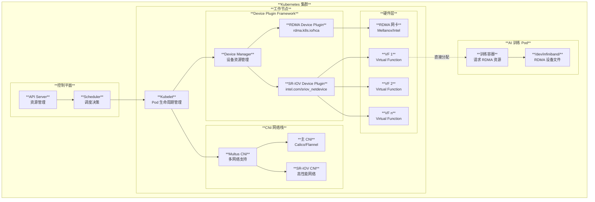
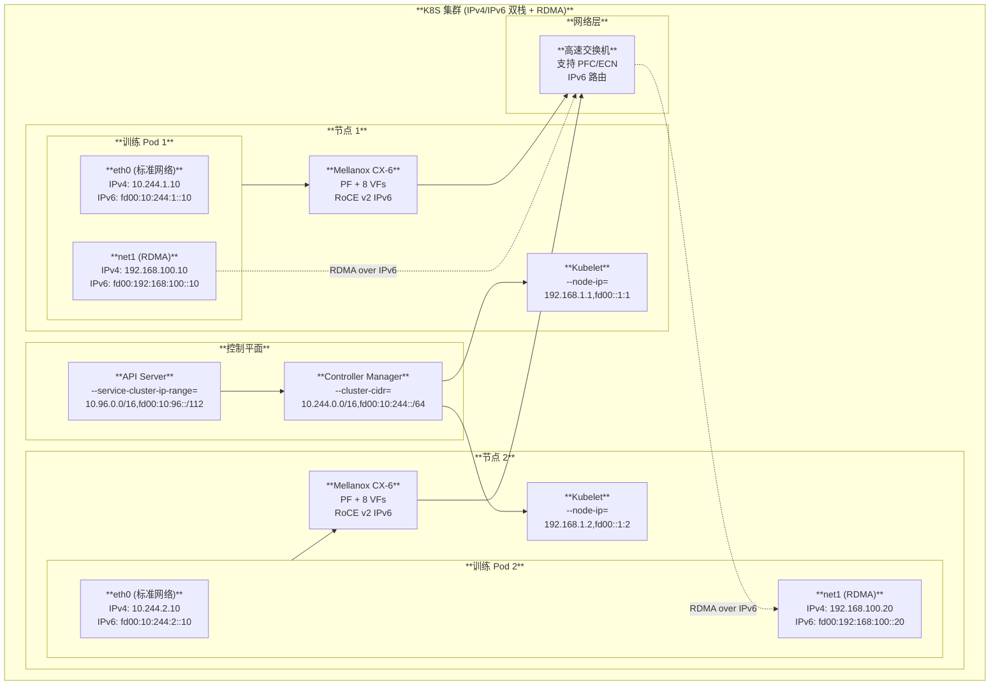

# Kubernetes 技术问答

## Q1: 绑定 Local PV 的 Pod Stop 后，CPU/MEM Request 会被回收吗？

### 简短回答

**取决于 "stop" 的具体含义：**

| 场景 | Request 是否回收 | 原因 |
|------|-----------------|------|
| **Pod 被删除 (kubectl delete pod)** | ✅ **会回收** | Pod 对象从集群中移除 |
| **Pod 进入 Failed/Succeeded 状态** | ✅ **会回收** | Pod 被标记为终态 |
| **容器 Stop 但 Pod 仍存在** | ❌ **不回收** | Pod 对象仍在，资源仍被占用 |
| **Pod Pending (等待调度)** | ❌ **不回收** | Pod 已绑定节点但未运行 |

---

### 源码分析

#### 1. 资源回收的核心机制

K8S 调度器通过 **NodeInfo** 跟踪每个节点的资源使用情况。当 Pod 被删除时，资源回收发生在以下代码路径：

```
┌─────────────────────────────────────────────────────────────────────────────┐
│                       Pod 删除时的资源回收流程                               │
├─────────────────────────────────────────────────────────────────────────────┤
│                                                                              │
│   1. API Server 收到 Delete Pod 请求                                        │
│      └── 触发 Pod Informer 的 Delete 事件                                   │
│                                                                              │
│   2. Scheduler 监听到事件                                                   │
│      └── pkg/scheduler/eventhandlers.go:                                    │
│          ┌────────────────────────────────────────────────────────────┐     │
│          │  func (sched *Scheduler) deletePodFromCache(obj interface{})│     │
│          │  {                                                          │     │
│          │      // ...                                                 │     │
│          │      sched.Cache.RemovePod(logger, pod)  ← 关键调用         │     │
│          │  }                                                          │     │
│          └────────────────────────────────────────────────────────────┘     │
│                                                                              │
│   3. 从 Cache 中移除 Pod                                                    │
│      └── pkg/scheduler/internal/cache/cache.go:                             │
│          ┌────────────────────────────────────────────────────────────┐     │
│          │  func (cache *cacheImpl) removePod(pod *v1.Pod) error {     │     │
│          │      n := cache.nodes[pod.Spec.NodeName]                    │     │
│          │      n.info.RemovePod(pod)  ← 从 NodeInfo 移除              │     │
│          │      delete(cache.podStates, key)                           │     │
│          │  }                                                          │     │
│          └────────────────────────────────────────────────────────────┘     │
│                                                                              │
│   4. 更新 NodeInfo 的资源统计                                               │
│      └── pkg/scheduler/framework/types.go:                                  │
│          ┌────────────────────────────────────────────────────────────┐     │
│          │  func (n *NodeInfo) RemovePod(pod *v1.Pod) error {          │     │
│          │      if n.Pods, removed = removeFromSlice(n.Pods, k); removed {│  │
│          │          n.update(pod, -1)  ← sign=-1 表示减去资源          │     │
│          │      }                                                      │     │
│          │  }                                                          │     │
│          │                                                             │     │
│          │  func (n *NodeInfo) update(pod *v1.Pod, sign int64) {       │     │
│          │      res, non0CPU, non0Mem := calculateResource(pod)        │     │
│          │      n.Requested.MilliCPU += sign * res.MilliCPU   ← 减去CPU│     │
│          │      n.Requested.Memory += sign * res.Memory       ← 减去内存│    │
│          │      // ...                                                 │     │
│          │  }                                                          │     │
│          └────────────────────────────────────────────────────────────┘     │
│                                                                              │
└─────────────────────────────────────────────────────────────────────────────┘
```

#### 2. 关键源码片段

**文件: `pkg/scheduler/framework/types.go`**

```go
// RemovePod subtracts pod information from this NodeInfo.
func (n *NodeInfo) RemovePod(pod *v1.Pod) error {
    k, err := GetPodKey(pod)
    if err != nil {
        return err
    }
    // ... 处理 affinity 相关信息 ...
    
    var removed bool
    if n.Pods, removed = removeFromSlice(n.Pods, k); removed {
        n.update(pod, -1)  // sign = -1，表示减去资源
        return nil
    }
    return fmt.Errorf("no corresponding pod %s in pods of node %s", pod.Name, n.node.Name)
}

// update node info based on the pod and sign.
// sign = +1 when AddPod, sign = -1 when RemovePod
func (n *NodeInfo) update(pod *v1.Pod, sign int64) {
    res, non0CPU, non0Mem := calculateResource(pod)
    n.Requested.MilliCPU += sign * res.MilliCPU      // 回收 CPU
    n.Requested.Memory += sign * res.Memory          // 回收 Memory
    n.Requested.EphemeralStorage += sign * res.EphemeralStorage
    
    // 处理扩展资源
    for rName, rQuant := range res.ScalarResources {
        n.Requested.ScalarResources[rName] += sign * rQuant
    }
    n.NonZeroRequested.MilliCPU += sign * non0CPU
    n.NonZeroRequested.Memory += sign * non0Mem

    // 释放端口和 PVC 引用
    n.updateUsedPorts(pod, sign > 0)
    n.updatePVCRefCounts(pod, sign > 0)
    
    n.Generation = nextGeneration()
}
```

**文件: `pkg/scheduler/metrics/resources/resources.go`**

```go
// podRequestsAndLimitsByLifecycle 判断 Pod 是否为终态
func podRequestsAndLimitsByLifecycle(pod *v1.Pod, ...) (reqs, limits v1.ResourceList, terminal bool) {
    switch {
    case len(pod.Spec.NodeName) == 0:
        // 未调度的 Pod 不是终态
    case pod.Status.Phase == v1.PodSucceeded, pod.Status.Phase == v1.PodFailed:
        terminal = true  // 成功或失败的 Pod 是终态
    }
    if terminal {
        return  // 终态 Pod 不返回资源（相当于资源为0）
    }
    
    reqs = v1resource.PodRequests(pod, ...)
    limits = v1resource.PodLimits(pod, ...)
    return
}
```

---

### 绑定 Local PV 的特殊情况

#### 为什么 Local PV Pod 的资源回收更复杂？

```
┌─────────────────────────────────────────────────────────────────────────────┐
│                     Local PV Pod 的生命周期与资源                            │
├─────────────────────────────────────────────────────────────────────────────┤
│                                                                              │
│   阶段 1: Pod 创建并绑定 Local PV                                           │
│   ┌─────────────────────────────────────────────────────────────────┐       │
│   │  Pod:                                                            │       │
│   │    spec:                                                         │       │
│   │      nodeName: worker-1        ← 调度器选择了 worker-1           │       │
│   │      volumes:                                                    │       │
│   │      - name: data                                                │       │
│   │        persistentVolumeClaim:                                    │       │
│   │          claimName: mysql-pvc  ← 绑定到 worker-1 上的 Local PV  │       │
│   │      containers:                                                 │       │
│   │      - resources:                                                │       │
│   │          requests:                                               │       │
│   │            cpu: "2"                                              │       │
│   │            memory: "8Gi"        ← 资源 request                   │       │
│   │                                                                  │       │
│   │  此时 worker-1 的 NodeInfo:                                      │       │
│   │    Requested.CPU = +2 cores                                     │       │
│   │    Requested.Memory = +8Gi                                      │       │
│   └─────────────────────────────────────────────────────────────────┘       │
│                                                                              │
│   阶段 2: 容器 Stop (Pod 仍存在)                                            │
│   ┌─────────────────────────────────────────────────────────────────┐       │
│   │  Pod.Status.Phase = Running → Failed                            │       │
│   │  Pod.Status.ContainerStatuses[0].State = Terminated             │       │
│   │                                                                  │       │
│   │  ⚠️ 但是:                                                        │       │
│   │    - Pod 对象仍然存在于 API Server                               │       │
│   │    - nodeName 仍然是 worker-1                                    │       │
│   │    - 资源 request 仍然被计入 worker-1 的 Requested               │       │
│   │    - Local PV 仍然被此 Pod 独占                                  │       │
│   │                                                                  │       │
│   │  ❌ 资源不会被回收!                                               │       │
│   └─────────────────────────────────────────────────────────────────┘       │
│                                                                              │
│   阶段 3: Pod 被删除                                                        │
│   ┌─────────────────────────────────────────────────────────────────┐       │
│   │  kubectl delete pod mysql-0                                      │       │
│   │                                                                  │       │
│   │  执行:                                                           │       │
│   │  1. Scheduler 收到 Delete 事件                                   │       │
│   │  2. 调用 RemovePod(pod) → update(pod, -1)                       │       │
│   │  3. NodeInfo.Requested.CPU -= 2                                  │       │
│   │  4. NodeInfo.Requested.Memory -= 8Gi                             │       │
│   │                                                                  │       │
│   │  ✅ 资源被回收!                                                   │       │
│   │                                                                  │       │
│   │  但是 Local PV 仍然存在，新 Pod 必须调度到同一节点                │       │
│   └─────────────────────────────────────────────────────────────────┘       │
│                                                                              │
└─────────────────────────────────────────────────────────────────────────────┘
```

#### Local PV 与节点亲和性

```
┌─────────────────────────────────────────────────────────────────────────────┐
│                     Local PV 的节点绑定机制                                  │
├─────────────────────────────────────────────────────────────────────────────┤
│                                                                              │
│   PersistentVolume (Local):                                                 │
│   ┌─────────────────────────────────────────────────────────────────┐       │
│   │  apiVersion: v1                                                  │       │
│   │  kind: PersistentVolume                                          │       │
│   │  metadata:                                                       │       │
│   │    name: local-pv-1                                              │       │
│   │  spec:                                                           │       │
│   │    nodeAffinity:                                                 │       │
│   │      required:                                                   │       │
│   │        nodeSelectorTerms:                                        │       │
│   │        - matchExpressions:                                       │       │
│   │          - key: kubernetes.io/hostname                           │       │
│   │            operator: In                                          │       │
│   │            values:                                               │       │
│   │            - worker-1          ← 只能在 worker-1 使用            │       │
│   │    local:                                                        │       │
│   │      path: /mnt/disks/ssd1                                       │       │
│   └─────────────────────────────────────────────────────────────────┘       │
│                                                                              │
│   影响:                                                                      │
│   ┌─────────────────────────────────────────────────────────────────┐       │
│   │  1. Pod 绑定此 PV 后，只能调度到 worker-1                        │       │
│   │  2. 即使 Pod 被删除，PV 仍然绑定到 worker-1                      │       │
│   │  3. 新的 Pod (使用同一 PVC) 必须调度到 worker-1                  │       │
│   │  4. 如果 worker-1 资源不足，新 Pod 将无法调度                    │       │
│   └─────────────────────────────────────────────────────────────────┘       │
│                                                                              │
└─────────────────────────────────────────────────────────────────────────────┘
```

---

### 原生 K8S 的限制与改进方案

#### 问题：容器 Stop 但资源不释放

```
┌─────────────────────────────────────────────────────────────────────────────┐
│                         问题场景                                             │
├─────────────────────────────────────────────────────────────────────────────┤
│                                                                              │
│   场景: MySQL Pod 容器 OOM 退出，但 Pod 仍处于 Running 状态                 │
│                                                                              │
│   Pod 状态:                                                                  │
│   ┌─────────────────────────────────────────────────────────────────┐       │
│   │  status:                                                         │       │
│   │    phase: Running  ← 仍然是 Running!                             │       │
│   │    containerStatuses:                                            │       │
│   │    - name: mysql                                                 │       │
│   │      state:                                                      │       │
│   │        terminated:                                               │       │
│   │          exitCode: 137     ← OOM Killed                          │       │
│   │          reason: OOMKilled                                       │       │
│   │      restartCount: 5                                             │       │
│   └─────────────────────────────────────────────────────────────────┘       │
│                                                                              │
│   问题:                                                                      │
│   - 容器已经停止，实际不消耗 CPU/Memory                                      │
│   - 但调度器仍然认为该 Pod 占用了 2CPU + 8Gi 内存                            │
│   - 其他 Pod 无法使用这些"被占用"的资源                                      │
│                                                                              │
└─────────────────────────────────────────────────────────────────────────────┘
```

#### 改进方案

##### 方案 1: 使用 Pod Disruption 和自动清理

```yaml
# 配置 Pod 的 activeDeadlineSeconds 和 restartPolicy
apiVersion: v1
kind: Pod
metadata:
  name: mysql
spec:
  # 容器失败后不重启，让 Pod 进入 Failed 状态
  restartPolicy: Never
  # 或者使用 activeDeadlineSeconds 限制总运行时间
  activeDeadlineSeconds: 86400  # 24小时后自动终止
  containers:
  - name: mysql
    # ...
```

##### 方案 2: 自定义控制器监控并清理

```go
// 伪代码: 自定义控制器检测并清理"僵尸" Pod
func (c *Controller) reconcile(pod *v1.Pod) error {
    // 检测容器是否已停止但 Pod 未终止
    if isPodZombie(pod) {
        // 选项 1: 删除 Pod
        c.client.CoreV1().Pods(pod.Namespace).Delete(pod.Name, &metav1.DeleteOptions{})
        
        // 选项 2: 更新 Pod 状态为 Failed
        pod.Status.Phase = v1.PodFailed
        c.client.CoreV1().Pods(pod.Namespace).UpdateStatus(pod)
    }
    return nil
}

func isPodZombie(pod *v1.Pod) bool {
    if pod.Status.Phase != v1.PodRunning {
        return false
    }
    
    // 检查所有容器是否都已终止
    for _, cs := range pod.Status.ContainerStatuses {
        if cs.State.Terminated == nil {
            return false  // 还有容器在运行
        }
        // 容器已终止且不会重启
        if cs.RestartCount >= 5 { // CrashLoopBackOff
            return true
        }
    }
    return false
}
```

##### 方案 3: 使用 StatefulSet 的 podManagementPolicy

```yaml
apiVersion: apps/v1
kind: StatefulSet
metadata:
  name: mysql
spec:
  # 使用 Parallel 策略，失败的 Pod 会被快速替换
  podManagementPolicy: Parallel
  # 配合 minReadySeconds 确保健康检查
  minReadySeconds: 10
  template:
    spec:
      containers:
      - name: mysql
        livenessProbe:
          exec:
            command: ["mysqladmin", "ping"]
          failureThreshold: 3  # 失败3次后重启/替换
          periodSeconds: 10
```

##### 方案 4: 监控实际资源使用并触发 Eviction

```
┌─────────────────────────────────────────────────────────────────────────────┐
│                    自定义资源回收方案架构                                    │
├─────────────────────────────────────────────────────────────────────────────┤
│                                                                              │
│   ┌─────────────────────────────────────────────────────────────────┐       │
│   │                  Resource Reclaim Controller                     │       │
│   │                                                                  │       │
│   │   1. Watch Pod 状态变化                                          │       │
│   │      └── 特别关注 containerStatuses[].state.terminated          │       │
│   │                                                                  │       │
│   │   2. 检测"僵尸"条件:                                             │       │
│   │      ├── 所有容器都已 Terminated                                 │       │
│   │      ├── Pod Phase 仍为 Running                                  │       │
│   │      └── 无法恢复 (RestartCount > threshold)                     │       │
│   │                                                                  │       │
│   │   3. 执行回收:                                                   │       │
│   │      ├── 方式A: 直接 Delete Pod                                  │       │
│   │      ├── 方式B: Patch Pod.Status.Phase = Failed                 │       │
│   │      └── 方式C: 触发 Eviction API                               │       │
│   │                                                                  │       │
│   │   4. 对于 StatefulSet Pod:                                       │       │
│   │      └── 控制器会自动创建新 Pod 替代                             │       │
│   │                                                                  │       │
│   └─────────────────────────────────────────────────────────────────┘       │
│                                                                              │
│   效果:                                                                      │
│   ┌─────────────────────────────────────────────────────────────────┐       │
│   │  Before: Pod Running (容器 Terminated) → Request 占用中         │       │
│   │  After:  Pod Failed/Deleted → Request 释放                       │       │
│   │          新 Pod 创建 → 重新调度，可能到其他节点                  │       │
│   │          (如果使用 Local PV，仍会调度到同一节点)                 │       │
│   └─────────────────────────────────────────────────────────────────┘       │
│                                                                              │
└─────────────────────────────────────────────────────────────────────────────┘
```

---

### 完整实现示例

```go
package main

import (
    "context"
    "time"
    
    v1 "k8s.io/api/core/v1"
    metav1 "k8s.io/apimachinery/pkg/apis/meta/v1"
    "k8s.io/client-go/kubernetes"
    "k8s.io/client-go/tools/cache"
)

// ZombiePodReclaimer 检测并回收僵尸 Pod 的资源
type ZombiePodReclaimer struct {
    client             kubernetes.Interface
    maxRestartCount    int32
    terminatedDuration time.Duration
}

func NewZombiePodReclaimer(client kubernetes.Interface) *ZombiePodReclaimer {
    return &ZombiePodReclaimer{
        client:             client,
        maxRestartCount:    5,
        terminatedDuration: 5 * time.Minute,
    }
}

// IsZombiePod 检测 Pod 是否是僵尸状态（容器已终止但 Pod 未清理）
func (r *ZombiePodReclaimer) IsZombiePod(pod *v1.Pod) bool {
    // 已经是终态的 Pod 不需要处理
    if pod.Status.Phase == v1.PodSucceeded || pod.Status.Phase == v1.PodFailed {
        return false
    }
    
    // 检查是否有绑定的节点
    if pod.Spec.NodeName == "" {
        return false
    }
    
    // 检查所有容器状态
    allTerminated := true
    hasFailure := false
    
    for _, cs := range pod.Status.ContainerStatuses {
        if cs.State.Terminated == nil {
            allTerminated = false
            break
        }
        // 检查是否频繁重启失败
        if cs.RestartCount >= r.maxRestartCount {
            hasFailure = true
        }
        // 检查容器是否已终止足够长时间
        if cs.State.Terminated.FinishedAt.Time.Add(r.terminatedDuration).After(time.Now()) {
            allTerminated = false
        }
    }
    
    // 所有容器都已终止且有失败历史 → 僵尸 Pod
    return allTerminated && hasFailure
}

// ReclaimResources 回收僵尸 Pod 的资源
func (r *ZombiePodReclaimer) ReclaimResources(ctx context.Context, pod *v1.Pod) error {
    // 方式1: 直接删除 Pod（触发 StatefulSet 重建）
    err := r.client.CoreV1().Pods(pod.Namespace).Delete(ctx, pod.Name, metav1.DeleteOptions{})
    if err != nil {
        return err
    }
    
    // 删除成功后，调度器的 RemovePod 会自动:
    // 1. 从 NodeInfo 中移除 Pod
    // 2. 回收 Requested.CPU 和 Requested.Memory
    // 3. 释放端口和 PVC 引用计数
    
    return nil
}

// ReconcileLoop 主循环
func (r *ZombiePodReclaimer) ReconcileLoop(ctx context.Context) {
    ticker := time.NewTicker(30 * time.Second)
    defer ticker.Stop()
    
    for {
        select {
        case <-ctx.Done():
            return
        case <-ticker.C:
            pods, err := r.client.CoreV1().Pods("").List(ctx, metav1.ListOptions{})
            if err != nil {
                continue
            }
            
            for _, pod := range pods.Items {
                if r.IsZombiePod(&pod) {
                    r.ReclaimResources(ctx, &pod)
                }
            }
        }
    }
}
```

---

### 总结

| 问题 | 原因 | 解决方案 |
|------|------|----------|
| 容器 Stop 但资源不释放 | K8S 基于 Pod 而非容器计算资源 | 自定义控制器检测并删除僵尸 Pod |
| Local PV Pod 只能在固定节点 | PV NodeAffinity 限制 | 接受限制，或使用分布式存储 |
| 资源回收延迟 | Pod 终态判断依赖 Phase | 配合 livenessProbe 加速检测 |
| StatefulSet Pod 不自动替换 | 等待用户确认 | 使用 podManagementPolicy: Parallel |

---

## Q2: K8S 网络可以支持 RDMA 网络不？怎么支持的？

### 简短回答

**可以支持！** Kubernetes 通过以下方式支持 RDMA（Remote Direct Memory Access）网络：

| 方案 | 核心技术 | 适用场景 | 性能等级 |
|------|---------|---------|---------|
| **SR-IOV + Device Plugin** | 硬件虚拟化 + 设备暴露 | HPC、AI训练 | ⭐⭐⭐⭐⭐ |
| **RDMA Shared Device Plugin** | IB Verbs 共享 | 多容器共享网卡 | ⭐⭐⭐⭐ |
| **Network Operator** | 自动化部署管理 | 企业级部署 | ⭐⭐⭐⭐⭐ |
| **Spiderpool + SR-IOV CNI** | Underlay 网络 | 裸金属、混合云 | ⭐⭐⭐⭐⭐ |

---

### RDMA 技术概述

#### 1. 什么是 RDMA？

```
┌─────────────────────────────────────────────────────────────────────────────┐
│                        RDMA vs 传统网络对比                                   │
├─────────────────────────────────────────────────────────────────────────────┤
│                                                                              │
│   传统 TCP/IP 网络:                                                          │
│   ┌─────────────────────────────────────────────────────────────────┐       │
│   │  Application                                                     │       │
│   │       ↓ (系统调用)                                               │       │
│   │  Kernel Space                                                    │       │
│   │    ├── Socket Layer      ← 数据拷贝 #1                          │       │
│   │    ├── TCP/IP Stack      ← 协议处理                              │       │
│   │    ├── Device Driver     ← 数据拷贝 #2                          │       │
│   │    └── NIC Hardware      ← DMA 传输                              │       │
│   │                                                                  │       │
│   │  延迟: ~10-100μs | CPU 开销: 高 | 数据拷贝: 多次                  │       │
│   └─────────────────────────────────────────────────────────────────┘       │
│                                                                              │
│   RDMA 网络:                                                                 │
│   ┌─────────────────────────────────────────────────────────────────┐       │
│   │  Application                                                     │       │
│   │       ↓ (用户态 verbs)                                           │       │
│   │  User Space RDMA Library (libibverbs)                            │       │
│   │       ↓ (直接访问)                                               │       │
│   │  RDMA NIC (HCA/RNIC)     ← 零拷贝 DMA                           │       │
│   │                                                                  │       │
│   │  延迟: ~1-5μs | CPU 开销: 极低 | 数据拷贝: 零                    │       │
│   └─────────────────────────────────────────────────────────────────┘       │
│                                                                              │
└─────────────────────────────────────────────────────────────────────────────┘
```

#### 2. RDMA 协议类型

| 协议 | 全称 | 传输介质 | 延迟 | 典型场景 |
|------|------|---------|------|---------|
| **InfiniBand (IB)** | InfiniBand | 专用网络 | ~1μs | HPC、AI训练 |
| **RoCE v1** | RDMA over Converged Ethernet | 以太网 (L2) | ~2μs | 数据中心 |
| **RoCE v2** | RDMA over Converged Ethernet v2 | 以太网 (L3) | ~2-5μs | 跨网段部署 |
| **iWARP** | Internet Wide Area RDMA Protocol | TCP/IP | ~5-10μs | 广域网 |

---

### K8S 支持 RDMA 的核心架构



---

### 业界主要方案分析

#### 方案 1: SR-IOV Network Device Plugin

**项目地址**: https://github.com/k8snetworkplumbingwg/sriov-network-device-plugin

```
┌─────────────────────────────────────────────────────────────────────────────┐
│                    SR-IOV Device Plugin 架构                                 │
├─────────────────────────────────────────────────────────────────────────────┤
│                                                                              │
│   ┌─────────────────────────────────────────────────────────────────┐       │
│   │                    SR-IOV Network Operator                       │       │
│   │                                                                  │       │
│   │   ┌──────────────┐  ┌──────────────┐  ┌──────────────┐          │       │
│   │   │ Global Config│  │ Node Config  │  │   Config     │          │       │
│   │   │   Template   │→ │   Template   │→ │  Daemon      │          │       │
│   │   │              │  │              │  │  (per node)  │          │       │
│   │   └──────────────┘  └──────────────┘  └──────────────┘          │       │
│   │                                                                  │       │
│   │   功能:                                                          │       │
│   │   • 自动检测 SR-IOV 网卡                                         │       │
│   │   • 配置 VF 数量和属性                                           │       │
│   │   • 加载内核驱动                                                 │       │
│   │   • 绑定 RDMA 设备                                               │       │
│   └─────────────────────────────────────────────────────────────────┘       │
│                                                                              │
│   配置示例 (来自 K8S 源码测试用例):                                          │
│   ┌─────────────────────────────────────────────────────────────────┐       │
│   │  {                                                               │       │
│   │    "resourceList": [                                             │       │
│   │      {                                                           │       │
│   │        "resourceName": "mlnx_sriov_rdma",  ← RDMA 资源名         │       │
│   │        "isRdma": true,                     ← 启用 RDMA           │       │
│   │        "selectors": {                                            │       │
│   │          "vendors": ["15b3"],              ← Mellanox 厂商ID     │       │
│   │          "devices": ["1018"],              ← 设备型号             │       │
│   │          "drivers": ["mlx5_ib"]            ← IB 驱动             │       │
│   │        }                                                         │       │
│   │      }                                                           │       │
│   │    ]                                                             │       │
│   │  }                                                               │       │
│   └─────────────────────────────────────────────────────────────────┘       │
│                                                                              │
└─────────────────────────────────────────────────────────────────────────────┘
```

**Pod 使用示例**:

```yaml
apiVersion: v1
kind: Pod
metadata:
  name: rdma-test-pod
spec:
  containers:
  - name: rdma-container
    image: rdma-app:latest
    resources:
      requests:
        intel.com/mlnx_sriov_rdma: "1"    # 请求 1 个 RDMA VF
      limits:
        intel.com/mlnx_sriov_rdma: "1"
    securityContext:
      capabilities:
        add: ["IPC_LOCK"]                  # RDMA 需要锁定内存
```

---

#### 方案 2: NVIDIA Network Operator

**项目地址**: https://github.com/Mellanox/network-operator

```
┌─────────────────────────────────────────────────────────────────────────────┐
│                    NVIDIA Network Operator 架构                              │
├─────────────────────────────────────────────────────────────────────────────┤
│                                                                              │
│   ┌─────────────────────────────────────────────────────────────────┐       │
│   │                    Network Operator                              │       │
│   │                                                                  │       │
│   │   自动部署和管理以下组件:                                         │       │
│   │                                                                  │       │
│   │   ┌────────────────┐  ┌────────────────┐  ┌────────────────┐    │       │
│   │   │ MOFED Driver   │  │ RDMA Device    │  │ SR-IOV Device  │    │       │
│   │   │ Container      │  │ Plugin         │  │ Plugin         │    │       │
│   │   │                │  │                │  │                │    │       │
│   │   │ 安装 Mellanox  │  │ 暴露 RDMA 设备 │  │ 管理 VF 资源   │    │       │
│   │   │ OFED 驱动      │  │ 给 K8S         │  │                │    │       │
│   │   └────────────────┘  └────────────────┘  └────────────────┘    │       │
│   │                                                                  │       │
│   │   ┌────────────────┐  ┌────────────────┐  ┌────────────────┐    │       │
│   │   │ CNI Plugins    │  │ Multus CNI     │  │ IPAM Plugin    │    │       │
│   │   │                │  │                │  │                │    │       │
│   │   │ SR-IOV CNI     │  │ 多网络支持     │  │ Whereabouts    │    │       │
│   │   │ IB-SR-IOV CNI  │  │                │  │                │    │       │
│   │   └────────────────┘  └────────────────┘  └────────────────┘    │       │
│   │                                                                  │       │
│   └─────────────────────────────────────────────────────────────────┘       │
│                                                                              │
│   支持的特性:                                                                │
│   • GPUDirect RDMA: GPU 直接访问 RDMA 网卡，绕过 CPU                        │
│   • 自动驱动安装: 容器化 MOFED 驱动部署                                      │
│   • 多网络: 同时支持标准 K8S 网络和 RDMA 网络                               │
│   • 高可用: 支持网卡故障检测和切换                                           │
│                                                                              │
└─────────────────────────────────────────────────────────────────────────────┘
```

**NicClusterPolicy CRD 示例**:

```yaml
apiVersion: mellanox.com/v1alpha1
kind: NicClusterPolicy
metadata:
  name: nic-cluster-policy
spec:
  ofedDriver:
    image: mofed
    repository: nvcr.io/nvidia/mellanox
    version: 5.8-1.0.1.1
  rdmaSharedDevicePlugin:
    image: k8s-rdma-shared-dev-plugin
    repository: ghcr.io/mellanox
    version: v1.3.2
    config: |
      {
        "configList": [{
          "resourceName": "rdma_shared_device_a",
          "rdmaHcaMax": 63,
          "devices": ["ens2f0"]
        }]
      }
  sriovDevicePlugin:
    image: sriov-network-device-plugin
    repository: ghcr.io/k8snetworkplumbingwg
    version: v3.5.1
```

---

#### 方案 3: Spiderpool RDMA 方案

**项目地址**: https://github.com/spidernet-io/spiderpool

```
┌─────────────────────────────────────────────────────────────────────────────┐
│                    Spiderpool RDMA 网络方案                                  │
├─────────────────────────────────────────────────────────────────────────────┤
│                                                                              │
│   特点:                                                                      │
│   • Underlay 网络: 直接接入物理网络，无隧道封装开销                          │
│   • 多环境支持: 裸金属、虚拟机、公有云                                       │
│   • IPAM: 高效的 IP 地址管理                                                 │
│   • 多租户: 支持网络隔离                                                     │
│                                                                              │
│   架构:                                                                      │
│   ┌─────────────────────────────────────────────────────────────────┐       │
│   │                                                                  │       │
│   │   ┌──────────┐  ┌──────────┐  ┌──────────┐  ┌──────────┐        │       │
│   │   │ Macvlan  │  │ IPvlan   │  │ SR-IOV   │  │ RDMA     │        │       │
│   │   │ CNI      │  │ CNI      │  │ CNI      │  │ CNI      │        │       │
│   │   └────┬─────┘  └────┬─────┘  └────┬─────┘  └────┬─────┘        │       │
│   │        │             │             │             │               │       │
│   │        └─────────────┴─────────────┴─────────────┘               │       │
│   │                           │                                      │       │
│   │                    ┌──────┴──────┐                               │       │
│   │                    │ Spiderpool  │                               │       │
│   │                    │ Controller  │                               │       │
│   │                    │             │                               │       │
│   │                    │ • IP 分配   │                               │       │
│   │                    │ • 路由管理  │                               │       │
│   │                    │ • 策略控制  │                               │       │
│   │                    └─────────────┘                               │       │
│   │                                                                  │       │
│   └─────────────────────────────────────────────────────────────────┘       │
│                                                                              │
│   RDMA 网络配置:                                                             │
│   ┌─────────────────────────────────────────────────────────────────┐       │
│   │  apiVersion: spiderpool.spidernet.io/v2beta1                     │       │
│   │  kind: SpiderMultusConfig                                        │       │
│   │  metadata:                                                       │       │
│   │    name: rdma-sriov                                              │       │
│   │  spec:                                                           │       │
│   │    cniType: sriov                                                │       │
│   │    enableRdma: true            ← 启用 RDMA                       │       │
│   │    sriov:                                                        │       │
│   │      resourceName: spidernet.io/mlnxrdma                         │       │
│   │      vlanId: 100                                                 │       │
│   └─────────────────────────────────────────────────────────────────┘       │
│                                                                              │
└─────────────────────────────────────────────────────────────────────────────┘
```

---

### K8S 源码分析

#### 1. Device Plugin 接口定义

基于源码 `staging/src/k8s.io/kubelet/pkg/apis/deviceplugin/v1beta1/api.proto`:

```protobuf
// DevicePlugin 服务接口
service DevicePlugin {
    // 获取设备插件选项
    rpc GetDevicePluginOptions(Empty) returns (DevicePluginOptions) {}
    
    // 监听设备状态变化，返回设备列表流
    rpc ListAndWatch(Empty) returns (stream ListAndWatchResponse) {}
    
    // 获取首选设备分配方案
    rpc GetPreferredAllocation(PreferredAllocationRequest) returns (PreferredAllocationResponse) {}
    
    // 容器创建时调用，分配设备
    rpc Allocate(AllocateRequest) returns (AllocateResponse) {}
    
    // 容器启动前调用，可执行设备特定操作
    rpc PreStartContainer(PreStartContainerRequest) returns (PreStartContainerResponse) {}
}

// 设备信息
message Device {
    string ID = 1;           // 设备唯一标识，如 "GPU-fef8089b-4820-abfc"
    string health = 2;       // 健康状态: Healthy/Unhealthy
    TopologyInfo topology = 3; // NUMA 拓扑信息
}

// 分配响应
message ContainerAllocateResponse {
    map<string, string> envs = 1;      // 环境变量
    repeated Mount mounts = 2;          // 挂载点
    repeated DeviceSpec devices = 3;    // 设备文件
    map<string, string> annotations = 4; // 注解
    repeated CDIDevice cdi_devices = 5; // CDI 设备
}
```

#### 2. Device Manager 资源分配流程

基于源码 `pkg/kubelet/cm/devicemanager/manager.go`:

```go
// allocateContainerResources 为容器分配设备资源
func (m *ManagerImpl) allocateContainerResources(pod *v1.Pod, container *v1.Container, 
    devicesToReuse map[string]sets.Set[string]) error {
    
    podUID := string(pod.UID)
    contName := container.Name
    
    // 扩展资源不允许超售，Request 必须等于 Limit
    // Extended resources are not allowed to be overcommitted.
    for k, v := range container.Resources.Limits {
        resource := string(k)
        needed := int(v.Value())
        
        // 检查是否是设备插件管理的资源
        if !m.isDevicePluginResource(resource) {
            continue
        }
        
        // 计算需要分配的设备
        allocDevices, err := m.devicesToAllocate(podUID, contName, resource, needed, 
            devicesToReuse[resource])
        if err != nil {
            return err
        }
        
        // 获取设备插件端点
        m.mutex.Lock()
        eI, ok := m.endpoints[resource]
        m.mutex.Unlock()
        
        // 调用设备插件的 Allocate RPC
        devs := allocDevices.UnsortedList()
        resp, err := eI.e.allocate(devs)  // ← 关键: 调用设备插件
        
        // 更新 NUMA 拓扑信息
        allocDevicesWithNUMA := checkpoint.NewDevicesPerNUMA()
        for dev := range allocDevices {
            if m.allDevices[resource][dev].Topology != nil {
                for _, node := range m.allDevices[resource][dev].Topology.Nodes {
                    allocDevicesWithNUMA[node.ID] = append(allocDevicesWithNUMA[node.ID], dev)
                }
            }
        }
        
        // 记录设备分配信息
        m.podDevices.insert(podUID, contName, resource, allocDevicesWithNUMA, 
            resp.ContainerResponses[0])
    }
    
    return m.writeCheckpoint()
}
```

#### 3. Device Plugin 注册流程

基于源码 `pkg/kubelet/cm/devicemanager/plugin/v1beta1/server.go`:

```go
// Register 处理设备插件注册请求
func (s *server) Register(ctx context.Context, r *api.RegisterRequest) (*api.Empty, error) {
    klog.InfoS("Got registration request from device plugin", 
        "resourceName", r.ResourceName)
    
    // 检查 API 版本兼容性
    if !s.isVersionCompatibleWithPlugin(r.Version) {
        return &api.Empty{}, fmt.Errorf("incompatible API version")
    }
    
    // 验证资源名称格式 (必须是扩展资源名)
    if !v1helper.IsExtendedResourceName(core.ResourceName(r.ResourceName)) {
        return &api.Empty{}, fmt.Errorf("invalid resource name")
    }
    
    // 连接到设备插件
    if err := s.connectClient(r.ResourceName, 
        filepath.Join(s.socketDir, r.Endpoint)); err != nil {
        return &api.Empty{}, err
    }
    
    return &api.Empty{}, nil
}
```

---

### RDMA Device Plugin 实现原理

```
┌─────────────────────────────────────────────────────────────────────────────┐
│                    RDMA Device Plugin 工作流程                               │
├─────────────────────────────────────────────────────────────────────────────┤
│                                                                              │
│   启动阶段:                                                                  │
│   ┌─────────────────────────────────────────────────────────────────┐       │
│   │  1. 设备发现                                                     │       │
│   │     ├── 扫描 /sys/class/infiniband/                             │       │
│   │     ├── 扫描 /sys/class/net/ (查找 RDMA capable 网卡)           │       │
│   │     └── 获取设备 NUMA 节点信息                                   │       │
│   │                                                                  │       │
│   │  2. 向 Kubelet 注册                                              │       │
│   │     ├── 创建 Unix Socket: /var/lib/kubelet/device-plugins/xxx   │       │
│   │     ├── 调用 Registration.Register() RPC                        │       │
│   │     └── 注册资源名: rdma/hca 或 mellanox.com/sriov_rdma         │       │
│   │                                                                  │       │
│   │  3. 开始 ListAndWatch                                           │       │
│   │     └── 持续监控设备状态变化，通知 Kubelet                       │       │
│   └─────────────────────────────────────────────────────────────────┘       │
│                                                                              │
│   分配阶段:                                                                  │
│   ┌─────────────────────────────────────────────────────────────────┐       │
│   │  Pod 请求 RDMA 资源时:                                           │       │
│   │                                                                  │       │
│   │  1. Kubelet 调用 Allocate(deviceIDs)                            │       │
│   │                                                                  │       │
│   │  2. Device Plugin 返回:                                          │       │
│   │     {                                                            │       │
│   │       "envs": {                                                  │       │
│   │         "RDMA_DEVICE": "mlx5_0"                                  │       │
│   │       },                                                         │       │
│   │       "mounts": [                                                │       │
│   │         {                                                        │       │
│   │           "host_path": "/dev/infiniband",                        │       │
│   │           "container_path": "/dev/infiniband"                    │       │
│   │         }                                                        │       │
│   │       ],                                                         │       │
│   │       "devices": [                                               │       │
│   │         {                                                        │       │
│   │           "host_path": "/dev/infiniband/uverbs0",                │       │
│   │           "container_path": "/dev/infiniband/uverbs0",           │       │
│   │           "permissions": "rw"                                    │       │
│   │         },                                                       │       │
│   │         {                                                        │       │
│   │           "host_path": "/dev/infiniband/rdma_cm",                │       │
│   │           "container_path": "/dev/infiniband/rdma_cm",           │       │
│   │           "permissions": "rw"                                    │       │
│   │         }                                                        │       │
│   │       ]                                                          │       │
│   │     }                                                            │       │
│   │                                                                  │       │
│   │  3. Kubelet 将这些设备/挂载注入容器                              │       │
│   └─────────────────────────────────────────────────────────────────┘       │
│                                                                              │
└─────────────────────────────────────────────────────────────────────────────┘
```

---

### SR-IOV + RDMA 配置详解

基于 K8S 源码中的测试配置 `test/e2e_node/testing-manifests/sriovdp-cm.yaml`:

```yaml
apiVersion: v1
kind: ConfigMap
metadata:
  name: sriovdp-config
  namespace: kube-system
data:
  config.json: |
    {
      "resourceList": [
        {
          "resourceName": "intel_sriov_netdevice",
          "selectors": {
            "vendors": ["8086"],           # Intel 厂商ID
            "devices": ["154c", "10ed"],   # 网卡型号
            "drivers": ["i40evf", "ixgbevf"]
          }
        },
        {
          "resourceName": "mlnx_sriov_rdma",
          "isRdma": true,                  # ← 关键: 启用 RDMA
          "selectors": {
            "vendors": ["15b3"],           # Mellanox 厂商ID
            "devices": ["1018"],           # ConnectX-5/6
            "drivers": ["mlx5_ib"]         # IB 驱动
          }
        }
      ]
    }
```

**SR-IOV Device Plugin DaemonSet**:

```yaml
apiVersion: apps/v1
kind: DaemonSet
metadata:
  name: kube-sriov-device-plugin
  namespace: kube-system
spec:
  template:
    spec:
      hostNetwork: true
      hostPID: true
      containers:
      - name: kube-sriovdp
        image: ghcr.io/k8snetworkplumbingwg/sriov-device-plugin:v3.5.1
        securityContext:
          privileged: true
        volumeMounts:
        - name: devicesock
          mountPath: /var/lib/kubelet/
        - name: config-volume
          mountPath: /etc/pcidp
      volumes:
        - name: devicesock
          hostPath:
            path: /var/lib/kubelet/
        - name: config-volume
          configMap:
            name: sriovdp-config
```

---

### 完整部署示例

#### 步骤 1: 配置 SR-IOV VF

```bash
# 在每个节点上执行
# 1. 检查网卡是否支持 SR-IOV
lspci -v | grep -i mellanox

# 2. 启用 SR-IOV
echo 8 > /sys/class/net/ens2f0/device/sriov_numvfs

# 3. 验证 VF 创建
ip link show ens2f0
# 应看到 VF 0, VF 1, ... VF 7

# 4. 检查 RDMA 设备
ls /dev/infiniband/
# 应看到 uverbs0, uverbs1, rdma_cm 等
```

#### 步骤 2: 部署 Multus CNI

```yaml
apiVersion: k8s.cni.cncf.io/v1
kind: NetworkAttachmentDefinition
metadata:
  name: sriov-rdma-network
  namespace: default
spec:
  config: |
    {
      "cniVersion": "0.3.1",
      "name": "sriov-rdma-network",
      "type": "sriov",
      "vlan": 100,
      "ipam": {
        "type": "host-local",
        "subnet": "192.168.100.0/24"
      }
    }
```

#### 步骤 3: 创建使用 RDMA 的 Pod

```yaml
apiVersion: v1
kind: Pod
metadata:
  name: rdma-training-pod
  annotations:
    k8s.v1.cni.cncf.io/networks: sriov-rdma-network
spec:
  containers:
  - name: training
    image: nvcr.io/nvidia/pytorch:23.10-py3
    resources:
      requests:
        memory: "64Gi"
        cpu: "32"
        nvidia.com/gpu: "8"
        mellanox.com/sriov_rdma: "1"    # 请求 RDMA VF
      limits:
        memory: "64Gi"
        cpu: "32"
        nvidia.com/gpu: "8"
        mellanox.com/sriov_rdma: "1"
    securityContext:
      capabilities:
        add:
        - IPC_LOCK                       # RDMA 需要锁定内存
        - SYS_RESOURCE
    command:
    - /bin/bash
    - -c
    - |
      # 验证 RDMA 设备
      ibv_devinfo
      # 运行分布式训练
      torchrun --nproc_per_node=8 --nnodes=2 train.py
```

---

### RDMA 与 K8S 网络的协同

```
┌─────────────────────────────────────────────────────────────────────────────┐
│                    双网络架构 (标准网络 + RDMA 网络)                          │
├─────────────────────────────────────────────────────────────────────────────┤
│                                                                              │
│   ┌─────────────────────────────────────────────────────────────────┐       │
│   │                          Pod                                     │       │
│   │                                                                  │       │
│   │   ┌─────────────┐              ┌─────────────┐                  │       │
│   │   │    eth0     │              │    net1     │                  │       │
│   │   │ (标准网络)   │              │ (RDMA 网络) │                  │       │
│   │   │             │              │             │                  │       │
│   │   │ 10.244.1.5  │              │ 192.168.1.5 │                  │       │
│   │   └──────┬──────┘              └──────┬──────┘                  │       │
│   │          │                            │                          │       │
│   └──────────┼────────────────────────────┼──────────────────────────┘       │
│              │                            │                                  │
│   ┌──────────┴──────────┐      ┌──────────┴──────────┐                      │
│   │   Calico/Flannel    │      │    SR-IOV VF        │                      │
│   │   (Overlay 网络)     │      │  (直通 RDMA 网卡)   │                      │
│   │                     │      │                     │                      │
│   │   用途:             │      │   用途:             │                      │
│   │   • K8S Service     │      │   • GPU 训练通信    │                      │
│   │   • DNS 解析        │      │   • 参数同步        │                      │
│   │   • 控制平面通信    │      │   • 数据加载        │                      │
│   │                     │      │                     │                      │
│   │   延迟: ~100μs      │      │   延迟: ~2μs        │                      │
│   │   带宽: ~10Gbps     │      │   带宽: ~200Gbps    │                      │
│   └─────────────────────┘      └─────────────────────┘                      │
│                                                                              │
└─────────────────────────────────────────────────────────────────────────────┘
```

---

### 性能对比

| 指标 | 传统 TCP/IP | RoCE v2 | InfiniBand |
|------|------------|---------|------------|
| **延迟** | 50-100 μs | 2-5 μs | 1-2 μs |
| **带宽** | 10-25 Gbps | 100-200 Gbps | 200-400 Gbps |
| **CPU 占用** | 高 (30-50%) | 低 (5-10%) | 极低 (<5%) |
| **零拷贝** | ❌ | ✅ | ✅ |
| **Kernel Bypass** | ❌ | ✅ | ✅ |
| **部署复杂度** | 低 | 中 | 高 |
| **成本** | 低 | 中 | 高 |

---

### 常见问题与解决方案

| 问题 | 原因 | 解决方案 |
|------|------|----------|
| Pod 无法获取 RDMA 设备 | Device Plugin 未正确注册 | 检查 `kubectl describe node` 中的资源 |
| RDMA 通信失败 | VF 未正确配置 | 验证 `ibv_devinfo` 输出 |
| 性能不达预期 | NUMA 不对齐 | 使用 Topology Manager 确保 CPU/GPU/NIC 同 NUMA |
| Service 不可用 | SR-IOV 绕过宿主机网络栈 | 使用 Multus 配置双网卡 |
| 内存锁定失败 | 缺少 IPC_LOCK capability | 在 Pod securityContext 中添加 |

---

### 总结

```
┌─────────────────────────────────────────────────────────────────────────────┐
│                    K8S RDMA 支持方案选择指南                                 │
├─────────────────────────────────────────────────────────────────────────────┤
│                                                                              │
│   场景                          推荐方案                                     │
│   ─────────────────────────────────────────────────────────                 │
│   单节点 AI 训练                RDMA Shared Device Plugin                   │
│   多节点分布式训练              SR-IOV + Network Operator                   │
│   HPC 集群                      InfiniBand + SR-IOV                         │
│   混合云部署                    Spiderpool + RoCE v2                        │
│   企业级全栈                    NVIDIA Network Operator                     │
│                                                                              │
│   关键组件:                                                                  │
│   • Device Plugin Framework: K8S 原生设备管理机制                           │
│   • SR-IOV: 硬件虚拟化，实现 VF 直通                                        │
│   • Multus CNI: 多网络支持，兼容标准 K8S 网络                               │
│   • RDMA CNI: 配置 RDMA 网络接口                                            │
│                                                                              │
└─────────────────────────────────────────────────────────────────────────────┘
```

---

### IPv6 + RDMA 联合支持

#### 1. K8S IPv6 双栈支持概述

从 Kubernetes 1.21 版本开始，**IPv4/IPv6 双协议栈默认启用**。这允许 Pod 和 Service 同时拥有 IPv4 和 IPv6 地址。

```
┌─────────────────────────────────────────────────────────────────────────────┐
│                    K8S IPv6 双栈支持时间线                                   │
├─────────────────────────────────────────────────────────────────────────────┤
│                                                                              │
│   版本              状态              说明                                   │
│   ─────────────────────────────────────────────────────────                 │
│   v1.9   (2017)    Alpha             首次引入 IPv6 支持 (仅单栈)            │
│   v1.16  (2019)    Alpha             双栈服务支持 (IPVS 模式)               │
│   v1.20  (2020)    Beta              双栈特性升级为 Beta                    │
│   v1.21  (2021)    Beta (默认启用)   IPv6DualStack 特性门控默认开启         │
│   v1.23  (2021)    GA                双栈特性正式稳定                        │
│                                                                              │
└─────────────────────────────────────────────────────────────────────────────┘
```

#### 2. RDMA 协议的 IPv6 支持

| RDMA 协议 | IPv6 支持 | 说明 |
|-----------|----------|------|
| **InfiniBand** | ✅ 原生支持 | IB 地址独立于 IP，使用 GID (128位)，兼容 IPv6 格式 |
| **RoCE v1** | ❌ 不支持 | 仅支持 L2，无 IP 层 |
| **RoCE v2** | ✅ 完全支持 | 基于 UDP/IP，完整支持 IPv4 和 IPv6 |
| **iWARP** | ✅ 支持 | 基于 TCP/IP，支持 IPv6 |

```
┌─────────────────────────────────────────────────────────────────────────────┐
│                    RoCE v2 IPv6 网络栈                                       │
├─────────────────────────────────────────────────────────────────────────────┤
│                                                                              │
│   ┌─────────────────────────────────────────────────────────────────┐       │
│   │                     应用层 (RDMA Verbs)                          │       │
│   │                                                                  │       │
│   │   ibv_post_send() / ibv_post_recv()                             │       │
│   └────────────────────────────┬────────────────────────────────────┘       │
│                                │                                            │
│   ┌────────────────────────────▼────────────────────────────────────┐       │
│   │                     IB Transport (BTH)                           │       │
│   │                                                                  │       │
│   │   • Queue Pair (QP) 管理                                         │       │
│   │   • 可靠连接 (RC) / 不可靠数据报 (UD)                            │       │
│   └────────────────────────────┬────────────────────────────────────┘       │
│                                │                                            │
│   ┌────────────────────────────▼────────────────────────────────────┐       │
│   │                     UDP (RoCE v2)                                │       │
│   │                                                                  │       │
│   │   目标端口: 4791 (RDMA CM) / 其他                                │       │
│   └────────────────────────────┬────────────────────────────────────┘       │
│                                │                                            │
│   ┌────────────────────────────▼────────────────────────────────────┐       │
│   │               IPv4 或 IPv6                                       │       │
│   │                                                                  │       │
│   │   IPv4: 192.168.1.10                                            │       │
│   │   IPv6: 2001:db8::10 / fd00::10                                 │       │
│   │                                                                  │       │
│   │   GID (Global Identifier):                                       │       │
│   │   • IPv4 映射: ::ffff:192.168.1.10                              │       │
│   │   • IPv6 原生: 2001:db8::10                                      │       │
│   └────────────────────────────┬────────────────────────────────────┘       │
│                                │                                            │
│   ┌────────────────────────────▼────────────────────────────────────┐       │
│   │                     以太网 (L2)                                  │       │
│   │                                                                  │       │
│   │   • 无损以太网 (PFC/ECN)                                         │       │
│   │   • VLAN 支持                                                    │       │
│   └─────────────────────────────────────────────────────────────────┘       │
│                                                                              │
└─────────────────────────────────────────────────────────────────────────────┘
```

#### 3. K8S 源码中的双栈支持

基于源码 `pkg/apis/core/types.go`:

```go
// IPFamily represents the IP Family (IPv4 or IPv6)
type IPFamily string

const (
    IPv4Protocol IPFamily = "IPv4"
    IPv6Protocol IPFamily = "IPv6"
)

// IPFamilyPolicy represents the dual-stack-ness requested or required by a Service
type IPFamilyPolicy string

const (
    // SingleStack: 单栈模式
    IPFamilyPolicySingleStack IPFamilyPolicy = "SingleStack"
    
    // PreferDualStack: 优先双栈，单栈集群退化为单栈
    IPFamilyPolicyPreferDualStack IPFamilyPolicy = "PreferDualStack"
    
    // RequireDualStack: 强制双栈，单栈集群会失败
    IPFamilyPolicyRequireDualStack IPFamilyPolicy = "RequireDualStack"
)

// ServiceSpec 中的 IPv6 相关字段
type ServiceSpec struct {
    // ClusterIPs: 最多两个 IP (双栈)
    ClusterIPs []string
    
    // IPFamilies: 指定 IP 协议族
    // 例如: [IPv4, IPv6] 或 [IPv6, IPv4]
    IPFamilies []IPFamily
    
    // IPFamilyPolicy: 双栈策略
    IPFamilyPolicy *IPFamilyPolicy
}

// NodeSpec 中的 PodCIDRs 支持双栈
type NodeSpec struct {
    // PodCIDRs: 最多包含一个 IPv4 和一个 IPv6 CIDR
    PodCIDRs []string
}
```

基于源码 `pkg/proxy/winkernel/proxier.go`:

```go
// NewDualStackProxier 创建双栈代理
func NewDualStackProxier(...) (proxy.Provider, error) {
    // 创建 IPv4 代理实例
    ipv4Proxier, err := NewProxier(v1.IPv4Protocol, ...)
    if err != nil {
        return nil, fmt.Errorf("unable to create ipv4 proxier: %v", err)
    }

    // 创建 IPv6 代理实例
    ipv6Proxier, err := NewProxier(v1.IPv6Protocol, ...)
    if err != nil {
        return nil, fmt.Errorf("unable to create ipv6 proxier: %v", err)
    }

    // 返回元代理，分发调用到两个单栈代理
    return metaproxier.NewMetaProxier(ipv4Proxier, ipv6Proxier), nil
}
```

#### 4. IPv6 + RDMA 联合架构



#### 5. IPv6 + RDMA 部署配置

##### 步骤 1: 配置 K8S 双栈集群

**kube-apiserver 配置:**

```bash
kube-apiserver \
  --service-cluster-ip-range=10.96.0.0/16,fd00:10:96::/112 \
  --feature-gates=IPv6DualStack=true  # v1.23 之前需要
```

**kube-controller-manager 配置:**

```bash
kube-controller-manager \
  --cluster-cidr=10.244.0.0/16,fd00:10:244::/64 \
  --service-cluster-ip-range=10.96.0.0/16,fd00:10:96::/112 \
  --node-cidr-mask-size-ipv4=24 \
  --node-cidr-mask-size-ipv6=80
```

**kubelet 配置:**

```bash
kubelet \
  --node-ip=192.168.1.10,fd00::1:10
```

##### 步骤 2: 配置 RDMA 网卡 IPv6 GID

```bash
# 查看 RDMA 设备的 GID 表
ibv_devinfo -v

# 示例输出 (支持 IPv6):
# port: 1
#   GID[0]:  fe80::0000:0000:0000:0001  # Link-local
#   GID[1]:  ::ffff:192.168.100.10      # IPv4-mapped
#   GID[2]:  fd00:192:168:100::10       # IPv6 全局单播

# 配置 RoCE v2 使用 IPv6
echo "2" > /sys/class/infiniband/mlx5_0/ports/1/gid_attrs/types/2
```

##### 步骤 3: 创建支持 IPv6 的 RDMA NetworkAttachmentDefinition

```yaml
apiVersion: k8s.cni.cncf.io/v1
kind: NetworkAttachmentDefinition
metadata:
  name: sriov-rdma-ipv6
  namespace: default
spec:
  config: |
    {
      "cniVersion": "0.3.1",
      "name": "sriov-rdma-ipv6-network",
      "type": "sriov",
      "vlan": 100,
      "ipam": {
        "type": "whereabouts",
        "range": "fd00:192:168:100::/64",
        "gateway": "fd00:192:168:100::1",
        "enable_ipv4": true,
        "range_ipv4": "192.168.100.0/24"
      }
    }
```

##### 步骤 4: 创建 IPv6 + RDMA Pod

```yaml
apiVersion: v1
kind: Pod
metadata:
  name: rdma-ipv6-training-pod
  annotations:
    k8s.v1.cni.cncf.io/networks: sriov-rdma-ipv6
spec:
  containers:
  - name: training
    image: nvcr.io/nvidia/pytorch:23.10-py3
    resources:
      requests:
        memory: "64Gi"
        cpu: "32"
        nvidia.com/gpu: "8"
        mellanox.com/sriov_rdma: "1"
      limits:
        memory: "64Gi"
        cpu: "32"
        nvidia.com/gpu: "8"
        mellanox.com/sriov_rdma: "1"
    securityContext:
      capabilities:
        add:
        - IPC_LOCK
        - SYS_RESOURCE
        - NET_RAW            # IPv6 需要
    env:
    - name: NCCL_IB_GID_INDEX
      value: "2"             # 使用 IPv6 GID
    - name: NCCL_DEBUG
      value: "INFO"
    command:
    - /bin/bash
    - -c
    - |
      # 验证 IPv6 RDMA
      echo "=== IPv6 网络接口 ==="
      ip -6 addr show
      
      echo "=== RDMA GID 表 ==="
      ibv_devinfo -v | grep -A 10 "GID"
      
      echo "=== 测试 IPv6 RDMA 连通性 ==="
      # 使用 IPv6 地址测试
      ib_send_bw -d mlx5_0 -x 2 fd00:192:168:100::20
      
      # 运行分布式训练 (使用 IPv6)
      torchrun \
        --nproc_per_node=8 \
        --nnodes=2 \
        --master_addr="fd00:192:168:100::10" \
        --master_port=29500 \
        train.py
```

##### 步骤 5: 创建双栈 Service

```yaml
apiVersion: v1
kind: Service
metadata:
  name: rdma-training-service
spec:
  ipFamilyPolicy: RequireDualStack     # 要求双栈
  ipFamilies:
  - IPv6                                # 优先 IPv6
  - IPv4
  selector:
    app: rdma-training
  ports:
  - name: nccl
    port: 29500
    targetPort: 29500
  - name: tensorboard
    port: 6006
    targetPort: 6006
```

#### 6. IPv6 + RDMA 性能考量

```
┌─────────────────────────────────────────────────────────────────────────────┐
│                    IPv4 vs IPv6 RDMA 性能对比                                │
├─────────────────────────────────────────────────────────────────────────────┤
│                                                                              │
│   指标                    IPv4 RDMA         IPv6 RDMA         差异          │
│   ─────────────────────────────────────────────────────────────────────     │
│   延迟 (RTT)              ~2 μs             ~2.1 μs           +5%           │
│   带宽                     200 Gbps          200 Gbps          无差异        │
│   CPU 开销                 ~5%               ~5.5%             +10%          │
│   报头大小                 40 bytes          60 bytes          +50%          │
│   MTU 效率 (9000 MTU)     99.6%             99.3%             -0.3%         │
│                                                                              │
│   结论: IPv6 对 RDMA 性能影响极小，主要开销在报头增大                        │
│                                                                              │
└─────────────────────────────────────────────────────────────────────────────┘
```

#### 7. 常见问题与解决方案 (IPv6 + RDMA)

| 问题 | 原因 | 解决方案 |
|------|------|----------|
| RDMA 无法使用 IPv6 通信 | GID Index 配置错误 | 设置 `NCCL_IB_GID_INDEX=2` 或对应 IPv6 GID 索引 |
| IPv6 地址无法解析 | DNS 未配置 IPv6 | 配置 CoreDNS 支持 AAAA 记录 |
| RoCE v2 IPv6 不通 | 交换机不支持 IPv6 PFC | 确认交换机固件支持 IPv6 无损以太网 |
| Pod IPv6 地址未分配 | CNI 不支持 IPv6 | 使用支持 IPv6 的 CNI (Calico/Cilium) |
| NCCL 初始化失败 | Master 地址格式错误 | IPv6 地址需用方括号: `[fd00::10]:29500` |
| 防火墙阻断 RDMA | ip6tables 规则 | 开放 UDP 4791 端口和 ICMP6 |

#### 8. IPv6 + RDMA 配置检查清单

```
┌─────────────────────────────────────────────────────────────────────────────┐
│                    IPv6 + RDMA 部署检查清单                                  │
├─────────────────────────────────────────────────────────────────────────────┤
│                                                                              │
│   基础设施层:                                                                │
│   □ 交换机支持 IPv6 路由                                                     │
│   □ 交换机支持 IPv6 PFC (无损以太网)                                        │
│   □ RDMA 网卡固件支持 RoCE v2 over IPv6                                     │
│   □ 操作系统内核支持 IPv6                                                    │
│                                                                              │
│   Kubernetes 层:                                                             │
│   □ kube-apiserver 配置双栈 service-cluster-ip-range                        │
│   □ kube-controller-manager 配置双栈 cluster-cidr                           │
│   □ kubelet 配置 --node-ip 包含 IPv6 地址                                   │
│   □ CNI 插件支持 IPv6 (Calico/Cilium/Flannel)                               │
│                                                                              │
│   RDMA 层:                                                                   │
│   □ SR-IOV VF 配置正确                                                       │
│   □ RDMA Device Plugin 正常运行                                              │
│   □ GID 表包含 IPv6 地址                                                     │
│   □ NCCL_IB_GID_INDEX 指向正确的 IPv6 GID                                   │
│                                                                              │
│   应用层:                                                                    │
│   □ 应用支持 IPv6 地址格式                                                   │
│   □ Master 地址使用方括号包裹 IPv6                                           │
│   □ 端口配置正确                                                             │
│                                                                              │
└─────────────────────────────────────────────────────────────────────────────┘
```

#### 9. IPv6 + RDMA 推荐架构总结

```
┌─────────────────────────────────────────────────────────────────────────────┐
│                    IPv6 + RDMA 最佳实践架构                                  │
├─────────────────────────────────────────────────────────────────────────────┤
│                                                                              │
│                        ┌────────────────────┐                               │
│                        │   管理网络 (IPv4)   │                               │
│                        │   10.0.0.0/16       │                               │
│                        └─────────┬──────────┘                               │
│                                  │                                          │
│   ┌──────────────────────────────┼──────────────────────────────────┐       │
│   │                              │                                   │       │
│   │  ┌───────────────────────────▼───────────────────────────────┐  │       │
│   │  │              K8S 集群网络 (双栈)                           │  │       │
│   │  │                                                           │  │       │
│   │  │  Pod 网络:   10.244.0.0/16 + fd00:10:244::/64            │  │       │
│   │  │  Service:    10.96.0.0/16  + fd00:10:96::/112            │  │       │
│   │  │                                                           │  │       │
│   │  │  用途: K8S 内部通信、Service 发现、DNS                    │  │       │
│   │  └───────────────────────────────────────────────────────────┘  │       │
│   │                                                                  │       │
│   │  ┌───────────────────────────────────────────────────────────┐  │       │
│   │  │              RDMA 高速网络 (双栈, SR-IOV VF)               │  │       │
│   │  │                                                           │  │       │
│   │  │  IPv4 网段:  192.168.100.0/24                             │  │       │
│   │  │  IPv6 网段:  fd00:192:168:100::/64                        │  │       │
│   │  │                                                           │  │       │
│   │  │  协议:       RoCE v2 (UDP/IP)                             │  │       │
│   │  │  带宽:       200 Gbps                                     │  │       │
│   │  │  延迟:       ~2 μs                                        │  │       │
│   │  │                                                           │  │       │
│   │  │  用途: AI 训练通信、参数同步、数据并行                    │  │       │
│   │  └───────────────────────────────────────────────────────────┘  │       │
│   │                                                                  │       │
│   │  ┌───────────────────────────────────────────────────────────┐  │       │
│   │  │              存储网络 (可选, IPv6)                         │  │       │
│   │  │                                                           │  │       │
│   │  │  网段:       fd00:storage::/64                            │  │       │
│   │  │  协议:       NFS over RDMA / NVMe-oF                      │  │       │
│   │  │                                                           │  │       │
│   │  │  用途: 高速数据加载、检查点存储                           │  │       │
│   │  └───────────────────────────────────────────────────────────┘  │       │
│   │                                                                  │       │
│   └──────────────────────────────────────────────────────────────────┘       │
│                                                                              │
│   优势:                                                                      │
│   • IPv6 提供充足地址空间，避免 NAT                                          │
│   • 双栈确保向后兼容                                                         │
│   • RDMA 网络独立，不受 K8S 网络策略影响                                    │
│   • 多网络隔离，安全性更高                                                   │
│                                                                              │
└─────────────────────────────────────────────────────────────────────────────┘
```

---

## Q3: K8S 支持时间命名空间不？怎么配置？需要什么权限？

### 简短回答

**当前 Kubernetes 还没有原生支持时间命名空间 (Time Namespace)**。

| 层级 | 支持状态 | 说明 |
|------|---------|------|
| **Linux 内核** | ✅ 5.6+ 支持 | 引入 `CLONE_NEWTIME` 系统调用 |
| **OCI Runtime Spec** | ❌ 未支持 | 只定义了 7 种命名空间类型 |
| **runc** | ❌ 未支持 | 与 OCI Spec 保持一致 |
| **containerd/CRI-O** | ❌ 未支持 | 依赖 OCI Spec |
| **Kubernetes** | ❌ 未支持 | 无 TimeNamespace 特性门控 |

---

### 什么是时间命名空间？

#### 1. Linux 时间命名空间概述

时间命名空间 (Time Namespace, `timens`) 是 Linux 内核 5.6 版本引入的第 8 种命名空间类型，允许不同的进程组拥有独立的系统时间视图。

```
┌─────────────────────────────────────────────────────────────────────────────┐
│                    Linux 命名空间类型演进                                    │
├─────────────────────────────────────────────────────────────────────────────┤
│                                                                              │
│   命名空间类型          内核版本    系统调用标志        用途                 │
│   ─────────────────────────────────────────────────────────────────────     │
│   Mount (mnt)          2.4.19      CLONE_NEWNS        隔离文件系统挂载点    │
│   UTS                  2.6.19      CLONE_NEWUTS       隔离主机名/域名       │
│   IPC                  2.6.19      CLONE_NEWIPC       隔离 IPC 资源         │
│   PID                  2.6.24      CLONE_NEWPID       隔离进程 ID           │
│   Network (net)        2.6.29      CLONE_NEWNET       隔离网络栈            │
│   User                 3.8         CLONE_NEWUSER      隔离用户/组 ID        │
│   Cgroup               4.6         CLONE_NEWCGROUP    隔离 cgroup 根目录    │
│   Time (timens)        5.6         CLONE_NEWTIME      隔离系统时钟 ⭐ 新增  │
│                                                                              │
└─────────────────────────────────────────────────────────────────────────────┘
```

#### 2. 时间命名空间的工作原理

```
┌─────────────────────────────────────────────────────────────────────────────┐
│                    时间命名空间隔离机制                                       │
├─────────────────────────────────────────────────────────────────────────────┤
│                                                                              │
│   宿主机时间:                                                                │
│   ┌─────────────────────────────────────────────────────────────────┐       │
│   │  CLOCK_REALTIME:     2024-12-09 15:30:00 UTC                    │       │
│   │  CLOCK_MONOTONIC:    12345.678 秒 (自启动)                       │       │
│   │  CLOCK_BOOTTIME:     12345.678 秒 (含睡眠时间)                  │       │
│   └─────────────────────────────────────────────────────────────────┘       │
│                                                                              │
│   容器 A (启用时间命名空间, 偏移 +1 小时):                                   │
│   ┌─────────────────────────────────────────────────────────────────┐       │
│   │  /proc/self/timens_offsets:                                      │       │
│   │    monotonic  3600 0    # +1 小时 = 3600 秒                      │       │
│   │    boottime   3600 0                                             │       │
│   │                                                                  │       │
│   │  容器内看到的时间:                                                │       │
│   │    CLOCK_MONOTONIC:    15945.678 秒 (12345 + 3600)              │       │
│   │    CLOCK_BOOTTIME:     15945.678 秒                              │       │
│   │                                                                  │       │
│   │  ⚠️ CLOCK_REALTIME 不受时间命名空间影响!                         │       │
│   └─────────────────────────────────────────────────────────────────┘       │
│                                                                              │
│   容器 B (启用时间命名空间, 偏移 -30 分钟):                                  │
│   ┌─────────────────────────────────────────────────────────────────┐       │
│   │  /proc/self/timens_offsets:                                      │       │
│   │    monotonic  -1800 0   # -30 分钟 = -1800 秒                    │       │
│   │    boottime   -1800 0                                            │       │
│   │                                                                  │       │
│   │  容器内看到的时间:                                                │       │
│   │    CLOCK_MONOTONIC:    10545.678 秒 (12345 - 1800)              │       │
│   └─────────────────────────────────────────────────────────────────┘       │
│                                                                              │
└─────────────────────────────────────────────────────────────────────────────┘
```

#### 3. 时间命名空间支持的时钟类型

| 时钟类型 | 是否支持偏移 | 说明 |
|----------|------------|------|
| `CLOCK_MONOTONIC` | ✅ 支持 | 系统启动后的单调递增时间 |
| `CLOCK_MONOTONIC_COARSE` | ✅ 支持 | 粗粒度单调时钟 |
| `CLOCK_MONOTONIC_RAW` | ✅ 支持 | 原始单调时钟 |
| `CLOCK_BOOTTIME` | ✅ 支持 | 包含系统睡眠时间 |
| `CLOCK_BOOTTIME_ALARM` | ✅ 支持 | 可唤醒系统的启动时钟 |
| `CLOCK_REALTIME` | ❌ 不支持 | 墙上时钟，需要 CAP_SYS_TIME 修改 |
| `CLOCK_REALTIME_COARSE` | ❌ 不支持 | 粗粒度墙上时钟 |

---

### K8S 源码分析

#### 1. OCI Runtime Spec 中的命名空间定义

基于源码 `vendor/github.com/opencontainers/runtime-spec/specs-go/config.go`:

```go
// LinuxNamespaceType is one of the Linux namespaces
type LinuxNamespaceType string

const (
    PIDNamespace     LinuxNamespaceType = "pid"      // 进程 ID 隔离
    NetworkNamespace LinuxNamespaceType = "network"  // 网络栈隔离
    MountNamespace   LinuxNamespaceType = "mount"    // 挂载点隔离
    IPCNamespace     LinuxNamespaceType = "ipc"      // IPC 资源隔离
    UTSNamespace     LinuxNamespaceType = "uts"      // 主机名隔离
    UserNamespace    LinuxNamespaceType = "user"     // 用户 ID 隔离
    CgroupNamespace  LinuxNamespaceType = "cgroup"   // Cgroup 隔离
    // ❌ 注意: 没有 TimeNamespace!
)
```

#### 2. runc 中的命名空间支持

基于源码 `vendor/github.com/opencontainers/runc/libcontainer/configs/namespaces_linux.go`:

```go
const (
    NEWNET    NamespaceType = "NEWNET"
    NEWPID    NamespaceType = "NEWPID"
    NEWNS     NamespaceType = "NEWNS"
    NEWUTS    NamespaceType = "NEWUTS"
    NEWIPC    NamespaceType = "NEWIPC"
    NEWUSER   NamespaceType = "NEWUSER"
    NEWCGROUP NamespaceType = "NEWCGROUP"
    // ❌ 注意: 没有 NEWTIME!
)

var namespaceInfo = map[NamespaceType]int{
    NEWNET:    unix.CLONE_NEWNET,
    NEWNS:     unix.CLONE_NEWNS,
    NEWUSER:   unix.CLONE_NEWUSER,
    NEWIPC:    unix.CLONE_NEWIPC,
    NEWUTS:    unix.CLONE_NEWUTS,
    NEWPID:    unix.CLONE_NEWPID,
    NEWCGROUP: unix.CLONE_NEWCGROUP,
    // ❌ 缺少: unix.CLONE_NEWTIME
}
```

#### 3. K8S PodSecurityContext 中的命名空间选项

基于源码 `pkg/apis/core/types.go`:

```go
// PodSecurityContext 定义 Pod 级别的安全上下文
type PodSecurityContext struct {
    // 使用宿主机网络命名空间
    HostNetwork bool
    
    // 使用宿主机 PID 命名空间
    HostPID bool
    
    // 使用宿主机 IPC 命名空间
    HostIPC bool
    
    // 在 Pod 内共享进程命名空间
    ShareProcessNamespace *bool
    
    // 使用宿主机用户命名空间
    HostUsers *bool
    
    // ❌ 注意: 没有 HostTime 或 TimeNamespace 相关字段!
}
```

#### 4. K8S 特性门控列表

基于源码 `pkg/features/kube_features.go`，当前 K8S 没有 `TimeNamespace` 相关的特性门控。

---

### 当前的替代方案

虽然 K8S 不原生支持时间命名空间，但有以下几种替代方案可以实现类似的时间控制效果：

#### 方案 1: libfaketime (用户态时间欺骗)

```yaml
apiVersion: v1
kind: Pod
metadata:
  name: faketime-pod
spec:
  containers:
  - name: app
    image: your-app:latest
    env:
    # 使用 libfaketime 设置假时间
    - name: LD_PRELOAD
      value: "/usr/lib/x86_64-linux-gnu/faketime/libfaketime.so.1"
    - name: FAKETIME
      value: "+1y"                    # 时间偏移 +1 年
    # 或者指定具体时间
    # value: "@2025-01-01 00:00:00"
    volumeMounts:
    - name: faketime-lib
      mountPath: /usr/lib/x86_64-linux-gnu/faketime
  volumes:
  - name: faketime-lib
    hostPath:
      path: /usr/lib/x86_64-linux-gnu/faketime
```

**优点**: 无需特权，应用层面生效
**缺点**: 只影响 glibc 时间函数，不影响系统调用

#### 方案 2: CAP_SYS_TIME + 特权容器 (修改真实时间)

```yaml
apiVersion: v1
kind: Pod
metadata:
  name: sys-time-pod
spec:
  containers:
  - name: time-setter
    image: alpine:latest
    command: ["/bin/sh", "-c"]
    args:
    - |
      # 修改系统时间 (⚠️ 影响整个宿主机!)
      date -s "2025-01-01 00:00:00"
      exec sleep infinity
    securityContext:
      capabilities:
        add:
        - SYS_TIME                    # 需要 SYS_TIME 权限
      privileged: true                # 或者使用特权模式
```

**优点**: 真正修改系统时钟
**缺点**: 影响宿主机和所有容器，安全风险高

#### 方案 3: 使用虚拟机 (完全隔离)

```yaml
apiVersion: v1
kind: Pod
metadata:
  name: vm-pod
  annotations:
    # 使用 Kata Containers 或其他 VM-based 运行时
    io.kubernetes.cri-o.Runtime: kata-qemu
spec:
  runtimeClassName: kata
  containers:
  - name: vm-container
    image: your-app:latest
    securityContext:
      capabilities:
        add:
        - SYS_TIME
```

**优点**: 完全隔离，可以安全修改 VM 内时间
**缺点**: 性能开销，部署复杂

#### 方案 4: 自定义 Init 脚本 + unshare (实验性)

```yaml
apiVersion: v1
kind: Pod
metadata:
  name: timens-experiment
spec:
  containers:
  - name: app
    image: alpine:latest
    command: ["/bin/sh", "-c"]
    args:
    - |
      # 检查内核是否支持时间命名空间
      if [ -f /proc/self/timens_offsets ]; then
        echo "Time namespace supported!"
        cat /proc/self/timens_offsets
      else
        echo "Time namespace NOT supported"
      fi
      exec sleep infinity
    securityContext:
      privileged: true
```

---

### 未来展望

#### 1. 社区讨论状态

```
┌─────────────────────────────────────────────────────────────────────────────┐
│                    K8S 时间命名空间支持的预期路径                            │
├─────────────────────────────────────────────────────────────────────────────┤
│                                                                              │
│   阶段 1: OCI Runtime Spec 添加时间命名空间支持                             │
│           └── 需要定义 TimeNamespace 类型和配置接口                          │
│                                                                              │
│   阶段 2: runc/crun 实现时间命名空间支持                                     │
│           └── 添加 CLONE_NEWTIME 调用和 timens_offsets 配置                 │
│                                                                              │
│   阶段 3: containerd/CRI-O 集成                                             │
│           └── CRI API 添加时间命名空间配置接口                               │
│                                                                              │
│   阶段 4: Kubernetes API 支持                                               │
│           ├── Pod.spec 添加 hostTime: false 字段                            │
│           ├── 添加 TimeNamespace 特性门控                                   │
│           └── PodSecurityPolicy/Standards 添加相关策略                      │
│                                                                              │
│   当前状态: 阶段 1 讨论中                                                   │
│                                                                              │
└─────────────────────────────────────────────────────────────────────────────┘
```

#### 2. 预期的 K8S API (假设)

如果未来 K8S 支持时间命名空间，API 可能如下：

```yaml
# 未来可能的 API (仅供参考，非官方)
apiVersion: v1
kind: Pod
metadata:
  name: time-isolated-pod
spec:
  # 是否使用宿主机时间 (默认 true)
  hostTime: false
  
  # 或者更细粒度的控制
  timeNamespace:
    enabled: true
    offsets:
      monotonic: 3600   # CLOCK_MONOTONIC 偏移 +1 小时
      boottime: 3600    # CLOCK_BOOTTIME 偏移 +1 小时
  
  containers:
  - name: app
    image: your-app:latest
    securityContext:
      capabilities:
        add:
        - SYS_TIME      # 允许修改 CLOCK_REALTIME
```

---

### 权限与安全考虑

#### 1. 所需权限

| 操作 | 所需权限 | 说明 |
|------|---------|------|
| 创建时间命名空间 | `CAP_SYS_ADMIN` | 使用 `unshare(CLONE_NEWTIME)` |
| 设置时间偏移 | `CAP_SYS_ADMIN` | 写入 `/proc/self/timens_offsets` |
| 修改 CLOCK_REALTIME | `CAP_SYS_TIME` | 调用 `clock_settime()` |
| 修改 CLOCK_MONOTONIC | ❌ 不可直接修改 | 只能通过时间命名空间偏移 |

#### 2. 安全风险

```
┌─────────────────────────────────────────────────────────────────────────────┐
│                    时间操作的安全风险                                        │
├─────────────────────────────────────────────────────────────────────────────┤
│                                                                              │
│   风险类型              影响范围          严重程度        缓解措施           │
│   ─────────────────────────────────────────────────────────────────────     │
│   修改宿主机时间        整个集群          🔴 高           禁止 SYS_TIME      │
│   证书/Token 过期绕过   安全认证          🔴 高           时间同步检测       │
│   日志时间戳混乱        审计/调试         🟡 中           集中日志服务       │
│   定时任务错乱          CronJob 等        🟡 中           使用 UTC 时间      │
│   分布式一致性问题      数据库/缓存       🟡 中           NTP 同步           │
│   时间命名空间偏移      单个容器          🟢 低           容器隔离           │
│                                                                              │
└─────────────────────────────────────────────────────────────────────────────┘
```

---

### 常见问题与解决方案

| 问题 | 原因 | 解决方案 |
|------|------|----------|
| 需要测试时间敏感逻辑 | 无法修改时间 | 使用 libfaketime |
| 容器时区不正确 | 使用宿主机时区 | 挂载 `/etc/localtime` |
| 证书时间校验失败 | 系统时间偏差 | 启用 NTP 同步 |
| 日志时间戳不一致 | 时区配置不同 | 统一使用 UTC |
| 数据库时间戳问题 | 应用时区混乱 | 数据库使用 UTC |

#### 配置容器时区 (非时间命名空间)

```yaml
apiVersion: v1
kind: Pod
metadata:
  name: timezone-pod
spec:
  containers:
  - name: app
    image: your-app:latest
    env:
    - name: TZ
      value: "Asia/Shanghai"          # 设置时区
    volumeMounts:
    - name: timezone
      mountPath: /etc/localtime
      readOnly: true
    - name: timezone-config
      mountPath: /etc/timezone
      readOnly: true
  volumes:
  - name: timezone
    hostPath:
      path: /usr/share/zoneinfo/Asia/Shanghai
  - name: timezone-config
    configMap:
      name: timezone-config
---
apiVersion: v1
kind: ConfigMap
metadata:
  name: timezone-config
data:
  timezone: "Asia/Shanghai"
```

---

### 总结

```
┌─────────────────────────────────────────────────────────────────────────────┐
│                    K8S 时间命名空间支持现状                                  │
├─────────────────────────────────────────────────────────────────────────────┤
│                                                                              │
│   ❌ 当前 Kubernetes 不支持时间命名空间                                      │
│                                                                              │
│   原因:                                                                      │
│   • OCI Runtime Spec 未定义时间命名空间类型                                  │
│   • runc/containerd 未实现 CLONE_NEWTIME 支持                               │
│   • K8S API 没有 hostTime 或 TimeNamespace 相关字段                         │
│   • 没有 TimeNamespace 特性门控                                              │
│                                                                              │
│   替代方案:                                                                  │
│   ┌─────────────────────────────────────────────────────────────────┐       │
│   │  方案                  安全性      隔离性      复杂度      推荐度  │       │
│   │  ─────────────────────────────────────────────────────────────  │       │
│   │  libfaketime          🟢 高       🟡 中      🟢 低       ⭐⭐⭐⭐ │       │
│   │  Kata Containers      🟢 高       🟢 高      🟡 中       ⭐⭐⭐   │       │
│   │  CAP_SYS_TIME         🔴 低       🔴 低      🟢 低       ⭐      │       │
│   │  特权容器              🔴 低       🔴 低      🟢 低       ⭐      │       │
│   └─────────────────────────────────────────────────────────────────┘       │
│                                                                              │
│   推荐:                                                                      │
│   • 测试场景: 使用 libfaketime                                               │
│   • 生产环境: 等待官方支持或使用 VM-based 运行时                             │
│   • 时区调整: 配置 TZ 环境变量和挂载时区文件                                 │
│                                                                              │
└─────────────────────────────────────────────────────────────────────────────┘
```
