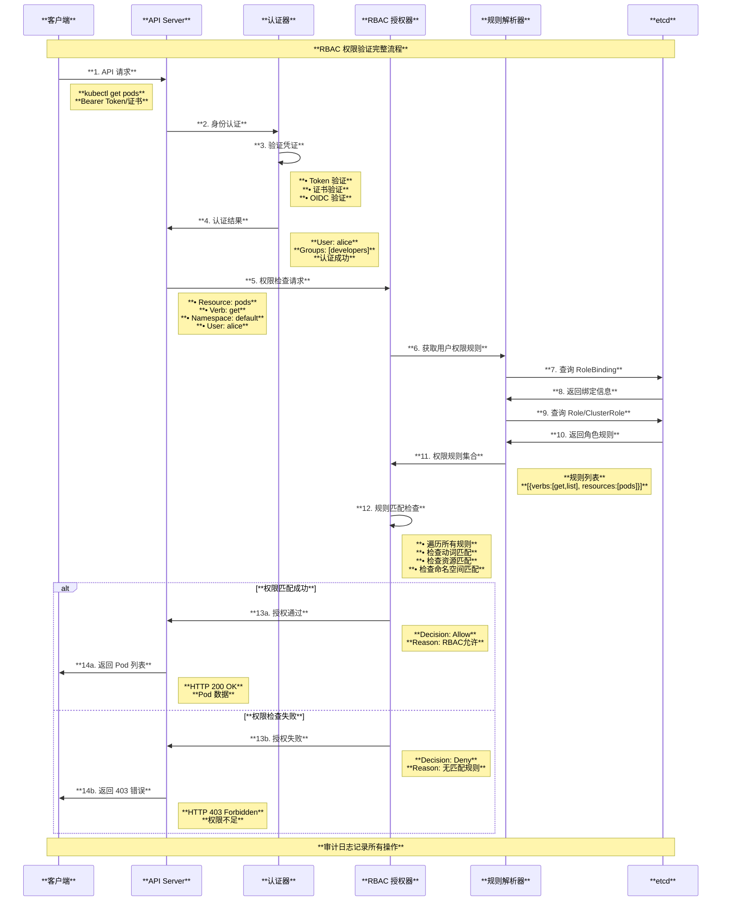
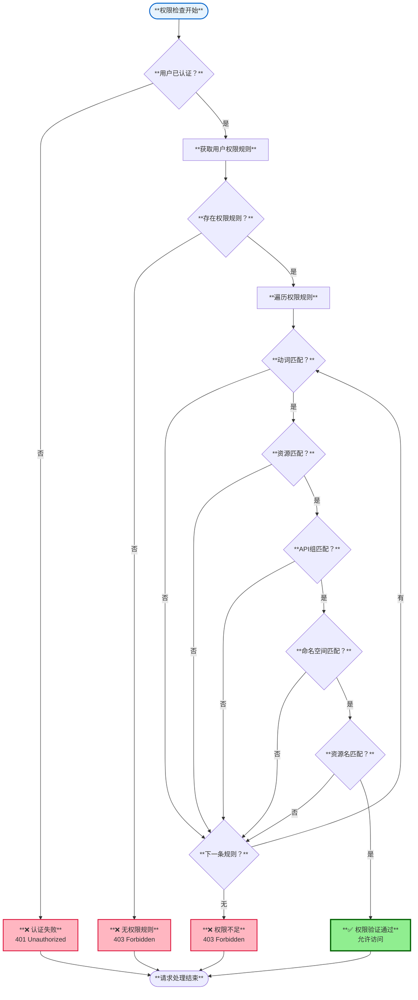
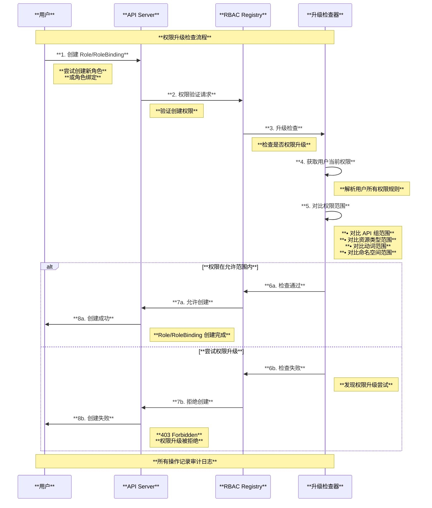

# Kubernetes RBAC 权限控制机制深度解读

## 目录

1. [概述](#概述)
2. [RBAC 核心概念](#rbac-核心概念)
3. [RBAC 整体架构](#rbac-整体架构)
4. [RBAC 资源类型](#rbac-资源类型)
5. [权限验证流程](#权限验证流程)
6. [内置角色与权限](#内置角色与权限)
7. [权限升级检查](#权限升级检查)
8. [最佳实践与使用场景](#最佳实践与使用场景)
9. [总结](#总结)

---

## 概述

RBAC（Role-Based Access Control，基于角色的访问控制）是 Kubernetes 的核心安全机制，用于控制用户和服务对集群资源的访问权限。RBAC 通过角色、角色绑定等抽象概念，实现了细粒度、可审计的权限管理体系。本文档基于 Kubernetes 源码深入解读 RBAC 的架构设计、工作原理和实现机制。

### 核心特性

- **基于角色的权限控制**：通过角色抽象简化权限管理
- **细粒度权限**：支持资源、动词、命名空间等多维度权限控制
- **权限继承**：支持角色聚合和权限继承机制
- **安全审计**：提供完整的权限验证和访问日志
- **可扩展性**：支持自定义角色和权限策略

---

## RBAC 核心概念

### 1. RBAC 四大组件关系

基于源码 `pkg/apis/rbac/types.go`：

```go
// Subject 表示用户、组或服务账号
type Subject struct {
    Kind      string // "User", "Group", "ServiceAccount"
    APIGroup  string // API 组
    Name      string // 名称
    Namespace string // 命名空间（ServiceAccount 需要）
}

// RoleRef 指向具体的角色
type RoleRef struct {
    APIGroup string // "rbac.authorization.k8s.io"
    Kind     string // "Role" 或 "ClusterRole"
    Name     string // 角色名称
}

// PolicyRule 定义具体的权限规则
type PolicyRule struct {
    Verbs         []string // 动词：get, list, create, update, delete
    APIGroups     []string // API 组
    Resources     []string // 资源类型
    ResourceNames []string // 特定资源名称
}
```

### 2. RBAC 核心架构图

```mermaid
graph TB
    subgraph "**RBAC 权限控制架构**"
        style subgraph fill:#f9f9f9,stroke:#333,stroke-width:2px
        
        subgraph "**身份认证层**"
            style subgraph fill:#e6f3ff,stroke:#0066cc,stroke-width:2px
            
            USER[**用户 (User)**<br/>• 人类用户<br/>• 外部认证<br/>• 证书认证<br/>• OIDC 集成]
            
            SA[**服务账号 (ServiceAccount)**<br/>• Pod 身份<br/>• Token 认证<br/>• 自动挂载<br/>• 命名空间隔离]
            
            GROUP[**用户组 (Group)**<br/>• 批量权限管理<br/>• 组织结构映射<br/>• 继承权限<br/>• 简化管理]
        end
        
        subgraph "**角色定义层**"
            style subgraph fill:#fff2e6,stroke:#cc6600,stroke-width:2px
            
            ROLE[**Role**<br/>• 命名空间级别<br/>• 权限规则集合<br/>• 资源操作权限<br/>• 局部范围]
            
            CLUSTER_ROLE[**ClusterRole**<br/>• 集群级别<br/>• 跨命名空间<br/>• 节点资源权限<br/>• 全局范围]
        end
        
        subgraph "**绑定关系层**"
            style subgraph fill:#e6ffe6,stroke:#009900,stroke-width:2px
            
            ROLE_BINDING[**RoleBinding**<br/>• 命名空间绑定<br/>• Subject → Role<br/>• 局部权限分配<br/>• 多主体支持]
            
            CLUSTER_ROLE_BINDING[**ClusterRoleBinding**<br/>• 集群绑定<br/>• Subject → ClusterRole<br/>• 全局权限分配<br/>• 系统级权限]
        end
        
        subgraph "**权限验证层**"
            style subgraph fill:#f0f8ff,stroke:#4169e1,stroke-width:2px
            
            RBAC_AUTHORIZER[**RBAC Authorizer**<br/>• 权限匹配<br/>• 规则解析<br/>• 决策引擎<br/>• 审计日志]
            
            RULE_RESOLVER[**Rule Resolver**<br/>• 权限规则收集<br/>• 角色聚合<br/>• 继承链解析<br/>• 缓存优化]
        end
        
        subgraph "**访问决策**"
            style subgraph fill:#ffe6f2,stroke:#cc0066,stroke-width:2px
            
            ALLOW[**允许访问**<br/>• 规则匹配成功<br/>• 记录审计日志<br/>• 继续请求处理<br/>• 返回成功]
            
            DENY[**拒绝访问**<br/>• 无匹配规则<br/>• 记录拒绝原因<br/>• 终止请求<br/>• 返回403错误]
        end
    end
    
    USER --> ROLE_BINDING
    SA --> ROLE_BINDING
    GROUP --> CLUSTER_ROLE_BINDING
    
    ROLE --> ROLE_BINDING
    CLUSTER_ROLE --> CLUSTER_ROLE_BINDING
    CLUSTER_ROLE --> ROLE_BINDING
    
    ROLE_BINDING --> RBAC_AUTHORIZER
    CLUSTER_ROLE_BINDING --> RBAC_AUTHORIZER
    
    RBAC_AUTHORIZER --> RULE_RESOLVER
    RULE_RESOLVER --> ALLOW
    RULE_RESOLVER --> DENY
    
    style USER fill:#87CEEB,stroke:#4682B4,stroke-width:2px
    style SA fill:#DDA0DD,stroke:#8B008B,stroke-width:2px
    style RBAC_AUTHORIZER fill:#90EE90,stroke:#006400,stroke-width:2px
    style ALLOW fill:#98FB98,stroke:#006400,stroke-width:2px
    style DENY fill:#FFB6C1,stroke:#DC143C,stroke-width:2px
```

---

## RBAC 整体架构

### 1. 权限验证时序图



---

## RBAC 资源类型

### 1. Role 与 ClusterRole

```yaml
# Role - 命名空间级别权限
apiVersion: rbac.authorization.k8s.io/v1
kind: Role
metadata:
  namespace: development
  name: pod-reader
rules:
- apiGroups: [""]
  resources: ["pods"]
  verbs: ["get", "watch", "list"]
- apiGroups: [""]
  resources: ["pods/log"]
  verbs: ["get"]

---
# ClusterRole - 集群级别权限  
apiVersion: rbac.authorization.k8s.io/v1
kind: ClusterRole
metadata:
  name: secret-reader
rules:
- apiGroups: [""]
  resources: ["secrets"]
  verbs: ["get", "watch", "list"]
- nonResourceURLs: ["/healthz", "/version"]
  verbs: ["get"]
```

### 2. RoleBinding 与 ClusterRoleBinding

```yaml
# RoleBinding - 将用户绑定到 Role
apiVersion: rbac.authorization.k8s.io/v1
kind: RoleBinding
metadata:
  name: read-pods
  namespace: development
subjects:
- kind: User
  name: alice
  apiGroup: rbac.authorization.k8s.io
- kind: ServiceAccount
  name: pod-reader-sa
  namespace: development
roleRef:
  kind: Role
  name: pod-reader
  apiGroup: rbac.authorization.k8s.io

---
# ClusterRoleBinding - 将用户绑定到 ClusterRole
apiVersion: rbac.authorization.k8s.io/v1
kind: ClusterRoleBinding
metadata:
  name: read-secrets-global
subjects:
- kind: Group
  name: system:serviceaccounts
  apiGroup: rbac.authorization.k8s.io
roleRef:
  kind: ClusterRole
  name: secret-reader
  apiGroup: rbac.authorization.k8s.io
```

### 3. RBAC 资源关系图

```mermaid
graph TB
    subgraph "**RBAC 资源类型与关系**"
        style subgraph fill:#f9f9f9,stroke:#333,stroke-width:2px
        
        subgraph "**命名空间级别**"
            style subgraph fill:#e6f3ff,stroke:#0066cc,stroke-width:2px
            
            NS_RESOURCES[**命名空间资源**<br/>• Pods, Services<br/>• ConfigMaps, Secrets<br/>• Deployments<br/>• PersistentVolumeClaims]
            
            ROLE_NS[**Role**<br/>• 命名空间范围<br/>• 资源权限定义<br/>• 动词规则<br/>• 局部权限]
            
            ROLEBINDING[**RoleBinding**<br/>• Subject → Role<br/>• Subject → ClusterRole<br/>• 命名空间范围<br/>• 权限激活]
        end
        
        subgraph "**集群级别**"
            style subgraph fill:#fff2e6,stroke:#cc6600,stroke-width:2px
            
            CLUSTER_RESOURCES[**集群资源**<br/>• Nodes, PersistentVolumes<br/>• ClusterRoles<br/>• Namespaces<br/>• CustomResourceDefinitions]
            
            CLUSTERROLE[**ClusterRole**<br/>• 集群范围<br/>• 跨命名空间<br/>• 非资源URL<br/>• 全局权限]
            
            CLUSTERROLEBINDING[**ClusterRoleBinding**<br/>• Subject → ClusterRole<br/>• 集群范围<br/>• 全局权限激活<br/>• 系统权限]
        end
        
        subgraph "**主体类型**"
            style subgraph fill:#e6ffe6,stroke:#009900,stroke-width:2px
            
            SUBJECTS[**权限主体**<br/>• **User**: 人类用户<br/>• **Group**: 用户组<br/>• **ServiceAccount**: 服务账号]
        end
        
        subgraph "**权限规则**"
            style subgraph fill:#f0f8ff,stroke:#4169e1,stroke-width:2px
            
            POLICY_RULES[**PolicyRule 组成**<br/>• **APIGroups**: API组 ["", "apps", "extensions"]<br/>• **Resources**: 资源类型 ["pods", "services"]<br/>• **Verbs**: 动词 ["get", "list", "create"]<br/>• **ResourceNames**: 特定资源名<br/>• **NonResourceURLs**: 非资源URL]
        end
        
        subgraph "**绑定矩阵**"
            style subgraph fill:#ffe6f2,stroke:#cc0066,stroke-width:2px
            
            BINDING_MATRIX[**绑定组合**<br/>• **RoleBinding + Role**: 命名空间权限<br/>• **RoleBinding + ClusterRole**: 降级集群角色<br/>• **ClusterRoleBinding + ClusterRole**: 全局权限<br/>• **ClusterRoleBinding + Role**: ❌ 不支持]
        end
    end
    
    SUBJECTS --> ROLEBINDING
    SUBJECTS --> CLUSTERROLEBINDING
    
    ROLE_NS --> ROLEBINDING
    CLUSTERROLE --> ROLEBINDING
    CLUSTERROLE --> CLUSTERROLEBINDING
    
    ROLEBINDING --> NS_RESOURCES
    CLUSTERROLEBINDING --> CLUSTER_RESOURCES
    CLUSTERROLEBINDING --> NS_RESOURCES
    
    ROLE_NS --> POLICY_RULES
    CLUSTERROLE --> POLICY_RULES
    
    ROLEBINDING --> BINDING_MATRIX
    CLUSTERROLEBINDING --> BINDING_MATRIX
    
    style ROLE_NS fill:#90EE90,stroke:#006400,stroke-width:2px
    style CLUSTERROLE fill:#87CEEB,stroke:#4682B4,stroke-width:2px
    style SUBJECTS fill:#DDA0DD,stroke:#8B008B,stroke-width:2px
    style POLICY_RULES fill:#98FB98,stroke:#006400,stroke-width:2px
```

---

## 权限验证流程

### 1. RBAC 授权器实现

基于源码 `plugin/pkg/auth/authorizer/rbac/rbac.go`：

```go
// RBACAuthorizer 实现基于角色的访问控制
type RBACAuthorizer struct {
    authorizationRuleResolver RequestToRuleMapper
}

// Authorize 执行权限检查
func (r *RBACAuthorizer) Authorize(ctx context.Context, requestAttributes authorizer.Attributes) (authorizer.Decision, string, error) {
    
    rules, err := r.authorizationRuleResolver.RulesFor(requestAttributes.GetUser(), requestAttributes.GetNamespace())
    if err != nil {
        return authorizer.DecisionNoOpinion, "", err
    }

    if RulesAllow(requestAttributes, rules...) {
        return authorizer.DecisionAllow, "", nil
    }

    return authorizer.DecisionNoOpinion, "", nil
}

// RuleAllows 检查单个规则是否允许请求
func RuleAllows(requestAttributes authorizer.Attributes, rule *rbacv1.PolicyRule) bool {
    if requestAttributes.IsResourceRequest() {
        combinedResource := requestAttributes.GetResource()
        if len(requestAttributes.GetSubresource()) > 0 {
            combinedResource = requestAttributes.GetResource() + "/" + requestAttributes.GetSubresource()
        }

        return VerbMatches(rule, requestAttributes.GetVerb()) &&
            APIGroupMatches(rule, requestAttributes.GetAPIGroup()) &&
            ResourceMatches(rule, combinedResource, requestAttributes.GetSubresource()) &&
            ResourceNameMatches(rule, requestAttributes.GetName())
    }

    return VerbMatches(rule, requestAttributes.GetVerb()) &&
        NonResourceURLMatches(rule, requestAttributes.GetPath())
}
```

### 2. 权限检查决策树



---

## 内置角色与权限

### 1. Kubernetes 内置 ClusterRole

```mermaid
graph TB
    subgraph "**Kubernetes 内置角色体系**"
        style subgraph fill:#f9f9f9,stroke:#333,stroke-width:2px
        
        subgraph "**系统核心角色**"
            style subgraph fill:#e6f3ff,stroke:#0066cc,stroke-width:2px
            
            SYSTEM_ADMIN[**cluster-admin**<br/>• **权限**: 所有资源所有操作<br/>• **用途**: 集群超级管理员<br/>• **风险**: 最高权限<br/>• **使用**: 谨慎分配]
            
            SYSTEM_ANONYMOUS[**system:anonymous**<br/>• **权限**: 匿名用户权限<br/>• **用途**: 未认证用户<br/>• **范围**: 非常有限<br/>• **安全**: 默认拒绝]
        end
        
        subgraph "**用户操作角色**"
            style subgraph fill:#fff2e6,stroke:#cc6600,stroke-width:2px
            
            ADMIN_ROLE[**admin**<br/>• **权限**: 命名空间管理员<br/>• **范围**: 单个命名空间<br/>• **操作**: 所有资源 CRUD<br/>• **限制**: 不能修改角色权限]
            
            EDIT_ROLE[**edit**<br/>• **权限**: 编辑大部分资源<br/>• **范围**: 命名空间级别<br/>• **操作**: CRUD（除密钥和角色）<br/>• **适用**: 开发人员]
            
            VIEW_ROLE[**view**<br/>• **权限**: 只读权限<br/>• **范围**: 命名空间级别<br/>• **操作**: get, list, watch<br/>• **适用**: 只读用户]
        end
        
        subgraph "**系统组件角色**"
            style subgraph fill:#e6ffe6,stroke:#009900,stroke-width:2px
            
            SYSTEM_CONTROLLER[**system:controller:***<br/>• **kube-controller-manager**<br/>• **deployment-controller**<br/>• **replicaset-controller**<br/>• **job-controller**]
            
            SYSTEM_NODE[**system:node**<br/>• **权限**: 节点相关操作<br/>• **用途**: kubelet 使用<br/>• **范围**: 节点资源<br/>• **认证**: 节点证书]
            
            SYSTEM_DISCOVERY[**system:discovery**<br/>• **权限**: API 发现<br/>• **用途**: 客户端发现<br/>• **范围**: 非资源 URL<br/>• **公开**: 所有认证用户]
        end
        
        subgraph "**特殊用途角色**"
            style subgraph fill:#f0f8ff,stroke:#4169e1,stroke-width:2px
            
            SYSTEM_KUBE_PROXY[**system:kube-proxy**<br/>• **权限**: 网络代理权限<br/>• **用途**: kube-proxy 组件<br/>• **范围**: 服务、端点<br/>• **网络**: 节点网络管理]
            
            SYSTEM_KUBE_DNS[**system:kube-dns**<br/>• **权限**: DNS 解析权限<br/>• **用途**: CoreDNS/kube-dns<br/>• **范围**: 服务、端点<br/>• **服务**: DNS 查询]
        end
        
        subgraph "**聚合角色特性**"
            style subgraph fill:#ffe6f2,stroke:#cc0066,stroke-width:2px
            
            AGGREGATION[**角色聚合**<br/>• **edit** 聚合到 **admin**<br/>• **view** 聚合到 **edit**<br/>• 自动权限继承<br/>• 简化权限管理]
        end
    end
    
    SYSTEM_ADMIN --> AGGREGATION
    ADMIN_ROLE --> AGGREGATION
    EDIT_ROLE --> AGGREGATION
    VIEW_ROLE --> AGGREGATION
    
    SYSTEM_CONTROLLER --> SYSTEM_NODE
    SYSTEM_NODE --> SYSTEM_DISCOVERY
    
    style SYSTEM_ADMIN fill:#FFB6C1,stroke:#DC143C,stroke-width:3px
    style ADMIN_ROLE fill:#90EE90,stroke:#006400,stroke-width:2px
    style EDIT_ROLE fill:#87CEEB,stroke:#4682B4,stroke-width:2px
    style VIEW_ROLE fill:#98FB98,stroke:#006400,stroke-width:2px
```

### 2. 权限级别对比

```yaml
# cluster-admin - 超级管理员（慎用）
rules:
- apiGroups: ["*"]
  resources: ["*"]
  verbs: ["*"]
- nonResourceURLs: ["*"]
  verbs: ["*"]

# admin - 命名空间管理员
rules:
- apiGroups: [""]
  resources: ["*"]
  verbs: ["*"]
- apiGroups: ["apps", "extensions"]
  resources: ["*"]
  verbs: ["*"]
# 不包括 roles, rolebindings 的创建权限

# edit - 编辑权限
rules:
- apiGroups: [""]
  resources: ["pods", "services", "configmaps"]
  verbs: ["get", "list", "create", "update", "patch", "delete"]
# 不包括 secrets 的访问权限

# view - 只读权限
rules:
- apiGroups: [""]
  resources: ["pods", "services", "configmaps"]
  verbs: ["get", "list", "watch"]
# 只有查看权限，无修改权限
```

---

## 权限升级检查

### 1. 权限升级保护机制

Kubernetes 具有防止权限升级的保护机制，防止用户创建比自己权限更大的角色或绑定。

基于源码 `pkg/registry/rbac/escalation_check.go`：

```go
// 检查权限升级的接口
type EscalationAllowedChecker interface {
    IsEscalationAllowed(user user.Info) bool
}

// 权限升级检查
func ConfirmNoEscalation(ctx context.Context, ruleResolver rbacvalidation.RequestToRuleResolver, user user.Info, rules []rbacv1.PolicyRule) error {
    
    // 获取用户当前权限
    userRules, err := ruleResolver.RulesFor(user, "")
    if err != nil {
        return err
    }

    // 检查是否尝试获得超出当前权限的规则
    for _, rule := range rules {
        if !ruleCovers(userRules, rule) {
            return fmt.Errorf("权限升级被拒绝：用户 %q 无法创建具有更高权限的角色", user.GetName())
        }
    }

    return nil
}
```

### 2. 权限升级检查流程



---

## 最佳实践与使用场景

### 1. 权限设计原则

```mermaid
graph TB
    subgraph "**RBAC 权限设计最佳实践**"
        style subgraph fill:#f9f9f9,stroke:#333,stroke-width:2px
        
        subgraph "**最小权限原则**"
            style subgraph fill:#e6f3ff,stroke:#0066cc,stroke-width:2px
            
            LEAST_PRIVILEGE[**最小权限原则**<br/>• 仅授予必要权限<br/>• 定期权限审核<br/>• 避免过度权限<br/>• 权限最小化]
        end
        
        subgraph "**角色分离**"
            style subgraph fill:#fff2e6,stroke:#cc6600,stroke-width:2px
            
            ROLE_SEPARATION[**职责分离**<br/>• **开发人员**: edit 权限<br/>• **运维人员**: admin 权限<br/>• **只读用户**: view 权限<br/>• **系统组件**: 专用角色]
        end
        
        subgraph "**命名空间隔离**"
            style subgraph fill:#e6ffe6,stroke:#009900,stroke-width:2px
            
            NAMESPACE_ISOLATION[**命名空间隔离**<br/>• 按环境隔离权限<br/>• dev/staging/prod<br/>• 团队权限边界<br/>• 资源访问控制]
        end
        
        subgraph "**审计与监控**"
            style subgraph fill:#f0f8ff,stroke:#4169e1,stroke-width:2px
            
            AUDIT_MONITORING[**审计监控**<br/>• 启用审计日志<br/>• 权限使用监控<br/>• 异常访问告警<br/>• 定期权限评估]
        end
        
        subgraph "**自动化管理**"
            style subgraph fill:#ffe6f2,stroke:#cc0066,stroke-width:2px
            
            AUTOMATION[**自动化权限管理**<br/>• GitOps 权限管理<br/>• RBAC 配置即代码<br/>• 自动权限同步<br/>• 版本控制管理]
        end
        
        subgraph "**安全加固**"
            style subgraph fill:#f5f5dc,stroke:#daa520,stroke-width:2px
            
            SECURITY_HARDENING[**安全加固措施**<br/>• 禁用匿名访问<br/>• 强制认证<br/>• 网络策略配合<br/>• 准入控制集成]
        end
    end
    
    LEAST_PRIVILEGE --> ROLE_SEPARATION
    ROLE_SEPARATION --> NAMESPACE_ISOLATION
    NAMESPACE_ISOLATION --> AUDIT_MONITORING
    AUDIT_MONITORING --> AUTOMATION
    AUTOMATION --> SECURITY_HARDENING
    
    style LEAST_PRIVILEGE fill:#90EE90,stroke:#006400,stroke-width:2px
    style ROLE_SEPARATION fill:#87CEEB,stroke:#4682B4,stroke-width:2px
    style NAMESPACE_ISOLATION fill:#DDA0DD,stroke:#8B008B,stroke-width:2px
    style AUDIT_MONITORING fill:#98FB98,stroke:#006400,stroke-width:2px
```

### 2. 典型使用场景配置

#### **开发团队权限配置**

```yaml
# 开发团队 ClusterRole
apiVersion: rbac.authorization.k8s.io/v1
kind: ClusterRole
metadata:
  name: developer
rules:
- apiGroups: [""]
  resources: ["pods", "services", "configmaps"]
  verbs: ["get", "list", "watch", "create", "update", "patch", "delete"]
- apiGroups: ["apps"]
  resources: ["deployments", "replicasets"]
  verbs: ["get", "list", "watch", "create", "update", "patch", "delete"]
- apiGroups: [""]
  resources: ["pods/log", "pods/exec"]
  verbs: ["get", "create"]

---
# 绑定到开发命名空间
apiVersion: rbac.authorization.k8s.io/v1
kind: RoleBinding
metadata:
  name: developers
  namespace: development
subjects:
- kind: Group
  name: development-team
  apiGroup: rbac.authorization.k8s.io
roleRef:
  kind: ClusterRole
  name: developer
  apiGroup: rbac.authorization.k8s.io
```

#### **监控系统权限配置**

```yaml
# 监控系统专用 ServiceAccount
apiVersion: v1
kind: ServiceAccount
metadata:
  name: prometheus
  namespace: monitoring

---
# 监控权限 ClusterRole
apiVersion: rbac.authorization.k8s.io/v1
kind: ClusterRole
metadata:
  name: prometheus
rules:
- apiGroups: [""]
  resources: ["nodes", "nodes/proxy", "services", "endpoints", "pods"]
  verbs: ["get", "list", "watch"]
- apiGroups: [""]
  resources: ["configmaps"]
  verbs: ["get"]
- nonResourceURLs: ["/metrics"]
  verbs: ["get"]

---
# 集群级别绑定
apiVersion: rbac.authorization.k8s.io/v1
kind: ClusterRoleBinding
metadata:
  name: prometheus
roleRef:
  apiGroup: rbac.authorization.k8s.io
  kind: ClusterRole
  name: prometheus
subjects:
- kind: ServiceAccount
  name: prometheus
  namespace: monitoring
```

---

## 总结

RBAC 是 Kubernetes 安全体系的核心组件，通过角色、绑定等抽象概念实现了灵活、细粒度的权限控制。它不仅保障了集群的安全性，还为多租户、多团队的协作提供了强有力的权限管理基础。

### 核心价值

1. **安全保障**：细粒度的权限控制确保资源访问安全
2. **管理简化**：基于角色的抽象简化了权限管理复杂度  
3. **审计追踪**：完整的权限验证和访问日志支持合规要求
4. **灵活扩展**：支持自定义角色和复杂的权限策略
5. **多租户支持**：命名空间级别的权限隔离支持多租户架构

### 技术特点

- **声明式权限管理**：通过 YAML 定义权限规则和绑定关系
- **权限继承与聚合**：支持角色聚合和权限继承机制
- **防升级保护**：内置权限升级检查防止权限滥用
- **高性能授权**：优化的规则匹配和缓存机制
- **标准化 API**：符合 Kubernetes API 规范的权限管理

RBAC 的正确实施对 Kubernetes 集群的安全运营至关重要，通过遵循最小权限原则、角色分离、定期审计等最佳实践，可以构建安全、可管理的权限体系。

