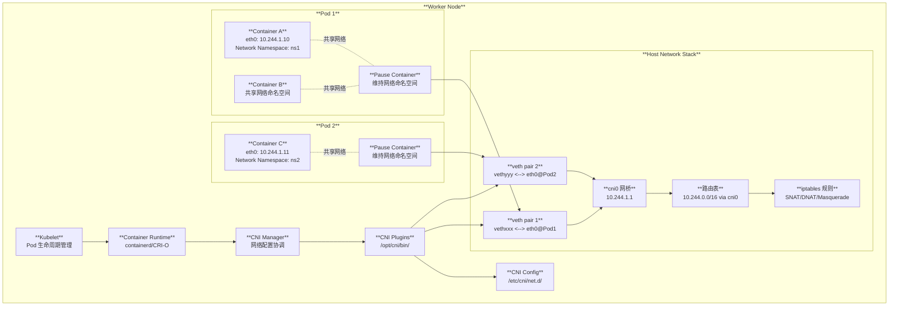
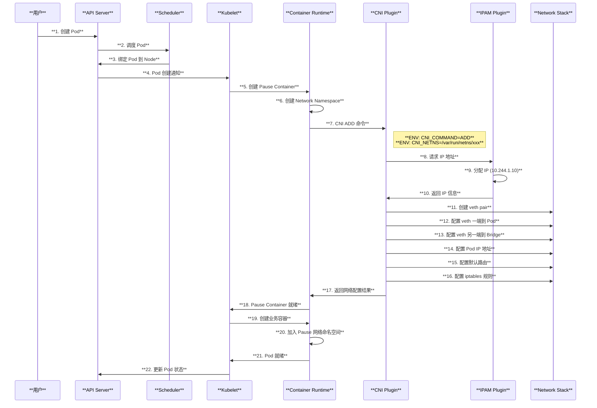
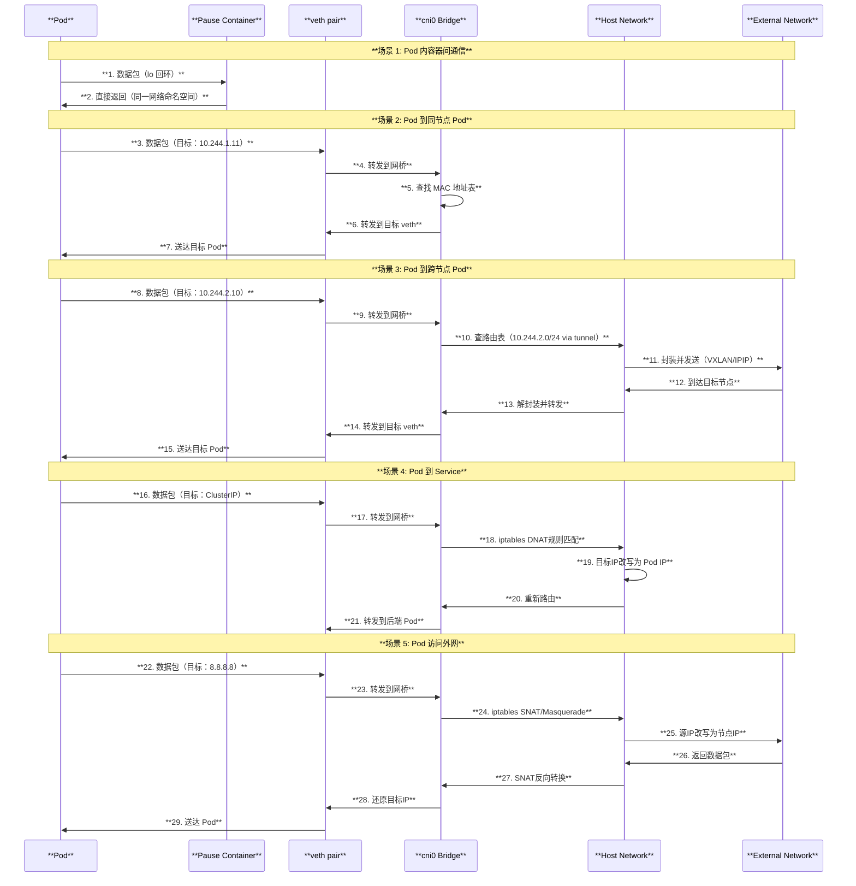
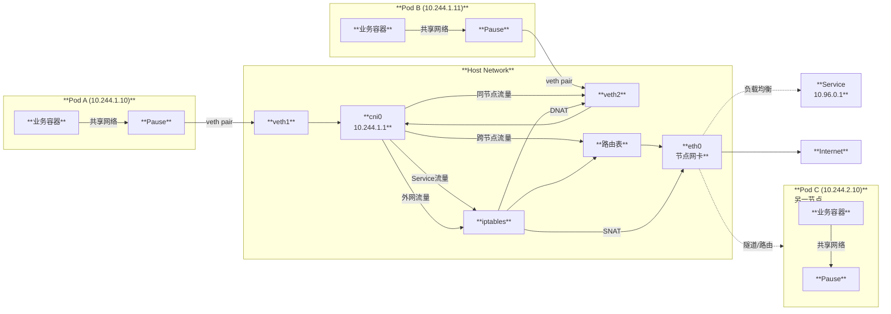
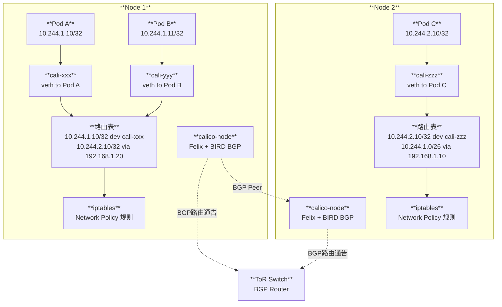
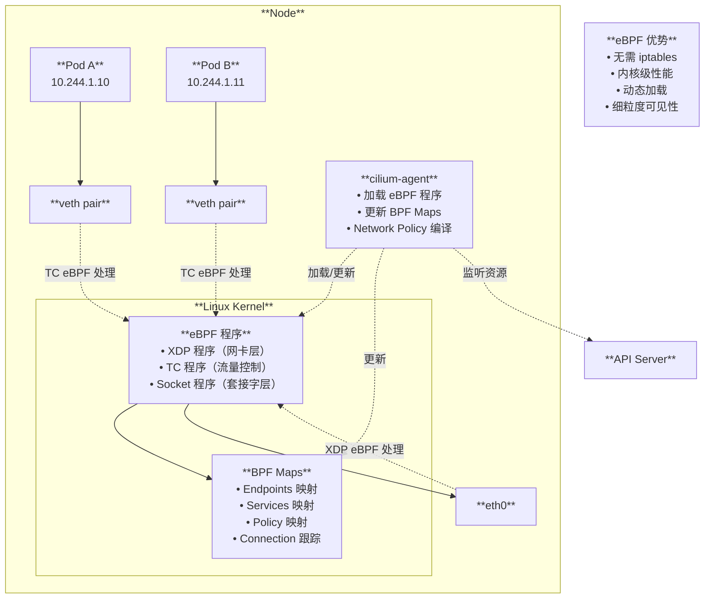
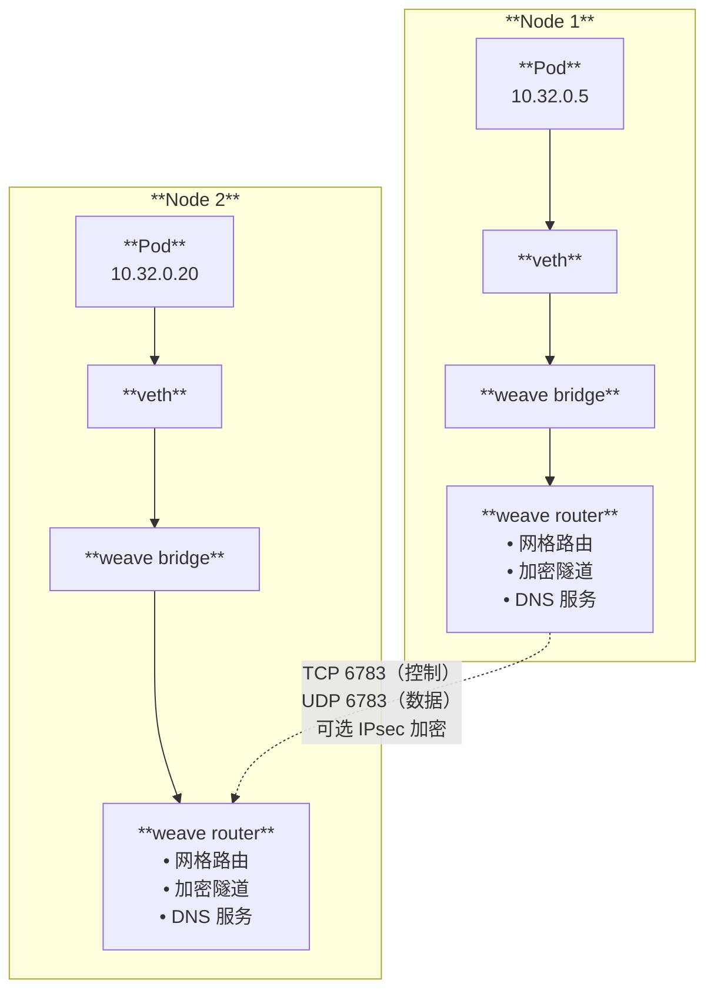
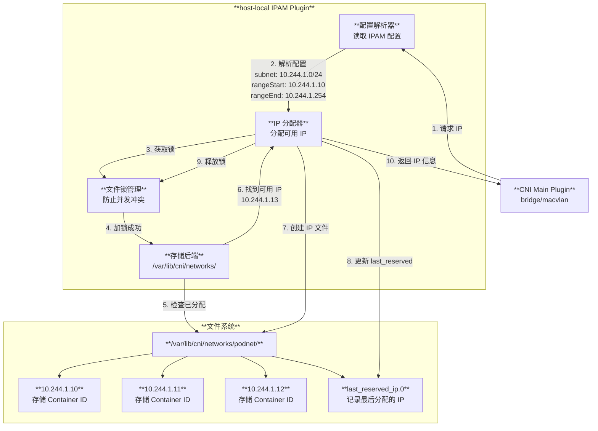
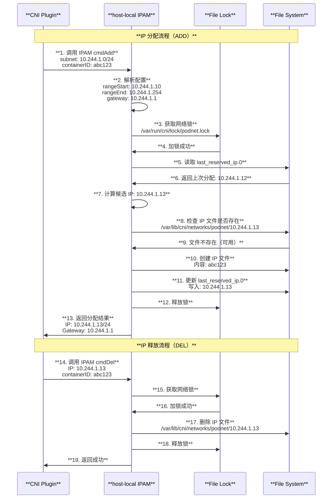

# Kubernetes CNI (Container Network Interface) 架构与原理深度解读

## 目录

1. [概述](#概述)
2. [CNI 核心概念](#cni-核心概念)
3. [CNI 整体架构图](#cni-整体架构图)
4. [CNI 规范与接口定义](#cni-规范与接口定义)
5. [CNI 插件分类体系](#cni-插件分类体系)
6. [CNI 配置文件格式](#cni-配置文件格式)
7. [CNI 工作流程详解](#cni-工作流程详解)
8. [CNI 与 Kubernetes 集成](#cni-与-kubernetes-集成)
9. [主流 CNI 插件深度分析](#主流-cni-插件深度分析)
10. [CNI 网络策略实现](#cni-网络策略实现)
11. [CNI 性能优化与调优](#cni-性能优化与调优)
12. [故障排除与监控](#故障排除与监控)
13. [总结](#总结)

---

## 概述

Container Network Interface (CNI) 是 Kubernetes 中用于配置容器网络的标准接口规范。它定义了容器运行时与网络插件之间的接口标准，使得不同的网络解决方案能够以插件化的方式与 Kubernetes 集成。

### 核心特性

- **标准化接口**：定义了统一的网络配置接口规范
- **插件化架构**：支持多种网络实现方案
- **链式执行**：支持多个插件的组合使用
- **跨平台支持**：支持 Linux、Windows 等多种操作系统

---

## CNI 核心概念

### 1. CNI 规范组件

根据源码分析，CNI 系统包含以下核心组件：

- **CNI 库**：提供标准的网络配置接口
- **CNI 插件**：实现具体网络功能的可执行程序
- **CNI 配置**：描述网络配置的 JSON 文件
- **容器运行时**：调用 CNI 插件进行网络配置

### 2. CNI 操作类型

```bash
# CNI 支持的基本操作
CNI_COMMAND=ADD     # 添加网络接口
CNI_COMMAND=DEL     # 删除网络接口  
CNI_COMMAND=CHECK   # 检查网络状态
CNI_COMMAND=VERSION # 查询版本信息
```

### 3. CNI 插件路径

```bash
# 标准 CNI 插件位置
/opt/cni/bin/               # CNI 插件二进制文件
/etc/cni/net.d/             # CNI 配置文件目录
/var/lib/cni/networks/      # CNI 网络状态存储
/var/lib/cni/results/       # CNI 执行结果缓存
```

---

## CNI 整体架构图

### 3.1 Pod 维度网络架构图



上方的架构图展示了 CNI 在 Kubernetes 集群中的完整架构，包括：

1. **控制平面组件**：API Server、Controller Manager 等
2. **节点组件**：Kubelet、Container Runtime、CNI Manager
3. **网络组件**：CNI 插件、Linux Bridge、iptables 等
4. **Pod 网络**：每个 Pod 的网络配置和 IP 分配
5. **Pod 内部**：Pause Container、共享网络命名空间、veth pair 连接

---

## CNI 规范与接口定义

### 1. CNI 接口规范

基于 CNI 规范 v1.0.0，CNI 插件必须实现以下接口：

```go
// CNI 插件接口定义（伪代码）
type CNIPlugin interface {
    // 添加网络接口
    Add(args *skel.CmdArgs) error
    // 删除网络接口
    Del(args *skel.CmdArgs) error  
    // 检查网络状态
    Check(args *skel.CmdArgs) error
    // 查询版本信息
    Version() (version.PluginInfo, error)
}
```

### 2. 环境变量传递

CNI 插件通过环境变量接收参数：

```bash
# 必需的环境变量
CNI_COMMAND=ADD                    # 操作命令
CNI_CONTAINERID=abcd1234           # 容器 ID
CNI_NETNS=/proc/123/ns/net         # 网络命名空间路径
CNI_IFNAME=eth0                    # 接口名称
CNI_PATH=/opt/cni/bin              # CNI 插件路径

# 可选的环境变量
CNI_ARGS=KEY1=VAL1;KEY2=VAL2       # 额外参数
```

### 3. 输入输出格式

CNI 插件通过标准输入接收配置，通过标准输出返回结果：

```json
// 输入：网络配置 (stdin)
{
  "cniVersion": "1.0.0",
  "name": "example-network",
  "type": "bridge",
  "bridge": "cni0",
  "isDefaultGateway": true,
  "ipMasq": true,
  "ipam": {
    "type": "host-local",
    "subnet": "10.244.0.0/16"
  }
}

// 输出：执行结果 (stdout)
{
  "cniVersion": "1.0.0",
  "interfaces": [
    {
      "name": "cni0",
      "mac": "00:11:22:33:44:55"
    },
    {
      "name": "veth12345678",
      "mac": "aa:bb:cc:dd:ee:ff"
    },
    {
      "name": "eth0",
      "mac": "02:42:ac:11:00:02",
      "sandbox": "/proc/123/ns/net"
    }
  ],
  "ips": [
    {
      "interface": 2,
      "address": "10.244.1.100/16",
      "gateway": "10.244.1.1"
    }
  ]
}
```

---

## CNI 插件分类体系

CNI 插件分类图展示了完整的插件生态：

### 1. 主插件 (Main Plugins)

**Bridge Plugin**：
- 创建 Linux bridge 设备
- 连接 veth pair 到 bridge
- 提供 L2 网络连接

**MacVLAN Plugin**：
- 基于 MAC 地址的虚拟化
- 直接连接到物理网络
- 高性能，但有 MAC 地址限制

**IPVLAN Plugin**：
- 基于 IP 地址的虚拟化
- 共享物理接口的 MAC 地址
- 支持 L2/L3 模式

### 2. IPAM 插件 (IP Address Management)

**host-local**：
```json
{
  "type": "host-local",
  "ranges": [
    [{
      "subnet": "10.244.1.0/24",
      "rangeStart": "10.244.1.10",
      "rangeEnd": "10.244.1.200",
      "gateway": "10.244.1.1"
    }]
  ],
  "routes": [
    {"dst": "0.0.0.0/0"}
  ]
}
```

**DHCP**：
```json
{
  "type": "dhcp"
}
```

### 3. Meta 插件 (辅助插件)

**Portmap Plugin**：
```json
{
  "type": "portmap",
  "capabilities": {"portMappings": true},
  "externalSetMarkChain": "KUBE-MARK-MASQ"
}
```

**Bandwidth Plugin**：
```json
{
  "type": "bandwidth",
  "ingressRate": 1000000,    // 1Mbps
  "egressRate": 1000000      // 1Mbps
}
```

---

## CNI 配置文件格式

### 1. 简单配置格式 (.conf)

基于源码 `test/e2e_node/remote/utils.go` 中的配置示例：

```json
{
  "name": "mynet",
  "type": "bridge",
  "bridge": "mynet0",
  "isDefaultGateway": true,
  "forceAddress": false,
  "ipMasq": true,
  "hairpinMode": true,
  "ipam": {
    "type": "host-local",
    "subnet": "10.10.0.0/16"
  }
}
```

### 2. 插件链配置格式 (.conflist)

基于 Calico DaemonSet 配置：

```json
{
  "name": "k8s-pod-network",
  "cniVersion": "0.3.1",
  "plugins": [
    {
      "type": "calico",
      "log_level": "info",
      "datastore_type": "kubernetes",
      "nodename": "__KUBERNETES_NODE_NAME__",
      "ipam": {
        "type": "host-local",
        "subnet": "usePodCidr"
      },
      "policy": {
        "type": "k8s"
      },
      "kubernetes": {
        "kubeconfig": "/etc/cni/net.d/calico-kubeconfig"
      }
    },
    {
      "type": "portmap",
      "capabilities": {"portMappings": true},
      "snat": true
    }
  ]
}
```

### 3. Windows CNI 配置

基于 Windows 节点的 CNI 配置：

```json
{
  "cniVersion": "0.2.0",
  "name": "l2bridge",
  "type": "sdnbridge",
  "master": "Ethernet",
  "capabilities": {
    "portMappings": true,
    "dns": true
  },
  "ipam": {
    "subnet": "10.244.1.0/24",
    "routes": [{"GW": "10.244.1.1"}]
  },
  "dns": {
    "Nameservers": ["10.96.0.10"],
    "Search": ["default.svc.cluster.local"]
  }
}
```

---

## CNI 工作流程详解

### 1. CNI 功能完整时序图



### 2. CNI 与 Pod 交互时序图



### 3. 日常网络流转图



### 4. Pod 网络创建流程

网络创建序列图展示了完整的创建过程：

1. **Kubelet 触发**：Pod 调度到节点后，Kubelet 调用容器运行时
2. **容器创建**：容器运行时创建容器和网络命名空间
3. **CNI 调用**：容器运行时调用 CNI Manager 设置网络
4. **配置解析**：CNI Manager 读取和解析配置文件
5. **插件执行**：按顺序执行插件链中的每个插件
6. **网络配置**：配置网络接口、IP 地址、路由等
7. **状态返回**：返回网络配置结果给容器运行时

### 2. Pod 网络删除流程

网络删除序列图展示了清理过程：

1. **删除触发**：Pod 删除时，Kubelet 调用容器运行时停止容器
2. **网络清理**：容器运行时调用 CNI Manager 清理网络
3. **反向执行**：按相反顺序执行插件链清理操作
4. **资源释放**：释放 IP 地址、删除网络接口、清理规则
5. **状态清理**：删除网络状态缓存和配置文件

### 3. CNI 插件执行机制

```bash
# CNI 插件调用示例
#!/bin/bash
export CNI_COMMAND=ADD
export CNI_CONTAINERID=abc123
export CNI_NETNS=/proc/1234/ns/net
export CNI_IFNAME=eth0
export CNI_PATH=/opt/cni/bin

echo '{
  "cniVersion": "1.0.0",
  "name": "mynet",
  "type": "bridge",
  "bridge": "cni0",
  "ipam": {
    "type": "host-local",
    "subnet": "10.244.1.0/24"
  }
}' | /opt/cni/bin/bridge
```

---

## CNI 与 Kubernetes 集成

### 1. Kubelet CNI 集成

基于源码 `pkg/kubelet/kubelet_network.go`：

```go
// Kubelet 网络管理接口
func (kl *Kubelet) updatePodCIDR(ctx context.Context, cidr string) (bool, error) {
    // 更新 Pod CIDR 到容器运行时
    if err := kl.getRuntime().UpdatePodCIDR(ctx, cidr); err != nil {
        return true, fmt.Errorf("failed to update pod CIDR: %v", err)
    }
    klog.InfoS("Updating Pod CIDR", "originalPodCIDR", podCIDR, "newPodCIDR", cidr)
    kl.runtimeState.setPodCIDR(cidr)
    return true, nil
}
```

### 2. 容器运行时集成

基于 containerd 的 CNI 配置：

```toml
# /etc/containerd/config.toml
[plugins."io.containerd.grpc.v1.cri".cni]
  bin_dir = "/opt/cni/bin"
  conf_dir = "/etc/cni/net.d"
  conf_template = "/etc/cni/net.d/cni.template"
```

### 3. CNI 插件安装

基于源码中的安装脚本：

```bash
# 安装 CNI 插件
function install_cni {
  # 下载 CNI 插件二进制文件
  curl -L "https://github.com/containernetworking/plugins/releases/download/${CNI_VERSION}/cni-plugins-linux-amd64-${CNI_VERSION}.tgz" | \
    tar -C /opt/cni/bin -xz
  
  # 创建基本 CNI 配置
  mkdir -p /etc/cni/net.d
  cat > /etc/cni/net.d/10-containerd-net.conflist << EOF
{
  "cniVersion": "1.0.0",
  "name": "containerd-net",
  "plugins": [
    {
      "type": "bridge",
      "bridge": "cni0",
      "isGateway": true,
      "ipMasq": true,
      "ipam": {
        "type": "host-local",
        "ranges": [[{"subnet": "10.88.0.0/16"}]],
        "routes": [{"dst": "0.0.0.0/0"}]
      }
    },
    {
      "type": "portmap",
      "capabilities": {"portMappings": true}
    }
  ]
}
EOF
}
```

---

## 主流 CNI 插件深度分析

### 1. 常用 CNI 插件工作原理图

#### 1.1 Flannel VXLAN 模式工作原理

```mermaid
graph TB
    subgraph Node1 ["**Node 1 (192.168.1.10)**"]
        Pod1[**Pod A**<br/>10.244.1.10]
        Veth1[**veth pair**]
        Bridge1[**cni0**<br/>10.244.1.1]
        Flannel1[**flanneld**<br/>管理 VXLAN]
        VTEP1[**flannel.1**<br/>VTEP 设备<br/>MAC: aa:bb:cc:dd:ee:01]
        Eth1[**eth0**<br/>192.168.1.10]
    end
    
    subgraph Node2 ["**Node 2 (192.168.1.20)**"]
        Pod2[**Pod B**<br/>10.244.2.10]
        Veth2[**veth pair**]
        Bridge2[**cni0**<br/>10.244.2.1]
        Flannel2[**flanneld**<br/>管理 VXLAN]
        VTEP2[**flannel.1**<br/>VTEP 设备<br/>MAC: aa:bb:cc:dd:ee:02]
        Eth2[**eth0**<br/>192.168.1.20]
    end
    
    Etcd[**etcd**<br/>存储网络配置]
    
    Pod1 -->|1. 数据包| Veth1
    Veth1 --> Bridge1
    Bridge1 -->|2. 路由查找| VTEP1
    VTEP1 -->|3. VXLAN 封装<br/>Outer IP: 192.168.1.10->192.168.1.20<br/>Inner IP: 10.244.1.10->10.244.2.10| Eth1
    
    Eth1 -.4. UDP 8472 隧道.-> Eth2
    
    Eth2 -->|5. VXLAN 解封装| VTEP2
    VTEP2 --> Bridge2
    Bridge2 --> Veth2
    Veth2 -->|6. 送达| Pod2
    
    Flannel1 -.监听配置.-> Etcd
    Flannel2 -.监听配置.-> Etcd
```

#### 1.2 Calico BGP 模式工作原理



#### 1.3 Cilium eBPF 模式工作原理



#### 1.4 Weave Net 工作原理



### 2. host-local IPAM 管理功能架构图



### 3. host-local IPAM 分配时序图



### 4. Calico CNI

**架构特点**：
- BGP 路由协议
- eBPF 数据平面（可选）
- 网络策略支持
- IPIP/VXLAN 隧道模式

**配置示例**：
```json
{
  "type": "calico",
  "log_level": "info",
  "datastore_type": "kubernetes",
  "nodename": "worker-1",
  "mtu": 1440,
  "ipam": {
    "type": "calico-ipam"
  },
  "policy": {
    "type": "k8s"
  },
  "kubernetes": {
    "kubeconfig": "/etc/cni/net.d/calico-kubeconfig"
  }
}
```

### 2. Flannel CNI

**架构特点**：
- VXLAN 隧道网络
- 简单配置和部署
- 适合小规模集群
- 不支持网络策略

**配置示例**：
```json
{
  "type": "flannel",
  "delegate": {
    "hairpinMode": true,
    "bridge": "cni0"
  }
}
```

### 3. AWS VPC CNI

**架构特点**：
- 原生 VPC 集成
- ENI 管理
- 安全组支持
- IPv4/IPv6 双栈

**配置示例**：
```json
{
  "type": "aws-cni",
  "vethPrefix": "eni",
  "mtu": 9001,
  "pluginLogFile": "/var/log/aws-routed-eni/plugin.log",
  "pluginLogLevel": "DEBUG"
}
```

---

## CNI 网络策略实现

### 1. Kubernetes NetworkPolicy

```yaml
apiVersion: networking.k8s.io/v1
kind: NetworkPolicy
metadata:
  name: web-netpol
  namespace: default
spec:
  podSelector:
    matchLabels:
      role: web
  policyTypes:
  - Ingress
  - Egress
  ingress:
  - from:
    - podSelector:
        matchLabels:
          role: frontend
    ports:
    - protocol: TCP
      port: 8080
```

### 2. CNI 策略实现

**iptables 实现**：
```bash
# Calico 生成的 iptables 规则示例
-A cali-pi-_xxx -m conntrack --ctstate RELATED,ESTABLISHED -j ACCEPT
-A cali-pi-_xxx -m conntrack --ctstate INVALID -j DROP
-A cali-pi-_xxx -p tcp --dport 8080 -m mark --mark 0x1000000/0x1000000 -j ACCEPT
-A cali-pi-_xxx -j DROP
```

**eBPF 实现**：
```c
// Cilium eBPF 程序示例（简化）
SEC("ingress")
int ingress_policy(struct __sk_buff *skb) {
    struct endpoint_info *ep = lookup_endpoint(skb);
    if (!ep) return TC_ACT_OK;
    
    if (apply_l3_policy(skb, ep) == DENY) {
        return TC_ACT_SHOT;
    }
    
    return TC_ACT_OK;
}
```

---

## CNI 性能优化与调优

### 1. 网络性能优化

**MTU 优化**：
```json
{
  "type": "bridge",
  "mtu": 1500,          // 根据网络环境调整
  "bridge": "cni0"
}
```

**多队列支持**：
```bash
# 启用网络接口多队列
ethtool -L eth0 combined 4
```

**CPU 亲和性**：
```bash
# 设置网络中断 CPU 亲和性
echo 2 > /proc/irq/24/smp_affinity
```

### 2. IPAM 性能优化

**本地 IPAM 缓存**：
```json
{
  "type": "host-local",
  "ranges": [
    [{"subnet": "10.244.1.0/24"}]
  ],
  "dataDir": "/var/lib/cni/networks"  // 本地存储
}
```

**IP 池预分配**：
```yaml
# Calico IP Pool
apiVersion: projectcalico.org/v3
kind: IPPool
metadata:
  name: default-ipv4-ippool
spec:
  cidr: 10.244.0.0/16
  blockSize: 24        # 每个节点分配 /24 子网
  ipipMode: Always     # IPIP 隧道模式
```

### 3. 网络监控指标

**CNI 指标收集**：
```bash
# CNI 插件执行时间
histogram_observe(cni_operation_duration_seconds, duration, 
                 {operation="ADD", plugin="bridge"})

# IP 地址分配情况  
gauge_set(cni_ip_addresses_total, count,
          {pool="default", status="allocated"})

# 网络策略规则数量
gauge_set(cni_network_policy_rules_total, count,
          {node="worker-1"})
```

---

## 故障排除与监控

### 1. 常见问题诊断

**CNI 配置问题**：
```bash
# 检查 CNI 配置
ls -la /etc/cni/net.d/
cat /etc/cni/net.d/*.conf*

# 检查 CNI 插件
ls -la /opt/cni/bin/
/opt/cni/bin/bridge --version
```

**网络连通性问题**：
```bash
# 检查网络接口
ip link show
ip addr show

# 检查路由表
ip route show
ip route show table local

# 检查 iptables 规则
iptables -t nat -L -n -v
iptables -t filter -L -n -v
```

**Pod 网络故障**：
```bash
# 检查 Pod 网络命名空间
kubectl get pods -o wide
kubectl exec <pod> -- ip addr show
kubectl exec <pod> -- ip route show

# 检查 CNI 状态
find /var/lib/cni -name "*.json" -exec cat {} \;
```

### 2. 监控和日志

**CNI 日志配置**：
```json
{
  "type": "bridge",
  "cniVersion": "1.0.0",
  "logFile": "/var/log/cni.log",
  "logLevel": "debug"
}
```

**Prometheus 监控**：
```yaml
# CNI 监控指标
- name: cni_operation_duration_seconds
  help: "CNI operation duration in seconds"
  type: histogram
  
- name: cni_operation_total  
  help: "Total CNI operations"
  type: counter
  
- name: cni_ip_addresses_allocated
  help: "Number of allocated IP addresses"  
  type: gauge
```

### 3. 性能基准测试

**网络延迟测试**：
```bash
# Pod to Pod 延迟测试
kubectl run test-1 --image=busybox --rm -it -- sh
kubectl run test-2 --image=busybox --rm -it -- sh

# 在 test-1 中执行
ping -c 10 <test-2-ip>
```

**网络带宽测试**：
```bash
# 使用 iperf3 测试带宽
# Server 端
kubectl run iperf3-server --image=networkstatic/iperf3 --rm -it -- \
  iperf3 -s

# Client 端  
kubectl run iperf3-client --image=networkstatic/iperf3 --rm -it -- \
  iperf3 -c <server-ip> -t 30
```

---

## 总结

### 🔑 **核心要点**

1. **标准化接口**：CNI 提供了统一的容器网络配置标准，使得不同网络方案能够无缝集成到 Kubernetes 中

2. **插件化架构**：通过主插件、IPAM 插件和 Meta 插件的组合，构建灵活的网络解决方案

3. **链式执行**：支持多个插件的顺序执行，实现复杂的网络功能组合

4. **跨平台支持**：支持 Linux、Windows 等多种操作系统环境

### 🏆 **最佳实践**

- **选择合适的 CNI 插件**：根据集群规模、性能要求和功能需求选择
- **优化网络性能**：调整 MTU、启用多队列、优化 CPU 亲和性
- **监控网络状态**：建立完善的网络监控和告警机制
- **定期维护更新**：保持 CNI 插件和配置的及时更新

### 🎯 **适用场景**

- **生产环境**：使用 Calico、Cilium 等企业级 CNI 插件
- **开发测试**：使用 Bridge、Flannel 等简单易用的插件
- **云原生环境**：使用云厂商提供的原生 CNI 插件
- **边缘计算**：使用轻量级、低延迟的 CNI 解决方案

CNI 作为 Kubernetes 网络的核心接口标准，为云原生应用提供了强大而灵活的网络基础设施支撑。
