# Kubernetes ConfigMap 架构与原理深度解读

## 目录

1. [概述](#概述)
2. [ConfigMap 核心概念](#configmap-核心概念)
3. [ConfigMap 整体架构图](#configmap-整体架构图)
4. [ConfigMap 数据结构与源码分析](#configmap-数据结构与源码分析)
5. [ConfigMap 管理器架构](#configmap-管理器架构)
6. [ConfigMap 使用机制](#configmap-使用机制)
7. [ConfigMap 不可变特性](#configmap-不可变特性)
8. [ConfigMap 验证策略](#configmap-验证策略)
9. [ConfigMap 热更新机制](#configmap-热更新机制)
10. [ConfigMap 最佳实践](#configmap-最佳实践)
11. [使用场景与案例](#使用场景与案例)
12. [总结](#总结)

---

## 概述

ConfigMap 是 Kubernetes 中用于存储非机密配置数据的 API 对象。它提供了一种将配置数据与应用程序代码分离的机制，使得配置可以独立于容器镜像进行管理和更新。本文档基于 Kubernetes 源码深入解读 ConfigMap 的架构设计、工作原理和实现机制。

### 核心特性

- **配置分离**：将配置与应用程序代码完全分离
- **多种数据格式**：支持文本和二进制数据存储
- **灵活使用方式**：可作为环境变量、命令行参数或卷文件使用
- **热更新支持**：支持配置的动态更新和自动重载
- **不可变模式**：支持只读配置，防止意外修改

---

## ConfigMap 核心概念

### 1. 基本概念关系

- **ConfigMap**：存储配置数据的 Kubernetes 对象
- **Data**：包含 UTF-8 字符串键值对的配置数据
- **BinaryData**：包含二进制数据的配置
- **Immutable**：不可变标志，确保数据不被修改

### 2. 核心数据结构

基于源码 `staging/src/k8s.io/api/core/v1/types.go`：

```go
// ConfigMap holds configuration data for pods to consume.
type ConfigMap struct {
    metav1.TypeMeta   `json:",inline"`
    metav1.ObjectMeta `json:"metadata,omitempty"`
    
    // Immutable, if set to true, ensures that data stored in the ConfigMap cannot
    // be updated (only object metadata can be modified).
    Immutable *bool `json:"immutable,omitempty"`
    
    // Data contains the configuration data.
    // Each key must consist of alphanumeric characters, '-', '_' or '.'.
    // Values with non-UTF-8 byte sequences must use the BinaryData field.
    Data map[string]string `json:"data,omitempty"`
    
    // BinaryData contains the binary data.
    // Each key must consist of alphanumeric characters, '-', '_' or '.'.
    // BinaryData can contain byte sequences that are not in the UTF-8 range.
    BinaryData map[string][]byte `json:"binaryData,omitempty"`
}
```

---

## ConfigMap 整体架构图

```mermaid
graph TB
    subgraph "**Kubernetes ConfigMap 架构**"
        style subgraph fill:#f9f9f9,stroke:#333,stroke-width:2px
        
        subgraph "**API 层**"
            style subgraph fill:#e6f3ff,stroke:#0066cc,stroke-width:2px
            
            API[**API Server**<br/>• REST API 接口<br/>• 验证和准入控制<br/>• 存储到 etcd]
            VALIDATION[**验证策略**<br/>• 键名格式验证<br/>• 数据大小限制<br/>• 不可变性检查]
        end
        
        subgraph "**存储层**"
            style subgraph fill:#fff2e6,stroke:#cc6600,stroke-width:2px
            
            ETCD[**etcd 存储**<br/>• 持久化存储<br/>• 分布式一致性<br/>• 版本控制]
            STRATEGY[**存储策略**<br/>• 命名空间隔离<br/>• RBAC 权限控制<br/>• 资源配额管理]
        end
        
        subgraph "**节点层 (Kubelet)**"
            style subgraph fill:#e6ffe6,stroke:#009900,stroke-width:2px
            
            CM_MANAGER[**ConfigMap Manager**<br/>• CachingConfigMapManager<br/>• WatchingConfigMapManager<br/>• 缓存和同步机制]
            
            VOLUME_PLUGIN[**Volume Plugin**<br/>• configmap 卷插件<br/>• 文件系统挂载<br/>• 原子更新机制]
            
            ENV_INJECTION[**环境变量注入**<br/>• envFrom 处理<br/>• env.valueFrom 处理<br/>• 变量展开机制]
        end
        
        subgraph "**应用层**"
            style subgraph fill:#ffe6f2,stroke:#cc0066,stroke-width:2px
            
            POD[**Pod 使用方式**<br/>• 环境变量<br/>• 命令行参数<br/>• 配置文件挂载]
            
            APP[**应用程序**<br/>• 读取配置文件<br/>• 使用环境变量<br/>• 热重载支持]
        end
    end
    
    API --> ETCD
    API --> VALIDATION
    VALIDATION --> STRATEGY
    ETCD --> CM_MANAGER
    CM_MANAGER --> VOLUME_PLUGIN
    CM_MANAGER --> ENV_INJECTION
    VOLUME_PLUGIN --> POD
    ENV_INJECTION --> POD
    POD --> APP
```

---

## ConfigMap 数据结构与源码分析

### 1. ConfigMap 结构定义

基于 `pkg/apis/core/types.go`：

```go
// ConfigMap holds configuration data for components or applications to consume.
type ConfigMap struct {
    metav1.TypeMeta
    metav1.ObjectMeta
    
    // Immutable field, if set, ensures that data stored in the ConfigMap cannot
    // be updated (only object metadata can be modified).
    Immutable *bool
    
    // Data contains the configuration data.
    // Each key must consist of alphanumeric characters, '-', '_' or '.'.
    Data map[string]string
    
    // BinaryData contains the binary data.
    // Each key must consist of alphanumeric characters, '-', '_' or '.'.
    BinaryData map[string][]byte
}
```

### 2. ConfigMap 策略实现

基于 `pkg/registry/core/configmap/strategy.go`：

```go
// strategy implements behavior for ConfigMap objects
type strategy struct {
    runtime.ObjectTyper
    names.NameGenerator
}

// Strategy is the default logic that applies when creating and updating ConfigMap
var Strategy = strategy{legacyscheme.Scheme, names.SimpleNameGenerator}

func (strategy) PrepareForCreate(ctx context.Context, obj runtime.Object) {
    configMap := obj.(*api.ConfigMap)
    dropDisabledFields(configMap, nil)
}

func (strategy) Validate(ctx context.Context, obj runtime.Object) field.ErrorList {
    cfg := obj.(*api.ConfigMap)
    return validation.ValidateConfigMap(cfg)
}
```

---

## ConfigMap 管理器架构

### 1. ConfigMap 管理器接口

基于 `pkg/kubelet/configmap/configmap_manager.go`：

```go
// Manager interface provides methods for Kubelet to manage ConfigMap.
type Manager interface {
    // Get configmap by configmap namespace and name.
    GetConfigMap(namespace, name string) (*v1.ConfigMap, error)
    
    // WARNING: Register/UnregisterPod functions should be efficient,
    // i.e. should not block on network operations.
    
    // RegisterPod registers all configmaps from a given pod.
    RegisterPod(pod *v1.Pod)
    
    // UnregisterPod unregisters configmaps from a given pod that are not
    // used by any other registered pod.
    UnregisterPod(pod *v1.Pod)
}
```

### 2. 缓存管理器实现

```go
// NewCachingConfigMapManager creates a manager that keeps a cache of all configmaps
// necessary for registered pods.
func NewCachingConfigMapManager(kubeClient clientset.Interface, getTTL manager.GetObjectTTLFunc) Manager {
    getConfigMap := func(namespace, name string, opts metav1.GetOptions) (runtime.Object, error) {
        return kubeClient.CoreV1().ConfigMaps(namespace).Get(context.TODO(), name, opts)
    }
    configMapStore := manager.NewObjectStore(getConfigMap, clock.RealClock{}, getTTL, defaultTTL)
    return &configMapManager{
        manager: manager.NewCacheBasedManager(configMapStore, getConfigMapNames),
    }
}
```

### 3. 监听管理器实现

```go
// NewWatchingConfigMapManager creates a manager that keeps a cache of all configmaps
// necessary for registered pods.
func NewWatchingConfigMapManager(kubeClient clientset.Interface, resyncInterval time.Duration) Manager {
    listConfigMap := func(namespace string, opts metav1.ListOptions) (runtime.Object, error) {
        return kubeClient.CoreV1().ConfigMaps(namespace).List(context.TODO(), opts)
    }
    watchConfigMap := func(namespace string, opts metav1.ListOptions) (watch.Interface, error) {
        return kubeClient.CoreV1().ConfigMaps(namespace).Watch(context.TODO(), opts)
    }
    
    // 检查不可变性
    isImmutable := func(object runtime.Object) bool {
        if configMap, ok := object.(*v1.ConfigMap); ok {
            return configMap.Immutable != nil && *configMap.Immutable
        }
        return false
    }
    
    return &configMapManager{
        manager: manager.NewWatchBasedManager(listConfigMap, watchConfigMap, newConfigMap, isImmutable, gr, resyncInterval, getConfigMapNames),
    }
}
```

### 4. 管理器架构图

```mermaid
graph TB
    subgraph "**ConfigMap 管理器架构**"
        style subgraph fill:#f9f9f9,stroke:#333,stroke-width:2px
        
        subgraph "**管理器类型**"
            style subgraph fill:#e6f3ff,stroke:#0066cc,stroke-width:2px
            
            CACHING[**CachingConfigMapManager**<br/>• 基于缓存的管理<br/>• TTL 过期机制<br/>• 按需获取数据]
            WATCHING[**WatchingConfigMapManager**<br/>• 基于监听的管理<br/>• 实时数据同步<br/>• 本地缓存优化]
        end
        
        subgraph "**存储抽象**"
            style subgraph fill:#fff2e6,stroke:#cc6600,stroke-width:2px
            
            OBJECT_STORE[**ObjectStore**<br/>• 对象存储接口<br/>• 缓存策略<br/>• TTL 管理]
            CACHE_MANAGER[**CacheBasedManager**<br/>• 基于缓存的管理器<br/>• 对象生命周期管理]
            WATCH_MANAGER[**WatchBasedManager**<br/>• 基于监听的管理器<br/>• 事件驱动更新]
        end
        
        subgraph "**客户端接口**"
            style subgraph fill:#e6ffe6,stroke:#009900,stroke-width:2px
            
            KUBE_CLIENT[**Kubernetes Client**<br/>• API 调用<br/>• List/Watch 操作<br/>• GET 请求]
        end
    end
    
    CACHING --> OBJECT_STORE
    CACHING --> CACHE_MANAGER
    WATCHING --> WATCH_MANAGER
    OBJECT_STORE --> KUBE_CLIENT
    CACHE_MANAGER --> KUBE_CLIENT
    WATCH_MANAGER --> KUBE_CLIENT
```

---

## ConfigMap 使用机制

### 1. 环境变量注入

基于 `pkg/kubelet/kubelet_pods.go`：

```go
// 处理 envFrom 的 ConfigMap 引用
for _, envFrom := range container.EnvFrom {
    switch {
    case envFrom.ConfigMapRef != nil:
        cm := envFrom.ConfigMapRef
        name := cm.Name
        optional := cm.Optional != nil && *cm.Optional
        
        configMap, err = kl.configMapManager.GetConfigMap(pod.Namespace, name)
        if err != nil {
            if errors.IsNotFound(err) && optional {
                // 可选的 ConfigMap 不存在时跳过
                continue
            }
            return result, err
        }
        
        // 将 ConfigMap 数据注入为环境变量
        for k, v := range configMap.Data {
            if len(envFrom.Prefix) > 0 {
                k = envFrom.Prefix + k
            }
            if errMsgs := utilvalidation.IsEnvVarName(k); len(errMsgs) != 0 {
                // 记录无效的环境变量名
                invalidKeys = append(invalidKeys, k)
                continue
            }
            tmpEnv[k] = v
        }
    }
}
```

### 2. 单个环境变量引用

```go
// 处理单个环境变量从 ConfigMap 获取值
case envVar.ValueFrom.ConfigMapKeyRef != nil:
    cm := envVar.ValueFrom.ConfigMapKeyRef
    name := cm.Name
    key := cm.Key
    optional := cm.Optional != nil && *cm.Optional
    
    configMap, err = kl.configMapManager.GetConfigMap(pod.Namespace, name)
    if err != nil {
        if errors.IsNotFound(err) && optional {
            // 可选字段不存在时跳过
            continue
        }
        return result, err
    }
    
    runtimeVal, ok = configMap.Data[key]
    if !ok {
        if optional {
            continue
        }
        return result, fmt.Errorf("couldn't find key %v in ConfigMap %v/%v", key, pod.Namespace, name)
    }
```

### 3. 卷挂载机制

基于 `pkg/volume/configmap/configmap.go`：

```go
// ConfigMap 卷挂载器
type configMapVolumeMounter struct {
    *configMapVolume
    
    source       v1.ConfigMapVolumeSource
    pod          v1.Pod
    opts         *volume.VolumeOptions
    getConfigMap func(namespace, name string) (*v1.ConfigMap, error)
}

func (b *configMapVolumeMounter) SetUpAt(dir string, mounterArgs volume.MounterArgs) error {
    // 获取 ConfigMap 数据
    optional := b.source.Optional != nil && *b.source.Optional
    configMap, err := b.getConfigMap(b.pod.Namespace, b.source.Name)
    if err != nil {
        if !(errors.IsNotFound(err) && optional) {
            return err
        }
        // 创建空的 ConfigMap 对象用于可选情况
        configMap = &v1.ConfigMap{
            ObjectMeta: metav1.ObjectMeta{
                Namespace: b.pod.Namespace,
                Name:      b.source.Name,
            },
        }
    }
    
    // 构建文件负载
    payload, err := MakePayload(b.source.Items, configMap, b.source.DefaultMode, optional)
    if err != nil {
        return err
    }
    
    // 使用原子写入器写入文件
    writer, err := volumeutil.NewAtomicWriter(dir, writerContext)
    if err != nil {
        return err
    }
    
    err = writer.Write(payload)
    if err != nil {
        return err
    }
    
    return nil
}
```

### 4. 使用方式流程图

```mermaid
sequenceDiagram
    participant POD as **Pod**
    participant KUBELET as **Kubelet**
    participant CM_MGR as **ConfigMap Manager**
    participant API as **API Server**
    participant APP as **应用程序**
    
    Note over POD,APP: **ConfigMap 使用流程**
    
    POD->>KUBELET: **启动 Pod 请求**
    KUBELET->>CM_MGR: **注册 Pod ConfigMap 需求**
    CM_MGR->>API: **获取 ConfigMap 数据**
    API->>CM_MGR: **返回 ConfigMap 内容**
    
    alt **环境变量方式**
        CM_MGR->>KUBELET: **提供 ConfigMap 数据**
        KUBELET->>POD: **注入环境变量**
        POD->>APP: **通过环境变量读取配置**
    else **卷挂载方式**
        CM_MGR->>KUBELET: **提供 ConfigMap 数据**
        KUBELET->>KUBELET: **创建配置文件**
        KUBELET->>POD: **挂载配置文件卷**
        POD->>APP: **读取挂载的配置文件**
    end
    
    Note over POD,APP: **配置数据可用于应用**
```



---

## ConfigMap 不可变特性

### 1. 不可变 ConfigMap 概述

Kubernetes 1.19+ 引入了不可变 ConfigMap 特性，通过设置 `immutable: true` 来防止 ConfigMap 数据被修改：

```yaml
apiVersion: v1
kind: ConfigMap
metadata:
  name: immutable-config
  namespace: default
immutable: true  # 标记为不可变
data:
  config.properties: |
    database.url=jdbc:mysql://db:3306/app
    cache.size=100
```

### 2. 不可变性验证

基于 `pkg/apis/core/validation/validation.go`：

```go
// ValidateConfigMapUpdate tests if required fields in the ConfigMap are set.
func ValidateConfigMapUpdate(newCfg, oldCfg *core.ConfigMap) field.ErrorList {
    allErrs := field.ErrorList{}
    allErrs = append(allErrs, ValidateObjectMetaUpdate(&newCfg.ObjectMeta, &oldCfg.ObjectMeta, field.NewPath("metadata"))...)
    
    // 验证不可变性
    if oldCfg.Immutable != nil && *oldCfg.Immutable {
        // 不能将不可变的 ConfigMap 改为可变
        if newCfg.Immutable == nil || !*newCfg.Immutable {
            allErrs = append(allErrs, field.Forbidden(field.NewPath("immutable"), 
                "field is immutable when `immutable` is set"))
        }
        
        // Data 字段不能修改
        if !reflect.DeepEqual(newCfg.Data, oldCfg.Data) {
            allErrs = append(allErrs, field.Forbidden(field.NewPath("data"), 
                "field is immutable when `immutable` is set"))
        }
        
        // BinaryData 字段不能修改
        if !reflect.DeepEqual(newCfg.BinaryData, oldCfg.BinaryData) {
            allErrs = append(allErrs, field.Forbidden(field.NewPath("binaryData"), 
                "field is immutable when `immutable` is set"))
        }
    }
    
    allErrs = append(allErrs, ValidateConfigMap(newCfg)...)
    return allErrs
}
```

### 3. 不可变性优势

1. **性能优化**：不可变 ConfigMap 可以被更多缓存，减少 API 调用
2. **安全保障**：防止意外修改关键配置
3. **一致性保证**：确保所有 Pod 使用相同版本的配置

---

## ConfigMap 验证策略

### 1. 数据验证规则

基于 `pkg/apis/core/validation/validation.go`：

```go
// ValidateConfigMap tests whether required fields in the ConfigMap are set.
func ValidateConfigMap(cfg *core.ConfigMap) field.ErrorList {
    allErrs := ValidateObjectMeta(&cfg.ObjectMeta, true, ValidateConfigMapName, field.NewPath("metadata"))
    
    totalSize := 0
    
    // 验证 Data 字段
    for key, value := range cfg.Data {
        for _, msg := range validation.IsConfigMapKey(key) {
            allErrs = append(allErrs, field.Invalid(field.NewPath("data").Key(key), key, msg))
        }
        totalSize += len(value)
    }
    
    // 验证 BinaryData 字段
    for key, value := range cfg.BinaryData {
        for _, msg := range validation.IsConfigMapKey(key) {
            allErrs = append(allErrs, field.Invalid(field.NewPath("binaryData").Key(key), key, msg))
        }
        totalSize += len(value)
        
        // 检查 Data 和 BinaryData 中是否有重复的键
        if _, isData := cfg.Data[key]; isData {
            msg := "duplicate key in both data and binaryData"
            allErrs = append(allErrs, field.Invalid(field.NewPath("binaryData").Key(key), key, msg))
        }
    }
    
    // 检查总大小限制
    if totalSize > v1.MaxConfigMapSize {
        allErrs = append(allErrs, field.TooLong(field.NewPath("data"), cfg.Data, v1.MaxConfigMapSize))
    }
    
    return allErrs
}
```

### 2. 键名验证规则

```go
// IsConfigMapKey tests for a string that is a valid key for a ConfigMap or Secret
func IsConfigMapKey(value string) []string {
    var errs []string
    if len(value) == 0 {
        errs = append(errs, "must not be empty")
        return errs
    }
    
    // ConfigMap 键必须是有效的 DNS 子域名格式：
    // - 只能包含字母、数字、'-', '_', '.'
    // - 长度不超过 253 个字符
    for _, msg := range validation.IsDNS1123Subdomain(value) {
        errs = append(errs, msg)
    }
    return errs
}
```

### 3. 验证流程图

```mermaid
graph TB
    subgraph "**ConfigMap 验证流程**"
        style subgraph fill:#f9f9f9,stroke:#333,stroke-width:2px
        
        INPUT[**ConfigMap 输入**] --> METADATA_CHECK[**元数据验证**<br/>• 名称格式检查<br/>• 命名空间验证<br/>• 标签和注解验证]
        
        METADATA_CHECK --> KEY_VALIDATION[**键名验证**<br/>• DNS 子域名格式<br/>• 长度限制检查<br/>• 字符合规性验证]
        
        KEY_VALIDATION --> DUPLICATE_CHECK[**重复键检查**<br/>• Data 和 BinaryData<br/>• 键冲突检测]
        
        DUPLICATE_CHECK --> SIZE_CHECK[**大小限制检查**<br/>• 总大小验证<br/>• 单个值大小限制<br/>• MaxConfigMapSize 检查]
        
        SIZE_CHECK --> IMMUTABLE_CHECK[**不可变性验证**<br/>• Immutable 标志检查<br/>• 数据修改限制<br/>• 版本一致性验证]
        
        IMMUTABLE_CHECK --> RESULT[**验证结果**<br/>• 通过/失败<br/>• 错误列表<br/>• 警告信息]
    end
    
    style INPUT fill:#e6f3ff,stroke:#0066cc,stroke-width:2px
    style RESULT fill:#e6ffe6,stroke:#009900,stroke-width:2px
    style METADATA_CHECK fill:#fff2e6,stroke:#cc6600,stroke-width:2px
    style KEY_VALIDATION fill:#fff2e6,stroke:#cc6600,stroke-width:2px
    style DUPLICATE_CHECK fill:#fff2e6,stroke:#cc6600,stroke-width:2px
    style SIZE_CHECK fill:#fff2e6,stroke:#cc6600,stroke-width:2px
    style IMMUTABLE_CHECK fill:#fff2e6,stroke:#cc6600,stroke-width:2px
```

---

## ConfigMap 热更新机制

### 1. 卷挂载方式的自动更新

对于通过卷挂载使用的 ConfigMap，Kubelet 会定期检查 ConfigMap 的变更并自动更新挂载的文件：

```go
// 基于 pkg/volume/configmap/configmap.go 中的更新机制
func (plugin *configMapPlugin) RequiresRemount(spec *volume.Spec) bool {
    // ConfigMap 卷支持热更新，不需要重新挂载整个卷
    return false
}

// 原子写入机制确保更新的一致性
func (writer *AtomicWriter) Write(payload map[string]FileProjection) error {
    // 1. 创建临时目录
    // 2. 写入新文件到临时目录
    // 3. 原子性地重命名目录
    // 4. 清理旧目录
}
```

### 2. 环境变量方式的限制

通过环境变量使用的 ConfigMap 数据在 Pod 启动后不会自动更新，需要重启 Pod 才能获取新的配置。

### 3. 更新传播延迟

ConfigMap 更新到所有节点有一定延迟：

```go
// 基于缓存 TTL 的更新机制
const (
    // 默认 TTL 时间
    defaultTTL = 1 * time.Minute
    
    // 不可变对象的更长 TTL
    immutableObjectTTL = 10 * time.Minute
)

// TTL 管理函数
func (store *objectStore) AddReference(namespace, name string) {
    key := objectKey{namespace: namespace, name: name}
    
    // 不可变对象使用更长的缓存时间
    if store.isImmutable(obj) {
        store.items[key] = &objectStoreItem{
            object: obj,
            expires: time.Now().Add(immutableObjectTTL),
        }
    } else {
        store.items[key] = &objectStoreItem{
            object: obj,
            expires: time.Now().Add(defaultTTL),
        }
    }
}
```

### 4. 热更新最佳实践

1. **文件监听**：应用程序应该监听配置文件的变更
2. **信号处理**：通过信号机制触发配置重载
3. **健康检查**：确保配置更新后应用程序仍正常工作
4. **渐进式更新**：使用 Deployment 的滚动更新确保服务连续性

---

## ConfigMap 最佳实践

### 1. 配置组织

```yaml
# 按功能分组的 ConfigMap
apiVersion: v1
kind: ConfigMap
metadata:
  name: app-database-config
  namespace: production
data:
  database.url: "jdbc:mysql://prod-db:3306/myapp"
  database.pool.size: "20"
  database.timeout: "30s"

---
apiVersion: v1
kind: ConfigMap
metadata:
  name: app-cache-config
  namespace: production
data:
  redis.host: "prod-redis"
  redis.port: "6379"
  redis.timeout: "5s"
```

### 2. 安全考虑

```yaml
# 使用 RBAC 限制 ConfigMap 访问
apiVersion: rbac.authorization.k8s.io/v1
kind: Role
metadata:
  namespace: production
  name: configmap-reader
rules:
- apiGroups: [""]
  resources: ["configmaps"]
  verbs: ["get", "list", "watch"]
  # 只允许访问特定的 ConfigMap
  resourceNames: ["app-config", "app-database-config"]
```

### 3. 版本管理

```bash
# 使用版本化的 ConfigMap 名称
kubectl create configmap app-config-v1 --from-file=config/
kubectl create configmap app-config-v2 --from-file=config/

# 在 Deployment 中引用特定版本
apiVersion: apps/v1
kind: Deployment
metadata:
  name: myapp
spec:
  template:
    spec:
      containers:
      - name: app
        envFrom:
        - configMapRef:
            name: app-config-v2  # 明确指定版本
```

### 4. 监控和告警

```yaml
# 监控 ConfigMap 大小的 Prometheus 规则
groups:
- name: configmap-monitoring
  rules:
  - alert: ConfigMapTooLarge
    expr: kube_configmap_info{configmap!~".*-token-.*"} * on(configmap, namespace) group_left(bytes) kube_configmap_size > 1048576
    for: 5m
    labels:
      severity: warning
    annotations:
      summary: "ConfigMap {{ $labels.configmap }} in namespace {{ $labels.namespace }} is too large"
```

---

## 使用场景与案例

### 1. 应用程序配置

```yaml
# 应用程序主配置文件
apiVersion: v1
kind: ConfigMap
metadata:
  name: web-app-config
  namespace: production
data:
  app.properties: |
    # 服务器配置
    server.port=8080
    server.servlet.context-path=/api
    
    # 数据库配置
    spring.datasource.url=${DATABASE_URL}
    spring.datasource.username=${DATABASE_USER}
    spring.datasource.password=${DATABASE_PASSWORD}
    
    # 日志配置
    logging.level.com.mycompany=DEBUG
    logging.pattern.console=%d{HH:mm:ss.SSS} [%thread] %-5level %logger{36} - %msg%n
  
  logback-spring.xml: |
    <?xml version="1.0" encoding="UTF-8"?>
    <configuration>
        <appender name="STDOUT" class="ch.qos.logback.core.ConsoleAppender">
            <encoder>
                <pattern>%d{HH:mm:ss.SSS} [%thread] %-5level %logger{36} - %msg%n</pattern>
            </encoder>
        </appender>
        <root level="INFO">
            <appender-ref ref="STDOUT" />
        </root>
    </configuration>
```

### 2. Nginx 配置

```yaml
apiVersion: v1
kind: ConfigMap
metadata:
  name: nginx-config
  namespace: web
data:
  nginx.conf: |
    user nginx;
    worker_processes auto;
    error_log /var/log/nginx/error.log;
    pid /run/nginx.pid;
    
    events {
        worker_connections 1024;
    }
    
    http {
        log_format main '$remote_addr - $remote_user [$time_local] "$request" '
                        '$status $body_bytes_sent "$http_referer" '
                        '"$http_user_agent" "$http_x_forwarded_for"';
        
        access_log /var/log/nginx/access.log main;
        
        sendfile on;
        tcp_nopush on;
        tcp_nodelay on;
        keepalive_timeout 65;
        types_hash_max_size 2048;
        
        include /etc/nginx/mime.types;
        default_type application/octet-stream;
        
        upstream backend {
            server web-app:8080;
        }
        
        server {
            listen 80;
            server_name example.com;
            
            location / {
                proxy_pass http://backend;
                proxy_set_header Host $host;
                proxy_set_header X-Real-IP $remote_addr;
                proxy_set_header X-Forwarded-For $proxy_add_x_forwarded_for;
            }
        }
    }

---
apiVersion: apps/v1
kind: Deployment
metadata:
  name: nginx
  namespace: web
spec:
  replicas: 2
  selector:
    matchLabels:
      app: nginx
  template:
    metadata:
      labels:
        app: nginx
    spec:
      containers:
      - name: nginx
        image: nginx:1.21
        ports:
        - containerPort: 80
        volumeMounts:
        - name: config-volume
          mountPath: /etc/nginx/nginx.conf
          subPath: nginx.conf
      volumes:
      - name: config-volume
        configMap:
          name: nginx-config
```

### 3. 多环境配置管理

```yaml
# 开发环境配置
apiVersion: v1
kind: ConfigMap
metadata:
  name: app-config
  namespace: development
data:
  environment: "development"
  debug: "true"
  database.host: "dev-db"
  cache.ttl: "60"
  feature.flags: |
    new_feature_enabled=true
    experimental_ui=true
    debug_mode=true

---
# 生产环境配置
apiVersion: v1
kind: ConfigMap
metadata:
  name: app-config
  namespace: production
immutable: true  # 生产环境使用不可变配置
data:
  environment: "production"
  debug: "false"
  database.host: "prod-db"
  cache.ttl: "300"
  feature.flags: |
    new_feature_enabled=true
    experimental_ui=false
    debug_mode=false
```

### 4. 脚本和工具配置

```yaml
apiVersion: v1
kind: ConfigMap
metadata:
  name: backup-scripts
  namespace: ops
data:
  backup.sh: |
    #!/bin/bash
    set -e
    
    DB_HOST=${DATABASE_HOST:-localhost}
    DB_NAME=${DATABASE_NAME:-myapp}
    BACKUP_DIR=${BACKUP_DIR:-/backup}
    
    echo "Starting backup for database $DB_NAME on $DB_HOST"
    
    # 创建备份目录
    mkdir -p $BACKUP_DIR
    
    # 执行数据库备份
    mysqldump -h $DB_HOST -u $DB_USER -p$DB_PASSWORD $DB_NAME | gzip > $BACKUP_DIR/backup-$(date +%Y%m%d-%H%M%S).sql.gz
    
    echo "Backup completed successfully"
    
  cleanup.sh: |
    #!/bin/bash
    # 清理超过7天的备份文件
    find /backup -name "*.sql.gz" -mtime +7 -delete
    echo "Old backups cleaned up"

---
apiVersion: batch/v1
kind: CronJob
metadata:
  name: database-backup
  namespace: ops
spec:
  schedule: "0 2 * * *"  # 每天凌晨2点执行
  jobTemplate:
    spec:
      template:
        spec:
          containers:
          - name: backup
            image: mysql:8.0
            command: ["/scripts/backup.sh"]
            env:
            - name: DATABASE_HOST
              value: "prod-db"
            - name: DATABASE_NAME
              value: "myapp"
            - name: DB_USER
              valueFrom:
                secretKeyRef:
                  name: db-credentials
                  key: username
            - name: DB_PASSWORD
              valueFrom:
                secretKeyRef:
                  name: db-credentials
                  key: password
            volumeMounts:
            - name: scripts
              mountPath: /scripts
            - name: backup-storage
              mountPath: /backup
          volumes:
          - name: scripts
            configMap:
              name: backup-scripts
              defaultMode: 0755  # 设置执行权限
          - name: backup-storage
            persistentVolumeClaim:
              claimName: backup-pvc
          restartPolicy: OnFailure
```

---

## 总结

ConfigMap 作为 Kubernetes 中配置管理的核心组件，提供了强大而灵活的配置数据管理能力：

### 🎯 **核心价值**

1. **配置分离**：彻底分离配置与代码，提高应用程序的可移植性
2. **多种使用方式**：支持环境变量、命令参数、文件挂载等灵活的使用方式
3. **热更新能力**：支持配置的动态更新，特别是卷挂载方式
4. **不可变保护**：通过不可变特性确保关键配置的安全性

### 🏗️ **架构优势**

1. **分层管理**：API 层、存储层、节点层的清晰分工
2. **缓存优化**：基于缓存和监听的双重管理机制
3. **原子更新**：通过原子写入机制确保配置更新的一致性
4. **验证完备**：完整的数据验证和安全检查机制

### 🚀 **高级功能**

1. **不可变模式**：防止配置被意外修改，提高安全性和性能
2. **二进制数据支持**：支持非 UTF-8 数据存储
3. **TTL 缓存策略**：根据不可变性优化缓存时间
4. **版本化管理**：支持配置的版本控制和渐进式更新

### 🎯 **应用场景**

- **应用配置**：数据库连接、服务配置、特性开关
- **环境差异**：开发、测试、生产环境的配置区分
- **工具脚本**：备份脚本、维护工具的配置化
- **中间件配置**：Nginx、Apache 等中间件的配置管理

ConfigMap 通过其完善的架构设计和丰富的功能特性，为 Kubernetes 应用提供了企业级的配置管理解决方案，是现代云原生应用配置管理不可或缺的基础设施组件。其灵活的使用方式、强大的验证机制和热更新能力，使得应用程序能够在不同环境中保持高度的可配置性和可维护性。

