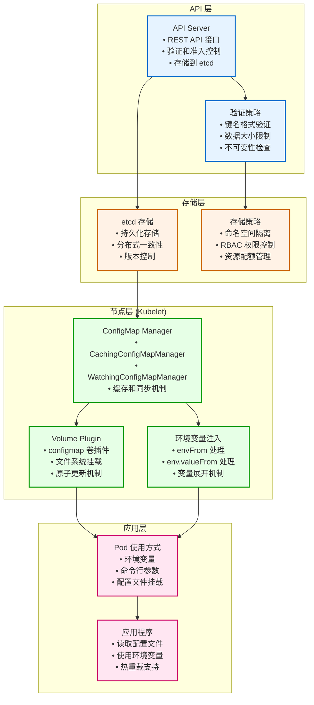
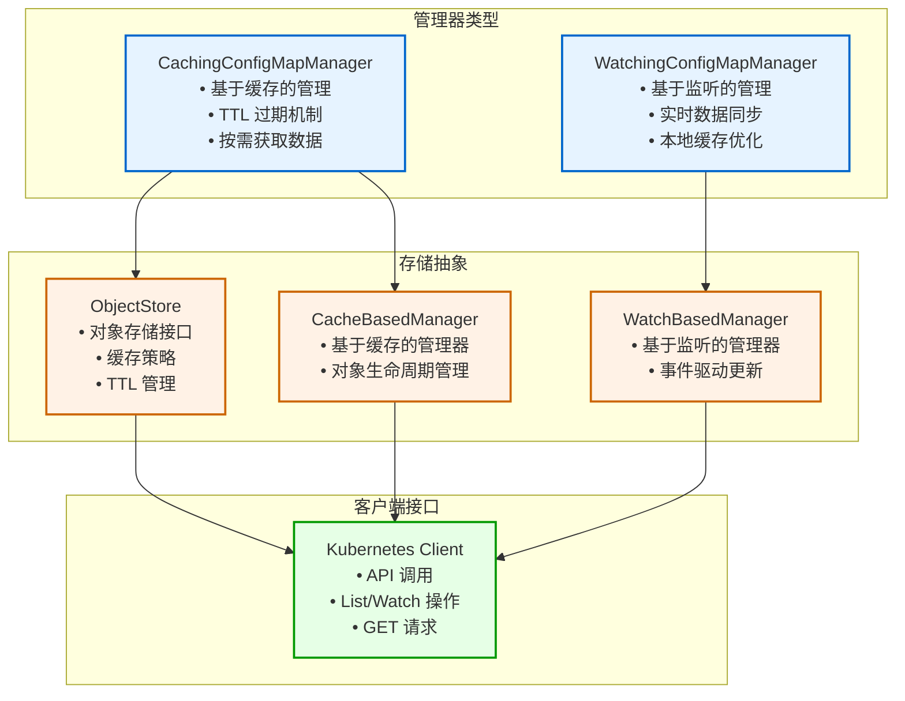
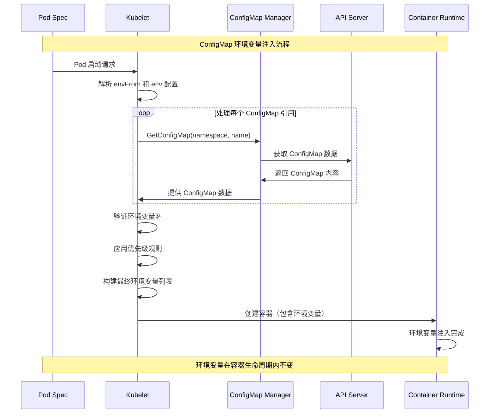
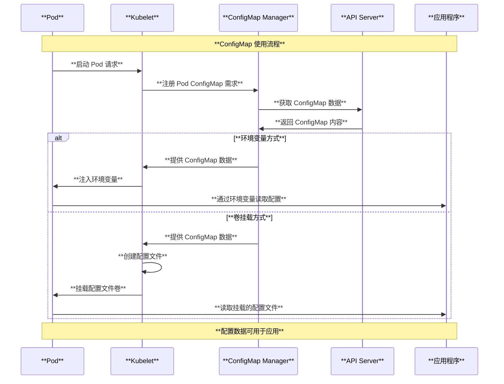
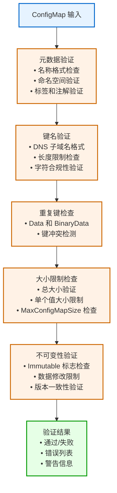
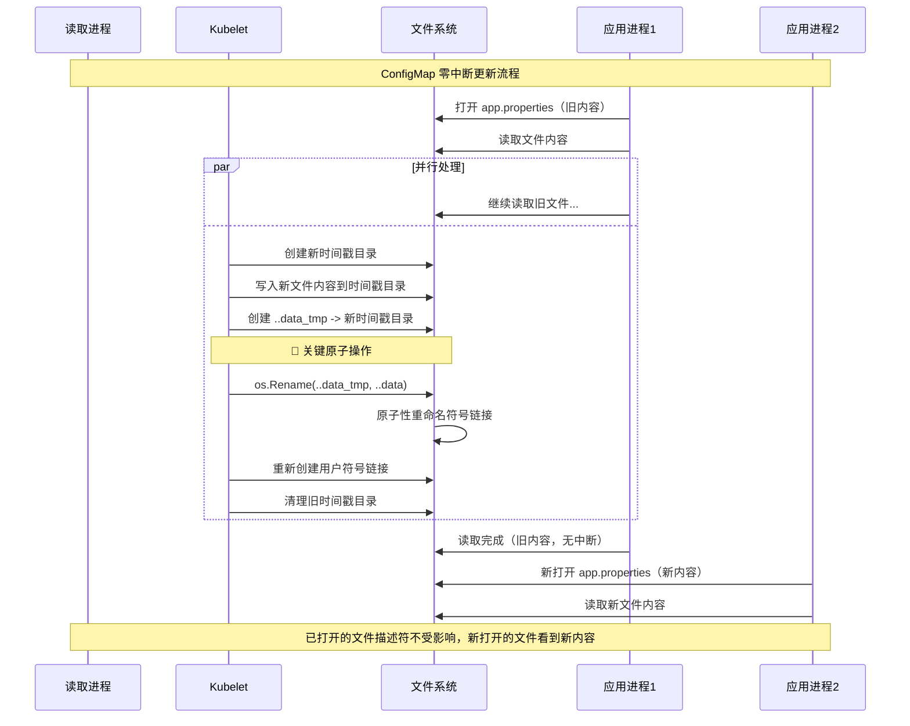

# Kubernetes ConfigMap 架构与原理深度解读

## 目录

1. [概述](#概述)
2. [ConfigMap 核心概念](#configmap-核心概念)
3. [ConfigMap 整体架构图](#configmap-整体架构图)
4. [ConfigMap 数据结构与源码分析](#configmap-数据结构与源码分析)
5. [ConfigMap 管理器架构](#configmap-管理器架构)
6. [ConfigMap 使用机制](#configmap-使用机制)
7. [ConfigMap 不可变特性](#configmap-不可变特性)
8. [ConfigMap 验证策略](#configmap-验证策略)
9. [ConfigMap 热更新机制](#configmap-热更新机制)
10. [ConfigMap 最佳实践](#configmap-最佳实践)
11. [使用场景与案例](#使用场景与案例)
12. [总结](#总结)

---

## 概述

ConfigMap 是 Kubernetes 中用于存储非机密配置数据的 API 对象。它提供了一种将配置数据与应用程序代码分离的机制，使得配置可以独立于容器镜像进行管理和更新。本文档基于 Kubernetes 源码深入解读 ConfigMap 的架构设计、工作原理和实现机制。

### 核心特性

- **配置分离**：将配置与应用程序代码完全分离
- **多种数据格式**：支持文本和二进制数据存储
- **灵活使用方式**：可作为环境变量、命令行参数或卷文件使用
- **热更新支持**：支持配置的动态更新和自动重载
- **不可变模式**：支持只读配置，防止意外修改

---

## ConfigMap 核心概念

### 1. 基本概念关系

- **ConfigMap**：存储配置数据的 Kubernetes 对象
- **Data**：包含 UTF-8 字符串键值对的配置数据
- **BinaryData**：包含二进制数据的配置
- **Immutable**：不可变标志，确保数据不被修改

### 2. 核心数据结构

基于源码 `staging/src/k8s.io/api/core/v1/types.go`：

```go
// ConfigMap holds configuration data for pods to consume.
type ConfigMap struct {
    metav1.TypeMeta   `json:",inline"`
    metav1.ObjectMeta `json:"metadata,omitempty"`
    
    // Immutable, if set to true, ensures that data stored in the ConfigMap cannot
    // be updated (only object metadata can be modified).
    Immutable *bool `json:"immutable,omitempty"`
    
    // Data contains the configuration data.
    // Each key must consist of alphanumeric characters, '-', '_' or '.'.
    // Values with non-UTF-8 byte sequences must use the BinaryData field.
    Data map[string]string `json:"data,omitempty"`
    
    // BinaryData contains the binary data.
    // Each key must consist of alphanumeric characters, '-', '_' or '.'.
    // BinaryData can contain byte sequences that are not in the UTF-8 range.
    BinaryData map[string][]byte `json:"binaryData,omitempty"`
}
```

---

## ConfigMap 整体架构图



---

## ConfigMap 数据结构与源码分析

### 1. ConfigMap 结构定义

基于 `pkg/apis/core/types.go`：

```go
// ConfigMap holds configuration data for components or applications to consume.
type ConfigMap struct {
    metav1.TypeMeta
    metav1.ObjectMeta
    
    // Immutable field, if set, ensures that data stored in the ConfigMap cannot
    // be updated (only object metadata can be modified).
    Immutable *bool
    
    // Data contains the configuration data.
    // Each key must consist of alphanumeric characters, '-', '_' or '.'.
    Data map[string]string
    
    // BinaryData contains the binary data.
    // Each key must consist of alphanumeric characters, '-', '_' or '.'.
    BinaryData map[string][]byte
}
```

### 2. ConfigMap 策略实现

基于 `pkg/registry/core/configmap/strategy.go`：

```go
// strategy implements behavior for ConfigMap objects
type strategy struct {
    runtime.ObjectTyper
    names.NameGenerator
}

// Strategy is the default logic that applies when creating and updating ConfigMap
var Strategy = strategy{legacyscheme.Scheme, names.SimpleNameGenerator}

func (strategy) PrepareForCreate(ctx context.Context, obj runtime.Object) {
    configMap := obj.(*api.ConfigMap)
    dropDisabledFields(configMap, nil)
}

func (strategy) Validate(ctx context.Context, obj runtime.Object) field.ErrorList {
    cfg := obj.(*api.ConfigMap)
    return validation.ValidateConfigMap(cfg)
}
```

---

## ConfigMap 管理器架构

### 1. ConfigMap 管理器接口

基于 `pkg/kubelet/configmap/configmap_manager.go`：

```go
// Manager interface provides methods for Kubelet to manage ConfigMap.
type Manager interface {
    // Get configmap by configmap namespace and name.
    GetConfigMap(namespace, name string) (*v1.ConfigMap, error)
    
    // WARNING: Register/UnregisterPod functions should be efficient,
    // i.e. should not block on network operations.
    
    // RegisterPod registers all configmaps from a given pod.
    RegisterPod(pod *v1.Pod)
    
    // UnregisterPod unregisters configmaps from a given pod that are not
    // used by any other registered pod.
    UnregisterPod(pod *v1.Pod)
}
```

### 2. 缓存管理器实现

```go
// NewCachingConfigMapManager creates a manager that keeps a cache of all configmaps
// necessary for registered pods.
func NewCachingConfigMapManager(kubeClient clientset.Interface, getTTL manager.GetObjectTTLFunc) Manager {
    getConfigMap := func(namespace, name string, opts metav1.GetOptions) (runtime.Object, error) {
        return kubeClient.CoreV1().ConfigMaps(namespace).Get(context.TODO(), name, opts)
    }
    configMapStore := manager.NewObjectStore(getConfigMap, clock.RealClock{}, getTTL, defaultTTL)
    return &configMapManager{
        manager: manager.NewCacheBasedManager(configMapStore, getConfigMapNames),
    }
}
```

### 3. 监听管理器实现

```go
// NewWatchingConfigMapManager creates a manager that keeps a cache of all configmaps
// necessary for registered pods.
func NewWatchingConfigMapManager(kubeClient clientset.Interface, resyncInterval time.Duration) Manager {
    listConfigMap := func(namespace string, opts metav1.ListOptions) (runtime.Object, error) {
        return kubeClient.CoreV1().ConfigMaps(namespace).List(context.TODO(), opts)
    }
    watchConfigMap := func(namespace string, opts metav1.ListOptions) (watch.Interface, error) {
        return kubeClient.CoreV1().ConfigMaps(namespace).Watch(context.TODO(), opts)
    }
    
    // 检查不可变性
    isImmutable := func(object runtime.Object) bool {
        if configMap, ok := object.(*v1.ConfigMap); ok {
            return configMap.Immutable != nil && *configMap.Immutable
        }
        return false
    }
    
    return &configMapManager{
        manager: manager.NewWatchBasedManager(listConfigMap, watchConfigMap, newConfigMap, isImmutable, gr, resyncInterval, getConfigMapNames),
    }
}
```

### 4. 管理器架构图



---

## ConfigMap 环境变量注入机制深度解读

### 1. 环境变量注入核心原理

环境变量注入是 ConfigMap 最常用的使用方式之一，通过 Kubelet 在容器启动时将 ConfigMap 数据注入到容器的环境变量中。

#### 1.1 注入时机和流程

基于 `pkg/kubelet/kubelet_pods.go` 中的源码分析，环境变量注入发生在容器启动前：

```go
// Kubelet 构建环境变量的核心函数
func (kl *Kubelet) makeEnvironmentVariables(pod *v1.Pod, container *v1.Container, podIP string, podIPs []string) ([]kubecontainer.EnvVar, error) {
    var (
        configMaps = make(map[string]*v1.ConfigMap)  // ConfigMap 缓存
        tmpEnv     = make(map[string]string)         // 临时环境变量映射
    )
    
    // 步骤1：处理 envFrom 批量导入
    for _, envFrom := range container.EnvFrom {
        switch {
        case envFrom.ConfigMapRef != nil:
            cm := envFrom.ConfigMapRef
            name := cm.Name
            configMap, ok := configMaps[name]
            
            // 从 ConfigMapManager 获取 ConfigMap
            if !ok {
                configMap, err = kl.configMapManager.GetConfigMap(pod.Namespace, name)
                if err != nil {
                    if errors.IsNotFound(err) && optional {
                        continue  // 可选的 ConfigMap 不存在时跳过
                    }
                    return result, err
                }
                configMaps[name] = configMap
            }
            
            // 批量注入所有键值对
            invalidKeys := []string{}
            for k, v := range configMap.Data {
                if len(envFrom.Prefix) > 0 {
                    k = envFrom.Prefix + k  // 添加前缀
                }
                
                // 验证环境变量名有效性
                if errMsgs := utilvalidation.IsEnvVarName(k); len(errMsgs) != 0 {
                    invalidKeys = append(invalidKeys, k)
                    continue
                }
                
                tmpEnv[k] = v
            }
            
            // 记录无效的环境变量名
            if len(invalidKeys) > 0 {
                kl.recorder.Eventf(pod, v1.EventTypeWarning, 
                    "InvalidEnvironmentVariableNames", 
                    "Keys [%s] from the EnvFrom configMap %s/%s were skipped", 
                    strings.Join(invalidKeys, ", "), pod.Namespace, name)
            }
        }
    }
    
    // 步骤2：处理 env 单个变量引用
    for _, envVar := range container.Env {
        if envVar.ValueFrom != nil {
            switch {
            case envVar.ValueFrom.ConfigMapKeyRef != nil:
                cm := envVar.ValueFrom.ConfigMapKeyRef
                name := cm.Name
                key := cm.Key
                optional := cm.Optional != nil && *cm.Optional
                
                configMap, ok := configMaps[name]
                if !ok {
                    configMap, err = kl.configMapManager.GetConfigMap(pod.Namespace, name)
                    if err != nil {
                        if errors.IsNotFound(err) && optional {
                            continue
                        }
                        return result, err
                    }
                    configMaps[name] = configMap
                }
                
                runtimeVal, ok := configMap.Data[key]
                if !ok {
                    if optional {
                        continue
                    }
                    return result, fmt.Errorf("couldn't find key %v in ConfigMap %v/%v", 
                        key, pod.Namespace, name)
                }
                
                tmpEnv[envVar.Name] = runtimeVal
            }
        }
    }
    
    // 步骤3：转换为容器环境变量格式
    for k, v := range tmpEnv {
        result = append(result, kubecontainer.EnvVar{Name: k, Value: v})
    }
    
    return result, nil
}
```

#### 1.2 两种注入方式详解

##### 方式一：envFrom 批量注入

```yaml
apiVersion: v1
kind: ConfigMap
metadata:
  name: app-config
  namespace: default
data:
  DATABASE_HOST: "mysql.example.com"
  DATABASE_PORT: "3306"
  CACHE_SIZE: "100"
  LOG_LEVEL: "INFO"
  FEATURE_FLAG_ENABLED: "true"

---
apiVersion: v1
kind: Pod
metadata:
  name: app-pod
spec:
  containers:
  - name: app
    image: myapp:latest
    envFrom:
    - configMapRef:
        name: app-config
        optional: false     # 如果 ConfigMap 不存在，Pod 启动失败
    - prefix: "APP_"        # 为所有环境变量添加前缀
      configMapRef:
        name: app-config
        optional: true      # 可选，不存在时不影响 Pod 启动
```

**envFrom 注入后的环境变量：**

```bash
# 第一个 envFrom（无前缀）
DATABASE_HOST=mysql.example.com
DATABASE_PORT=3306
CACHE_SIZE=100
LOG_LEVEL=INFO
FEATURE_FLAG_ENABLED=true

# 第二个 envFrom（带前缀 APP_）
APP_DATABASE_HOST=mysql.example.com
APP_DATABASE_PORT=3306
APP_CACHE_SIZE=100
APP_LOG_LEVEL=INFO
APP_FEATURE_FLAG_ENABLED=true
```

##### 方式二：env 单个变量引用

```yaml
apiVersion: v1
kind: Pod
metadata:
  name: app-pod
spec:
  containers:
  - name: app
    image: myapp:latest
    env:
    - name: DB_CONNECTION_STRING
      valueFrom:
        configMapKeyRef:
          name: app-config
          key: DATABASE_HOST
          optional: false
    - name: CUSTOM_CONFIG
      valueFrom:
        configMapKeyRef:
          name: optional-config
          key: custom-setting
          optional: true      # 键不存在时不影响启动
    - name: COMPUTED_VALUE
      value: "$(DATABASE_HOST):$(DATABASE_PORT)/myapp"  # 可以引用其他环境变量
```

#### 1.3 环境变量验证和过滤机制

Kubernetes 对环境变量名进行严格验证：

```go
// 环境变量名验证规则
func IsEnvVarName(value string) []string {
    var errs []string
    
    // 1. 不能为空
    if len(value) == 0 {
        errs = append(errs, "must not be empty")
        return errs
    }
    
    // 2. 必须符合环境变量命名规则
    // - 只能包含字母、数字、下划线
    // - 不能以数字开头
    // - 长度限制
    if !envVarNameRegex.MatchString(value) {
        errs = append(errs, "must match regex [A-Za-z_][A-Za-z0-9_]*")
    }
    
    return errs
}
```

**无效的环境变量名示例：**

```yaml
data:
  "123invalid": "value"      # ❌ 以数字开头
  "my-key": "value"          # ❌ 包含连字符
  "": "value"                # ❌ 空键名
  "my.key": "value"          # ❌ 包含点号
```

#### 1.4 优先级和覆盖规则

环境变量的优先级从高到低：

1. **env 直接定义的变量**（最高优先级）
2. **env.valueFrom 引用的变量**
3. **envFrom 引用的变量**（最低优先级）

```yaml
apiVersion: v1
kind: Pod
metadata:
  name: priority-demo
spec:
  containers:
  - name: app
    image: myapp:latest
    env:
    # 优先级1：直接定义（最高）
    - name: LOG_LEVEL
      value: "DEBUG"
    # 优先级2：valueFrom引用
    - name: DATABASE_HOST
      valueFrom:
        configMapKeyRef:
          name: app-config
          key: DATABASE_HOST
    envFrom:
    # 优先级3：批量引用（最低）
    - configMapRef:
        name: app-config
```

如果 ConfigMap 中也有 `LOG_LEVEL` 键，最终容器中的 `LOG_LEVEL` 仍然是 `DEBUG`。

#### 1.5 环境变量注入流程图



#### 1.6 错误处理和事件记录

Kubernetes 对环境变量注入过程中的错误进行详细处理：

```go
// 错误处理示例
if len(invalidKeys) > 0 {
    sort.Strings(invalidKeys)
    kl.recorder.Eventf(pod, v1.EventTypeWarning, 
        "InvalidEnvironmentVariableNames", 
        "Keys [%s] from the EnvFrom configMap %s/%s were skipped since they are considered invalid environment variable names.", 
        strings.Join(invalidKeys, ", "), pod.Namespace, name)
}
```

**常见错误类型：**

1. **ConfigMap 不存在**：

   ```text
   couldn't get configMap default/missing-config, configmap "missing-config" not found
   ```

2. **键不存在**：

   ```text
   couldn't find key DATABASE_PASSWORD in ConfigMap default/app-config
   ```

3. **无效变量名**：

   ```text
   Keys [123invalid, my-key] from the EnvFrom configMap default/app-config were skipped
   ```

### 2. 环境变量注入的限制和注意事项

#### 2.1 不支持热更新

**重要提醒**：通过环境变量使用的 ConfigMap 数据在 Pod 启动后 **不会自动更新**。

```bash
# 初始状态
$ kubectl exec pod-name -- env | grep DATABASE_HOST
DATABASE_HOST=old-host.example.com

# 更新 ConfigMap
$ kubectl patch configmap app-config --patch='{"data":{"DATABASE_HOST":"new-host.example.com"}}'

# 环境变量仍然是旧值！
$ kubectl exec pod-name -- env | grep DATABASE_HOST
DATABASE_HOST=old-host.example.com  # 没有变化

# 需要重启 Pod 才能获取新值
$ kubectl delete pod pod-name
$ kubectl get pod pod-name  # 新创建的 Pod 会有新的环境变量值
```

#### 2.2 资源限制

- **环境变量总数限制**：单个容器最多支持约 65536 个环境变量
- **单个变量大小限制**：建议每个环境变量值不超过 1MB
- **性能影响**：过多环境变量会影响容器启动速度

#### 2.3 安全考虑

```yaml
# ❌ 不推荐：敏感信息不应通过 ConfigMap 存储
apiVersion: v1
kind: ConfigMap
metadata:
  name: bad-config
data:
  DATABASE_PASSWORD: "super-secret-password"  # 明文存储，不安全

---
# ✅ 推荐：敏感信息使用 Secret
apiVersion: v1
kind: Secret
metadata:
  name: database-secret
type: Opaque
data:
  password: c3VwZXItc2VjcmV0LXBhc3N3b3Jk  # base64 编码

---
apiVersion: v1
kind: Pod
spec:
  containers:
  - name: app
    env:
    - name: DATABASE_HOST
      valueFrom:
        configMapKeyRef:
          name: app-config
          key: DATABASE_HOST
    - name: DATABASE_PASSWORD
      valueFrom:
        secretKeyRef:          # 使用 Secret
          name: database-secret
          key: password
```

## ConfigMap 使用机制

### 1. 环境变量注入（已详述于上节）

基于 `pkg/kubelet/kubelet_pods.go`：

```go
// 处理 envFrom 的 ConfigMap 引用
for _, envFrom := range container.EnvFrom {
    switch {
    case envFrom.ConfigMapRef != nil:
        cm := envFrom.ConfigMapRef
        name := cm.Name
        optional := cm.Optional != nil && *cm.Optional
        
        configMap, err = kl.configMapManager.GetConfigMap(pod.Namespace, name)
        if err != nil {
            if errors.IsNotFound(err) && optional {
                // 可选的 ConfigMap 不存在时跳过
                continue
            }
            return result, err
        }
        
        // 将 ConfigMap 数据注入为环境变量
        for k, v := range configMap.Data {
            if len(envFrom.Prefix) > 0 {
                k = envFrom.Prefix + k
            }
            if errMsgs := utilvalidation.IsEnvVarName(k); len(errMsgs) != 0 {
                // 记录无效的环境变量名
                invalidKeys = append(invalidKeys, k)
                continue
            }
            tmpEnv[k] = v
        }
    }
}
```

### 2. 单个环境变量引用

```go
// 处理单个环境变量从 ConfigMap 获取值
case envVar.ValueFrom.ConfigMapKeyRef != nil:
    cm := envVar.ValueFrom.ConfigMapKeyRef
    name := cm.Name
    key := cm.Key
    optional := cm.Optional != nil && *cm.Optional
    
    configMap, err = kl.configMapManager.GetConfigMap(pod.Namespace, name)
    if err != nil {
        if errors.IsNotFound(err) && optional {
            // 可选字段不存在时跳过
            continue
        }
        return result, err
    }
    
    runtimeVal, ok = configMap.Data[key]
    if !ok {
        if optional {
            continue
        }
        return result, fmt.Errorf("couldn't find key %v in ConfigMap %v/%v", key, pod.Namespace, name)
    }
```

### 3. 卷挂载机制

基于 `pkg/volume/configmap/configmap.go`：

```go
// ConfigMap 卷挂载器
type configMapVolumeMounter struct {
    *configMapVolume
    
    source       v1.ConfigMapVolumeSource
    pod          v1.Pod
    opts         *volume.VolumeOptions
    getConfigMap func(namespace, name string) (*v1.ConfigMap, error)
}

func (b *configMapVolumeMounter) SetUpAt(dir string, mounterArgs volume.MounterArgs) error {
    // 获取 ConfigMap 数据
    optional := b.source.Optional != nil && *b.source.Optional
    configMap, err := b.getConfigMap(b.pod.Namespace, b.source.Name)
    if err != nil {
        if !(errors.IsNotFound(err) && optional) {
            return err
        }
        // 创建空的 ConfigMap 对象用于可选情况
        configMap = &v1.ConfigMap{
            ObjectMeta: metav1.ObjectMeta{
                Namespace: b.pod.Namespace,
                Name:      b.source.Name,
            },
        }
    }
    
    // 构建文件负载
    payload, err := MakePayload(b.source.Items, configMap, b.source.DefaultMode, optional)
    if err != nil {
        return err
    }
    
    // 使用原子写入器写入文件
    writer, err := volumeutil.NewAtomicWriter(dir, writerContext)
    if err != nil {
        return err
    }
    
    err = writer.Write(payload)
    if err != nil {
        return err
    }
    
    return nil
}
```

### 4. 使用方式流程图



---

## ConfigMap 不可变特性

### 1. 不可变 ConfigMap 概述

Kubernetes 1.19+ 引入了不可变 ConfigMap 特性，通过设置 `immutable: true` 来防止 ConfigMap 数据被修改：

```yaml
apiVersion: v1
kind: ConfigMap
metadata:
  name: immutable-config
  namespace: default
immutable: true  # 标记为不可变
data:
  config.properties: |
    database.url=jdbc:mysql://db:3306/app
    cache.size=100
```

### 2. 不可变性验证

基于 `pkg/apis/core/validation/validation.go`：

```go
// ValidateConfigMapUpdate tests if required fields in the ConfigMap are set.
func ValidateConfigMapUpdate(newCfg, oldCfg *core.ConfigMap) field.ErrorList {
    allErrs := field.ErrorList{}
    allErrs = append(allErrs, ValidateObjectMetaUpdate(&newCfg.ObjectMeta, &oldCfg.ObjectMeta, field.NewPath("metadata"))...)
    
    // 验证不可变性
    if oldCfg.Immutable != nil && *oldCfg.Immutable {
        // 不能将不可变的 ConfigMap 改为可变
        if newCfg.Immutable == nil || !*newCfg.Immutable {
            allErrs = append(allErrs, field.Forbidden(field.NewPath("immutable"), 
                "field is immutable when `immutable` is set"))
        }
        
        // Data 字段不能修改
        if !reflect.DeepEqual(newCfg.Data, oldCfg.Data) {
            allErrs = append(allErrs, field.Forbidden(field.NewPath("data"), 
                "field is immutable when `immutable` is set"))
        }
        
        // BinaryData 字段不能修改
        if !reflect.DeepEqual(newCfg.BinaryData, oldCfg.BinaryData) {
            allErrs = append(allErrs, field.Forbidden(field.NewPath("binaryData"), 
                "field is immutable when `immutable` is set"))
        }
    }
    
    allErrs = append(allErrs, ValidateConfigMap(newCfg)...)
    return allErrs
}
```

### 3. 不可变性优势

1. **性能优化**：不可变 ConfigMap 可以被更多缓存，减少 API 调用
2. **安全保障**：防止意外修改关键配置
3. **一致性保证**：确保所有 Pod 使用相同版本的配置

---

## ConfigMap 验证策略

### 1. 数据验证规则

基于 `pkg/apis/core/validation/validation.go`：

```go
// ValidateConfigMap tests whether required fields in the ConfigMap are set.
func ValidateConfigMap(cfg *core.ConfigMap) field.ErrorList {
    allErrs := ValidateObjectMeta(&cfg.ObjectMeta, true, ValidateConfigMapName, field.NewPath("metadata"))
    
    totalSize := 0
    
    // 验证 Data 字段
    for key, value := range cfg.Data {
        for _, msg := range validation.IsConfigMapKey(key) {
            allErrs = append(allErrs, field.Invalid(field.NewPath("data").Key(key), key, msg))
        }
        totalSize += len(value)
    }
    
    // 验证 BinaryData 字段
    for key, value := range cfg.BinaryData {
        for _, msg := range validation.IsConfigMapKey(key) {
            allErrs = append(allErrs, field.Invalid(field.NewPath("binaryData").Key(key), key, msg))
        }
        totalSize += len(value)
        
        // 检查 Data 和 BinaryData 中是否有重复的键
        if _, isData := cfg.Data[key]; isData {
            msg := "duplicate key in both data and binaryData"
            allErrs = append(allErrs, field.Invalid(field.NewPath("binaryData").Key(key), key, msg))
        }
    }
    
    // 检查总大小限制
    if totalSize > v1.MaxConfigMapSize {
        allErrs = append(allErrs, field.TooLong(field.NewPath("data"), cfg.Data, v1.MaxConfigMapSize))
    }
    
    return allErrs
}
```

### 2. 键名验证规则

```go
// IsConfigMapKey tests for a string that is a valid key for a ConfigMap or Secret
func IsConfigMapKey(value string) []string {
    var errs []string
    if len(value) == 0 {
        errs = append(errs, "must not be empty")
        return errs
    }
    
    // ConfigMap 键必须是有效的 DNS 子域名格式：
    // - 只能包含字母、数字、'-', '_', '.'
    // - 长度不超过 253 个字符
    for _, msg := range validation.IsDNS1123Subdomain(value) {
        errs = append(errs, msg)
    }
    return errs
}
```

### 3. 验证流程图



---

## ConfigMap 热更新机制

### 1. 卷挂载方式的自动更新

对于通过卷挂载使用的 ConfigMap，Kubelet 会定期检查 ConfigMap 的变更并自动更新挂载的文件：

```go
// 基于 pkg/volume/configmap/configmap.go 中的更新机制
func (plugin *configMapPlugin) RequiresRemount(spec *volume.Spec) bool {
    // ConfigMap 卷支持热更新，不需要重新挂载整个卷
    return false
}

// 原子写入机制确保更新的一致性
func (writer *AtomicWriter) Write(payload map[string]FileProjection) error {
    // 1. 创建临时目录
    // 2. 写入新文件到临时目录
    // 3. 原子性地重命名目录
    // 4. 清理旧目录
}
```

### 2. 环境变量方式的限制

通过环境变量使用的 ConfigMap 数据在 Pod 启动后不会自动更新，需要重启 Pod 才能获取新的配置。

### 3. 更新传播延迟

ConfigMap 更新到所有节点有一定延迟：

```go
// 基于缓存 TTL 的更新机制
const (
    // 默认 TTL 时间
    defaultTTL = 1 * time.Minute
    
    // 不可变对象的更长 TTL
    immutableObjectTTL = 10 * time.Minute
)

// TTL 管理函数
func (store *objectStore) AddReference(namespace, name string) {
    key := objectKey{namespace: namespace, name: name}
    
    // 不可变对象使用更长的缓存时间
    if store.isImmutable(obj) {
        store.items[key] = &objectStoreItem{
            object: obj,
            expires: time.Now().Add(immutableObjectTTL),
        }
    } else {
        store.items[key] = &objectStoreItem{
            object: obj,
            expires: time.Now().Add(defaultTTL),
        }
    }
}
```

### 4. 热更新最佳实践

1. **文件监听**：应用程序应该监听配置文件的变更
2. **信号处理**：通过信号机制触发配置重载
3. **健康检查**：确保配置更新后应用程序仍正常工作
4. **渐进式更新**：使用 Deployment 的滚动更新确保服务连续性

### 5. ConfigMap 文件时间戳变化机制

**问题**：当 ConfigMap 被挂载到文件路径时，如果 ConfigMap 内容发生变化，是否可以通过 `stat` 命令的最后修改时间感知到这个变化？

**答案**：**是的，可以通过 `stat` 命令感知到变化！**

#### 5.1 时间戳变化原理

基于 `pkg/volume/util/atomic_writer.go` 的源码分析：

```go
// 原子写入器的核心更新流程
func (w *AtomicWriter) Write(payload map[string]FileProjection, setPerms func(subPath string) error) error {
    // 1. 创建新的时间戳目录
    tsDir, err := w.newTimestampDir()  // 使用当前时间创建目录
    
    // 2. 写入新文件到时间戳目录
    if err = w.writePayloadToDir(cleanPayload, tsDir); err != nil {
        return err
    }
    
    // 3. 创建新的 ..data_tmp 符号链接
    newDataDirPath := filepath.Join(w.targetDir, newDataDirName)
    if err = os.Symlink(tsDirName, newDataDirPath); err != nil {
        return err
    }
    
    // 4. 原子性地重命名 ..data_tmp 为 ..data
    err = os.Rename(newDataDirPath, dataDirPath)
    
    // 5. 重新创建用户可见的符号链接
    if err = w.createUserVisibleFiles(cleanPayload); err != nil {
        return err
    }
}

// 时间戳目录命名格式
func (w *AtomicWriter) newTimestampDir() (string, error) {
    // 使用当前 UTC 时间创建目录，格式：..2006_01_02_15_04_05.随机数
    tsDir, err := os.MkdirTemp(w.targetDir, time.Now().UTC().Format("..2006_01_02_15_04_05."))
    return tsDir, err
}

// 创建用户可见的符号链接
func (w *AtomicWriter) createUserVisibleFiles(payload map[string]FileProjection) error {
    for userVisiblePath := range payload {
        // 为每个文件创建符号链接指向 ..data 目录
        visibleFile := filepath.Join(w.targetDir, linkname)
        dataDirFile := filepath.Join(dataDirName, linkname)
        
        // 重新创建符号链接 - 这会更新符号链接的修改时间！
        err = os.Symlink(dataDirFile, visibleFile)
    }
    return nil
}
```

#### 5.2 文件系统结构

当 ConfigMap 挂载到 `/etc/config/app.properties` 时，实际的文件系统结构如下：

```bash
/etc/config/
├── app.properties -> ..data/app.properties    # 用户可见的符号链接
├── ..data -> ..2023_12_01_10_30_45.123456/    # 指向当前时间戳目录
├── ..2023_12_01_10_30_45.123456/               # 旧的时间戳目录
│   └── app.properties                          # 实际文件内容
└── ..2023_12_01_11_15_22.789012/               # 新的时间戳目录（更新后）
    └── app.properties                          # 新的文件内容
```

#### 5.3 时间戳变化验证

当 ConfigMap 内容变化时会发生以下过程：

1. **创建新时间戳目录**：`..2023_12_01_11_15_22.789012/`
2. **写入新内容**：在新目录中创建文件
3. **更新 ..data 符号链接**：指向新的时间戳目录
4. **重新创建用户符号链接**：`app.properties -> ..data/app.properties`

**关键点**：步骤 4 中重新创建符号链接会更新符号链接本身的修改时间！

#### 5.4 验证示例

```bash
# 初始状态
$ stat /etc/config/app.properties
  File: app.properties -> ..data/app.properties
  Size: 25         Blocks: 0          IO Block: 4096   symbolic link
Access: 2023-12-01 10:30:45.123456789 +0000
Modify: 2023-12-01 10:30:45.123456789 +0000  # 初始修改时间
Change: 2023-12-01 10:30:45.123456789 +0000

# ConfigMap 内容更新后
$ stat /etc/config/app.properties
  File: app.properties -> ..data/app.properties  
  Size: 25         Blocks: 0          IO Block: 4096   symbolic link
Access: 2023-12-01 11:15:22.789012345 +0000
Modify: 2023-12-01 11:15:22.789012345 +0000  # 修改时间已更新！
Change: 2023-12-01 11:15:22.789012345 +0000

# 查看实际目录结构
$ ls -la /etc/config/
lrwxrwxrwx 1 root root   31 Dec  1 11:15 app.properties -> ..data/app.properties
lrwxrwxrwx 1 root root   31 Dec  1 11:15 ..data -> ..2023_12_01_11_15_22.789012/
drwxr-xr-x 2 root root 4096 Dec  1 11:15 ..2023_12_01_11_15_22.789012/
drwxr-xr-x 2 root root 4096 Dec  1 10:30 ..2023_12_01_10_30_45.123456/  # 旧目录
```

#### 5.5 监控实现建议

基于这个机制，可以通过以下方式监控 ConfigMap 变化：

```bash
#!/bin/bash
# ConfigMap 变化监控脚本

CONFIG_FILE="/etc/config/app.properties"
LAST_MTIME=""

while true; do
    if [ -e "$CONFIG_FILE" ]; then
        CURRENT_MTIME=$(stat -c %Y "$CONFIG_FILE" 2>/dev/null)
        
        if [ "$CURRENT_MTIME" != "$LAST_MTIME" ] && [ -n "$LAST_MTIME" ]; then
            echo "$(date): ConfigMap updated! New mtime: $CURRENT_MTIME"
            # 触发应用程序重新加载配置
            kill -HUP $APP_PID || systemctl reload myapp
        fi
        
        LAST_MTIME="$CURRENT_MTIME"
    fi
    
    sleep 5  # 每5秒检查一次
done
```

或者使用 `inotify` 监听符号链接变化：

```bash
#!/bin/bash
# 使用 inotify 监听 ConfigMap 变化

inotifywait -m -e attrib,modify,create,delete /etc/config/ | while read path action file; do
    if [[ "$file" == "app.properties" ]] || [[ "$file" == "..data" ]]; then
        echo "$(date): ConfigMap file $file changed ($action)"
        # 重新加载应用配置
        kill -HUP $APP_PID
    fi
done
```

#### 5.6 重要注意事项

1. **符号链接时间戳**：监控的是符号链接本身的修改时间，不是目标文件的时间戳
2. **原子性保证**：整个更新过程是原子性的，不会出现文件内容不一致的情况
3. **延迟传播**：ConfigMap 更新到节点有一定延迟（默认 1 分钟 TTL）
4. **多文件场景**：如果 ConfigMap 包含多个文件，每个文件的符号链接都会更新时间戳
5. **兼容性考虑**：这个机制在所有支持符号链接的文件系统上都有效

通过这种机制，应用程序可以可靠地通过监控文件时间戳来感知 ConfigMap 的变化，实现配置的热重载。

### 5.6 原子更新机制深度解析

**问题**：热更新的时候，是删除重建软连接吗？怎么做到不影响正在读取的请求？

**答案**：**不是简单的删除重建，而是通过精心设计的原子操作确保零中断更新！**

#### 5.6.1 原子更新的设计哲学

基于 `pkg/volume/util/atomic_writer.go` 的注释中的设计理念：

```go
// AtomicWriter handles atomically projecting content for a set of files into
// a target directory.
//
// The visible files in this volume are symlinks to files in the writer's data
// directory. Actual files are stored in a hidden timestamped directory which
// is symlinked to by the data directory. The timestamped directory and
// data directory symlink are created in the writer's target dir. This scheme
// allows the files to be atomically updated by changing the target of the
// data directory symlink.
//
// Consumers of the target directory can monitor the ..data symlink using
// inotify or fanotify to receive events when the content in the volume is
// updated.
```

#### 5.6.2 三层符号链接架构

Kubernetes 使用了一个巧妙的三层符号链接架构：

```bash
/etc/config/
├── app.properties -> ..data/app.properties       # Layer 1: 用户可见文件
├── ..data -> ..2023_12_01_15_30_45.789012/       # Layer 2: 数据目录符号链接
├── ..2023_12_01_15_30_45.789012/                 # Layer 3: 当前时间戳目录
│   └── app.properties                            # 实际文件内容
├── ..2023_12_01_14_20_30.456789/                 # Layer 3: 旧时间戳目录
│   └── app.properties                            # 旧文件内容（待清理）
└── ..data_tmp -> ..2023_12_01_15_30_45.789012/   # 临时符号链接（更新过程中）
```

#### 5.6.3 原子更新详细步骤

基于源码分析，更新过程包含以下步骤：

```go
// 原子更新的12个步骤（从源码注释提取）
func (w *AtomicWriter) Write(payload map[string]FileProjection, setPerms func(subPath string) error) error {
    // 1. 验证 payload 有效性
    cleanPayload, err := validatePayload(payload)
    
    // 2. 读取当前 ..data 符号链接，获取当前时间戳目录
    oldTsDir, err := os.Readlink(dataDirPath)
    
    // 3. 确定需要删除的旧文件路径
    pathsToRemove, err := w.pathsToRemove(cleanPayload, oldTsPath)
    
    // 4. 比较内容是否需要更新（智能优化）
    if should, err := shouldWritePayload(cleanPayload, oldTsPath); !should && len(pathsToRemove) == 0 {
        return nil  // 内容未变化，跳过更新
    }
    
    // 🔵 5. 创建新时间戳目录（准备阶段）
    tsDir, err := w.newTimestampDir()  // 创建 ..2023_12_01_15_30_45.789012/
    
    // 🔵 6. 写入新文件到时间戳目录（准备阶段）
    err = w.writePayloadToDir(cleanPayload, tsDir)
    
    // 🔵 7. 设置文件权限（准备阶段）
    if setPerms != nil {
        err := setPerms(tsDirName)
    }
    
    // 🟢 8. 创建临时数据目录符号链接（原子操作前置）
    newDataDirPath := filepath.Join(w.targetDir, newDataDirName)  // ..data_tmp
    err = os.Symlink(tsDirName, newDataDirPath)
    
    // 🔴 9. 原子性重命名数据目录符号链接（关键原子操作！）
    if runtime.GOOS == "windows" {
        os.Remove(dataDirPath)
        err = os.Symlink(tsDirName, dataDirPath)
        os.Remove(newDataDirPath)
    } else {
        // 在 Unix 系统上，os.Rename 是原子操作！
        err = os.Rename(newDataDirPath, dataDirPath)  // ..data_tmp -> ..data
    }
    
    // 🔵 10. 重新创建用户可见符号链接（后处理）
    err = w.createUserVisibleFiles(cleanPayload)
    
    // 🔵 11. 删除不再需要的旧符号链接（清理）
    err = w.removeUserVisiblePaths(pathsToRemove)
    
    // 🔵 12. 删除旧时间戳目录（清理）
    if len(oldTsDir) > 0 {
        err = os.RemoveAll(oldTsPath)
    }
}
```

#### 5.6.4 无中断机制的关键原理

**关键原理**：步骤9中的 `os.Rename()` 操作在Unix系统上是原子的！

```go
// 关键的原子操作
err = os.Rename(newDataDirPath, dataDirPath)  // ..data_tmp -> ..data
```

**原子性保证**：

1. **重命名是原子的**：在文件系统层面，重命名操作是不可分割的
2. **读取不中断**：正在读取文件的进程不会受到影响
3. **新读取看到新内容**：重命名完成后，新的文件打开操作会看到新内容

#### 5.6.5 零中断更新流程图



#### 5.6.6 技术深度分析

##### 文件描述符和inode的关系

```bash
# 更新前的文件系统状态
$ ls -li /etc/config/
total 0
1234567 lrwxrwxrwx 1 root root 28 Dec  1 14:20 app.properties -> ..data/app.properties
1234568 lrwxrwxrwx 1 root root 28 Dec  1 14:20 ..data -> ..2023_12_01_14_20_30.456789/
1234569 drwxr-xr-x 2 root root 60 Dec  1 14:20 ..2023_12_01_14_20_30.456789/

# 应用程序打开文件，获得文件描述符指向具体inode
$ lsof | grep app.properties
myapp    1234  root    3r   REG   8,1   1024   9876543  /var/lib/kubelet/.../..2023_12_01_14_20_30.456789/app.properties

# Kubelet 执行原子更新...
# 创建新时间戳目录，写入新内容，执行 os.Rename

# 更新后的文件系统状态
$ ls -li /etc/config/
total 0
1234567 lrwxrwxrwx 1 root root 28 Dec  1 15:30 app.properties -> ..data/app.properties  # 符号链接重新创建
1234570 lrwxrwxrwx 1 root root 28 Dec  1 15:30 ..data -> ..2023_12_01_15_30_45.789012/   # 指向新目录
1234571 drwxr-xr-x 2 root root 60 Dec  1 15:30 ..2023_12_01_15_30_45.789012/             # 新目录

# 关键：原有的文件描述符仍然有效，指向旧的inode
$ lsof | grep app.properties
myapp    1234  root    3r   REG   8,1   1024   9876543  /var/lib/kubelet/.../..2023_12_01_14_20_30.456789/app.properties  # 仍然指向旧文件！

# 新打开的文件会指向新内容
$ lsof | grep app.properties
myapp    1234  root    3r   REG   8,1   1024   9876543  /var/lib/kubelet/.../..2023_12_01_14_20_30.456789/app.properties  # 旧进程
newapp   5678  root    3r   REG   8,1   2048   9876544  /var/lib/kubelet/.../..2023_12_01_15_30_45.789012/app.properties  # 新进程
```

##### 原子性的文件系统保证

不同文件系统的原子性保证：

```go
// Unix系统上的原子性实现
func atomicRename(oldpath, newpath string) error {
    // rename() 系统调用在大多数Unix文件系统上是原子的
    // 包括：ext4, xfs, btrfs, zfs 等
    return syscall.Rename(oldpath, newpath)
}

// Windows系统上的特殊处理
if runtime.GOOS == "windows" {
    // Windows上符号链接的原子性处理更复杂
    os.Remove(dataDirPath)                    // 先删除旧链接
    err = os.Symlink(tsDirName, dataDirPath)  // 创建新链接
    os.Remove(newDataDirPath)                 // 清理临时链接
}
```

#### 5.6.7 实际验证示例

```bash
# 设置测试环境
$ kubectl create configmap test-atomic --from-literal=config="version-1"
$ kubectl run test-pod --image=busybox --restart=Never -- sleep 3600
$ kubectl patch pod test-pod --patch='
spec:
  volumes:
  - name: config-vol
    configMap:
      name: test-atomic
  containers:
  - name: busybox
    volumeMounts:
    - name: config-vol
      mountPath: /etc/config'

# 在容器中启动持续读取进程
$ kubectl exec test-pod -- sh -c 'while true; do cat /etc/config/config; sleep 1; done' &

# 更新 ConfigMap
$ kubectl patch configmap test-atomic --patch='{"data":{"config":"version-2"}}'

# 观察输出：
# version-1
# version-1
# version-1
# version-2  # 无缝切换，没有读取错误
# version-2
# version-2

# 验证文件系统状态
$ kubectl exec test-pod -- ls -la /etc/config/
lrwxrwxrwx    1 root     root            17 Dec  1 15:45 config -> ..data/config
lrwxrwxrwx    1 root     root            31 Dec  1 15:45 ..data -> ..2023_12_01_15_45_12.123456
drwxr-xr-x    2 root     root            60 Dec  1 15:45 ..2023_12_01_15_45_12.123456
```

#### 5.6.8 边界情况和异常处理

```go
// 原子写入器的错误处理机制
func (w *AtomicWriter) Write(payload map[string]FileProjection, setPerms func(subPath string) error) error {
    // 如果创建新时间戳目录失败，不影响现有文件
    tsDir, err := w.newTimestampDir()
    if err != nil {
        return err  // 直接返回，现有文件继续可用
    }
    
    // 如果写入新文件失败，清理新目录，现有文件不受影响
    if err = w.writePayloadToDir(cleanPayload, tsDir); err != nil {
        os.RemoveAll(tsDir)  // 清理失败的新目录
        return err
    }
    
    // 如果创建临时符号链接失败，清理并返回
    if err = os.Symlink(tsDirName, newDataDirPath); err != nil {
        os.RemoveAll(tsDir)
        return err
    }
    
    // 如果原子重命名失败，清理临时文件
    if err = os.Rename(newDataDirPath, dataDirPath); err != nil {
        os.Remove(newDataDirPath)
        os.RemoveAll(tsDir)
        return err
    }
    
    // 后续清理操作即使失败也不影响更新成功
    // ...
}
```

**关键设计原则**：

1. **失败时回滚**：任何步骤失败都会清理临时文件，保持原始状态
2. **成功即可用**：原子重命名成功后，新内容立即可用
3. **渐进清理**：后续清理步骤失败不影响更新成功

### 5.7 内容无变化的 Patch 操作行为

**问题**：如果 ConfigMap 的文件内容没有发生改变，只是做 patch 操作，能否看到时间戳的变化？

**答案**：**不能！如果内容没有变化，时间戳不会更新。**

#### 5.7.1 内容比较机制

基于 `pkg/volume/util/atomic_writer.go` 中的源码分析，Kubernetes 在更新 ConfigMap 卷之前会进行内容比较：

```go
// 判断是否需要写入新内容
func shouldWritePayload(payload map[string]FileProjection, oldTsDir string) (bool, error) {
    for userVisiblePath, fileProjection := range payload {
        shouldWrite, err := shouldWriteFile(filepath.Join(oldTsDir, userVisiblePath), fileProjection.Data)
        if err != nil {
            return false, err
        }
        
        if shouldWrite {
            return true, nil  // 只要有一个文件需要更新就返回 true
        }
    }
    
    return false, nil  // 所有文件都不需要更新
}

// 比较单个文件是否需要写入
func shouldWriteFile(path string, content []byte) (bool, error) {
    _, err := os.Lstat(path)
    if os.IsNotExist(err) {
        return true, nil  // 文件不存在，需要写入
    }
    
    contentOnFs, err := os.ReadFile(path)
    if err != nil {
        return false, err
    }
    
    // 关键逻辑：字节级比较内容是否相同
    return !bytes.Equal(content, contentOnFs), nil
}
```

#### 5.7.2 跳过更新的逻辑

在 `AtomicWriter.Write()` 方法中，如果内容没有变化且没有文件需要删除，会直接跳过更新：

```go
func (w *AtomicWriter) Write(payload map[string]FileProjection, setPerms func(subPath string) error) error {
    // ... 前面的逻辑 ...
    
    // 检查是否需要写入
    if should, err := shouldWritePayload(cleanPayload, oldTsPath); err != nil {
        klog.Errorf("%s: error determining whether payload should be written to disk: %v", w.logContext, err)
        return err
    } else if !should && len(pathsToRemove) == 0 {
        // 🎯 关键：内容无变化且无文件删除时，直接返回，不执行任何文件操作！
        klog.V(4).Infof("%s: no update required for target directory %v", w.logContext, w.targetDir)
        return nil
    } else {
        klog.V(4).Infof("%s: write required for target directory %v", w.logContext, w.targetDir)
    }
    
    // 后续的文件系统更新操作只有在需要时才会执行
    // ...
}
```

#### 5.7.3 测试验证

基于 Kubernetes 的单元测试 `pkg/volume/util/atomic_writer_test.go`，存在专门的测试案例：

```go
{
    name: "no update",
    first: map[string]FileProjection{
        "foo": {Mode: 0644, Data: []byte("foo")},
        "bar": {Mode: 0644, Data: []byte("bar")},
    },
    next: map[string]FileProjection{
        "foo": {Mode: 0644, Data: []byte("foo")},  // 内容相同
        "bar": {Mode: 0644, Data: []byte("bar")},  // 内容相同
    },
    shouldWrite: false,  // 不需要写入
},
{
    name: "no update 2",
    first: map[string]FileProjection{
        "foo/bar.txt": {Mode: 0644, Data: []byte("foo")},
        "bar/zab.txt": {Mode: 0644, Data: []byte("bar")},
    },
    next: map[string]FileProjection{
        "foo/bar.txt": {Mode: 0644, Data: []byte("foo")},  // 内容相同
        "bar/zab.txt": {Mode: 0644, Data: []byte("bar")},  // 内容相同
    },
    shouldWrite: false,  // 不需要写入
}
```

#### 5.7.4 实际场景验证

```bash
# 初始状态
$ kubectl get configmap test-config -o yaml | grep -A5 data:
data:
  config.yaml: |
    database:
      host: localhost
      port: 3306

$ stat /etc/config/config.yaml
Modify: 2023-12-01 10:30:45.123456789 +0000

# 执行无内容变化的patch操作
$ kubectl patch configmap test-config --patch='{"data":{"config.yaml":"database:\n  host: localhost\n  port: 3306\n"}}'
configmap/test-config patched

# 检查时间戳 - 没有变化！
$ stat /etc/config/config.yaml
Modify: 2023-12-01 10:30:45.123456789 +0000  # 时间戳未变化

# 执行有内容变化的patch操作
$ kubectl patch configmap test-config --patch='{"data":{"config.yaml":"database:\n  host: localhost\n  port: 3307\n"}}'
configmap/test-config patched

# 检查时间戳 - 发生了变化！
$ stat /etc/config/config.yaml
Modify: 2023-12-01 11:45:30.987654321 +0000  # 时间戳已更新
```

#### 5.7.5 监控策略影响

这种行为对监控策略有重要影响：

1. **基于时间戳的监控**：只有在内容真正变化时才能感知到
2. **基于 ResourceVersion 的监控**：即使内容没变化，API 对象的 ResourceVersion 也会更新
3. **避免无效重载**：防止应用程序因为无意义的 patch 操作而重复重载配置

#### 5.7.6 最佳实践建议

```yaml
# 推荐：在应用程序中结合多种监控方式
apiVersion: v1
kind: Pod
metadata:
  name: config-monitor
spec:
  containers:
  - name: app
    image: myapp:latest
    env:
    - name: CONFIG_FILE
      value: "/etc/config/app.properties"
    - name: CONFIGMAP_NAME
      value: "app-config"
    - name: CONFIGMAP_NAMESPACE
      valueFrom:
        fieldRef:
          fieldPath: metadata.namespace
    volumeMounts:
    - name: config
      mountPath: /etc/config
    # 监控脚本可以同时监控文件时间戳和 ConfigMap ResourceVersion
    command: ["/bin/sh"]
    args:
    - -c
    - |
      # 同时监控文件时间戳和 ConfigMap ResourceVersion
      while true; do
        # 方法1：监控文件时间戳（只有内容变化时才触发）
        CURRENT_MTIME=$(stat -c %Y "$CONFIG_FILE" 2>/dev/null || echo "0")
        
        # 方法2：监控 ConfigMap ResourceVersion（任何 patch 都会触发）
        CURRENT_RV=$(kubectl get configmap "$CONFIGMAP_NAME" -n "$CONFIGMAP_NAMESPACE" -o jsonpath='{.metadata.resourceVersion}' 2>/dev/null || echo "0")
        
        if [ "$CURRENT_MTIME" != "$LAST_MTIME" ] && [ -n "$LAST_MTIME" ]; then
          echo "$(date): Config content changed, reloading..."
          kill -HUP $APP_PID
        elif [ "$CURRENT_RV" != "$LAST_RV" ] && [ -n "$LAST_RV" ]; then
          echo "$(date): ConfigMap updated but content unchanged, skipping reload"
        fi
        
        LAST_MTIME="$CURRENT_MTIME"
        LAST_RV="$CURRENT_RV"
        sleep 10
      done
  volumes:
  - name: config
    configMap:
      name: app-config
```

#### 5.7.7 总结要点

| 场景 | 文件时间戳变化 | ConfigMap ResourceVersion 变化 | 说明 |
|------|---------------|-------------------------------|------|
| **内容有变化的 patch** | ✅ 会变化 | ✅ 会变化 | 正常的配置更新场景 |
| **内容无变化的 patch** | ❌ 不变化 | ✅ 会变化 | Kubernetes 优化了文件系统操作 |
| **只修改 metadata** | ❌ 不变化 | ✅ 会变化 | 不影响挂载的配置文件 |
| **删除后重新创建相同内容** | ✅ 会变化 | ✅ 会变化 | 文件需要重新创建 |

**核心结论**：Kubernetes 通过智能的内容比较机制，避免了不必要的文件系统操作。只有当 ConfigMap 的 **实际内容** 发生变化时，挂载文件的时间戳才会更新。这种设计既保证了配置更新的及时性，又避免了无效的文件系统 I/O 和应用程序重载。

---

## ConfigMap 密码和敏感信息管理指南

**问题**：对于密码相关的配置，应该怎么存？

**答案**：**密码等敏感信息绝对不应该存储在 ConfigMap 中，应该使用 Kubernetes Secret！**

### 1. 为什么 ConfigMap 不适合存储敏感信息

#### 1.1 安全风险分析

```yaml
# ❌ 极度危险的做法
apiVersion: v1
kind: ConfigMap
metadata:
  name: dangerous-config
data:
  database_password: "super-secret-password"     # 明文存储！
  api_key: "sk-1234567890abcdef"                 # 完全暴露！
  jwt_secret: "my-jwt-signing-key"               # 无保护！
  oauth_client_secret: "oauth-secret-123"       # 任何人可见！
```

**风险点：**

1. **明文存储**：ConfigMap 中的数据完全未加密
2. **广泛可见**：拥有 get configmaps 权限的用户都能看到
3. **日志暴露**：可能在日志、审计记录、备份中泄露
4. **etcd 明文**：数据在 etcd 中以明文形式存储
5. **Git 泄露**：如果配置文件提交到代码仓库会永久暴露

#### 1.2 ConfigMap 的设计目的

ConfigMap 专门用于存储 **非敏感的配置数据**：

```yaml
# ✅ ConfigMap 的正确用途
apiVersion: v1
kind: ConfigMap
metadata:
  name: app-config
data:
  # 应用程序配置
  app_name: "my-application"
  environment: "production"
  log_level: "INFO"
  
  # 数据库连接（非敏感部分）
  database_host: "db.example.com"
  database_port: "5432"
  database_name: "myapp"
  
  # 功能开关
  feature_new_ui: "true"
  feature_analytics: "false"
  
  # 缓存配置
  redis_host: "redis.example.com"
  redis_port: "6379"
  cache_ttl: "3600"
  
  # 第三方服务（非敏感部分）
  api_endpoint: "https://api.example.com"
  api_version: "v2"
  timeout_seconds: "30"
```

### 2. 正确的密码存储方式：Kubernetes Secret

#### 2.1 Secret 基础概念

```yaml
# ✅ 使用 Secret 存储敏感信息
apiVersion: v1
kind: Secret
metadata:
  name: database-credentials
  namespace: production
type: Opaque
data:
  # base64 编码的敏感数据
  username: bXl1c2Vy        # echo -n "myuser" | base64
  password: bXlwYXNzd29yZA==  # echo -n "mypassword" | base64

---
apiVersion: v1
kind: Secret
metadata:
  name: api-keys
  namespace: production
type: Opaque
stringData:  # 自动进行 base64 编码
  api_key: "sk-1234567890abcdef"
  webhook_secret: "webhook-secret-key-123"
  jwt_signing_key: "my-jwt-signing-key"
```

#### 2.2 Secret 的安全特性

1. **Base64 编码**：虽然不是加密，但避免了直接明文显示
2. **RBAC 控制**：可以单独控制 Secret 的访问权限
3. **加密存储**：可以配置 etcd 静态加密
4. **内存挂载**：作为卷挂载时存储在内存中而不是磁盘
5. **自动轮换**：支持密钥轮换和更新

#### 2.3 创建和管理 Secret

```bash
# 方法1：从字面量创建
kubectl create secret generic db-credentials \
  --from-literal=username=myuser \
  --from-literal=password=mypassword \
  --namespace=production

# 方法2：从文件创建
echo -n "mypassword" > password.txt
kubectl create secret generic db-credentials \
  --from-file=password=password.txt \
  --namespace=production

# 方法3：从环境变量创建
export DB_PASSWORD="mypassword"
kubectl create secret generic db-credentials \
  --from-env-file=.env \
  --namespace=production

# 方法4：使用 YAML 文件
kubectl apply -f secret.yaml
```

### 3. ConfigMap 与 Secret 的组合使用模式

#### 3.1 标准组合模式

```yaml
# ConfigMap：非敏感配置
apiVersion: v1
kind: ConfigMap
metadata:
  name: app-config
  namespace: production
data:
  # 数据库连接信息（非敏感）
  DB_HOST: "db.production.example.com"
  DB_PORT: "5432"
  DB_NAME: "myapp"
  DB_SSL_MODE: "require"
  
  # 应用配置
  APP_ENV: "production"
  LOG_LEVEL: "INFO"
  MAX_CONNECTIONS: "100"

---
# Secret：敏感信息
apiVersion: v1
kind: Secret
metadata:
  name: app-secrets
  namespace: production
type: Opaque
stringData:
  # 数据库认证信息
  DB_USERNAME: "app_user"
  DB_PASSWORD: "super-secret-password"
  
  # API 密钥
  EXTERNAL_API_KEY: "sk-1234567890abcdef"
  JWT_SECRET: "jwt-signing-key-567890"

---
# Pod：同时使用 ConfigMap 和 Secret
apiVersion: v1
kind: Pod
metadata:
  name: app-pod
  namespace: production
spec:
  containers:
  - name: app
    image: myapp:latest
    env:
    # 从 ConfigMap 获取非敏感配置
    - name: DB_HOST
      valueFrom:
        configMapKeyRef:
          name: app-config
          key: DB_HOST
    - name: DB_PORT
      valueFrom:
        configMapKeyRef:
          name: app-config
          key: DB_PORT
    - name: APP_ENV
      valueFrom:
        configMapKeyRef:
          name: app-config
          key: APP_ENV
    
    # 从 Secret 获取敏感信息
    - name: DB_USERNAME
      valueFrom:
        secretKeyRef:
          name: app-secrets
          key: DB_USERNAME
    - name: DB_PASSWORD
      valueFrom:
        secretKeyRef:
          name: app-secrets
          key: DB_PASSWORD
    - name: EXTERNAL_API_KEY
      valueFrom:
        secretKeyRef:
          name: app-secrets
          key: EXTERNAL_API_KEY
    
    # 或者批量导入
    envFrom:
    - configMapRef:
        name: app-config    # 导入所有非敏感配置
    - secretRef:
        name: app-secrets   # 导入所有敏感信息
```

#### 3.2 卷挂载组合模式

```yaml
apiVersion: v1
kind: Pod
metadata:
  name: app-with-files
  namespace: production
spec:
  containers:
  - name: app
    image: myapp:latest
    volumeMounts:
    # ConfigMap 作为配置文件挂载
    - name: config-volume
      mountPath: /etc/config
      readOnly: true
    # Secret 作为密钥文件挂载
    - name: secret-volume
      mountPath: /etc/secrets
      readOnly: true
    
  volumes:
  # ConfigMap 卷
  - name: config-volume
    configMap:
      name: app-config
      items:
      - key: app.properties
        path: application.properties
      - key: logging.xml
        path: logback.xml
  
  # Secret 卷（挂载到内存文件系统）
  - name: secret-volume
    secret:
      secretName: app-secrets
      defaultMode: 0400  # 只读权限
      items:
      - key: database.key
        path: db.key
      - key: tls.crt
        path: tls.crt
      - key: tls.key
        path: tls.key
```

### 4. 高级密码管理最佳实践

#### 4.1 使用外部密钥管理系统

```yaml
# 使用 External Secrets Operator 与 AWS Secrets Manager 集成
apiVersion: external-secrets.io/v1beta1
kind: ExternalSecret
metadata:
  name: database-credentials
  namespace: production
spec:
  refreshInterval: 1h  # 每小时同步一次
  secretStoreRef:
    name: aws-secrets-manager
    kind: SecretStore
  target:
    name: db-secret
    creationPolicy: Owner
  data:
  - secretKey: username
    remoteRef:
      key: prod/database/credentials
      property: username
  - secretKey: password
    remoteRef:
      key: prod/database/credentials
      property: password
```

#### 4.2 密钥轮换策略

```yaml
# 使用 Helm 实现密钥轮换
apiVersion: batch/v1
kind: CronJob
metadata:
  name: secret-rotator
  namespace: production
spec:
  schedule: "0 2 * * 0"  # 每周日凌晨2点
  jobTemplate:
    spec:
      template:
        spec:
          containers:
          - name: rotator
            image: secret-rotator:latest
            env:
            - name: SECRET_NAME
              value: "database-credentials"
            - name: NAMESPACE
              value: "production"
            command:
            - /bin/sh
            - -c
            - |
              # 生成新密码
              NEW_PASSWORD=$(openssl rand -base64 32)
              
              # 更新数据库中的密码
              mysql -h $DB_HOST -u admin -p$ADMIN_PASSWORD \
                -e "ALTER USER '$DB_USER'@'%' IDENTIFIED BY '$NEW_PASSWORD';"
              
              # 更新 Kubernetes Secret
              kubectl patch secret database-credentials \
                --patch="{\"data\":{\"password\":\"$(echo -n $NEW_PASSWORD | base64)\"}}"
              
              # 滚动重启使用该密码的 Deployment
              kubectl rollout restart deployment/myapp
          restartPolicy: OnFailure
```

#### 4.3 权限分离和 RBAC

```yaml
# 为不同角色设置不同的权限
apiVersion: rbac.authorization.k8s.io/v1
kind: Role
metadata:
  name: config-reader
  namespace: production
rules:
# 开发人员可以读取 ConfigMap
- apiGroups: [""]
  resources: ["configmaps"]
  verbs: ["get", "list", "watch"]
# 但不能读取 Secret
- apiGroups: [""]
  resources: ["secrets"]
  verbs: []  # 无权限

---
apiVersion: rbac.authorization.k8s.io/v1
kind: Role
metadata:
  name: secret-admin
  namespace: production
rules:
# 运维人员可以管理 Secret
- apiGroups: [""]
  resources: ["secrets"]
  verbs: ["get", "list", "watch", "create", "update", "patch", "delete"]
- apiGroups: [""]
  resources: ["configmaps"]
  verbs: ["get", "list", "watch", "create", "update", "patch", "delete"]

---
# 服务账号只能读取特定的 Secret
apiVersion: rbac.authorization.k8s.io/v1
kind: Role
metadata:
  name: app-secret-reader
  namespace: production
rules:
- apiGroups: [""]
  resources: ["secrets"]
  verbs: ["get"]
  resourceNames: ["app-secrets"]  # 只能访问特定的 Secret
```

### 5. 密码配置的安全检查清单

#### 5.1 设计阶段检查

- [ ] **信息分类**：明确区分敏感信息和非敏感信息
- [ ] **存储选择**：敏感信息使用 Secret，非敏感信息使用 ConfigMap
- [ ] **权限设计**：规划不同角色对配置和密钥的访问权限
- [ ] **轮换策略**：为长期使用的密钥设计轮换机制

#### 5.2 实施阶段检查

- [ ] **Secret 创建**：使用 `stringData` 或适当的编码方式
- [ ] **RBAC 配置**：设置最小权限原则
- [ ] **传输安全**：确保 Secret 通过安全方式传输
- [ ] **审计日志**：启用 Secret 访问的审计记录

#### 5.3 运行时检查

- [ ] **访问监控**：监控 Secret 的访问模式
- [ ] **权限审查**：定期审查 Secret 访问权限
- [ ] **泄露检测**：监控可能的密钥泄露
- [ ] **备份加密**：确保备份中的 Secret 已加密

### 6. 常见密码管理反模式

#### 6.1 ❌ 在 ConfigMap 中存储密码

```yaml
# 绝对不要这样做！
apiVersion: v1
kind: ConfigMap
data:
  database_password: "secret123"  # 明文泄露！
```

#### 6.2 ❌ 在代码中硬编码密码

```go
// 绝对不要这样做！
func connectDB() {
    password := "hardcoded-password"  // 代码泄露！
    // ...
}
```

#### 6.3 ❌ 在容器镜像中包含密码

```dockerfile
# 绝对不要这样做！
ENV DATABASE_PASSWORD=secret123  # 镜像泄露！
```

#### 6.4 ❌ 通过命令行参数传递密码

```yaml
# 绝对不要这样做！
containers:
- name: app
  image: myapp:latest
  args: ["--password", "secret123"]  # 进程列表泄露！
```

### 7. 密码安全最佳实践总结

| 配置类型 | 存储方式 | 访问方式 | 轮换策略 | 权限控制 |
|---------|---------|---------|---------|---------|
| **数据库密码** | Secret | 环境变量/文件 | 定期轮换 | 严格限制 |
| **API 密钥** | Secret | 环境变量 | 按需轮换 | 角色分离 |
| **TLS 证书** | Secret | 文件挂载 | 到期更新 | 证书管理 |
| **应用配置** | ConfigMap | 环境变量/文件 | 不需要 | 相对宽松 |
| **功能开关** | ConfigMap | 环境变量 | 不需要 | 开发可见 |

**核心原则**：

1. **明确分类**：严格区分敏感和非敏感信息
2. **最小权限**：只给必要的访问权限
3. **深度防护**：多层安全保护
4. **持续监控**：监控访问和使用情况
5. **定期审计**：定期检查安全配置

通过遵循这些最佳实践，可以确保在 Kubernetes 环境中安全地管理密码和敏感配置信息。

---

## ConfigMap 最佳实践

### 1. 配置组织

```yaml
# 按功能分组的 ConfigMap
apiVersion: v1
kind: ConfigMap
metadata:
  name: app-database-config
  namespace: production
data:
  database.url: "jdbc:mysql://prod-db:3306/myapp"
  database.pool.size: "20"
  database.timeout: "30s"

---
apiVersion: v1
kind: ConfigMap
metadata:
  name: app-cache-config
  namespace: production
data:
  redis.host: "prod-redis"
  redis.port: "6379"
  redis.timeout: "5s"
```

### 2. 安全考虑

```yaml
# 使用 RBAC 限制 ConfigMap 访问
apiVersion: rbac.authorization.k8s.io/v1
kind: Role
metadata:
  namespace: production
  name: configmap-reader
rules:
- apiGroups: [""]
  resources: ["configmaps"]
  verbs: ["get", "list", "watch"]
  # 只允许访问特定的 ConfigMap
  resourceNames: ["app-config", "app-database-config"]
```

### 3. 版本管理

```bash
# 使用版本化的 ConfigMap 名称
kubectl create configmap app-config-v1 --from-file=config/
kubectl create configmap app-config-v2 --from-file=config/

# 在 Deployment 中引用特定版本
apiVersion: apps/v1
kind: Deployment
metadata:
  name: myapp
spec:
  template:
    spec:
      containers:
      - name: app
        envFrom:
        - configMapRef:
            name: app-config-v2  # 明确指定版本
```

### 4. 监控和告警

```yaml
# 监控 ConfigMap 大小的 Prometheus 规则
groups:
- name: configmap-monitoring
  rules:
  - alert: ConfigMapTooLarge
    expr: kube_configmap_info{configmap!~".*-token-.*"} * on(configmap, namespace) group_left(bytes) kube_configmap_size > 1048576
    for: 5m
    labels:
      severity: warning
    annotations:
      summary: "ConfigMap {{ $labels.configmap }} in namespace {{ $labels.namespace }} is too large"
```

---

## 使用场景与案例

### 1. 应用程序配置

```yaml
# 应用程序主配置文件
apiVersion: v1
kind: ConfigMap
metadata:
  name: web-app-config
  namespace: production
data:
  app.properties: |
    # 服务器配置
    server.port=8080
    server.servlet.context-path=/api
    
    # 数据库配置
    spring.datasource.url=${DATABASE_URL}
    spring.datasource.username=${DATABASE_USER}
    spring.datasource.password=${DATABASE_PASSWORD}
    
    # 日志配置
    logging.level.com.mycompany=DEBUG
    logging.pattern.console=%d{HH:mm:ss.SSS} [%thread] %-5level %logger{36} - %msg%n
  
  logback-spring.xml: |
    <?xml version="1.0" encoding="UTF-8"?>
    <configuration>
        <appender name="STDOUT" class="ch.qos.logback.core.ConsoleAppender">
            <encoder>
                <pattern>%d{HH:mm:ss.SSS} [%thread] %-5level %logger{36} - %msg%n</pattern>
            </encoder>
        </appender>
        <root level="INFO">
            <appender-ref ref="STDOUT" />
        </root>
    </configuration>
```

### 2. Nginx 配置

```yaml
apiVersion: v1
kind: ConfigMap
metadata:
  name: nginx-config
  namespace: web
data:
  nginx.conf: |
    user nginx;
    worker_processes auto;
    error_log /var/log/nginx/error.log;
    pid /run/nginx.pid;
    
    events {
        worker_connections 1024;
    }
    
    http {
        log_format main '$remote_addr - $remote_user [$time_local] "$request" '
                        '$status $body_bytes_sent "$http_referer" '
                        '"$http_user_agent" "$http_x_forwarded_for"';
        
        access_log /var/log/nginx/access.log main;
        
        sendfile on;
        tcp_nopush on;
        tcp_nodelay on;
        keepalive_timeout 65;
        types_hash_max_size 2048;
        
        include /etc/nginx/mime.types;
        default_type application/octet-stream;
        
        upstream backend {
            server web-app:8080;
        }
        
        server {
            listen 80;
            server_name example.com;
            
            location / {
                proxy_pass http://backend;
                proxy_set_header Host $host;
                proxy_set_header X-Real-IP $remote_addr;
                proxy_set_header X-Forwarded-For $proxy_add_x_forwarded_for;
            }
        }
    }

---
apiVersion: apps/v1
kind: Deployment
metadata:
  name: nginx
  namespace: web
spec:
  replicas: 2
  selector:
    matchLabels:
      app: nginx
  template:
    metadata:
      labels:
        app: nginx
    spec:
      containers:
      - name: nginx
        image: nginx:1.21
        ports:
        - containerPort: 80
        volumeMounts:
        - name: config-volume
          mountPath: /etc/nginx/nginx.conf
          subPath: nginx.conf
      volumes:
      - name: config-volume
        configMap:
          name: nginx-config
```

### 3. 多环境配置管理

```yaml
# 开发环境配置
apiVersion: v1
kind: ConfigMap
metadata:
  name: app-config
  namespace: development
data:
  environment: "development"
  debug: "true"
  database.host: "dev-db"
  cache.ttl: "60"
  feature.flags: |
    new_feature_enabled=true
    experimental_ui=true
    debug_mode=true

---
# 生产环境配置
apiVersion: v1
kind: ConfigMap
metadata:
  name: app-config
  namespace: production
immutable: true  # 生产环境使用不可变配置
data:
  environment: "production"
  debug: "false"
  database.host: "prod-db"
  cache.ttl: "300"
  feature.flags: |
    new_feature_enabled=true
    experimental_ui=false
    debug_mode=false
```

### 4. 脚本和工具配置

```yaml
apiVersion: v1
kind: ConfigMap
metadata:
  name: backup-scripts
  namespace: ops
data:
  backup.sh: |
    #!/bin/bash
    set -e
    
    DB_HOST=${DATABASE_HOST:-localhost}
    DB_NAME=${DATABASE_NAME:-myapp}
    BACKUP_DIR=${BACKUP_DIR:-/backup}
    
    echo "Starting backup for database $DB_NAME on $DB_HOST"
    
    # 创建备份目录
    mkdir -p $BACKUP_DIR
    
    # 执行数据库备份
    mysqldump -h $DB_HOST -u $DB_USER -p$DB_PASSWORD $DB_NAME | gzip > $BACKUP_DIR/backup-$(date +%Y%m%d-%H%M%S).sql.gz
    
    echo "Backup completed successfully"
    
  cleanup.sh: |
    #!/bin/bash
    # 清理超过7天的备份文件
    find /backup -name "*.sql.gz" -mtime +7 -delete
    echo "Old backups cleaned up"

---
apiVersion: batch/v1
kind: CronJob
metadata:
  name: database-backup
  namespace: ops
spec:
  schedule: "0 2 * * *"  # 每天凌晨2点执行
  jobTemplate:
    spec:
      template:
        spec:
          containers:
          - name: backup
            image: mysql:8.0
            command: ["/scripts/backup.sh"]
            env:
            - name: DATABASE_HOST
              value: "prod-db"
            - name: DATABASE_NAME
              value: "myapp"
            - name: DB_USER
              valueFrom:
                secretKeyRef:
                  name: db-credentials
                  key: username
            - name: DB_PASSWORD
              valueFrom:
                secretKeyRef:
                  name: db-credentials
                  key: password
            volumeMounts:
            - name: scripts
              mountPath: /scripts
            - name: backup-storage
              mountPath: /backup
          volumes:
          - name: scripts
            configMap:
              name: backup-scripts
              defaultMode: 0755  # 设置执行权限
          - name: backup-storage
            persistentVolumeClaim:
              claimName: backup-pvc
          restartPolicy: OnFailure
```

---

## 总结

ConfigMap 作为 Kubernetes 中配置管理的核心组件，提供了强大而灵活的配置数据管理能力：

### 🎯 **核心价值**

1. **配置分离**：彻底分离配置与代码，提高应用程序的可移植性
2. **多种使用方式**：支持环境变量、命令参数、文件挂载等灵活的使用方式
3. **热更新能力**：支持配置的动态更新，特别是卷挂载方式
4. **不可变保护**：通过不可变特性确保关键配置的安全性

### 🏗️ **架构优势**

1. **分层管理**：API 层、存储层、节点层的清晰分工
2. **缓存优化**：基于缓存和监听的双重管理机制
3. **原子更新**：通过原子写入机制确保配置更新的一致性
4. **验证完备**：完整的数据验证和安全检查机制

### 🚀 **高级功能**

1. **不可变模式**：防止配置被意外修改，提高安全性和性能
2. **二进制数据支持**：支持非 UTF-8 数据存储
3. **TTL 缓存策略**：根据不可变性优化缓存时间
4. **版本化管理**：支持配置的版本控制和渐进式更新

### 🎯 **应用场景**

- **应用配置**：数据库连接、服务配置、特性开关
- **环境差异**：开发、测试、生产环境的配置区分
- **工具脚本**：备份脚本、维护工具的配置化
- **中间件配置**：Nginx、Apache 等中间件的配置管理

ConfigMap 通过其完善的架构设计和丰富的功能特性，为 Kubernetes 应用提供了企业级的配置管理解决方案，是现代云原生应用配置管理不可或缺的基础设施组件。其灵活的使用方式、强大的验证机制和热更新能力，使得应用程序能够在不同环境中保持高度的可配置性和可维护性。
