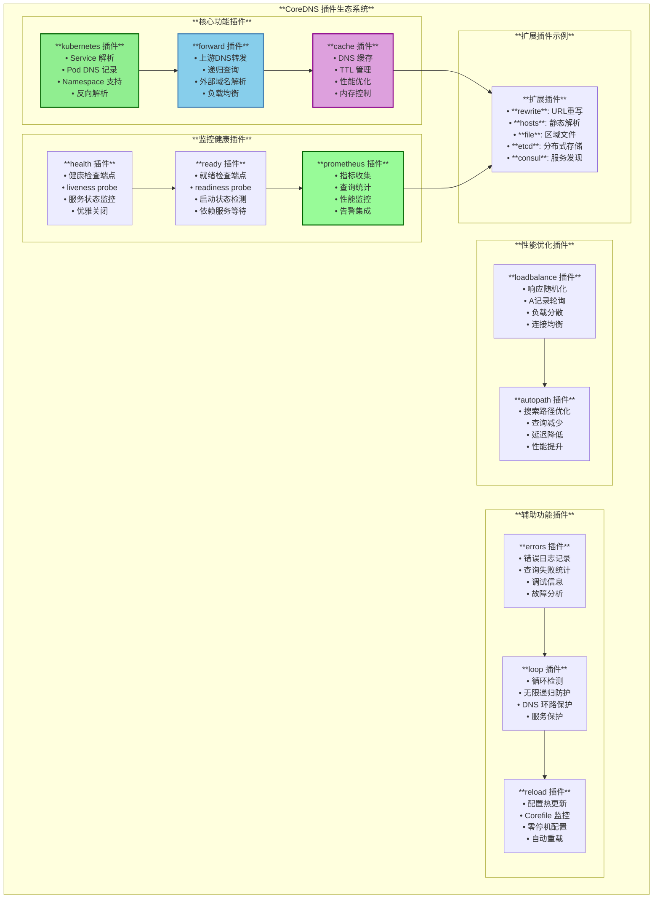
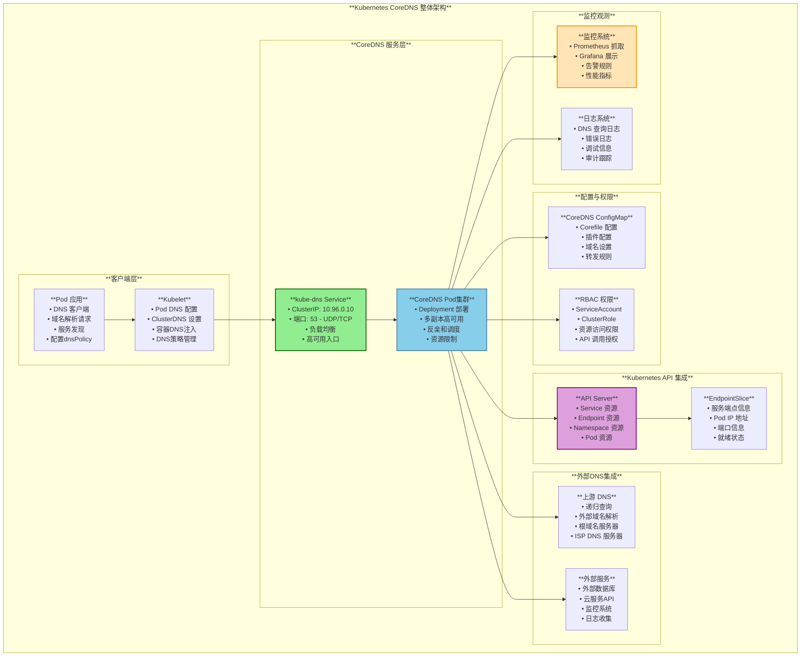
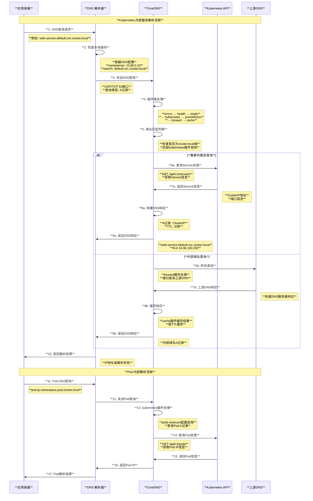
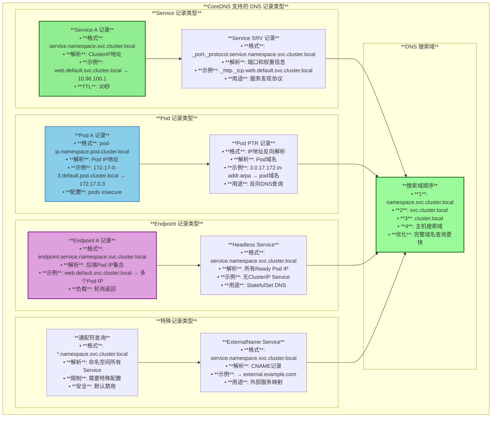
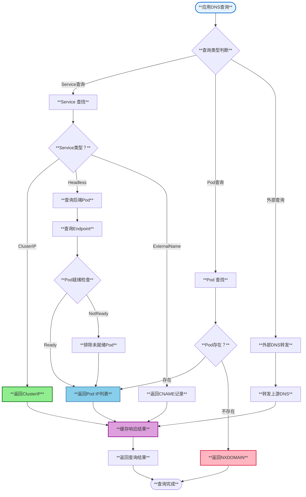
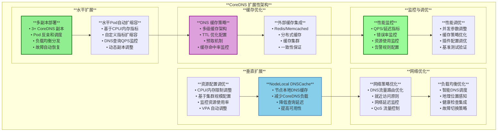

# Kubernetes CoreDNS 集群DNS深度解读

## 目录

1. [概述](#概述)
2. [CoreDNS 核心概念](#coredns-核心概念)
3. [CoreDNS 整体架构](#coredns-整体架构)
4. [Corefile 配置解析](#corefile-配置解析)
5. [Kubernetes 集成机制](#kubernetes-集成机制)
6. [DNS 解析流程](#dns-解析流程)
7. [服务发现机制](#服务发现机制)
8. [高可用与扩展性](#高可用与扩展性)
9. [监控与故障排查](#监控与故障排查)
10. [总结](#总结)

---

## 概述

CoreDNS 是 Kubernetes 的官方 DNS 服务器，从 Kubernetes 1.13 开始成为默认的集群 DNS 解决方案，取代了之前的 kube-dns。CoreDNS 基于插件架构设计，提供了灵活可扩展的 DNS 服务，支持服务发现、负载均衡、健康检查和监控等功能。本文档基于 Kubernetes 源码深入解读 CoreDNS 的架构设计、工作原理和集成机制。

### 核心特性

- **插件化架构**：基于中间件链的可插拔插件系统
- **服务发现**：与 Kubernetes Service 和 Endpoint 深度集成
- **负载均衡**：内置 DNS 负载均衡和故障转移
- **高性能**：基于 Go 语言开发，支持高并发 DNS 查询
- **可观测性**：内置 Prometheus 指标和健康检查
- **向后兼容**：与 kube-dns 完全兼容

---

## CoreDNS 核心概念

### 1. 插件架构设计

CoreDNS 采用中间件链式架构，每个插件处理特定的 DNS 功能：

```
DNS Query → Plugin Chain → DNS Response
    ↓
errors → health → ready → kubernetes → prometheus → forward → cache → loop → reload → loadbalance
```

### 2. 核心插件功能



---

## CoreDNS 整体架构

### 1. 集群架构图



---

## Corefile 配置解析

### 1. 标准 Corefile 配置

基于源码 `cluster/addons/dns/coredns/coredns.yaml.base`：

```corefile
.:53 {
    # 错误日志记录
    errors
    
    # 健康检查端点 - /health
    health {
        lameduck 5s
    }
    
    # 就绪检查端点 - /ready  
    ready
    
    # Kubernetes 集群内 DNS 解析
    kubernetes cluster.local in-addr.arpa ip6.arpa {
        pods insecure          # 允许 Pod DNS 记录查询
        fallthrough in-addr.arpa ip6.arpa  # 反向解析失败时传递
        ttl 30                 # DNS 记录 TTL
    }
    
    # Prometheus 指标端点 - :9153/metrics
    prometheus :9153
    
    # 上游 DNS 转发
    forward . /etc/resolv.conf {
        max_concurrent 1000    # 最大并发查询数
    }
    
    # DNS 响应缓存
    cache 30
    
    # DNS 查询循环检测
    loop
    
    # 配置文件热重载
    reload
    
    # 负载均衡 - A 记录随机排序
    loadbalance
}
```

### 2. 配置参数详解

```yaml
# CoreDNS ConfigMap 配置
apiVersion: v1
kind: ConfigMap
metadata:
  name: coredns
  namespace: kube-system
data:
  Corefile: |
    # 全局配置块 - 监听所有域名的53端口
    .:53 {
        # === 日志与监控插件 ===
        errors                          # 启用错误日志
        health {                        # 健康检查配置
            lameduck 5s                 # 优雅关闭等待时间
        }
        ready                           # 就绪状态检查
        
        # === Kubernetes 集群解析 ===
        kubernetes cluster.local in-addr.arpa ip6.arpa {
            pods insecure               # 允许Pod A/AAAA记录查询
            fallthrough in-addr.arpa ip6.arpa  # PTR查询失败时传递给下游
            ttl 30                      # Kubernetes记录默认TTL
            
            # 可选配置
            # endpoint_pod_names         # 启用端点Pod名称解析
            # noendpoints                # 禁用endpoint记录
        }
        
        # === 监控指标 ===
        prometheus :9153                # 在9153端口暴露指标
        
        # === 外部DNS转发 ===  
        forward . /etc/resolv.conf {
            max_concurrent 1000         # 最大并发转发请求
            # policy round_robin         # 转发策略：轮询
            # except cluster.local       # 排除内部域名
        }
        
        # === 缓存优化 ===
        cache 30 {                      # 30秒TTL缓存
            # success 9984 30            # 成功响应缓存配置
            # denial 9984 5              # 否定响应缓存配置  
        }
        
        # === 安全与性能 ===
        loop                            # 循环检测和防护
        reload                          # 配置自动重载
        loadbalance                     # A记录响应随机排序
    }
```

---

## Kubernetes 集成机制

### 1. CoreDNS 部署清单

基于源码 `cmd/kubeadm/app/phases/addons/dns/manifests.go`：

```yaml
# ServiceAccount - CoreDNS 服务账号
apiVersion: v1
kind: ServiceAccount
metadata:
  name: coredns
  namespace: kube-system

---
# ClusterRole - CoreDNS 集群角色权限
apiVersion: rbac.authorization.k8s.io/v1
kind: ClusterRole
metadata:
  name: system:coredns
rules:
- apiGroups: [""]
  resources: ["endpoints", "services", "pods", "namespaces"]
  verbs: ["list", "watch"]
- apiGroups: ["discovery.k8s.io"]  
  resources: ["endpointslices"]
  verbs: ["list", "watch"]

---
# ClusterRoleBinding - 权限绑定
apiVersion: rbac.authorization.k8s.io/v1
kind: ClusterRoleBinding
metadata:
  name: system:coredns
roleRef:
  apiGroup: rbac.authorization.k8s.io
  kind: ClusterRole
  name: system:coredns
subjects:
- kind: ServiceAccount
  name: coredns
  namespace: kube-system

---
# Deployment - CoreDNS 部署
apiVersion: apps/v1
kind: Deployment
metadata:
  name: coredns
  namespace: kube-system
  labels:
    k8s-app: kube-dns
spec:
  replicas: 2
  strategy:
    type: RollingUpdate
    rollingUpdate:
      maxUnavailable: 1
  selector:
    matchLabels:
      k8s-app: kube-dns
  template:
    metadata:
      labels:
        k8s-app: kube-dns
    spec:
      priorityClassName: system-cluster-critical
      serviceAccountName: coredns
      
      # Pod 反亲和 - 分散调度
      affinity:
        podAntiAffinity:
          preferredDuringSchedulingIgnoredDuringExecution:
          - weight: 100
            podAffinityTerm:
              labelSelector:
                matchExpressions:
                - key: k8s-app
                  operator: In
                  values: ["kube-dns"]
              topologyKey: kubernetes.io/hostname
              
      # 容忍污点 - 在控制节点运行
      tolerations:
      - key: CriticalAddonsOnly
        operator: Exists
      - key: node-role.kubernetes.io/master
        effect: NoSchedule
        
      nodeSelector:
        kubernetes.io/os: linux
        
      containers:
      - name: coredns
        image: registry.k8s.io/coredns/coredns:v1.11.1
        imagePullPolicy: IfNotPresent
        
        # 资源限制
        resources:
          limits:
            memory: 170Mi
          requests:
            cpu: 100m
            memory: 70Mi
            
        args: ["-conf", "/etc/coredns/Corefile"]
        
        # 配置挂载
        volumeMounts:
        - name: config-volume
          mountPath: /etc/coredns
          readOnly: true
          
        # 端口配置
        ports:
        - containerPort: 53
          name: dns
          protocol: UDP
        - containerPort: 53  
          name: dns-tcp
          protocol: TCP
        - containerPort: 9153
          name: metrics
          protocol: TCP
          
        # 存活检查
        livenessProbe:
          httpGet:
            path: /health
            port: 8080
            scheme: HTTP
          initialDelaySeconds: 60
          timeoutSeconds: 5
          successThreshold: 1
          failureThreshold: 5
          
        # 就绪检查
        readinessProbe:
          httpGet:
            path: /ready
            port: 8181
            scheme: HTTP
            
        # 安全上下文
        securityContext:
          allowPrivilegeEscalation: false
          capabilities:
            add: ["NET_BIND_SERVICE"]
            drop: ["ALL"]
          readOnlyRootFilesystem: true
          
      dnsPolicy: Default
      
      # 配置卷
      volumes:
      - name: config-volume
        configMap:
          name: coredns
          items:
          - key: Corefile
            path: Corefile

---
# Service - kube-dns 服务
apiVersion: v1
kind: Service
metadata:
  name: kube-dns
  namespace: kube-system
  annotations:
    prometheus.io/port: "9153"
    prometheus.io/scrape: "true"
  labels:
    k8s-app: kube-dns
spec:
  selector:
    k8s-app: kube-dns
  clusterIP: 10.96.0.10  # 固定集群DNS IP
  ports:
  - name: dns
    port: 53
    protocol: UDP
  - name: dns-tcp
    port: 53
    protocol: TCP  
  - name: metrics
    port: 9153
    protocol: TCP
```

### 2. Kubelet DNS 配置集成

基于源码 `pkg/kubelet/network/dns/dns.go`：

```go
// GetPodDNS 为 Pod 获取 DNS 配置
func (c *Configurer) GetPodDNS(pod *v1.Pod) (*runtimeapi.DNSConfig, error) {
    dnsConfig, err := c.getHostDNSConfig(c.ResolverConfig)
    if err != nil {
        return nil, err
    }

    dnsType, err := getPodDNSType- pod
    if err != nil {
        klog.ErrorS(err, "Failed to get DNS type for pod. Falling back to DNSClusterFirst policy.", "pod", klog.KObj- pod)
        dnsType = podDNSCluster
    }
    
    switch dnsType {
    case podDNSNone:
        // DNSNone 使用空的 DNS 设置
        dnsConfig = &runtimeapi.DNSConfig{}
    case podDNSCluster:
        if len(c.clusterDNS) != 0 {
            // DNSClusterFirst 策略 - 使用 CoreDNS
            dnsConfig.Servers = []string{}
            for _, ip := range c.clusterDNS {
                dnsConfig.Servers = append(dnsConfig.Servers, ip.String- )
            }
            dnsConfig.Searches = c.generateSearchesForDNSClusterFirst(dnsConfig.Searches, pod)
            dnsConfig.Options = defaultDNSOptions
            break
        }
        // 回退到 DNSDefault
        fallthrough
    case podDNSHost:
        // 使用宿主机 DNS 设置
        if c.ResolverConfig == "" {
            for _, nodeIP := range c.nodeIPs {
                if utilnet.IsIPv6- nodeIP {
                    dnsConfig.Servers = append(dnsConfig.Servers, "::1")
                } else {
                    dnsConfig.Servers = append(dnsConfig.Servers, "127.0.0.1")
                }
            }
            dnsConfig.Searches = []string{"."}
        }
    }

    // 合并 Pod 自定义 DNS 配置
    if pod.Spec.DNSConfig != nil {
        dnsConfig = appendDNSConfig(dnsConfig, pod.Spec.DNSConfig)
    }
    return c.formDNSConfigFitsLimits(dnsConfig, pod), nil
}

// generateSearchesForDNSClusterFirst 生成集群DNS搜索域
func (c *Configurer) generateSearchesForDNSClusterFirst(hostSearch []string, pod *v1.Pod) []string {
    searches := []string{}
    
    // 添加命名空间搜索域
    searches = append(searches, pod.Namespace+".svc."+c.clusterDomain)
    searches = append(searches, "svc."+c.clusterDomain)
    searches = append(searches, c.clusterDomain)
    
    // 合并宿主机搜索域（去重）
    for _, search := range hostSearch {
        if !containsString(searches, search) {
            searches = append(searches, search)
        }
    }
    return searches
}
```

---

## DNS 解析流程

### 1. DNS 查询处理流程



### 2. DNS 记录类型与格式



---

## 服务发现机制

### 1. Service 发现实现

```yaml
# 标准 ClusterIP Service 示例
apiVersion: v1
kind: Service
metadata:
  name: web-service
  namespace: production
spec:
  selector:
    app: web
  ports:
  - name: http
    port: 80
    targetPort: 8080
  - name: https  
    port: 443
    targetPort: 8443
  type: ClusterIP

---
# DNS 记录自动生成
# A 记录: web-service.production.svc.cluster.local → 10.96.100.100
# SRV 记录: _http._tcp.web-service.production.svc.cluster.local → 80 10 10 web-service.production.svc.cluster.local
# SRV 记录: _https._tcp.web-service.production.svc.cluster.local → 443 10 10 web-service.production.svc.cluster.local
```

### 2. StatefulSet DNS 记录

```yaml  
# StatefulSet 与 Headless Service
apiVersion: v1
kind: Service
metadata:
  name: mysql-headless
  namespace: database
spec:
  selector:
    app: mysql
  clusterIP: None  # Headless Service
  ports:
  - port: 3306

---
apiVersion: apps/v1
kind: StatefulSet
metadata:
  name: mysql
  namespace: database
spec:
  serviceName: mysql-headless
  replicas: 3
  selector:
    matchLabels:
      app: mysql
  template:
    metadata:
      labels:
        app: mysql
    spec:
      containers:
      - name: mysql
        image: mysql:8.0
        ports:
        - containerPort: 3306

---
# 自动生成的 DNS 记录
# mysql-0.mysql-headless.database.svc.cluster.local → Pod IP
# mysql-1.mysql-headless.database.svc.cluster.local → Pod IP  
# mysql-2.mysql-headless.database.svc.cluster.local → Pod IP
# mysql-headless.database.svc.cluster.local → All Ready Pod IPs
```

### 3. 服务发现流程图



---

## 高可用与扩展性

### 1. 高可用部署策略

```yaml
# CoreDNS 高可用配置
apiVersion: apps/v1
kind: Deployment
metadata:
  name: coredns
  namespace: kube-system
spec:
  # 多副本部署
  replicas: 3
  
  strategy:
    type: RollingUpdate
    rollingUpdate:
      maxUnavailable: 1        # 滚动更新时保证至少2个副本运行
      maxSurge: 1             # 允许临时超出期望副本数
  
  template:
    spec:
      # 高优先级 - 保证调度
      priorityClassName: system-cluster-critical
      
      # Pod 反亲和 - 分散到不同节点
      affinity:
        podAntiAffinity:
          requiredDuringSchedulingIgnoredDuringExecution:
          - labelSelector:
              matchLabels:
                k8s-app: kube-dns
            topologyKey: kubernetes.io/hostname
        
        # 节点亲和 - 优先调度到控制节点
        nodeAffinity:
          preferredDuringSchedulingIgnoredDuringExecution:
          - weight: 100
            preference:
              matchExpressions:
              - key: node-role.kubernetes.io/master
                operator: Exists
      
      # 容忍污点 - 在控制节点运行
      tolerations:
      - key: CriticalAddonsOnly
        operator: Exists
      - key: node-role.kubernetes.io/master
        operator: Exists
        effect: NoSchedule
      
      containers:
      - name: coredns
        image: registry.k8s.io/coredns/coredns:v1.11.1
        
        # 资源配置 - 基于集群规模调整
        resources:
          requests:
            cpu: 100m
            memory: 70Mi
          limits:
            memory: 170Mi
        
        # 健康检查
        livenessProbe:
          httpGet:
            path: /health
            port: 8080
          initialDelaySeconds: 60
          periodSeconds: 10
          timeoutSeconds: 5
          failureThreshold: 5
        
        readinessProbe:
          httpGet:
            path: /ready
            port: 8181  
          initialDelaySeconds: 10
          periodSeconds: 2
          timeoutSeconds: 2
          failureThreshold: 3
```

### 2. 性能优化配置

```corefile
# 高性能 Corefile 配置
.:53 {
    # 错误日志优化
    errors {
        log . "combined {remote} {>id} {type} {class} {name} {proto} {size} {do} {bufsize} {rcode} {rflags} {rsize} {duration}"
    }
    
    # 健康检查优化
    health {
        lameduck 5s
    }
    ready
    
    # Kubernetes 插件优化
    kubernetes cluster.local in-addr.arpa ip6.arpa {
        pods insecure
        fallthrough in-addr.arpa ip6.arpa
        ttl 30
        
        # 性能优化选项
        endpoint_pod_names              # 启用Pod端点名称
        resyncperiod 5m                # API重新同步周期
    }
    
    # 监控指标
    prometheus :9153
    
    # 转发配置优化  
    forward . /etc/resolv.conf {
        max_concurrent 1000             # 最大并发请求
        policy round_robin              # 负载均衡策略
        health_check 5s                 # 上游健康检查
        max_fails 3                     # 最大失败次数
        expire 10s                      # 失败恢复时间
    }
    
    # 缓存优化
    cache 30 {
        success 9984 30                 # 成功缓存配置
        denial 9984 5                   # 否定缓存配置
        prefetch 10 60s 30%             # 预取配置
        serve_stale                     # 提供过期记录
    }
    
    # 性能插件
    loop                                # 循环检测
    reload 5s                           # 配置重载间隔
    loadbalance round_robin             # 负载均衡算法
    
    # 并发控制
    bufsize 1232                        # UDP 缓冲区大小
}
```

### 3. 扩展性架构图



---

## 监控与故障排查

### 1. 监控指标配置

```yaml
# CoreDNS ServiceMonitor - Prometheus 监控
apiVersion: monitoring.coreos.com/v1
kind: ServiceMonitor
metadata:
  name: coredns
  namespace: kube-system
  labels:
    k8s-app: kube-dns
spec:
  selector:
    matchLabels:
      k8s-app: kube-dns
  endpoints:
  - port: metrics
    interval: 30s
    path: /metrics

---
# CoreDNS 关键监控指标
apiVersion: v1
kind: ConfigMap
metadata:
  name: coredns-monitoring
  namespace: kube-system
data:
  key-metrics.yaml: |
    # DNS 查询指标
    - coredns_dns_requests_total            # DNS 请求总数
    - coredns_dns_responses_total           # DNS 响应总数  
    - coredns_dns_request_duration_seconds  # DNS 请求延迟
    - coredns_dns_response_size_bytes       # DNS 响应大小
    
    # 插件指标
    - coredns_kubernetes_dns_programming_duration_seconds  # Kubernetes API 同步耗时
    - coredns_cache_entries                 # 缓存条目数量
    - coredns_cache_hits_total              # 缓存命中次数
    - coredns_cache_misses_total            # 缓存未命中次数
    
    # 转发指标
    - coredns_forward_requests_total        # 转发请求总数
    - coredns_forward_responses_total       # 转发响应总数
    - coredns_forward_max_concurrent_rejects_total  # 并发限制拒绝次数
    
    # 健康指标
    - coredns_health_request_duration_seconds  # 健康检查延迟
    - coredns_ready                         # 就绪状态
```

### 2. 常见问题排查

```bash
#!/bin/bash
# CoreDNS 故障排查脚本

echo "=== CoreDNS 故障排查工具 ==="

# 1. 检查 CoreDNS Pod 状态
echo "1. CoreDNS Pod 状态检查..."
kubectl get pods -n kube-system -l k8s-app=kube-dns -o wide

# 2. 检查 CoreDNS Service 状态
echo "2. CoreDNS Service 状态检查..."
kubectl get svc -n kube-system kube-dns
kubectl describe svc -n kube-system kube-dns

# 3. 检查 CoreDNS 配置
echo "3. CoreDNS 配置检查..."
kubectl get configmap -n kube-system coredns -o yaml

# 4. 检查 CoreDNS 日志
echo "4. CoreDNS 日志检查..."
kubectl logs -n kube-system -l k8s-app=kube-dns --tail=100

# 5. 检查 DNS 解析功能
echo "5. DNS 解析功能测试..."
kubectl run dns-test --image=busybox:1.28 --rm -it --restart=Never -- nslookup kubernetes.default.svc.cluster.local

# 6. 检查上游 DNS
echo "6. 上游 DNS 连通性检查..."
kubectl exec -n kube-system deploy/coredns -- nslookup google.com

# 7. 检查性能指标
echo "7. CoreDNS 性能指标..."
kubectl exec -n kube-system deploy/coredns -- wget -qO- http://localhost:9153/metrics | grep -E "(coredns_dns_requests_total|coredns_dns_request_duration)"

# 8. 网络连通性检查
echo "8. 网络连通性检查..."
kubectl get ep -n kube-system kube-dns
kubectl exec -n kube-system deploy/coredns -- netstat -ln | grep :53

# 9. 资源使用情况
echo "9. 资源使用情况..."
kubectl top pods -n kube-system -l k8s-app=kube-dns

# 10. 事件检查
echo "10. 相关事件检查..."
kubectl get events -n kube-system | grep -i coredns
```

### 3. 性能调优建议

```yaml
# 大规模集群 CoreDNS 优化配置
apiVersion: v1
kind: ConfigMap
metadata:
  name: coredns-tuned
  namespace: kube-system
data:
  Corefile: |
    # 针对大规模集群的优化配置
    .:53 {
        # 错误处理 - 减少日志输出
        errors {
            consolidate 5m ".* i/o timeout$" warning
        }
        
        # 健康检查优化
        health {
            lameduck 5s
        }
        ready
        
        # Kubernetes 插件优化
        kubernetes cluster.local in-addr.arpa ip6.arpa {
            pods insecure
            fallthrough in-addr.arpa ip6.arpa
            ttl 30
            
            # 大规模集群优化
            endpoint_pod_names
            resyncperiod 3m              # 减少API调用频率
            noendpoints                  # 大集群禁用endpoint记录
        }
        
        # 监控优化 - 采样
        prometheus :9153 {
            metrics_path /metrics
            # 可配置指标采样
        }
        
        # 转发优化
        forward . 8.8.8.8 8.8.4.4 {
            max_concurrent 1000          # 提高并发数
            policy round_robin           # 轮询策略
            health_check 10s            # 健康检查间隔
            max_fails 3                 # 最大失败次数
            expire 10s                  # 失败重试间隔
            except cluster.local        # 排除集群域
        }
        
        # 缓存优化
        cache 30 {
            success 9984 30             # 增大缓存容量
            denial 9984 5               # 否定答案缓存
            prefetch 10 60s 30%         # 预取配置
            serve_stale                 # 提供过期数据
        }
        
        # 性能插件
        loop
        reload 5s                       # 减少重载检查频率
        loadbalance round_robin         # 负载均衡
        
        # 请求限制（可选）
        ratelimit 1000 per-second {
            whitelist 10.0.0.0/8
            whitelist 172.16.0.0/12  
        }
    }

---
# 资源配置优化
apiVersion: apps/v1
kind: Deployment
metadata:
  name: coredns
spec:
  replicas: 5                           # 增加副本数
  template:
    spec:
      containers:
      - name: coredns
        resources:
          requests:
            cpu: 500m                   # 增加CPU配置
            memory: 200Mi               # 增加内存配置
          limits:
            cpu: 2000m
            memory: 500Mi
        
        # JVM调优（如适用）
        env:
        - name: GOMAXPROCS
          value: "4"                    # 限制Go并发数
```

---

## 配置使用本地 Node DNS Server

### 配置 CoreDNS 转发到节点 DNS

在某些场景下，需要 CoreDNS 将特定域名的查询转发到宿主机节点的 DNS 服务器进行解析（例如：企业内网域名）。

#### 配置方法

```yaml
apiVersion: v1
kind: ConfigMap
metadata:
  name: coredns
  namespace: kube-system
data:
  Corefile: |
    .:53 {
        errors
        health {
            lameduck 5s
        }
        ready
        
        # Kubernetes 集群域名解析
        kubernetes cluster.local in-addr.arpa ip6.arpa {
            pods insecure
            fallthrough in-addr.arpa ip6.arpa
            ttl 30
        }
        
        # 转发到宿主机 DNS（使用 /etc/resolv.conf）
        forward . /etc/resolv.conf {
            prefer_udp
            policy sequential
            health_check 5s
        }
        
        # 或指定特定节点 DNS 服务器
        # forward . 192.168.1.1 8.8.8.8
        
        prometheus :9153
        cache 30
        loop
        reload
        loadbalance
    }
    
    # 企业内网域名单独配置
    example.corp:53 {
        errors
        cache 30
        # 转发到企业内网 DNS
        forward . 10.0.0.53 10.0.0.54
    }
```

#### 使用节点本地 DNS 配置

**方式 1：使用 `/etc/resolv.conf`**

CoreDNS Pod 会继承节点的 `/etc/resolv.conf`：

```yaml
spec:
  dnsPolicy: Default  # 使用宿主机 DNS 配置
  containers:
  - name: coredns
    volumeMounts:
    - name: host-resolv
      mountPath: /etc/resolv.conf
      readOnly: true
  volumes:
  - name: host-resolv
    hostPath:
      path: /etc/resolv.conf
      type: File
```

**方式 2：显式指定节点 DNS**

```yaml
forward . 169.254.169.254  # 云环境元数据服务
forward . 192.168.1.1      # 本地网关 DNS
forward . /etc/resolv.conf # 节点默认 DNS
```

#### 完整示例：混合 DNS 解析

```yaml
apiVersion: v1
kind: ConfigMap
metadata:
  name: coredns
  namespace: kube-system
data:
  Corefile: |
    # 集群内部域名
    cluster.local:53 {
        errors
        cache 30
        kubernetes cluster.local in-addr.arpa ip6.arpa {
            pods insecure
            fallthrough in-addr.arpa ip6.arpa
        }
    }
    
    # 企业内网域名
    corp.example.com:53 {
        errors
        cache 300
        forward . 10.10.10.53 10.10.10.54 {
            policy sequential
            health_check 10s
        }
    }
    
    # 其他域名使用节点 DNS
    .:53 {
        errors
        health
        ready
        
        # 优先使用节点 /etc/resolv.conf 中的 DNS
        forward . /etc/resolv.conf {
            prefer_udp
            max_fails 3
            expire 10s
            policy sequential
        }
        
        prometheus :9153
        cache 30
        loop
        reload
        loadbalance
    }
```

#### 验证配置

```bash
# 1. 查看 CoreDNS 配置
kubectl get configmap coredns -n kube-system -o yaml

# 2. 测试 DNS 解析
kubectl run -it --rm debug --image=busybox --restart=Never -- nslookup example.corp

# 3. 查看 CoreDNS 日志
kubectl logs -n kube-system -l k8s-app=kube-dns --tail=50

# 4. 在 CoreDNS Pod 中检查 /etc/resolv.conf
kubectl exec -n kube-system coredns-xxxxx -- cat /etc/resolv.conf
```

#### 注意事项

1. **DNS 循环依赖**：避免 CoreDNS 转发到集群 Service IP，会导致循环查询
2. **性能影响**：节点 DNS 查询会增加延迟，建议使用缓存
3. **健康检查**：配置 `health_check` 检测上游 DNS 可用性
4. **策略选择**：
   - `random`: 随机选择上游 DNS
   - `round_robin`: 轮询
   - `sequential`: 顺序尝试（推荐）

---

## 总结

CoreDNS 作为 Kubernetes 的核心基础设施组件，为集群提供了稳定可靠的 DNS 服务和服务发现能力。其插件化的架构设计使其具有高度的可扩展性和灵活性，能够适应不同规模和场景的部署需求。

### 核心价值

1. **服务发现基石**：为 Kubernetes 服务发现提供 DNS 解析能力
2. **插件化架构**：灵活的中间件链支持功能定制和扩展
3. **高可用设计**：多副本部署和故障自愈机制保证服务稳定性
4. **性能优化**：多级缓存和负载均衡提供高性能 DNS 解析
5. **可观测性**：完善的监控指标和健康检查支持运维管理

### 技术特点

- **云原生设计**：与 Kubernetes API 深度集成，支持动态配置更新
- **标准兼容**：完全兼容 RFC DNS 标准和 kube-dns 接口
- **扩展性强**：支持水平和垂直扩展，适应集群规模变化
- **运维友好**：提供丰富的监控指标和故障排查工具
- **安全可靠**：支持 RBAC 权限控制和 DNS 查询限制

CoreDNS 的成功部署和优化需要深入理解其插件机制、配置参数和性能特性。在生产环境中，合理的资源配置、监控告警和故障排查流程是保障 DNS 服务稳定运行的关键。随着集群规模的增长和业务复杂度的提升，CoreDNS 的调优和扩展将成为集群运维的重要组成部分。

