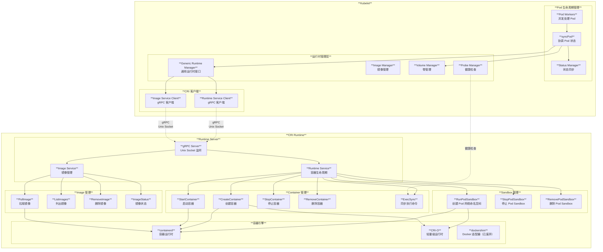
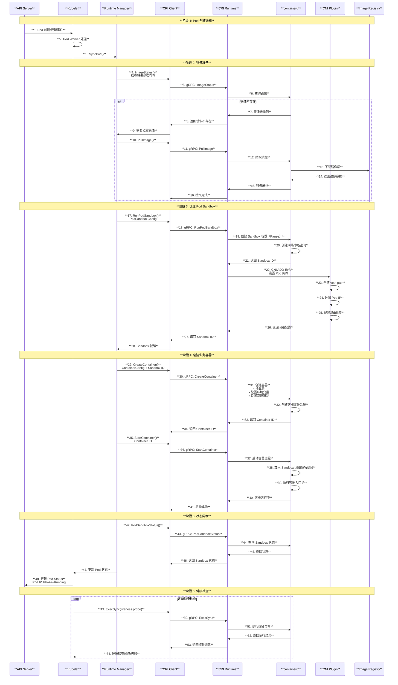

# Kubernetes CRI (Container Runtime Interface) 架构与原理深度解读

## 目录

1. [概述](#概述)
2. [CRI 核心概念](#cri-核心概念)
3. [CRI 整体架构图](#cri-整体架构图)
4. [CRI API 接口详解](#cri-api-接口详解)
5. [RuntimeService 接口深度解析](#runtimeservice-接口深度解析)
6. [ImageService 接口深度解析](#imageservice-接口深度解析)
7. [Pod Sandbox 生命周期管理](#pod-sandbox-生命周期管理)
8. [Container 生命周期管理](#container-生命周期管理)
9. [CRI 流式接口实现](#cri-流式接口实现)
10. [主流 CRI 实现对比](#主流-cri-实现对比)
11. [CRI 性能优化与监控](#cri-性能优化与监控)
12. [故障排除与调试](#故障排除与调试)
13. [总结](#总结)

---

## 概述

Container Runtime Interface (CRI) 是 Kubernetes 定义的一套标准接口，用于 Kubelet 与容器运行时之间的通信。CRI 使得 Kubernetes 能够支持多种容器运行时，而无需修改核心代码。本文档基于 Kubernetes 源码深入解读 CRI 的架构设计、接口定义和实现原理。

### 核心特性

- **标准化接口**：定义了统一的容器运行时接口规范
- **插件化架构**：支持多种容器运行时实现
- **gRPC 通信**：使用 gRPC 进行高效的进程间通信
- **流式支持**：支持 exec、attach、port-forward 等流式操作

---

## CRI 核心概念

### 1. CRI 接口定义

基于源码 `staging/src/k8s.io/cri-api/pkg/apis/services.go`：

```go
// RuntimeService 接口定义
type RuntimeService interface {
    RuntimeVersioner
    ContainerManager
    PodSandboxManager
    ContainerStatsManager

    UpdateRuntimeConfig(ctx context.Context, runtimeConfig *runtimeapi.RuntimeConfig) error
    Status(ctx context.Context, verbose bool) (*runtimeapi.StatusResponse, error)
    RuntimeConfig(ctx context.Context) (*runtimeapi.RuntimeConfigResponse, error)
}

// ImageManagerService 接口定义
type ImageManagerService interface {
    ListImages(ctx context.Context, filter *runtimeapi.ImageFilter) ([]*runtimeapi.Image, error)
    ImageStatus(ctx context.Context, image *runtimeapi.ImageSpec, verbose bool) (*runtimeapi.ImageStatusResponse, error)
    PullImage(ctx context.Context, image *runtimeapi.ImageSpec, auth *runtimeapi.AuthConfig, podSandboxConfig *runtimeapi.PodSandboxConfig) (string, error)
    RemoveImage(ctx context.Context, image *runtimeapi.ImageSpec) error
    ImageFsInfo(ctx context.Context) (*runtimeapi.ImageFsInfoResponse, error)
}
```

### 2. gRPC 服务定义

基于 `staging/src/k8s.io/cri-api/pkg/apis/runtime/v1/api.proto`：

```protobuf
service RuntimeService {
    // 版本信息
    rpc Version(VersionRequest) returns (VersionResponse) {}
    rpc Status(StatusRequest) returns (StatusResponse) {}
    
    // Pod Sandbox 管理
    rpc RunPodSandbox(RunPodSandboxRequest) returns (RunPodSandboxResponse) {}
    rpc StopPodSandbox(StopPodSandboxRequest) returns (StopPodSandboxResponse) {}
    rpc RemovePodSandbox(RemovePodSandboxRequest) returns (RemovePodSandboxResponse) {}
    rpc PodSandboxStatus(PodSandboxStatusRequest) returns (PodSandboxStatusResponse) {}
    rpc ListPodSandbox(ListPodSandboxRequest) returns (ListPodSandboxResponse) {}
    
    // Container 管理
    rpc CreateContainer(CreateContainerRequest) returns (CreateContainerResponse) {}
    rpc StartContainer(StartContainerRequest) returns (StartContainerResponse) {}
    rpc StopContainer(StopContainerRequest) returns (StopContainerResponse) {}
    rpc RemoveContainer(RemoveContainerRequest) returns (RemoveContainerResponse) {}
    rpc ListContainers(ListContainersRequest) returns (ListContainersResponse) {}
    rpc ContainerStatus(ContainerStatusRequest) returns (ContainerStatusResponse) {}
    
    // 流式接口
    rpc Exec(ExecRequest) returns (ExecResponse) {}
    rpc Attach(AttachRequest) returns (AttachResponse) {}
    rpc PortForward(PortForwardRequest) returns (PortForwardResponse) {}
}

service ImageService {
    rpc ListImages(ListImagesRequest) returns (ListImagesResponse) {}
    rpc ImageStatus(ImageStatusRequest) returns (ImageStatusResponse) {}
    rpc PullImage(PullImageRequest) returns (PullImageResponse) {}
    rpc RemoveImage(RemoveImageRequest) returns (RemoveImageResponse) {}
    rpc ImageFsInfo(ImageFsInfoRequest) returns (ImageFsInfoResponse) {}
}
```

### 3. CRI 通信机制

基于源码 `pkg/kubelet/cri/remote/remote_runtime.go`：

```go
// remoteRuntimeService 是 gRPC 实现
type remoteRuntimeService struct {
    timeout       time.Duration
    runtimeClient runtimeapi.RuntimeServiceClient
    logReduction  *logreduction.LogReduction
}

// 创建容器的实现
func (r *remoteRuntimeService) CreateContainer(ctx context.Context, podSandBoxID string, config *runtimeapi.ContainerConfig, sandboxConfig *runtimeapi.PodSandboxConfig) (string, error) {
    ctx, cancel := context.WithTimeout(ctx, r.timeout)
    defer cancel()

    resp, err := r.runtimeClient.CreateContainer(ctx, &runtimeapi.CreateContainerRequest{
        PodSandboxId:  podSandBoxID,
        Config:        config,
        SandboxConfig: sandboxConfig,
    })
    
    if err != nil {
        return "", err
    }
    
    return resp.ContainerId, nil
}
```

---

## CRI 整体架构图

### 3.1 CRI 功能架构图



### 3.2 CRI 完整交互时序图



上方的架构图展示了 CRI 在 Kubernetes 集群中的完整架构，包括：

1. **Kubelet 组件**：Runtime Manager、Image Manager、Pod Workers 等
2. **CRI 接口层**：Runtime Service Client、Image Service Client 等
3. **容器运行时实现**：containerd、CRI-O、Docker 等

---

## CRI API 接口详解

### 1. 接口分类

CRI API 接口结构图展示了完整的接口分类：

- **RuntimeService API**：核心运行时管理接口
- **ImageService API**：镜像管理接口  
- **Statistics API**：性能统计接口

### 2. 数据结构

#### PodSandboxConfig

```go
type PodSandboxConfig struct {
    Metadata     *PodSandboxMetadata
    Hostname     string
    LogDirectory string
    DnsConfig    *DNSConfig
    PortMappings []*PortMapping
    Labels       map[string]string
    Annotations  map[string]string
    Linux        *LinuxPodSandboxConfig
    Windows      *WindowsPodSandboxConfig
}
```

#### ContainerConfig

```go
type ContainerConfig struct {
    Metadata        *ContainerMetadata
    Image           *ImageSpec
    Command         []string
    Args            []string
    WorkingDir      string
    Envs            []*KeyValue
    Mounts          []*Mount
    Devices         []*Device
    Labels          map[string]string
    Annotations     map[string]string
    LogPath         string
    Stdin           bool
    StdinOnce       bool
    Tty             bool
    Linux           *LinuxContainerConfig
    Windows         *WindowsContainerConfig
}
```

---

## RuntimeService 接口深度解析

### 1. Pod Sandbox 管理

#### RunPodSandbox

基于源码 `pkg/kubelet/kuberuntime/kuberuntime_sandbox.go`：

```go
func (m *kubeGenericRuntimeManager) createPodSandbox(ctx context.Context, pod *v1.Pod, attempt uint32) (string, string, error) {
    // 1. 生成 Pod 沙箱配置
    podSandboxConfig, err := m.generatePodSandboxConfig(pod, attempt)
    if err != nil {
        return "", "", err
    }

    // 2. 创建日志目录
    err = m.osInterface.MkdirAll(podSandboxConfig.LogDirectory, 0755)
    if err != nil {
        return "", "", err
    }

    // 3. 确定运行时处理器
    runtimeHandler := ""
    if m.runtimeClassManager != nil {
        runtimeHandler, err = m.runtimeClassManager.LookupRuntimeHandler(pod.Spec.RuntimeClassName)
        if err != nil {
            return "", "", err
        }
    }

    // 4. 调用容器运行时创建沙箱
    podSandBoxID, err := m.runtimeService.RunPodSandbox(ctx, podSandboxConfig, runtimeHandler)
    if err != nil {
        return "", "", err
    }

    return podSandBoxID, "", nil
}
```

#### 沙箱配置生成

```go
func (m *kubeGenericRuntimeManager) generatePodSandboxConfig(pod *v1.Pod, attempt uint32) (*runtimeapi.PodSandboxConfig, error) {
    podSandboxConfig := &runtimeapi.PodSandboxConfig{
        Metadata: &runtimeapi.PodSandboxMetadata{
            Name:      pod.Name,
            Namespace: pod.Namespace,
            Uid:       string(pod.UID),
            Attempt:   attempt,
        },
        Labels:      newPodLabels(pod),
        Annotations: newPodAnnotations(pod),
    }

    // DNS 配置
    dnsConfig, err := m.runtimeHelper.GetPodDNS(pod)
    if err != nil {
        return nil, err
    }
    podSandboxConfig.DnsConfig = dnsConfig

    // 主机名配置
    if !kubecontainer.IsHostNetworkPod(pod) {
        podHostname, podDomain, err := m.runtimeHelper.GeneratePodHostNameAndDomain(pod)
        if err != nil {
            return nil, err
        }
        podSandboxConfig.Hostname = podHostname
    }

    // 日志目录
    logDir := BuildPodLogsDirectory(pod.Namespace, pod.Name, pod.UID)
    podSandboxConfig.LogDirectory = logDir

    // 端口映射
    portMappings := []*runtimeapi.PortMapping{}
    for _, c := range pod.Spec.Containers {
        containerPortMappings := kubecontainer.MakePortMappings(&c)
        for idx := range containerPortMappings {
            port := containerPortMappings[idx]
            portMappings = append(portMappings, &runtimeapi.PortMapping{
                HostIp:        port.HostIP,
                HostPort:      int32(port.HostPort),
                ContainerPort: int32(port.ContainerPort),
                Protocol:      toRuntimeProtocol(port.Protocol),
            })
        }
    }
    
    if len(portMappings) > 0 {
        podSandboxConfig.PortMappings = portMappings
    }

    return podSandboxConfig, nil
}
```

### 2. Container 管理

#### CreateContainer

基于源码 `pkg/kubelet/kuberuntime/kuberuntime_container.go`：

```go
func (m *kubeGenericRuntimeManager) startContainer(ctx context.Context, podSandboxID string, podSandboxConfig *runtimeapi.PodSandboxConfig, spec *startSpec, pod *v1.Pod, podStatus *kubecontainer.PodStatus, pullSecrets []v1.Secret, podIP string, podIPs []string) (string, error) {
    container := spec.container

    // 第1步：拉取镜像
    imageRef, msg, err := m.imagePuller.EnsureImageExists(ctx, pod, container, pullSecrets, podSandboxConfig)
    if err != nil {
        return msg, err
    }

    // 第2步：生成容器配置
    restartCount := calcRestartCount(podStatus, container.Name)
    containerConfig, cleanupAction, err := m.generateContainerConfig(ctx, container, pod, restartCount, podIP, imageRef, podIPs, target)
    if cleanupAction != nil {
        defer cleanupAction()
    }
    if err != nil {
        return "", ErrCreateContainerConfig
    }

    // 第3步：PreCreate 钩子
    err = m.internalLifecycle.PreCreateContainer(pod, container, containerConfig)
    if err != nil {
        return "", ErrPreCreateHook
    }

    // 第4步：调用 CRI 创建容器
    containerID, err := m.runtimeService.CreateContainer(ctx, podSandboxID, containerConfig, podSandboxConfig)
    if err != nil {
        return "", ErrCreateContainer
    }

    // 第5步：PreStart 钩子
    err = m.internalLifecycle.PreStartContainer(pod, container, containerID)
    if err != nil {
        return "", ErrPreStartHook
    }

    // 第6步：启动容器
    err = m.runtimeService.StartContainer(ctx, containerID)
    if err != nil {
        return "", kubecontainer.ErrRunContainer
    }

    return containerID, nil
}
```

---

## ImageService 接口深度解析

### 1. 镜像拉取流程

基于源码 `pkg/kubelet/images/image_manager.go`：

```go
func (m *imageManager) EnsureImageExists(ctx context.Context, pod *v1.Pod, container *v1.Container, pullSecrets []v1.Secret, podSandboxConfig *runtimeapi.PodSandboxConfig) (string, string, error) {
    // 1. 应用默认镜像标签
    image, err := applyDefaultImageTag(container.Image)
    if err != nil {
        return "", "", ErrInvalidImageName
    }

    // 2. 构建镜像规格
    spec := kubecontainer.ImageSpec{
        Image:       image,
        Annotations: podAnnotations,
    }

    // 3. 检查镜像是否存在
    imageRef, err := m.imageService.GetImageRef(ctx, spec)
    if err != nil {
        return "", "", ErrImageInspect
    }

    present := imageRef != ""
    if !shouldPullImage(container, present) {
        if present {
            return imageRef, "", nil
        }
        return "", "", ErrImageNeverPull
    }

    // 4. 检查退避策略
    backOffKey := fmt.Sprintf("%s_%s", pod.UID, container.Image)
    if m.backOff.IsInBackOffSinceUpdate(backOffKey, m.backOff.Clock.Now()) {
        return "", "", ErrImagePullBackOff
    }

    // 5. 执行镜像拉取
    pullChan := make(chan pullResult)
    m.puller.pullImage(ctx, spec, pullSecrets, pullChan, podSandboxConfig)
    imagePullResult := <-pullChan
    
    if imagePullResult.err != nil {
        m.backOff.Next(backOffKey, m.backOff.Clock.Now())
        return "", "", evalCRIPullErr(container, imagePullResult.err)
    }

    m.backOff.GC()
    return imagePullResult.imageRef, "", nil
}
```

### 2. 镜像拉取实现

基于源码 `pkg/kubelet/kuberuntime/kuberuntime_image.go`：

```go
func (m *kubeGenericRuntimeManager) PullImage(ctx context.Context, image kubecontainer.ImageSpec, pullSecrets []v1.Secret, podSandboxConfig *runtimeapi.PodSandboxConfig) (string, error) {
    img := image.Image
    repoToPull, _, _, err := parsers.ParseImageName(img)
    if err != nil {
        return "", err
    }

    // 构建认证信息
    keyring, err := credentialprovidersecrets.MakeDockerKeyring(pullSecrets, m.keyring)
    if err != nil {
        return "", err
    }

    imgSpec := toRuntimeAPIImageSpec(image)
    creds, withCredentials := keyring.Lookup(repoToPull)
    
    if !withCredentials {
        // 无认证拉取
        return m.imageService.PullImage(ctx, imgSpec, nil, podSandboxConfig)
    }

    // 尝试多个认证配置
    var pullErrs []error
    for _, currentCreds := range creds {
        auth := &runtimeapi.AuthConfig{
            Username:      currentCreds.Username,
            Password:      currentCreds.Password,
            Auth:          currentCreds.Auth,
            ServerAddress: currentCreds.ServerAddress,
            IdentityToken: currentCreds.IdentityToken,
            RegistryToken: currentCreds.RegistryToken,
        }

        imageRef, err := m.imageService.PullImage(ctx, imgSpec, auth, podSandboxConfig)
        if err == nil {
            return imageRef, nil
        }
        pullErrs = append(pullErrs, err)
    }

    return "", utilerrors.NewAggregate(pullErrs)
}
```

---

## Pod Sandbox 生命周期管理

### 1. 创建阶段

Pod 沙箱创建序列图展示了完整的创建流程：

1. **配置生成**：生成沙箱配置，包括网络、存储、安全等
2. **资源准备**：创建日志目录、准备运行时环境
3. **gRPC 调用**：调用容器运行时创建沙箱
4. **网络配置**：设置网络命名空间和接口
5. **状态返回**：返回沙箱 ID 和状态

### 2. 监控阶段

```go
// PodSandboxStatus 获取沙箱状态
func (r *remoteRuntimeService) PodSandboxStatus(ctx context.Context, podSandboxID string, verbose bool) (*runtimeapi.PodSandboxStatusResponse, error) {
    ctx, cancel := context.WithTimeout(ctx, r.timeout)
    defer cancel()

    resp, err := r.runtimeClient.PodSandboxStatus(ctx, &runtimeapi.PodSandboxStatusRequest{
        PodSandboxId: podSandboxID,
        Verbose:      verbose,
    })
    
    if err != nil {
        return nil, err
    }

    if resp.Status != nil {
        if err := verifySandboxStatus(resp.Status); err != nil {
            return nil, err
        }
    }

    return resp, nil
}
```

### 3. 清理阶段

```go
// RemovePodSandbox 删除沙箱
func (r *remoteRuntimeService) RemovePodSandbox(ctx context.Context, podSandboxID string) error {
    ctx, cancel := context.WithTimeout(ctx, r.timeout)
    defer cancel()

    _, err := r.runtimeClient.RemovePodSandbox(ctx, &runtimeapi.RemovePodSandboxRequest{
        PodSandboxId: podSandboxID,
    })

    if err != nil {
        return err
    }

    return nil
}
```

---

## Container 生命周期管理

### 1. 创建流程

基于源码分析，容器创建包括以下步骤：

1. **镜像准备**：确保所需镜像在本地存在
2. **配置生成**：生成容器运行时配置
3. **PreCreate 钩子**：执行创建前钩子
4. **CRI 调用**：调用运行时创建容器
5. **PreStart 钩子**：执行启动前钩子
6. **容器启动**：启动容器进程

### 2. 状态管理

```go
// ContainerStatus 获取容器状态
func (r *remoteRuntimeService) ContainerStatus(ctx context.Context, containerID string, verbose bool) (*runtimeapi.ContainerStatusResponse, error) {
    ctx, cancel := context.WithTimeout(ctx, r.timeout)
    defer cancel()

    resp, err := r.runtimeClient.ContainerStatus(ctx, &runtimeapi.ContainerStatusRequest{
        ContainerId: containerID,
        Verbose:     verbose,
    })
    
    if err != nil {
        if r.logReduction.ShouldMessageBePrinted(err.Error(), containerID) {
            klog.ErrorS(err, "ContainerStatus failed", "containerID", containerID)
        }
        return nil, err
    }

    if resp.Status != nil {
        if err := verifyContainerStatus(resp.Status); err != nil {
            return nil, err
        }
    }

    return resp, nil
}
```

### 3. 资源更新

```go
// UpdateContainerResources 动态更新容器资源
func (r *remoteRuntimeService) UpdateContainerResources(ctx context.Context, containerID string, resources *runtimeapi.ContainerResources) error {
    ctx, cancel := context.WithTimeout(ctx, r.timeout)
    defer cancel()

    _, err := r.runtimeClient.UpdateContainerResources(ctx, &runtimeapi.UpdateContainerResourcesRequest{
        ContainerId: containerID,
        Linux:       resources.GetLinux(),
        Windows:     resources.GetWindows(),
    })

    if err != nil {
        return err
    }

    return nil
}
```

---

## CRI 流式接口实现

### 1. 流式接口架构

CRI 流式接口实现图展示了 exec、attach、port-forward 的完整流程：

1. **客户端请求**：kubectl 发起 exec 请求
2. **Kubelet 处理**：Kubelet 调用 CRI Exec 接口
3. **流式端点创建**：容器运行时创建流式服务端点
4. **WebSocket 连接**：建立客户端到流式服务器的连接
5. **数据传输**：双向流式数据传输

### 2. Exec 实现

基于源码 `staging/src/k8s.io/kubelet/pkg/cri/streaming/server.go`：

```go
// Server 定义流式服务器接口
type Server interface {
    http.Handler
    
    GetExec(*runtimeapi.ExecRequest) (*runtimeapi.ExecResponse, error)
    GetAttach(req *runtimeapi.AttachRequest) (*runtimeapi.AttachResponse, error)
    GetPortForward(*runtimeapi.PortForwardRequest) (*runtimeapi.PortForwardResponse, error)
    
    Start(stayUp bool) error
    Stop() error
}

// Runtime 定义运行时执行接口
type Runtime interface {
    Exec(ctx context.Context, containerID string, cmd []string, in io.Reader, out, err io.WriteCloser, tty bool, resize <-chan remotecommand.TerminalSize) error
    Attach(ctx context.Context, containerID string, in io.Reader, out, err io.WriteCloser, tty bool, resize <-chan remotecommand.TerminalSize) error
    PortForward(ctx context.Context, podSandboxID string, port int32, stream io.ReadWriteCloser) error
}
```

### 3. 流式服务器配置

```go
type Config struct {
    // 流式服务器监听地址
    Addr string
    // TLS 配置
    TLSConfig *tls.Config
    // 基础 URL
    BaseURL *url.URL
    // 认证配置
    Auth StreamingAuthentication
    // 运行时实现
    Runtime Runtime
    // 连接超时
    StreamIdleTimeout     time.Duration
    StreamCreationTimeout time.Duration
}
```

---

## 主流 CRI 实现对比

### 1. containerd

**架构特点**：
- 云原生设计，专为 Kubernetes 优化
- 高性能，低资源消耗
- 插件化架构，支持多种存储和运行时
- 多平台支持（Linux、Windows）

**组件架构**：
```bash
containerd
├── gRPC API Server    # CRI 接口实现
├── Runtime Service    # 容器生命周期管理
├── Image Service      # 镜像管理服务
├── Snapshotter       # 存储快照管理
│   ├── overlayfs      # Linux overlay 文件系统
│   └── devicemapper   # 设备映射存储
├── Metadata Store     # 元数据存储 (bbolt)
└── containerd-shim    # 进程管理器
```

**配置示例**：
```toml
# /etc/containerd/config.toml
version = 2

[plugins."io.containerd.grpc.v1.cri"]
  sandbox_image = "registry.k8s.io/pause:3.9"
  
  [plugins."io.containerd.grpc.v1.cri".containerd]
    default_runtime_name = "runc"
    
    [plugins."io.containerd.grpc.v1.cri".containerd.runtimes.runc]
      runtime_type = "io.containerd.runc.v2"
      
  [plugins."io.containerd.grpc.v1.cri".cni]
    bin_dir = "/opt/cni/bin"
    conf_dir = "/etc/cni/net.d"
```

### 2. CRI-O

**架构特点**：
- 专为 Kubernetes 设计的轻量级容器运行时
- OCI 兼容，支持多种 OCI 运行时
- 安全增强，支持多种安全配置
- 简化配置，易于管理

**组件架构**：
```bash
CRI-O
├── gRPC Server       # CRI 接口实现
├── Runtime Service   # OCI 运行时管理
├── Image Service     # 镜像管理
├── Storage Driver    # 存储驱动
│   ├── overlayfs     # overlay 存储
│   └── btrfs         # Btrfs 存储
└── conmon           # 容器监控进程
```

**配置示例**：
```toml
# /etc/crio/crio.conf
[crio]
root = "/var/lib/containers/storage"
runroot = "/run/containers/storage"

[crio.api]
listen = "/var/run/crio/crio.sock"

[crio.runtime]
default_runtime = "runc"
conmon = "/usr/libexec/crio/conmon"

[crio.image]
default_transport = "docker://"
```

### 3. Docker Engine (已弃用)

**历史背景**：
- Kubernetes v1.24 开始移除 dockershim 支持
- Docker Engine 需要通过 cri-dockerd 适配器支持
- 功能丰富但架构复杂

**迁移建议**：
```bash
# 从 Docker 迁移到 containerd
# 1. 安装 containerd
sudo apt-get install containerd.io

# 2. 配置 containerd
sudo mkdir -p /etc/containerd
containerd config default | sudo tee /etc/containerd/config.toml

# 3. 重启服务
sudo systemctl restart containerd

# 4. 更新 kubelet 配置
--container-runtime-endpoint=unix:///run/containerd/containerd.sock
```

---

## CRI 性能优化与监控

### 1. 性能指标监控

基于源码 `pkg/kubelet/kuberuntime/instrumented_services.go`：

```go
// CRI 操作指标记录
func recordOperation(operation string, start time.Time) {
    metrics.RuntimeOperationsDuration.WithLabelValues(operation).Observe(time.Since(start).Seconds())
    metrics.RuntimeOperationsTotal.WithLabelValues(operation).Inc()
}

func recordError(operation string, err error) {
    if err != nil {
        metrics.RuntimeOperationsErrors.WithLabelValues(operation).Inc()
    }
}

// 关键操作的监控包装
func (in instrumentedRuntimeService) CreateContainer(ctx context.Context, podSandboxID string, config *runtimeapi.ContainerConfig, sandboxConfig *runtimeapi.PodSandboxConfig) (string, error) {
    const operation = "create_container"
    defer recordOperation(operation, time.Now())

    out, err := in.service.CreateContainer(ctx, podSandboxID, config, sandboxConfig)
    recordError(operation, err)
    return out, err
}
```

### 2. 关键性能指标

```yaml
# CRI 性能监控指标
- name: cri_operation_duration_seconds
  help: "CRI operation duration in seconds"
  type: histogram
  labels: [operation]
  
- name: cri_operation_total
  help: "Total CRI operations"
  type: counter
  labels: [operation]
  
- name: cri_operation_errors_total
  help: "Total CRI operation errors"  
  type: counter
  labels: [operation]
  
- name: cri_image_pull_duration_seconds
  help: "Image pull duration in seconds"
  type: histogram
  labels: [image]
  
- name: cri_container_start_duration_seconds
  help: "Container start duration in seconds"
  type: histogram
```

### 3. 性能优化建议

#### 镜像拉取优化

```yaml
# Kubelet 配置优化
apiVersion: kubelet.config.k8s.io/v1beta1
kind: KubeletConfiguration
imageGCHighThresholdPercent: 80
imageGCLowThresholdPercent: 70
serializeImagePulls: false         # 并行拉取镜像
maxParallelImagePulls: 3           # 最大并行数
registryPullQPS: 5                 # 拉取速率限制
registryBurst: 10                  # 突发限制
```

#### 容器运行时优化

```toml
# containerd 性能优化
[plugins."io.containerd.grpc.v1.cri"]
  enable_tls_streaming = false      # 禁用 TLS 流式传输
  max_container_log_line_size = 16384
  
  [plugins."io.containerd.grpc.v1.cri".containerd]
    disable_snapshot_annotations = true
    discard_unpacked_layers = true  # 丢弃解包层
```

---

## 故障排除与调试

### 1. 常见问题诊断

#### CRI 连接问题

```bash
# 检查 CRI 套接字
sudo ls -la /run/containerd/containerd.sock
sudo ls -la /var/run/crio/crio.sock

# 测试 CRI 连接
crictl --runtime-endpoint unix:///run/containerd/containerd.sock version
crictl --runtime-endpoint unix:///var/run/crio/crio.sock version

# 检查容器运行时状态
sudo systemctl status containerd
sudo systemctl status crio
```

#### 镜像拉取问题

```bash
# 检查镜像拉取日志
sudo journalctl -u kubelet -f | grep -i image
sudo journalctl -u containerd -f | grep -i pull

# 手动拉取镜像测试
crictl pull nginx:latest

# 检查镜像列表
crictl images
```

#### 容器创建问题

```bash
# 查看容器状态
crictl ps -a
crictl inspect <container-id>

# 查看 Pod 沙箱状态
crictl pods
crictl inspectp <sandbox-id>

# 查看容器日志
crictl logs <container-id>
```

### 2. 日志分析

#### Kubelet 日志关键信息

```bash
# CRI 调用日志
grep "RemoteRuntimeService" /var/log/kubelet.log
grep "CreateContainer" /var/log/kubelet.log
grep "StartContainer" /var/log/kubelet.log

# 镜像拉取日志
grep "PullImage" /var/log/kubelet.log
grep "EnsureImageExists" /var/log/kubelet.log

# 错误信息
grep "ERROR" /var/log/kubelet.log | grep -i cri
```

#### containerd 日志分析

```bash
# containerd 服务日志
sudo journalctl -u containerd -n 100

# CRI 插件日志
sudo journalctl -u containerd | grep "cri"

# 镜像管理日志
sudo journalctl -u containerd | grep -i image
```

### 3. 调试工具

#### crictl 命令集

```bash
# 容器运行时信息
crictl version
crictl info

# Pod 管理
crictl runp sandbox-config.json    # 创建 Pod 沙箱
crictl create container-config.json sandbox-config.json  # 创建容器
crictl start <container-id>        # 启动容器
crictl exec <container-id> /bin/sh # 执行命令

# 镜像管理
crictl images                      # 列出镜像
crictl rmi <image-id>             # 删除镜像
crictl imagefsinfo                # 镜像文件系统信息

# 状态查询
crictl stats                      # 容器统计信息
crictl completion bash > /etc/bash_completion.d/crictl
```

#### 配置文件示例

```json
// sandbox-config.json
{
  "metadata": {
    "name": "test-sandbox",
    "namespace": "default",
    "uid": "test-uid"
  },
  "hostname": "test-hostname",
  "log_directory": "/tmp/test-logs",
  "dns_config": {
    "servers": ["8.8.8.8"],
    "searches": ["default.svc.cluster.local"],
    "options": ["ndots:5"]
  }
}

// container-config.json  
{
  "metadata": {
    "name": "test-container"
  },
  "image": {
    "image": "nginx:latest"
  },
  "command": ["/usr/sbin/nginx"],
  "args": ["-g", "daemon off;"],
  "log_path": "test-container.log"
}
```

---

## 总结

### 🔑 **核心要点**

1. **标准化接口**：CRI 提供了统一的容器运行时接口，实现了 Kubelet 与容器运行时的解耦

2. **双服务架构**：RuntimeService 负责容器和沙箱管理，ImageService 负责镜像管理

3. **gRPC 通信**：使用高效的 gRPC 协议进行进程间通信，支持同步和流式操作

4. **插件化设计**：支持多种容器运行时实现，包括 containerd、CRI-O 等

### 🏆 **最佳实践**

- **选择合适的运行时**：生产环境推荐使用 containerd 或 CRI-O
- **配置性能优化**：调整镜像拉取、容器创建等关键操作的性能参数
- **建立监控体系**：监控 CRI 操作的性能指标和错误率
- **规范化运维**：建立标准的故障排查和调试流程

### 🎯 **发展趋势**

- **安全增强**：支持更多安全特性，如 gVisor、Kata Containers
- **性能优化**：持续优化启动时间和资源使用效率
- **云原生集成**：与云原生生态更深度集成
- **边缘计算**：支持边缘环境的轻量级运行时

CRI 作为 Kubernetes 容器生态的核心接口，为云原生应用提供了稳定、高效、可扩展的容器运行时基础设施。
