# Kubernetes CSI (Container Storage Interface) 架构与原理深度解读

## 目录

1. [概述](#概述)
2. [CSI 核心概念](#csi-核心概念)
3. [CSI 整体架构图](#csi-整体架构图)
4. [CSI API 接口详解](#csi-api-接口详解)
5. [CSI 存储卷生命周期管理](#csi-存储卷生命周期管理)
6. [CSI 驱动实现架构](#csi-驱动实现架构)
7. [动态存储供应流程](#动态存储供应流程)
8. [主流 CSI 驱动对比](#主流-csi-驱动对比)
9. [CSI 插件开发指南](#csi-插件开发指南)
10. [CSI 性能优化与监控](#csi-性能优化与监控)
11. [故障排除与调试](#故障排除与调试)
12. [总结](#总结)

---

## 概述

Container Storage Interface (CSI) 是 Kubernetes 中用于存储的标准接口规范。它定义了容器编排系统与存储提供商之间的标准接口，使得不同的存储解决方案能够以插件化的方式与 Kubernetes 集成。本文档基于 Kubernetes 源码深入分析 CSI 的架构设计、实现原理和最佳实践。

### 核心特性

- **标准化接口**：定义了统一的存储接口规范
- **插件化架构**：支持多种存储后端实现
- **生命周期管理**：提供完整的存储卷生命周期管理
- **拓扑感知**：支持存储拓扑和节点亲和性

---

## CSI 核心概念

### 1. CSI 插件架构

基于源码 `pkg/volume/csi/csi_plugin.go`：

```go
// CSI 插件核心结构
type csiPlugin struct {
    host                      volume.VolumeHost
    csiDriverLister           storagelisters.CSIDriverLister
    serviceAccountTokenGetter func(namespace, name string, tr *authenticationv1.TokenRequest) (*authenticationv1.TokenRequest, error)
    volumeAttachmentLister    storagelisters.VolumeAttachmentLister
}

const (
    // CSIPluginName is the name of the in-tree CSI Plugin
    CSIPluginName = "kubernetes.io/csi"
    
    csiTimeout      = 2 * time.Minute
    volNameSep      = "^"
    volDataFileName = "vol_data.json"
    fsTypeBlockName = "block"
    CsiResyncPeriod = time.Minute
)
```

### 2. CSI 驱动注册机制

```go
// RegistrationHandler 处理 CSI 驱动注册
type RegistrationHandler struct {
}

// 全局 CSI 驱动存储
var csiDrivers = &DriversStore{}

// RegisterPlugin 注册新的 CSI 插件
func (h *RegistrationHandler) RegisterPlugin(pluginName string, endpoint string, versions []string) error {
    klog.Infof(log("Register new plugin with name: %s at endpoint: %s", pluginName, endpoint))

    highestSupportedVersion, err := h.validateVersions("RegisterPlugin", pluginName, endpoint, versions)
    if err != nil {
        return err
    }

    // 存储 CSI 驱动端点信息
    csiDrivers.Set(pluginName, Driver{
        endpoint:                endpoint,
        highestSupportedVersion: highestSupportedVersion,
    })

    // 获取驱动节点信息
    csi, err := newCsiDriverClient(csiDriverName(pluginName))
    if err != nil {
        return err
    }

    ctx, cancel := context.WithTimeout(context.Background(), csiTimeout)
    defer cancel()

    driverNodeID, maxVolumePerNode, accessibleTopology, err := csi.NodeGetInfo(ctx)
    if err != nil {
        if unregErr := unregisterDriver(pluginName); unregErr != nil {
            klog.Error(log("registrationHandler.RegisterPlugin failed to unregister plugin due to previous error: %v", unregErr))
        }
        return err
    }

    // 安装 CSI 驱动信息到节点信息管理器
    err = nim.InstallCSIDriver(pluginName, driverNodeID, maxVolumePerNode, accessibleTopology)
    if err != nil {
        if unregErr := unregisterDriver(pluginName); unregErr != nil {
            klog.Error(log("registrationHandler.RegisterPlugin failed to unregister plugin due to previous error: %v", unregErr))
        }
        return err
    }

    return nil
}
```

### 3. CSI 附加器实现

基于源码 `pkg/volume/csi/csi_attacher.go`：

```go
// csiAttacher 实现卷的附加和分离
type csiAttacher struct {
    plugin       *csiPlugin
    k8s          kubernetes.Interface
    watchTimeout time.Duration
    csiClient    csiClient
}

// Attach 将卷附加到节点
func (c *csiAttacher) Attach(spec *volume.Spec, nodeName types.NodeName) (string, error) {
    _, ok := c.plugin.host.(volume.KubeletVolumeHost)
    if ok {
        return "", errors.New("attaching volumes from the kubelet is not supported")
    }

    if spec == nil {
        klog.Error(log("attacher.Attach missing volume.Spec"))
        return "", errors.New("missing spec")
    }

    pvSrc, err := getPVSourceFromSpec(spec)
    if err != nil {
        return "", errors.New(log("attacher.Attach failed to get CSIPersistentVolumeSource: %v", err))
    }

    node := string(nodeName)
    attachID := getAttachmentName(pvSrc.VolumeHandle, pvSrc.Driver, node)

    // 检查是否已存在 VolumeAttachment
    attachment, err := c.plugin.volumeAttachmentLister.Get(attachID)
    if err != nil && !apierrors.IsNotFound(err) {
        return "", errors.New(log("failed to get volume attachment from lister: %v", err))
    }

    if attachment == nil {
        var vaSrc storage.VolumeAttachmentSource
        if spec.InlineVolumeSpecForCSIMigration {
            // 内联 PV 场景 - 使用 PV 规格来填充 VA 源
            vaSrc = storage.VolumeAttachmentSource{
                InlineVolumeSpec: &spec.PersistentVolume.Spec,
            }
        } else {
            // 正常 PV 场景
            vaSrc = storage.VolumeAttachmentSource{
                PersistentVolumeName: &spec.PersistentVolume.Name,
            }
        }

        // 创建 VolumeAttachment 对象
        attachment = &storage.VolumeAttachment{
            ObjectMeta: metav1.ObjectMeta{
                Name: attachID,
            },
            Spec: storage.VolumeAttachmentSpec{
                NodeName: node,
                Attacher: pvSrc.Driver,
                Source:   vaSrc,
            },
        }

        _, err = c.k8s.StorageV1().VolumeAttachments().Create(context.TODO(), attachment, metav1.CreateOptions{})
        if err != nil {
            if !apierrors.IsAlreadyExists(err) {
                return "", errors.New(log("failed to create volume attachment: %v", err))
            }
        }
    }

    return attachID, nil
}
```

---

## CSI 整体架构图

上方的架构图展示了 CSI 在 Kubernetes 集群中的完整架构，包括：

1. **控制平面组件**：API Server、Controller Manager 等
2. **节点组件**：Kubelet、Volume Manager、CSI Node Server 等
3. **存储组件**：CSI Driver、Storage Backend 等
4. **存储资源**：StorageClass、PV、PVC、VolumeAttachment 等

---

## CSI API 接口详解

### 1. Identity Service 接口

```protobuf
service Identity {
  // 获取插件信息
  rpc GetPluginInfo(GetPluginInfoRequest) returns (GetPluginInfoResponse) {}
  
  // 获取插件能力
  rpc GetPluginCapabilities(GetPluginCapabilitiesRequest) returns (GetPluginCapabilitiesResponse) {}
  
  // 探测插件健康状态
  rpc Probe(ProbeRequest) returns (ProbeResponse) {}
}

message GetPluginInfoResponse {
  // CSI 驱动名称
  string name = 1;
  // 驱动版本
  string vendor_version = 2;
  // 驱动供应商特定信息
  map<string, string> manifest = 3;
}
```

### 2. Controller Service 接口

```protobuf
service Controller {
  // 卷管理
  rpc CreateVolume(CreateVolumeRequest) returns (CreateVolumeResponse) {}
  rpc DeleteVolume(DeleteVolumeRequest) returns (DeleteVolumeResponse) {}
  
  // 卷附加管理
  rpc ControllerPublishVolume(ControllerPublishVolumeRequest) returns (ControllerPublishVolumeResponse) {}
  rpc ControllerUnpublishVolume(ControllerUnpublishVolumeRequest) returns (ControllerUnpublishVolumeResponse) {}
  
  // 卷能力验证
  rpc ValidateVolumeCapabilities(ValidateVolumeCapabilitiesRequest) returns (ValidateVolumeCapabilitiesResponse) {}
  
  // 卷列表和容量查询
  rpc ListVolumes(ListVolumesRequest) returns (ListVolumesResponse) {}
  rpc GetCapacity(GetCapacityRequest) returns (GetCapacityResponse) {}
  
  // 快照管理
  rpc CreateSnapshot(CreateSnapshotRequest) returns (CreateSnapshotResponse) {}
  rpc DeleteSnapshot(DeleteSnapshotRequest) returns (DeleteSnapshotResponse) {}
  rpc ListSnapshots(ListSnapshotsRequest) returns (ListSnapshotsResponse) {}
  
  // 卷扩容
  rpc ControllerExpandVolume(ControllerExpandVolumeRequest) returns (ControllerExpandVolumeResponse) {}
}
```

### 3. Node Service 接口

```protobuf
service Node {
  // 卷暂存管理
  rpc NodeStageVolume(NodeStageVolumeRequest) returns (NodeStageVolumeResponse) {}
  rpc NodeUnstageVolume(NodeUnstageVolumeRequest) returns (NodeUnstageVolumeResponse) {}
  
  // 卷发布管理
  rpc NodePublishVolume(NodePublishVolumeRequest) returns (NodePublishVolumeResponse) {}
  rpc NodeUnpublishVolume(NodeUnpublishVolumeRequest) returns (NodeUnpublishVolumeResponse) {}
  
  // 卷统计信息
  rpc NodeGetVolumeStats(NodeGetVolumeStatsRequest) returns (NodeGetVolumeStatsResponse) {}
  
  // 卷扩容
  rpc NodeExpandVolume(NodeExpandVolumeRequest) returns (NodeExpandVolumeResponse) {}
  
  // 节点信息和能力
  rpc NodeGetInfo(NodeGetInfoRequest) returns (NodeGetInfoResponse) {}
  rpc NodeGetCapabilities(NodeGetCapabilitiesRequest) returns (NodeGetCapabilitiesResponse) {}
}
```

## CSI Sidecar 容器架构深度解读

### 1. CSI Sidecar 多维度架构图

#### 1.1 完整架构视图

基于源码 `test/e2e/testing-manifests/storage-csi/hostpath/hostpath/csi-hostpath-plugin.yaml`：

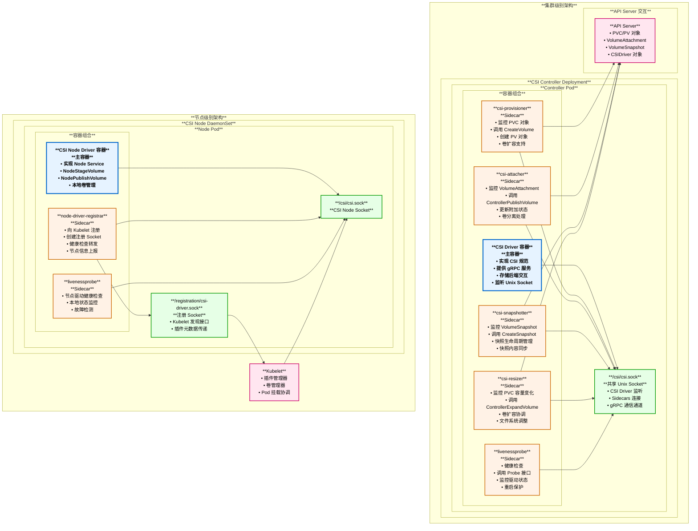

#### 1.2 容器间交互详解

```mermaid
sequenceDiagram
    participant APIServer as **API Server**
    participant Provisioner as **Provisioner Sidecar**
    participant Attacher as **Attacher Sidecar**
    participant Snapshotter as **Snapshotter Sidecar**
    participant Socket as **/csi/csi.sock**
    participant CSIDriver as **CSI Driver**
    participant StorageBackend as **存储后端**
    
    Note over APIServer,StorageBackend: **Controller Pod 内部交互流程**
    
        Note over APIServer,StorageBackend: **卷供应流程**
        
        APIServer->>Provisioner: **1. PVC 创建事件**
        Provisioner->>Socket: **2. 连接 Unix Socket**
        Socket->>CSIDriver: **3. CreateVolume() gRPC 调用**
        CSIDriver->>StorageBackend: **4. 创建存储卷**
        StorageBackend->>CSIDriver: **5. 返回卷句柄**
        CSIDriver->>Socket: **6. CreateVolumeResponse**
        Socket->>Provisioner: **7. 接收响应**
        Provisioner->>APIServer: **8. 创建 PV 对象**
    end
    
        Note over APIServer,StorageBackend: **卷附加流程**
        
        APIServer->>Attacher: **9. VolumeAttachment 创建**
        Attacher->>Socket: **10. 连接 Unix Socket**
        Socket->>CSIDriver: **11. ControllerPublishVolume()**
        CSIDriver->>StorageBackend: **12. 附加卷到节点**
        StorageBackend->>CSIDriver: **13. 返回发布上下文**
        CSIDriver->>Socket: **14. ControllerPublishVolumeResponse**
        Socket->>Attacher: **15. 接收响应**
        Attacher->>APIServer: **16. 更新 VA 状态**
    end
    
        Note over APIServer,StorageBackend: **快照创建流程**
        
        APIServer->>Snapshotter: **17. VolumeSnapshot 创建**
        Snapshotter->>Socket: **18. 连接 Unix Socket**
        Socket->>CSIDriver: **19. CreateSnapshot()**
        CSIDriver->>StorageBackend: **20. 创建存储快照**
        StorageBackend->>CSIDriver: **21. 返回快照句柄**
        CSIDriver->>Socket: **22. CreateSnapshotResponse**
        Socket->>Snapshotter: **23. 接收响应**
        Snapshotter->>APIServer: **24. 更新快照状态**
    end
    
    Note over APIServer,StorageBackend: **所有 Sidecar 通过共享 Socket 与驱动通信**
```

#### 1.3 Sidecar 容器配置示例

基于测试配置 `test/e2e/testing-manifests/storage-csi/hostpath/hostpath/csi-hostpath-plugin.yaml`：

```yaml
# CSI Controller Deployment 配置
apiVersion: apps/v1
kind: Deployment
metadata:
  name: csi-controller
spec:
  replicas: 1
  selector:
    matchLabels:
      app: csi-controller
  template:
    metadata:
      labels:
        app: csi-controller
    spec:
      serviceAccountName: csi-controller-sa
      containers:
      # **主容器：CSI Driver**
      - name: csi-driver
        image: registry.k8s.io/sig-storage/hostpathplugin:v1.11.0
        args:
        - "--endpoint=$(CSI_ENDPOINT)"
        - "--nodeid=$(KUBE_NODE_NAME)"
        - "--v=5"
        env:
        - name: CSI_ENDPOINT
          value: unix:///csi/csi.sock              # **CSI Socket 路径**
        - name: KUBE_NODE_NAME
          valueFrom:
            fieldRef:
              fieldPath: spec.nodeName
        volumeMounts:
        - name: socket-dir
          mountPath: /csi                          # **Socket 共享目录**
        
      # **Sidecar 1: csi-provisioner**
      - name: csi-provisioner
        image: registry.k8s.io/sig-storage/csi-provisioner:v3.4.0
        args:
        - "--csi-address=/csi/csi.sock"            # **连接到共享 Socket**
        - "--v=5"
        - "--feature-gates=Topology=true"
        - "--leader-election=true"                  # **高可用支持**
        volumeMounts:
        - name: socket-dir
          mountPath: /csi
        
      # **Sidecar 2: csi-attacher**
      - name: csi-attacher
        image: registry.k8s.io/sig-storage/csi-attacher:v4.0.0
        args:
        - "--csi-address=/csi/csi.sock"
        - "--v=5"
        - "--leader-election=true"
        volumeMounts:
        - name: socket-dir
          mountPath: /csi
        
      # **Sidecar 3: csi-snapshotter**
      - name: csi-snapshotter
        image: registry.k8s.io/sig-storage/csi-snapshotter:v6.1.0
        args:
        - "--csi-address=/csi/csi.sock"
        - "--v=5"
        - "--leader-election=true"
        volumeMounts:
        - name: socket-dir
          mountPath: /csi
        
      # **Sidecar 4: csi-resizer**
      - name: csi-resizer
        image: registry.k8s.io/sig-storage/csi-resizer:v1.6.0
        args:
        - "--csi-address=/csi/csi.sock"
        - "--v=5"
        - "--leader-election=true"
        volumeMounts:
        - name: socket-dir
          mountPath: /csi
        
      # **Sidecar 5: livenessprobe**
      - name: livenessprobe
        image: registry.k8s.io/sig-storage/livenessprobe:v2.7.0
        args:
        - "--csi-address=/csi/csi.sock"
        - "--health-port=9898"                     # **健康检查端点**
        volumeMounts:
        - name: socket-dir
          mountPath: /csi
        
      volumes:
      - name: socket-dir
        emptyDir: {}                                # **临时目录作为 Socket 共享空间**
```

#### 1.4 Sidecar 职责划分表

| Sidecar 组件 | 部署位置 | 监控对象 | 调用的 CSI 接口 | 主要职责 | 是否需要高可用 |
|-------------|---------|---------|---------------|---------|--------------|
| **csi-provisioner** | Controller | PVC | CreateVolume<br/>DeleteVolume<br/>ControllerExpandVolume | 动态卷供应<br/>卷删除<br/>卷扩容 | ✓ (Leader Election) |
| **csi-attacher** | Controller | VolumeAttachment | ControllerPublishVolume<br/>ControllerUnpublishVolume | 卷附加<br/>卷分离<br/>状态同步 | ✓ (Leader Election) |
| **csi-snapshotter** | Controller | VolumeSnapshot<br/>VolumeSnapshotContent | CreateSnapshot<br/>DeleteSnapshot | 快照创建<br/>快照删除<br/>内容管理 | ✓ (Leader Election) |
| **csi-resizer** | Controller | PVC (容量变化) | ControllerExpandVolume<br/>NodeExpandVolume | 在线扩容<br/>文件系统调整 | ✓ (Leader Election) |
| **livenessprobe** | Controller/Node | CSI Driver | Probe | 健康检查<br/>驱动监控<br/>重启保护 | ✗ |
| **node-driver-registrar** | Node | 本地驱动 | GetPluginInfo<br/>NodeGetInfo | 驱动注册<br/>Kubelet 集成<br/>节点信息上报 | ✗ (每节点一个) |

#### 1.5 Sidecar 模式的核心优势

1. **职责分离**：
   - CSI Driver 专注于存储逻辑
   - Sidecars 处理 Kubernetes 集成

2. **独立演进**：
   - Sidecar 可独立升级
   - 不影响驱动核心逻辑

3. **标准化接口**：
   - 所有驱动使用相同的 Sidecars
   - 降低开发和维护成本

4. **高可用支持**：
   - Leader Election 机制
   - 避免多副本冲突

5. **灵活组合**：
   - 按需选择 Sidecar 组件
   - 支持不同存储能力

## CSI 接口调用时序图详解

### 2. CSI 驱动注册流程深度解读

#### 1.1 Node Driver Registrar 组件详解

**Node Driver Registrar** 是 Kubernetes CSI 生态中的关键组件，作为 sidecar 容器与每个 CSI Node 驱动一起部署。

基于源码 `pkg/kubelet/pluginmanager/` 和 `pkg/volume/csi/csi_plugin.go`：

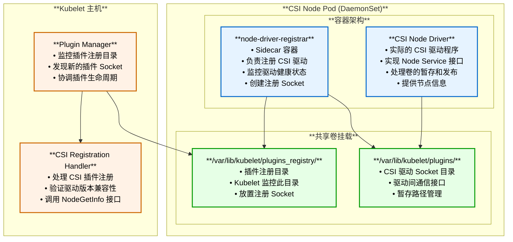

**Node Driver Registrar 的核心作用**：

1. **Socket 管理**：创建和管理插件注册 Socket
2. **驱动发现**：让 Kubelet 发现新的 CSI 驱动
3. **生命周期管理**：处理驱动的注册、健康检查和注销
4. **版本协商**：确保驱动与 Kubelet 的兼容性

#### 1.2 NodeGetInfo 接口深度解析

基于源码 `pkg/volume/csi/csi_client.go` 和测试实现：

```go
// NodeGetInfo 接口实现
func (c *csiDriverClient) NodeGetInfo(ctx context.Context) (
    nodeID string,                      // **节点唯一标识符**
    maxVolumePerNode int64,            // **节点最大卷数限制**
    accessibleTopology map[string]string, // **节点拓扑信息**
    err error) {
    
    nodeClient, closer, err := c.nodeV1ClientCreator(c.addr, c.metricsManager)
    if err != nil {
        return "", 0, nil, err
    }
    defer closer.Close()

    // 调用 CSI 驱动的 NodeGetInfo gRPC 方法
    res, err := nodeClient.NodeGetInfo(ctx, &csipbv1.NodeGetInfoRequest{})
    if err != nil {
        return "", 0, nil, err
    }

    // 解析拓扑信息
    topology := res.GetAccessibleTopology()
    if topology != nil {
        accessibleTopology = topology.Segments  // **拓扑段映射**
    }
    
    return res.GetNodeId(), res.GetMaxVolumesPerNode(), accessibleTopology, nil
}
```

**节点信息获取机制详解**：

##### A. 节点 ID 获取

不同存储类型的节点 ID 获取示例：

```go
// AWS EBS CSI 驱动示例
func (d *nodeService) NodeGetInfo(ctx context.Context, req *csi.NodeGetInfoRequest) (*csi.NodeGetInfoResponse, error) {
    // 从 AWS Instance Metadata 获取实例 ID
    instanceID, err := d.metadata.GetInstanceID()
    if err != nil {
        return nil, status.Errorf(codes.Internal, "Failed to get instance ID: %v", err)
    }
    
    return &csi.NodeGetInfoResponse{
        NodeId: instanceID,  // **AWS 实例 ID 作为节点 ID**
    }, nil
}

// Google Cloud PD CSI 驱动示例
func (ns *nodeServer) NodeGetInfo(ctx context.Context, req *csi.NodeGetInfoRequest) (*csi.NodeGetInfoResponse, error) {
    // 从 GCE Metadata 获取实例名称和区域
    instanceName, err := ns.metadataService.GetInstanceName()
    zone, err := ns.metadataService.GetZone()
    
    return &csi.NodeGetInfoResponse{
        NodeId: fmt.Sprintf("projects/%s/zones/%s/instances/%s", 
            ns.project, zone, instanceName),  // **GCE 完整实例路径**
    }, nil
}

// 本地存储 CSI 驱动示例
func (ns *nodeServer) NodeGetInfo(ctx context.Context, req *csi.NodeGetInfoRequest) (*csi.NodeGetInfoResponse, error) {
    // 使用 Kubernetes 节点名称
    hostname, err := os.Hostname()
    if err != nil {
        return nil, status.Errorf(codes.Internal, "Failed to get hostname: %v", err)
    }
    
    return &csi.NodeGetInfoResponse{
        NodeId: hostname,  // **主机名作为节点 ID**
    }, nil
}
```

##### B. 拓扑信息获取

基于测试代码的拓扑信息示例：

```go
// 基于 test/e2e/storage/drivers/csi-test/mock/service/node.go
func (s *service) NodeGetInfo(ctx context.Context, req *csi.NodeGetInfoRequest) (*csi.NodeGetInfoResponse, error) {
    response := &csi.NodeGetInfoResponse{
        NodeId: s.nodeID,
    }
    
    // 设置卷数量限制
    if s.config.AttachLimit > 0 {
        response.MaxVolumesPerNode = s.config.AttachLimit  // **来自驱动配置**
    }
    
    // 设置拓扑信息
    if s.config.EnableTopology {
        response.AccessibleTopology = &csi.Topology{
            Segments: map[string]string{
                // **常见拓扑键值对**
                "topology.kubernetes.io/zone":   "zone-1",           // 可用区
                "topology.kubernetes.io/region": "us-west-2",        // 地域
                "node.kubernetes.io/instance-type": "m5.large",      // 实例类型  
                "topology.csi.example.com/rack": "rack-3",          // 自定义拓扑
            },
        }
    }
    
    return response, nil
}
```

**拓扑信息的实际用途**：

1. **卷调度约束**：确保卷与使用它的 Pod 在同一拓扑域
2. **性能优化**：优先选择网络距离最近的存储
3. **容灾规划**：实现跨可用区的高可用部署
4. **成本优化**：避免跨区域的数据传输费用

#### 1.3 Unix Socket 注册机制深度解析

基于 `pkg/kubelet/pluginmanager/pluginwatcher/` 源码：

```go
// 插件发现机制
type PluginWatcher struct {
    path         string           // **监控的插件目录路径**
    fsWatcher    fsnotify.Watcher // **文件系统事件监控器**  
    desiredStateOfWorldPopulator DesiredStateOfWorldPopulator
}

func (w *PluginWatcher) Start() error {
    // 监控插件注册目录: /var/lib/kubelet/plugins_registry/
    err := w.fsWatcher.Add(w.path)
    if err != nil {
        return fmt.Errorf("failed to watch %s, err: %v", w.path, err)
    }

    go func() {
        for {
            select {
            case event := <-w.fsWatcher.Events:
                if event.Op&fsnotify.Create == fsnotify.Create {
                    // **发现新的插件 Socket 文件**
                    err := w.handleCreateEvent(event)
                    if err != nil {
                        klog.ErrorS(err, "Error handling create event", "event", event)
                    }
                } else if event.Op&fsnotify.Remove == fsnotify.Remove {
                    // **插件 Socket 文件被删除**  
                    w.handleDeleteEvent(event)
                }
            }
        }
    }()
    
    return nil
}
```

**Unix Socket 的来源和管理**：

```yaml
# CSI Node DaemonSet 配置示例
apiVersion: apps/v1
kind: DaemonSet
metadata:
  name: csi-node
spec:
  template:
    spec:
      containers:
      - name: node-driver-registrar
        image: registry.k8s.io/sig-storage/node-driver-registrar:v2.6.2
        args:
        - "--csi-address=/csi/csi.sock"                    # **CSI 驱动 Socket 路径**
        - "--kubelet-registration-path=/var/lib/kubelet/plugins/csi-driver/csi.sock"
        volumeMounts:
        - name: plugin-dir
          mountPath: /var/lib/kubelet/plugins/csi-driver   # **插件目录挂载**
        - name: registration-dir  
          mountPath: /registration                          # **注册目录挂载**
        
      - name: csi-driver
        image: example/csi-driver:latest
        args:
        - "--endpoint=unix:///csi/csi.sock"               # **创建 CSI Socket**
        - "--node-id=$(KUBE_NODE_NAME)"
        volumeMounts:
        - name: plugin-dir
          mountPath: /csi                                  # **共享 Socket 目录**
          
      volumes:
      - name: plugin-dir
        hostPath:
          path: /var/lib/kubelet/plugins/csi-driver       # **主机插件目录**
          type: DirectoryOrCreate
      - name: registration-dir
        hostPath:
          path: /var/lib/kubelet/plugins_registry          # **主机注册目录**  
          type: Directory
```

**Socket 创建和注册流程**：

1. **CSI 驱动启动**：创建 gRPC 服务并监听 Unix Socket
2. **Node Driver Registrar 启动**：连接到 CSI 驱动 Socket
3. **创建注册 Socket**：在 `/var/lib/kubelet/plugins_registry/` 下创建注册 Socket
4. **Kubelet 发现**：Plugin Manager 通过 inotify 发现新 Socket
5. **注册握手**：Kubelet 与 Registrar 进行注册协议握手

#### 1.4 Probe 接口健康检查机制

基于 CSI 规范和实际实现：

```go
// Probe 接口实现示例
func (s *identityServer) Probe(ctx context.Context, req *csi.ProbeRequest) (*csi.ProbeResponse, error) {
    // **健康检查逻辑**
    
    // 1. 检查驱动基本状态
    if !s.driver.IsReady() {
        return nil, status.Error(codes.Unavailable, "driver not ready")
    }
    
    // 2. 检查存储后端连接
    if err := s.checkBackendConnectivity(); err != nil {
        return nil, status.Errorf(codes.Unavailable, "backend connectivity failed: %v", err)
    }
    
    // 3. 检查必要资源（如临时目录）
    if err := s.checkRequiredResources(); err != nil {
        return nil, status.Errorf(codes.Internal, "resource check failed: %v", err)
    }
    
    // 4. 执行自定义健康检查
    if err := s.customHealthCheck(); err != nil {
        return nil, status.Errorf(codes.Internal, "custom health check failed: %v", err)
    }
    
    return &csi.ProbeResponse{
        Ready: &wrappers.BoolValue{Value: true},  // **可选的就绪状态**
    }, nil
}

// 具体健康检查实现示例
func (s *identityServer) checkBackendConnectivity() error {
    // AWS EBS 驱动示例
    if s.driverType == "ebs" {
        _, err := s.ec2Client.DescribeInstances(&ec2.DescribeInstancesInput{
            InstanceIds: []*string{aws.String(s.nodeID)},
        })
        return err
    }
    
    // 本地存储驱动示例
    if s.driverType == "local" {
        _, err := os.Stat(s.config.StorageRoot)
        return err
    }
    
    return nil
}

func (s *identityServer) checkRequiredResources() error {
    // 检查临时目录
    if err := os.MkdirAll(s.config.TempDir, 0755); err != nil {
        return fmt.Errorf("failed to create temp dir: %v", err)
    }
    
    // 检查磁盘空间
    if available, err := s.getAvailableSpace(s.config.TempDir); err != nil {
        return err
    } else if available < s.config.MinRequiredSpace {
        return fmt.Errorf("insufficient disk space: %d < %d", available, s.config.MinRequiredSpace)
    }
    
    return nil
}
```

**Probe 接口的调用时机**：

1. **驱动注册时**：Kubelet 验证驱动是否正常工作
2. **定期健康检查**：周期性验证驱动状态
3. **操作前验证**：执行卷操作前确认驱动可用
4. **故障恢复**：驱动重启后的状态确认

#### 1.5 卷数量限制机制详解

**卷数量限制的来源**：

基于源码和配置分析，卷数量限制来自以下几个层面：

##### A. CSI 驱动层面限制

```go
// 驱动配置的卷数量限制
type DriverConfig struct {
    MaxVolumesPerNode int64 `json:"maxVolumesPerNode"`
}

func (ns *nodeServer) NodeGetInfo(ctx context.Context, req *csi.NodeGetInfoRequest) (*csi.NodeGetInfoResponse, error) {
    return &csi.NodeGetInfoResponse{
        NodeId: ns.nodeID,
        // **驱动主动声明的限制**
        MaxVolumesPerNode: ns.config.MaxVolumesPerNode,  // 例如：AWS EBS 默认 39 个
    }, nil
}
```

##### B. 云平台实例类型限制

```go
// AWS EBS 实例类型卷限制映射
var InstanceTypeVolumeLimit = map[string]int64{
    "t2.micro":   1,    // **实例类型决定卷数量**
    "t2.small":   1,
    "m5.large":   10,
    "m5.xlarge":  15,
    "c5.4xlarge": 25,
    // ... 更多实例类型
}

func (d *driver) getMaxVolumesPerNode(instanceType string) int64 {
    if limit, exists := InstanceTypeVolumeLimit[instanceType]; exists {
        return limit
    }
    return DefaultMaxVolumesPerNode  // **默认限制**
}
```

##### C. Kubelet 层面限制整合

基于 `pkg/volume/csi/nodeinfomanager/nodeinfomanager.go`：

```go
// NodeInfoManager 管理节点的 CSI 驱动信息
func (nim *nodeInfoManager) InstallCSIDriver(driverName string, driverNodeID string, maxVolumeLimit int64, topology map[string]string) error {
    if maxVolumeLimit <= 0 {
        // **使用默认限制或不限制**
        maxVolumeLimit = DefaultMaxAttachedVolumes
    }
    
    // 更新 CSINode 对象
    csiNode := &storagev1.CSINode{
        ObjectMeta: metav1.ObjectMeta{Name: nim.nodeName},
        Spec: storagev1.CSINodeSpec{
            Drivers: []storagev1.CSINodeDriver{{
                Name:         driverName,
                NodeID:       driverNodeID,
                TopologyKeys: getTopologyKeys(topology),
                Allocatable: &storagev1.VolumeNodeResources{
                    Count: pointer.Int32Ptr(int32(maxVolumeLimit)),  // **最终限制**
                },
            }},
        },
    }
    
    return nim.updateCSINode(csiNode)
}
```

**限制的必要性原因**：

1. **物理限制**：
   - 云实例的网络带宽和 I/O 能力
   - 单个实例可附加的块设备数量上限
   - 存储控制器的处理能力

2. **性能考虑**：
   - 避免单节点卷数过多导致性能下降
   - 确保每个卷都能获得足够的 IOPS 和带宽
   - 减少卷管理的复杂度

3. **稳定性保证**：
   - 防止资源耗尽导致的系统不稳定
   - 避免过多的并发卷操作
   - 简化故障排查和恢复

4. **成本控制**：
   - 限制过度的资源消耗
   - 避免意外的高额存储费用

### 2. 动态卷供应流程时序图

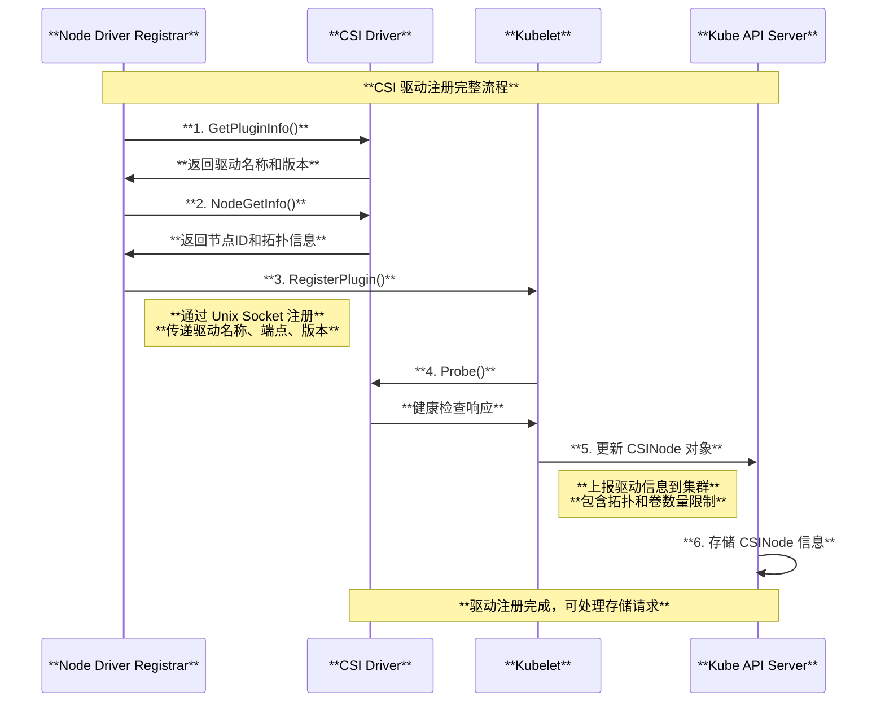

### 2. 卷附加与挂载流程深度解读

#### 2.1 External Attacher 组件详解

**External Attacher** 是 Kubernetes CSI 生态中的关键控制器组件，负责监控 `VolumeAttachment` 对象并调用 CSI 的 `ControllerPublishVolume` 接口。

基于源码 `pkg/controller/volume/attachdetach/attach_detach_controller.go`：

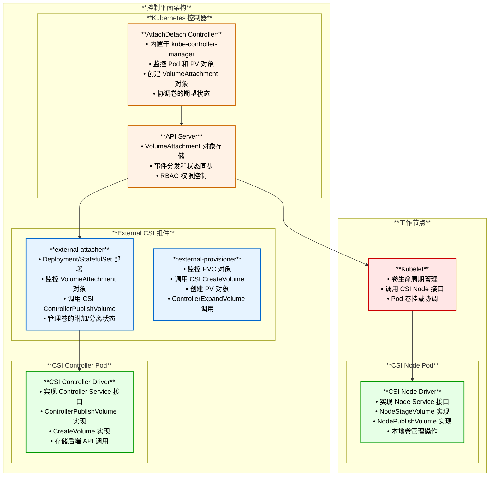

**External Attacher 的核心作用**：

1. **VolumeAttachment 监控**：监听 VolumeAttachment 对象的创建、更新、删除事件
2. **CSI 接口调用**：将 Kubernetes 的附加请求转换为 CSI ControllerPublishVolume 调用
3. **状态同步**：更新 VolumeAttachment 对象的状态信息
4. **错误处理**：处理附加失败和重试逻辑

### 3. 动态卷供应流程时序图

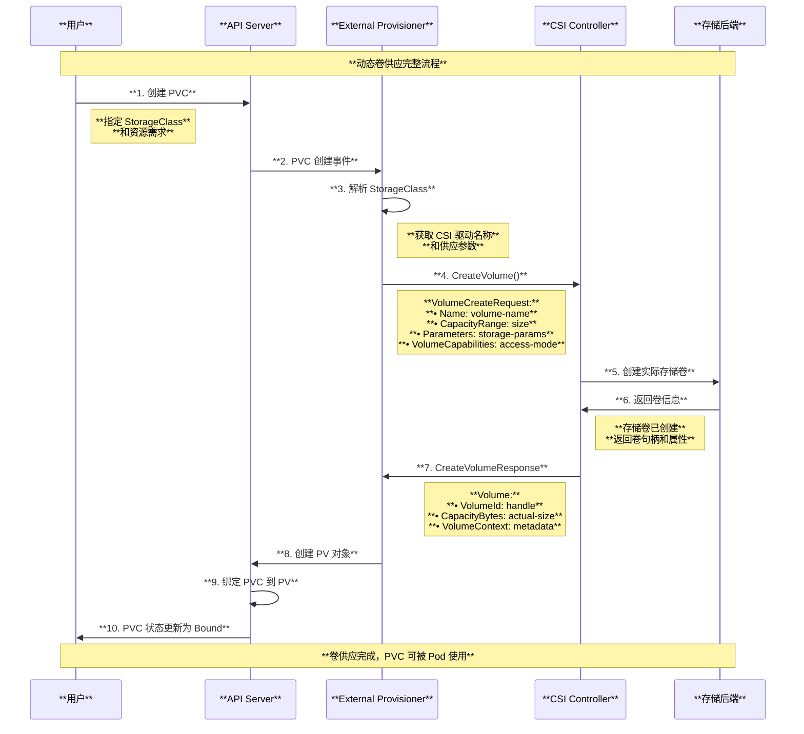

### 3. 卷附加与挂载流程

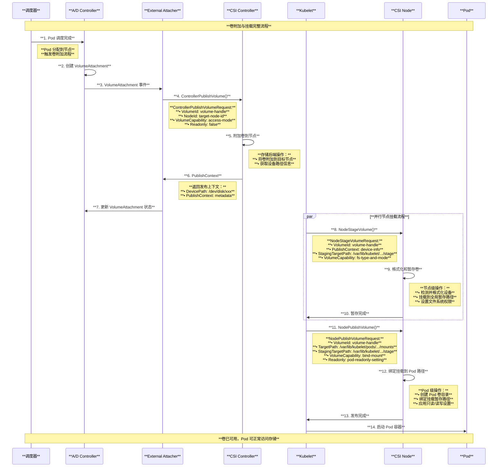

### 4. ControllerPublishVolume 参数深度解析

#### 4.1 附加操作的本质

ControllerPublishVolume 的**附加操作实际上就是发布卷需求**，具体含义：

1. **资源预留**：在存储后端为特定节点预留卷资源
2. **网络配置**：建立存储后端到节点的网络连接
3. **设备映射**：在目标节点上创建块设备映射
4. **权限设置**：配置节点对卷的访问权限
5. **元数据记录**：记录附加状态和设备信息

#### 4.2 暂存操作深度解析

**暂存（Staging）** 是 CSI 卷生命周期中的关键步骤，位于控制器附加和 Pod 发布之间。

**为什么需要先暂存？**

1. **设备与文件系统管理**：
   - 将原始块设备格式化为指定文件系统
   - 处理设备发现和设备路径解析
   - 执行一次性的文件系统检查和修复

2. **多 Pod 共享优化**：
   - 多个 Pod 可以共享同一个已暂存的卷
   - 避免重复的格式化和文件系统操作
   - 减少挂载时间和资源消耗

3. **原子性操作**：
   - 将复杂的设备操作与简单的绑定挂载分离
   - 暂存失败不会影响其他 Pod 的卷挂载
   - 便于错误诊断和恢复

#### 4.3 节点级操作 vs Pod 级操作区别

| 操作类型 | 执行频率 | 作用域 | 主要职责 | 失败影响 |
|----------|----------|--------|----------|----------|
| **ControllerPublishVolume** | 每卷每节点一次 | 集群级 | 存储后端附加，设备映射 | 影响该节点上所有使用此卷的 Pod |
| **NodeStageVolume** | 每卷每节点一次 | 节点级 | 设备格式化，全局挂载 | 影响该节点上所有使用此卷的 Pod |
| **NodePublishVolume** | 每卷每Pod一次 | Pod级 | 绑定挂载，权限设置 | 仅影响特定 Pod |

### 5. 附加、暂存、挂载与 PVC 创建完整时序图

```mermaid
sequenceDiagram
    participant User as **用户**
    participant APIServer as **API Server**
    participant Scheduler as **调度器**
    participant ExternalProvisioner as **External Provisioner**
    participant AttachDetachController as **A/D Controller**
    participant ExternalAttacher as **External Attacher**
    participant CSIController as **CSI Controller**
    participant Kubelet as **Kubelet**
    participant CSINode as **CSI Node**
    participant StorageBackend as **存储后端**
    
    Note over User,StorageBackend: **完整的 PVC 创建到 Pod 使用流程**
    
        Note over User,StorageBackend: **阶段1: PVC 创建与卷供应**
        
        User->>APIServer: **1. 创建 PVC**
        APIServer->>ExternalProvisioner: **2. PVC 创建事件**
        ExternalProvisioner->>CSIController: **3. CreateVolume()**
        CSIController->>StorageBackend: **4. 创建存储卷**
        StorageBackend->>CSIController: **5. 返回卷句柄**
        CSIController->>ExternalProvisioner: **6. CreateVolumeResponse**
        ExternalProvisioner->>APIServer: **7. 创建 PV 对象**
        APIServer->>APIServer: **8. 绑定 PVC 到 PV**
    end
    
        Note over User,StorageBackend: **阶段2: Pod 调度与卷附加**
        
        User->>APIServer: **9. 创建使用 PVC 的 Pod**
        APIServer->>Scheduler: **10. Pod 调度请求**
        Scheduler->>APIServer: **11. 分配节点**
        
        APIServer->>AttachDetachController: **12. Pod 调度完成事件**
        AttachDetachController->>APIServer: **13. 创建 VolumeAttachment**
        APIServer->>ExternalAttacher: **14. VolumeAttachment 事件**
        
        ExternalAttacher->>CSIController: **15. ControllerPublishVolume()**
        Note right of ExternalAttacher: **附加参数：**<br/>**• VolumeId: volume-handle**<br/>**• NodeId: target-node-id**<br/>**• VolumeCapability: RWO**
        
        CSIController->>StorageBackend: **16. 存储后端附加操作**
        Note right of CSIController: **存储操作：**<br/>**• 将卷附加到节点**<br/>**• 创建设备映射**<br/>**• 配置网络连接**
        
        StorageBackend->>CSIController: **17. 附加完成**
        CSIController->>ExternalAttacher: **18. PublishContext**
        Note left of CSIController: **返回上下文：**<br/>**• device: /dev/xvdf**<br/>**• attachment-id: vol-attach-xxx**
        
        ExternalAttacher->>APIServer: **19. 更新 VolumeAttachment 状态**
    end
    
        Note over User,StorageBackend: **阶段3: 节点级暂存操作**
        
        APIServer->>Kubelet: **20. Pod 创建通知**
        Kubelet->>CSINode: **21. NodeStageVolume()**
        Note right of Kubelet: **暂存参数：**<br/>**• VolumeId: volume-handle**<br/>**• PublishContext: 设备信息**<br/>**• StagingTargetPath: 全局路径**
        
        CSINode->>CSINode: **22. 设备发现**
        Note right of CSINode: **设备操作：**<br/>**• 发现块设备**<br/>**• 检查文件系统**<br/>**• 格式化（如需要）**
        
        CSINode->>CSINode: **23. 挂载到全局路径**
        Note right of CSINode: **挂载操作：**<br/>**• 创建暂存目录**<br/>**• mount 到全局路径**<br/>**• 设置权限**
        
        CSINode->>Kubelet: **24. 暂存完成**
    end
    
        Note over User,StorageBackend: **阶段4: Pod 级发布操作**
        
        Kubelet->>CSINode: **25. NodePublishVolume()**
        Note right of Kubelet: **发布参数：**<br/>**• VolumeId: volume-handle**<br/>**• StagingTargetPath: 全局路径**<br/>**• TargetPath: Pod 特定路径**
        
        CSINode->>CSINode: **26. 绑定挂载**
        Note right of CSINode: **Pod 级操作：**<br/>**• 绑定挂载到 Pod 路径**<br/>**• 应用 fsGroup**<br/>**• 设置 SELinux 标签**
        
        CSINode->>Kubelet: **27. 发布完成**
        Kubelet->>APIServer: **28. 更新 Pod 状态**
        APIServer->>User: **29. Pod 就绪，卷可用**
    end
    
    Note over User,StorageBackend: **完整流程完成：PVC → 卷供应 → 附加 → 暂存 → 发布**
```

### 6. 快照管理流程深度解读

#### 6.1 快照生命周期管理架构

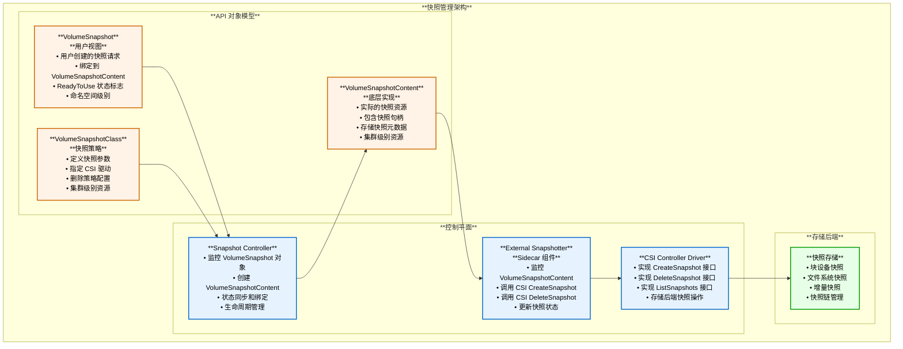

#### 6.2 快照完整生命周期流程

```mermaid
sequenceDiagram
    participant User as **用户**
    participant APIServer as **API Server**
    participant SnapshotController as **Snapshot Controller**
    participant ExternalSnapshotter as **External Snapshotter**
    participant CSIDriver as **CSI Driver**
    participant StorageBackend as **存储后端**
    
    Note over User,StorageBackend: **快照完整生命周期管理**
    
        Note over User,StorageBackend: **阶段1: 快照创建**
        
        User->>APIServer: **1. 创建 VolumeSnapshot**
        Note right of User: **指定源 PVC 和快照类**
        
        APIServer->>SnapshotController: **2. VolumeSnapshot 创建事件**
        SnapshotController->>SnapshotController: **3. 验证源 PVC 存在**
        SnapshotController->>SnapshotController: **4. 验证 VolumeSnapshotClass**
        
        SnapshotController->>APIServer: **5. 创建 VolumeSnapshotContent**
        Note right of SnapshotController: **自动生成 Content 对象**<br/>**设置 OwnerReference**
        
        APIServer->>ExternalSnapshotter: **6. VolumeSnapshotContent 事件**
        ExternalSnapshotter->>ExternalSnapshotter: **7. 验证快照支持**
        
        ExternalSnapshotter->>CSIDriver: **8. CreateSnapshot()**
        Note right of ExternalSnapshotter: **CreateSnapshotRequest:**<br/>**• SourceVolumeId: PV 卷句柄**<br/>**• Name: 快照名称**<br/>**• Parameters: 快照类参数**
        
        CSIDriver->>StorageBackend: **9. 创建存储层快照**
        Note right of CSIDriver: **存储操作：**<br/>**• 拍摄一致性快照**<br/>**• 生成快照句柄**<br/>**• 记录快照元数据**
        
        StorageBackend->>CSIDriver: **10. 返回快照信息**
        Note left of StorageBackend: **快照信息：**<br/>**• SnapshotId**<br/>**• CreationTime**<br/>**• SizeBytes**<br/>**• ReadyToUse: true**
        
        CSIDriver->>ExternalSnapshotter: **11. CreateSnapshotResponse**
        ExternalSnapshotter->>APIServer: **12. 更新 VolumeSnapshotContent**
        Note right of ExternalSnapshotter: **更新状态：**<br/>**• SnapshotHandle**<br/>**• CreationTime**<br/>**• RestoreSize**<br/>**• ReadyToUse: true**
        
        APIServer->>SnapshotController: **13. Content 更新事件**
        SnapshotController->>APIServer: **14. 更新 VolumeSnapshot 状态**
        Note right of SnapshotController: **绑定状态：**<br/>**• BoundVolumeSnapshotContentName**<br/>**• ReadyToUse: true**
        
        APIServer->>User: **15. 快照创建完成**
    end
    
        Note over User,StorageBackend: **阶段2: 快照使用**
        
        User->>APIServer: **16. 创建 PVC 使用快照**
        Note right of User: **PVC DataSource:**<br/>**• kind: VolumeSnapshot**<br/>**• name: snapshot-name**
        
        APIServer->>ExternalSnapshotter: **17. 验证快照 ReadyToUse**
        ExternalSnapshotter->>User: **18. 快照可用确认**
    end
    
        Note over User,StorageBackend: **阶段3: 快照删除**
        
        User->>APIServer: **19. 删除 VolumeSnapshot**
        APIServer->>SnapshotController: **20. VolumeSnapshot 删除事件**
        
        SnapshotController->>SnapshotController: **21. 检查删除策略**
        Note right of SnapshotController: **DeletionPolicy:**<br/>**• Delete: 删除快照内容**<br/>**• Retain: 保留快照内容**
        
        alt 删除策略为 Delete
            SnapshotController->>APIServer: **22a. 删除 VolumeSnapshotContent**
            APIServer->>ExternalSnapshotter: **23a. Content 删除事件**
            ExternalSnapshotter->>CSIDriver: **24a. DeleteSnapshot()**
            Note right of ExternalSnapshotter: **DeleteSnapshotRequest:**<br/>**• SnapshotId: 快照句柄**
            
            CSIDriver->>StorageBackend: **25a. 删除存储层快照**
            StorageBackend->>CSIDriver: **26a. 删除确认**
            CSIDriver->>ExternalSnapshotter: **27a. DeleteSnapshotResponse**
            ExternalSnapshotter->>APIServer: **28a. 确认 Content 可删除**
        else 删除策略为 Retain
            SnapshotController->>SnapshotController: **22b. 解除绑定**
            Note right of SnapshotController: **保留 VolumeSnapshotContent**<br/>**移除 OwnerReference**<br/>**快照内容继续存在**
        end
        
        APIServer->>User: **29. 快照删除完成**
    end
    
    Note over User,StorageBackend: **快照生命周期管理完成**
```

#### 6.3 快照一致性保证机制

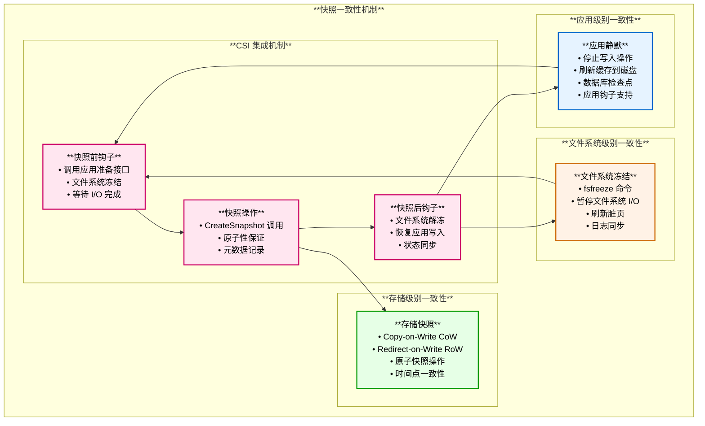

##### 6.3.1 快照一致性保证完整时序图

基于 CSI 规范和实际实现，快照一致性保证的完整流程：

```mermaid
sequenceDiagram
    participant User as **用户**
    participant SnapshotController as **Snapshot Controller**
    participant ExternalSnapshotter as **External Snapshotter**
    participant CSIDriver as **CSI Driver**
    participant App as **应用程序**
    participant Kubelet as **Kubelet**
    participant Filesystem as **文件系统**
    participant StorageBackend as **存储后端**
    
    Note over User,StorageBackend: **快照一致性保证完整流程**
    
        Note over User,StorageBackend: **阶段1: 快照请求与准备**
        
        User->>SnapshotController: **1. 创建 VolumeSnapshot**
        Note right of User: **指定源 PVC 和快照类**
        
        SnapshotController->>SnapshotController: **2. 验证源 PVC 状态**
        Note right of SnapshotController: **检查：**<br/>**• PVC 是否已绑定**<br/>**• StorageClass 是否支持快照**<br/>**• CSI Driver 快照能力**
        
        SnapshotController->>ExternalSnapshotter: **3. 创建 VolumeSnapshotContent**
        ExternalSnapshotter->>CSIDriver: **4. 查询 Driver 能力**
        Note right of ExternalSnapshotter: **GetPluginCapabilities()**<br/>**验证 CREATE_DELETE_SNAPSHOT**
        
        CSIDriver->>ExternalSnapshotter: **5. 返回支持快照**
    end
    
        Note over User,StorageBackend: **阶段2: 应用级一致性准备**
        
        alt 应用支持钩子
            CSIDriver->>App: **6a. Pre-Snapshot Hook**
            Note right of CSIDriver: **通知应用准备快照**
            
            App->>App: **7a. 应用静默操作**
            Note right of App: **数据库操作：**<br/>**• FLUSH TABLES WITH READ LOCK**<br/>**• 停止写事务**<br/>**• 刷新脏页到磁盘**<br/>**• 创建一致性检查点**
            
            App->>CSIDriver: **8a. 应用准备完成**
            Note left of App: **应用进入静默状态**<br/>**保证数据一致性**
        else 无应用钩子
            Note over CSIDriver,App: **9b. 跳过应用级准备**<br/>**依赖文件系统和存储层一致性**
        end
    end
    
        Note over User,StorageBackend: **阶段3: 文件系统级一致性**
        
        CSIDriver->>Kubelet: **10. 请求文件系统冻结**
        Note right of CSIDriver: **通过 CSI NodeService**<br/>**或直接系统调用**
        
        Kubelet->>Filesystem: **11. fsfreeze -f [mount-point]**
        Note right of Kubelet: **文件系统冻结：**<br/>**• 暂停所有写操作**<br/>**• 刷新缓冲区到磁盘**<br/>**• 刷新日志（journal）**<br/>**• 同步元数据**
        
        Filesystem->>Filesystem: **12. 执行冻结操作**
        Note right of Filesystem: **内核操作：**<br/>**• super_operations->freeze_fs()**<br/>**• 阻塞新的写 I/O**<br/>**• 等待进行中的 I/O 完成**
        
        Filesystem->>Kubelet: **13. 冻结完成**
        Note left of Filesystem: **文件系统状态：**<br/>**• 所有数据已落盘**<br/>**• 元数据一致**<br/>**• I/O 队列为空**
        
        Kubelet->>CSIDriver: **14. 文件系统已冻结**
    end
    
        Note over User,StorageBackend: **阶段4: 存储级快照创建**
        
        CSIDriver->>StorageBackend: **15. CreateSnapshot(volume-id)**
        Note right of CSIDriver: **CSI RPC 调用：**<br/>**• source_volume_id**<br/>**• name: snap-xxx**<br/>**• secrets: auth-info**
        
        StorageBackend->>StorageBackend: **16. 原子快照操作**
        Note right of StorageBackend: **存储层操作：**<br/>**• Copy-on-Write 元数据**<br/>**• 冻结当前数据视图**<br/>**• 记录快照时间点**<br/>**• 生成快照句柄**
        
        alt 块设备快照（如 AWS EBS）
            StorageBackend->>StorageBackend: **17a. 创建 CoW 快照**
            Note right of StorageBackend: **CoW 机制：**<br/>**• 共享现有数据块**<br/>**• 写入时才复制**<br/>**• 瞬间完成**
        else 文件系统快照（如 ZFS）
            StorageBackend->>StorageBackend: **17b. 创建文件系统快照**
            Note right of StorageBackend: **ZFS snapshot：**<br/>**• 创建快照元数据**<br/>**• 引用现有数据块**<br/>**• 即时完成**
        else 完整拷贝快照
            StorageBackend->>StorageBackend: **17c. 开始异步拷贝**
            Note right of StorageBackend: **Full copy：**<br/>**• 后台数据复制**<br/>**• 快照立即可用**<br/>**• 逐步完整化**
        end
        
        StorageBackend->>CSIDriver: **18. 返回快照信息**
        Note left of StorageBackend: **CreateSnapshotResponse:**<br/>**• snapshot_id**<br/>**• source_volume_id**<br/>**• creation_time**<br/>**• size_bytes**<br/>**• ready_to_use: true**
    end
    
        Note over User,StorageBackend: **阶段5: 文件系统解冻**
        
        CSIDriver->>Kubelet: **19. 请求文件系统解冻**
        Kubelet->>Filesystem: **20. fsfreeze -u [mount-point]**
        Note right of Kubelet: **解冻操作：**<br/>**• 恢复写操作**<br/>**• 释放阻塞的 I/O**<br/>**• 恢复正常状态**
        
        Filesystem->>Filesystem: **21. 执行解冻**
        Note right of Filesystem: **内核操作：**<br/>**• super_operations->unfreeze_fs()**<br/>**• 唤醒阻塞的写进程**<br/>**• 恢复 I/O 调度**
        
        Filesystem->>Kubelet: **22. 解冻完成**
        Kubelet->>CSIDriver: **23. 文件系统已解冻**
    end
    
        Note over User,StorageBackend: **阶段6: 应用恢复**
        
        alt 应用支持钩子
            CSIDriver->>App: **24a. Post-Snapshot Hook**
            Note right of CSIDriver: **通知应用恢复**
            
            App->>App: **25a. 应用恢复操作**
            Note right of App: **数据库操作：**<br/>**• UNLOCK TABLES**<br/>**• 恢复写事务**<br/>**• 清理检查点**<br/>**• 恢复正常服务**
            
            App->>CSIDriver: **26a. 应用已恢复**
        else 无应用钩子
            Note over CSIDriver,App: **24b. 无需应用恢复**<br/>**自动恢复正常操作**
        end
    end
    
        Note over User,StorageBackend: **阶段7: 快照状态同步**
        
        CSIDriver->>ExternalSnapshotter: **27. CreateSnapshotResponse**
        ExternalSnapshotter->>SnapshotController: **28. 更新 VolumeSnapshotContent**
        Note right of ExternalSnapshotter: **更新字段：**<br/>**• snapshotHandle**<br/>**• creationTime**<br/>**• restoreSize**<br/>**• readyToUse: true**
        
        SnapshotController->>User: **29. 更新 VolumeSnapshot 状态**
        Note left of SnapshotController: **VolumeSnapshot Ready**<br/>**可用于克隆和恢复**
    end
    
    Note over User,StorageBackend: **快照创建完成，所有层级一致性均已保证**
```

##### 6.3.2 一致性级别对比

| 一致性级别 | 保证范围 | 实现机制 | 恢复时数据状态 | 适用场景 | 性能影响 |
|-----------|---------|---------|--------------|---------|---------|
| **崩溃一致性**<br/>Crash-Consistent | 存储层 | 仅存储快照，无冻结 | 类似系统崩溃重启后的状态 | 无状态应用、缓存 | 极低（毫秒级） |
| **文件系统一致性**<br/>Filesystem-Consistent | 存储层 + 文件系统 | 存储快照 + fsfreeze | 文件系统元数据完整，日志已同步 | 大多数应用、数据库 | 低（秒级） |
| **应用一致性**<br/>Application-Consistent | 全栈 | 存储快照 + fsfreeze + 应用钩子 | 应用事务完整，无数据损坏 | 数据库、关键业务 | 中（秒到分钟级） |

##### 6.3.3 关键源码实现

基于 Kubernetes 和 CSI 规范：

```go
// CSI Snapshot 一致性相关接口
// 来自 CSI spec

// CreateSnapshot RPC
message CreateSnapshotRequest {
  string source_volume_id = 1;    // 源卷 ID
  string name = 2;                // 快照名称
  
  // 快照参数（可包含一致性要求）
  map<string, string> parameters = 4;
  
  // 认证信息
  map<string, string> secrets = 5;
}

message CreateSnapshotResponse {
  Snapshot snapshot = 1;
}

message Snapshot {
  string snapshot_id = 1;         // 快照 ID
  string source_volume_id = 2;    // 源卷 ID
  
  google.protobuf.Timestamp creation_time = 3;  // 创建时间
  int64 size_bytes = 4;           // 快照大小
  bool ready_to_use = 5;          // 是否可用
}
```

**文件系统冻结实现**（Linux内核）：

```c
// Linux kernel fs/super.c
// 文件系统冻结的内核实现

int freeze_super(struct super_block *sb)
{
    int ret;
    
    // 1. 同步文件系统
    sync_filesystem(sb);
    
    // 2. 冻结文件系统
    ret = sb->s_op->freeze_fs(sb);
    if (ret) {
        return ret;
    }
    
    // 3. 标记为冻结状态
    sb->s_writers.frozen = SB_FREEZE_COMPLETE;
    
    return 0;
}

int thaw_super(struct super_block *sb)
{
    int ret;
    
    // 1. 解冻文件系统
    ret = sb->s_op->unfreeze_fs(sb);
    
    // 2. 恢复正常状态
    sb->s_writers.frozen = SB_UNFROZEN;
    
    // 3. 唤醒等待的写进程
    wake_up(&sb->s_writers.wait_unfrozen);
    
    return ret;
}
```

#### 6.4 快照能力支持分析

##### 6.4.1 块设备快照 vs 文件系统快照

**快照能力主要针对块设备存储系统，但也支持文件系统快照**，两者有不同的实现机制：

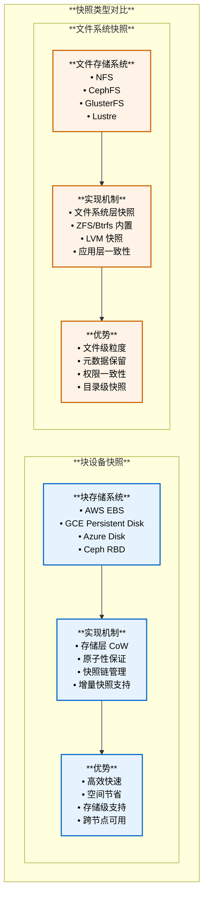

##### 6.4.2 不同存储类型的快照支持

| 存储类型 | 快照支持 | 实现层级 | 一致性保证 | 典型用途 | 性能影响 |
|---------|---------|---------|-----------|---------|---------|
| **AWS EBS** | ✓ 完整支持 | 块设备层 | 崩溃一致性 | 块存储快照 | 低（CoW） |
| **GCE PD** | ✓ 完整支持 | 块设备层 | 崩溃一致性 | 块存储快照 | 低（CoW） |
| **Azure Disk** | ✓ 完整支持 | 块设备层 | 崩溃一致性 | 块存储快照 | 低（快照服务） |
| **Ceph RBD** | ✓ 完整支持 | 块设备层 | 崩溃一致性 | 分布式块存储快照 | 低（CoW） |
| **iSCSI** | △ 部分支持 | 取决于后端 | 需手动保证 | SAN 存储快照 | 取决于后端 |
| **NFS** | △ 部分支持 | 文件系统层 | 应用一致性 | 共享文件系统快照 | 中（取决于实现） |
| **CephFS** | ✓ 完整支持 | 文件系统层 | 目录一致性 | 分布式文件系统快照 | 低（元数据操作） |
| **HostPath** | ✗ 不支持 | N/A | N/A | 测试环境 | N/A |

##### 6.4.3 文件系统快照实现机制

**是的，有文件系统的快照实现**，主要通过以下几种方式：

**方式1：文件系统内置快照（如 ZFS、Btrfs）**

```go
// CephFS CSI 驱动的快照实现示例
func (cs *ControllerServer) CreateSnapshot(ctx context.Context, req *csi.CreateSnapshotRequest) (*csi.CreateSnapshotResponse, error) {
    // 获取源卷信息
    volumeID := req.GetSourceVolumeId()
    
    // **文件系统层快照操作**
    // CephFS 使用 .snap 目录机制
    snapshotPath := fmt.Sprintf("%s/.snap/%s", volumePath, snapshotName)
    
    // 创建快照目录（CephFS 自动创建快照）
    err := os.Mkdir(snapshotPath, 0755)
    if err != nil {
        return nil, status.Errorf(codes.Internal, "Failed to create snapshot: %v", err)
    }
    
    // **快照元数据获取**
    snapshotInfo, err := cs.getSnapshotInfo(snapshotPath)
    
    return &csi.CreateSnapshotResponse{
        Snapshot: &csi.Snapshot{
            SnapshotId:     snapshotName,
            SourceVolumeId: volumeID,
            CreationTime:   timestamppb.Now(),
            ReadyToUse:     true,           // **文件系统快照立即可用**
            SizeBytes:      snapshotInfo.Size,
        },
    }, nil
}
```

**方式2：底层卷快照 + 文件系统挂载**

```yaml
# NFS 服务器使用 LVM 快照的示例
apiVersion: snapshot.storage.k8s.io/v1
kind: VolumeSnapshotClass
metadata:
  name: nfs-lvm-snapshot
driver: nfs.csi.k8s.io
deletionPolicy: Delete
parameters:
  # **底层使用 LVM 快照**
  snapshot-type: "lvm"
  # **LVM 卷组**
  volume-group: "nfs-vg"
  # **快照大小（CoW 空间）**
  snapshot-size: "10Gi"
```

**方式3：应用感知快照（数据库等）**

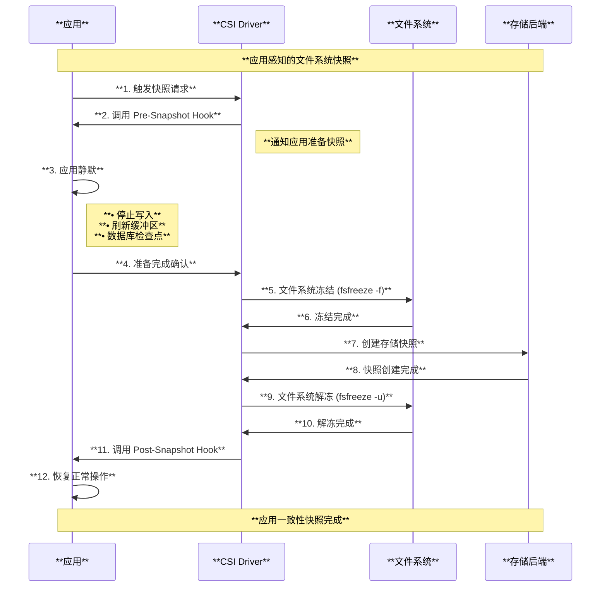

##### 6.4.4 快照适用场景总结

| 场景 | 推荐类型 | 原因 | 示例 |
|------|---------|------|------|
| **数据库备份** | 块设备快照 + 应用钩子 | 需要事务一致性 | MySQL、PostgreSQL |
| **虚拟机快照** | 块设备快照 | 包含完整系统状态 | VM 磁盘镜像 |
| **大文件共享** | 文件系统快照 | 保留权限和元数据 | NFS 共享目录 |
| **开发环境** | 任意类型 | 快速回滚和测试 | CI/CD 流水线 |
| **灾难恢复** | 块设备快照 | 跨区域复制 | 异地备份 |
| **合规审计** | 文件系统快照 | 保留文件级历史 | 日志归档 |

**结论**：
- **块设备快照**是 CSI 的主要应用场景，性能好、效率高
- **文件系统快照**也得到支持，但需要底层文件系统或存储系统的原生支持
- 两者可以结合使用，如块设备上的文件系统快照
- CSI 规范本身不区分类型，由驱动实现决定

### 7. 快照创建与恢复时序图

```mermaid
sequenceDiagram
    participant User as **用户**
    participant APIServer as **API Server**
    participant SnapshotController as **Snapshot Controller**
    participant ExternalSnapshotter as **External Snapshotter**
    participant CSIController as **CSI Controller**
    participant StorageBackend as **存储后端**
    
    Note over User,StorageBackend: **卷快照创建与恢复流程**
    
        Note over User,StorageBackend: **快照创建阶段**
        
        User->>APIServer: **1. 创建 VolumeSnapshot**
        Note right of User: **VolumeSnapshot:**<br/>**• source.pvcName: source-pvc**<br/>**• volumeSnapshotClassName: snap-class**
        
        APIServer->>SnapshotController: **2. VolumeSnapshot 事件**
        SnapshotController->>APIServer: **3. 创建 VolumeSnapshotContent**
        
        APIServer->>ExternalSnapshotter: **4. VolumeSnapshotContent 事件**
        ExternalSnapshotter->>CSIController: **5. CreateSnapshot()**
        Note right of ExternalSnapshotter: **CreateSnapshotRequest:**<br/>**• SourceVolumeId: pv-volume-handle**<br/>**• Name: snapshot-name**<br/>**• Parameters: snap-class-params**
        
        CSIController->>StorageBackend: **6. 创建存储快照**
        StorageBackend->>CSIController: **7. 返回快照信息**
        Note left of StorageBackend: **快照已创建**<br/>**返回快照句柄和属性**
        
        CSIController->>ExternalSnapshotter: **8. CreateSnapshotResponse**
        Note left of CSIController: **Snapshot:**<br/>**• SnapshotId: snapshot-handle**<br/>**• SourceVolumeId: source-handle**<br/>**• CreationTime: timestamp**<br/>**• ReadyToUse: true**
        
        ExternalSnapshotter->>APIServer: **9. 更新 VolumeSnapshotContent**
        APIServer->>User: **10. VolumeSnapshot 状态更新**
    end
    
        Note over User,StorageBackend: **从快照恢复阶段**
        
        User->>APIServer: **11. 创建 PVC with DataSource**
        Note right of User: **PVC DataSource:**<br/>**• kind: VolumeSnapshot**<br/>**• name: snapshot-name**<br/>**• apiGroup: snapshot.storage.k8s.io**
        
        APIServer->>ExternalProvisioner: **12. PVC 创建事件**
        ExternalProvisioner->>CSIController: **13. CreateVolume() with ContentSource**
        Note right of ExternalProvisioner: **CreateVolumeRequest:**<br/>**• VolumeContentSource:**<br/>**  • Snapshot.SnapshotId: snap-handle**<br/>**• CapacityRange: requested-size**
        
        CSIController->>StorageBackend: **14. 从快照创建卷**
        StorageBackend->>CSIController: **15. 返回新卷信息**
        Note left of StorageBackend: **从快照数据创建新卷**<br/>**数据已恢复到快照时间点**
        
        CSIController->>ExternalProvisioner: **16. CreateVolumeResponse**
        ExternalProvisioner->>APIServer: **17. 创建 PV 对象**
        APIServer->>User: **18. PVC 绑定完成**
    end
    
    Note over User,StorageBackend: **快照创建和恢复完成**
```

### 5. CSI 接口能力发现流程

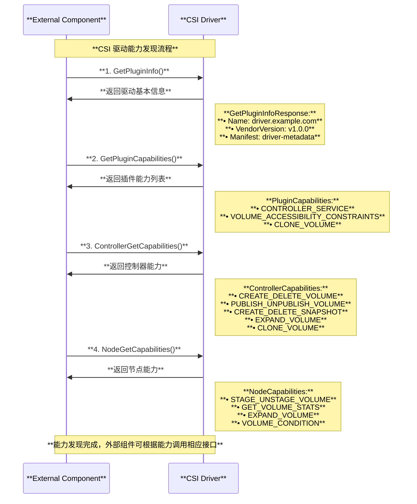

---

## CSI 存储卷生命周期管理

### 1. 卷附加阶段 (Volume Attachment)

基于源码 `pkg/controller/volume/attachdetach/util/util.go`：

```go
// CreateVolumeAttachment 创建卷附加对象
func CreateVolumeAttachment(
    volumeAttachment *storage.VolumeAttachment,
    kubeClient clientset.Interface) (*storage.VolumeAttachment, error) {
    
    tryNum := 0
    var lastErr error
    
    for tryNum < MaxRetryCount {
        tryNum++
        newVolumeAttachment, err := kubeClient.StorageV1().VolumeAttachments().Create(
            context.TODO(), volumeAttachment, metav1.CreateOptions{})
        if err == nil {
            return newVolumeAttachment, nil
        }
        
        if !apierrors.IsAlreadyExists(err) {
            lastErr = err
            continue
        }
        
        // 处理已存在的情况
        existingVolumeAttachment, err := kubeClient.StorageV1().VolumeAttachments().Get(
            context.TODO(), volumeAttachment.Name, metav1.GetOptions{})
        if err != nil {
            lastErr = err
            continue
        }
        
        return existingVolumeAttachment, nil
    }
    
    return nil, lastErr
}
```

### 2. 节点暂存阶段 (Node Staging)

基于源码 `pkg/volume/csi/csi_mounter.go`：

```go
// csiMountMgr 管理 CSI 卷的挂载
type csiMountMgr struct {
    csiClientGetter
    k8s                 kubernetes.Interface
    plugin              *csiPlugin
    driverName          csiDriverName
    volumeLifecycleMode storage.VolumeLifecycleMode
    volumeID            string
    specVolumeID        string
    readOnly            bool
    needSELinuxRelabel  bool
    spec                *volume.Spec
    pod                 *api.Pod
    podUID              types.UID
    publishContext      map[string]string
    kubeVolHost         volume.KubeletVolumeHost
    volume.MetricsProvider
}

// SetUpAt 在指定路径设置卷
func (c *csiMountMgr) SetUpAt(dir string, mounterArgs volume.MounterArgs) error {
    klog.V(4).Infof(log("Mounter.SetUpAt(%s)", dir))

    // 验证卷 ID
    if c.volumeID == "" {
        return errors.New(log("volume id missing in volume spec"))
    }

    // 获取 CSI 客户端
    csi, err := c.csiClientGetter.Get()
    if err != nil {
        return errors.New(log("mounter.SetUpAt failed to get CSI client: %v", err))
    }

    // 执行节点暂存
    ctx, cancel := context.WithTimeout(context.Background(), csiTimeout)
    defer cancel()
    
    // 调用 NodeStageVolume
    publishContext, err := c.nodeStageVolume(ctx, csi, dir, mounterArgs)
    if err != nil {
        return err
    }

    // 调用 NodePublishVolume
    err = c.nodePublishVolume(ctx, csi, dir, publishContext, mounterArgs)
    if err != nil {
        return err
    }

    return nil
}
```

### 3. 卷发布阶段 (Volume Publishing)

```go
// nodePublishVolume 将卷发布到 Pod 路径
func (c *csiMountMgr) nodePublishVolume(
    ctx context.Context,
    csi csiClient,
    dir string,
    publishContext map[string]string,
    mounterArgs volume.MounterArgs) error {

    // 构建发布请求
    req := &csipbv1.NodePublishVolumeRequest{
        VolumeId:       c.volumeID,
        TargetPath:     dir,
        PublishContext: publishContext,
        Readonly:       c.readOnly,
        VolumeCapability: &csipbv1.VolumeCapability{
            AccessMode: &csipbv1.VolumeCapability_AccessMode{
                Mode: accessMode,
            },
        },
    }

    // 设置卷能力
    if fsType == fsTypeBlockName {
        // 块设备模式
        req.VolumeCapability.AccessType = &csipbv1.VolumeCapability_Block{
            Block: &csipbv1.VolumeCapability_BlockVolume{},
        }
    } else {
        // 文件系统模式
        req.VolumeCapability.AccessType = &csipbv1.VolumeCapability_Mount{
            Mount: &csipbv1.VolumeCapability_MountVolume{
                FsType:     fsType,
                MountFlags: mountOptions,
            },
        }
    }

    // 调用 CSI 驱动
    _, err := csi.NodePublishVolume(ctx, req)
    if err != nil {
        return errors.New(log("mounter.nodePublishVolume failed: %v", err))
    }

    return nil
}
```

---

## CSI 驱动实现架构

### 1. CSI 驱动组件架构

典型的 CSI 驱动包含以下组件：

- **Identity Server**：提供驱动身份信息和能力
- **Controller Server**：管理卷的生命周期（创建、删除、附加、分离）
- **Node Server**：在节点上管理卷的暂存和发布

### 2. CSI Driver 示例实现

```go
// CSI 驱动主结构
type CSIDriver struct {
    name          string
    version       string
    cap           []*csi.ControllerServiceCapability
    vc            []*csi.VolumeCapability_AccessMode
    endpoint      string
    ephemeral     bool
    maxVolPerNode int64
}

// Run 启动 CSI 驱动服务
func (driver *CSIDriver) Run() error {
    s := NewNonBlockingGRPCServer()
    
    // 注册服务
    s.Start(driver.endpoint,
        NewDefaultIdentityServer(driver),
        NewControllerServer(driver),
        NewNodeServer(driver),
    )
    
    s.Wait()
    return nil
}

// Identity Server 实现
type IdentityServer struct {
    driver *CSIDriver
}

func (is *IdentityServer) GetPluginInfo(ctx context.Context, req *csi.GetPluginInfoRequest) (*csi.GetPluginInfoResponse, error) {
    return &csi.GetPluginInfoResponse{
        Name:          is.driver.name,
        VendorVersion: is.driver.version,
    }, nil
}

func (is *IdentityServer) Probe(ctx context.Context, req *csi.ProbeRequest) (*csi.ProbeResponse, error) {
    return &csi.ProbeResponse{}, nil
}
```

### 3. Controller Server 实现示例

```go
type ControllerServer struct {
    driver *CSIDriver
}

// CreateVolume 创建卷
func (cs *ControllerServer) CreateVolume(ctx context.Context, req *csi.CreateVolumeRequest) (*csi.CreateVolumeResponse, error) {
    if len(req.GetName()) == 0 {
        return nil, status.Error(codes.InvalidArgument, "Volume Name cannot be empty")
    }

    if req.GetVolumeCapabilities() == nil {
        return nil, status.Error(codes.InvalidArgument, "Volume Capabilities cannot be empty")
    }

    // 检查是否已存在卷
    if vol := cs.getVolumeByName(req.GetName()); vol != nil {
        return &csi.CreateVolumeResponse{Volume: vol}, nil
    }

    // 创建新卷
    volumeID := generateVolumeID()
    capacity := req.GetCapacityRange().GetRequiredBytes()
    
    // 与存储后端交互创建卷
    err := cs.createVolumeInBackend(volumeID, capacity, req.GetParameters())
    if err != nil {
        return nil, status.Errorf(codes.Internal, "Failed to create volume: %v", err)
    }

    volume := &csi.Volume{
        VolumeId:      volumeID,
        CapacityBytes: capacity,
        VolumeContext: req.GetParameters(),
    }

    return &csi.CreateVolumeResponse{Volume: volume}, nil
}

// ControllerPublishVolume 将卷附加到节点
func (cs *ControllerServer) ControllerPublishVolume(ctx context.Context, req *csi.ControllerPublishVolumeRequest) (*csi.ControllerPublishVolumeResponse, error) {
    volumeID := req.GetVolumeId()
    nodeID := req.GetNodeId()

    if len(volumeID) == 0 {
        return nil, status.Error(codes.InvalidArgument, "Volume ID cannot be empty")
    }

    if len(nodeID) == 0 {
        return nil, status.Error(codes.InvalidArgument, "Node ID cannot be empty")
    }

    // 执行卷附加操作
    publishInfo, err := cs.attachVolumeToNode(volumeID, nodeID)
    if err != nil {
        return nil, status.Errorf(codes.Internal, "Failed to attach volume %s to node %s: %v", volumeID, nodeID, err)
    }

    return &csi.ControllerPublishVolumeResponse{
        PublishContext: publishInfo,
    }, nil
}
```

### 4. Node Server 实现示例

```go
type NodeServer struct {
    driver   *CSIDriver
    mounter  mount.Interface
}

// NodeStageVolume 在节点上暂存卷
func (ns *NodeServer) NodeStageVolume(ctx context.Context, req *csi.NodeStageVolumeRequest) (*csi.NodeStageVolumeResponse, error) {
    volumeID := req.GetVolumeId()
    stagingTargetPath := req.GetStagingTargetPath()
    volumeCapability := req.GetVolumeCapability()

    if len(volumeID) == 0 {
        return nil, status.Error(codes.InvalidArgument, "Volume ID not provided")
    }

    if len(stagingTargetPath) == 0 {
        return nil, status.Error(codes.InvalidArgument, "Staging target not provided")
    }

    // 确保暂存目录存在
    if err := os.MkdirAll(stagingTargetPath, 0750); err != nil {
        return nil, status.Errorf(codes.Internal, "Failed to create staging target path %s: %v", stagingTargetPath, err)
    }

    // 格式化设备（如需要）
    device := req.GetPublishContext()["device"]
    if volumeCapability.GetMount() != nil {
        fsType := volumeCapability.GetMount().GetFsType()
        if fsType == "" {
            fsType = "ext4"
        }

        // 检查是否已格式化
        if !ns.isFormatted(device) {
            if err := ns.formatDevice(device, fsType); err != nil {
                return nil, status.Errorf(codes.Internal, "Failed to format device %s: %v", device, err)
            }
        }

        // 挂载到暂存路径
        if err := ns.mounter.Mount(device, stagingTargetPath, fsType, []string{}); err != nil {
            return nil, status.Errorf(codes.Internal, "Failed to mount device %s to %s: %v", device, stagingTargetPath, err)
        }
    }

    return &csi.NodeStageVolumeResponse{}, nil
}

// NodePublishVolume 将卷发布到 Pod 路径
func (ns *NodeServer) NodePublishVolume(ctx context.Context, req *csi.NodePublishVolumeRequest) (*csi.NodePublishVolumeResponse, error) {
    volumeID := req.GetVolumeId()
    targetPath := req.GetTargetPath()
    stagingTargetPath := req.GetStagingTargetPath()

    if len(volumeID) == 0 {
        return nil, status.Error(codes.InvalidArgument, "Volume ID not provided")
    }

    if len(targetPath) == 0 {
        return nil, status.Error(codes.InvalidArgument, "Target path not provided")
    }

    // 确保目标目录存在
    if err := os.MkdirAll(targetPath, 0750); err != nil {
        return nil, status.Errorf(codes.Internal, "Failed to create target path %s: %v", targetPath, err)
    }

    // 绑定挂载从暂存路径到目标路径
    mountOptions := []string{"bind"}
    if req.GetReadonly() {
        mountOptions = append(mountOptions, "ro")
    }

    if err := ns.mounter.Mount(stagingTargetPath, targetPath, "", mountOptions); err != nil {
        return nil, status.Errorf(codes.Internal, "Failed to bind mount %s to %s: %v", stagingTargetPath, targetPath, err)
    }

    return &csi.NodePublishVolumeResponse{}, nil
}
```

## 卷附加 vs 挂载操作深度对比

### 1. 操作层次与职责划分

基于源码分析，CSI 中的卷生命周期管理分为三个关键阶段，每个阶段有不同的职责和执行位置：

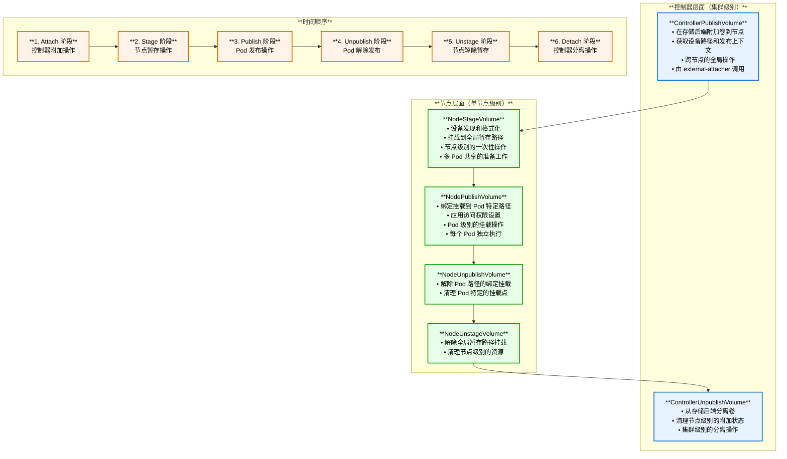

### 2. 关键操作差异分析

#### 2.1 ControllerPublishVolume (附加操作)

基于源码 `pkg/volume/csi/csi_attacher.go`：

```go
// Attach 将卷附加到节点 - 集群级别操作
func (c *csiAttacher) Attach(spec *volume.Spec, nodeName types.NodeName) (string, error) {
    // 1. 创建 VolumeAttachment 对象
    attachment = &storage.VolumeAttachment{
        ObjectMeta: metav1.ObjectMeta{
            Name: attachID,
        },
        Spec: storage.VolumeAttachmentSpec{
            NodeName: node,           // **目标节点**
            Attacher: pvSrc.Driver,   // **CSI 驱动名称**
            Source:   vaSrc,          // **卷源信息**
        },
    }
    
    // 2. 通过 Kubernetes API 创建 VolumeAttachment
    _, err = c.k8s.StorageV1().VolumeAttachments().Create(context.TODO(), attachment, metav1.CreateOptions{})
    
    // 3. external-attacher 监听到事件后调用 CSI ControllerPublishVolume
    return attachID, nil
}
```

**ControllerPublishVolume 特点**：
- ✅ **集群级操作**：不在特定节点上执行，而是存储控制器操作
- ✅ **全局可见性**：操作结果对整个集群可见
- ✅ **存储后端交互**：直接与存储系统通信，分配设备路径
- ✅ **返回发布上下文**：提供设备信息给后续节点操作使用

#### 2.2 NodeStageVolume (节点暂存操作)

基于源码 `pkg/volume/csi/csi_client.go`：

```go
// NodeStageVolume 在节点上暂存卷 - 节点级别操作
func (c *csiDriverClient) NodeStageVolume(ctx context.Context,
    volID string,
    publishContext map[string]string,    // **来自 ControllerPublishVolume**
    stagingTargetPath string,            // **全局暂存路径**
    fsType string,
    accessMode api.PersistentVolumeAccessMode,
    secrets map[string]string,
    volumeContext map[string]string,
    mountOptions []string,
    fsGroup *int64,
) error {
    req := &csipbv1.NodeStageVolumeRequest{
        VolumeId:          volID,
        PublishContext:    publishContext,    // **使用附加阶段的信息**
        StagingTargetPath: stagingTargetPath, // **/var/lib/kubelet/plugins/.../stage**
        VolumeCapability:  volumeCapability,
        Secrets:           secrets,
        VolumeContext:     volumeContext,
    }
    
    _, err = nodeClient.NodeStageVolume(ctx, req)
    return err
}
```

**NodeStageVolume 特点**：
- ✅ **节点级操作**：在目标节点上执行
- ✅ **设备处理**：发现、格式化、挂载设备到全局路径
- ✅ **一次性操作**：每个卷在节点上只需执行一次
- ✅ **多 Pod 共享基础**：为后续多个 Pod 使用同一卷做准备

#### 2.3 NodePublishVolume (Pod 发布操作)

```go
// NodePublishVolume 将卷发布到 Pod 路径 - Pod 级别操作
func (c *csiDriverClient) NodePublishVolume(
    ctx context.Context,
    volID string,
    readOnly bool,
    stagingTargetPath string,  // **来自 NodeStageVolume**
    targetPath string,         // **Pod 特定路径**
    accessMode api.PersistentVolumeAccessMode,
    publishContext map[string]string,
    volumeContext map[string]string,
    secrets map[string]string,
    fsType string,
    mountOptions []string,
    fsGroup *int64,
) error {
    req := &csipbv1.NodePublishVolumeRequest{
        VolumeId:          volID,
        TargetPath:        targetPath,         // **/var/lib/kubelet/pods/.../volumes**
        StagingTargetPath: stagingTargetPath,  // **绑定挂载源**
        Readonly:          readOnly,
        PublishContext:    publishContext,
        VolumeContext:     volumeContext,
        Secrets:           secrets,
        VolumeCapability:  volumeCapability,
    }
    
    _, err = nodeClient.NodePublishVolume(ctx, req)
    return err
}
```

**NodePublishVolume 特点**：
- ✅ **Pod 级操作**：为特定 Pod 创建挂载点
- ✅ **绑定挂载**：通常使用 bind mount 从暂存路径到 Pod 路径
- ✅ **多次执行**：同一卷可以被多个 Pod 使用（取决于访问模式）
- ✅ **权限控制**：应用 Pod 特定的只读/读写权限

### 3. 实际操作示例对比

#### 3.1 文件系统卷的完整流程

```bash
# 1. ControllerPublishVolume 结果（存储后端）
# AWS EBS 示例：卷 vol-1234567890abcdef0 附加到实例 i-0abcdef1234567890
# 返回 PublishContext: {"device_path": "/dev/nvme1n1"}

# 2. NodeStageVolume 执行的操作（节点上）
# 发现设备
lsblk | grep nvme1n1
# 格式化设备（如需要）
mkfs.ext4 /dev/nvme1n1
# 挂载到全局暂存路径
mount /dev/nvme1n1 /var/lib/kubelet/plugins/kubernetes.io/csi/driver/ebs.csi.aws.com/vol-123/globalmount

# 3. NodePublishVolume 执行的操作（每个 Pod）
# 创建 Pod 特定目录
mkdir -p /var/lib/kubelet/pods/pod-abc/volumes/kubernetes.io~csi/vol-123/mount
# 绑定挂载
mount --bind /var/lib/kubelet/plugins/.../globalmount /var/lib/kubelet/pods/pod-abc/volumes/.../mount
```

#### 3.2 块设备卷的特殊处理

基于源码 `pkg/volume/csi/csi_block.go`：

```go
// 块设备模式下的 NodeStageVolume
func (m *csiBlockMapper) stageVolumeForBlock(ctx context.Context, csi csiClient, ...) (string, error) {
    // 块设备不需要文件系统格式化
    err = csi.NodeStageVolume(ctx,
        csiSource.VolumeHandle,
        publishVolumeInfo,
        stagingPath,
        fsTypeBlockName,    // **特殊标识：block 模式**
        accessMode,
        nodeStageSecrets,
        csiSource.VolumeAttributes,
        nil, /* MountOptions - 块设备不需要挂载选项 */
        nil, /* fsGroup - 块设备不需要文件系统组 */)
    
    return stagingPath, nil
}
```

### 4. 操作失败的影响范围

#### 4.1 失败影响对比表

| 操作失败 | 影响范围 | 恢复方式 | 对其他 Pod 的影响 |
|---------|----------|----------|-------------------|
| **ControllerPublishVolume** | 整个卷无法使用 | 重新执行附加操作 | 所有使用该卷的 Pod 无法启动 |
| **NodeStageVolume** | 该节点上无法使用 | 重新执行暂存操作 | 该节点上的相关 Pod 无法启动 |
| **NodePublishVolume** | 单个 Pod 无法访问 | 重新执行发布操作 | 不影响其他 Pod |

#### 4.2 重试和幂等性保证

```go
// CSI 操作的幂等性要求
type CSIOperationIdempotency struct {
    // ControllerPublishVolume 幂等性
    // 如果卷已经附加到节点，返回成功和相同的 PublishContext
    ControllerPublish bool `json:"controllerPublish"`
    
    // NodeStageVolume 幂等性  
    // 如果卷已经暂存到指定路径，返回成功
    NodeStage bool `json:"nodeStage"`
    
    // NodePublishVolume 幂等性
    // 如果卷已经发布到目标路径，返回成功
    NodePublish bool `json:"nodePublish"`
}
```

### 5. 存储驱动实现差异

#### 5.1 不同存储类型的实现特点

| 存储类型 | ControllerPublishVolume | NodeStageVolume | NodePublishVolume |
|---------|-------------------------|-----------------|-------------------|
| **云块存储**<br/>(EBS/GCE PD) | ✅ 附加到 VM 实例<br/>返回设备路径 | ✅ 格式化设备<br/>挂载到全局路径 | ✅ 绑定挂载到 Pod 路径 |
| **网络存储**<br/>(NFS/iSCSI) | ❌ 通常不需要<br/>或仅返回连接信息 | ✅ 建立网络连接<br/>挂载远程文件系统 | ✅ 绑定挂载或软链接 |
| **分布式存储**<br/>(Ceph RBD) | ✅ 映射 RBD 设备<br/>返回设备路径 | ✅ 格式化 RBD 设备<br/>挂载到全局路径 | ✅ 绑定挂载到 Pod 路径 |
| **本地存储**<br/>(Local PV) | ❌ 不需要<br/>设备已在本地 | ✅ 准备本地路径<br/>设置权限 | ✅ 绑定挂载或软链接 |

#### 5.2 驱动能力声明

```go
// CSI 驱动能力声明示例
func (d *Driver) getControllerServiceCapabilities() []*csi.ControllerServiceCapability {
    return []*csi.ControllerServiceCapability{
        {
            Type: &csi.ControllerServiceCapability_Rpc{
                Rpc: &csi.ControllerServiceCapability_RPC{
                    Type: csi.ControllerServiceCapability_RPC_PUBLISH_UNPUBLISH_VOLUME,
                },
            },
        },
    }
}

func (d *Driver) getNodeServiceCapabilities() []*csi.NodeServiceCapability {
    return []*csi.NodeServiceCapability{
        {
            Type: &csi.NodeServiceCapability_Rpc{
                Rpc: &csi.NodeServiceCapability_RPC{
                    Type: csi.NodeServiceCapability_RPC_STAGE_UNSTAGE_VOLUME,
                },
            },
        },
    }
}
```

### 6. 监控和调试

#### 6.1 操作状态检查

```bash
# 检查卷附加状态（ControllerPublishVolume 结果）
kubectl get volumeattachments
kubectl describe volumeattachment csi-<volume-hash>

# 检查节点暂存状态（NodeStageVolume 结果）
# 在节点上检查全局挂载点
mount | grep kubelet/plugins
ls -la /var/lib/kubelet/plugins/kubernetes.io/csi/

# 检查 Pod 发布状态（NodePublishVolume 结果）
# 在节点上检查 Pod 挂载点
mount | grep kubelet/pods
ls -la /var/lib/kubelet/pods/*/volumes/kubernetes.io~csi/
```

#### 6.2 故障排查流程

```bash
# 1. 检查 VolumeAttachment 状态
kubectl get volumeattachment -o yaml | grep -A 5 -B 5 "attached: false"

# 2. 检查 CSI 驱动日志
kubectl logs -n kube-system deployment/csi-controller -c csi-attacher
kubectl logs -n kube-system daemonset/csi-node -c csi-driver

# 3. 检查 Kubelet 日志
journalctl -u kubelet | grep -i csi | tail -50

# 4. 检查节点设备状态
lsblk
mount | grep csi
```

## CSI 快照能力 vs 文件系统快照对比

### 1. 概念层次差异

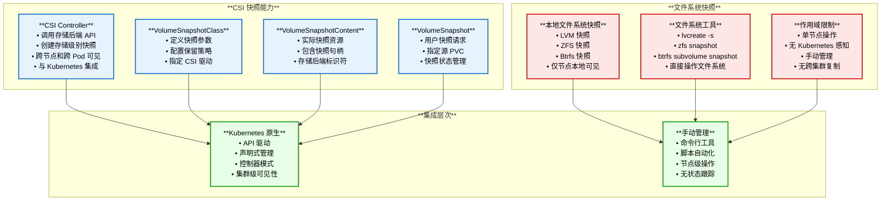

### 2. 技术实现对比

#### 2.1 CSI 快照实现机制

```go
// CSI 快照接口定义
service Controller {
    // 创建存储级别快照
    rpc CreateSnapshot(CreateSnapshotRequest) returns (CreateSnapshotResponse) {}
    // 删除快照
    rpc DeleteSnapshot(DeleteSnapshotRequest) returns (DeleteSnapshotResponse) {}
    // 列出快照
    rpc ListSnapshots(ListSnapshotsRequest) returns (ListSnapshotsResponse) {}
}

// CreateSnapshotRequest 结构
message CreateSnapshotRequest {
    string name = 1;                           // 快照名称
    string source_volume_id = 2;               // 源卷 ID
    map<string, string> secrets = 3;           // 认证信息
    map<string, string> parameters = 4;        // 快照参数
}

// CreateSnapshotResponse 结构  
message CreateSnapshotResponse {
    Snapshot snapshot = 1;
}

message Snapshot {
    string snapshot_id = 1;                    // 快照唯一标识
    string source_volume_id = 2;               // 源卷 ID
    int64 creation_time = 3;                   // 创建时间戳
    int64 size_bytes = 4;                      // 快照大小
    bool ready_to_use = 5;                     // 是否可用
}
```

#### 2.2 文件系统快照示例

```bash
# LVM 快照操作
# 创建 LVM 快照
lvcreate -L1G -s -n myvolume-snapshot /dev/vg/myvolume
# 挂载快照进行访问
mount /dev/vg/myvolume-snapshot /mnt/snapshot
# 删除快照
umount /mnt/snapshot
lvremove /dev/vg/myvolume-snapshot

# ZFS 快照操作
# 创建 ZFS 快照
zfs snapshot pool/dataset@snapshot1
# 访问快照数据
ls /pool/dataset/.zfs/snapshot/snapshot1/
# 删除快照
zfs destroy pool/dataset@snapshot1

# Btrfs 快照操作
# 创建 Btrfs 快照
btrfs subvolume snapshot /mnt/volume /mnt/volume-snapshot
# 删除快照
btrfs subvolume delete /mnt/volume-snapshot
```

### 3. 功能特性对比

#### 3.1 详细功能对比表

| 特性维度 | CSI 快照能力 | 文件系统快照 | 说明 |
|---------|-------------|-------------|------|
| **管理方式** | Kubernetes API 声明式 | 命令行手动操作 | CSI 通过 YAML 配置，FS 需要 shell 命令 |
| **可见性** | 集群级别全局可见 | 节点本地可见 | CSI 快照可跨节点访问，FS 快照仅本地 |
| **生命周期** | 控制器自动管理 | 手动创建删除 | CSI 有状态跟踪，FS 需要手动维护 |
| **一致性保证** | 应用感知快照 | 文件系统级一致性 | CSI 可以与应用协调，FS 仅保证文件系统一致性 |
| **跨存储支持** | 支持多种存储后端 | 依赖特定文件系统 | CSI 抽象化存储差异，FS 绑定特定实现 |
| **恢复方式** | 创建新 PVC 从快照 | 直接访问快照目录 | CSI 通过 Kubernetes 流程，FS 直接文件操作 |
| **权限管理** | RBAC 集成 | 文件系统权限 | CSI 使用 K8s 权限模型，FS 使用传统权限 |
| **监控告警** | Prometheus 指标 | 自定义脚本监控 | CSI 集成可观测性，FS 需要额外工具 |

#### 3.2 存储后端快照能力

```yaml
# AWS EBS CSI 快照配置
apiVersion: snapshot.storage.k8s.io/v1
kind: VolumeSnapshotClass
metadata:
  name: ebs-snapshot-class
driver: ebs.csi.aws.com
deletionPolicy: Delete
parameters:
  # EBS 快照参数
  encrypted: "true"
  # 快照存储在 AWS S3，可跨可用区访问
---
# Google Cloud PD CSI 快照配置  
apiVersion: snapshot.storage.k8s.io/v1
kind: VolumeSnapshotClass
metadata:
  name: pd-snapshot-class
driver: pd.csi.storage.gke.io
deletionPolicy: Retain
parameters:
  # GCE 持久化磁盘快照参数
  storage-locations: "us-central1"
  # 支持区域快照，可跨区域恢复
---
# Ceph RBD CSI 快照配置
apiVersion: snapshot.storage.k8s.io/v1  
kind: VolumeSnapshotClass
metadata:
  name: rbd-snapshot-class
driver: rbd.csi.ceph.com
deletionPolicy: Delete
parameters:
  clusterID: "b9127830-b698-4f0a-9c43-9a7c8c70f3cd"
  # Ceph 集群快照，支持多副本和跨节点
```

### 4. 使用场景差异

#### 4.1 CSI 快照适用场景

```yaml
# 场景1：应用数据备份
apiVersion: snapshot.storage.k8s.io/v1
kind: VolumeSnapshot
metadata:
  name: database-backup-daily
  namespace: production
spec:
  source:
    persistentVolumeClaimName: postgres-data
  volumeSnapshotClassName: ebs-snapshot-class
---
# 场景2：开发环境数据复制
apiVersion: v1
kind: PersistentVolumeClaim
metadata:
  name: dev-database
  namespace: development  
spec:
  accessModes:
    - ReadWriteOnce
  resources:
    requests:
      storage: 20Gi
  storageClassName: gp3
  dataSource:
    name: database-backup-daily
    kind: VolumeSnapshot
    apiGroup: snapshot.storage.k8s.io
```

#### 4.2 文件系统快照适用场景

```bash
# 场景1：系统升级前快照
# 创建根文件系统快照
lvcreate -L2G -s -n root-before-upgrade /dev/vg/root
# 执行升级操作
apt upgrade -y
# 如果升级失败，可以快速回滚
# umount /
# lvconvert --merge /dev/vg/root-before-upgrade

# 场景2：开发环境快速恢复点
# 在干净状态创建快照
btrfs subvolume snapshot /home/dev /home/dev-clean
# 进行开发和测试
# 需要重置时快速恢复
rm -rf /home/dev/*
cp -a /home/dev-clean/* /home/dev/
```

### 5. 性能和存储开销

#### 5.1 快照机制性能对比

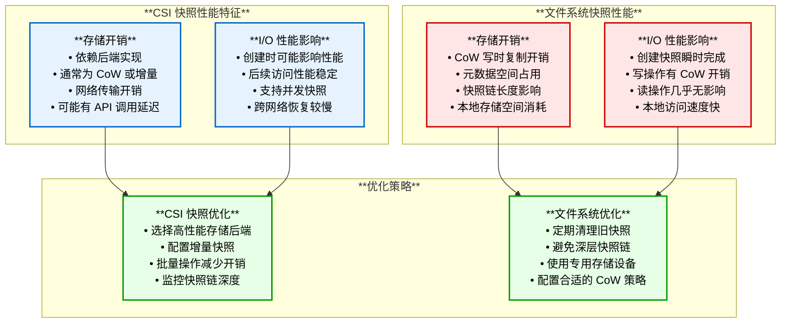

### 6. 选择建议和最佳实践

#### 6.1 技术选择决策树

```bash
# 选择 CSI 快照的情况：
✅ 需要集群级别的快照管理
✅ 要求与 Kubernetes 工作流集成  
✅ 需要跨节点/跨区域快照访问
✅ 使用云存储或分布式存储
✅ 需要自动化快照策略
✅ 要求统一的 RBAC 权限管理

# 选择文件系统快照的情况：
✅ 单节点本地存储场景
✅ 需要极速快照创建和恢复
✅ 系统级别的快照需求
✅ 现有文件系统已支持快照
✅ 不需要 Kubernetes 集成
✅ 存储成本敏感场景
```

#### 6.2 混合使用策略

```yaml
# 生产环境：CSI 快照用于应用数据
apiVersion: v1
kind: ConfigMap
metadata:
  name: backup-strategy
data:
  csi-snapshot-schedule: |
    # 每日 CSI 快照用于应用数据备份
    0 2 * * * kubectl create -f daily-app-snapshot.yaml
    
  filesystem-snapshot-script: |
    #!/bin/bash
    # 系统升级前使用文件系统快照
    if [ "$1" = "pre-upgrade" ]; then
        lvcreate -L5G -s -n system-backup /dev/vg/root
        echo "System snapshot created: system-backup"
    fi
    
    # 升级后清理
    if [ "$1" = "post-upgrade" ]; then
        lvremove -f /dev/vg/system-backup
        echo "System snapshot removed"
    fi
```

---

## 动态存储供应流程

动态存储供应序列图展示了从 PVC 创建到卷可用的完整流程：

1. **PVC 创建**：用户创建 PersistentVolumeClaim
2. **StorageClass 处理**：根据 StorageClass 配置调用 CSI 驱动
3. **卷创建**：CSI Controller 在存储后端创建卷
4. **卷附加**：将卷附加到目标节点
5. **节点暂存**：在节点上暂存卷到全局路径
6. **Pod 发布**：将卷绑定挂载到 Pod 路径

### StorageClass 配置示例

```yaml
apiVersion: storage.k8s.io/v1
kind: StorageClass
metadata:
  name: fast-ssd
provisioner: ebs.csi.aws.com
parameters:
  type: gp3
  iops: "3000"
  throughput: "125"
  encrypted: "true"
volumeBindingMode: WaitForFirstConsumer
allowVolumeExpansion: true
reclaimPolicy: Delete
```

### PVC 使用示例

```yaml
apiVersion: v1
kind: PersistentVolumeClaim
metadata:
  name: my-pvc
spec:
  accessModes:
    - ReadWriteOnce
  storageClassName: fast-ssd
  resources:
    requests:
      storage: 10Gi
```

---

## 主流 CSI 驱动对比

### 1. AWS EBS CSI Driver

**特性支持**：
- ✅ 动态供应
- ✅ 卷附加/分离
- ✅ 卷扩容
- ✅ 快照支持
- ✅ 加密支持
- ✅ 多可用区支持

**配置示例**：
```yaml
apiVersion: storage.k8s.io/v1
kind: StorageClass
metadata:
  name: ebs-gp3
provisioner: ebs.csi.aws.com
parameters:
  type: gp3
  iops: "3000"
  throughput: "125"
  encrypted: "true"
volumeBindingMode: WaitForFirstConsumer
allowVolumeExpansion: true
```

### 2. Google Cloud Persistent Disk CSI

**特性支持**：
- ✅ 动态供应
- ✅ 区域持久化磁盘
- ✅ 卷快照和克隆
- ✅ 卷扩容
- ✅ 多实例只读访问

**配置示例**：
```yaml
apiVersion: storage.k8s.io/v1
kind: StorageClass
metadata:
  name: ssd-retain
provisioner: pd.csi.storage.gke.io
parameters:
  type: pd-ssd
  replication-type: regional-pd
volumeBindingMode: WaitForFirstConsumer
allowVolumeExpansion: true
reclaimPolicy: Retain
```

### 3. Ceph RBD CSI Driver

**特性支持**：
- ✅ 动态供应
- ✅ 卷快照和克隆
- ✅ 卷扩容
- ✅ 块设备和文件系统模式
- ✅ 读写多(RWX)支持（CephFS）

**配置示例**：
```yaml
apiVersion: storage.k8s.io/v1
kind: StorageClass
metadata:
   name: csi-rbd-sc
provisioner: rbd.csi.ceph.com
parameters:
   clusterID: b9127830-b698-4f0a-9c43-9a7c8c70f3cd
   pool: kubernetes
   imageFeatures: layering
   csi.storage.k8s.io/provisioner-secret-name: csi-rbd-secret
   csi.storage.k8s.io/provisioner-secret-namespace: default
   csi.storage.k8s.io/controller-expand-secret-name: csi-rbd-secret
   csi.storage.k8s.io/controller-expand-secret-namespace: default
   csi.storage.k8s.io/node-stage-secret-name: csi-rbd-secret
   csi.storage.k8s.io/node-stage-secret-namespace: default
reclaimPolicy: Delete
allowVolumeExpansion: true
mountOptions:
   - discard
```

---

## CSI 插件开发指南

### 1. 开发环境设置

```bash
# 安装 CSI 开发工具
go get github.com/container-storage-interface/spec
go get github.com/kubernetes-csi/csi-lib-utils

# 创建项目结构
mkdir my-csi-driver
cd my-csi-driver
go mod init my-csi-driver

# 项目结构
my-csi-driver/
├── cmd/
│   └── my-csi-driver/
│       └── main.go
├── pkg/
│   ├── driver/
│   │   ├── controller.go
│   │   ├── identity.go
│   │   ├── node.go
│   │   └── driver.go
│   └── utils/
├── deploy/
│   ├── controller.yaml
│   ├── node.yaml
│   └── rbac.yaml
└── Dockerfile
```

### 2. 基础驱动框架

```go
// pkg/driver/driver.go
package driver

import (
    "context"
    "net"
    "net/url"
    "os"
    "path/filepath"
    
    "github.com/container-storage-interface/spec/lib/go/csi"
    "google.golang.org/grpc"
    "k8s.io/klog/v2"
)

type Driver struct {
    name     string
    version  string
    endpoint string
    
    ids *IdentityServer
    cs  *ControllerServer  
    ns  *NodeServer
    
    cap []*csi.ControllerServiceCapability
    vc  []*csi.VolumeCapability_AccessMode
}

func NewDriver(driverName, version, endpoint string) *Driver {
    klog.Infof("Driver: %v version: %v", driverName, version)
    
    d := &Driver{
        name:     driverName,
        version:  version,
        endpoint: endpoint,
    }
    
    d.AddControllerServiceCapabilities([]csi.ControllerServiceCapability_RPC_Type{
        csi.ControllerServiceCapability_RPC_CREATE_DELETE_VOLUME,
        csi.ControllerServiceCapability_RPC_PUBLISH_UNPUBLISH_VOLUME,
        csi.ControllerServiceCapability_RPC_CREATE_DELETE_SNAPSHOT,
        csi.ControllerServiceCapability_RPC_EXPAND_VOLUME,
    })
    
    d.AddVolumeCapabilityAccessModes([]csi.VolumeCapability_AccessMode_Mode{
        csi.VolumeCapability_AccessMode_SINGLE_NODE_WRITER,
        csi.VolumeCapability_AccessMode_SINGLE_NODE_READER_ONLY,
    })
    
    return d
}

func (d *Driver) Run() error {
    scheme, addr, err := ParseEndpoint(d.endpoint)
    if err != nil {
        return err
    }
    
    listener, err := net.Listen(scheme, addr)
    if err != nil {
        return err
    }
    
    logErr := func(ctx context.Context, req interface{}, info *grpc.UnaryServerInfo, handler grpc.UnaryHandler) (interface{}, error) {
        resp, err := handler(ctx, req)
        if err != nil {
            klog.Errorf("GRPC error: %v", err)
        }
        return resp, err
    }
    
    opts := []grpc.ServerOption{
        grpc.UnaryInterceptor(logErr),
    }
    
    server := grpc.NewServer(opts...)
    
    d.ids = NewIdentityServer(d)
    d.cs = NewControllerServer(d)  
    d.ns = NewNodeServer(d)
    
    csi.RegisterIdentityServer(server, d.ids)
    csi.RegisterControllerServer(server, d.cs)
    csi.RegisterNodeServer(server, d.ns)
    
    klog.Infof("Listening for connections on address: %#v", listener.Addr())
    return server.Serve(listener)
}

func ParseEndpoint(ep string) (string, string, error) {
    u, err := url.Parse(ep)
    if err != nil {
        return "", "", err
    }
    
    addr := filepath.Join(u.Host, u.Path)
    if u.Host == "" {
        addr = u.Path
    }
    
    return u.Scheme, addr, nil
}
```

### 3. 部署配置

```yaml
# deploy/controller.yaml
apiVersion: apps/v1
kind: Deployment
metadata:
  name: my-csi-controller
spec:
  replicas: 1
  selector:
    matchLabels:
      app: my-csi-controller
  template:
    metadata:
      labels:
        app: my-csi-controller
    spec:
      serviceAccount: my-csi-controller-sa
      containers:
        - name: csi-provisioner
          image: registry.k8s.io/sig-storage/csi-provisioner:v3.4.0
          args:
            - "--csi-address=$(ADDRESS)"
            - "--v=2"
            - "--feature-gates=Topology=true"
            - "--leader-election=true"
          env:
            - name: ADDRESS
              value: /var/lib/csi/sockets/pluginproxy/csi.sock
          volumeMounts:
            - name: socket-dir
              mountPath: /var/lib/csi/sockets/pluginproxy/
              
        - name: csi-attacher  
          image: registry.k8s.io/sig-storage/csi-attacher:v4.1.0
          args:
            - "--v=2"
            - "--csi-address=$(ADDRESS)"
            - "--leader-election=true"
          env:
            - name: ADDRESS
              value: /var/lib/csi/sockets/pluginproxy/csi.sock
          volumeMounts:
            - name: socket-dir
              mountPath: /var/lib/csi/sockets/pluginproxy/
              
        - name: csi-snapshotter
          image: registry.k8s.io/sig-storage/csi-snapshotter:v6.2.1
          args:
            - "--csi-address=$(ADDRESS)"
            - "--v=2"
            - "--leader-election=true"
          env:
            - name: ADDRESS
              value: /var/lib/csi/sockets/pluginproxy/csi.sock
          volumeMounts:
            - name: socket-dir
              mountPath: /var/lib/csi/sockets/pluginproxy/
              
        - name: csi-resizer
          image: registry.k8s.io/sig-storage/csi-resizer:v1.7.0
          args:
            - "--csi-address=$(ADDRESS)"
            - "--v=2"
            - "--leader-election=true"
          env:
            - name: ADDRESS
              value: /var/lib/csi/sockets/pluginproxy/csi.sock
          volumeMounts:
            - name: socket-dir
              mountPath: /var/lib/csi/sockets/pluginproxy/
              
        - name: my-csi-driver
          image: my-csi-driver:latest
          args:
            - "--endpoint=$(CSI_ENDPOINT)"
            - "--node-id=$(KUBE_NODE_NAME)"
            - "--mode=controller"
          env:
            - name: CSI_ENDPOINT
              value: unix:///var/lib/csi/sockets/pluginproxy/csi.sock
            - name: KUBE_NODE_NAME
              valueFrom:
                fieldRef:
                  apiVersion: v1
                  fieldPath: spec.nodeName
          volumeMounts:
            - name: socket-dir
              mountPath: /var/lib/csi/sockets/pluginproxy/
      volumes:
        - name: socket-dir
          emptyDir: {}
```

---

## CSI 性能优化与监控

### 1. 性能优化建议

#### 卷附加优化

```yaml
# Kubelet 配置优化
apiVersion: kubelet.config.k8s.io/v1beta1
kind: KubeletConfiguration
maxParallelImagePulls: 3
parallelImagePulls: true

# AttachDetach Controller 优化
attach-detach-reconcile-sync-period: "1m0s"
disable-attach-detach-reconcile-sync: false
```

#### 存储类优化

```yaml
apiVersion: storage.k8s.io/v1
kind: StorageClass
metadata:
  name: fast-ssd
provisioner: my-csi-driver
parameters:
  type: "ssd"
  iops: "3000"
  throughput: "250"
volumeBindingMode: WaitForFirstConsumer  # 延迟绑定优化
allowVolumeExpansion: true
reclaimPolicy: Delete
```

### 2. 监控指标

#### CSI 驱动指标

```go
// 在驱动中添加 Prometheus 指标
var (
    csiOperationDuration = prometheus.NewHistogramVec(
        prometheus.HistogramOpts{
            Name: "csi_operation_duration_seconds",
            Help: "Duration of CSI operations",
        },
        []string{"method", "grpc_code"},
    )
    
    csiOperationTotal = prometheus.NewCounterVec(
        prometheus.CounterOpts{
            Name: "csi_operation_total",
            Help: "Total CSI operations",
        },
        []string{"method", "grpc_code"},
    )
)

// 在 gRPC 拦截器中记录指标
func metricsInterceptor(ctx context.Context, req interface{}, info *grpc.UnaryServerInfo, handler grpc.UnaryHandler) (interface{}, error) {
    start := time.Now()
    
    resp, err := handler(ctx, req)
    
    duration := time.Since(start)
    code := codes.OK
    if err != nil {
        code = status.Code(err)
    }
    
    csiOperationDuration.WithLabelValues(info.FullMethod, code.String()).Observe(duration.Seconds())
    csiOperationTotal.WithLabelValues(info.FullMethod, code.String()).Inc()
    
    return resp, err
}
```

#### ServiceMonitor 配置

```yaml
apiVersion: monitoring.coreos.com/v1
kind: ServiceMonitor
metadata:
  name: my-csi-driver-metrics
spec:
  selector:
    matchLabels:
      app: my-csi-driver
  endpoints:
  - port: metrics
    interval: 30s
    path: /metrics
```

---

## 故障排除与调试

### 1. 常见问题诊断

#### CSI 驱动注册问题

```bash
# 检查 CSI 驱动注册状态
kubectl get csidriver
kubectl describe csidriver my-csi-driver

# 检查 CSINode 对象
kubectl get csinode
kubectl describe csinode <node-name>

# 检查驱动 Pod 状态
kubectl get pods -n kube-system | grep csi
kubectl logs -n kube-system <csi-driver-pod> -c csi-driver
```

#### 卷附加问题

```bash
# 检查 VolumeAttachment 对象
kubectl get volumeattachment
kubectl describe volumeattachment <attachment-name>

# 检查附加/分离控制器日志
kubectl logs -n kube-system <controller-manager-pod> | grep attach

# 检查节点上的挂载点
mount | grep <volume-id>
lsblk
```

#### 卷挂载问题

```bash
# 检查 Pod 事件
kubectl describe pod <pod-name>

# 检查 Kubelet 日志
sudo journalctl -u kubelet -f | grep -i csi

# 检查 CSI 驱动日志
kubectl logs -n kube-system <csi-node-pod> -c csi-driver
```

### 2. 调试工具

#### CSI 工具集

```bash
# 安装 csi-tools
git clone https://github.com/kubernetes-csi/csi-driver-host-path.git
cd csi-driver-host-path

# 测试 CSI 驱动
./bin/hostpathplugin --endpoint=unix:///tmp/csi.sock --nodeid=node1

# 使用 csc 工具测试
csc identity plugin-info --endpoint unix:///tmp/csi.sock
csc controller create-volume --endpoint unix:///tmp/csi.sock test-volume
csc node publish-volume --endpoint unix:///tmp/csi.sock --target-path /mnt/test test-volume
```

#### 诊断脚本

```bash
#!/bin/bash
# csi-debug.sh - CSI 诊断脚本

echo "=== CSI Driver Status ==="
kubectl get csidriver -o wide

echo "=== CSI Node Status ==="  
kubectl get csinode -o wide

echo "=== Volume Attachments ==="
kubectl get volumeattachment -o wide

echo "=== Storage Classes ==="
kubectl get sc -o wide

echo "=== PVCs and PVs ==="
kubectl get pvc,pv -A -o wide

echo "=== CSI Driver Pods ==="
kubectl get pods -A | grep csi

echo "=== Recent CSI Events ==="
kubectl get events -A | grep -i csi | tail -20
```

---

## 总结

### 🔑 **核心要点**

1. **标准化接口**：CSI 提供了云原生存储的标准接口，实现了存储供应商与容器编排系统的解耦

2. **完整生命周期**：涵盖了存储卷从创建、附加、暂存、发布到清理的完整生命周期管理

3. **插件化架构**：支持多种存储后端实现，包括云存储、分布式存储、本地存储等

4. **高级特性支持**：提供快照、克隆、扩容、拓扑感知等企业级存储特性

### 🏆 **最佳实践**

- **选择合适的 CSI 驱动**：根据存储需求和环境选择最适合的 CSI 实现
- **优化存储配置**：合理配置 StorageClass 参数和挂载选项
- **建立监控体系**：监控存储性能、容量使用和操作延迟
- **制定备份策略**：利用 CSI 快照功能建立数据备份和恢复机制

### 🎯 **发展趋势**

- **性能优化**：持续优化 I/O 性能和存储访问延迟
- **多云支持**：增强多云环境下的存储管理能力
- **智能调度**：结合存储拓扑和数据局部性的智能调度
- **安全增强**：加强存储加密和访问控制机制

CSI 作为云原生存储的标准接口，为 Kubernetes 生态提供了强大而灵活的存储解决方案，是构建现代化容器平台不可或缺的核心组件。
