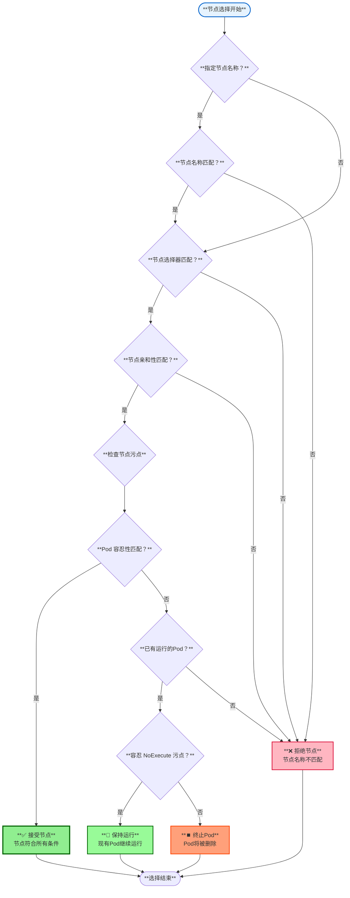
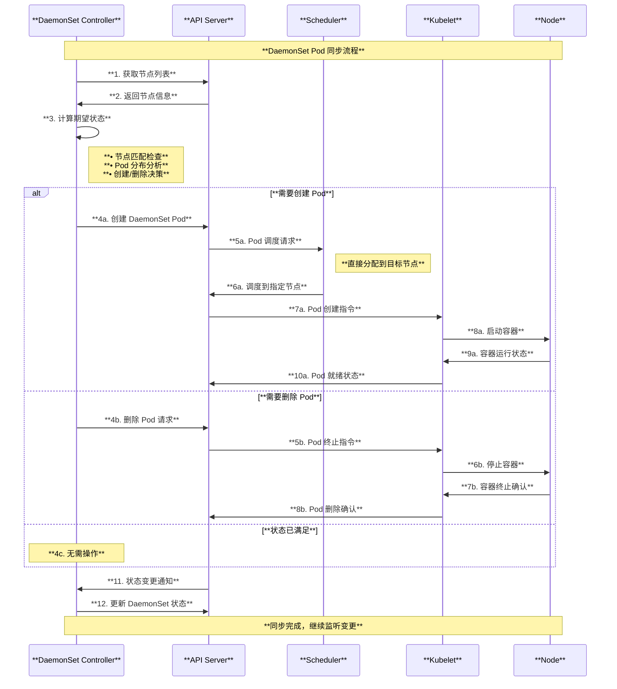
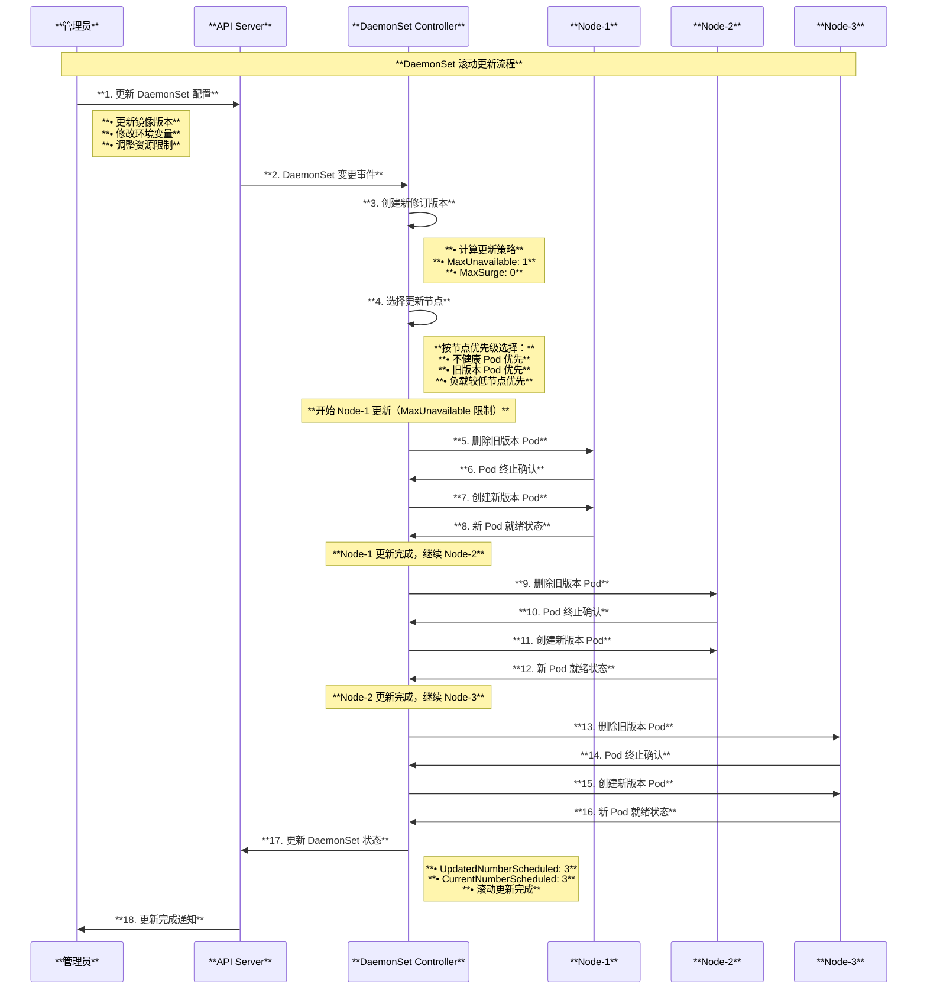

# Kubernetes DaemonSet 架构与原理深度解读

## 目录

1. [概述](#概述)
2. [DaemonSet 核心概念](#daemonset-核心概念)
3. [DaemonSet 整体架构](#daemonset-整体架构)
4. [DaemonSet 控制器实现原理](#daemonset-控制器实现原理)
5. [节点调度与选择机制](#节点调度与选择机制)
6. [Pod 管理与同步机制](#pod-管理与同步机制)
7. [滚动更新策略](#滚动更新策略)
8. [容错与自愈能力](#容错与自愈能力)
9. [使用场景与最佳实践](#使用场景与最佳实践)
10. [总结](#总结)

---

## 概述

DaemonSet 是 Kubernetes 中确保在集群的每个（或选定的）节点上都运行一个 Pod 副本的工作负载控制器。DaemonSet 通常用于运行系统级服务，如日志收集、系统监控、网络代理等需要在每个节点上部署的守护进程。本文档基于 Kubernetes 源码深入解读 DaemonSet 的架构设计、工作原理和实现机制。

### 核心特性

- **节点全覆盖**：确保每个符合条件的节点运行一个 Pod 副本
- **自动调度**：新节点加入时自动调度 Pod，节点移除时自动清理 Pod
- **节点选择**：支持通过节点选择器、亲和性、容忍性等条件过滤节点
- **滚动更新**：支持有序的滚动更新，确保服务连续性
- **故障自愈**：Pod 失败时自动重建，节点故障时自动迁移

---

## DaemonSet 核心概念

### 1. 基本概念关系

- **DaemonSet**：管理在每个节点上运行 Pod 的控制器
- **Node Selector**：基于标签选择运行 Pod 的节点
- **Pod Template**：定义在每个节点上运行的 Pod 规格
- **Tolerations**：允许 Pod 在有污点的节点上运行
- **Node Affinity**：基于节点属性的高级调度策略

### 2. DaemonSet 核心架构图

```mermaid
graph TB
    subgraph "**DaemonSet 核心架构**"
        style subgraph fill:#f9f9f9,stroke:#333,stroke-width:2px
        
        subgraph "**控制平面**"
            style subgraph fill:#e6f3ff,stroke:#0066cc,stroke-width:2px
            
            API[**API Server**<br/>• DaemonSet 资源管理<br/>• 节点状态协调<br/>• Pod 生命周期管理]
            
            subgraph "**Controller Manager**"
                style subgraph fill:#e6ffe6,stroke:#009900,stroke-width:2px
                
                DS_CTRL[**DaemonSet Controller**<br/>• 节点匹配逻辑<br/>• Pod 创建/删除<br/>• 滚动更新协调]
                
                NODE_CTRL[**Node Controller**<br/>• 节点状态管理<br/>• 污点管理<br/>• 节点生命周期]
            end
            
            ETCD[**etcd**<br/>• DaemonSet 状态存储<br/>• 节点信息存储<br/>• Pod 分布记录]
        end
        
        subgraph "**数据平面**"
            style subgraph fill:#fff2e6,stroke:#cc6600,stroke-width:2px
            
            subgraph "**Node-1**"
                style subgraph fill:#f0f8ff,stroke:#4169e1,stroke-width:2px
                
                KUBELET1[**Kubelet**<br/>• Pod 运行管理<br/>• 容器生命周期<br/>• 资源监控]
                POD1[**DaemonSet Pod**<br/>• 日志采集<br/>• 系统监控<br/>• 网络代理]
            end
            
            subgraph "**Node-2**"
                style subgraph fill:#f0f8ff,stroke:#4169e1,stroke-width:2px
                
                KUBELET2[**Kubelet**<br/>• Pod 运行管理<br/>• 容器生命周期<br/>• 资源监控]
                POD2[**DaemonSet Pod**<br/>• 日志采集<br/>• 系统监控<br/>• 网络代理]
            end
            
            subgraph "**Node-3**"
                style subgraph fill:#f0f8ff,stroke:#4169e1,stroke-width:2px
                
                KUBELET3[**Kubelet**<br/>• Pod 运行管理<br/>• 容器生命周期<br/>• 资源监控]
                POD3[**DaemonSet Pod**<br/>• 日志采集<br/>• 系统监控<br/>• 网络代理]
            end
            
            subgraph "**Master Node (Tainted)**"
                style subgraph fill:#ffe6f2,stroke:#cc0066,stroke-width:2px
                
                MASTER_KUBELET[**Kubelet**<br/>• 主节点服务<br/>• 控制组件<br/>• 污点: NoSchedule]
                NO_POD[**无 DaemonSet Pod**<br/>• 不匹配容忍性<br/>• 被污点排除<br/>• 仅系统组件]
            end
        end
    end
    
    API --> DS_CTRL
    DS_CTRL --> NODE_CTRL
    DS_CTRL --> ETCD
    
    DS_CTRL --> KUBELET1
    DS_CTRL --> KUBELET2  
    DS_CTRL --> KUBELET3
    
    KUBELET1 --> POD1
    KUBELET2 --> POD2
    KUBELET3 --> POD3
    
    API --> MASTER_KUBELET
    MASTER_KUBELET --> NO_POD
    
    style POD1 fill:#90EE90,stroke:#006400,stroke-width:2px
    style POD2 fill:#90EE90,stroke:#006400,stroke-width:2px
    style POD3 fill:#90EE90,stroke:#006400,stroke-width:2px
    style NO_POD fill:#FFB6C1,stroke:#DC143C,stroke-width:2px
```

---

## DaemonSet 整体架构

### 1. 系统层次架构图

```mermaid
graph TB
    subgraph "**DaemonSet 系统层次架构**"
        style subgraph fill:#f9f9f9,stroke:#333,stroke-width:2px
        
        subgraph "**管理层**"
            style subgraph fill:#e6f3ff,stroke:#0066cc,stroke-width:2px
            
            USER[**管理员/用户**<br/>• DaemonSet 部署<br/>• 配置管理<br/>• 监控运维]
            
            KUBECTL[**kubectl/API**<br/>• 资源创建<br/>• 状态查询<br/>• 操作执行]
        end
        
        subgraph "**控制层**"
            style subgraph fill:#fff2e6,stroke:#cc6600,stroke-width:2px
            
            DAEMON_CONTROLLER[**DaemonSet Controller**<br/>• 期望状态管理<br/>• 节点 Pod 映射<br/>• 滚动更新协调]
            
            subgraph "**核心组件**"
                style subgraph fill:#e6ffe6,stroke:#009900,stroke-width:2px
                
                NODE_MATCHER[**节点匹配器**<br/>• 节点选择器<br/>• 亲和性规则<br/>• 容忍性检查]
                
                POD_MANAGER[**Pod 管理器**<br/>• Pod 创建/删除<br/>• 状态同步<br/>• 失败处理]
                
                UPDATE_CONTROLLER[**更新控制器**<br/>• 滚动更新<br/>• 版本管理<br/>• 回滚支持]
            end
        end
        
        subgraph "**调度层**"
            style subgraph fill:#f0f8ff,stroke:#4169e1,stroke-width:2px
            
            SCHEDULER[**调度器**<br/>• 节点分配<br/>• 资源匹配<br/>• 约束验证]
            
            NODE_CONTROLLER[**节点控制器**<br/>• 节点生命周期<br/>• 污点管理<br/>• 状态维护]
        end
        
        subgraph "**执行层**"
            style subgraph fill:#ffe6f2,stroke:#cc0066,stroke-width:2px
            
            CLUSTER_NODES[**集群节点**<br/>• Kubelet 代理<br/>• 容器运行时<br/>• 系统资源]
            
            DAEMONSET_PODS[**DaemonSet Pods**<br/>• 系统级服务<br/>• 守护进程<br/>• 基础设施组件]
        end
    end
    
    USER --> KUBECTL
    KUBECTL --> DAEMON_CONTROLLER
    
    DAEMON_CONTROLLER --> NODE_MATCHER
    DAEMON_CONTROLLER --> POD_MANAGER
    DAEMON_CONTROLLER --> UPDATE_CONTROLLER
    
    NODE_MATCHER --> SCHEDULER
    POD_MANAGER --> SCHEDULER
    UPDATE_CONTROLLER --> NODE_CONTROLLER
    
    SCHEDULER --> CLUSTER_NODES
    NODE_CONTROLLER --> CLUSTER_NODES
    CLUSTER_NODES --> DAEMONSET_PODS
```

---

## DaemonSet 控制器实现原理

### 1. 控制器同步逻辑

基于源码 `pkg/controller/daemon/daemon_controller.go`，DaemonSet 控制器的核心同步机制：

```go
func (dsc *DaemonSetsController) syncDaemonSet(ctx context.Context, key string) error {
    logger := klog.FromContext(ctx)
    startTime := dsc.failedPodsBackoff.Clock.Now()

    namespace, name, err := cache.SplitMetaNamespaceKey(key)
    if err != nil {
        return err
    }
    
    // 获取 DaemonSet 对象
    ds, err := dsc.dsLister.DaemonSets(namespace).Get(name)
    if apierrors.IsNotFound(err) {
        logger.V(3).Info("Daemon set has been deleted", "daemonset", key)
        dsc.expectations.DeleteExpectations(logger, key)
        return nil
    }
    
    // 获取集群节点列表
    nodeList, err := dsc.nodeLister.List(labels.Everything())
    if err != nil {
        return fmt.Errorf("couldn't get list of nodes when syncing daemon set %#v: %v", ds, err)
    }

    // 检查期望状态是否满足
    dsKey, err := controller.KeyFunc(ds)
    if err != nil {
        return fmt.Errorf("couldn't get key for object %#v: %v", ds, err)
    }

    if !dsc.expectations.SatisfiedExpectations(logger, dsKey) {
        // 期望状态未满足，等待下次同步
        return nil
    }

    // 执行 DaemonSet 更新逻辑
    err = dsc.updateDaemonSet(ctx, ds, nodeList, hash, key, old)
    return err
}
```

### 2. 节点 Pod 管理逻辑

```go
// manage 管理 DaemonSet 在节点上的 Pod 调度和运行
func (dsc *DaemonSetsController) manage(ctx context.Context, ds *apps.DaemonSet, nodeList []*v1.Node, hash string) error {
    // 查找由 DaemonSet 为节点创建的 Pod
    nodeToDaemonPods, err := dsc.getNodesToDaemonPods(ctx, ds, false)
    if err != nil {
        return fmt.Errorf("couldn't get node to daemon pod mapping for daemon set %q: %v", ds.Name, err)
    }

    logger := klog.FromContext(ctx)
    var nodesNeedingDaemonPods, podsToDelete []string
    
    // 对于每个节点，如果节点正在运行守护进程 Pod 但不应该运行，则终止该 Pod
    // 如果节点应该运行守护进程 Pod 但没有运行，则在节点上创建守护进程 Pod
    for _, node := range nodeList {
        nodesNeedingDaemonPodsOnNode, podsToDeleteOnNode := dsc.podsShouldBeOnNode(
            logger, node, nodeToDaemonPods, ds, hash)

        nodesNeedingDaemonPods = append(nodesNeedingDaemonPods, nodesNeedingDaemonPodsOnNode...)
        podsToDelete = append(podsToDelete, podsToDeleteOnNode...)
    }

    // 删除分配给不存在节点的未调度 Pod（当守护进程集 Pod 由调度器调度时）
    podsToDelete = append(podsToDelete, getUnscheduledPodsWithoutNode(nodeList, nodeToDaemonPods)...)

    // 使用当前历史的哈希标签值标记新 Pod
    if err = dsc.syncNodes(ctx, ds, podsToDelete, nodesNeedingDaemonPods, hash); err != nil {
        return err
    }

    return nil
}
```

### 3. 控制器状态机图

```mermaid
stateDiagram-v2
    [*] --> **监听事件**
    
    **监听事件** --> **获取DaemonSet** : DaemonSet/Node/Pod 事件
    **获取DaemonSet** --> **获取节点列表** : DaemonSet 存在
    **获取DaemonSet** --> **清理期望** : DaemonSet 已删除
    
    **获取节点列表** --> **检查期望状态** : 节点列表获取成功
    **检查期望状态** --> **等待下次同步** : 期望未满足
    **检查期望状态** --> **节点匹配** : 期望已满足
    
    **节点匹配** --> **创建Pod** : 节点需要Pod
    **节点匹配** --> **删除Pod** : 节点不需要Pod
    **节点匹配** --> **滚动更新** : 需要更新Pod
    **节点匹配** --> **更新状态** : 无需操作
    
    **创建Pod** --> **更新状态** : Pod 创建完成
    **删除Pod** --> **更新状态** : Pod 删除完成
    **滚动更新** --> **更新状态** : 更新完成
    
    **更新状态** --> **清理历史** : 状态更新完成
    **清理历史** --> [*] : 同步完成
    
    **等待下次同步** --> [*] : 稍后重试
    **清理期望** --> [*] : 清理完成
    
    note right of **节点匹配** : **匹配规则:**<br/>**• 节点选择器**<br/>**• 亲和性规则**<br/>**• 污点容忍性**<br/>**• 节点状态**
    
    note right of **创建Pod** : **创建条件:**<br/>**• 节点符合条件**<br/>**• 节点无现有Pod**<br/>**• 集群资源充足**
    
    note right of **删除Pod** : **删除条件:**<br/>**• 节点不符合条件**<br/>**• Pod 需要更新**<br/>**• 节点已删除**
```

---

## 节点调度与选择机制

### 1. 节点选择核心逻辑

基于源码 `pkg/controller/daemon/daemon_controller.go`：

```go
// NodeShouldRunDaemonPod 检查节点是否应该运行 DaemonSet 的 Pod
func NodeShouldRunDaemonPod(node *v1.Node, ds *apps.DaemonSet) (bool, bool) {
    pod := NewPod(ds, node.Name)

    // 如果守护进程集指定了节点名称，检查是否与 node.Name 匹配
    if !(ds.Spec.Template.Spec.NodeName == "" || ds.Spec.Template.Spec.NodeName == node.Name) {
        return false, false
    }

    taints := node.Spec.Taints
    fitsNodeName, fitsNodeAffinity, fitsTaints := predicates(pod, node, taints)
    
    if !fitsNodeName || !fitsNodeAffinity {
        return false, false
    }

    if !fitsTaints {
        // 已调度的守护进程 Pod 如果容忍 NoExecute 污点应该继续运行
        _, hasUntoleratedTaint := v1helper.FindMatchingUntoleratedTaint(taints, pod.Spec.Tolerations, func(t *v1.Taint) bool {
            return t.Effect == v1.TaintEffectNoExecute
        })
        return false, !hasUntoleratedTaint
    }

    return true, true
}

// predicates 检查 DaemonSet 的 Pod 是否可以在节点上运行
func predicates(pod *v1.Pod, node *v1.Node, taints []v1.Taint) (fitsNodeName, fitsNodeAffinity, fitsTaints bool) {
    fitsNodeName = len(pod.Spec.NodeName) == 0 || pod.Spec.NodeName == node.Name
    // 忽略解析错误以保持向后兼容性
    fitsNodeAffinity, _ = nodeaffinity.GetRequiredNodeAffinity(pod).Match(node)
    _, hasUntoleratedTaint := v1helper.FindMatchingUntoleratedTaint(taints, pod.Spec.Tolerations, func(t *v1.Taint) bool {
        return t.Effect == v1.TaintEffectNoExecute || t.Effect == v1.TaintEffectNoSchedule
    })
    fitsTaints = !hasUntoleratedTaint
    return
}
```

### 2. 默认容忍性设置

基于源码 `pkg/controller/daemon/util/daemonset_util.go`：

```go
// AddOrUpdateDaemonPodTolerations 为 DaemonSet Pod 应用必要的容忍性
func AddOrUpdateDaemonPodTolerations(spec *v1.PodSpec) {
    // DaemonSet Pod 在节点问题情况下不应被 NodeController 删除
    // 添加无限容忍性以在节点变为未就绪时生存
    v1helper.AddOrUpdateTolerationInPodSpec(spec, &v1.Toleration{
        Key:      v1.TaintNodeNotReady,
        Operator: v1.TolerationOpExists,
        Effect:   v1.TaintEffectNoExecute,
    })

    // 添加对节点不可达污点的容忍性
    v1helper.AddOrUpdateTolerationInPodSpec(spec, &v1.Toleration{
        Key:      v1.TaintNodeUnreachable,
        Operator: v1.TolerationOpExists,
        Effect:   v1.TaintEffectNoExecute,
    })

    // 根据 TaintNodesByCondition 特性，所有 DaemonSet Pod 应该容忍各种节点条件污点
    v1helper.AddOrUpdateTolerationInPodSpec(spec, &v1.Toleration{
        Key:      v1.TaintNodeDiskPressure,
        Operator: v1.TolerationOpExists,
        Effect:   v1.TaintEffectNoSchedule,
    })
    // ... 其他默认容忍性设置
}
```

### 3. 节点选择决策流程图



### 4. 节点状态与 Pod 分布图

```mermaid
graph TB
    subgraph "**集群节点与 Pod 分布**"
        style subgraph fill:#f9f9f9,stroke:#333,stroke-width:2px
        
        subgraph "**符合条件的节点**"
            style subgraph fill:#e6ffe6,stroke:#009900,stroke-width:2px
            
            NODE1[**Worker Node-1**<br/>• 标签: type=worker<br/>• 无污点<br/>• 状态: Ready<br/>**✅ 运行 DaemonSet Pod**]
            
            NODE2[**Worker Node-2**<br/>• 标签: type=worker<br/>• 无污点<br/>• 状态: Ready<br/>**✅ 运行 DaemonSet Pod**]
            
            NODE3[**GPU Node**<br/>• 标签: type=gpu, accelerator=nvidia<br/>• 无污点<br/>• 状态: Ready<br/>**✅ 运行特定 DaemonSet Pod**]
        end
        
        subgraph "**不符合条件的节点**"
            style subgraph fill:#fff2e6,stroke:#cc6600,stroke-width:2px
            
            MASTER[**Master Node**<br/>• 标签: node-role=master<br/>• 污点: NoSchedule<br/>• 状态: Ready<br/>**❌ 无 DaemonSet Pod**]
            
            MAINTENANCE[**维护节点**<br/>• 标签: type=worker<br/>• 污点: maintenance=true:NoSchedule<br/>• 状态: Ready<br/>**❌ Pod 被排除**]
        end
        
        subgraph "**特殊状态节点**"
            style subgraph fill:#ffe6f2,stroke:#cc0066,stroke-width:2px
            
            NOT_READY[**故障节点**<br/>• 标签: type=worker<br/>• 污点: node.kubernetes.io/not-ready<br/>• 状态: NotReady<br/>**🔄 Pod 保持运行**]
            
            NEW_NODE[**新加入节点**<br/>• 标签: type=worker<br/>• 无污点<br/>• 状态: Ready<br/>**➕ 等待 Pod 调度**]
        end
        
        subgraph "**DaemonSet 配置**"
            style subgraph fill:#e6f3ff,stroke:#0066cc,stroke-width:2px
            
            DS_CONFIG[**DaemonSet 规格**<br/>• nodeSelector: type=worker<br/>• tolerations: 容忍故障<br/>• hostNetwork: true<br/>• 更新策略: RollingUpdate]
        end
    end
    
    DS_CONFIG --> NODE1
    DS_CONFIG --> NODE2
    DS_CONFIG --> NODE3
    DS_CONFIG -.- MASTER
    DS_CONFIG -.- MAINTENANCE
    DS_CONFIG --> NOT_READY
    DS_CONFIG --> NEW_NODE
    
    style NODE1 fill:#90EE90,stroke:#006400,stroke-width:2px
    style NODE2 fill:#90EE90,stroke:#006400,stroke-width:2px
    style NODE3 fill:#98FB98,stroke:#006400,stroke-width:2px
    style NOT_READY fill:#FFFFE0,stroke:#DAA520,stroke-width:2px
    style NEW_NODE fill:#ADD8E6,stroke:#4169E1,stroke-width:2px
```

---

## Pod 管理与同步机制

### 1. Pod 同步决策逻辑

基于源码 `pkg/controller/daemon/daemon_controller.go`：

```go
func (dsc *DaemonSetsController) podsShouldBeOnNode(
    logger klog.Logger,
    node *v1.Node,
    nodeToDaemonPods map[string][]*v1.Pod,
    ds *apps.DaemonSet,
    hash string) (nodesNeedingDaemonPods, podsToDelete []string) {

    shouldRun, shouldContinueRunning := NodeShouldRunDaemonPod(node, ds)
    daemonPods := nodeToDaemonPods[node.Name]

    switch {
    case shouldRun && !exists:
        // 如果守护进程 Pod 应该在节点上运行，但没有运行，创建守护进程 Pod
        nodesNeedingDaemonPods = append(nodesNeedingDaemonPods, node.Name)

    case shouldRun:
        // 如果节点上应该运行守护进程 Pod，并且已经在运行，检查是否需要更新
        // 处理滚动更新逻辑
        for _, pod := range daemonPods {
            if pod.DeletionTimestamp != nil {
                continue
            }
            // 检查 Pod 是否需要更新
            if !isUpdatedPod(pod, hash) {
                podsToDelete = append(podsToDelete, pod.Name)
            }
        }

    case !shouldContinueRunning && exists:
        // 如果守护进程 Pod 不应该在节点上运行，但正在运行，删除所有守护进程 Pod
        for _, pod := range daemonPods {
            if pod.DeletionTimestamp != nil {
                continue
            }
            podsToDelete = append(podsToDelete, pod.Name)
        }
    }

    return nodesNeedingDaemonPods, podsToDelete
}
```

### 2. Pod 同步流程时序图



### 3. Pod 生命周期状态图

```mermaid
stateDiagram-v2
    [*] --> **待创建**
    
    **待创建** --> **创建中** : 节点符合条件
    **创建中** --> **调度中** : Pod 对象创建成功
    **调度中** --> **运行中** : 调度到目标节点
    **调度中** --> **调度失败** : 节点资源不足/约束不满足
    
    **运行中** --> **就绪** : 容器启动成功
    **运行中** --> **失败** : 容器启动失败
    
    **就绪** --> **失败** : 健康检查失败
    **就绪** --> **终止中** : 节点不再符合条件
    **就绪** --> **更新中** : 触发滚动更新
    
    **失败** --> **重建中** : 自动重建 Pod
    **重建中** --> **创建中** : 删除旧 Pod
    
    **更新中** --> **终止中** : 删除旧版本 Pod
    **终止中** --> **已删除** : 优雅终止完成
    **已删除** --> **创建中** : 创建新版本 Pod
    
    **调度失败** --> **重试调度** : 等待资源/条件
    **重试调度** --> **调度中** : 重新尝试调度
    **重试调度** --> **已删除** : 超过重试限制
    
    **已删除** --> [*]
    
    note right of **运行中** : **Pod 状态检查:**<br/>**• 容器健康状态**<br/>**• 资源使用情况**<br/>**• 网络连通性**
    
    note right of **就绪** : **服务就绪条件:**<br/>**• 所有容器运行**<br/>**• 健康检查通过**<br/>**• 就绪探针成功**
    
    note right of **失败** : **失败处理策略:**<br/>**• 自动重建 Pod**<br/>**• 指数退避重试**<br/>**• 事件日志记录**
```

---

## 滚动更新策略

### 1. 更新策略类型

基于源码 `pkg/apis/apps/types.go`：

```go
type DaemonSetUpdateStrategy struct {
    // 守护进程集更新类型，可以是 "RollingUpdate" 或 "OnDelete"
    Type DaemonSetUpdateStrategyType
    
    // 滚动更新配置参数，仅当 type = "RollingUpdate" 时存在
    RollingUpdate *RollingUpdateDaemonSet
}

const (
    // RollingUpdateDaemonSetStrategyType - 使用滚动更新替换旧守护进程
    // 即在每个节点上逐个替换它们
    RollingUpdateDaemonSetStrategyType DaemonSetUpdateStrategyType = "RollingUpdate"
    
    // OnDeleteDaemonSetStrategyType - 仅当旧守护进程被删除时才替换它们
    OnDeleteDaemonSetStrategyType DaemonSetUpdateStrategyType = "OnDelete"
)

type RollingUpdateDaemonSet struct {
    // 在更新期间可以不可用的 DaemonSet Pod 的最大数量
    MaxUnavailable *intstr.IntOrString
    
    // 在更新期间可以超过期望 Pod 数量的最大数量
    MaxSurge *intstr.IntOrString
}
```

### 2. 滚动更新实现机制

基于源码 `pkg/controller/daemon/update.go`：

```go
func (dsc *DaemonSetsController) rollingUpdate(ctx context.Context, ds *apps.DaemonSet, nodeList []*v1.Node, hash string) error {
    logger := klog.FromContext(ctx)
    nodeToDaemonPods, err := dsc.getNodesToDaemonPods(ctx, ds, false)
    if err != nil {
        return fmt.Errorf("couldn't get node to daemon pod mapping for daemon set %q: %v", ds.Name, err)
    }
    
    // 计算最大激增和最大不可用数量
    maxSurge, maxUnavailable, desiredNumberScheduled, err := dsc.updatedDesiredNodeCounts(ctx, ds, nodeList, nodeToDaemonPods)
    if err != nil {
        return fmt.Errorf("couldn't get unavailable numbers: %v", err)
    }

    now := dsc.failedPodsBackoff.Clock.Now()

    // 当不激增时，我们只删除足够的 Pod 以保持在 maxUnavailable 限制以下
    // 如果需要的话，让核心循环在这些节点上创建新实例
    if maxSurge == 0 {
        var numUnavailable int
        
        for _, node := range nodeList {
            shouldRun, _ := NodeShouldRunDaemonPod(node, ds)
            if !shouldRun {
                continue
            }
            
            daemonPods := nodeToDaemonPods[node.Name]
            // 计算不可用 Pod 数量并决定是否可以删除更多 Pod
            // 基于 maxUnavailable 限制进行滚动更新
        }
    }
    
    return nil
}
```

### 3. 滚动更新流程图



### 4. 更新策略对比图

```mermaid
graph TB
    subgraph "**DaemonSet 更新策略对比**"
        style subgraph fill:#f9f9f9,stroke:#333,stroke-width:2px
        
        subgraph "**RollingUpdate 策略**"
            style subgraph fill:#e6f3ff,stroke:#0066cc,stroke-width:2px
            
            RU_TITLE[**滚动更新**<br/>**（默认策略）**]
            
            subgraph "**控制参数**"
                style subgraph fill:#e6ffe6,stroke:#009900,stroke-width:2px
                
                RU_PARAMS[**MaxUnavailable: 1**<br/>**MaxSurge: 0**<br/>• 一次最多1个节点不可用<br/>• 不允许超额 Pod<br/>• 确保服务连续性]
            end
            
            subgraph "**更新过程**"
                style subgraph fill:#fff2e6,stroke:#cc6600,stroke-width:2px
                
                RU_PROCESS[**有序更新**<br/>1. 删除旧版本Pod<br/>2. 等待Pod终止<br/>3. 创建新版本Pod<br/>4. 等待Pod就绪<br/>5. 继续下一节点]
            end
            
            RU_FEATURES[**特性**<br/>• 自动化更新<br/>• 服务不中断<br/>• 可配置并发度<br/>• 支持回滚]
        end
        
        subgraph "**OnDelete 策略**"
            style subgraph fill:#ffe6f2,stroke:#cc0066,stroke-width:2px
            
            OD_TITLE[**删除时更新**<br/>**（手动控制）**]
            
            subgraph "**触发条件**"
                style subgraph fill:#e6ffe6,stroke:#009900,stroke-width:2px
                
                OD_TRIGGER[**手动触发**<br/>• 管理员手动删除Pod<br/>• Pod 失败时重建<br/>• 节点维护时清理]
            end
            
            subgraph "**更新过程**"
                style subgraph fill:#fff2e6,stroke:#cc6600,stroke-width:2px
                
                OD_PROCESS[**按需更新**<br/>1. Pod 被删除（手动）<br/>2. 控制器检测到删除<br/>3. 创建新版本Pod<br/>4. 新Pod使用最新配置<br/>5. 其他Pod保持不变]
            end
            
            OD_FEATURES[**特性**<br/>• 手动控制<br/>• 灵活更新时机<br/>• 适合特殊场景<br/>• 风险较高]
        end
        
        subgraph "**策略选择建议**"
            style subgraph fill:#f5f5dc,stroke:#daa520,stroke-width:2px
            
            CHOICE_GUIDE[**选择指南**<br/>**生产环境**: RollingUpdate<br/>**测试环境**: OnDelete<br/>**关键服务**: RollingUpdate + 小批量<br/>**维护窗口**: OnDelete]
        end
    end
    
    RU_TITLE --> RU_PARAMS
    RU_TITLE --> RU_PROCESS
    RU_TITLE --> RU_FEATURES
    
    OD_TITLE --> OD_TRIGGER
    OD_TITLE --> OD_PROCESS
    OD_TITLE --> OD_FEATURES
    
    RU_FEATURES --> CHOICE_GUIDE
    OD_FEATURES --> CHOICE_GUIDE
    
    style RU_TITLE fill:#90EE90,stroke:#006400,stroke-width:2px
    style OD_TITLE fill:#FFB6C1,stroke:#DC143C,stroke-width:2px
```

---

## 容错与自愈能力

### 1. 默认容忍性机制

DaemonSet Pod 具有特殊的容忍性配置，使其能够在节点故障时继续运行：

```go
// 默认添加的容忍性设置
tolerations := []v1.Toleration{
    // 容忍节点未就绪状态
    {
        Key:      "node.kubernetes.io/not-ready",
        Operator: v1.TolerationOpExists,
        Effect:   v1.TaintEffectNoExecute,
    },
    // 容忍节点不可达状态
    {
        Key:      "node.kubernetes.io/unreachable", 
        Operator: v1.TolerationOpExists,
        Effect:   v1.TaintEffectNoExecute,
    },
    // 容忍各种资源压力
    {
        Key:      "node.kubernetes.io/disk-pressure",
        Operator: v1.TolerationOpExists,
        Effect:   v1.TaintEffectNoSchedule,
    },
    {
        Key:      "node.kubernetes.io/memory-pressure",
        Operator: v1.TolerationOpExists,
        Effect:   v1.TaintEffectNoSchedule,
    },
    // ... 其他容忍性设置
}
```

### 2. 故障处理机制图

```mermaid
graph TB
    subgraph "**DaemonSet 容错与自愈机制**"
        style subgraph fill:#f9f9f9,stroke:#333,stroke-width:2px
        
        subgraph "**节点故障处理**"
            style subgraph fill:#e6f3ff,stroke:#0066cc,stroke-width:2px
            
            NODE_FAILURE[**节点故障检测**<br/>• 节点状态: NotReady<br/>• 网络不可达<br/>• Kubelet 停止响应]
            
            TAINT_APPLY[**污点应用**<br/>• node.kubernetes.io/not-ready<br/>• node.kubernetes.io/unreachable<br/>• 驱逐其他 Pod]
            
            DAEMON_SURVIVE[**DaemonSet Pod 保持**<br/>• 具有容忍性<br/>• 继续运行<br/>• 等待节点恢复]
        end
        
        subgraph "**Pod 故障处理**"
            style subgraph fill:#fff2e6,stroke:#cc6600,stroke-width:2px
            
            POD_FAILURE[**Pod 故障检测**<br/>• 容器崩溃<br/>• 健康检查失败<br/>• 资源限制触发]
            
            AUTO_RESTART[**自动重启**<br/>• Kubelet 重启容器<br/>• 保持 Pod 生命周期<br/>• 维护节点服务]
            
            REPLACE_POD[**Pod 重建**<br/>• 删除失败 Pod<br/>• 创建新 Pod<br/>• 保持节点覆盖]
        end
        
        subgraph "**资源压力处理**"
            style subgraph fill:#e6ffe6,stroke:#009900,stroke-width:2px
            
            RESOURCE_PRESSURE[**资源压力检测**<br/>• 磁盘空间不足<br/>• 内存压力<br/>• PID 资源耗尽]
            
            PRESSURE_TAINT[**压力污点**<br/>• DiskPressure<br/>• MemoryPressure<br/>• PIDPressure]
            
            DAEMON_TOLERATE[**DaemonSet 容忍**<br/>• 默认容忍压力<br/>• 继续运行<br/>• 提供基础服务]
        end
        
        subgraph "**网络故障处理**"
            style subgraph fill:#ffe6f2,stroke:#cc0066,stroke-width:2px
            
            NET_FAILURE[**网络故障**<br/>• CNI 插件失败<br/>• 网络接口故障<br/>• DNS 解析失败]
            
            HOST_NETWORK[**主机网络模式**<br/>• hostNetwork: true<br/>• 绕过 Pod 网络<br/>• 使用节点网络]
            
            SERVICE_CONTINUITY[**服务连续性**<br/>• 网络监控<br/>• 日志收集<br/>• 系统代理]
        end
    end
    
    NODE_FAILURE --> TAINT_APPLY
    TAINT_APPLY --> DAEMON_SURVIVE
    
    POD_FAILURE --> AUTO_RESTART
    POD_FAILURE --> REPLACE_POD
    
    RESOURCE_PRESSURE --> PRESSURE_TAINT
    PRESSURE_TAINT --> DAEMON_TOLERATE
    
    NET_FAILURE --> HOST_NETWORK
    HOST_NETWORK --> SERVICE_CONTINUITY
    
    style NODE_FAILURE fill:#FFB6C1,stroke:#DC143C,stroke-width:2px
    style POD_FAILURE fill:#FFB6C1,stroke:#DC143C,stroke-width:2px
    style DAEMON_SURVIVE fill:#90EE90,stroke:#006400,stroke-width:2px
    style DAEMON_TOLERATE fill:#90EE90,stroke:#006400,stroke-width:2px
    style SERVICE_CONTINUITY fill:#90EE90,stroke:#006400,stroke-width:2px
```

---

## 使用场景与最佳实践

### 1. 主要使用场景

#### **系统级监控与日志**
- **节点监控**：Node Exporter、cAdvisor 等监控代理
- **日志收集**：Fluentd、Filebeat、Fluent Bit 等日志收集器
- **APM 代理**：应用性能监控代理，如 Datadog、New Relic Agent

#### **网络与服务网格**
- **CNI 插件**：Calico、Flannel、Weave 等网络插件组件
- **Service Mesh**：Istio Envoy Proxy、Linkerd Proxy 等边车代理
- **负载均衡**：HAProxy、NGINX Ingress Controller 的节点代理

#### **安全与合规**
- **安全代理**：Falco、Twistlock、Aqua Security 等安全监控
- **合规扫描**：漏洞扫描器、配置检查器
- **访问控制**：节点级别的访问控制代理

#### **存储与备份**
- **存储代理**：CSI 驱动程序、Rook Ceph 代理
- **备份代理**：Velero 节点代理、Restic 备份工具
- **分布式存储**：GlusterFS、Longhorn 等分布式存储客户端

### 2. 最佳实践配置

#### **资源管理**

```yaml
apiVersion: apps/v1
kind: DaemonSet
metadata:
  name: monitoring-agent
spec:
  selector:
    matchLabels:
      app: monitoring-agent
  template:
    spec:
      # 节点选择
      nodeSelector:
        kubernetes.io/os: linux
      
      # 容忍性配置
      tolerations:
      - key: node-role.kubernetes.io/master
        effect: NoSchedule
      - key: node.kubernetes.io/disk-pressure
        effect: NoSchedule
      
      # 主机网络模式
      hostNetwork: true
      hostPID: true
      
      # 安全上下文
      securityContext:
        runAsUser: 0
        privileged: true
      
      containers:
      - name: agent
        image: monitoring-agent:v1.0.0
        resources:
          requests:
            cpu: 100m
            memory: 128Mi
          limits:
            cpu: 200m
            memory: 256Mi
        # 主机路径挂载
        volumeMounts:
        - name: proc
          mountPath: /host/proc
          readOnly: true
        - name: sys
          mountPath: /host/sys
          readOnly: true
      
      volumes:
      - name: proc
        hostPath:
          path: /proc
      - name: sys
        hostPath:
          path: /sys
```

#### **更新策略优化**

```yaml
spec:
  updateStrategy:
    type: RollingUpdate
    rollingUpdate:
      maxUnavailable: 1          # 保证服务连续性
      maxSurge: 0               # 避免资源浪费
  minReadySeconds: 30           # 确保 Pod 稳定
  revisionHistoryLimit: 10      # 保留历史版本
```

### 3. 使用场景决策矩阵

```mermaid
graph TB
    subgraph "**DaemonSet 使用场景决策矩阵**"
        style subgraph fill:#f9f9f9,stroke:#333,stroke-width:2px
        
        subgraph "**节点级服务**"
            style subgraph fill:#e6f3ff,stroke:#0066cc,stroke-width:2px
            
            NODE_SERVICES[**每节点一个实例需求**<br/>• 系统监控<br/>• 日志收集<br/>• 网络代理<br/>• 安全代理]
            
            SYSTEM_ACCESS[**需要系统级访问**<br/>• 主机文件系统<br/>• 主机网络<br/>• 内核模块<br/>• 系统调用]
        end
        
        subgraph "**全集群覆盖**"
            style subgraph fill:#e6ffe6,stroke:#009900,stroke-width:2px
            
            CLUSTER_WIDE[**集群范围部署**<br/>• 所有工作节点<br/>• 选择性节点<br/>• 基础设施组件<br/>• 平台服务]
            
            AUTO_SCALING[**自动扩展需求**<br/>• 新节点自动部署<br/>• 节点移除自动清理<br/>• 动态集群适应<br/>• 零配置部署]
        end
        
        subgraph "**高可用要求**"
            style subgraph fill:#fff2e6,stroke:#cc6600,stroke-width:2px
            
            FAULT_TOLERANCE[**容错需求**<br/>• 节点故障容忍<br/>• 网络分区处理<br/>• 资源压力运行<br/>• 服务连续性]
            
            RESOURCE_EFFICIENCY[**资源效率**<br/>• 固定资源使用<br/>• 无需负载均衡<br/>• 本地化处理<br/>• 减少网络开销]
        end
        
        subgraph "**反面场景**"
            style subgraph fill:#ffe6f2,stroke:#cc0066,stroke-width:2px
            
            NOT_SUITABLE[**不适合 DaemonSet**<br/>• 应用级服务<br/>• 数据库实例<br/>• Web 应用<br/>• 需要负载均衡的服务]
            
            ALTERNATIVE[**替代方案**<br/>• Deployment + Service<br/>• StatefulSet<br/>• Job/CronJob<br/>• Pod + NodeSelector]
        end
    end
    
    NODE_SERVICES --> CLUSTER_WIDE
    SYSTEM_ACCESS --> FAULT_TOLERANCE
    CLUSTER_WIDE --> RESOURCE_EFFICIENCY
    AUTO_SCALING --> RESOURCE_EFFICIENCY
    
    NODE_SERVICES -.-> NOT_SUITABLE
    CLUSTER_WIDE -.-> ALTERNATIVE
    
    style NODE_SERVICES fill:#90EE90,stroke:#006400,stroke-width:2px
    style CLUSTER_WIDE fill:#90EE90,stroke:#006400,stroke-width:2px
    style FAULT_TOLERANCE fill:#98FB98,stroke:#006400,stroke-width:2px
    style NOT_SUITABLE fill:#FFB6C1,stroke:#DC143C,stroke-width:2px
```

### 4. 性能优化建议

#### **资源配置优化**

```yaml
# CPU 和内存限制
resources:
  requests:
    cpu: "100m"      # 最小 CPU 需求
    memory: "128Mi"   # 最小内存需求
  limits:
    cpu: "500m"      # 最大 CPU 限制
    memory: "512Mi"   # 最大内存限制

# 调度优化
priorityClassName: system-node-critical  # 高优先级调度
```

#### **存储优化**

```yaml
volumeMounts:
- name: data
  mountPath: /data
  # 使用 emptyDir 而不是 hostPath（如果可能）
volumes:
- name: data
  emptyDir:
    sizeLimit: 1Gi
```

---

## 总结

DaemonSet 是 Kubernetes 中专门用于在集群节点上部署系统级服务的重要工作负载控制器，它确保每个符合条件的节点上运行且仅运行一个 Pod 副本。

### 核心价值

1. **全节点覆盖**：自动在所有符合条件的节点上部署服务
2. **系统级集成**：支持主机网络、文件系统和特权访问
3. **自动化管理**：新节点加入自动部署，节点离开自动清理
4. **高可用保障**：具备强大的容错能力和故障自愈机制
5. **滚动更新**：支持不间断的服务更新和版本管理

### 技术特点

- **智能节点选择**：基于标签、亲和性、容忍性的精确节点匹配
- **容错设计**：默认容忍各种节点故障和资源压力状态
- **自愈能力**：自动重建失败的 Pod，维护服务连续性
- **更新策略**：支持滚动更新和手动更新两种模式
- **资源优化**：固定的资源占用，无需额外的负载均衡开销

DaemonSet 的设计体现了 Kubernetes 对系统级服务管理的深度思考，为监控、日志、网络、安全等基础设施组件提供了可靠的运行环境。通过合理配置节点选择器、容忍性和资源限制，DaemonSet 能够在保证服务覆盖的同时最大化集群资源的利用效率。对于需要在每个节点上运行的系统级服务，DaemonSet 是最佳的部署和管理方案。

