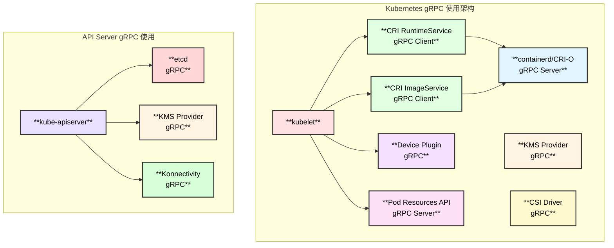
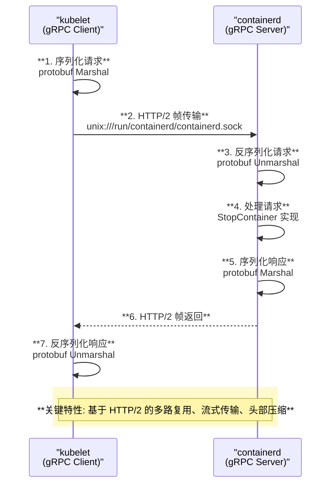

# Kubernetes 中 gRPC 的使用分析

## 目录
1. [整体架构](#整体架构)
2. [gRPC 在 K8S 中的使用场景](#grpc-在-k8s-中的使用场景)
3. [CRI gRPC 通信详解](#cri-grpc-通信详解)
4. [gRPC 原理解析](#grpc-原理解析)
5. [函数调用链](#函数调用链)

---

## 整体架构



---

## gRPC 在 K8S 中的使用场景

### 场景总览

| 场景 | 客户端 | 服务端 | 传输方式 | 源码位置 |
|:-----|:-------|:-------|:---------|:---------|
| **CRI (容器运行时接口)** | kubelet | containerd/CRI-O | Unix Socket | `pkg/kubelet/cri/remote/` |
| **etcd 存储** | kube-apiserver | etcd | TCP/TLS | `staging/src/k8s.io/apiserver/pkg/storage/` |
| **KMS 加密** | kube-apiserver | KMS Provider | Unix Socket | `staging/src/k8s.io/apiserver/pkg/storage/value/encrypt/envelope/` |
| **Device Plugin** | kubelet | Device Plugin | Unix Socket | `pkg/kubelet/cm/devicemanager/` |
| **CSI Driver** | kubelet | CSI Driver | Unix Socket | `pkg/volume/csi/` |
| **Pod Resources API** | 外部客户端 | kubelet | Unix Socket | `pkg/kubelet/apis/podresources/` |
| **Konnectivity** | kube-apiserver | Konnectivity Server | TCP/UDS | `staging/src/k8s.io/apiserver/pkg/server/egressselector/` |

---

## CRI gRPC 通信详解

### CRI 服务定义 (Protocol Buffers)

```protobuf
// 源码: staging/src/k8s.io/cri-api/pkg/apis/runtime/v1/api.proto

// RuntimeService 定义了远程容器运行时的公共 API
service RuntimeService {
    // 版本信息
    rpc Version(VersionRequest) returns (VersionResponse) {}
    
    // Pod Sandbox 管理
    rpc RunPodSandbox(RunPodSandboxRequest) returns (RunPodSandboxResponse) {}
    rpc StopPodSandbox(StopPodSandboxRequest) returns (StopPodSandboxResponse) {}
    rpc RemovePodSandbox(RemovePodSandboxRequest) returns (RemovePodSandboxResponse) {}
    rpc PodSandboxStatus(PodSandboxStatusRequest) returns (PodSandboxStatusResponse) {}
    rpc ListPodSandbox(ListPodSandboxRequest) returns (ListPodSandboxResponse) {}
    
    // 容器管理
    rpc CreateContainer(CreateContainerRequest) returns (CreateContainerResponse) {}
    rpc StartContainer(StartContainerRequest) returns (StartContainerResponse) {}
    rpc StopContainer(StopContainerRequest) returns (StopContainerResponse) {}
    rpc RemoveContainer(RemoveContainerRequest) returns (RemoveContainerResponse) {}
    rpc ListContainers(ListContainersRequest) returns (ListContainersResponse) {}
    rpc ContainerStatus(ContainerStatusRequest) returns (ContainerStatusResponse) {}
    
    // 执行命令
    rpc ExecSync(ExecSyncRequest) returns (ExecSyncResponse) {}
    rpc Exec(ExecRequest) returns (ExecResponse) {}
    rpc Attach(AttachRequest) returns (AttachResponse) {}
    rpc PortForward(PortForwardRequest) returns (PortForwardResponse) {}
    
    // 统计信息
    rpc ContainerStats(ContainerStatsRequest) returns (ContainerStatsResponse) {}
    rpc ListContainerStats(ListContainerStatsRequest) returns (ListContainerStatsResponse) {}
    
    // 运行时状态
    rpc Status(StatusRequest) returns (StatusResponse) {}
}

// ImageService 定义了镜像管理的公共 API
service ImageService {
    rpc ListImages(ListImagesRequest) returns (ListImagesResponse) {}
    rpc ImageStatus(ImageStatusRequest) returns (ImageStatusResponse) {}
    rpc PullImage(PullImageRequest) returns (PullImageResponse) {}
    rpc RemoveImage(RemoveImageRequest) returns (RemoveImageResponse) {}
    rpc ImageFsInfo(ImageFsInfoRequest) returns (ImageFsInfoResponse) {}
}
```

### gRPC 客户端初始化

```
NewRemoteRuntimeService() - pkg/kubelet/cri/remote/remote_runtime.go:79
├── 解析 endpoint (Unix Socket 路径)
│   └── util.GetAddressAndDialer() - pkg/kubelet/util/util_unix.go
│       └── 返回: addr="unix:///run/containerd/containerd.sock", dialer=unixDialer
├── 构建 gRPC DialOptions
│   └── ┌───────────────────────────┬─────────────────────────────────────────────────────────┐
│       │  选项                      │  说明                                                   │
│       ├───────────────────────────┼─────────────────────────────────────────────────────────┤
│       │  WithTransportCredentials │  insecure.NewCredentials() - 不加密(Unix Socket安全)   │
│       ├───────────────────────────┼─────────────────────────────────────────────────────────┤
│       │  WithContextDialer        │  自定义 Unix Socket dialer                             │
│       ├───────────────────────────┼─────────────────────────────────────────────────────────┤
│       │  WithDefaultCallOptions   │  MaxCallRecvMsgSize=16MB                               │
│       ├───────────────────────────┼─────────────────────────────────────────────────────────┤
│       │  WithUnaryInterceptor     │  otelgrpc.UnaryClientInterceptor (可选,追踪)           │
│       ├───────────────────────────┼─────────────────────────────────────────────────────────┤
│       │  WithStreamInterceptor    │  otelgrpc.StreamClientInterceptor (可选,追踪)          │
│       ├───────────────────────────┼─────────────────────────────────────────────────────────┤
│       │  WithConnectParams        │  Backoff: BaseDelay=100ms, MaxDelay=3s                 │
│       │                           │  MinConnectTimeout=5s                                   │
│       └───────────────────────────┴─────────────────────────────────────────────────────────┘
├── grpc.DialContext() - 建立连接
│   └── 返回 *grpc.ClientConn
├── 验证服务连接
│   └── validateServiceConnection()
│       └── runtimeClient.Version() - 验证 CRI v1 API
└── 返回 remoteRuntimeService
```

---

## gRPC 原理解析

### gRPC 通信模型



### gRPC 核心组件

```
┌─────────────────────────────────────────────────────────────────────────────────────────┐
│                              **gRPC 核心组件架构**                                        │
├─────────────────────────────────────────────────────────────────────────────────────────┤
│                                                                                         │
│  ┌───────────────────────────────────────────────────────────────────────────────────┐ │
│  │                             **Protocol Buffers (protobuf)**                       │ │
│  │                                                                                   │ │
│  │  1. **IDL (接口定义语言)**: .proto 文件定义服务和消息                             │ │
│  │  2. **代码生成**: protoc 编译器生成 Go/Java/Python 等语言代码                     │ │
│  │  3. **序列化**: 二进制格式,比 JSON 更紧凑高效                                    │ │
│  │                                                                                   │ │
│  │  K8S CRI proto 位置: staging/src/k8s.io/cri-api/pkg/apis/runtime/v1/api.proto    │ │
│  │  生成的 Go 代码: staging/src/k8s.io/cri-api/pkg/apis/runtime/v1/api.pb.go        │ │
│  └───────────────────────────────────────────────────────────────────────────────────┘ │
│                                                                                         │
│  ┌───────────────────────────────────────────────────────────────────────────────────┐ │
│  │                                 **HTTP/2 传输层**                                 │ │
│  │                                                                                   │ │
│  │  1. **多路复用**: 单连接上并发多个请求/响应流                                     │ │
│  │  2. **二进制帧**: 更高效的解析                                                   │ │
│  │  3. **头部压缩**: HPACK 算法减少带宽                                             │ │
│  │  4. **流控制**: 防止发送方压垮接收方                                             │ │
│  │  5. **服务器推送**: 主动推送资源 (gRPC 流式调用)                                  │ │
│  └───────────────────────────────────────────────────────────────────────────────────┘ │
│                                                                                         │
│  ┌───────────────────────────────────────────────────────────────────────────────────┐ │
│  │                                **gRPC 调用类型**                                  │ │
│  │                                                                                   │ │
│  │  ┌─────────────────┬─────────────────────────────────────────────────────────┐   │ │
│  │  │  类型           │  描述                                                   │   │ │
│  │  ├─────────────────┼─────────────────────────────────────────────────────────┤   │ │
│  │  │  Unary          │  一次请求一次响应 (CRI 大部分接口)                      │   │ │
│  │  ├─────────────────┼─────────────────────────────────────────────────────────┤   │ │
│  │  │  Server Stream  │  一次请求多次响应 (GetContainerEvents)                  │   │ │
│  │  ├─────────────────┼─────────────────────────────────────────────────────────┤   │ │
│  │  │  Client Stream  │  多次请求一次响应                                       │   │ │
│  │  ├─────────────────┼─────────────────────────────────────────────────────────┤   │ │
│  │  │  Bidirectional  │  双向流式 (Exec/Attach)                                 │   │ │
│  │  └─────────────────┴─────────────────────────────────────────────────────────┘   │ │
│  └───────────────────────────────────────────────────────────────────────────────────┘ │
│                                                                                         │
└─────────────────────────────────────────────────────────────────────────────────────────┘
```

### gRPC 连接管理

```go
// pkg/kubelet/cri/remote/remote_runtime.go:105-113

// 连接参数配置
connParams := grpc.ConnectParams{
    Backoff: backoff.DefaultConfig,
}
connParams.MinConnectTimeout = minConnectionTimeout  // 5秒
connParams.Backoff.BaseDelay = baseBackoffDelay      // 100毫秒
connParams.Backoff.MaxDelay = maxBackoffDelay        // 3秒

// 退避策略
// 第1次重试: 100ms * randomFactor(0.8-1.2) = 80-120ms
// 第2次重试: 200ms * randomFactor = 160-240ms
// 第3次重试: 400ms * randomFactor = 320-480ms
// ...
// 最大延迟: 3s
```

### gRPC 超时机制

```
┌─────────────────────────────────────────────────────────────────────────────────────────┐
│                              **gRPC 超时机制**                                           │
├─────────────────────────────────────────────────────────────────────────────────────────┤
│                                                                                         │
│  kubelet CRI 调用超时配置:                                                             │
│                                                                                         │
│  StopContainer() - pkg/kubelet/cri/remote/remote_runtime.go:352                        │
│  │                                                                                      │
│  ├── 计算总超时时间:                                                                   │
│  │   t := r.timeout + time.Duration(timeout)*time.Second                               │
│  │   │                                                                                  │
│  │   ├── r.timeout = 连接超时 (默认 2 分钟)                                            │
│  │   └── timeout = gracePeriod (用户指定的优雅终止时间)                                │
│  │                                                                                      │
│  └── 示例:                                                                             │
│      ┌─────────────────────┬────────────────┬────────────────┬─────────────────────┐   │
│      │  gracePeriod (秒)   │  r.timeout     │  总超时时间     │  说明               │   │
│      ├─────────────────────┼────────────────┼────────────────┼─────────────────────┤   │
│      │  30                 │  2分钟         │  2分30秒        │  默认 Pod 删除      │   │
│      ├─────────────────────┼────────────────┼────────────────┼─────────────────────┤   │
│      │  0                  │  2分钟         │  2分钟          │  强制删除           │   │
│      ├─────────────────────┼────────────────┼────────────────┼─────────────────────┤   │
│      │  300                │  2分钟         │  7分钟          │  长优雅终止期       │   │
│      └─────────────────────┴────────────────┴────────────────┴─────────────────────┘   │
│                                                                                         │
│  context.WithTimeout() 确保 gRPC 调用不会无限阻塞                                      │
│                                                                                         │
└─────────────────────────────────────────────────────────────────────────────────────────┘
```

---

## 函数调用链

### CRI StopContainer gRPC 调用链

```
kubelet.killPod() - pkg/kubelet/kubelet.go:2031
└── containerRuntime.KillPod() - pkg/kubelet/kuberuntime/kuberuntime_manager.go:1360
    └── killPodWithSyncResult() - pkg/kubelet/kuberuntime/kuberuntime_manager.go:1365
        └── killContainersWithSyncResult() - pkg/kubelet/kuberuntime/kuberuntime_container.go:762
            └── killContainer() - pkg/kubelet/kuberuntime/kuberuntime_container.go:706
                └── m.runtimeService.StopContainer() - pkg/kubelet/kuberuntime/kuberuntime_container.go:752
                    │
                    │  [进入 gRPC 客户端层]
                    │
                    └── remoteRuntimeService.StopContainer() - pkg/kubelet/cri/remote/remote_runtime.go:352
                        ├── 构建请求
                        │   └── &runtimeapi.StopContainerRequest{
                        │         ContainerId: containerID,
                        │         Timeout:     gracePeriod,  // 优雅终止时间(秒)
                        │       }
                        ├── 设置超时
                        │   └── context.WithTimeout(ctx, r.timeout + gracePeriod)
                        └── 发送 gRPC 调用
                            └── r.runtimeClient.StopContainer(ctx, request)
                                │
                                │  [gRPC 底层处理]
                                │
                                ├── protobuf 序列化请求
                                ├── HTTP/2 帧封装
                                ├── Unix Socket 传输
                                │   └── unix:///run/containerd/containerd.sock
                                │
                                │  [containerd 服务端]
                                │
                                ├── 接收 HTTP/2 帧
                                ├── protobuf 反序列化
                                └── 调用 containerd CRI 实现
                                    └── criService.StopContainer()
                                        ├── task.Kill(ctx, syscall.SIGTERM)
                                        ├── 等待 gracePeriod 秒
                                        └── [如果超时] task.Kill(ctx, syscall.SIGKILL)
```

### etcd gRPC 连接初始化

```
newETCD3Client() - staging/src/k8s.io/apiserver/pkg/storage/storagebackend/factory/etcd3.go:287
├── 构建 gRPC DialOptions
│   └── ┌───────────────────────────┬─────────────────────────────────────────────────────────┐
│       │  选项                      │  说明                                                   │
│       ├───────────────────────────┼─────────────────────────────────────────────────────────┤
│       │  WithTransportCredentials │  TLS 加密 (生产环境)                                    │
│       ├───────────────────────────┼─────────────────────────────────────────────────────────┤
│       │  WithChainUnaryInterceptor│  grpcprom.UnaryClientInterceptor (Prometheus 指标)     │
│       ├───────────────────────────┼─────────────────────────────────────────────────────────┤
│       │  WithChainStreamInterceptor│ grpcprom.StreamClientInterceptor                      │
│       ├───────────────────────────┼─────────────────────────────────────────────────────────┤
│       │  WithUnaryInterceptor     │  otelgrpc.UnaryClientInterceptor (追踪,可选)           │
│       ├───────────────────────────┼─────────────────────────────────────────────────────────┤
│       │  WithContextDialer        │  自定义 dialer (如果配置了 egressSelector)              │
│       └───────────────────────────┴─────────────────────────────────────────────────────────┘
├── 配置 etcd 客户端
│   └── clientv3.Config{
│         DialTimeout:          30s,
│         DialKeepAliveTime:    30s,
│         DialKeepAliveTimeout: 10s,
│         DialOptions:          dialOptions,
│         Endpoints:            []string{"https://etcd-1:2379", ...},
│         TLS:                  tlsConfig,
│       }
└── clientv3.New(cfg) - 创建 etcd 客户端
    └── 内部调用 grpc.Dial() 连接到 etcd 集群
```

---

## gRPC vs REST API 对比

| 特性 | gRPC | REST API |
|:-----|:-----|:---------|
| **序列化格式** | Protocol Buffers (二进制) | JSON/XML (文本) |
| **传输协议** | HTTP/2 | HTTP/1.1 (通常) |
| **性能** | 高 (紧凑二进制) | 中等 (文本解析开销) |
| **类型安全** | 强类型 (proto 定义) | 弱类型 |
| **流式传输** | 原生支持 | 需要 WebSocket/SSE |
| **浏览器支持** | 需要 grpc-web | 原生支持 |
| **调试** | 需要工具 | 简单 (curl) |

### K8S 中的选择

- **组件间通信 (低延迟要求)**: gRPC
  - kubelet ↔ containerd (CRI)
  - kube-apiserver ↔ etcd
  - kubelet ↔ Device Plugin

- **用户/客户端通信**: REST API
  - kubectl ↔ kube-apiserver
  - 外部工具 ↔ kube-apiserver

---

## 关键源码位置

| 组件 | 源码路径 | 说明 |
|:-----|:---------|:-----|
| CRI gRPC 客户端 | `pkg/kubelet/cri/remote/remote_runtime.go` | kubelet CRI 客户端实现 |
| CRI proto 定义 | `staging/src/k8s.io/cri-api/pkg/apis/runtime/v1/api.proto` | CRI 接口定义 |
| CRI 生成代码 | `staging/src/k8s.io/cri-api/pkg/apis/runtime/v1/api.pb.go` | protoc 生成 |
| etcd gRPC | `staging/src/k8s.io/apiserver/pkg/storage/storagebackend/factory/etcd3.go` | etcd 客户端 |
| KMS gRPC | `staging/src/k8s.io/apiserver/pkg/storage/value/encrypt/envelope/grpc_service.go` | KMS 客户端 |
| Pod Resources API | `pkg/kubelet/apis/podresources/client.go` | Pod 资源 API |
| Device Plugin | `pkg/kubelet/cm/devicemanager/plugin/v1beta1/client.go` | 设备插件客户端 |

---

## containerd CRI 服务端实现

containerd 实现 CRI 的关键代码路径:

```
github.com/containerd/containerd/
├── pkg/cri/server/
│   ├── container_stop.go    - StopContainer 实现
│   ├── container_remove.go  - RemoveContainer 实现
│   ├── sandbox_stop.go      - StopPodSandbox 实现
│   ├── sandbox_remove.go    - RemovePodSandbox 实现
│   └── service.go           - gRPC 服务注册
└── cmd/containerd/
    └── command/main.go      - gRPC 服务器启动
```

**containerd StopContainer 实现逻辑**:

```go
// pkg/cri/server/container_stop.go (containerd 源码)
func (c *criService) StopContainer(ctx context.Context, r *runtime.StopContainerRequest) {
    // 1. 获取容器
    container, err := c.containerStore.Get(r.GetContainerId())
    
    // 2. 获取 task (进程)
    task, err := container.Task(ctx, nil)
    
    // 3. 发送 SIGTERM
    if err := task.Kill(ctx, syscall.SIGTERM); err != nil {
        return err
    }
    
    // 4. 等待进程退出或超时
    timeout := time.Duration(r.GetTimeout()) * time.Second
    select {
    case <-time.After(timeout):
        // 5. 超时，发送 SIGKILL
        task.Kill(ctx, syscall.SIGKILL)
    case <-task.Wait(ctx):
        // 进程已退出
    }
}
```

---

*本文档分析了 Kubernetes 中 gRPC 的使用方式，包括 CRI、etcd、KMS 等场景的 gRPC 通信原理和实现细节。*

