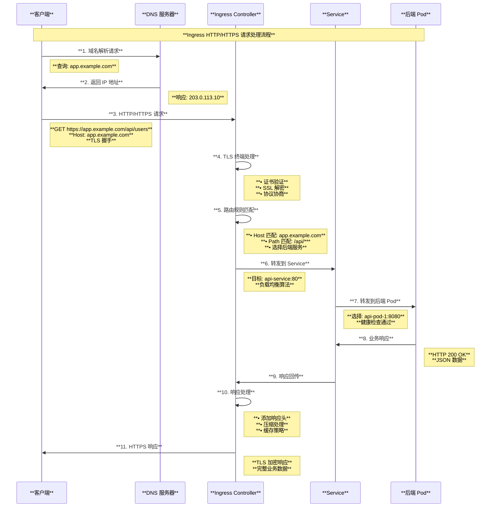
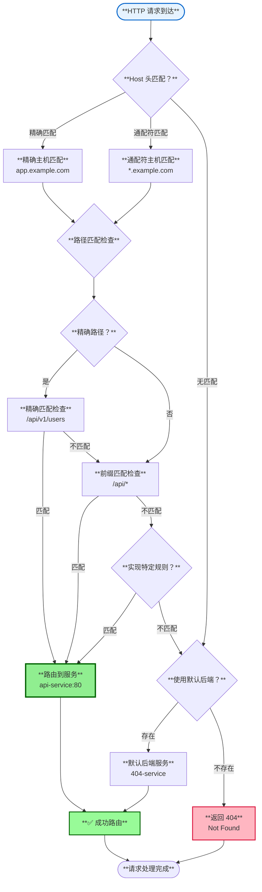

# Kubernetes Ingress 架构与原理深度解读

## 目录

1. [概述](#概述)
2. [Ingress 核心概念](#ingress-核心概念)
3. [Ingress 整体架构](#ingress-整体架构)
4. [路由规则与匹配机制](#路由规则与匹配机制)
5. [TLS 终端与证书管理](#tls-终端与证书管理)
6. [Ingress Controller 实现](#ingress-controller-实现)
7. [IngressClass 资源管理](#ingressclass-资源管理)
8. [使用场景与最佳实践](#使用场景与最佳实践)
9. [总结](#总结)

---

## 概述

Ingress 是 Kubernetes 中管理外部访问集群服务的 API 对象，特别是 HTTP 和 HTTPS 路由。Ingress 提供了负载均衡、SSL 终端和基于名称的虚拟主机等功能，是暴露 HTTP/HTTPS 服务的标准方式。本文档基于 Kubernetes 源码深入解读 Ingress 的架构设计、工作原理和实现机制。

### 核心特性

- **HTTP/HTTPS 路由**：基于主机名和路径的智能路由
- **负载均衡**：自动将流量分发到后端服务
- **SSL 终端**：处理 TLS 加密和证书管理
- **虚拟主机**：支持基于域名的多租户访问
- **可扩展性**：通过 Ingress Controller 提供不同的实现

---

## Ingress 核心概念

### 1. Ingress 资源结构

基于源码 `pkg/apis/networking/types.go`：

```go
type IngressSpec struct {
    // Ingress 类别
    IngressClassName *string
    
    // 默认后端服务
    DefaultBackend *IngressBackend
    
    // TLS 配置
    TLS []IngressTLS
    
    // 路由规则
    Rules []IngressRule
}

type IngressRule struct {
    // 主机名
    Host string
    
    // HTTP 路由规则
    IngressRuleValue
}

type HTTPIngressPath struct {
    // 路径匹配
    Path string
    
    // 路径类型：Exact、Prefix、ImplementationSpecific
    PathType *PathType
    
    // 后端服务
    Backend IngressBackend
}
```

### 2. 核心架构图

```mermaid
graph TB
    subgraph "**Ingress 架构全景**"
        style subgraph fill:#f9f9f9,stroke:#333,stroke-width:2px
        
        subgraph "**外部访问层**"
            style subgraph fill:#e6f3ff,stroke:#0066cc,stroke-width:2px
            
            INTERNET[**互联网流量**<br/>• HTTPS: app.example.com<br/>• HTTP: api.example.com<br/>• 多域名访问<br/>• SSL/TLS 加密]
            
            DNS[**DNS 解析**<br/>• 域名解析<br/>• CNAME 记录<br/>• A/AAAA 记录<br/>• 地理分布]
        end
        
        subgraph "**Ingress 控制层**"
            style subgraph fill:#fff2e6,stroke:#cc6600,stroke-width:2px
            
            INGRESS_CONTROLLER[**Ingress Controller**<br/>• NGINX/HAProxy/Traefik<br/>• 配置生成<br/>• 证书管理<br/>• 监控指标]
            
            INGRESS_RESOURCE[**Ingress 资源**<br/>• 路由规则定义<br/>• TLS 配置<br/>• 后端服务映射<br/>• 注解配置]
            
            INGRESS_CLASS[**IngressClass**<br/>• 控制器选择<br/>• 参数配置<br/>• 默认类别<br/>• 多控制器管理]
        end
        
        subgraph "**服务发现层**"
            style subgraph fill:#e6ffe6,stroke:#009900,stroke-width:2px
            
            SERVICE_MESH[**Service 网格**<br/>• ClusterIP Service<br/>• NodePort Service<br/>• 负载均衡<br/>• 健康检查]
            
            ENDPOINTS[**Endpoints**<br/>• Pod IP 列表<br/>• 端口信息<br/>• 就绪状态<br/>• 动态更新]
        end
        
        subgraph "**应用服务层**"
            style subgraph fill:#f0f8ff,stroke:#4169e1,stroke-width:2px
            
            BACKEND_APPS[**后端应用**<br/>• Web 应用<br/>• API 服务<br/>• 微服务<br/>• 数据库接口]
        end
        
        subgraph "**证书管理**"
            style subgraph fill:#ffe6f2,stroke:#cc0066,stroke-width:2px
            
            TLS_CERTS[**TLS 证书**<br/>• Let's Encrypt<br/>• 自签名证书<br/>• 商业 CA<br/>• 证书轮换]
            
            SECRET_MGMT[**Secret 管理**<br/>• TLS Secret<br/>• 证书存储<br/>• 密钥保护<br/>• 自动更新]
        end
    end
    
    INTERNET --> DNS
    DNS --> INGRESS_CONTROLLER
    INGRESS_CONTROLLER --> INGRESS_RESOURCE
    INGRESS_RESOURCE --> INGRESS_CLASS
    
    INGRESS_CONTROLLER --> SERVICE_MESH
    SERVICE_MESH --> ENDPOINTS
    ENDPOINTS --> BACKEND_APPS
    
    INGRESS_CONTROLLER --> TLS_CERTS
    TLS_CERTS --> SECRET_MGMT
    
    style INGRESS_CONTROLLER fill:#90EE90,stroke:#006400,stroke-width:3px
    style INGRESS_RESOURCE fill:#87CEEB,stroke:#4682B4,stroke-width:2px
    style TLS_CERTS fill:#DDA0DD,stroke:#8B008B,stroke-width:2px
```

---

## Ingress 整体架构

### 1. 请求处理流程图



---

## 路由规则与匹配机制

### 1. 路径匹配类型

基于源码定义：

```go
const (
    // PathTypeExact - 精确匹配
    PathTypeExact = PathType("Exact")
    
    // PathTypePrefix - 前缀匹配  
    PathTypePrefix = PathType("Prefix")
    
    // PathTypeImplementationSpecific - 实现特定
    PathTypeImplementationSpecific = PathType("ImplementationSpecific")
)
```

### 2. 路由匹配决策图



### 3. 路由优先级规则

```mermaid
graph TB
    subgraph "**Ingress 路由优先级规则**"
        style subgraph fill:#f9f9f9,stroke:#333,stroke-width:2px
        
        subgraph "**主机匹配优先级**"
            style subgraph fill:#e6f3ff,stroke:#0066cc,stroke-width:2px
            
            HOST_PRIORITY[**主机匹配优先级**<br/>**1. 精确主机名**<br/>  • app.example.com<br/>**2. 通配符主机名**<br/>  • *.example.com<br/>**3. 空主机名**<br/>  • 匹配所有主机]
        end
        
        subgraph "**路径匹配优先级**"
            style subgraph fill:#fff2e6,stroke:#cc6600,stroke-width:2px
            
            PATH_PRIORITY[**路径匹配优先级**<br/>**1. 最长前缀匹配**<br/>  • /api/v1/users > /api/v1 > /api<br/>**2. 精确匹配 > 前缀匹配**<br/>  • Exact > Prefix<br/>**3. 实现特定匹配**<br/>  • 由控制器决定]
        end
        
        subgraph "**规则排序示例**"
            style subgraph fill:#e6ffe6,stroke:#009900,stroke-width:2px
            
            RULE_EXAMPLE[**规则优先级示例**<br/>**优先级 1**: app.example.com/api/v1/users (Exact)<br/>**优先级 2**: app.example.com/api/v1/* (Prefix)<br/>**优先级 3**: app.example.com/api/* (Prefix)<br/>**优先级 4**: *.example.com/api/* (Prefix)<br/>**优先级 5**: /api/* (Prefix, 无主机限制)]
        end
        
        subgraph "**冲突解决策略**"
            style subgraph fill:#f0f8ff,stroke:#4169e1,stroke-width:2px
            
            CONFLICT_RESOLUTION[**冲突解决**<br/>**• 多个规则匹配时选择最具体的**<br/>**• 相同优先级按定义顺序**<br/>**• 控制器实现可能不同**<br/>**• 建议避免规则冲突**]
        end
    end
    
    HOST_PRIORITY --> RULE_EXAMPLE
    PATH_PRIORITY --> RULE_EXAMPLE  
    RULE_EXAMPLE --> CONFLICT_RESOLUTION
    
    style HOST_PRIORITY fill:#90EE90,stroke:#006400,stroke-width:2px
    style PATH_PRIORITY fill:#87CEEB,stroke:#4682B4,stroke-width:2px
    style RULE_EXAMPLE fill:#DDA0DD,stroke:#8B008B,stroke-width:2px
```

---

## TLS 终端与证书管理

### 1. TLS 配置结构

```yaml
apiVersion: networking.k8s.io/v1
kind: Ingress
metadata:
  name: tls-example
spec:
  tls:
  - hosts:
    - app.example.com
    - api.example.com
    secretName: tls-secret
  rules:
  - host: app.example.com
    http:
      paths:
      - path: /
        pathType: Prefix
        backend:
          service:
            name: app-service
            port:
              number: 80
```

### 2. TLS 处理流程图

```mermaid
graph TB
    subgraph "**TLS 终端处理流程**"
        style subgraph fill:#f9f9f9,stroke:#333,stroke-width:2px
        
        subgraph "**证书准备阶段**"
            style subgraph fill:#e6f3ff,stroke:#0066cc,stroke-width:2px
            
            CERT_SOURCE[**证书来源**<br/>• Let's Encrypt<br/>• 商业 CA<br/>• 自签名证书<br/>• 企业 PKI]
            
            SECRET_CREATE[**Secret 创建**<br/>• TLS 类型 Secret<br/>• 证书数据存储<br/>• 私钥保护<br/>• Base64 编码]
        end
        
        subgraph "**TLS 握手阶段**"
            style subgraph fill:#fff2e6,stroke:#cc6600,stroke-width:2px
            
            CLIENT_HELLO[**1. Client Hello**<br/>• 支持的密码套件<br/>• TLS 版本<br/>• 随机数<br/>• SNI 扩展]
            
            SERVER_HELLO[**2. Server Hello**<br/>• 选择密码套件<br/>• TLS 版本确认<br/>• 服务器随机数<br/>• 证书发送]
            
            KEY_EXCHANGE[**3. 密钥交换**<br/>• 客户端密钥交换<br/>• 密码变更<br/>• 完成消息<br/>• 应用数据]
        end
        
        subgraph "**证书验证阶段**"
            style subgraph fill:#e6ffe6,stroke:#009900,stroke-width:2px
            
            CERT_VALIDATION[**证书验证**<br/>• 证书链验证<br/>• 域名匹配<br/>• 有效期检查<br/>• 撤销状态检查]
            
            SNI_PROCESSING[**SNI 处理**<br/>• 主机名提取<br/>• 证书选择<br/>• 多证书支持<br/>• 通配符匹配]
        end
        
        subgraph "**数据传输阶段**"
            style subgraph fill:#f0f8ff,stroke:#4169e1,stroke-width:2px
            
            DECRYPTION[**数据解密**<br/>• TLS 解密<br/>• 完整性验证<br/>• HTTP 提取<br/>• 会话复用]
            
            ENCRYPTION[**响应加密**<br/>• HTTP 响应<br/>• TLS 加密<br/>• 完整性保护<br/>• 客户端发送]
        end
    end
    
    CERT_SOURCE --> SECRET_CREATE
    SECRET_CREATE --> CLIENT_HELLO
    CLIENT_HELLO --> SERVER_HELLO
    SERVER_HELLO --> KEY_EXCHANGE
    
    SERVER_HELLO --> CERT_VALIDATION
    CERT_VALIDATION --> SNI_PROCESSING
    SNI_PROCESSING --> KEY_EXCHANGE
    
    KEY_EXCHANGE --> DECRYPTION
    DECRYPTION --> ENCRYPTION
    
    style CERT_SOURCE fill:#90EE90,stroke:#006400,stroke-width:2px
    style CLIENT_HELLO fill:#87CEEB,stroke:#4682B4,stroke-width:2px
    style CERT_VALIDATION fill:#DDA0DD,stroke:#8B008B,stroke-width:2px
    style DECRYPTION fill:#98FB98,stroke:#006400,stroke-width:2px
```

---

## Ingress Controller 实现

### 1. 主流控制器对比

```mermaid
graph TB
    subgraph "**Ingress Controller 生态对比**"
        style subgraph fill:#f9f9f9,stroke:#333,stroke-width:2px
        
        subgraph "**NGINX Ingress Controller**"
            style subgraph fill:#e6f3ff,stroke:#0066cc,stroke-width:2px
            
            NGINX_FEATURES[**NGINX 特性**<br/>• **性能**: 高性能反向代理<br/>• **功能**: 丰富的注解支持<br/>• **社区**: 活跃的社区<br/>• **生态**: 成熟的生态系统]
            
            NGINX_USE_CASES[**适用场景**<br/>• 高流量 Web 应用<br/>• 复杂路由需求<br/>• SSL 终端卸载<br/>• 静态资源服务]
        end
        
        subgraph "**HAProxy Ingress**"
            style subgraph fill:#fff2e6,stroke:#cc6600,stroke-width:2px
            
            HAPROXY_FEATURES[**HAProxy 特性**<br/>• **负载均衡**: 企业级负载均衡<br/>• **统计**: 详细的统计信息<br/>• **健康检查**: 高级健康检查<br/>• **性能**: 极高的并发性能]
            
            HAPROXY_USE_CASES[**适用场景**<br/>• 企业级应用<br/>• 高并发场景<br/>• 复杂负载均衡<br/>• 统计监控需求]
        end
        
        subgraph "**Traefik**"
            style subgraph fill:#e6ffe6,stroke:#009900,stroke-width:2px
            
            TRAEFIK_FEATURES[**Traefik 特性**<br/>• **自动发现**: 自动服务发现<br/>• **动态配置**: 零宕机配置更新<br/>• **监控**: 内置监控仪表板<br/>• **协议**: 多协议支持]
            
            TRAEFIK_USE_CASES[**适用场景**<br/>• 微服务架构<br/>• 容器化环境<br/>• 动态配置需求<br/>• 现代应用栈]
        end
        
        subgraph "**云厂商控制器**"
            style subgraph fill:#f0f8ff,stroke:#4169e1,stroke-width:2px
            
            CLOUD_FEATURES[**云原生特性**<br/>• **集成**: 深度云服务集成<br/>• **管理**: 托管服务<br/>• **扩展**: 自动扩展<br/>• **安全**: 云安全集成]
            
            CLOUD_EXAMPLES[**主要实现**<br/>• AWS ALB Ingress<br/>• GCP Ingress<br/>• Azure Application Gateway<br/>• 阿里云 SLB]
        end
        
        subgraph "**选择决策矩阵**"
            style subgraph fill:#ffe6f2,stroke:#cc0066,stroke-width:2px
            
            DECISION_MATRIX[**选择建议**<br/>**高性能需求**: NGINX/HAProxy<br/>**企业级特性**: HAProxy<br/>**云环境**: 云厂商控制器<br/>**微服务**: Traefik<br/>**通用场景**: NGINX<br/>**简单部署**: Traefik]
        end
    end
    
    NGINX_FEATURES --> NGINX_USE_CASES
    HAPROXY_FEATURES --> HAPROXY_USE_CASES
    TRAEFIK_FEATURES --> TRAEFIK_USE_CASES
    CLOUD_FEATURES --> CLOUD_EXAMPLES
    
    NGINX_USE_CASES --> DECISION_MATRIX
    HAPROXY_USE_CASES --> DECISION_MATRIX
    TRAEFIK_USE_CASES --> DECISION_MATRIX
    CLOUD_EXAMPLES --> DECISION_MATRIX
    
    style NGINX_FEATURES fill:#90EE90,stroke:#006400,stroke-width:2px
    style HAPROXY_FEATURES fill:#87CEEB,stroke:#4682B4,stroke-width:2px
    style TRAEFIK_FEATURES fill:#DDA0DD,stroke:#8B008B,stroke-width:2px
    style CLOUD_FEATURES fill:#98FB98,stroke:#006400,stroke-width:2px
```

---

## IngressClass 资源管理

### 1. IngressClass 配置

```yaml
apiVersion: networking.k8s.io/v1
kind: IngressClass
metadata:
  name: nginx
  annotations:
    ingressclass.kubernetes.io/is-default-class: "true"
spec:
  controller: k8s.io/ingress-nginx
  parameters:
    apiGroup: k8s.io
    kind: ConfigMap
    name: nginx-configuration
```

### 2. 多控制器管理架构

```mermaid
graph TB
    subgraph "**多 Ingress Controller 管理架构**"
        style subgraph fill:#f9f9f9,stroke:#333,stroke-width:2px
        
        subgraph "**IngressClass 管理层**"
            style subgraph fill:#e6f3ff,stroke:#0066cc,stroke-width:2px
            
            DEFAULT_CLASS[**默认 IngressClass**<br/>• nginx (is-default-class)<br/>• 自动选择<br/>• 向下兼容<br/>• 集群默认]
            
            CUSTOM_CLASSES[**自定义 IngressClass**<br/>• traefik-public<br/>• haproxy-internal<br/>• alb-external<br/>• 特定用途]
        end
        
        subgraph "**控制器实例**"
            style subgraph fill:#fff2e6,stroke:#cc6600,stroke-width:2px
            
            NGINX_CTRL[**NGINX Controller**<br/>• Class: nginx<br/>• 命名空间: nginx-system<br/>• 监听端口: 80/443<br/>• 配置: nginx-configmap]
            
            TRAEFIK_CTRL[**Traefik Controller**<br/>• Class: traefik-public<br/>• 命名空间: traefik-system<br/>• 监听端口: 8080/8443<br/>• 配置: traefik-config]
            
            HAPROXY_CTRL[**HAProxy Controller**<br/>• Class: haproxy-internal<br/>• 命名空间: haproxy-system<br/>• 监听端口: 80/443<br/>• 配置: haproxy-configmap]
        end
        
        subgraph "**Ingress 资源分配**"
            style subgraph fill:#e6ffe6,stroke:#009900,stroke-width:2px
            
            PUBLIC_INGRESS[**公网 Ingress**<br/>• ingressClassName: nginx<br/>• 公网域名<br/>• SSL 证书<br/>• 高可用]
            
            INTERNAL_INGRESS[**内网 Ingress**<br/>• ingressClassName: haproxy-internal<br/>• 内网域名<br/>• 企业 CA<br/>• 安全加固]
            
            LEGACY_INGRESS[**遗留 Ingress**<br/>• 无 ingressClassName<br/>• 使用默认控制器<br/>• 注解兼容<br/>• 逐步迁移]
        end
        
        subgraph "**服务暴露策略**"
            style subgraph fill:#f0f8ff,stroke:#4169e1,stroke-width:2px
            
            LOAD_BALANCER[**LoadBalancer Service**<br/>• 云负载均衡器<br/>• 外部 IP 分配<br/>• 多可用区<br/>• 健康检查]
            
            NODE_PORT[**NodePort Service**<br/>• 节点端口暴露<br/>• 内部网络访问<br/>• 防火墙配置<br/>• 端口管理]
        end
    end
    
    DEFAULT_CLASS --> NGINX_CTRL
    CUSTOM_CLASSES --> TRAEFIK_CTRL
    CUSTOM_CLASSES --> HAPROXY_CTRL
    
    NGINX_CTRL --> PUBLIC_INGRESS
    HAPROXY_CTRL --> INTERNAL_INGRESS
    DEFAULT_CLASS --> LEGACY_INGRESS
    
    NGINX_CTRL --> LOAD_BALANCER
    HAPROXY_CTRL --> NODE_PORT
    
    style DEFAULT_CLASS fill:#90EE90,stroke:#006400,stroke-width:2px
    style NGINX_CTRL fill:#87CEEB,stroke:#4682B4,stroke-width:2px
    style PUBLIC_INGRESS fill:#DDA0DD,stroke:#8B008B,stroke-width:2px
    style LOAD_BALANCER fill:#98FB98,stroke:#006400,stroke-width:2px
```

---

## 使用场景与最佳实践

### 1. 典型使用场景

#### **Web 应用暴露**
```yaml
apiVersion: networking.k8s.io/v1
kind: Ingress
metadata:
  name: web-app
  annotations:
    nginx.ingress.kubernetes.io/rewrite-target: /
spec:
  ingressClassName: nginx
  tls:
  - hosts:
    - app.example.com
    secretName: app-tls
  rules:
  - host: app.example.com
    http:
      paths:
      - path: /
        pathType: Prefix
        backend:
          service:
            name: web-service
            port:
              number: 80
```

#### **API 服务网关**
```yaml
apiVersion: networking.k8s.io/v1
kind: Ingress
metadata:
  name: api-gateway
  annotations:
    nginx.ingress.kubernetes.io/cors-allow-origin: "*"
    nginx.ingress.kubernetes.io/rate-limiting: "100"
spec:
  ingressClassName: nginx
  rules:
  - host: api.example.com
    http:
      paths:
      - path: /v1
        pathType: Prefix
        backend:
          service:
            name: api-v1-service
            port:
              number: 8080
      - path: /v2
        pathType: Prefix
        backend:
          service:
            name: api-v2-service
            port:
              number: 8080
```

### 2. 最佳实践建议

```mermaid
graph TB
    subgraph "**Ingress 最佳实践**"
        style subgraph fill:#f9f9f9,stroke:#333,stroke-width:2px
        
        subgraph "**安全实践**"
            style subgraph fill:#e6f3ff,stroke:#0066cc,stroke-width:2px
            
            SECURITY[**安全配置**<br/>• **HTTPS 强制**: 重定向 HTTP<br/>• **HSTS**: 启用严格传输安全<br/>• **证书管理**: 自动续期<br/>• **访问控制**: IP 白名单]
        end
        
        subgraph "**性能优化**"
            style subgraph fill:#fff2e6,stroke:#cc6600,stroke-width:2px
            
            PERFORMANCE[**性能调优**<br/>• **连接复用**: Keep-alive<br/>• **压缩**: Gzip/Brotli<br/>• **缓存**: 静态资源缓存<br/>• **限流**: 请求速率限制]
        end
        
        subgraph "**监控观察**"
            style subgraph fill:#e6ffe6,stroke:#009900,stroke-width:2px
            
            MONITORING[**监控配置**<br/>• **指标**: Prometheus 监控<br/>• **日志**: 访问日志收集<br/>• **追踪**: 分布式追踪<br/>• **告警**: 异常告警]
        end
        
        subgraph "**运维管理**"
            style subgraph fill:#f0f8ff,stroke:#4169e1,stroke-width:2px
            
            OPERATIONS[**运维实践**<br/>• **蓝绿部署**: 零宕机发布<br/>• **金丝雀**: 渐进式发布<br/>• **备份**: 配置备份<br/>• **灾备**: 多区域部署]
        end
    end
    
    style SECURITY fill:#90EE90,stroke:#006400,stroke-width:2px
    style PERFORMANCE fill:#87CEEB,stroke:#4682B4,stroke-width:2px
    style MONITORING fill:#DDA0DD,stroke:#8B008B,stroke-width:2px
    style OPERATIONS fill:#98FB98,stroke:#006400,stroke-width:2px
```

---

## 总结

Ingress 是 Kubernetes 中 HTTP/HTTPS 服务暴露的标准方式，它提供了灵活的路由规则、SSL 终端、负载均衡等关键功能。通过 Ingress Controller 的实现，Ingress 能够适应不同的技术栈和业务需求。

### 核心价值

1. **统一入口**：为集群提供统一的 HTTP/HTTPS 入口
2. **智能路由**：基于域名和路径的灵活路由规则
3. **SSL 终端**：集中化的 TLS 证书管理和加密处理
4. **负载均衡**：自动的流量分发和故障转移
5. **可扩展性**：通过不同控制器实现满足各种需求

### 技术特点

- **声明式配置**：通过 YAML 定义路由规则和 TLS 配置
- **控制器生态**：丰富的 Ingress Controller 实现
- **多租户支持**：IngressClass 实现多控制器管理
- **云原生集成**：与云服务商负载均衡器深度集成
- **安全加固**：支持各种安全策略和访问控制

Ingress 是现代云原生应用架构中不可或缺的组件，它简化了服务暴露的复杂性，提供了企业级的网关功能。

