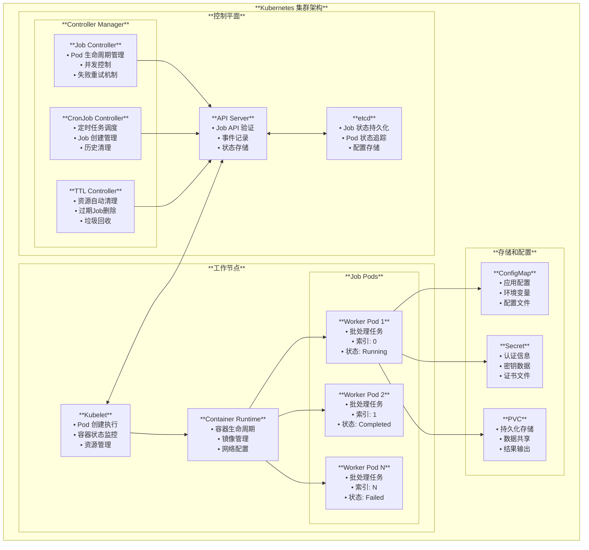
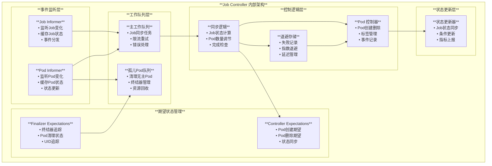
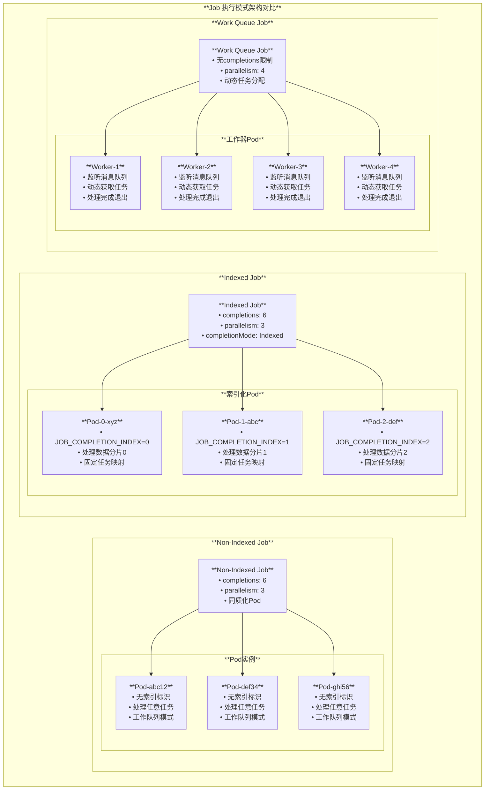
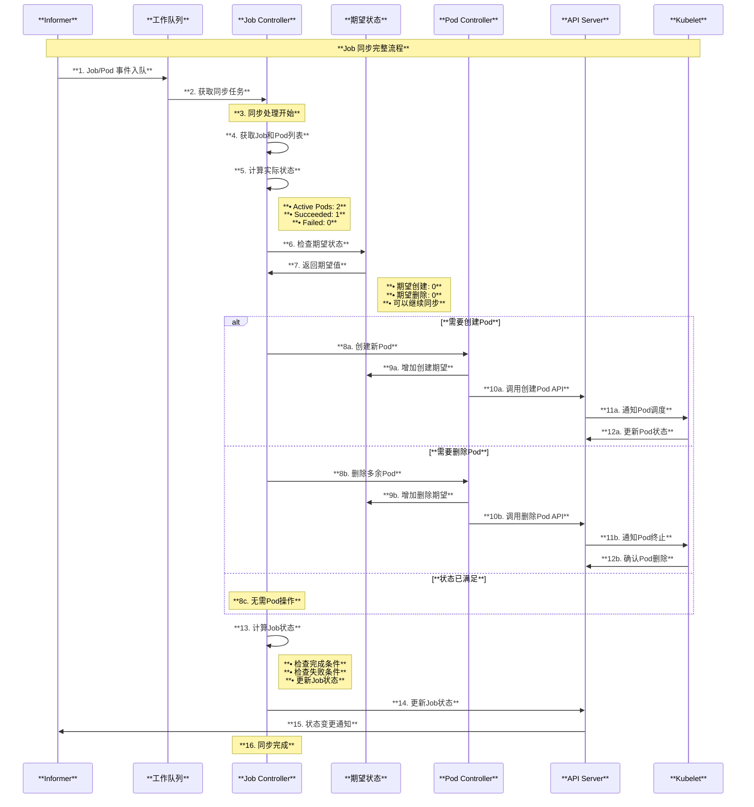
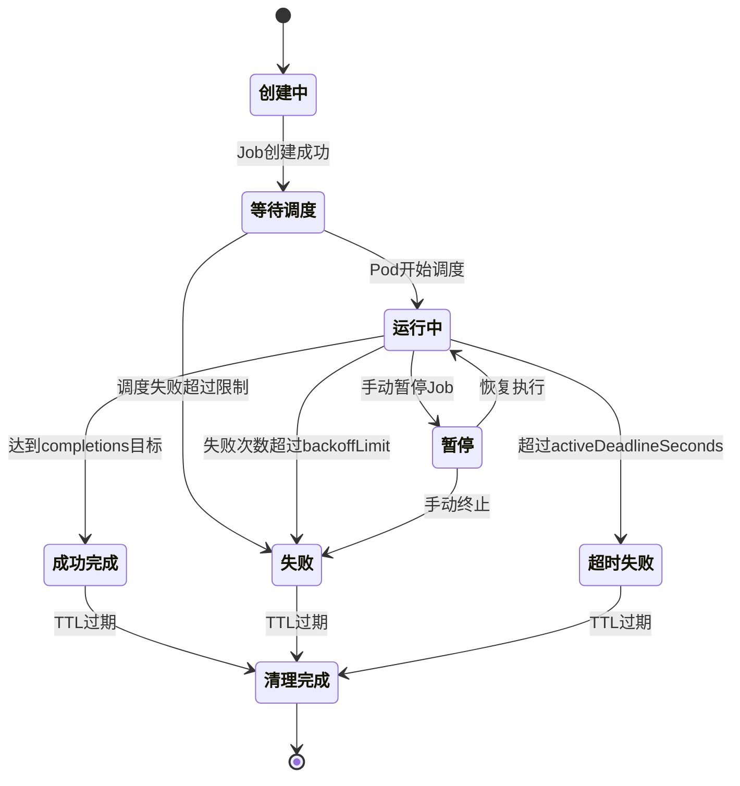
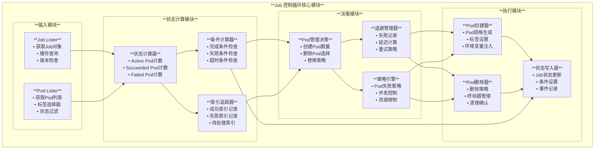

# Kubernetes Job 控制器架构与原理深度解读

## 目录

1. [概述](#概述)
2. [Job 核心概念](#job-核心概念)
3. [Job 控制器整体架构](#job-控制器整体架构)
4. [Job 控制器实现原理](#job-控制器实现原理)
5. [Job 生命周期管理](#job-生命周期管理)
6. [Job 执行模式详解](#job-执行模式详解)
7. [失败处理与重试策略](#失败处理与重试策略)
8. [Job 配置与调优](#job-配置与调优)
9. [CronJob 集成](#cronjob-集成)
10. [监控与故障排除](#监控与故障排除)
11. [最佳实践](#最佳实践)
12. [总结](#总结)

---

## 概述

Kubernetes Job 控制器是用于管理批处理工作负载的核心组件。它确保一个或多个 Pod 成功运行完成指定的任务。Job 控制器支持多种执行模式，包括单次执行、并行执行和索引化执行，并提供了完善的失败处理和重试机制。本文档基于 Kubernetes 源码深入分析 Job 控制器的完整架构和实现原理。

### 核心特性

- **批处理工作负载管理**：专门处理有限时间内完成的任务
- **多种执行模式**：支持单一、并行、索引化等执行模式
- **失败容错机制**：提供重试、退避、失败策略等容错功能
- **资源管理优化**：自动清理和资源回收机制

---

## Job 核心概念

### 1. Job 控制器核心结构

基于源码 `pkg/controller/job/job_controller.go`：

```go
// Controller 确保所有 Job 对象都有相应的 Pod 来运行其配置的工作负载
type Controller struct {
    kubeClient clientset.Interface
    podControl controller.PodControlInterface

    // 测试注入的处理函数
    updateStatusHandler func(ctx context.Context, job *batch.Job) (*batch.Job, error)
    patchJobHandler     func(ctx context.Context, job *batch.Job, patch []byte) error
    syncHandler         func(ctx context.Context, jobKey string) error
    
    // Pod 存储同步状态检查
    podStoreSynced cache.InformerSynced
    // Job 存储同步状态检查
    jobStoreSynced cache.InformerSynced

    // 控制器期望缓存 - 用于追踪 Pod 创建/删除期望
    expectations controller.ControllerExpectationsInterface

    // 终结器期望 - 追踪等待移除跟踪终结器的 Pod UID
    finalizerExpectations *uidTrackingExpectations

    // Job 存储
    jobLister batchv1listers.JobLister

    // Pod 存储
    podStore corelisters.PodLister

    // 需要更新的 Job 队列
    queue workqueue.RateLimitingInterface

    // 需要移除终结器的孤立 Pod 队列
    orphanQueue workqueue.RateLimitingInterface

    broadcaster record.EventBroadcaster
    recorder    record.EventRecorder

    clock clock.WithTicker

    // 存储 Pod 失败时计算指数退避延迟的信息
    podBackoffStore *backoffStore
}
```

### 2. Job 同步上下文

```go
// syncJobCtx 包含同步 Job 时的上下文信息
type syncJobCtx struct {
    job                             *batch.Job
    pods                            []*v1.Pod
    finishedCondition               *batch.JobCondition
    activePods                      []*v1.Pod
    succeeded                       int32
    prevSucceededIndexes            orderedIntervals
    succeededIndexes                orderedIntervals
    failedIndexes                   *orderedIntervals
    newBackoffRecord                backoffRecord
    expectedRmFinalizers            sets.Set[string]
    uncounted                       *uncountedTerminatedPods
    podsWithDelayedDeletionPerIndex map[int]*v1.Pod
    terminating                     *int32
}
```

### 3. Job 类型定义

基于源码 `pkg/apis/batch/types.go`：

```go
// Job 代表单个作业的配置
type Job struct {
    metav1.TypeMeta
    // 标准对象元数据
    metav1.ObjectMeta

    // Job 期望行为的规格
    Spec JobSpec

    // Job 当前状态
    Status JobStatus
}

// JobSpec 描述 Job 的规格
type JobSpec struct {
    // 指定并行运行的 Pod 数量，默认为 1
    Parallelism *int32

    // 指定成功完成的 Pod 数量，默认为 1
    Completions *int32

    // 指定 Job 标记为失败前的重试次数，默认为 6
    BackoffLimit *int32

    // 指定 Job 被终止前的最大运行时间（秒）
    ActiveDeadlineSeconds *int64

    // 指定 Pod 失败策略
    PodFailurePolicy *PodFailurePolicy

    // 指定完成模式
    CompletionMode *CompletionMode

    // Pod 模板
    Template v1.PodTemplateSpec

    // 手动选择器
    ManualSelector *bool
    Selector       *metav1.LabelSelector
}
```

### 4. 完成模式定义

```go
// CompletionMode 指定如何跟踪 Job 的 Pod 完成情况
type CompletionMode string

const (
    // NonIndexedCompletion 是 Job 完成模式
    // 在此模式下，当有 .spec.completions 个 Pod 成功完成时，Job 被认为完成
    // Pod 完成情况是同质的
    NonIndexedCompletion CompletionMode = "NonIndexed"

    // IndexedCompletion 是 Job 完成模式  
    // 在此模式下，Job 的 Pod 获得从 0 到 (.spec.completions - 1) 的关联完成索引
    // 当每个完成索引都有一个 Pod 完成时，Job 被认为完成
    IndexedCompletion CompletionMode = "Indexed"
)
```

---

## Job 控制器整体架构

### 1. 系统架构全景图



### 2. Job 控制器内部架构



### 3. 执行模式架构对比



上述架构图展示了 Job 控制器在 Kubernetes 集群中的完整架构，包括：

1. **系统架构**：控制平面组件、工作节点、存储配置的完整交互关系
2. **内部架构**：Job Controller 内部的事件监听、队列管理、期望状态、控制逻辑等模块
3. **执行模式**：Non-Indexed、Indexed、Work Queue 等不同执行模式的架构差异

---

## Job 控制器实现原理

### 1. 控制器初始化

```go
// NewController 创建新的 Job 控制器
func NewController(ctx context.Context, podInformer coreinformers.PodInformer, jobInformer batchinformers.JobInformer, kubeClient clientset.Interface) (*Controller, error) {
    return newControllerWithClock(ctx, podInformer, jobInformer, kubeClient, &clock.RealClock{})
}

func newControllerWithClock(ctx context.Context, podInformer coreinformers.PodInformer, jobInformer batchinformers.JobInformer, kubeClient clientset.Interface, clock clock.WithTicker) (*Controller, error) {
    eventBroadcaster := record.NewBroadcaster()
    
    jm := &Controller{
        kubeClient: kubeClient,
        podControl: controller.RealPodControl{
            KubeClient: kubeClient,
            Recorder:   eventBroadcaster.NewRecorder(scheme.Scheme, v1.EventSource{Component: "job-controller"}),
        },
        expectations:          controller.NewControllerExpectations(),
        finalizerExpectations: newUIDTrackingExpectations(),
        queue:                 workqueue.NewNamedRateLimitingQueue(workqueue.NewItemExponentialFailureRateLimiter(DefaultJobApiBackOff, MaxJobApiBackOff), "job"),
        orphanQueue:           workqueue.NewNamedRateLimitingQueue(workqueue.NewItemExponentialFailureRateLimiter(DefaultJobApiBackOff, MaxJobApiBackOff), "orphan_job"),
        broadcaster:           eventBroadcaster,
        recorder:              eventBroadcaster.NewRecorder(scheme.Scheme, v1.EventSource{Component: "job-controller"}),
        clock:                 clock,
        podBackoffStore:       newBackoffStore(),
    }
    
    // 设置 Job Informer 事件处理
    jobInformer.Informer().AddEventHandler(cache.ResourceEventHandlerFuncs{
        AddFunc:    jm.addJob,
        UpdateFunc: jm.updateJob,
        DeleteFunc: jm.deleteJob,
    })
    jm.jobLister = jobInformer.Lister()
    jm.jobStoreSynced = jobInformer.Informer().HasSynced
    
    // 设置 Pod Informer 事件处理
    podInformer.Informer().AddEventHandler(cache.ResourceEventHandlerFuncs{
        AddFunc:    jm.addPod,
        UpdateFunc: jm.updatePod,
        DeleteFunc: jm.deletePod,
    })
    jm.podStore = podInformer.Lister()
    jm.podStoreSynced = podInformer.Informer().HasSynced
    
    return jm, nil
}
```

### 2. 控制器主循环

```go
// Run 启动 Job 控制器
func (jm *Controller) Run(ctx context.Context, workers int) {
    defer utilruntime.HandleCrash()
    defer jm.queue.ShutDown()
    defer jm.orphanQueue.ShutDown()

    klog.Infof("Starting job controller")
    defer klog.Infof("Shutting down job controller")

    if !cache.WaitForNamedCacheSync("job", ctx.Done(), jm.podStoreSynced, jm.jobStoreSynced) {
        return
    }

    for i := 0; i < workers; i++ {
        go wait.UntilWithContext(ctx, jm.worker, time.Second)
    }
    go wait.UntilWithContext(ctx, jm.orphanWorker, time.Second)

    <-ctx.Done()
}

// worker 处理工作队列中的项目
func (jm *Controller) worker(ctx context.Context) {
    for jm.processNextWorkItem(ctx) {
    }
}

func (jm *Controller) processNextWorkItem(ctx context.Context) bool {
    key, quit := jm.queue.Get()
    if quit {
        return false
    }
    defer jm.queue.Done(key)

    forget, err := jm.syncHandler(ctx, key.(string))
    if err == nil {
        if forget {
            jm.queue.Forget(key)
        }
        return true
    }

    utilruntime.HandleError(fmt.Errorf("error syncing job: %v", err))
    jm.queue.AddRateLimited(key)

    return true
}
```

### 3. Job 同步流程时序图



### 4. Job 状态转换图



### 5. Job 同步处理源码分析

```go
// syncJob 同步单个 Job
func (jm *Controller) syncJob(ctx context.Context, key string) (forget bool, rErr error) {
    startTime := jm.clock.Now()
    defer func() {
        klog.V(4).Infof("Finished syncing job %q (%v)", key, jm.clock.Since(startTime))
    }()

    namespace, name, err := cache.SplitMetaNamespaceKey(key)
    if err != nil {
        return false, err
    }

    sharedJob, err := jm.jobLister.Jobs(namespace).Get(name)
    if err != nil {
        if apierrors.IsNotFound(err) {
            klog.V(4).Infof("Job has been deleted: %v", key)
            jm.expectations.DeleteExpectations(key)
            return true, nil
        }
        return false, err
    }

    // 深拷贝以避免修改共享对象
    job := sharedJob.DeepCopy()
    
    // 检查 Job 是否已完成
    if IsJobFinished(job) {
        return true, jm.cleanupJob(ctx, job)
    }

    // 获取与此 Job 相关的 Pod
    pods, err := jm.getPodsForJob(ctx, job)
    if err != nil {
        return false, err
    }

    // 构建同步上下文
    syncCtx := &syncJobCtx{
        job:  job,
        pods: pods,
    }

    // 执行 Job 同步逻辑
    return true, jm.syncJobWithContext(ctx, syncCtx)
}
```

### 6. Job 控制循环模块交互图



---

## Job 生命周期管理

### 1. Job 创建和初始化

```go
// manageJob 管理 Job 的执行
func (jm *Controller) manageJob(ctx context.Context, job *batch.Job, pods []*v1.Pod) (int32, error) {
    active := int32(len(pods))
    parallelism := job.Spec.Parallelism
    if parallelism == nil {
        parallelism = &DefaultParallelism
    }

    // 计算需要创建的 Pod 数量
    wantActive := int32(0)
    if job.Spec.Completions == nil {
        // Work queue 模式
        if active < *parallelism {
            wantActive = *parallelism
        }
    } else {
        // 固定完成数模式
        succeededPods := filterPods(pods, func(p *v1.Pod) bool {
            return p.Status.Phase == v1.PodSucceeded
        })
        succeeded := int32(len(succeededPods))
        
        if succeeded < *job.Spec.Completions && active < *parallelism {
            diff := *job.Spec.Completions - succeeded
            if diff < *parallelism {
                wantActive = active + diff
            } else {
                wantActive = active + *parallelism
            }
        }
    }

    // 创建或删除 Pod
    if wantActive > active {
        diff := wantActive - active
        if diff > int32(MaxPodCreateDeletePerSync) {
            diff = int32(MaxPodCreateDeletePerSync)
        }
        
        // 创建 Pod
        for i := int32(0); i < diff; i++ {
            if err := jm.createPod(ctx, job); err != nil {
                return active, err
            }
        }
    } else if wantActive < active {
        diff := active - wantActive
        if diff > int32(MaxPodCreateDeletePerSync) {
            diff = int32(MaxPodCreateDeletePerSync)
        }
        
        // 删除多余的 Pod
        podsToDelete := getPodsToDelete(pods, int(diff))
        for _, pod := range podsToDelete {
            if err := jm.deletePod(ctx, pod); err != nil {
                return active, err
            }
        }
    }

    return active, nil
}
```

### 2. Pod 状态跟踪

```go
// getStatus 计算 Job 的当前状态
func getStatus(pods []*v1.Pod, job *batch.Job, uncounted *uncountedTerminatedPods) (int32, int32, int32, []*v1.Pod) {
    var active, succeeded, failed int32
    var activePods []*v1.Pod

    for _, pod := range pods {
        phase := pod.Status.Phase
        if phase == v1.PodPending || phase == v1.PodRunning {
            active++
            activePods = append(activePods, pod)
        } else if phase == v1.PodSucceeded {
            // 检查是否在 uncounted 中
            if !uncounted.succeeded.Has(string(pod.UID)) {
                succeeded++
            }
        } else if phase == v1.PodFailed {
            // 检查是否在 uncounted 中
            if !uncounted.failed.Has(string(pod.UID)) {
                failed++
            }
        }
    }

    return active, succeeded, failed, activePods
}

// updateJobStatus 更新 Job 状态
func (jm *Controller) updateJobStatus(ctx context.Context, job *batch.Job, active, succeeded, failed int32, finishedCond *batch.JobCondition) error {
    job.Status.Active = active
    job.Status.Succeeded = succeeded
    job.Status.Failed = failed

    if finishedCond != nil {
        job.Status.Conditions = append(job.Status.Conditions, *finishedCond)
        if finishedCond.Type == batch.JobComplete {
            job.Status.CompletionTime = &finishedCond.LastTransitionTime
        }
    }

    _, err := jm.kubeClient.BatchV1().Jobs(job.Namespace).UpdateStatus(ctx, job, metav1.UpdateOptions{})
    return err
}
```

### 3. Job 完成检查

```go
// isJobComplete 检查 Job 是否完成
func isJobComplete(job *batch.Job, succeeded int32) bool {
    if job.Spec.Completions == nil {
        return false // Work queue 作业永远不会自动完成
    }
    
    return succeeded >= *job.Spec.Completions
}

// isJobFailed 检查 Job 是否失败
func isJobFailed(job *batch.Job, failed int32) bool {
    if job.Spec.BackoffLimit == nil {
        return false
    }
    
    return failed > *job.Spec.BackoffLimit
}

// IsJobFinished 检查 Job 是否已结束
func IsJobFinished(j *batch.Job) bool {
    for _, c := range j.Status.Conditions {
        if (c.Type == batch.JobComplete || c.Type == batch.JobFailed) && c.Status == v1.ConditionTrue {
            return true
        }
    }
    return false
}
```

---

## Job 执行模式详解

### 1. Non-Indexed Job (非索引作业)

Non-Indexed Job 是最常见的执行模式，Pod 之间是同质的：

```yaml
apiVersion: batch/v1
kind: Job
metadata:
  name: non-indexed-job
spec:
  parallelism: 3          # 并行运行 3 个 Pod
  completions: 6          # 总共需要 6 个 Pod 成功完成
  backoffLimit: 2         # 最多重试 2 次
  template:
    spec:
      containers:
      - name: worker
        image: busybox
        command: ["sh", "-c", "echo 'Processing item'; sleep 30; echo 'Done'"]
      restartPolicy: Never
```

**特点**：
- Pod 没有唯一标识符
- 所有 Pod 执行相同的任务
- 适合处理工作队列模式

### 2. Indexed Job (索引作业)

Indexed Job 为每个 Pod 分配唯一索引：

```yaml
apiVersion: batch/v1
kind: Job
metadata:
  name: indexed-job
spec:
  parallelism: 2          # 并行运行 2 个 Pod
  completions: 5          # 需要索引 0-4 的 Pod 各完成一次
  completionMode: Indexed # 启用索引模式
  backoffLimit: 3
  template:
    spec:
      containers:
      - name: worker
        image: busybox
        command: 
        - sh
        - -c
        - |
          echo "Processing item with index: $JOB_COMPLETION_INDEX"
          # 基于索引处理不同的数据片段
          sleep $((10 + $JOB_COMPLETION_INDEX * 5))
          echo "Completed index: $JOB_COMPLETION_INDEX"
      restartPolicy: Never
```

**实现原理**：

```go
// 为 Indexed Job 设置环境变量
func setIndexedJobEnvironment(pod *v1.Pod, index int) {
    for i := range pod.Spec.Containers {
        pod.Spec.Containers[i].Env = append(pod.Spec.Containers[i].Env, v1.EnvVar{
            Name:  "JOB_COMPLETION_INDEX",
            Value: strconv.Itoa(index),
        })
    }
    
    for i := range pod.Spec.InitContainers {
        pod.Spec.InitContainers[i].Env = append(pod.Spec.InitContainers[i].Env, v1.EnvVar{
            Name:  "JOB_COMPLETION_INDEX", 
            Value: strconv.Itoa(index),
        })
    }
}

// 生成带索引的 Pod 名称
func generatePodName(job *batch.Job, index int) string {
    return fmt.Sprintf("%s-%d-%s", job.Name, index, utilrand.String(5))
}
```

### 3. 工作队列模式

工作队列模式适合处理大量独立任务：

```yaml
apiVersion: batch/v1
kind: Job
metadata:
  name: work-queue-job
spec:
  parallelism: 4          # 4个工作进程
  # 不设置 completions，工作进程处理队列直到为空
  template:
    spec:
      containers:
      - name: worker
        image: my-work-queue-processor
        env:
        - name: QUEUE_URL
          value: "redis://redis-service:6379"
      restartPolicy: OnFailure
```

### 4. 并行处理模式

固定数量的并行任务：

```yaml
apiVersion: batch/v1  
kind: Job
metadata:
  name: parallel-processing-job
spec:
  parallelism: 8          # 8个并发处理器
  completions: 100        # 处理100个任务
  backoffLimit: 5
  template:
    spec:
      containers:
      - name: processor
        image: data-processor
        resources:
          requests:
            cpu: "500m"
            memory: "1Gi"
          limits:
            cpu: "1000m"
            memory: "2Gi"
      restartPolicy: Never
```

---

## 失败处理与重试策略

### 1. Pod 失败策略配置

基于源码中的 PodFailurePolicy：

```go
// PodFailurePolicyAction 指定如何处理 Pod 失败
type PodFailurePolicyAction string

const (
    // PodFailurePolicyActionFailJob 标记 Job 为失败并终止所有运行中的 Pod
    PodFailurePolicyActionFailJob PodFailurePolicyAction = "FailJob"
    
    // PodFailurePolicyActionFailIndex 标记 Job 的索引为失败以避免此索引内的重启
    // 此操作只能在设置 backoffLimitPerIndex 时使用 (Alpha)
    PodFailurePolicyActionFailIndex PodFailurePolicyAction = "FailIndex"
    
    // PodFailurePolicyActionIgnore 不增加 .backoffLimit 计数器，创建替换 Pod
    PodFailurePolicyActionIgnore PodFailurePolicyAction = "Ignore"
    
    // PodFailurePolicyActionCount 以默认方式处理 Pod 失败 - 增加失败计数器
    PodFailurePolicyActionCount PodFailurePolicyAction = "Count"
)
```

**配置示例**：

```yaml
apiVersion: batch/v1
kind: Job
metadata:
  name: job-with-failure-policy
spec:
  parallelism: 2
  completions: 4
  backoffLimit: 6
  podFailurePolicy:
    rules:
    - action: FailJob                    # 遇到特定退出码立即失败
      onExitCodes:
        containerName: main
        operator: In
        values: [42]
    - action: Ignore                     # 忽略临时错误
      onExitCodes:
        containerName: main  
        operator: In
        values: [1, 2, 3]
    - action: Count                      # 其他错误正常计数
      onExitCodes:
        containerName: main
        operator: NotIn
        values: [42, 1, 2, 3]
  template:
    spec:
      containers:
      - name: main
        image: my-app:latest
      restartPolicy: Never
```

### 2. 指数退避重试机制

```go
// backoffStore 存储 Pod 重建的退避信息
type backoffStore struct {
    store   map[string]backoffRecord
    lock    sync.Mutex
    clock   clock.Clock
}

type backoffRecord struct {
    failureCount int32
    lastFailureTime time.Time
}

// getBackoffDelay 计算退避延迟
func (bs *backoffStore) getBackoffDelay(key string) time.Duration {
    bs.lock.Lock()
    defer bs.lock.Unlock()
    
    record, exists := bs.store[key]
    if !exists {
        return 0
    }
    
    // 指数退避: min(maxDelay, baseDelay * 2^failureCount)
    delay := DefaultJobPodFailureBackOff * time.Duration(1<<uint(record.failureCount))
    if delay > MaxJobPodFailureBackOff {
        delay = MaxJobPodFailureBackOff
    }
    
    // 考虑时间流逝
    elapsed := bs.clock.Since(record.lastFailureTime)
    if elapsed >= delay {
        return 0
    }
    
    return delay - elapsed
}

// recordFailure 记录失败并更新退避记录
func (bs *backoffStore) recordFailure(key string) {
    bs.lock.Lock()
    defer bs.lock.Unlock()
    
    record := bs.store[key]
    record.failureCount++
    record.lastFailureTime = bs.clock.Now()
    bs.store[key] = record
}
```

### 3. 重试逻辑实现

重试序列图展示了完整的失败处理和重试流程：

1. **失败检测**：检测到 Pod 失败
2. **策略评估**：根据 podFailurePolicy 决定处理方式
3. **退避计算**：计算指数退避延迟时间
4. **重试创建**：在适当时间创建替换 Pod
5. **限制检查**：检查是否达到 backoffLimit

```go
// shouldCreatePod 检查是否应该创建新的 Pod
func (jm *Controller) shouldCreatePod(job *batch.Job, pods []*v1.Pod) bool {
    if IsJobFinished(job) {
        return false
    }
    
    // 检查是否达到退避限制
    failed := getFailedPods(pods)
    if job.Spec.BackoffLimit != nil && int32(len(failed)) >= *job.Spec.BackoffLimit {
        return false
    }
    
    // 检查活跃截止时间
    if job.Spec.ActiveDeadlineSeconds != nil {
        duration := time.Since(job.CreationTimestamp.Time)
        if duration.Seconds() >= float64(*job.Spec.ActiveDeadlineSeconds) {
            return false
        }
    }
    
    return true
}
```

---

## Job 配置与调优

### 1. 性能优化配置

#### 高吞吐量批处理作业

```yaml
apiVersion: batch/v1
kind: Job  
metadata:
  name: high-throughput-job
spec:
  parallelism: 20                    # 高并行度
  completions: 1000                  # 大量任务
  backoffLimit: 10                   # 适度的重试限制
  activeDeadlineSeconds: 3600        # 1小时超时
  podReplacementPolicy: Failed       # 只替换失败的Pod
  template:
    spec:
      containers:
      - name: worker
        image: data-processor:optimized
        resources:
          requests:
            cpu: "200m"              # 较小的资源请求以提高调度成功率
            memory: "256Mi"
          limits:
            cpu: "500m"              # 合理的资源限制
            memory: "512Mi"
        env:
        - name: BATCH_SIZE
          value: "100"               # 批处理大小
        - name: WORKER_THREADS  
          value: "4"                 # 工作线程数
      restartPolicy: Never
      nodeSelector:
        workload-type: batch         # 专用节点
      tolerations:
      - key: "batch-workload"
        operator: "Equal"
        value: "true"
        effect: "NoSchedule"
```

#### 内存密集型作业

```yaml
apiVersion: batch/v1
kind: Job
metadata:
  name: memory-intensive-job
spec:
  parallelism: 2                     # 较低并行度以避免资源竞争
  completions: 10
  backoffLimit: 3
  template:
    spec:
      containers:
      - name: processor
        image: memory-intensive-app
        resources:
          requests:
            memory: "4Gi"            # 大内存需求
            cpu: "1000m"
          limits:
            memory: "8Gi"            # 防止OOM
            cpu: "2000m"
        env:
        - name: HEAP_SIZE
          value: "6g"                # JVM堆大小
        - name: GC_TYPE
          value: "G1"                # 优化GC
      restartPolicy: Never
      affinity:
        nodeAffinity:
          requiredDuringSchedulingIgnoredDuringExecution:
            nodeSelectorTerms:
            - matchExpressions:
              - key: node-type
                operator: In
                values: ["memory-optimized"]
```

### 2. 资源管理优化

#### Job 资源配额

```yaml
apiVersion: v1
kind: ResourceQuota
metadata:
  name: batch-job-quota
  namespace: batch-processing
spec:
  hard:
    requests.cpu: "50"               # CPU请求总限制
    requests.memory: "100Gi"         # 内存请求总限制
    limits.cpu: "100"                # CPU限制总和
    limits.memory: "200Gi"           # 内存限制总和
    pods: "100"                      # Pod总数限制
    count/jobs.batch: "20"           # Job数量限制
```

#### 优先级类配置

```yaml
apiVersion: scheduling.k8s.io/v1
kind: PriorityClass
metadata:
  name: batch-high-priority
value: 1000
globalDefault: false
description: "High priority for critical batch jobs"
---
apiVersion: batch/v1
kind: Job
metadata:
  name: critical-batch-job
spec:
  parallelism: 4
  completions: 20
  template:
    spec:
      priorityClassName: batch-high-priority  # 使用高优先级
      containers:
      - name: worker
        image: critical-processor
      restartPolicy: Never
```

### 3. 存储和网络优化

#### 使用本地存储加速

```yaml
apiVersion: batch/v1
kind: Job
metadata:
  name: local-storage-job
spec:
  parallelism: 5
  completions: 25
  template:
    spec:
      containers:
      - name: processor
        image: data-processor
        volumeMounts:
        - name: local-ssd
          mountPath: /tmp/work
        - name: shared-data
          mountPath: /data
          readOnly: true
        env:
        - name: WORK_DIR
          value: "/tmp/work"         # 使用本地高速存储作为工作目录
      volumes:
      - name: local-ssd
        hostPath:
          path: /mnt/local-ssd
          type: Directory
      - name: shared-data
        persistentVolumeClaim:
          claimName: shared-data-pvc
          readOnly: true
      restartPolicy: Never
      nodeSelector:
        storage-type: local-ssd      # 选择有本地SSD的节点
```

#### 网络策略优化

```yaml
apiVersion: networking.k8s.io/v1
kind: NetworkPolicy
metadata:
  name: batch-job-network-policy
  namespace: batch-processing
spec:
  podSelector:
    matchLabels:
      app: batch-worker
  policyTypes:
  - Ingress
  - Egress
  ingress: []                        # 不允许入站流量
  egress:
  - to:
    - namespaceSelector:
        matchLabels:
          name: data-storage
    ports:
    - protocol: TCP
      port: 3306                     # 数据库访问
  - to:
    - namespaceSelector:
        matchLabels:
          name: external-apis
    ports:
    - protocol: TCP
      port: 443                      # HTTPS API访问
```

---

## CronJob 集成

### 1. CronJob 控制器架构

基于源码 `cmd/kube-controller-manager/app/batch.go`：

```go
func startCronJobController(ctx context.Context, controllerContext ControllerContext) (controller.Interface, bool, error) {
    cj2c, err := cronjob.NewControllerV2(ctx, 
        controllerContext.InformerFactory.Batch().V1().Jobs(),
        controllerContext.InformerFactory.Batch().V1().CronJobs(),
        controllerContext.ClientBuilder.ClientOrDie("cronjob-controller"),
    )
    if err != nil {
        return nil, true, fmt.Errorf("creating CronJob controller V2: %v", err)
    }

    go cj2c.Run(ctx, int(controllerContext.ComponentConfig.CronJobController.ConcurrentCronJobSyncs))
    return nil, true, nil
}
```

### 2. CronJob 配置示例

#### 定期数据备份作业

```yaml
apiVersion: batch/v1
kind: CronJob
metadata:
  name: database-backup
spec:
  schedule: "0 2 * * *"              # 每天凌晨2点执行
  timeZone: "Asia/Shanghai"          # 时区设置
  concurrencyPolicy: Forbid          # 禁止并发执行
  failedJobsHistoryLimit: 3          # 保留3个失败的Job
  successfulJobsHistoryLimit: 1      # 保留1个成功的Job
  suspend: false                     # 是否暂停
  jobTemplate:
    spec:
      parallelism: 1
      completions: 1
      backoffLimit: 2
      activeDeadlineSeconds: 3600    # 1小时超时
      template:
        spec:
          containers:
          - name: backup
            image: mysql-backup:latest
            command: ["/bin/bash"]
            args:
            - -c
            - |
              echo "Starting backup at $(date)"
              mysqldump -h $DB_HOST -u $DB_USER -p$DB_PASS $DB_NAME > /backup/backup-$(date +%Y%m%d-%H%M%S).sql
              echo "Backup completed at $(date)"
            env:
            - name: DB_HOST
              valueFrom:
                secretKeyRef:
                  name: db-credentials
                  key: host
            - name: DB_USER
              valueFrom:
                secretKeyRef:
                  name: db-credentials
                  key: username
            - name: DB_PASS
              valueFrom:
                secretKeyRef:
                  name: db-credentials
                  key: password
            - name: DB_NAME
              value: "myapp"
            volumeMounts:
            - name: backup-volume
              mountPath: /backup
          volumes:
          - name: backup-volume
            persistentVolumeClaim:
              claimName: backup-pvc
          restartPolicy: OnFailure
```

#### 定期数据处理管道

```yaml
apiVersion: batch/v1
kind: CronJob
metadata:
  name: data-pipeline
spec:
  schedule: "0 */6 * * *"            # 每6小时执行一次
  concurrencyPolicy: Replace         # 新任务替换旧任务
  startingDeadlineSeconds: 300       # 启动容忍延迟5分钟
  jobTemplate:
    spec:
      parallelism: 4                 # 并行处理
      completions: 1                 # 整个管道只需完成一次
      backoffLimit: 3
      template:
        metadata:
          labels:
            app: data-pipeline
        spec:
          initContainers:
          - name: data-validator
            image: data-validator:latest
            command: ["python", "validate.py"]
            env:
            - name: DATA_SOURCE
              value: "/data/raw"
          containers:
          - name: processor
            image: data-processor:latest
            command: ["python", "process.py"]
            resources:
              requests:
                cpu: "500m"
                memory: "1Gi"
              limits:
                cpu: "1"
                memory: "2Gi"
            env:
            - name: BATCH_DATE
              value: "$(date -d 'yesterday' +%Y-%m-%d)"
            - name: OUTPUT_PATH
              value: "/data/processed"
          restartPolicy: OnFailure
```

---

## 监控与故障排除

### 1. Job 状态监控

```bash
# 查看 Job 状态
kubectl get jobs
kubectl describe job <job-name>

# 查看 Job 相关的 Pod
kubectl get pods -l job-name=<job-name>

# 查看 Job 事件
kubectl get events --field-selector involvedObject.kind=Job,involvedObject.name=<job-name>

# 查看失败的 Job 详情
kubectl get jobs --field-selector status.successful!=1

# 监控 Job 完成情况
kubectl get jobs -o jsonpath='{range .items[*]}{.metadata.name}{"\t"}{.status.conditions[?(@.type=="Complete")].status}{"\t"}{.status.succeeded}/{.spec.completions}{"\n"}{end}'
```

### 2. Prometheus 监控指标

```yaml
# Job 控制器关键指标
- name: kube_job_status_active
  help: The number of pending and running pods for a job
  type: gauge
  labels: [job_name, namespace]

- name: kube_job_status_succeeded  
  help: The number of succeeded pods for a job
  type: gauge
  labels: [job_name, namespace]

- name: kube_job_status_failed
  help: The number of failed pods for a job
  type: gauge
  labels: [job_name, namespace]

- name: kube_job_complete
  help: The job has completed successfully
  type: gauge
  labels: [job_name, namespace]

- name: kube_job_failed
  help: The job has failed
  type: gauge  
  labels: [job_name, namespace]

- name: job_controller_job_sync_duration_seconds
  help: Time spent syncing jobs
  type: histogram
  labels: [result]
```

### 3. Grafana Dashboard 配置

```yaml
dashboard:
  title: "Kubernetes Job Monitoring" 
  panels:
    - title: "Job Success Rate"
      targets:
        - expr: 'rate(kube_job_complete[5m]) / (rate(kube_job_complete[5m]) + rate(kube_job_failed[5m]))'
          legendFormat: "Success Rate"
      
    - title: "Active Jobs"
      targets:
        - expr: 'sum(kube_job_status_active) by (namespace)'
          legendFormat: "{{ namespace }}"
          
    - title: "Job Duration"
      targets:
        - expr: 'histogram_quantile(0.95, job_controller_job_sync_duration_seconds_bucket)'
          legendFormat: "95th percentile"
        - expr: 'histogram_quantile(0.50, job_controller_job_sync_duration_seconds_bucket)' 
          legendFormat: "50th percentile"
          
    - title: "Failed Jobs by Reason"
      targets:
        - expr: 'sum(rate(kube_job_failed[5m])) by (reason)'
          legendFormat: "{{ reason }}"
```

### 4. 告警规则配置

```yaml
groups:
- name: kubernetes-jobs
  rules:
  - alert: JobFailed
    expr: kube_job_failed > 0
    for: 0m
    labels:
      severity: warning
    annotations:
      summary: "Kubernetes Job failed"
      description: "Job {{ $labels.job_name }} in namespace {{ $labels.namespace }} failed"

  - alert: JobRunningTooLong
    expr: time() - kube_job_status_start_time > 3600  # 1 hour
    for: 5m
    labels:
      severity: warning
    annotations:
      summary: "Job running too long"  
      description: "Job {{ $labels.job_name }} has been running for more than 1 hour"

  - alert: HighJobFailureRate
    expr: (rate(kube_job_failed[5m]) / (rate(kube_job_complete[5m]) + rate(kube_job_failed[5m]))) > 0.1
    for: 10m
    labels:
      severity: critical
    annotations:
      summary: "High job failure rate"
      description: "Job failure rate is {{ $value | humanizePercentage }}"

  - alert: TooManyActiveJobs
    expr: sum(kube_job_status_active) > 50
    for: 5m
    labels:
      severity: warning
    annotations:
      summary: "Too many active jobs"
      description: "There are {{ $value }} active jobs in the cluster"
```

### 5. 故障排查脚本

```bash
#!/bin/bash
# job-debug.sh - Job 故障排查脚本

JOB_NAME=${1}
NAMESPACE=${2:-default}

if [ -z "$JOB_NAME" ]; then
    echo "Usage: $0 <job-name> [namespace]"
    exit 1
fi

echo "=== Job Debug Report for $JOB_NAME in namespace $NAMESPACE ==="
echo

echo "1. Job Status:"
kubectl get job $JOB_NAME -n $NAMESPACE -o wide
echo

echo "2. Job Details:"
kubectl describe job $JOB_NAME -n $NAMESPACE
echo

echo "3. Related Pods:"
kubectl get pods -l job-name=$JOB_NAME -n $NAMESPACE -o wide
echo

echo "4. Failed Pod Details:"
FAILED_PODS=$(kubectl get pods -l job-name=$JOB_NAME -n $NAMESPACE --field-selector status.phase=Failed -o jsonpath='{.items[*].metadata.name}')
for pod in $FAILED_PODS; do
    echo "--- Pod: $pod ---"
    kubectl describe pod $pod -n $NAMESPACE
    echo "--- Logs: $pod ---"
    kubectl logs $pod -n $NAMESPACE --tail=50
    echo
done

echo "5. Job Events:"
kubectl get events -n $NAMESPACE --field-selector involvedObject.name=$JOB_NAME --sort-by='.lastTimestamp'
echo

echo "6. Node Resource Status:"
kubectl top nodes
echo

echo "7. Namespace Resource Usage:"
kubectl top pods -n $NAMESPACE --sort-by=memory
```

---

## 最佳实践

### 1. Job 设计原则

#### 幂等性设计

```yaml
apiVersion: batch/v1
kind: Job
metadata:
  name: idempotent-data-processor
spec:
  parallelism: 3
  completions: 10
  backoffLimit: 3
  template:
    spec:
      containers:
      - name: processor
        image: data-processor:v1.2
        env:
        - name: JOB_ID
          value: "$(date +%Y%m%d-%H%M%S)"
        command: ["/bin/bash"]
        args:
        - -c
        - |
          # 幂等性检查：避免重复处理
          if [ -f "/tmp/processed-${JOB_COMPLETION_INDEX:-0}.flag" ]; then
            echo "Data already processed for index ${JOB_COMPLETION_INDEX:-0}"
            exit 0
          fi
          
          # 执行数据处理
          process_data.sh ${JOB_COMPLETION_INDEX:-0}
          
          # 标记完成
          touch "/tmp/processed-${JOB_COMPLETION_INDEX:-0}.flag"
        volumeMounts:
        - name: shared-storage
          mountPath: /tmp
      volumes:
      - name: shared-storage
        persistentVolumeClaim:
          claimName: shared-pvc
      restartPolicy: OnFailure
```

#### 优雅关闭处理

```go
// 在应用程序中实现优雅关闭
package main

import (
    "context"
    "fmt"
    "os"
    "os/signal"
    "sync"
    "syscall"
    "time"
)

func main() {
    // 创建优雅关闭上下文
    ctx, cancel := context.WithCancel(context.Background())
    
    // 监听终止信号
    signalChan := make(chan os.Signal, 1)
    signal.Notify(signalChan, syscall.SIGTERM, syscall.SIGINT)
    
    var wg sync.WaitGroup
    
    // 启动工作协程
    for i := 0; i < 4; i++ {
        wg.Add(1)
        go func(workerID int) {
            defer wg.Done()
            processWork(ctx, workerID)
        }(i)
    }
    
    // 等待终止信号
    go func() {
        <-signalChan
        fmt.Println("Received termination signal, shutting down gracefully...")
        
        // 给工作进程30秒时间完成当前任务
        shutdownCtx, shutdownCancel := context.WithTimeout(context.Background(), 30*time.Second)
        defer shutdownCancel()
        
        cancel() // 取消主上下文
        
        done := make(chan struct{})
        go func() {
            wg.Wait()
            close(done)
        }()
        
        select {
        case <-done:
            fmt.Println("Graceful shutdown completed")
        case <-shutdownCtx.Done():
            fmt.Println("Shutdown timeout reached, forcing exit")
        }
        
        os.Exit(0)
    }()
    
    // 等待所有工作完成
    wg.Wait()
}

func processWork(ctx context.Context, workerID int) {
    for {
        select {
        case <-ctx.Done():
            fmt.Printf("Worker %d received shutdown signal\n", workerID)
            return
        default:
            // 模拟工作负载
            fmt.Printf("Worker %d processing...\n", workerID) 
            time.Sleep(5 * time.Second)
        }
    }
}
```

### 2. 资源管理策略

#### 动态资源调整

```yaml
apiVersion: batch/v1
kind: Job
metadata:
  name: adaptive-resource-job
spec:
  parallelism: 5
  completions: 20
  backoffLimit: 3
  template:
    spec:
      containers:
      - name: worker
        image: adaptive-processor
        resources:
          requests:
            cpu: "100m"              # 初始较小请求
            memory: "256Mi"
          limits:
            cpu: "2000m"             # 允许突发到2个核心
            memory: "4Gi"            # 最大内存限制
        env:
        - name: GOMAXPROCS           # Go程序CPU使用限制
          valueFrom:
            resourceFieldRef:
              resource: limits.cpu
              divisor: "1"
        - name: GOMEMLIMIT           # Go程序内存使用限制
          valueFrom:
            resourceFieldRef:
              resource: limits.memory
              divisor: "1"
      restartPolicy: Never
```

#### 分层存储策略

```yaml
apiVersion: batch/v1
kind: Job
metadata:
  name: tiered-storage-job
spec:
  parallelism: 4
  completions: 16
  template:
    spec:
      containers:
      - name: processor
        image: data-processor
        volumeMounts:
        - name: fast-cache           # 本地高速缓存
          mountPath: /cache
        - name: working-data         # SSD工作区
          mountPath: /work
        - name: archive-data         # 长期存储
          mountPath: /archive
          readOnly: true
        env:
        - name: CACHE_DIR
          value: "/cache"
        - name: WORK_DIR  
          value: "/work"
        - name: ARCHIVE_DIR
          value: "/archive"
      volumes:
      - name: fast-cache
        emptyDir:
          medium: Memory            # 内存文件系统
          sizeLimit: "1Gi"
      - name: working-data
        persistentVolumeClaim:
          claimName: ssd-work-pvc   # SSD PVC
      - name: archive-data
        persistentVolumeClaim:
          claimName: archive-pvc    # 冷存储 PVC
          readOnly: true
      restartPolicy: Never
```

### 3. 错误处理策略

#### 分级错误处理

```yaml
apiVersion: batch/v1
kind: Job
metadata:
  name: robust-error-handling-job
spec:
  parallelism: 3
  completions: 9
  backoffLimit: 6
  podFailurePolicy:
    rules:
    # 致命错误 - 立即停止Job
    - action: FailJob
      onExitCodes:
        containerName: main
        operator: In
        values: [125, 126, 127]     # 命令不存在、权限拒绝、未找到
    
    # 配置错误 - 立即停止Job  
    - action: FailJob
      onPodConditions:
      - type: ConfigError
        status: "True"
    
    # 临时错误 - 忽略并重试
    - action: Ignore
      onExitCodes:
        containerName: main
        operator: In
        values: [1, 2, 130]         # 一般错误、网络超时、中断
        
    # 其他错误 - 正常计数和重试
    - action: Count
  
  template:
    spec:
      containers:
      - name: main
        image: robust-processor:latest
        command: ["/bin/bash"]
        args:
        - -c
        - |
          set -euo pipefail
          
          # 错误处理函数
          handle_error() {
            local exit_code=$1
            local error_msg="$2"
            
            echo "Error occurred: $error_msg (exit code: $exit_code)"
            
            # 根据错误类型设置适当的退出码
            case $exit_code in
              1) echo "Temporary error, will retry"; exit 1 ;;
              2) echo "Network timeout, will retry"; exit 2 ;;
              125) echo "Configuration error, stopping job"; exit 125 ;;
              *) echo "Unknown error"; exit $exit_code ;;
            esac
          }
          
          # 主处理逻辑
          process_data || handle_error $? "Data processing failed"
          
      restartPolicy: Never
```

### 4. 性能调优策略

#### CPU密集型优化

```yaml
apiVersion: batch/v1
kind: Job
metadata:
  name: cpu-intensive-job
spec:
  parallelism: 8                     # 根据节点CPU核数调整
  completions: 32
  backoffLimit: 2
  template:
    spec:
      containers:
      - name: cpu-worker
        image: cpu-intensive-app:latest
        resources:
          requests:
            cpu: "1000m"             # 保证CPU资源
            memory: "512Mi"
          limits:
            cpu: "1000m"             # 限制避免相互干扰
            memory: "1Gi"
        env:
        - name: OMP_NUM_THREADS      # OpenMP线程数
          value: "1"                 # 避免过度并行
        - name: MKL_NUM_THREADS      # Intel MKL线程数  
          value: "1"
      affinity:
        podAntiAffinity:             # 避免Pod在同一节点
          preferredDuringSchedulingIgnoredDuringExecution:
          - weight: 100
            podAffinityTerm:
              labelSelector:
                matchExpressions:
                - key: job-name
                  operator: In
                  values: [cpu-intensive-job]
              topologyKey: kubernetes.io/hostname
      restartPolicy: Never
```

---

## 总结

### 🔑 **核心要点**

1. **批处理工作负载专家**：Job 控制器专门设计用于管理有限时间内完成的批处理任务，提供完善的生命周期管理

2. **多样化执行模式**：支持Non-Indexed、Indexed、并行、串行等多种执行模式，满足不同业务场景需求

3. **强大的容错机制**：提供退避重试、失败策略、超时控制等多层次容错保障

4. **资源优化管理**：通过并行度控制、资源限制、节点选择等机制优化资源利用效率

### 🏆 **最佳实践**

- **幂等性设计**：确保Job可以安全重试而不产生副作用
- **优雅关闭处理**：应用程序应该能够响应SIGTERM信号并优雅退出
- **合理的资源配置**：根据工作负载特性设置合适的CPU、内存请求和限制
- **监控和告警**：建立完善的Job监控和告警机制

### 🎯 **适用场景**

- **数据处理管道**：ETL作业、数据分析、机器学习训练
- **批量操作**：数据库备份、文件转换、批量API调用  
- **定期任务**：通过CronJob实现定时执行的维护任务
- **并行计算**：科学计算、图像处理、并行算法执行

Job 控制器作为 Kubernetes 批处理工作负载的核心管理组件，为云原生应用提供了可靠、高效、灵活的批处理解决方案。
