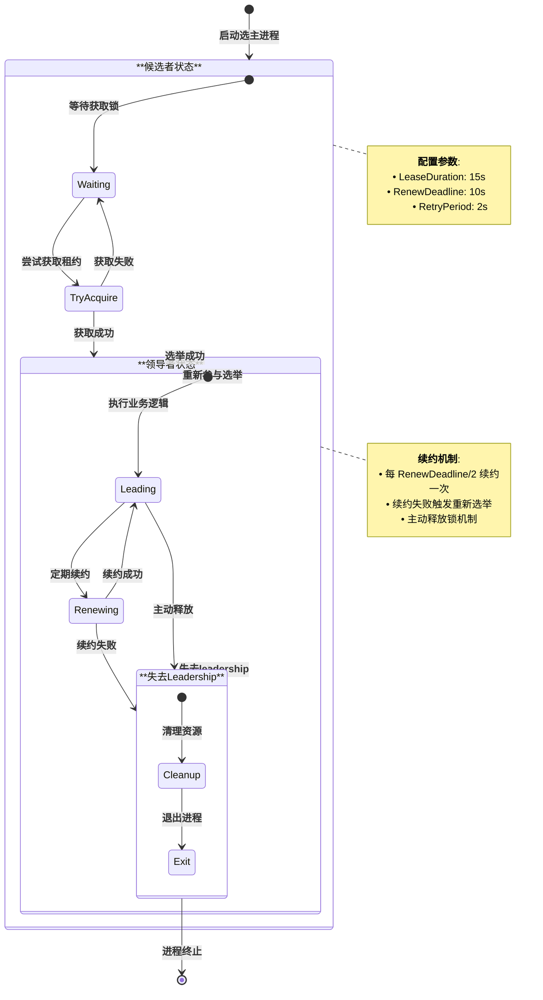
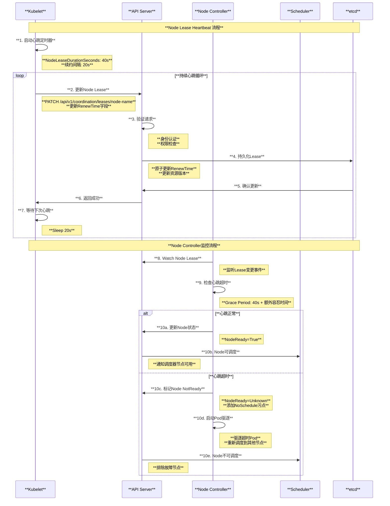
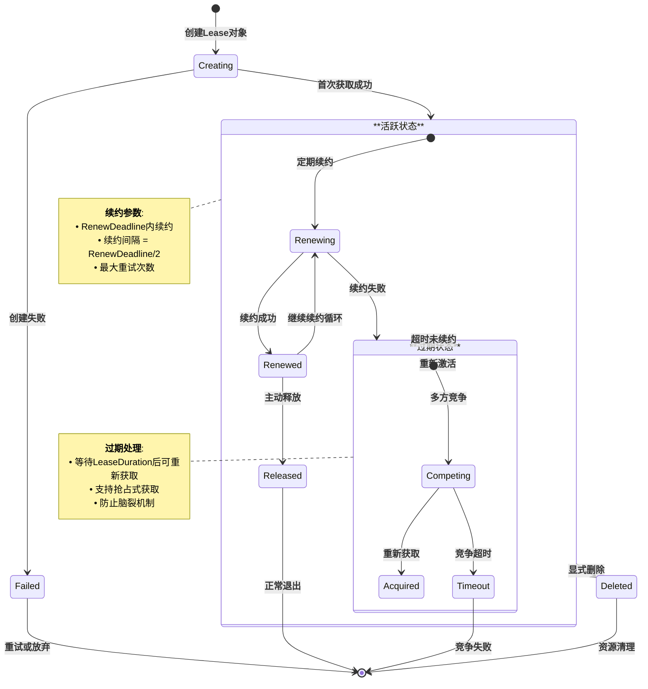

# Kubernetes Lease 租约机制深度解读

## 目录

1. [概述](#概述)
2. [Lease 核心概念](#lease-核心概念)
3. [Lease 整体架构](#lease-整体架构)
4. [Leader Election 选主机制](#leader-election-选主机制)
5. [Node Heartbeat 心跳机制](#node-heartbeat-心跳机制)
6. [Lease 生命周期管理](#lease-生命周期管理)
7. [实际应用场景](#实际应用场景)
8. [监控与故障排查](#监控与故障排查)
9. [总结](#总结)

---

## 概述

Lease 是 Kubernetes coordination.k8s.io/v1 API 组中的资源对象，用于实现分布式协调和状态同步。Lease 提供了一种轻量级的机制来处理分布式系统中的常见问题，如领导选举（Leader Election）、节点心跳（Node Heartbeat）和组件协调等。本文档基于 Kubernetes 源码深入解读 Lease 的架构设计、工作原理和应用场景。

### 核心特性

- **轻量级协调**：相比传统的基于 Endpoints/ConfigMap 的协调机制更轻量
- **高效心跳**：为节点健康检查提供高效的心跳机制
- **分布式锁**：实现组件间的互斥访问和领导选举
- **可扩展性**：支持大规模集群的协调需求
- **一致性保证**：基于 etcd 的强一致性保证

---

## Lease 核心概念

### 1. Lease 资源结构

```go
// Lease 定义了租约资源
type Lease struct {
    metav1.TypeMeta
    metav1.ObjectMeta
    
    // Spec 包含租约规范信息
    Spec LeaseSpec
}

// LeaseSpec 是租约规范
type LeaseSpec struct {
    // HolderIdentity 包含当前租约持有者的身份
    HolderIdentity *string
    
    // LeaseDurationSeconds 是租约持有时间（秒）
    LeaseDurationSeconds *int32
    
    // AcquireTime 是租约获取时间
    AcquireTime *metav1.MicroTime
    
    // RenewTime 是租约续约时间
    RenewTime *metav1.MicroTime
    
    // LeaseTransitions 是租约转移次数
    LeaseTransitions *int32
}
```

### 2. Lease 类型分类

```mermaid
graph TB
    subgraph "**Kubernetes Lease 应用类型分类**"
        style subgraph fill:#f9f9f9,stroke:#333,stroke-width:2px
        
        subgraph "**Leader Election Lease**"
            style subgraph fill:#e6f3ff,stroke:#0066cc,stroke-width:2px
            
            CONTROLLER_LEASE[**控制器选主**<br/>• **kube-controller-manager**<br/>• **kube-scheduler**<br/>• **cloud-controller-manager**<br/>• **自定义控制器**<br/>• 确保单活实例运行]
            
            OPERATOR_LEASE[**Operator选主**<br/>• **CRD控制器**<br/>• **Helm Operator**<br/>• **Prometheus Operator**<br/>• **Istio控制平面**<br/>• 多副本高可用部署]
        end
        
        subgraph "**Node Heartbeat Lease**"  
            style subgraph fill:#fff2e6,stroke:#cc6600,stroke-width:2px
            
            KUBELET_LEASE[**Kubelet心跳**<br/>• **节点健康状态上报**<br/>• **轻量级心跳机制**<br/>• **替代频繁Node Status更新**<br/>• **减少etcd压力**<br/>• **快速故障检测**]
            
            NODE_LIFECYCLE[**节点生命周期**<br/>• **节点就绪状态判断**<br/>• **节点故障检测**<br/>• **Pod驱逐触发**<br/>• **集群容量管理**<br/>• **自动伸缩决策**]
        end
        
        subgraph "**Custom Coordination Lease**"
            style subgraph fill:#e6ffe6,stroke:#009900,stroke-width:2px
            
            CUSTOM_APPS[**应用级协调**<br/>• **数据库主从选举**<br/>• **缓存集群协调**<br/>• **任务调度协调**<br/>• **分布式锁实现**<br/>• **状态同步协调**]
            
            WORKLOAD_COORD[**工作负载协调**<br/>• **批处理任务协调**<br/>• **定时任务调度**<br/>• **资源清理任务**<br/>• **备份任务协调**<br/>• **维护窗口管理**]
        end
        
        subgraph "**System Component Lease**"
            style subgraph fill:#f0f8ff,stroke:#4169e1,stroke-width:2px
            
            API_SERVER[**API Server协调**<br/>• **多实例负载均衡**<br/>• **请求分发协调**<br/>• **存储后端协调**<br/>• **证书轮换协调**<br/>• **配置同步**]
            
            ADDON_COORD[**插件组件协调**<br/>• **DNS组件选主**<br/>• **网络组件协调**<br/>• **存储组件选主**<br/>• **监控组件协调**<br/>• **日志收集协调**]
        end
        
        subgraph "**Lease 特性对比**"
            style subgraph fill:#ffe6f2,stroke:#cc0066,stroke-width:2px
            
            LEASE_FEATURES[**特性对比**<br/>**轻量级**: 相比ConfigMap/Endpoints更轻量<br/>**高效**: 减少API Server和etcd负载<br/>**精确**: 微秒级时间戳支持<br/>**可扩展**: 支持大规模集群<br/>**兼容**: 向后兼容老版本机制]
        end
    end
    
    CONTROLLER_LEASE --> OPERATOR_LEASE
    KUBELET_LEASE --> NODE_LIFECYCLE
    CUSTOM_APPS --> WORKLOAD_COORD
    API_SERVER --> ADDON_COORD
    
    OPERATOR_LEASE --> CUSTOM_APPS
    NODE_LIFECYCLE --> API_SERVER
    WORKLOAD_COORD --> LEASE_FEATURES
    ADDON_COORD --> LEASE_FEATURES
    
    style CONTROLLER_LEASE fill:#90EE90,stroke:#006400,stroke-width:2px
    style KUBELET_LEASE fill:#87CEEB,stroke:#4682B4,stroke-width:2px
    style CUSTOM_APPS fill:#DDA0DD,stroke:#8B008B,stroke-width:2px
    style LEASE_FEATURES fill:#98FB98,stroke:#006400,stroke-width:2px
```

---

## Lease 整体架构

### 1. 系统架构图

```mermaid
graph TB
    subgraph "**Kubernetes Lease 整体架构**"
        style subgraph fill:#f9f9f9,stroke:#333,stroke-width:2px
        
        subgraph "**应用层**"
            style subgraph fill:#e6f3ff,stroke:#0066cc,stroke-width:2px
            
            CONTROLLERS[**控制器组件**<br/>• kube-controller-manager<br/>• kube-scheduler<br/>• cloud-controller-manager<br/>• custom-controllers]
            
            KUBELETS[**Kubelet节点代理**<br/>• Node状态管理<br/>• Pod生命周期<br/>• 容器运行时<br/>• 心跳上报]
            
            OPERATORS[**Operator应用**<br/>• CRD控制器<br/>• Helm Operator<br/>• 数据库Operator<br/>• 监控Operator]
        end
        
        subgraph "**Client-Go Library层**"
            style subgraph fill:#fff2e6,stroke:#cc6600,stroke-width:2px
            
            LEADER_ELECTION[**LeaderElection库**<br/>• 选主算法实现<br/>• 租约获取和续约<br/>• 状态转换处理<br/>• 回调函数机制]
            
            RESOURCE_LOCK[**ResourceLock接口**<br/>• LeaseLock实现<br/>• ConfigMapLock实现<br/>• EndpointsLock实现<br/>• MultiLock组合锁]
        end
        
        subgraph "**API Server层**"
            style subgraph fill:#e6ffe6,stroke:#009900,stroke-width:2px
            
            COORDINATION_API[**Coordination API**<br/>• Lease CRUD操作<br/>• 请求验证<br/>• 权限检查<br/>• 并发控制]
            
            ADMISSION_CONTROL[**准入控制**<br/>• Lease创建验证<br/>• 身份验证<br/>• 配额检查<br/>• 策略执行]
        end
        
        subgraph "**存储层**"
            style subgraph fill:#f0f8ff,stroke:#4169e1,stroke-width:2px
            
            ETCD_STORAGE[**etcd存储**<br/>• Lease对象持久化<br/>• 原子操作支持<br/>• Watch机制<br/>• 一致性保证]
            
            CACHE_LAYER[**缓存层**<br/>• API Server缓存<br/>• Informer缓存<br/>• 本地缓存<br/>• 性能优化]
        end
        
        subgraph "**监控观测层**"
            style subgraph fill:#ffe6f2,stroke:#cc0066,stroke-width:2px
            
            METRICS[**指标收集**<br/>• 租约续约成功率<br/>• 选主切换频率<br/>• 心跳延迟<br/>• 故障检测时间]
            
            LOGGING[**日志记录**<br/>• 选主事件日志<br/>• 租约操作日志<br/>• 错误日志<br/>• 审计日志]
        end
        
        subgraph "**Node Lifecycle层**"
            style subgraph fill:#f5f5dc,stroke:#daa520,stroke-width:2px
            
            NODE_CONTROLLER[**Node生命周期控制器**<br/>• 节点健康状态判断<br/>• 基于Lease的快速检测<br/>• Pod驱逐决策<br/>• 集群容量管理]
            
            HEALTH_CHECK[**健康检查机制**<br/>• Lease超时检测<br/>• 节点状态计算<br/>• 故障恢复<br/>• 告警通知]
        end
    end
    
    CONTROLLERS --> LEADER_ELECTION
    KUBELETS --> COORDINATION_API
    OPERATORS --> RESOURCE_LOCK
    
    LEADER_ELECTION --> COORDINATION_API
    RESOURCE_LOCK --> COORDINATION_API
    COORDINATION_API --> ADMISSION_CONTROL
    
    ADMISSION_CONTROL --> ETCD_STORAGE
    ETCD_STORAGE --> CACHE_LAYER
    
    CACHE_LAYER --> NODE_CONTROLLER
    NODE_CONTROLLER --> HEALTH_CHECK
    
    COORDINATION_API --> METRICS
    LEADER_ELECTION --> LOGGING
    
    style CONTROLLERS fill:#90EE90,stroke:#006400,stroke-width:2px
    style LEADER_ELECTION fill:#87CEEB,stroke:#4682B4,stroke-width:2px
    style COORDINATION_API fill:#DDA0DD,stroke:#8B008B,stroke-width:2px
    style ETCD_STORAGE fill:#98FB98,stroke:#006400,stroke-width:2px
```

---

## Leader Election 选主机制

### 1. 选主算法实现

基于源码 `staging/src/k8s.io/client-go/tools/leaderelection/leaderelection.go`：

```go
// tryAcquireOrRenew 尝试获取或续约租约
func (le *LeaderElector) tryAcquireOrRenew(ctx context.Context) bool {
    now := metav1.NewTime(le.clock.Now())
    leaderElectionRecord := rl.LeaderElectionRecord{
        HolderIdentity:       le.config.Lock.Identity(),
        LeaseDurationSeconds: int(le.config.LeaseDuration / time.Second),
        RenewTime:            now,
        AcquireTime:          now,
    }

    // 1. 获取或创建选举记录
    oldLeaderElectionRecord, oldLeaderElectionRawRecord, err := le.config.Lock.Get(ctx)
    if err != nil {
        if !errors.IsNotFound(err) {
            klog.Errorf("error retrieving resource lock %v: %v", le.config.Lock.Describe(), err)
            return false
        }
        // 创建新的租约
        if err = le.config.Lock.Create(ctx, leaderElectionRecord); err != nil {
            klog.Errorf("error initially creating leader election record: %v", err)
            return false
        }
        le.setObservedRecord(&leaderElectionRecord)
        return true
    }

    // 2. 检查身份和时间
    if !bytes.Equal(le.observedRawRecord, oldLeaderElectionRawRecord) {
        le.setObservedRecord(oldLeaderElectionRecord)
        le.observedRawRecord = oldLeaderElectionRawRecord
    }
    
    if len(oldLeaderElectionRecord.HolderIdentity) > 0 &&
        le.observedTime.Add(time.Second*time.Duration(oldLeaderElectionRecord.LeaseDurationSeconds)).After(now.Time) &&
        !le.IsLeader() {
        klog.V(4).Infof("lock is held by %v and has not yet expired", oldLeaderElectionRecord.HolderIdentity)
        return false
    }

    // 3. 更新租约
    if le.IsLeader() {
        leaderElectionRecord.AcquireTime = oldLeaderElectionRecord.AcquireTime
        leaderElectionRecord.LeaderTransitions = oldLeaderElectionRecord.LeaderTransitions
    } else {
        leaderElectionRecord.LeaderTransitions = oldLeaderElectionRecord.LeaderTransitions + 1
    }

    // 更新锁
    if err = le.config.Lock.Update(ctx, leaderElectionRecord); err != nil {
        klog.Errorf("Failed to update lock: %v", err)
        return false
    }

    le.setObservedRecord(&leaderElectionRecord)
    return true
}
```

### 2. Leader Election 配置

基于源码 `staging/src/k8s.io/component-base/config/v1alpha1/types.go`：

```go
// LeaderElectionConfiguration 定义选主配置
type LeaderElectionConfiguration struct {
    // 启用选主功能
    LeaderElect *bool
    
    // 租约持续时间 - 非leader候选者等待的最大时间
    LeaseDuration metav1.Duration // 默认: 15s
    
    // 续约截止时间 - leader尝试续约的间隔
    RenewDeadline metav1.Duration // 默认: 10s
    
    // 重试周期 - 客户端尝试获取和续约的间隔
    RetryPeriod metav1.Duration   // 默认: 2s
    
    // 资源锁类型 - "leases", "endpoints", "configmaps"
    ResourceLock string
    
    // 资源名称
    ResourceName string
    
    // 资源命名空间
    ResourceNamespace string
}
```

### 3. Leader Election 示例

```go
// 基于源码 staging/src/k8s.io/client-go/examples/leader-election/main.go
func main() {
    var kubeconfig *string
    if home := homedir.HomeDir(); home != "" {
        kubeconfig = flag.String("kubeconfig", filepath.Join(home, ".kube", "config"), "(optional) absolute path to the kubeconfig file")
    } else {
        kubeconfig = flag.String("kubeconfig", "", "absolute path to the kubeconfig file")
    }
    
    config, err := clientcmd.BuildConfigFromFlags("", *kubeconfig)
    if err != nil {
        klog.Fatal(err)
    }
    client := clientset.NewForConfigOrDie(config)

    // 生成唯一身份标识
    id, err := os.Hostname()
    if err != nil {
        klog.Fatalf("failed to get hostname: %v", err)
    }
    id = id + "_" + string(uuid.NewUUID())

    // 创建Lease锁
    lock := &resourcelock.LeaseLock{
        LeaseMeta: metav1.ObjectMeta{
            Name:      "example-lease-lock",
            Namespace: "default",
        },
        Client: client.CoordinationV1(),
        LockConfig: resourcelock.ResourceLockConfig{
            Identity: id,
        },
    }

    // 启动leader election
    leaderelection.RunOrDie(context.TODO(), leaderelection.LeaderElectionConfig{
        Lock:            lock,
        ReleaseOnCancel: true,
        LeaseDuration:   60 * time.Second,  // 租约持续时间
        RenewDeadline:   15 * time.Second,  // 续约截止时间
        RetryPeriod:     5 * time.Second,   // 重试周期
        Callbacks: leaderelection.LeaderCallbacks{
            OnStartedLeading: func(ctx context.Context) {
                // 成为leader后执行的逻辑
                klog.Info("成为leader，开始执行业务逻辑")
                runBusinessLogic(ctx)
            },
            OnStoppedLeading: func() {
                // 失去leadership后的清理工作
                klog.Info("失去leadership，退出程序")
                os.Exit(0)
            },
            OnNewLeader: func(identity string) {
                // 当新leader被选出时的回调
                if identity == id {
                    return // 自己成为leader
                }
                klog.Infof("新的leader被选出: %s", identity)
            },
        },
    })
}
```

### 4. Leader Election 状态转换图



---

## Node Heartbeat 心跳机制

### 1. Kubelet 心跳实现

基于源码 `pkg/kubelet/kubelet_node_status.go`：

```go
// tryUpdateNodeStatus 尝试更新节点状态
func (kl *Kubelet) tryUpdateNodeStatus(ctx context.Context, tryNumber int) error {
    // 获取当前节点对象
    opts := metav1.GetOptions{}
    if tryNumber == 0 {
        util.FromApiserverCache(&opts)
    }
    originalNode, err := kl.heartbeatClient.CoreV1().Nodes().Get(ctx, string(kl.nodeName), opts)
    if err != nil {
        return fmt.Errorf("error getting node %q: %v", kl.nodeName, err)
    }

    node, changed := kl.updateNode(ctx, originalNode)
    shouldPatchNodeStatus := changed || kl.clock.Since(kl.lastStatusReportTime) >= kl.nodeStatusReportFrequency

    if !shouldPatchNodeStatus {
        kl.markVolumesFromNode(node)
        return nil
    }

    // 更新节点状态
    updatedNode, err := kl.patchNodeStatus(originalNode, node)
    if err == nil {
        kl.markVolumesFromNode(updatedNode)
    }
    return err
}
```

### 2. Node Lease 心跳配置

```yaml
# Kubelet 配置中的 Node Lease 参数
apiVersion: kubelet.config.k8s.io/v1beta1
kind: KubeletConfiguration
# Node Lease 相关配置
nodeLeaseEnableable: true              # 启用Node Lease功能
nodeLeaseDurationSeconds: 40           # Node Lease持续时间（秒）
nodeStatusReportFrequency: 5m          # 节点状态报告频率
nodeStatusUpdateFrequency: 10s         # 节点状态更新频率

# 心跳客户端配置
clientConnection:
  qps: 50                              # API请求QPS
  burst: 100                           # 突发请求数
```

### 3. Node Lifecycle Controller 处理逻辑

基于源码 `pkg/controller/nodelifecycle/node_lifecycle_controller.go`：

```go
// 基于Lease计算节点健康状态
func (nc *Controller) computeNodeHealthByLease(node *v1.Node) (*NodeHealthData, error) {
    // 获取节点租约对象
    lease, err := nc.leaseLister.Leases(v1.NamespaceNodeLease).Get(node.Name)
    if err != nil {
        return nil, err
    }
    
    nodeHealth := &NodeHealthData{
        status: node.Status.DeepCopy(),
    }
    
    // 使用租约的续约时间作为探测时间戳
    if lease.Spec.RenewTime != nil {
        nodeHealth.probeTimestamp = *lease.Spec.RenewTime
    } else {
        nodeHealth.probeTimestamp = lease.CreationTimestamp
    }
    
    // 计算节点状态条件
    now := nc.now()
    gracePeriod := nc.nodeMonitorGracePeriod
    if nc.now().Sub(node.CreationTimestamp.Time) < nc.nodeStartupGracePeriod {
        gracePeriod = nc.nodeStartupGracePeriod
    }
    
    var currentReadyCondition v1.NodeCondition
    if nodeHealth.probeTimestamp.Add(gracePeriod).After(now) {
        // 节点健康
        currentReadyCondition = v1.NodeCondition{
            Type:               v1.NodeReady,
            Status:             v1.ConditionTrue,
            Reason:             "NodeReady",
            Message:            "kubelet is ready.",
            LastHeartbeatTime:  nodeHealth.probeTimestamp,
            LastTransitionTime: now,
        }
    } else {
        // 节点不健康
        currentReadyCondition = v1.NodeCondition{
            Type:               v1.NodeReady,
            Status:             v1.ConditionUnknown,
            Reason:             "NodeStatusUnknown", 
            Message:            "kubelet stopped posting node status.",
            LastHeartbeatTime:  nodeHealth.probeTimestamp,
            LastTransitionTime: now,
        }
    }
    
    nodeHealth.status.Conditions = []v1.NodeCondition{currentReadyCondition}
    return nodeHealth, nil
}
```

### 4. Node Heartbeat 流程图



---

## Lease 生命周期管理

### 1. Lease 对象生命周期



### 2. Lease 清理机制

```go
// Lease自动清理控制器示例
func (c *LeaseController) syncLease(ctx context.Context, key string) error {
    namespace, name, err := cache.SplitMetaNamespaceKey(key)
    if err != nil {
        return err
    }
    
    lease, err := c.leaseLister.Leases(namespace).Get(name)
    if apierrors.IsNotFound(err) {
        return nil
    }
    if err != nil {
        return err
    }
    
    // 检查是否需要清理过期的Lease
    if c.shouldCleanupLease(lease) {
        err := c.kubeClient.CoordinationV1().
            Leases(namespace).
            Delete(ctx, name, metav1.DeleteOptions{})
        if err != nil && !apierrors.IsNotFound(err) {
            return err
        }
        klog.V(4).Infof("Cleaned up expired lease %s/%s", namespace, name)
    }
    
    return nil
}

func (c *LeaseController) shouldCleanupLease(lease *coordinationv1.Lease) bool {
    if lease.Spec.LeaseDurationSeconds == nil || lease.Spec.RenewTime == nil {
        return false
    }
    
    // 检查租约是否已经过期超过清理阈值
    leaseDuration := time.Duration(*lease.Spec.LeaseDurationSeconds) * time.Second
    cleanupThreshold := leaseDuration * 2 // 清理阈值为租约时间的2倍
    
    return time.Since(lease.Spec.RenewTime.Time) > cleanupThreshold
}
```

---

## 实际应用场景

### 1. 控制器选主配置

```yaml
# kube-controller-manager Leader Election配置
apiVersion: kubecontrolplane.config.k8s.io/v1alpha1
kind: KubeControllerManagerConfiguration
generic:
  leaderElection:
    leaderElect: true                    # 启用选主
    resourceLock: "leases"               # 使用Lease作为锁机制
    resourceName: "kube-controller-manager"
    resourceNamespace: "kube-system"
    leaseDuration: "15s"                 # 租约持续时间
    renewDeadline: "10s"                 # 续约截止时间
    retryPeriod: "2s"                   # 重试间隔

---
# 生成的Lease对象示例
apiVersion: coordination.k8s.io/v1
kind: Lease
metadata:
  name: kube-controller-manager
  namespace: kube-system
spec:
  holderIdentity: "master-01_8c123e45-6789-4abc-def0-1234567890ab"
  leaseDurationSeconds: 15
  acquireTime: "2024-01-01T10:00:00.123456Z"
  renewTime: "2024-01-01T10:00:05.234567Z"
  leaseTransitions: 1
```

### 2. 自定义控制器选主示例

```go
package main

import (
    "context"
    "flag"
    "os"
    "time"
    
    "k8s.io/client-go/kubernetes"
    "k8s.io/client-go/rest"
    "k8s.io/client-go/tools/clientcmd"
    "k8s.io/client-go/tools/leaderelection"
    "k8s.io/client-go/tools/leaderelection/resourcelock"
    metav1 "k8s.io/apimachinery/pkg/apis/meta/v1"
    "k8s.io/apimachinery/pkg/util/uuid"
    "k8s.io/klog/v2"
)

func main() {
    var kubeconfig = flag.String("kubeconfig", "", "absolute path to the kubeconfig file")
    flag.Parse()
    
    // 构建Kubernetes配置
    config, err := buildConfig(*kubeconfig)
    if err != nil {
        klog.Fatalf("Failed to build config: %v", err)
    }
    
    client := kubernetes.NewForConfigOrDie(config)
    
    // 生成唯一ID
    hostname, err := os.Hostname()
    if err != nil {
        klog.Fatalf("Failed to get hostname: %v", err)
    }
    id := hostname + "_" + string(uuid.NewUUID())
    
    // 创建Lease锁
    lock := &resourcelock.LeaseLock{
        LeaseMeta: metav1.ObjectMeta{
            Name:      "my-custom-controller",
            Namespace: "kube-system",
        },
        Client: client.CoordinationV1(),
        LockConfig: resourcelock.ResourceLockConfig{
            Identity: id,
        },
    }
    
    // 配置选主参数
    leConfig := leaderelection.LeaderElectionConfig{
        Lock:            lock,
        ReleaseOnCancel: true,
        LeaseDuration:   30 * time.Second,  // 较长的租约时间
        RenewDeadline:   20 * time.Second,  // 续约截止时间
        RetryPeriod:     5 * time.Second,   // 重试间隔
        Callbacks: leaderelection.LeaderCallbacks{
            OnStartedLeading: func(ctx context.Context) {
                klog.Infof("Started leading with identity: %s", id)
                // 在这里启动控制器业务逻辑
                runController(ctx, client)
            },
            OnStoppedLeading: func() {
                klog.Infof("Leadership lost by: %s", id)
                // 执行清理操作
                cleanup()
                os.Exit(0)
            },
            OnNewLeader: func(identity string) {
                if identity == id {
                    return
                }
                klog.Infof("New leader elected: %s", identity)
            },
        },
    }
    
    // 启动选主过程
    ctx := context.Background()
    leaderelection.RunOrDie(ctx, leConfig)
}

func buildConfig(kubeconfig string) (*rest.Config, error) {
    if kubeconfig != "" {
        return clientcmd.BuildConfigFromFlags("", kubeconfig)
    }
    return rest.InClusterConfig()
}

func runController(ctx context.Context, client kubernetes.Interface) {
    klog.Info("控制器开始运行...")
    // 控制器主循环逻辑
    for {
        select {
        case <-ctx.Done():
            klog.Info("控制器停止运行")
            return
        default:
            // 执行控制器业务逻辑
            time.Sleep(10 * time.Second)
        }
    }
}

func cleanup() {
    klog.Info("执行清理操作...")
    // 释放资源，停止goroutine等
}
```

### 3. Node Lease 监控示例

```yaml
# Node Lease监控告警规则
apiVersion: monitoring.coreos.com/v1
kind: PrometheusRule
metadata:
  name: node-lease-monitoring
spec:
  groups:
  - name: node-lease
    rules:
    # Node心跳超时告警
    - alert: NodeHeartbeatMissing
      expr: |
        (time() - node_lease_renew_time) > 120
      for: 1m
      labels:
        severity: critical
      annotations:
        summary: "Node {{ $labels.node }} heartbeat missing"
        description: "Node {{ $labels.node }} has not renewed its lease for more than 2 minutes"
    
    # Node Lease续约失败率
    - alert: NodeLeaseRenewFailureRate
      expr: |
        rate(node_lease_renew_errors_total[5m]) > 0.1
      for: 2m
      labels:
        severity: warning
      annotations:
        summary: "High Node lease renew failure rate"
        description: "Node lease renew failure rate is {{ $value }} per second"

---
# Node Lease状态监控Dashboard配置
apiVersion: v1
kind: ConfigMap
metadata:
  name: node-lease-dashboard
data:
  dashboard.json: |
    {
      "dashboard": {
        "title": "Node Lease Monitoring",
        "panels": [
          {
            "title": "Node Lease Renewal Time",
            "type": "graph",
            "targets": [
              {
                "expr": "node_lease_renew_time",
                "legendFormat": "{{node}} - Last Renew Time"
              }
            ]
          },
          {
            "title": "Node Lease Duration Distribution", 
            "type": "histogram",
            "targets": [
              {
                "expr": "histogram_quantile(0.95, rate(node_lease_duration_seconds_bucket[5m]))",
                "legendFormat": "95th percentile"
              }
            ]
          }
        ]
      }
    }
```

---

## 监控与故障排查

### 1. Lease 相关指标

```yaml
# Lease监控指标收集配置
apiVersion: v1
kind: ConfigMap
metadata:
  name: lease-metrics-config
data:
  metrics.yaml: |
    # Leader Election指标
    - leaderelection_slowpath_total              # 慢路径操作次数
    - leaderelection_get_errors_total            # 获取锁错误次数
    - leaderelection_renewal_errors_total        # 续约错误次数
    - leaderelection_acquisition_duration_seconds # 获取锁耗时
    - leaderelection_renewal_duration_seconds     # 续约耗时
    
    # Node Lease指标  
    - node_lease_duration_seconds                # Node Lease持续时间
    - node_lease_renew_errors_total             # Node Lease续约错误
    - node_lease_renew_duration_seconds         # Node Lease续约耗时
    
    # API Server Lease指标
    - apiserver_lease_objects_total              # Lease对象总数
    - apiserver_lease_requests_total             # Lease API请求总数
    - apiserver_lease_request_duration_seconds   # Lease API请求耗时
```

### 2. 故障排查脚本

```bash
#!/bin/bash
# Lease故障排查工具

echo "=== Kubernetes Lease 故障排查工具 ==="

# 1. 检查系统组件Leader状态
echo "1. 检查系统组件Leader选举状态..."
echo "Controller Manager:"
kubectl get lease -n kube-system kube-controller-manager -o yaml

echo "Scheduler:"
kubectl get lease -n kube-system kube-scheduler -o yaml

# 2. 检查Node Lease状态
echo "2. 检查Node Lease状态..."
kubectl get lease -n kube-node-lease --sort-by='.spec.renewTime'

# 3. 检查异常节点
echo "3. 检查节点健康状态..."
kubectl get nodes -o custom-columns=NAME:.metadata.name,STATUS:.status.conditions[-1].type,REASON:.status.conditions[-1].reason,LAST-HEARTBEAT:.status.conditions[-1].lastHeartbeatTime

# 4. 检查Lease相关事件
echo "4. 检查Lease相关事件..."
kubectl get events --all-namespaces | grep -i lease

# 5. 检查API Server日志中的Lease错误
echo "5. 检查API Server Lease相关日志..."
kubectl logs -n kube-system -l component=kube-apiserver --tail=100 | grep -i lease

# 6. 检查etcd中的Lease对象
echo "6. 检查etcd中的Lease数据..."
# 注意：这需要etcd客户端访问权限
ETCDCTL_ENDPOINTS="https://127.0.0.1:2379"
ETCDCTL_CACERT="/etc/kubernetes/pki/etcd/ca.crt"
ETCDCTL_CERT="/etc/kubernetes/pki/etcd/server.crt"
ETCDCTL_KEY="/etc/kubernetes/pki/etcd/server.key"

etcdctl --endpoints=$ETCDCTL_ENDPOINTS \
    --cacert=$ETCDCTL_CACERT \
    --cert=$ETCDCTL_CERT \
    --key=$ETCDCTL_KEY \
    get /registry/coordination.k8s.io/leases/ --prefix --keys-only

# 7. 检查网络连通性
echo "7. 检查组件间网络连通性..."
kubectl get endpoints -n kube-system kubernetes

# 8. 性能指标检查
echo "8. 检查Lease相关性能指标..."
kubectl top nodes
kubectl get --raw /metrics | grep -E "(lease|leader)"

echo "故障排查完成！"
```

### 3. 常见问题解决方案

```yaml
# Lease常见问题及解决方案手册
apiVersion: v1
kind: ConfigMap
metadata:
  name: lease-troubleshooting-guide
data:
  common-issues.yaml: |
    # 问题1: Leader频繁切换
    leader_flapping:
      symptoms:
        - "频繁的leader transition事件"
        - "控制器重启过于频繁"
        - "业务逻辑重复执行"
      root_causes:
        - "网络延迟过高导致续约失败"
        - "API Server负载过高"
        - "etcd性能瓶颈"
        - "续约参数配置不当"
      solutions:
        - "增加LeaseDuration和RenewDeadline"
        - "优化网络配置减少延迟"
        - "扩容API Server和etcd"
        - "调整续约重试策略"
    
    # 问题2: Node误判为NotReady
    node_false_positive:
      symptoms:
        - "节点被标记为NotReady但实际正常"
        - "Pod被不必要地驱逐"
        - "集群容量虚假不足"
      root_causes:
        - "Node Lease续约超时"
        - "Kubelet与API Server连接问题"
        - "系统时间不同步"
        - "节点资源压力过大"
      solutions:
        - "检查kubelet日志和网络连通性"
        - "同步系统时间"
        - "调整Node Lease参数"
        - "监控节点资源使用情况"
    
    # 问题3: Lease对象泄漏
    lease_object_leak:
      symptoms:
        - "Lease对象数量持续增长"
        - "etcd存储空间不足"
        - "API性能下降"
      root_causes:
        - "组件异常退出未清理Lease"
        - "Lease清理策略未生效"
        - "命名空间删除后Lease残留"
      solutions:
        - "实现优雅关闭机制"
        - "配置Lease TTL和清理策略"
        - "定期清理无效Lease对象"
        - "监控Lease对象数量"
    
    # 问题4: 选主延迟过高
    leader_election_delay:
      symptoms:
        - "组件启动到成为leader耗时过长"
        - "故障恢复时间过长"
        - "服务可用性下降"
      root_causes:
        - "RetryPeriod设置过大"
        - "多个实例同时竞争"
        - "API Server响应慢"
      solutions:
        - "优化选主参数配置"
        - "错开实例启动时间"
        - "提高API Server性能"
        - "使用健康检查加速故障检测"

---
# Lease性能调优建议
apiVersion: v1
kind: ConfigMap
metadata:
  name: lease-performance-tuning
data:
  tuning-guide.yaml: |
    # 选主参数调优
    leader_election_tuning:
      # 高可用环境推荐配置
      high_availability:
        leaseDuration: "30s"      # 较长租约时间，减少频繁切换
        renewDeadline: "20s"      # 给予充足续约时间
        retryPeriod: "5s"         # 适中的重试间隔
        
      # 快速恢复环境推荐配置  
      fast_recovery:
        leaseDuration: "15s"      # 较短租约时间，快速故障检测
        renewDeadline: "10s"      # 快速续约
        retryPeriod: "2s"         # 频繁重试
    
    # Node Lease参数调优
    node_lease_tuning:
      # 大规模集群配置
      large_scale:
        nodeLeaseDurationSeconds: 40    # 稍长的续约时间
        nodeStatusUpdateFrequency: "5m" # 降低状态更新频率
        nodeMonitorGracePeriod: "1m"    # 适当的宽限期
        
      # 边缘计算环境配置
      edge_computing:
        nodeLeaseDurationSeconds: 60    # 更长的续约时间应对网络不稳定
        nodeStatusUpdateFrequency: "10m"# 更低的更新频率
        nodeMonitorGracePeriod: "2m"    # 更长的宽限期
```

---

## 总结

Lease 机制是 Kubernetes 中实现分布式协调的核心技术，通过轻量级的租约机制解决了领导选举、节点心跳、资源协调等关键问题。相比传统的基于 ConfigMap 或 Endpoints 的协调方案，Lease 提供了更高效、更可靠的实现方式。

### 核心价值

1. **高效协调**：提供轻量级的分布式协调机制，减少系统开销
2. **快速故障检测**：基于续约机制的快速故障检测和恢复
3. **可扩展性**：支持大规模集群的协调需求
4. **一致性保证**：基于 etcd 的强一致性保证分布式协调的正确性
5. **简化实现**：标准化的 client-go 库简化了选主逻辑的实现

### 技术特点

- **微秒级时间戳**：提供精确的时间控制和状态追踪
- **原子操作**：基于 etcd 的原子更新保证操作的一致性
- **续约机制**：通过定期续约维持租约状态，实现活跃性检测
- **竞争处理**：优雅的竞争处理和状态转换机制
- **监控友好**：丰富的指标和事件支持运维监控

Lease 机制在 Kubernetes 生态中发挥着基础性作用，正确理解和使用 Lease 对于构建可靠的云原生应用至关重要。随着 Kubernetes 向更大规模和更复杂场景的演进，Lease 机制将持续优化以满足新的协调需求。

