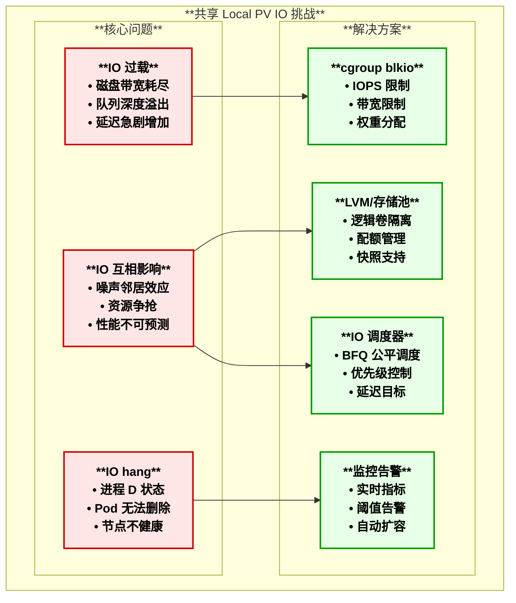
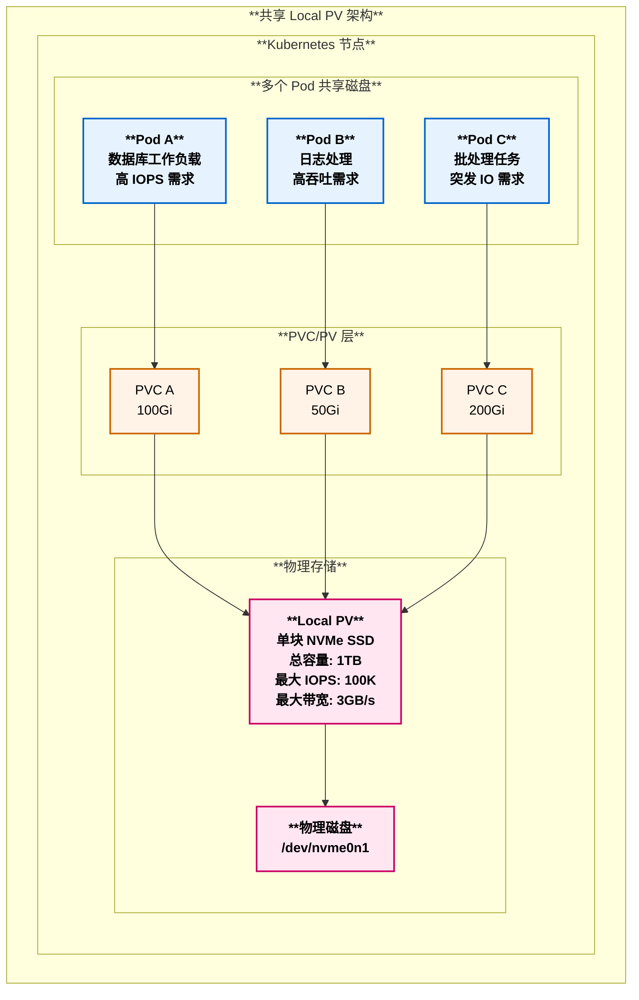
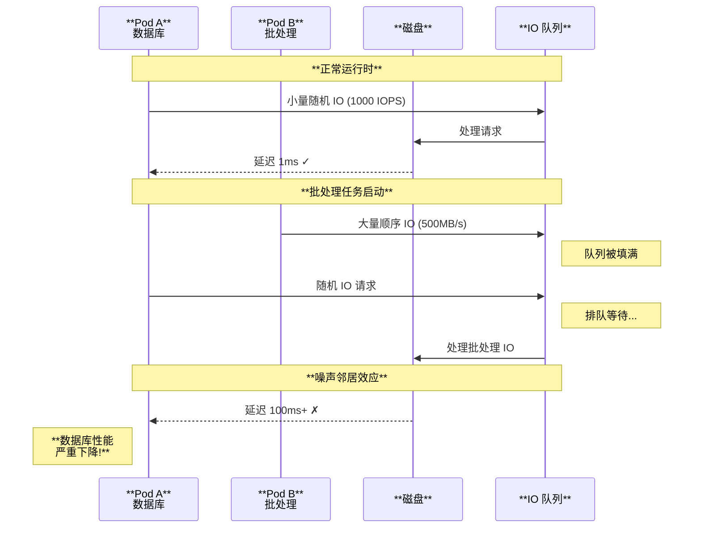
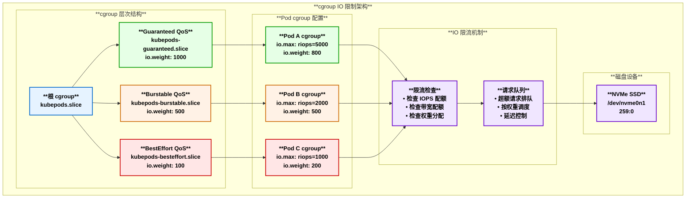
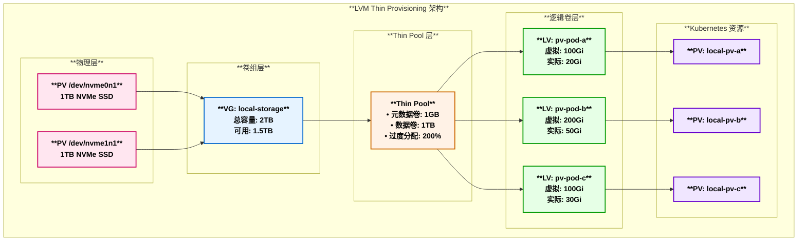
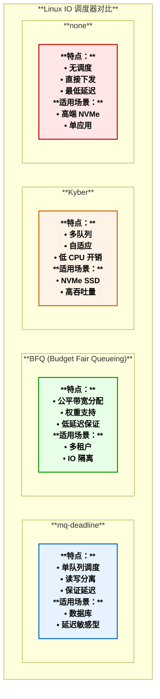
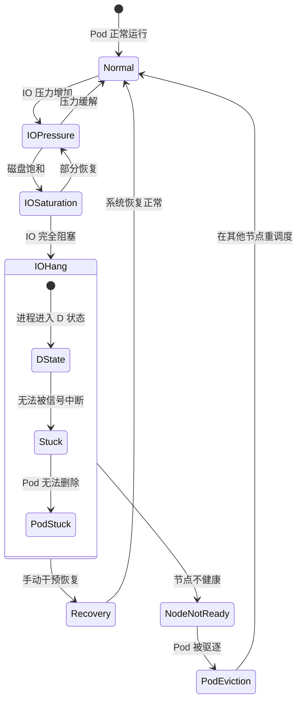
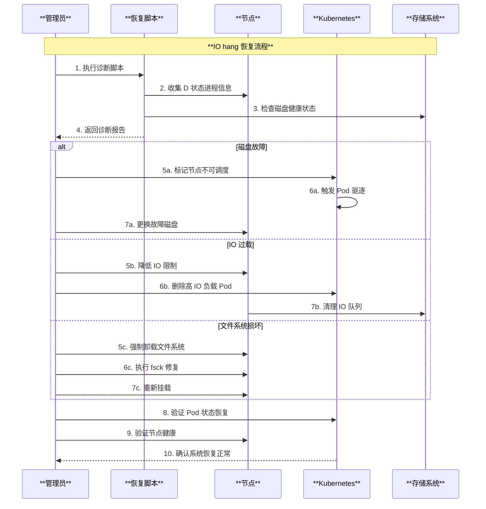
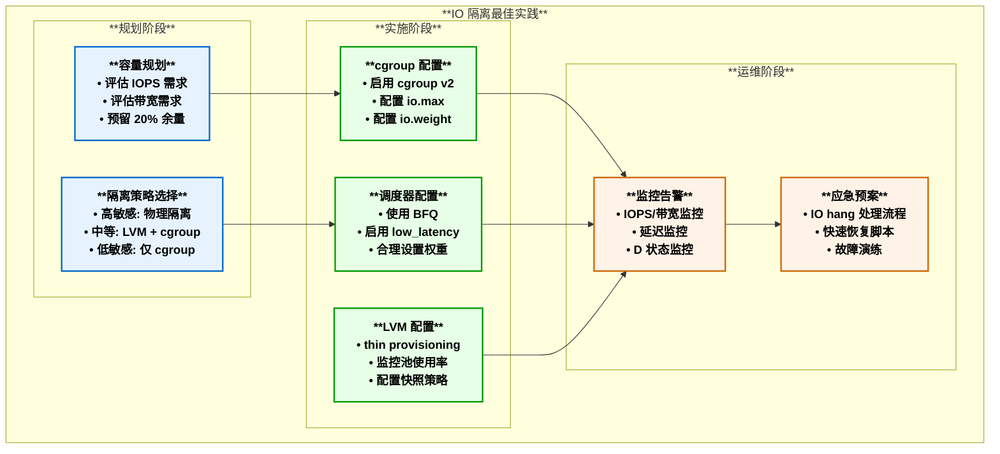

# Kubernetes 共享 Local PV IO 隔离方案深度解析

## 目录

1. [概述](#概述)
2. [问题背景](#问题背景)
3. [IO 隔离架构设计](#io-隔离架构设计)
4. [cgroup blkio 限制方案](#cgroup-blkio-限制方案)
5. [LVM 与存储池隔离方案](#lvm-与存储池隔离方案)
6. [IO 调度器优化](#io-调度器优化)
7. [Kubernetes 资源限制集成](#kubernetes-资源限制集成)
8. [监控与告警体系](#监控与告警体系)
9. [IO hang 问题诊断与恢复](#io-hang-问题诊断与恢复)
10. [最佳实践与调优建议](#最佳实践与调优建议)
11. [总结](#总结)

---

## 概述

共享 Local PV 是 Kubernetes 中一种高性能的本地持久化存储方案，但由于多个 Pod 共享同一物理磁盘，容易产生 IO 过载和 IO 互相影响的问题。本文档深入探讨各种 IO 隔离方案，帮助在保证性能的同时实现工作负载之间的公平资源分配。

### 核心挑战



---

## 问题背景

### 1. 共享 Local PV 架构



### 2. IO 过载问题分析

| **问题类型** | **表现** | **影响** | **检测指标** |
|:------------|:--------|:--------|:------------|
| **带宽饱和** | 磁盘吞吐达到上限 | 所有 Pod IO 延迟增加 | `iostat` 中 %util 接近 100% |
| **IOPS 耗尽** | 小文件操作排队 | 数据库响应变慢 | `await` 时间显著增加 |
| **队列深度满** | IO 请求积压 | 新请求被拒绝或超时 | `avgqu-sz` 持续很高 |
| **IO hang** | 进程进入 D 状态 | Pod 无法删除，节点不健康 | `ps aux` 显示 D 状态进程 |

### 3. 噪声邻居效应



---

## IO 隔离架构设计

### 1. 完整 IO 隔离架构

```mermaid
graph TB
    subgraph IOIsolationArch ["**完整 IO 隔离架构**"]
        subgraph AppLayer ["**应用层**"]
            Apps[**应用 Pod**<br/>• 数据库<br/>• 缓存<br/>• 日志]
        end
        
        subgraph K8sLayer ["**Kubernetes 层**"]
            ResourceQuota[**ResourceQuota**<br/>• 命名空间配额<br/>• 存储限制]
            
            LimitRange[**LimitRange**<br/>• 默认限制<br/>• 范围约束]
            
            StorageClass[**StorageClass**<br/>• IO 参数配置<br/>• 拓扑约束]
        end
        
        subgraph ContainerLayer ["**容器运行时层**"]
            CgroupV2[**cgroup v2**<br/>• io.max<br/>• io.weight<br/>• io.latency]
            
            Runc[**runc/containerd**<br/>• cgroup 配置<br/>• 资源限制应用]
        end
        
        subgraph StorageLayer ["**存储层**"]
            LVM[**LVM**<br/>• 逻辑卷<br/>• thin provisioning<br/>• 快照]
            
            IOScheduler[**IO 调度器**<br/>• BFQ<br/>• mq-deadline<br/>• kyber]
            
            FileSystem[**文件系统**<br/>• XFS quota<br/>• ext4 project quota]
        end
        
        subgraph HardwareLayer ["**硬件层**"]
            NVMe[**NVMe SSD**<br/>• 多队列<br/>• 高 IOPS<br/>• 低延迟]
        end
    end
    
    Apps --> ResourceQuota
    Apps --> LimitRange
    ResourceQuota --> StorageClass
    LimitRange --> StorageClass
    
    StorageClass --> CgroupV2
    CgroupV2 --> Runc
    
    Runc --> LVM
    LVM --> IOScheduler
    IOScheduler --> FileSystem
    FileSystem --> NVMe
    
    classDef appStyle fill:#e6f3ff,stroke:#0066cc,stroke-width:2px,color:#000,font-weight:bold
    classDef k8sStyle fill:#fff2e6,stroke:#cc6600,stroke-width:2px,color:#000,font-weight:bold
    classDef containerStyle fill:#e6ffe6,stroke:#009900,stroke-width:2px,color:#000,font-weight:bold
    classDef storageStyle fill:#ffe6f0,stroke:#cc0066,stroke-width:2px,color:#000,font-weight:bold
    classDef hwStyle fill:#f0e6ff,stroke:#6600cc,stroke-width:2px,color:#000,font-weight:bold
    
    class Apps appStyle
    class ResourceQuota,LimitRange,StorageClass k8sStyle
    class CgroupV2,Runc containerStyle
    class LVM,IOScheduler,FileSystem storageStyle
    class NVMe hwStyle
```



---

## cgroup blkio 限制方案

### 1. cgroup v1 blkio 配置

```bash
# 查看设备主次设备号
ls -la /dev/nvme0n1
# brw-rw---- 1 root disk 259, 0 Jan 1 00:00 /dev/nvme0n1

# 设置 IOPS 读限制 (每秒 1000 次)
echo "259:0 1000" > /sys/fs/cgroup/blkio/kubepods/pod-xxx/blkio.throttle.read_iops_device

# 设置 IOPS 写限制 (每秒 500 次)
echo "259:0 500" > /sys/fs/cgroup/blkio/kubepods/pod-xxx/blkio.throttle.write_iops_device

# 设置带宽读限制 (100MB/s)
echo "259:0 104857600" > /sys/fs/cgroup/blkio/kubepods/pod-xxx/blkio.throttle.read_bps_device

# 设置带宽写限制 (50MB/s)
echo "259:0 52428800" > /sys/fs/cgroup/blkio/kubepods/pod-xxx/blkio.throttle.write_bps_device

# 设置 IO 权重 (默认 500，范围 10-1000)
echo 800 > /sys/fs/cgroup/blkio/kubepods/pod-xxx/blkio.weight
```

### 2. cgroup v2 io 配置

```bash
# cgroup v2 统一配置格式
# 查看当前配置
cat /sys/fs/cgroup/kubepods.slice/kubepods-pod-xxx.slice/io.max

# 设置 IO 限制 (设备号:IOPS读 IOPS写 带宽读 带宽写)
echo "259:0 riops=1000 wiops=500 rbps=104857600 wbps=52428800" > \
    /sys/fs/cgroup/kubepods.slice/kubepods-pod-xxx.slice/io.max

# 设置 IO 权重 (用于公平调度)
echo "259:0 800" > /sys/fs/cgroup/kubepods.slice/kubepods-pod-xxx.slice/io.weight

# 设置 IO 延迟目标 (微秒)
echo "259:0 target=5000" > \
    /sys/fs/cgroup/kubepods.slice/kubepods-pod-xxx.slice/io.latency
```

### 3. cgroup IO 限制架构图



### 4. Kubernetes 集成 - 自定义 Device Plugin

```go
// io-limit-device-plugin.go
// 自定义 Device Plugin 实现 IO 限制

package main

import (
    "context"
    "fmt"
    "os"
    "path/filepath"
    
    "k8s.io/kubelet/pkg/apis/deviceplugin/v1beta1"
)

const (
    resourceName = "example.com/io-limit"
    socketPath   = "/var/lib/kubelet/device-plugins/io-limit.sock"
)

type IOLimitDevicePlugin struct {
    devices []*v1beta1.Device
    stop    chan struct{}
}

func (p *IOLimitDevicePlugin) Allocate(ctx context.Context, req *v1beta1.AllocateRequest) (*v1beta1.AllocateResponse, error) {
    responses := &v1beta1.AllocateResponse{}
    
    for _, containerReq := range req.ContainerRequests {
        response := &v1beta1.ContainerAllocateResponse{
            // 设置环境变量传递 IO 限制配置
            Envs: map[string]string{
                "IO_LIMIT_IOPS": "1000",
                "IO_LIMIT_BPS":  "104857600",
            },
            // 通过 annotation 传递 cgroup 配置
            Annotations: map[string]string{
                "io.kubernetes.cri.blkio-device-read-iops":  "259:0 1000",
                "io.kubernetes.cri.blkio-device-write-iops": "259:0 500",
            },
        }
        
        for _, deviceID := range containerReq.DevicesIDs {
            response.Devices = append(response.Devices, &v1beta1.DeviceSpec{
                ContainerPath: fmt.Sprintf("/dev/io-limit-%s", deviceID),
                HostPath:      "/dev/null",
                Permissions:   "r",
            })
        }
        
        responses.ContainerResponses = append(responses.ContainerResponses, response)
    }
    
    return responses, nil
}
```

---

## LVM 与存储池隔离方案

### 1. LVM thin provisioning 架构



### 2. LVM 配置脚本

```bash
#!/bin/bash
# setup-lvm-thin-pool.sh
# 创建 LVM thin pool 用于 Local PV IO 隔离

set -e

# 配置变量
DEVICE="/dev/nvme0n1"
VG_NAME="local-storage"
POOL_NAME="thin-pool"
POOL_SIZE="500G"
METADATA_SIZE="1G"

# 1. 创建物理卷
pvcreate ${DEVICE}

# 2. 创建卷组
vgcreate ${VG_NAME} ${DEVICE}

# 3. 创建 thin pool
lvcreate --type thin-pool \
    --name ${POOL_NAME} \
    --size ${POOL_SIZE} \
    --poolmetadatasize ${METADATA_SIZE} \
    ${VG_NAME}

# 4. 创建 thin 逻辑卷 (用于 Pod)
create_thin_lv() {
    local LV_NAME=$1
    local LV_SIZE=$2
    
    lvcreate --type thin \
        --name ${LV_NAME} \
        --virtualsize ${LV_SIZE} \
        --thinpool ${POOL_NAME} \
        ${VG_NAME}
    
    # 格式化为 XFS
    mkfs.xfs /dev/${VG_NAME}/${LV_NAME}
    
    echo "Created thin LV: /dev/${VG_NAME}/${LV_NAME}"
}

# 创建多个隔离的逻辑卷
create_thin_lv "pv-database" "100G"
create_thin_lv "pv-cache" "50G"
create_thin_lv "pv-logs" "200G"

# 5. 查看创建结果
lvs -a ${VG_NAME}
```

### 3. 文件系统配额配置

```bash
#!/bin/bash
# setup-xfs-quota.sh
# 配置 XFS 项目配额实现 IO 隔离

MOUNT_POINT="/mnt/local-storage"
LV_PATH="/dev/local-storage/pv-database"

# 1. 挂载时启用配额
mount -o pquota ${LV_PATH} ${MOUNT_POINT}

# 2. 创建项目目录
mkdir -p ${MOUNT_POINT}/pod-a
mkdir -p ${MOUNT_POINT}/pod-b
mkdir -p ${MOUNT_POINT}/pod-c

# 3. 设置项目 ID
echo "100:${MOUNT_POINT}/pod-a" >> /etc/projects
echo "101:${MOUNT_POINT}/pod-b" >> /etc/projects
echo "102:${MOUNT_POINT}/pod-c" >> /etc/projects

echo "pod-a:100" >> /etc/projid
echo "pod-b:101" >> /etc/projid
echo "pod-c:102" >> /etc/projid

# 4. 初始化配额
xfs_quota -x -c "project -s pod-a" ${MOUNT_POINT}
xfs_quota -x -c "project -s pod-b" ${MOUNT_POINT}
xfs_quota -x -c "project -s pod-c" ${MOUNT_POINT}

# 5. 设置配额限制 (硬限制 50GB, 软限制 40GB)
xfs_quota -x -c "limit -p bsoft=40g bhard=50g pod-a" ${MOUNT_POINT}
xfs_quota -x -c "limit -p bsoft=30g bhard=40g pod-b" ${MOUNT_POINT}
xfs_quota -x -c "limit -p bsoft=80g bhard=100g pod-c" ${MOUNT_POINT}

# 6. 查看配额状态
xfs_quota -x -c "report -pbih" ${MOUNT_POINT}
```

---

## IO 调度器优化

### 1. IO 调度器对比



### 2. BFQ 调度器配置 (推荐用于 IO 隔离)

```bash
#!/bin/bash
# setup-bfq-scheduler.sh
# 配置 BFQ 调度器实现公平 IO 分配

DEVICE="nvme0n1"

# 1. 检查当前调度器
cat /sys/block/${DEVICE}/queue/scheduler

# 2. 设置 BFQ 调度器
echo "bfq" > /sys/block/${DEVICE}/queue/scheduler

# 3. 配置 BFQ 参数
# 启用低延迟模式
echo 1 > /sys/block/${DEVICE}/queue/iosched/low_latency

# 设置超时时间 (毫秒)
echo 5000 > /sys/block/${DEVICE}/queue/iosched/timeout_sync

# 设置最大预算
echo 16 > /sys/block/${DEVICE}/queue/iosched/max_budget

# 4. 为特定 cgroup 设置 BFQ 权重
# 高优先级 Pod (权重 800)
echo "259:0 800" > /sys/fs/cgroup/kubepods.slice/pod-high-priority/io.bfq.weight

# 低优先级 Pod (权重 200)
echo "259:0 200" > /sys/fs/cgroup/kubepods.slice/pod-low-priority/io.bfq.weight

# 5. 验证配置
cat /sys/block/${DEVICE}/queue/scheduler
cat /sys/block/${DEVICE}/queue/iosched/low_latency
```

### 3. 调度器选择决策树

| **场景** | **推荐调度器** | **配置要点** |
|:---------|:-------------|:------------|
| **多租户共享** | BFQ | 启用 low_latency，配置权重 |
| **数据库负载** | mq-deadline | 设置较短的 read_expire |
| **高吞吐批处理** | kyber | 使用默认配置 |
| **高端 NVMe 单应用** | none | 直接绕过调度 |
| **混合负载** | BFQ | 根据负载类型配置权重 |

---

## Kubernetes 资源限制集成

### 1. StorageClass 配置 IO 参数

```yaml
# storageclass-with-io-limits.yaml
apiVersion: storage.k8s.io/v1
kind: StorageClass
metadata:
  name: local-ssd-io-limited
provisioner: kubernetes.io/no-provisioner
volumeBindingMode: WaitForFirstConsumer
parameters:
  # 自定义参数传递给 provisioner
  iopsLimit: "1000"
  throughputLimit: "100Mi"
---
# 高性能存储类
apiVersion: storage.k8s.io/v1
kind: StorageClass
metadata:
  name: local-ssd-high-performance
provisioner: kubernetes.io/no-provisioner
volumeBindingMode: WaitForFirstConsumer
parameters:
  iopsLimit: "10000"
  throughputLimit: "500Mi"
  ioWeight: "800"
---
# 经济型存储类
apiVersion: storage.k8s.io/v1
kind: StorageClass
metadata:
  name: local-ssd-economy
provisioner: kubernetes.io/no-provisioner
volumeBindingMode: WaitForFirstConsumer
parameters:
  iopsLimit: "500"
  throughputLimit: "50Mi"
  ioWeight: "200"
```

### 2. Pod 配置 IO 限制 Annotation

```yaml
# pod-with-io-limits.yaml
apiVersion: v1
kind: Pod
metadata:
  name: database-pod
  annotations:
    # IO 限制 annotation (需要自定义 admission webhook 处理)
    io.kubernetes.cri/blkio-device-read-iops: "259:0 5000"
    io.kubernetes.cri/blkio-device-write-iops: "259:0 3000"
    io.kubernetes.cri/blkio-device-read-bps: "259:0 209715200"  # 200MB/s
    io.kubernetes.cri/blkio-device-write-bps: "259:0 104857600" # 100MB/s
    io.kubernetes.cri/blkio-weight: "800"
spec:
  containers:
  - name: database
    image: postgres:14
    resources:
      requests:
        memory: "4Gi"
        cpu: "2"
        # 扩展资源 (需要自定义 device plugin)
        example.com/io-limit: "1"
      limits:
        memory: "8Gi"
        cpu: "4"
        example.com/io-limit: "1"
    volumeMounts:
    - name: data
      mountPath: /var/lib/postgresql/data
  volumes:
  - name: data
    persistentVolumeClaim:
      claimName: database-pvc
---
apiVersion: v1
kind: PersistentVolumeClaim
metadata:
  name: database-pvc
spec:
  storageClassName: local-ssd-high-performance
  accessModes:
  - ReadWriteOnce
  resources:
    requests:
      storage: 100Gi
```

### 3. Admission Webhook 实现 IO 限制注入

```go
// io-limit-webhook.go
// Mutating Admission Webhook 注入 IO 限制配置

package main

import (
    "encoding/json"
    "fmt"
    "net/http"
    
    admissionv1 "k8s.io/api/admission/v1"
    corev1 "k8s.io/api/core/v1"
    metav1 "k8s.io/apimachinery/pkg/apis/meta/v1"
)

type IOLimitConfig struct {
    ReadIOPS  string `json:"readIOPS"`
    WriteIOPS string `json:"writeIOPS"`
    ReadBPS   string `json:"readBPS"`
    WriteBPS  string `json:"writeBPS"`
    Weight    string `json:"weight"`
}

func mutateHandler(w http.ResponseWriter, r *http.Request) {
    var admissionReview admissionv1.AdmissionReview
    
    if err := json.NewDecoder(r.Body).Decode(&admissionReview); err != nil {
        http.Error(w, err.Error(), http.StatusBadRequest)
        return
    }
    
    var pod corev1.Pod
    if err := json.Unmarshal(admissionReview.Request.Object.Raw, &pod); err != nil {
        http.Error(w, err.Error(), http.StatusBadRequest)
        return
    }
    
    // 根据 StorageClass 或 annotation 确定 IO 限制
    ioConfig := determineIOLimits(&pod)
    
    // 创建 patch
    patches := []map[string]interface{}{}
    
    if pod.Annotations == nil {
        patches = append(patches, map[string]interface{}{
            "op":    "add",
            "path":  "/metadata/annotations",
            "value": map[string]string{},
        })
    }
    
    // 添加 IO 限制 annotations
    annotations := map[string]string{
        "io.kubernetes.cri/blkio-device-read-iops":  ioConfig.ReadIOPS,
        "io.kubernetes.cri/blkio-device-write-iops": ioConfig.WriteIOPS,
        "io.kubernetes.cri/blkio-device-read-bps":   ioConfig.ReadBPS,
        "io.kubernetes.cri/blkio-device-write-bps":  ioConfig.WriteBPS,
        "io.kubernetes.cri/blkio-weight":            ioConfig.Weight,
    }
    
    for key, value := range annotations {
        patches = append(patches, map[string]interface{}{
            "op":    "add",
            "path":  fmt.Sprintf("/metadata/annotations/%s", escapeJSONPointer(key)),
            "value": value,
        })
    }
    
    patchBytes, _ := json.Marshal(patches)
    
    response := admissionv1.AdmissionResponse{
        UID:     admissionReview.Request.UID,
        Allowed: true,
        Patch:   patchBytes,
        PatchType: func() *admissionv1.PatchType {
            pt := admissionv1.PatchTypeJSONPatch
            return &pt
        }(),
    }
    
    admissionReview.Response = &response
    
    w.Header().Set("Content-Type", "application/json")
    json.NewEncoder(w).Encode(admissionReview)
}

func determineIOLimits(pod *corev1.Pod) IOLimitConfig {
    // 默认配置
    config := IOLimitConfig{
        ReadIOPS:  "259:0 1000",
        WriteIOPS: "259:0 500",
        ReadBPS:   "259:0 104857600",
        WriteBPS:  "259:0 52428800",
        Weight:    "500",
    }
    
    // 根据 QoS 类别调整
    qosClass := getQoSClass(pod)
    switch qosClass {
    case corev1.PodQOSGuaranteed:
        config.ReadIOPS = "259:0 5000"
        config.WriteIOPS = "259:0 3000"
        config.Weight = "800"
    case corev1.PodQOSBurstable:
        config.ReadIOPS = "259:0 2000"
        config.WriteIOPS = "259:0 1000"
        config.Weight = "500"
    case corev1.PodQOSBestEffort:
        config.ReadIOPS = "259:0 500"
        config.WriteIOPS = "259:0 250"
        config.Weight = "200"
    }
    
    return config
}

func getQoSClass(pod *corev1.Pod) corev1.PodQOSClass {
    // 简化的 QoS 判断逻辑
    for _, container := range pod.Spec.Containers {
        if container.Resources.Limits == nil || container.Resources.Requests == nil {
            return corev1.PodQOSBestEffort
        }
    }
    return corev1.PodQOSGuaranteed
}

func escapeJSONPointer(s string) string {
    // 转义 JSON Pointer 中的特殊字符
    s = strings.ReplaceAll(s, "~", "~0")
    s = strings.ReplaceAll(s, "/", "~1")
    return s
}
```

---

## 监控与告警体系

### 1. 监控架构图

```mermaid
graph TB
    subgraph MonitoringArch ["**IO 监控与告警架构**"]
        subgraph DataCollection ["**数据采集层**"]
            NodeExporter[**Node Exporter**<br/>• 磁盘 IO 指标<br/>• cgroup 指标<br/>• 文件系统指标]
            
            CAdvisor[**cAdvisor**<br/>• 容器 IO 指标<br/>• 资源使用率<br/>• 文件系统使用]
            
            CustomExporter[**自定义 Exporter**<br/>• BFQ 调度器指标<br/>• LVM 指标<br/>• IO 延迟分布]
        end
        
        subgraph Storage ["**存储层**"]
            Prometheus[**Prometheus**<br/>• 指标存储<br/>• 查询引擎<br/>• 告警规则]
            
            Thanos[**Thanos (可选)**<br/>• 长期存储<br/>• 全局视图<br/>• 降采样]
        end
        
        subgraph Visualization ["**可视化层**"]
            Grafana[**Grafana**<br/>• 仪表板<br/>• 实时监控<br/>• 趋势分析]
        end
        
        subgraph Alerting ["**告警层**"]
            AlertManager[**AlertManager**<br/>• 告警路由<br/>• 告警抑制<br/>• 通知发送]
            
            OnCall[**值班系统**<br/>• PagerDuty<br/>• Slack<br/>• 邮件]
        end
    end
    
    NodeExporter --> Prometheus
    CAdvisor --> Prometheus
    CustomExporter --> Prometheus
    
    Prometheus --> Thanos
    Prometheus --> Grafana
    Prometheus --> AlertManager
    
    AlertManager --> OnCall
    
    classDef collectStyle fill:#e6f3ff,stroke:#0066cc,stroke-width:2px,color:#000,font-weight:bold
    classDef storageStyle fill:#e6ffe6,stroke:#009900,stroke-width:2px,color:#000,font-weight:bold
    classDef visStyle fill:#fff2e6,stroke:#cc6600,stroke-width:2px,color:#000,font-weight:bold
    classDef alertStyle fill:#ffe6e6,stroke:#cc0000,stroke-width:2px,color:#000,font-weight:bold
    
    class NodeExporter,CAdvisor,CustomExporter collectStyle
    class Prometheus,Thanos storageStyle
    class Grafana visStyle
    class AlertManager,OnCall alertStyle
```

### 2. 关键监控指标

```yaml
# prometheus-rules-io.yaml
apiVersion: monitoring.coreos.com/v1
kind: PrometheusRule
metadata:
  name: io-isolation-rules
  namespace: monitoring
spec:
  groups:
  - name: io-isolation-alerts
    rules:
    # IOPS 使用率告警
    - alert: HighIOPSUtilization
      expr: |
        (rate(node_disk_reads_completed_total{device=~"nvme.*"}[5m]) + 
         rate(node_disk_writes_completed_total{device=~"nvme.*"}[5m])) / 
        node_disk_max_iops > 0.8
      for: 5m
      labels:
        severity: warning
      annotations:
        summary: "磁盘 IOPS 使用率超过 80%"
        description: "节点 {{ $labels.instance }} 磁盘 {{ $labels.device }} IOPS 使用率: {{ $value | printf \"%.2f\" }}"
    
    # IO 延迟告警
    - alert: HighIOLatency
      expr: |
        (rate(node_disk_read_time_seconds_total{device=~"nvme.*"}[5m]) / 
         rate(node_disk_reads_completed_total{device=~"nvme.*"}[5m])) > 0.01
      for: 5m
      labels:
        severity: warning
      annotations:
        summary: "磁盘 IO 延迟超过 10ms"
        description: "节点 {{ $labels.instance }} 磁盘 {{ $labels.device }} 读延迟: {{ $value | printf \"%.3f\" }}s"
    
    # 带宽饱和告警
    - alert: DiskBandwidthSaturation
      expr: |
        (rate(node_disk_read_bytes_total{device=~"nvme.*"}[5m]) + 
         rate(node_disk_written_bytes_total{device=~"nvme.*"}[5m])) > 2.5e9
      for: 5m
      labels:
        severity: warning
      annotations:
        summary: "磁盘带宽接近饱和 (>2.5GB/s)"
        description: "节点 {{ $labels.instance }} 磁盘带宽: {{ $value | humanize1024 }}B/s"
    
    # IO 队列深度告警
    - alert: HighIOQueueDepth
      expr: node_disk_io_now{device=~"nvme.*"} > 64
      for: 5m
      labels:
        severity: warning
      annotations:
        summary: "磁盘 IO 队列深度过高"
        description: "节点 {{ $labels.instance }} 队列深度: {{ $value }}"
    
    # 容器 IO 限流告警
    - alert: ContainerIOThrottled
      expr: |
        rate(container_blkio_device_usage_throttled_total[5m]) > 0
      for: 5m
      labels:
        severity: info
      annotations:
        summary: "容器 IO 被限流"
        description: "容器 {{ $labels.container }} 正在被 IO 限流"
    
    # IO hang 告警 (D 状态进程)
    - alert: IOHangDetected
      expr: node_procs_blocked > 10
      for: 2m
      labels:
        severity: critical
      annotations:
        summary: "检测到 IO hang (大量 D 状态进程)"
        description: "节点 {{ $labels.instance }} 有 {{ $value }} 个进程处于 D 状态"
```

### 3. Grafana 仪表板配置

```json
{
  "dashboard": {
    "title": "Local PV IO 隔离监控",
    "panels": [
      {
        "title": "磁盘 IOPS 使用率",
        "type": "gauge",
        "targets": [
          {
            "expr": "(rate(node_disk_reads_completed_total{device=~\"nvme.*\"}[5m]) + rate(node_disk_writes_completed_total{device=~\"nvme.*\"}[5m])) / 100000 * 100",
            "legendFormat": "{{ device }}"
          }
        ],
        "fieldConfig": {
          "defaults": {
            "thresholds": {
              "steps": [
                {"value": 0, "color": "green"},
                {"value": 60, "color": "yellow"},
                {"value": 80, "color": "red"}
              ]
            },
            "unit": "percent",
            "max": 100
          }
        }
      },
      {
        "title": "各 Pod IO 带宽分布",
        "type": "piechart",
        "targets": [
          {
            "expr": "sum by (pod) (rate(container_fs_writes_bytes_total[5m]) + rate(container_fs_reads_bytes_total[5m]))",
            "legendFormat": "{{ pod }}"
          }
        ]
      },
      {
        "title": "IO 延迟分布 (P50/P95/P99)",
        "type": "timeseries",
        "targets": [
          {
            "expr": "histogram_quantile(0.5, rate(node_disk_read_time_seconds_bucket[5m]))",
            "legendFormat": "P50"
          },
          {
            "expr": "histogram_quantile(0.95, rate(node_disk_read_time_seconds_bucket[5m]))",
            "legendFormat": "P95"
          },
          {
            "expr": "histogram_quantile(0.99, rate(node_disk_read_time_seconds_bucket[5m]))",
            "legendFormat": "P99"
          }
        ]
      },
      {
        "title": "D 状态进程数量",
        "type": "stat",
        "targets": [
          {
            "expr": "node_procs_blocked",
            "legendFormat": "{{ instance }}"
          }
        ],
        "fieldConfig": {
          "defaults": {
            "thresholds": {
              "steps": [
                {"value": 0, "color": "green"},
                {"value": 5, "color": "yellow"},
                {"value": 10, "color": "red"}
              ]
            }
          }
        }
      }
    ]
  }
}
```

---

## IO hang 问题诊断与恢复

### 1. IO hang 状态机



### 2. IO hang 诊断脚本

```bash
#!/bin/bash
# diagnose-io-hang.sh
# IO hang 问题诊断脚本

echo "========== IO Hang 诊断报告 =========="
echo "时间: $(date)"
echo ""

# 1. 检查 D 状态进程
echo "=== D 状态进程 ==="
ps aux | awk '$8 ~ /D/ {print}' | head -20
echo ""

# 2. 检查 D 状态进程详情
echo "=== D 状态进程详细信息 ==="
for pid in $(ps aux | awk '$8 ~ /D/ {print $2}'); do
    echo "PID: $pid"
    echo "命令: $(cat /proc/$pid/cmdline 2>/dev/null | tr '\0' ' ')"
    echo "等待通道: $(cat /proc/$pid/wchan 2>/dev/null)"
    echo "堆栈:"
    cat /proc/$pid/stack 2>/dev/null | head -10
    echo "---"
done
echo ""

# 3. 检查磁盘 IO 状态
echo "=== 磁盘 IO 状态 ==="
iostat -xz 1 3
echo ""

# 4. 检查块设备队列
echo "=== 块设备队列状态 ==="
for dev in /sys/block/nvme*; do
    echo "设备: $(basename $dev)"
    echo "  队列深度: $(cat $dev/queue/nr_requests)"
    echo "  当前 IO: $(cat $dev/inflight 2>/dev/null || echo 'N/A')"
    echo "  调度器: $(cat $dev/queue/scheduler)"
done
echo ""

# 5. 检查 cgroup IO 统计
echo "=== cgroup IO 统计 ==="
if [ -d /sys/fs/cgroup/blkio ]; then
    # cgroup v1
    find /sys/fs/cgroup/blkio/kubepods -name "blkio.throttle.io_serviced" -exec echo "文件: {}" \; -exec cat {} \; 2>/dev/null | head -50
else
    # cgroup v2
    find /sys/fs/cgroup/kubepods.slice -name "io.stat" -exec echo "文件: {}" \; -exec cat {} \; 2>/dev/null | head -50
fi
echo ""

# 6. 检查文件系统状态
echo "=== 文件系统状态 ==="
df -h
echo ""
mount | grep -E "nvme|local"
echo ""

# 7. 检查内核日志中的 IO 错误
echo "=== 内核 IO 错误日志 ==="
dmesg | grep -iE "io error|blocked|hung_task|nvme" | tail -30
echo ""

# 8. 检查 Kubernetes Pod 状态
echo "=== Kubernetes Pod 状态 ==="
kubectl get pods --all-namespaces -o wide | grep -E "Terminating|Unknown|ContainerCreating"
echo ""

# 9. 检查 PV/PVC 状态
echo "=== PV/PVC 状态 ==="
kubectl get pv,pvc --all-namespaces | grep -E "local|Terminating|Released"
echo ""

echo "========== 诊断完成 =========="
```

### 3. IO hang 恢复流程



### 4. 强制恢复脚本

```bash
#!/bin/bash
# force-recover-io-hang.sh
# IO hang 强制恢复脚本 (谨慎使用)

set -e

echo "警告: 此脚本将强制恢复 IO hang 状态，可能导致数据丢失！"
echo "按 Ctrl+C 取消，5秒后继续..."
sleep 5

# 1. 标记节点不可调度
NODE_NAME=$(hostname)
kubectl cordon ${NODE_NAME}
echo "节点 ${NODE_NAME} 已标记为不可调度"

# 2. 强制删除 Terminating 状态的 Pod
echo "强制删除 Terminating Pod..."
kubectl get pods --all-namespaces -o json | \
    jq -r '.items[] | select(.metadata.deletionTimestamp != null) | "\(.metadata.namespace) \(.metadata.name)"' | \
    while read ns name; do
        echo "强制删除: $ns/$name"
        kubectl delete pod -n $ns $name --force --grace-period=0 2>/dev/null || true
    done

# 3. 尝试触发 SysRq 同步
echo "触发文件系统同步..."
echo s > /proc/sysrq-trigger
sleep 2

# 4. 尝试终止 D 状态进程
echo "尝试终止 D 状态进程..."
for pid in $(ps aux | awk '$8 ~ /D/ {print $2}'); do
    echo "尝试终止 PID: $pid"
    kill -9 $pid 2>/dev/null || true
done

# 5. 清理 cgroup (如果进程仍然存在)
echo "清理 cgroup..."
for cgroup in /sys/fs/cgroup/kubepods.slice/kubepods-pod*.slice; do
    if [ -d "$cgroup" ]; then
        echo 0 > "$cgroup/cgroup.procs" 2>/dev/null || true
    fi
done

# 6. 等待恢复
echo "等待系统恢复..."
sleep 10

# 7. 检查恢复状态
D_PROCS=$(ps aux | awk '$8 ~ /D/ {print}' | wc -l)
if [ "$D_PROCS" -eq 0 ]; then
    echo "成功: 没有 D 状态进程"
    kubectl uncordon ${NODE_NAME}
    echo "节点 ${NODE_NAME} 已恢复调度"
else
    echo "警告: 仍有 ${D_PROCS} 个 D 状态进程"
    echo "可能需要重启节点"
fi
```

---

## 最佳实践与调优建议

### 1. IO 隔离最佳实践总结



### 2. 配置检查清单

| **检查项** | **推荐配置** | **检查命令** |
|:----------|:------------|:------------|
| **cgroup 版本** | cgroup v2 | `mount | grep cgroup` |
| **IO 调度器** | BFQ | `cat /sys/block/*/queue/scheduler` |
| **内核参数** | vm.dirty_ratio=10 | `sysctl vm.dirty_ratio` |
| **文件系统** | XFS with pquota | `mount | grep pquota` |
| **监控启用** | Node Exporter + cAdvisor | `kubectl get pods -n monitoring` |
| **告警规则** | IO 相关告警已配置 | `kubectl get prometheusrules` |

### 3. 性能调优参数

```bash
#!/bin/bash
# optimize-io-params.sh
# IO 性能优化参数配置

# 1. 内核参数优化
cat >> /etc/sysctl.d/99-io-optimize.conf << EOF
# 降低脏页比例，加快写回
vm.dirty_ratio = 10
vm.dirty_background_ratio = 5

# 增加 VFS 缓存压力
vm.vfs_cache_pressure = 50

# 禁用 NUMA 内存回收
vm.zone_reclaim_mode = 0

# 增加文件描述符限制
fs.file-max = 2097152
fs.nr_open = 2097152
EOF

sysctl -p /etc/sysctl.d/99-io-optimize.conf

# 2. 块设备参数优化
for dev in /sys/block/nvme*; do
    # 设置队列深度
    echo 128 > $dev/queue/nr_requests
    
    # 禁用合并 (SSD 不需要)
    echo 0 > $dev/queue/nomerges
    
    # 设置预读
    echo 256 > $dev/queue/read_ahead_kb
    
    # 设置 BFQ 调度器
    echo bfq > $dev/queue/scheduler
done

# 3. 文件系统挂载优化
# 在 /etc/fstab 中添加:
# /dev/mapper/local-storage-pv-database /mnt/database xfs noatime,nodiratime,pquota 0 0

echo "IO 优化参数配置完成"
```

---

## 总结

### 解决方案对比

| **方案** | **隔离级别** | **复杂度** | **性能影响** | **适用场景** |
|:--------|:-----------|:----------|:-----------|:------------|
| **cgroup blkio** | 中等 | 低 | 低 | 通用场景 |
| **LVM thin provisioning** | 高 | 中 | 中 | 需要空间隔离 |
| **BFQ 调度器** | 中等 | 低 | 低 | 公平调度场景 |
| **XFS quota** | 空间隔离 | 中 | 低 | 容量控制 |
| **物理磁盘隔离** | 最高 | 高 | 无 | 高敏感负载 |

### 关键建议

1. **默认配置**: 使用 cgroup v2 + BFQ 调度器作为基础 IO 隔离方案
2. **高敏感负载**: 考虑使用独立 LVM 逻辑卷或物理磁盘隔离
3. **监控优先**: 建立完善的 IO 监控体系，及早发现问题
4. **应急预案**: 准备 IO hang 诊断和恢复脚本，定期演练
5. **容量规划**: 预留足够的 IOPS 和带宽余量，避免过度超卖
