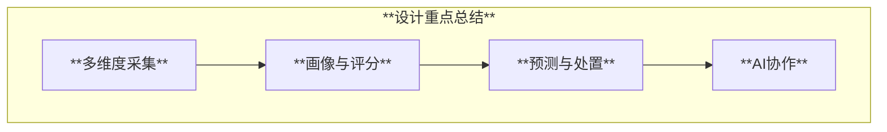

# Node IO Manager 设计方案

## 概述

Node IO Manager 是一个节点级 IO 监控与治理服务，面向 Local PV 过载场景提供多维度采集、画像分析、动态评分、预测告警、自动化工具箱与 AI Agent 协作能力。服务以 DaemonSet 部署，默认导出 Prometheus 指标，同时提供本地结构化 API 与 CLI 访问。

## 目标与非目标

### 目标

- **多维度 IO 统计**：磁盘、Pod、进程、线程维度，包含队列深度、随机/顺序比例、D 状态检测
- **IO 画像与受害者分析**：统计学与 ML 方法并存，可扩展
- **预测与提前处置**：按阈值提前触发告警与工具箱动作
- **动态加权评分与队列**：基于业务重要性、历史行为、最小操作最大收益等因素
- **AI Agent 协作**：Node Manager + IO Expert + Workers

### 非目标

- 替代存储系统原生监控
- 跨节点全局调度优化（聚焦单节点）

## 系统架构

```mermaid
graph TB
    subgraph NodeIOManager["**Node IO Manager**"]
        subgraph DataLayer["**数据采集层**"]
            DiskCollector["**DiskCollector**"]
            ProcCollector["**ProcCollector**"]
            CgroupCollector["**CgroupCollector**"]
            TraceCollector["**TraceCollector**"]
        end
        subgraph AnalysisLayer["**分析引擎层**"]
            ProfileEngine["**IO画像引擎**"]
            VictimAnalyzer["**受害者分析器**"]
            Predictor["**预测引擎**"]
        end
        subgraph ScoringLayer["**评分决策层**"]
            ScoringEngine["**动态评分引擎**"]
            HistoryAnalyzer["**历史行为分析**"]
            ActionSimulator["**操作效果模拟**"]
            DecisionQueue["**决策队列**"]
        end
        subgraph AgentLayer["**AI Agent 层**"]
            NodeManager["**NodeManager**"]
            IOExpert["**IOExpert**"]
            Workers["**Workers**"]
        end
        subgraph ActionLayer["**工具箱层**"]
            IOLimiter["**IO限制**"]
            ScheduleController["**调度控制**"]
            AlertPublisher["**告警发布**"]
            ObservationManager["**观察期管理**"]
        end
        subgraph APILayer["**API层**"]
            MetricsServer["**Metrics**"]
            RESTAPI["**REST API**"]
            CLIClient["**CLI**"]
        end
    end

    DataLayer --> AnalysisLayer
    AnalysisLayer --> ScoringLayer
    ScoringLayer --> AgentLayer
    AgentLayer --> ActionLayer
    ActionLayer -.->|"feedback"| ScoringLayer
    AnalysisLayer --> APILayer
    ScoringLayer --> APILayer
```

## 数据采集设计（最佳实践）

### 数据来源

| 维度 | 数据源 | 指标 |
|:-----|:-------|:-----|
| 磁盘 | `/proc/diskstats`、`/sys/block` | IOPS、带宽、队列深度、util、await |
| Pod | cgroup v2 `io.stat` | 读/写字节、IOPS、限流次数、权重 |
| 进程 | `/proc/[pid]/io`、`/proc/[pid]/stat` | IO计数、状态、等待通道 |
| 线程 | `/proc/[pid]/task/[tid]` | 线程级 IO 与阻塞 |
| IO类型 | eBPF / blktrace | 随机/顺序比例、请求大小分布 |

### 关键采集策略

- **轻量采集优先**：默认以 /proc 与 cgroup 为主，eBPF/trace 为可选增强
- **采样分层**：正常状态低频采样，异常状态自动提升采样频率
- **事件驱动**：D 状态进程数、队列深度突增触发紧急采集

## 指标体系（Metrics）

| 指标 | 类型 | 标签 | 说明 |
|:-----|:-----|:-----|:-----|
| `node_io_disk_iops` | Gauge | device,direction | 磁盘 IOPS |
| `node_io_disk_queue_depth` | Gauge | device | 队列深度 |
| `node_io_disk_latency_ms` | Histogram | device | IO 延迟 |
| `node_io_pod_bytes_total` | Counter | namespace,pod,direction | Pod IO 字节 |
| `node_io_pod_iops` | Gauge | namespace,pod,direction | Pod IOPS |
| `node_io_process_d_state` | Gauge | pid,cmd | D 状态 |
| `node_io_pod_victim_score` | Gauge | namespace,pod | 受害者评分 |
| `node_io_prediction_alert` | Gauge | metric,severity | 预测告警 |
| `node_io_queue_pending_count` | Gauge |  | 待执行队列长度 |

## API 与本地结构化查看

### REST API

- `GET /api/v1/node/summary`：节点 IO 摘要
- `GET /api/v1/pods/top`：Top Pod IO 列表
- `GET /api/v1/pods/{ns}/{name}/profile`：Pod IO 画像
- `GET /api/v1/scoring/pod/{ns}/{name}`：评分详情
- `GET /api/v1/queue`：决策队列
- `POST /api/v1/actions/execute`：执行指定操作

### CLI

- `ioctl node summary`
- `ioctl pod top`
- `ioctl pod profile <ns>/<pod>`
- `ioctl queue list`

## 工具箱能力

| 工具 | 作用 | 实现路径 |
|:-----|:-----|:---------|
| IO 限制 | 对 Pod 施加 IO 限速 | cgroup v2 `io.max` |
| 降级调度 | 禁止新调度 | Node `cordon` |
| 限制突发 | 降低权重 | cgroup `io.weight` |
| 自动告警 | 提前通知 | Prometheus + Webhook |

## AI Agent 设计（参考 @agent-development.md）

### 角色定位

- **Node Manager**：负责任务分发、策略收敛与结果汇总
- **IO Expert**：深度分析与根因诊断
- **Workers**：执行采集、模拟、处置动作

### Agent 触发机制

- 阈值触发：预测 5 分钟内超载
- 异常触发：D 状态突增
- 手动触发：用户 API 调用

## 安全与权限

- **最小权限**：仅允许读取 /proc、cgroup 与节点级 API
- **动作审计**：所有自动处置写入审计日志
- **保护级别**：关键业务 Pod 仅建议不自动处置

## 部署形态

### DaemonSet

- HostPID / HostNetwork 访问采集
- 挂载 `/proc`、`/sys/fs/cgroup`、`/sys/block`

## 总结（含图表）

