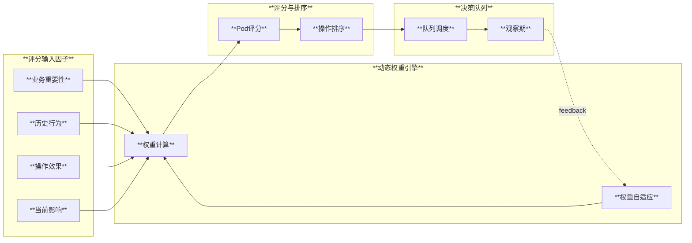
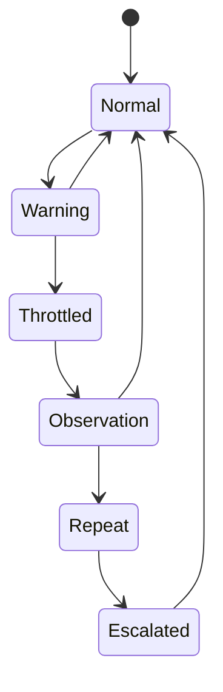
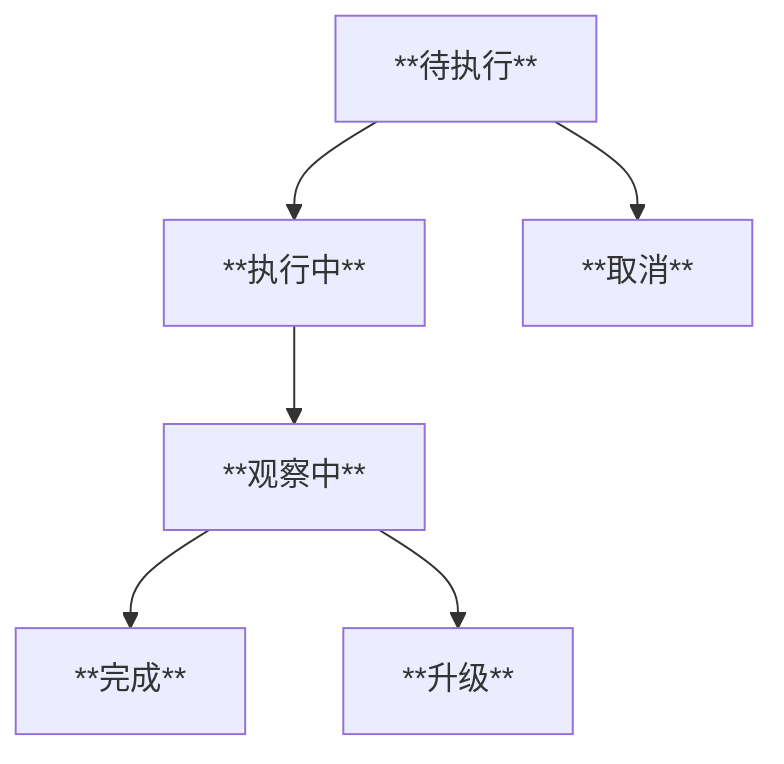
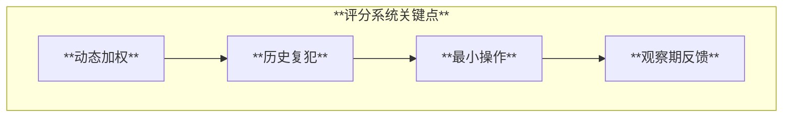

# Node IO Manager 动态评分系统设计

## 目标

在对 Pod 采取限制或调度措施前，基于业务重要性、历史行为、操作效果与当前影响度进行动态加权评分，确保最小操作实现最大收益，并通过观察期与队列机制持续校正策略。

## 评分架构



## 评分因子与权重

| 因子 | 权重范围 | 数据来源 | 说明 |
|:-----|:---------|:---------|:-----|
| **业务重要性 (BI)** | 0.1-0.4 | 外部配置/K8s标签 | 关键业务保护 |
| **历史行为 (HB)** | 0.1-0.3 | 历史记录 | 复犯概率与稳定性 |
| **操作效果 (AE)** | 0.2-0.4 | 模拟器/历史 | 最小操作最大收益 |
| **当前影响 (CI)** | 0.1-0.3 | 实时指标 | 受害者关联与影响 |

## 动态评分公式

```
最终评分 = Σ(因子值 × 动态权重) × 置信度系数

动态权重 = 基础权重 × 历史准确率修正
置信度系数 = f(样本量, 数据新鲜度, 模型表现)
```

## 业务重要性模型

```yaml
apiVersion: io.k8s.manager/v1
kind: BusinessPriority
metadata:
  name: node-io-priority-config
spec:
  namespaces:
    production:
      priority: 100
      protectionLevel: critical
    staging:
      priority: 50
      protectionLevel: medium
    dev:
      priority: 20
      protectionLevel: low
  labelRules:
    - selector:
        matchLabels:
          app.kubernetes.io/tier: "database"
      priority: 90
      protectionLevel: high
  podOverrides:
    - namespace: production
      name: critical-db-*
      priority: 100
      protectionLevel: critical
      neverThrottle: true
```

## 历史行为分析

### 复犯概率模型

- **违规次数**：越多越高
- **最近违规时间**：越近越高
- **恢复速度**：恢复慢则提高风险

### 状态机



## 操作效果评估

### 最小操作最大收益

| 操作 | 预期收益 | 业务成本 | 推荐条件 |
|:-----|:---------|:---------|:---------|
| 轻度限流 | 中 | 低 | 轻度过载 |
| 中度限流 | 高 | 中 | 中度过载 |
| 强制迁移 | 高 | 高 | 持续超载 |

### 模拟方法

- 历史相似案例匹配
- 影响范围估计（受害 Pod 恢复概率）
- 业务代价评估（重要性等级）

## 决策队列与观察期

### 队列状态



### 观察期配置

```yaml
observation:
  defaultDuration: 5m
  minDuration: 1m
  maxDuration: 30m
  successCriteria:
    - metric: disk_util
      operator: "<"
      threshold: 80
      duration: 3m
  escalation:
    - level: 1
      action: increase_throttle_10%
      nextObservation: 5m
```

## 动态权重调整策略

- **准确率高的因子**：权重上调
- **近期失效因子**：权重下调
- **环境变化**：触发权重重标定

## 输出指标（Metrics）

| Metric | 类型 | 说明 |
|:-------|:-----|:-----|
| `node_io_pod_operation_score` | Gauge | Pod 操作评分 |
| `node_io_pod_business_priority` | Gauge | 业务优先级 |
| `node_io_pod_recidivism_probability` | Gauge | 复犯概率 |
| `node_io_queue_pending_count` | Gauge | 待执行队列长度 |
| `node_io_observation_active_count` | Gauge | 活跃观察期数量 |

## 总结（含图表）


