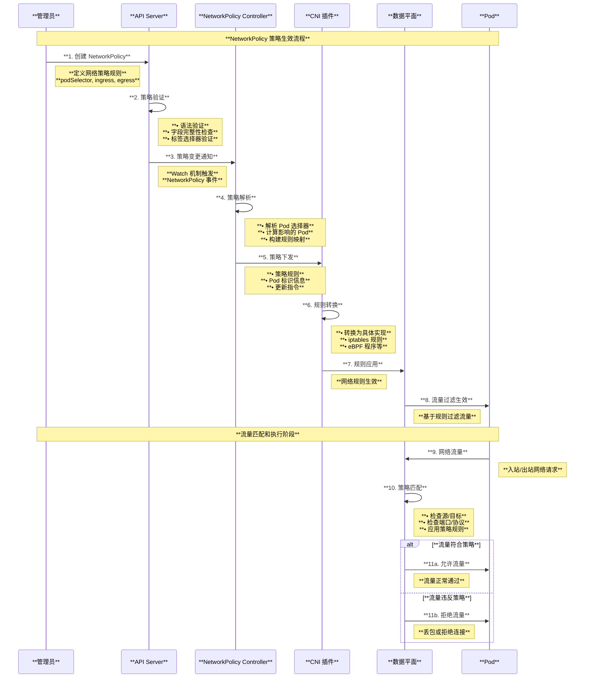
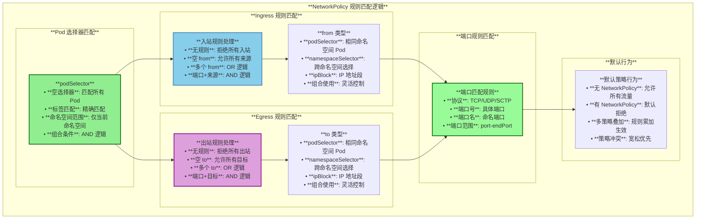
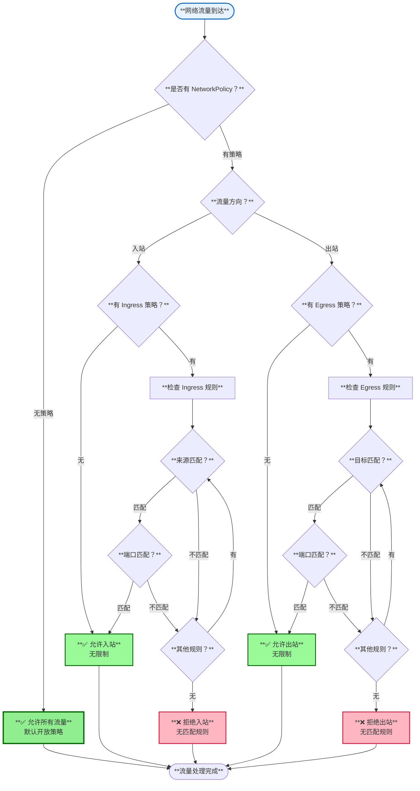
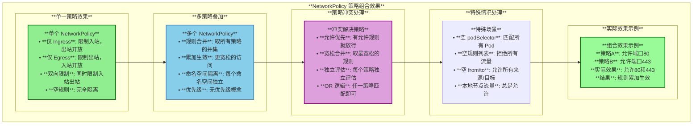
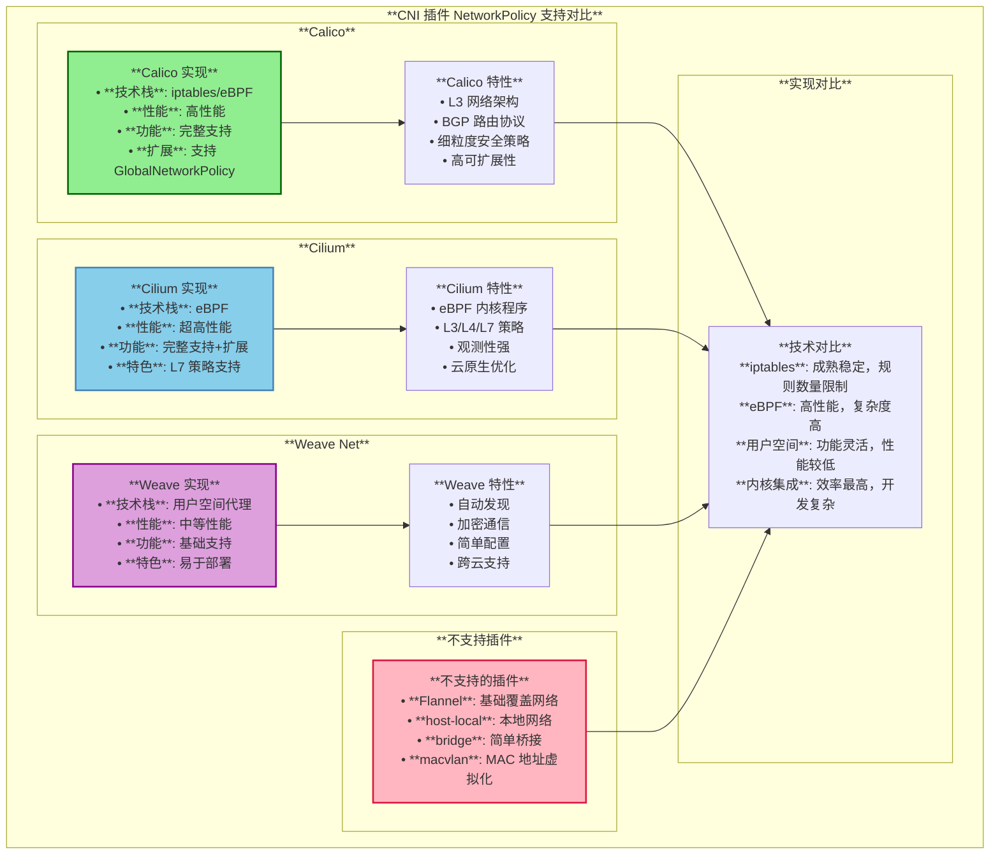
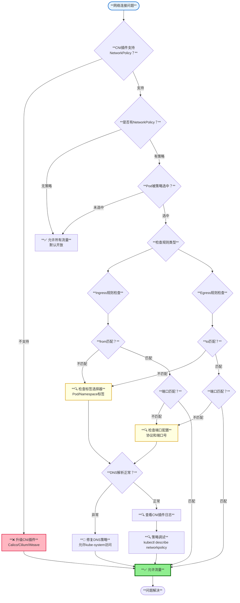

# Kubernetes NetworkPolicy 网络策略深度解读

## 目录

1. [概述](#概述)
2. [NetworkPolicy 核心概念](#networkpolicy-核心概念)
3. [NetworkPolicy 整体架构](#networkpolicy-整体架构)
4. [网络策略规则定义](#网络策略规则定义)
5. [流量控制机制](#流量控制机制)
6. [CNI 插件集成](#cni-插件集成)
7. [实际应用场景](#实际应用场景)
8. [最佳实践与排查](#最佳实践与排查)
9. [总结](#总结)

---

## 概述

NetworkPolicy 是 Kubernetes 中用于定义网络安全策略的资源对象，它通过标签选择器指定作用的 Pod 集合，并定义允许的入站（Ingress）和出站（Egress）流量规则。NetworkPolicy 提供了命名空间级别的网络隔离能力，是构建安全的多租户 Kubernetes 集群的重要组件。本文档基于 Kubernetes 源码深入解读 NetworkPolicy 的架构设计、工作原理和实现机制。

### 核心特性

- **网络隔离**：基于标签选择器的 Pod 网络隔离
- **双向流量控制**：支持 Ingress 和 Egress 规则定义
- **细粒度控制**：支持端口、协议、IP 段等多维度控制
- **命名空间集成**：与 Kubernetes RBAC 和命名空间无缝集成
- **CNI 插件实现**：依赖网络插件具体实现策略执行

---

## NetworkPolicy 核心概念

### 1. NetworkPolicy 资源结构

基于源码 `pkg/apis/networking/types.go`：

```go
type NetworkPolicySpec struct {
    // Pod 选择器 - 指定应用此策略的 Pod
    PodSelector metav1.LabelSelector

    // 入站规则列表
    Ingress []NetworkPolicyIngressRule

    // 出站规则列表  
    Egress []NetworkPolicyEgressRule

    // 策略类型：["Ingress"], ["Egress"], 或 ["Ingress", "Egress"]
    PolicyTypes []PolicyType
}

type NetworkPolicyIngressRule struct {
    // 端口规则
    Ports []NetworkPolicyPort
    
    // 允许的来源
    From []NetworkPolicyPeer
}

type NetworkPolicyEgressRule struct {
    // 端口规则
    Ports []NetworkPolicyPort
    
    // 允许的目标
    To []NetworkPolicyPeer
}
```

### 2. NetworkPolicy 核心架构图

```mermaid
graph TB
    subgraph "**NetworkPolicy 架构全景**"
        
        subgraph "**策略定义层**"
            
            NP_RESOURCE[**NetworkPolicy 资源**<br/>• Pod 选择器<br/>• Ingress 规则<br/>• Egress 规则<br/>• 策略类型]
            
            RULE_TYPES[**规则组件**<br/>• **NetworkPolicyPeer**: 对等体<br/>• **NetworkPolicyPort**: 端口<br/>• **IPBlock**: IP段<br/>• **LabelSelector**: 标签选择器]
        end
        
        subgraph "**Kubernetes 控制平面**"
            
            API_SERVER[**API Server**<br/>• NetworkPolicy API<br/>• 资源验证<br/>• etcd 存储<br/>• 变更通知]
            
            CONTROLLER[**NetworkPolicy Controller**<br/>• 策略监听<br/>• 规则解析<br/>• 事件分发<br/>• 状态同步]
        end
        
        subgraph "**网络插件层**"
            
            CNI_PLUGINS[**CNI 插件**<br/>• **Calico**: iptables/BPF<br/>• **Cilium**: eBPF<br/>• **Weave**: 用户空间<br/>• **Flannel**: 不支持]
            
            POLICY_ENGINE[**策略引擎**<br/>• 规则转换<br/>• 流量过滤<br/>• 连接跟踪<br/>• 策略执行]
        end
        
        subgraph "**数据平面**"
            
            NETWORK_STACK[**网络栈**<br/>• iptables 规则<br/>• eBPF 程序<br/>• 内核网络过滤<br/>• 流量转发]
            
            POD_NETWORK[**Pod 网络**<br/>• 虚拟网卡<br/>• 网络命名空间<br/>• 路由表<br/>• 防火墙规则]
        end
        
        subgraph "**流量流向**"
            
            INGRESS_TRAFFIC[**入站流量**<br/>• 外部→Pod<br/>• Pod→Pod<br/>• Service→Pod<br/>• 规则匹配]
            
            EGRESS_TRAFFIC[**出站流量**<br/>• Pod→外部<br/>• Pod→Pod<br/>• Pod→Service<br/>• 规则匹配]
        end
    end
    
    NP_RESOURCE --> API_SERVER
    RULE_TYPES --> NP_RESOURCE
    API_SERVER --> CONTROLLER
    
    CONTROLLER --> CNI_PLUGINS
    CNI_PLUGINS --> POLICY_ENGINE
    POLICY_ENGINE --> NETWORK_STACK
    
    NETWORK_STACK --> POD_NETWORK
    POD_NETWORK --> INGRESS_TRAFFIC
    POD_NETWORK --> EGRESS_TRAFFIC
    
    style NP_RESOURCE fill:#90EE90,stroke:#006400,stroke-width:2px
    style CNI_PLUGINS fill:#87CEEB,stroke:#4682B4,stroke-width:2px
    style POLICY_ENGINE fill:#DDA0DD,stroke:#8B008B,stroke-width:2px
    style POD_NETWORK fill:#98FB98,stroke:#006400,stroke-width:2px
```



---

## NetworkPolicy 整体架构

### 1. 网络策略处理流程



---

## 网络策略规则定义

### 1. 策略类型与规则

```yaml
apiVersion: networking.k8s.io/v1
kind: NetworkPolicy
metadata:
  name: example-policy
  namespace: default
spec:
  # 选择应用此策略的 Pod
  podSelector:
    matchLabels:
      app: web
  
  # 策略类型
  policyTypes:
  - Ingress
  - Egress
  
  # 入站规则
  ingress:
  - from:
    # 允许来自特定命名空间的 Pod
    - namespaceSelector:
        matchLabels:
          name: frontend
    # 允许来自特定 Pod
    - podSelector:
        matchLabels:
          app: api
    # 允许来自特定 IP 段
    - ipBlock:
        cidr: 10.0.0.0/16
        except:
        - 10.0.1.0/24
    ports:
    - protocol: TCP
      port: 80
    - protocol: TCP
      port: 443
  
  # 出站规则
  egress:
  - to:
    - podSelector:
        matchLabels:
          app: database
    ports:
    - protocol: TCP
      port: 3306
```

### 2. 规则匹配逻辑图



---

## 流量控制机制

### 1. 流量匹配决策树



### 2. 策略组合效果



---

## CNI 插件集成

### 1. 主流 CNI 插件对 NetworkPolicy 的支持



---

## 实际应用场景

### 1. 典型使用场景配置

#### **场景一：微服务隔离**

```yaml
# 前端服务只能访问API服务
apiVersion: networking.k8s.io/v1
kind: NetworkPolicy
metadata:
  name: frontend-netpol
  namespace: production
spec:
  podSelector:
    matchLabels:
      tier: frontend
  policyTypes:
  - Egress
  egress:
  # 只允许访问API服务
  - to:
    - podSelector:
        matchLabels:
          tier: api
    ports:
    - protocol: TCP
      port: 8080
  # 允许DNS查询
  - to: []
    ports:
    - protocol: UDP
      port: 53
```

#### **场景二：数据库安全访问**

```yaml
# 数据库只允许来自API层的访问
apiVersion: networking.k8s.io/v1
kind: NetworkPolicy
metadata:
  name: database-netpol
  namespace: production
spec:
  podSelector:
    matchLabels:
      tier: database
  policyTypes:
  - Ingress
  ingress:
  # 只允许API层访问
  - from:
    - podSelector:
        matchLabels:
          tier: api
    ports:
    - protocol: TCP
      port: 3306
  # 允许来自监控命名空间的访问
  - from:
    - namespaceSelector:
        matchLabels:
          name: monitoring
    ports:
    - protocol: TCP
      port: 9104
```

#### **场景三：命名空间隔离**

```yaml
# 拒绝所有跨命名空间流量
apiVersion: networking.k8s.io/v1
kind: NetworkPolicy
metadata:
  name: deny-cross-namespace
  namespace: production
spec:
  podSelector: {}  # 匹配所有Pod
  policyTypes:
  - Ingress
  - Egress
  ingress:
  # 只允许同命名空间内的流量
  - from:
    - podSelector: {}
  egress:
  # 只允许访问同命名空间内的Pod
  - to:
    - podSelector: {}
  # 允许DNS查询
  - to:
    - namespaceSelector:
        matchLabels:
          name: kube-system
    ports:
    - protocol: UDP
      port: 53
```

### 2. 策略设计最佳实践

```mermaid
graph TB
    subgraph "**NetworkPolicy 最佳实践指南**"
        
        subgraph "**设计原则**"
            
            DESIGN_PRINCIPLES[**策略设计原则**<br/>• **最小权限原则**: 只开放必需的访问<br/>• **分层防护**: 多层安全策略<br/>• **明确拒绝**: 显式拒绝不需要的流量<br/>• **渐进实施**: 逐步收紧策略]
        end
        
        subgraph "**标签策略**"
            
            LABEL_STRATEGY[**标签使用策略**<br/>• **一致性命名**: 统一标签规范<br/>• **层级标签**: tier, app, version<br/>• **环境标签**: prod, staging, dev<br/>• **功能标签**: frontend, api, database]
        end
        
        subgraph "**测试验证**"
            
            TESTING[**策略测试方法**<br/>• **连通性测试**: 验证允许的连接<br/>• **隔离测试**: 验证拒绝的连接<br/>• **端口测试**: 验证端口级访问<br/>• **回归测试**: 确保策略变更安全]
        end
        
        subgraph "**监控告警**"
            
            MONITORING[**监控和告警**<br/>• **策略违规**: 监控被拒绝的连接<br/>• **异常流量**: 检测异常网络行为<br/>• **策略覆盖**: 确保策略完整覆盖<br/>• **性能影响**: 监控策略对性能的影响]
        end
        
        subgraph "**运维管理**"
            
            OPERATIONS[**运维实践**<br/>• **版本控制**: 策略配置版本管理<br/>• **变更管理**: 策略变更流程<br/>• **文档维护**: 策略文档同步更新<br/>• **应急预案**: 策略故障处理流程]
        end
        
        subgraph "**性能优化**"
            
            PERFORMANCE[**性能优化建议**<br/>• **规则简化**: 避免过于复杂的规则<br/>• **选择器优化**: 高效的标签选择器<br/>• **策略合并**: 合并相似的策略<br/>• **插件选择**: 选择高性能CNI插件]
        end
    end
    
    DESIGN_PRINCIPLES --> LABEL_STRATEGY
    LABEL_STRATEGY --> TESTING
    TESTING --> MONITORING
    MONITORING --> OPERATIONS
    OPERATIONS --> PERFORMANCE
    
    style DESIGN_PRINCIPLES fill:#90EE90,stroke:#006400,stroke-width:2px
    style LABEL_STRATEGY fill:#87CEEB,stroke:#4682B4,stroke-width:2px
    style TESTING fill:#DDA0DD,stroke:#8B008B,stroke-width:2px
    style MONITORING fill:#98FB98,stroke:#006400,stroke-width:2px
    style PERFORMANCE fill:#FFE4B5,stroke:#FF8C00,stroke-width:2px
```



---

## 最佳实践与排查

### 1. 常见问题排查流程



### 2. 调试和验证工具

#### **连通性测试脚本**

```bash
#!/bin/bash
# NetworkPolicy 连通性测试

# 测试函数
test_connection() {
    local from_pod=$1
    local to_pod=$2  
    local port=$3
    local expected=$4
    
    echo "测试 $from_pod -> $to_pod:$port"
    
    # 执行连接测试
    result=$(kubectl exec $from_pod -- nc -z -w 3 $to_pod $port 2>&1)
    
    if [[ $? -eq 0 ]]; then
        echo "✅ 连接成功"
        [[ "$expected" == "allow" ]] && echo "  符合预期" || echo "  ⚠️  意外成功"
    else
        echo "❌ 连接失败"
        [[ "$expected" == "deny" ]] && echo "  符合预期" || echo "  ⚠️  意外失败"
    fi
}

# 测试场景
test_connection "frontend-pod" "api-service" "8080" "allow"
test_connection "frontend-pod" "database-service" "3306" "deny"
test_connection "api-pod" "database-service" "3306" "allow"
```

#### **策略验证命令**

```bash
# 查看 NetworkPolicy 详情
kubectl describe networkpolicy <policy-name> -n <namespace>

# 查看 Pod 标签
kubectl get pods --show-labels -n <namespace>

# 查看命名空间标签  
kubectl get namespaces --show-labels

# 检查 CNI 插件状态
kubectl get pods -n kube-system | grep -E "(calico|cilium|weave)"

# 查看 NetworkPolicy 事件
kubectl get events -n <namespace> | grep NetworkPolicy
```

---

## 总结

NetworkPolicy 是 Kubernetes 中实现网络安全隔离的重要机制，它通过声明式的规则定义，为集群提供了细粒度的网络访问控制能力。NetworkPolicy 的成功实施需要 CNI 插件的支持，并且需要合理的策略设计和持续的监控维护。

### 核心价值

1. **安全隔离**：提供命名空间和 Pod 级别的网络隔离
2. **细粒度控制**：支持基于标签、端口、协议的精确控制
3. **声明式管理**：通过 YAML 配置实现策略即代码
4. **多租户支持**：为多租户集群提供网络安全边界
5. **合规支持**：满足企业安全合规要求

### 技术特点

- **标签驱动**：基于 Kubernetes 标签系统的灵活选择机制
- **双向控制**：同时支持入站和出站流量控制
- **策略叠加**：支持多个策略的组合生效
- **CNI 集成**：与主流 CNI 插件深度集成
- **性能优化**：通过内核级别的流量过滤保证高性能

NetworkPolicy 的正确使用能够显著提升 Kubernetes 集群的安全性，但需要注意选择支持的 CNI 插件，合理设计策略规则，并建立完善的测试和监控体系。在微服务架构和多租户场景中，NetworkPolicy 是不可或缺的安全组件。

