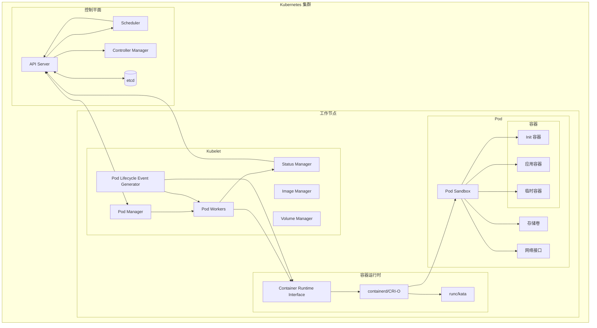
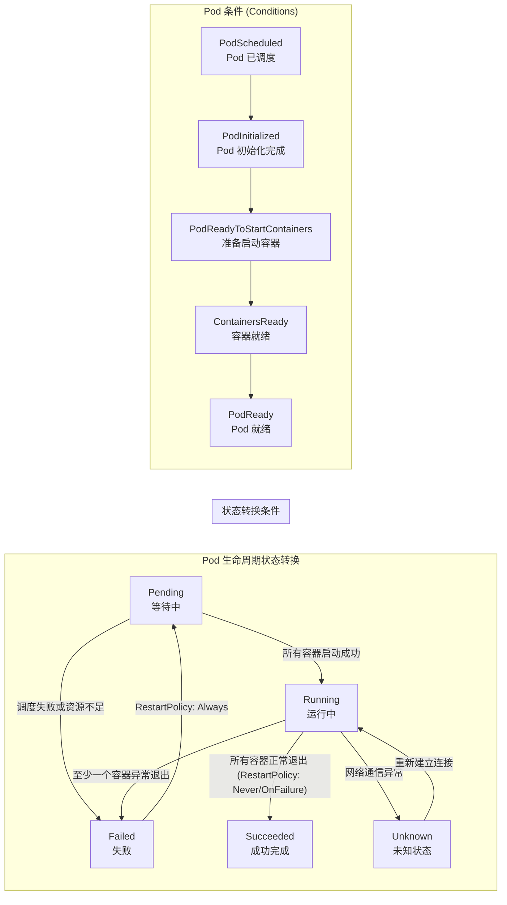
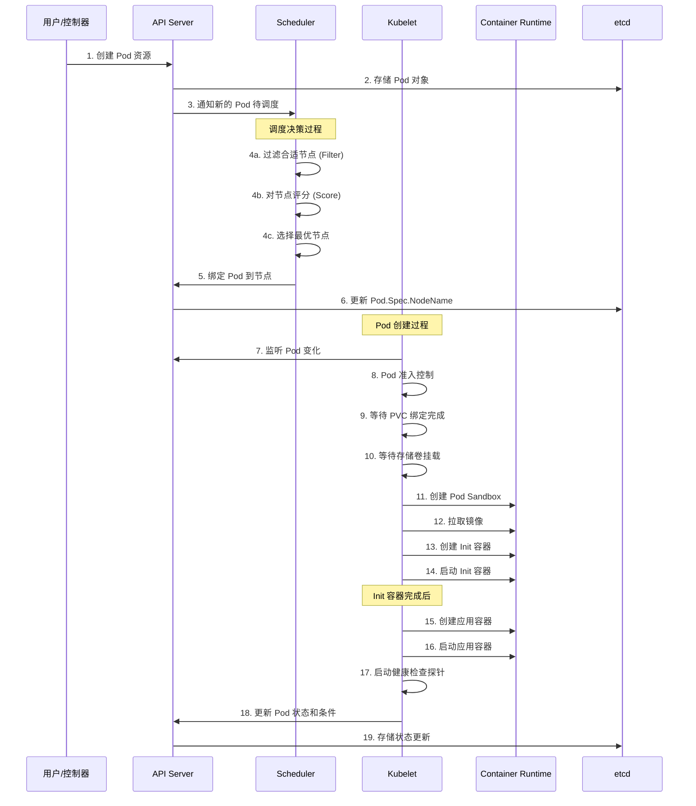
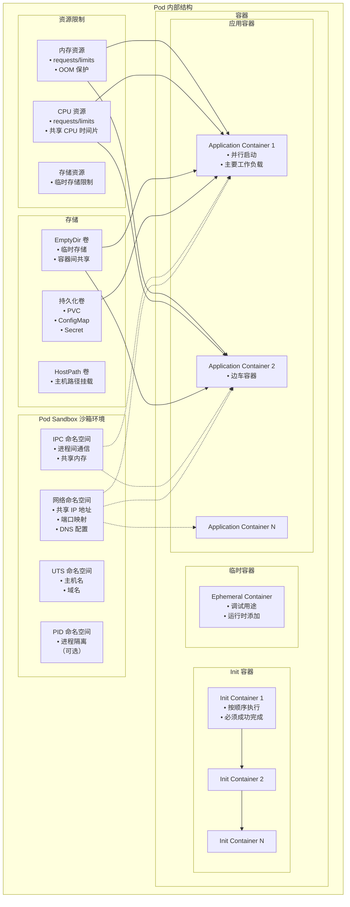
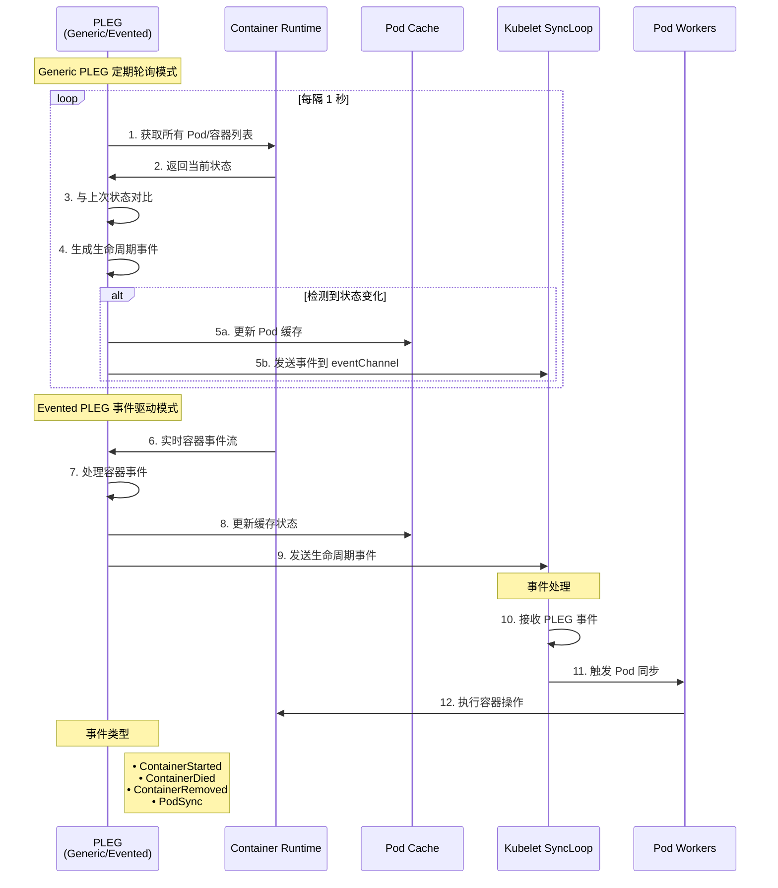
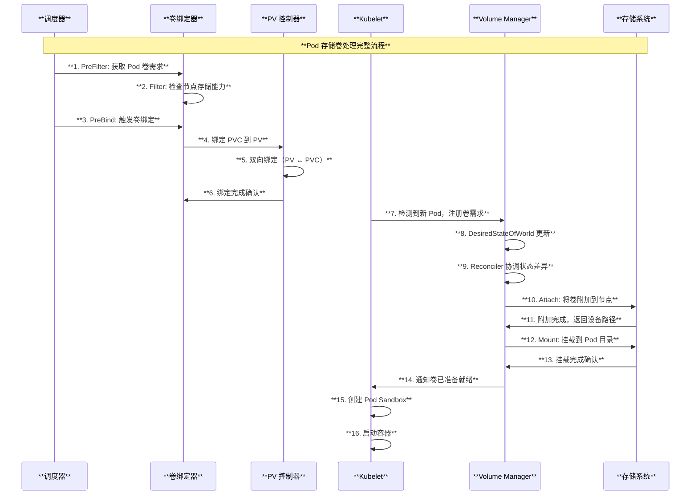
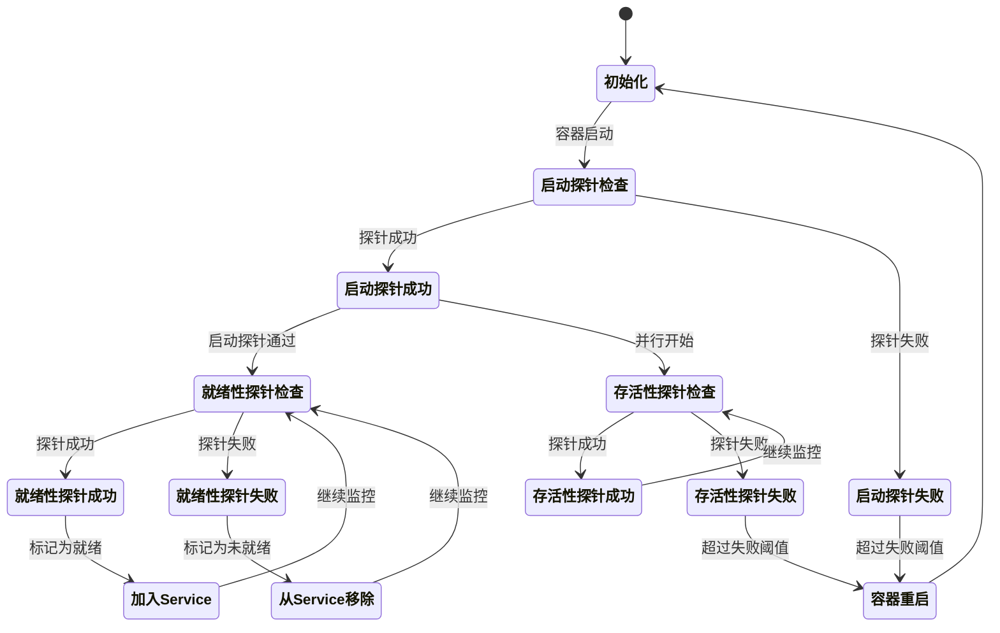

# Kubernetes Pod 架构与原理深度解读

## 目录

1. [概述](#概述)
2. [Pod 的核心概念](#pod-的核心概念)
3. [Pod 架构图](#pod-架构图)
4. [Pod 数据结构与源码分析](#pod-数据结构与源码分析)
5. [Pod 生命周期详解](#pod-生命周期详解)
6. [Pod 调度流程](#pod-调度流程)
7. [Pod 内部结构](#pod-内部结构)
8. [Pod 生命周期事件生成器 (PLEG)](#pod-生命周期事件生成器-pleg)
9. [Pod 在 Kubelet 中的管理](#pod-在-kubelet-中的管理)
10. [容器运行时接口 (CRI)](#容器运行时接口-cri)
11. [总结](#总结)

---

## 概述

Pod 是 Kubernetes 中最小的可部署和可管理的计算单元。本文档基于 Kubernetes 源码深入解读 Pod 的架构设计、工作原理、生命周期管理以及与各组件的交互机制。

### 核心特性

- **最小调度单元**：Pod 是 Kubernetes 调度的原子单位
- **共享资源**：Pod 内容器共享网络、存储和部分命名空间
- **短暂性**：Pod 被设计为短暂的、可替换的资源
- **声明式管理**：通过期望状态与实际状态的协调实现管理

---

## Pod 的核心概念

### 1. Pod 的定义

根据源码 `pkg/apis/core/types.go`：

```go
// Pod is a collection of containers, used as either input (create, update) or as output (list, get).
type Pod struct {
    metav1.TypeMeta
    // +optional
    metav1.ObjectMeta

    // Spec defines the behavior of a pod.
    // +optional
    Spec PodSpec

    // Status represents the current information about a pod. This data may not be up
    // to date.
    // +optional
    Status PodStatus
}
```

### 2. 核心组件

- **PodSpec**：定义 Pod 的期望状态
- **PodStatus**：记录 Pod 的实际状态
- **容器列表**：包括 Init 容器、应用容器和临时容器
- **存储卷**：Pod 级别的存储资源
- **网络配置**：IP 地址、端口映射等

---

## Pod 架构图

### 整体架构



---

## Pod 数据结构与源码分析

### 1. PodSpec 结构

基于 `pkg/apis/core/types.go` 的 PodSpec 定义：

```go
type PodSpec struct {
    // 存储卷定义
    Volumes []Volume
    
    // Init 容器 - 按顺序执行，必须成功完成
    InitContainers []Container
    
    // 应用容器 - 并行启动
    Containers []Container
    
    // 临时容器 - 用于调试
    EphemeralContainers []EphemeralContainer
    
    // 重启策略
    RestartPolicy RestartPolicy
    
    // 优雅终止时间（秒）
    TerminationGracePeriodSeconds *int64
    
    // DNS 策略
    DNSPolicy DNSPolicy
    
    // 节点选择器
    NodeSelector map[string]string
    
    // 服务账号
    ServiceAccountName string
    
    // 安全上下文
    SecurityContext *PodSecurityContext
    
    // 调度器名称
    SchedulerName string
    
    // 优先级类名
    PriorityClassName string
    
    // 亲和性规则
    Affinity *Affinity
    
    // 容忍度
    Tolerations []Toleration
    
    // 主机别名
    HostAliases []HostAlias
}
```

### 2. PodStatus 结构

```go
type PodStatus struct {
    // Pod 阶段
    Phase PodPhase
    
    // 条件列表
    Conditions []PodCondition
    
    // 消息和原因
    Message string
    Reason string
    
    // IP 地址信息
    HostIP string
    PodIP string
    PodIPs []PodIP
    
    // 开始时间
    StartTime *metav1.Time
    
    // QoS 类别
    QOSClass PodQOSClass
    
    // 容器状态
    InitContainerStatuses []ContainerStatus
    ContainerStatuses []ContainerStatus
    EphemeralContainerStatuses []ContainerStatus
}
```

### 3. Pod 阶段定义

根据源码中的定义，Pod 有以下五个阶段：

```go
const (
    // Pod 已被接受但容器尚未启动
    PodPending PodPhase = "Pending"
    
    // Pod 已绑定到节点且所有容器都已创建，至少一个容器在运行
    PodRunning PodPhase = "Running"
    
    // 所有容器都成功终止且不会重启
    PodSucceeded PodPhase = "Succeeded"
    
    // 所有容器都已终止，至少一个容器失败
    PodFailed PodPhase = "Failed"
    
    // 无法获取 Pod 状态（已弃用）
    PodUnknown PodPhase = "Unknown"
)
```

---

## Pod 生命周期详解

### 生命周期状态图



### Pod 条件类型

基于源码分析，Pod 具有以下条件类型：

1. **PodScheduled**: Pod 已被调度到节点
2. **PodInitialized**: 所有 Init 容器成功完成
3. **PodReadyToStartContainers**: Pod 沙箱成功创建，网络配置完成
4. **ContainersReady**: Pod 中所有容器都准备就绪
5. **PodReady**: Pod 能够处理请求，所有就绪性检查通过

### 生命周期阶段详解

#### 1. Pending 阶段
- Pod 已创建并存储在 etcd 中
- 等待调度器分配节点
- 等待镜像拉取
- 等待存储卷挂载

#### 2. Running 阶段  
- Pod 已调度到节点
- 至少一个容器正在运行或正在重启
- Init 容器已成功完成

#### 3. Succeeded 阶段
- 所有容器正常退出（退出码为 0）
- RestartPolicy 为 Never 或 OnFailure

#### 4. Failed 阶段
- 至少一个容器以非零退出码终止
- 或被系统强制终止

---

## Pod 调度流程

### 调度序列图



### 调度决策过程

#### 1. 过滤阶段 (Filter)
基于源码 `pkg/scheduler/eventhandlers.go`，调度器执行以下过滤：

- **资源过滤**: 检查 CPU、内存、GPU 等资源是否足够
- **节点选择器**: 验证 `nodeSelector` 标签匹配
- **亲和性规则**: 检查节点亲和性和 Pod 亲和性
- **污点容忍**: 验证 Pod 是否容忍节点污点
- **端口冲突**: 检查 `hostPort` 是否冲突

#### 2. 评分阶段 (Score)  
- **资源平衡**: 优先选择资源使用率均衡的节点
- **亲和性评分**: 基于亲和性规则给节点打分
- **镜像位置**: 优先选择已有镜像的节点
- **拓扑分布**: 确保 Pod 在可用区间均匀分布

### 准入控制

在 Pod 被调度后，Kubelet 会执行多个准入控制器：

1. **资源准入**: 检查节点资源是否充足
2. **污点检查**: 验证 NoExecute 污点容忍度
3. **镜像策略**: 验证镜像拉取策略
4. **安全策略**: 检查 SecurityContext 限制

---

## Pod 内部结构

### Pod 内部架构图



### Pod Sandbox

基于源码 `pkg/kubelet/kuberuntime/kuberuntime_sandbox.go`：

Pod Sandbox 是 Pod 的基础运行环境，提供：

1. **网络隔离**: 每个 Pod 拥有独立的网络栈
2. **存储挂载点**: 为容器提供存储卷挂载
3. **IPC 命名空间**: 容器间可通过 System V IPC 或 POSIX 消息队列通信
4. **UTS 命名空间**: 独立的主机名和域名设置

### 容器类型

#### 1. Init 容器
- **执行顺序**: 按定义顺序串行执行
- **成功条件**: 必须成功完成才能启动应用容器
- **使用场景**: 初始化、配置、等待依赖服务

#### 2. 应用容器
- **并行启动**: 同时启动所有应用容器
- **主要负载**: 承载业务逻辑
- **生命周期**: 与 Pod 生命周期绑定

#### 3. 临时容器
- **调试用途**: 用于故障排查和调试
- **运行时添加**: 不需要重启 Pod
- **临时性**: 不影响 Pod 重启

---

## Pod 生命周期事件生成器 (PLEG)

### PLEG 工作流程



### PLEG 类型对比

#### Generic PLEG
基于源码 `pkg/kubelet/pleg/generic.go`：

- **轮询机制**: 每秒查询容器运行时获取状态
- **状态比较**: 与上次状态进行对比生成事件
- **资源开销**: CPU 使用较高，适合小规模集群

```go
// Relist 查询容器运行时状态并生成事件
func (g *GenericPLEG) Relist() {
    // 获取所有 Pod
    podList, err := g.runtime.GetPods(ctx, true)
    
    // 与历史状态比较
    eventsByPodID := map[types.UID][]*PodLifecycleEvent{}
    for pid := range g.podRecords {
        oldPod := g.podRecords.getOld(pid)
        pod := g.podRecords.getCurrent(pid)
        // 计算事件
        events := computeEvents(oldPod, pod, &container.ID)
    }
    
    // 发送事件
    for _, events := range eventsByPodID {
        for _, event := range events {
            g.eventChannel <- event
        }
    }
}
```

#### Evented PLEG  
基于源码 `pkg/kubelet/pleg/evented.go`：

- **事件驱动**: 通过 CRI 事件流获取实时状态变化
- **低延迟**: 容器状态变化立即触发事件
- **效率优化**: CPU 使用更低，适合大规模集群

### 事件类型

1. **ContainerStarted**: 容器启动成功
2. **ContainerDied**: 容器退出
3. **ContainerRemoved**: 容器被删除
4. **PodSync**: 需要同步 Pod 状态

---

## Pod 在 Kubelet 中的管理

### 核心组件

#### 1. Pod Manager
基于源码 `pkg/kubelet/pod/pod_manager.go`：

- **功能**: 管理 Pod 的内存状态和索引
- **静态 Pod**: 处理静态 Pod 和镜像 Pod 的映射关系
- **并发安全**: 提供线程安全的 Pod 操作接口

```go
type Manager interface {
    GetPodByUID(types.UID) (*v1.Pod, bool)
    GetPods() []*v1.Pod
    AddPod(pod *v1.Pod)
    UpdatePod(pod *v1.Pod)
    RemovePod(pod *v1.Pod)
}
```

#### 2. Pod Workers
基于源码 `pkg/kubelet/pod_workers.go`：

Pod Workers 是 Pod 生命周期管理的核心，每个 Pod 都有对应的 Worker：

```go
type PodWorkerState int

const (
    // 同步中：Pod 应该运行
    SyncPod PodWorkerState = iota
    // 终止中：Pod 正在停止容器
    TerminatingPod
    // 已终止：Pod 已停止，需要清理资源
    TerminatedPod
)
```

**工作流程**：
1. **syncPod**: 确保 Pod 达到期望状态
2. **syncTerminatingPod**: 停止所有容器  
3. **syncTerminatedPod**: 清理 Pod 资源

#### 3. Status Manager
基于源码 `pkg/kubelet/status/status_manager.go`：

- **状态同步**: 将本地 Pod 状态同步到 API Server
- **版本控制**: 使用版本号避免状态冲突
- **批量更新**: 优化 API 调用频率

### Pod 同步过程

Kubelet 的 `SyncPod` 方法是 Pod 管理的核心：

1. **生成 API 状态**: 基于容器状态生成 PodStatus
2. **准入检查**: 验证 Pod 是否可以在节点运行
3. **创建数据目录**: 为 Pod 创建必要的目录结构
4. **等待存储卷**: 确保 PVC 已绑定并可用
5. **获取镜像拉取密钥**: 处理私有镜像仓库认证
6. **调用容器运行时**: 通过 CRI 创建 Pod 和容器
7. **配置网络**: 设置 Pod 网络和 QoS

---

## Pod 存储卷处理机制

### 1. PVC 绑定与调度集成

在 Pod 调度阶段，VolumeBinding 调度插件确保 Pod 的存储需求得到满足。基于源码 `pkg/scheduler/framework/plugins/volumebinding/volume_binding.go`：

```go
// PreBind 阶段：绑定 Pod 所需的卷
func (pl *VolumeBinding) PreBind(ctx context.Context, cs *framework.CycleState, pod *v1.Pod, nodeName string) *framework.Status {
    s, err := getStateData(cs)
    if err != nil {
        return framework.AsStatus(err)
    }
    
    if s.allBound {
        // 所有卷都已绑定，无需处理
        return nil
    }
    
    // 获取该节点的卷信息
    podVolumes, ok := s.podVolumesByNode[nodeName]
    if !ok {
        return framework.AsStatus(fmt.Errorf("no pod volumes found for node %q", nodeName))
    }
    
    // 执行卷绑定
    err = pl.Binder.BindPodVolumes(ctx, pod, podVolumes)
    if err != nil {
        return framework.AsStatus(err)
    }
    
    return nil
}
```

### 2. Volume Manager 架构

基于源码 `pkg/kubelet/volumemanager/volume_manager.go`，Volume Manager 是 Kubelet 中负责卷管理的核心组件：

```mermaid
graph TB
    subgraph "**Volume Manager 架构**"
        style subgraph fill:#f9f9f9,stroke:#333,stroke-width:2px
        
        subgraph "**期望状态管理**"
            style subgraph fill:#e6f3ff,stroke:#0066cc,stroke-width:2px
            
            DSW_POPULATOR[**DesiredStateOfWorld Populator**<br/>• 解析 Pod 规格<br/>• 填充期望状态<br/>• 处理卷引用]
            DSW[**DesiredStateOfWorld**<br/>• 维护期望的卷状态<br/>• 卷到Pod映射<br/>• 挂载路径管理]
        end
        
        subgraph "**实际状态管理**"
            style subgraph fill:#fff2e6,stroke:#cc6600,stroke-width:2px
            
            ASW[**ActualStateOfWorld**<br/>• 跟踪实际卷状态<br/>• 挂载点信息<br/>• 设备路径管理]
        end
        
        subgraph "**协调器**"
            style subgraph fill:#e6ffe6,stroke:#009900,stroke-width:2px
            
            RECONCILER[**Reconciler**<br/>• 状态协调循环<br/>• 触发挂载/卸载操作<br/>• 错误重试机制]
            OP_EXECUTOR[**Operation Executor**<br/>• 异步操作执行<br/>• 卷插件调用<br/>• 操作序列化]
        end
    end
    
    DSW_POPULATOR --> DSW
    DSW --> RECONCILER
    ASW --> RECONCILER
    RECONCILER --> OP_EXECUTOR
```

### 3. 卷等待和挂载流程

```go
// WaitForAttachAndMount 等待所有卷挂载完成
func (vm *volumeManager) WaitForAttachAndMount(ctx context.Context, pod *v1.Pod) error {
    if pod == nil {
        return nil
    }
    
    expectedVolumes := getExpectedVolumes(pod)
    if len(expectedVolumes) == 0 {
        // 没有卷需要验证
        return nil
    }
    
    klog.V(3).InfoS("Waiting for volumes to attach and mount for pod", "pod", klog.KObj(pod))
    uniquePodName := util.GetUniquePodName(pod)
    
    // 重新处理 Pod 以支持动态更新的卷
    vm.desiredStateOfWorldPopulator.ReprocessPod(uniquePodName)
    
    // 轮询等待卷挂载完成，超时时间为 2 分钟
    err := wait.PollUntilContextTimeout(
        ctx,
        podAttachAndMountRetryInterval,  // 300ms
        podAttachAndMountTimeout,        // 2分钟+3秒
        true,
        vm.verifyVolumesMountedFunc(uniquePodName, expectedVolumes))
    
    if err != nil {
        // 收集未挂载的卷信息用于错误报告
        unmountedVolumes := vm.getUnmountedVolumes(uniquePodName, expectedVolumes)
        unattachedVolumes := vm.getUnattachedVolumes(uniquePodName)
        volumesNotInDSW := vm.getVolumesNotInDSW(uniquePodName, expectedVolumes)
        
        return fmt.Errorf(
            "unmounted volumes=%v, unattached volumes=%v, failed to process volumes=%v: %w",
            unmountedVolumes, unattachedVolumes, volumesNotInDSW, err)
    }
    
    klog.V(3).InfoS("All volumes are attached and mounted for pod", "pod", klog.KObj(pod))
    return nil
}
```

### 4. PVC 绑定状态检查

```go
// isPVCFullyBound 检查 PVC 是否完全绑定
func (b *volumeBinder) isPVCFullyBound(pvc *v1.PersistentVolumeClaim) bool {
    // PVC 必须同时满足以下条件才算完全绑定：
    // 1. 指定了 VolumeName（绑定到具体的 PV）
    // 2. 包含绑定完成的注解
    return pvc.Spec.VolumeName != "" && 
           metav1.HasAnnotation(pvc.ObjectMeta, volume.AnnBindCompleted)
}
```

### 5. 卷处理时序图



---

## Pod 健康检查与状态探测

### 1. 探针类型概述

Kubernetes 支持三种类型的健康检查探针：

#### 1.1 存活性探针 (Liveness Probe)
- **目的**：确定容器是否正在运行
- **失败行为**：重启容器
- **适用场景**：检测死锁、内存泄漏等问题

#### 1.2 就绪性探针 (Readiness Probe)  
- **目的**：确定容器是否准备好接收流量
- **失败行为**：从 Service 端点中移除 Pod
- **适用场景**：应用启动、配置加载、依赖服务检查

#### 1.3 启动探针 (Startup Probe)
- **目的**：确定容器内应用程序是否已启动
- **失败行为**：重启容器，阻止其他探针执行
- **适用场景**：慢启动容器、遗留应用适配

### 2. 探针数据结构

基于源码 `staging/src/k8s.io/api/core/v1/types.go`：

```go
// Probe 描述健康检查探针
type Probe struct {
    // 探针处理器（HTTP、TCP、执行命令等）
    ProbeHandler `json:",inline"`
    
    // 初始延迟时间（秒）
    InitialDelaySeconds int32 `json:"initialDelaySeconds,omitempty"`
    
    // 超时时间（秒）
    TimeoutSeconds int32 `json:"timeoutSeconds,omitempty"`
    
    // 检查周期（秒）
    PeriodSeconds int32 `json:"periodSeconds,omitempty"`
    
    // 成功阈值
    SuccessThreshold int32 `json:"successThreshold,omitempty"`
    
    // 失败阈值
    FailureThreshold int32 `json:"failureThreshold,omitempty"`
    
    // 探针失败时的优雅终止期限
    TerminationGracePeriodSeconds *int64 `json:"terminationGracePeriodSeconds,omitempty"`
}
```

### 3. 探针管理器架构

基于源码 `pkg/kubelet/prober/prober_manager.go`：

```go
// Manager 接口定义探针管理功能
type Manager interface {
    // 添加 Pod 的探针
    AddPod(pod *v1.Pod)
    
    // 移除 Pod 的探针
    RemovePod(pod *v1.Pod)
    
    // 停止存活性和启动探针
    StopLivenessAndStartup(pod *v1.Pod)
    
    // 更新 Pod 状态
    UpdatePodStatus(podUID types.UID, podStatus *v1.PodStatus)
}

// AddPod 为 Pod 中的每个容器创建探针 Worker
func (m *manager) AddPod(pod *v1.Pod) {
    m.workerLock.Lock()
    defer m.workerLock.Unlock()
    
    key := probeKey{podUID: pod.UID}
    for _, c := range append(pod.Spec.Containers, getRestartableInitContainers(pod)...) {
        key.containerName = c.Name
        
        // 创建启动探针 Worker
        if c.StartupProbe != nil {
            key.probeType = startup
            w := newWorker(m, startup, pod, c)
            m.workers[key] = w
            go w.run()
        }
        
        // 创建就绪性探针 Worker
        if c.ReadinessProbe != nil {
            key.probeType = readiness
            w := newWorker(m, readiness, pod, c)
            m.workers[key] = w
            go w.run()
        }
        
        // 创建存活性探针 Worker
        if c.LivenessProbe != nil {
            key.probeType = liveness
            w := newWorker(m, liveness, pod, c)
            m.workers[key] = w
            go w.run()
        }
    }
}
```

### 4. 探针执行流程

```mermaid
graph TB
    subgraph "**探针执行架构**"
        style subgraph fill:#f9f9f9,stroke:#333,stroke-width:2px
        
        subgraph "**探针管理器**"
            style subgraph fill:#e6f3ff,stroke:#0066cc,stroke-width:2px
            
            PROBE_MGR[**Probe Manager**<br/>• 管理所有探针 Worker<br/>• 协调探针生命周期<br/>• 处理探针结果]
            
            RESULTS_MGR[**Results Manager**<br/>• 缓存探针结果<br/>• 状态变化通知<br/>• 历史记录管理]
        end
        
        subgraph "**探针 Worker**"
            style subgraph fill:#fff2e6,stroke:#cc6600,stroke-width:2px
            
            STARTUP_WORKER[**Startup Probe Worker**<br/>• 启动时探测<br/>• 阻塞其他探针<br/>• 失败时重启容器]
            
            LIVENESS_WORKER[**Liveness Probe Worker**<br/>• 定期存活性检查<br/>• 检测容器健康状态<br/>• 触发容器重启]
            
            READINESS_WORKER[**Readiness Probe Worker**<br/>• 就绪性检查<br/>• 控制流量路由<br/>• Service 端点管理]
        end
        
        subgraph "**探针执行器**"
            style subgraph fill:#e6ffe6,stroke:#009900,stroke-width:2px
            
            HTTP_PROBER[**HTTP Prober**<br/>• HTTP/HTTPS 请求<br/>• 状态码检查<br/>• 超时控制]
            
            TCP_PROBER[**TCP Prober**<br/>• TCP 连接检查<br/>• 端口可达性测试<br/>• 连接超时处理]
            
            EXEC_PROBER[**Exec Prober**<br/>• 容器内命令执行<br/>• 退出码检查<br/>• 标准输出处理]
        end
        
        subgraph "**状态更新**"
            style subgraph fill:#ffe6f2,stroke:#cc0066,stroke-width:2px
            
            STATUS_MGR[**Status Manager**<br/>• Pod 状态聚合<br/>• 条件更新<br/>• API 同步]
            
            KUBELET[**Kubelet**<br/>• 容器生命周期管理<br/>• 重启决策<br/>• 事件生成]
        end
    end
    
    PROBE_MGR --> STARTUP_WORKER
    PROBE_MGR --> LIVENESS_WORKER  
    PROBE_MGR --> READINESS_WORKER
    
    STARTUP_WORKER --> HTTP_PROBER
    STARTUP_WORKER --> TCP_PROBER
    STARTUP_WORKER --> EXEC_PROBER
    
    LIVENESS_WORKER --> HTTP_PROBER
    LIVENESS_WORKER --> TCP_PROBER
    LIVENESS_WORKER --> EXEC_PROBER
    
    READINESS_WORKER --> HTTP_PROBER
    READINESS_WORKER --> TCP_PROBER
    READINESS_WORKER --> EXEC_PROBER
    
    HTTP_PROBER --> RESULTS_MGR
    TCP_PROBER --> RESULTS_MGR
    EXEC_PROBER --> RESULTS_MGR
    
    RESULTS_MGR --> STATUS_MGR
    STATUS_MGR --> KUBELET
```

### 5. Pod 条件 (Conditions) 管理

基于源码 `pkg/apis/core/types.go`：

```go
// Pod 条件类型常量
const (
    // Pod 已被调度到节点
    PodScheduled PodConditionType = "PodScheduled"
    
    // Pod 能够服务请求，应该被添加到负载均衡池
    PodReady PodConditionType = "Ready"
    
    // 所有 Init 容器成功完成
    PodInitialized PodConditionType = "Initialized"
    
    // Pod 中所有容器都准备就绪
    ContainersReady PodConditionType = "ContainersReady"
    
    // Pod 即将因中断而终止
    DisruptionTarget PodConditionType = "DisruptionTarget"
)

// Pod 条件结构
type PodCondition struct {
    Type               PodConditionType // 条件类型
    Status             ConditionStatus  // 条件状态 (True/False/Unknown)
    LastProbeTime      metav1.Time     // 最后探测时间
    LastTransitionTime metav1.Time     // 最后转换时间
    Reason             string          // 简短原因
    Message            string          // 详细消息
}
```

### 6. 状态更新机制

```go
// UpdatePodCondition 更新 Pod 条件状态
func UpdatePodCondition(status *v1.PodStatus, condition *v1.PodCondition) bool {
    condition.LastTransitionTime = metav1.Now()
    
    // 查找现有条件
    conditionIndex, oldCondition := GetPodCondition(status, condition.Type)
    
    if oldCondition == nil {
        // 添加新条件
        status.Conditions = append(status.Conditions, *condition)
        return true
    }
    
    // 检查条件是否发生变化
    if condition.Status == oldCondition.Status {
        condition.LastTransitionTime = oldCondition.LastTransitionTime
    }
    
    isEqual := condition.Status == oldCondition.Status &&
               condition.Reason == oldCondition.Reason &&
               condition.Message == oldCondition.Message &&
               condition.LastProbeTime.Equal(&oldCondition.LastProbeTime) &&
               condition.LastTransitionTime.Equal(&oldCondition.LastTransitionTime)
    
    status.Conditions[conditionIndex] = *condition
    return !isEqual
}
```

### 7. 探针状态转换图



### 8. 探针配置最佳实践

#### 8.1 启动探针配置
```yaml
# 适合慢启动应用
startupProbe:
  httpGet:
    path: /health
    port: 8080
  initialDelaySeconds: 30    # 启动延迟
  periodSeconds: 10         # 检查间隔
  timeoutSeconds: 1         # 超时时间
  failureThreshold: 30      # 允许失败次数（总启动时间：30*10=300秒）
  successThreshold: 1       # 成功阈值（必须为1）
```

#### 8.2 存活性探针配置
```yaml
# 检测应用死锁
livenessProbe:
  httpGet:
    path: /healthz
    port: 8080
    httpHeaders:
    - name: Custom-Header
      value: health-check
  initialDelaySeconds: 30   # 等待启动探针完成
  periodSeconds: 30        # 较长间隔避免频繁重启
  timeoutSeconds: 5        # 超时时间
  failureThreshold: 3      # 失败阈值
  successThreshold: 1      # 成功阈值（必须为1）
```

#### 8.3 就绪性探针配置
```yaml
# 检测服务可用性
readinessProbe:
  httpGet:
    path: /ready
    port: 8080
  initialDelaySeconds: 5    # 较短延迟快速响应
  periodSeconds: 5         # 频繁检查快速恢复
  timeoutSeconds: 3        # 超时时间
  failureThreshold: 3      # 失败阈值
  successThreshold: 1      # 成功阈值
```

---

## 容器运行时接口 (CRI)

### CRI 架构

基于源码 `staging/src/k8s.io/cri-api/pkg/apis/`：

CRI 定义了 Kubelet 与容器运行时之间的接口：

```protobuf
service RuntimeService {
    // Pod Sandbox 管理
    rpc RunPodSandbox(RunPodSandboxRequest) returns (RunPodSandboxResponse) {}
    rpc StopPodSandbox(StopPodSandboxRequest) returns (StopPodSandboxResponse) {}
    rpc RemovePodSandbox(RemovePodSandboxRequest) returns (RemovePodSandboxResponse) {}
    
    // 容器管理
    rpc CreateContainer(CreateContainerRequest) returns (CreateContainerResponse) {}
    rpc StartContainer(StartContainerRequest) returns (StartContainerResponse) {}
    rpc StopContainer(StopContainerRequest) returns (StopContainerResponse) {}
    rpc RemoveContainer(RemoveContainerRequest) returns (RemoveContainerResponse) {}
}
```

### Pod 沙箱创建过程

基于源码 `pkg/kubelet/kuberuntime/kuberuntime_sandbox.go`：

```go
func (m *kubeGenericRuntimeManager) createPodSandbox(ctx context.Context, pod *v1.Pod, attempt uint32) (string, string, error) {
    // 1. 生成 Pod 沙箱配置
    podSandboxConfig, err := m.generatePodSandboxConfig(pod, attempt)
    
    // 2. 创建日志目录
    err = m.osInterface.MkdirAll(podSandboxConfig.LogDirectory, 0755)
    
    // 3. 确定运行时处理器
    runtimeHandler := ""
    if m.runtimeClassManager != nil {
        runtimeHandler, err = m.runtimeClassManager.LookupRuntimeHandler(pod.Spec.RuntimeClassName)
    }
    
    // 4. 调用容器运行时创建沙箱
    podSandBoxID, err := m.runtimeService.RunPodSandbox(ctx, podSandboxConfig, runtimeHandler)
    
    return podSandBoxID, "", nil
}
```

### 容器创建流程

1. **拉取镜像**: 根据镜像拉取策略下载容器镜像
2. **生成容器配置**: 包括环境变量、挂载点、资源限制等
3. **创建容器**: 调用 CRI CreateContainer
4. **启动容器**: 调用 CRI StartContainer
5. **健康检查**: 配置存活性、就绪性和启动探针

---

## 总结

### Pod 的关键设计原则

1. **原子性**: Pod 作为调度和部署的原子单位
2. **共享性**: 容器共享网络、存储和部分命名空间
3. **短暂性**: Pod 被设计为可替换的临时资源
4. **声明式**: 通过期望状态驱动实际状态收敛

### 核心技术要点

1. **生命周期管理**: 通过 PLEG 监控状态变化，Pod Workers 执行生命周期操作
2. **调度决策**: 多阶段过滤和评分确保 Pod 被调度到最优节点  
3. **容器编排**: Init 容器串行执行，应用容器并行启动
4. **资源隔离**: 通过命名空间、cgroups 等技术实现隔离
5. **状态同步**: Status Manager 确保本地状态与 etcd 中的状态一致

### 性能优化要点

1. **Evented PLEG**: 在大规模集群中使用事件驱动替代轮询
2. **镜像预拉取**: 预先在节点拉取常用镜像
3. **资源预分配**: 合理设置 requests 和 limits
4. **网络优化**: 使用高性能 CNI 插件
5. **存储优化**: 选择合适的存储类型和访问模式

### 故障排查指南

1. **Pod 状态异常**: 检查事件、条件和容器状态
2. **调度失败**: 检查资源限制、污点容忍和亲和性规则  
3. **容器启动失败**: 检查镜像、存储卷和网络配置
4. **性能问题**: 监控资源使用率和 PLEG 健康状态
5. **网络问题**: 检查 CNI 配置和防火墙规则

通过深入理解 Pod 的架构和工作原理，可以更好地设计、部署和维护 Kubernetes 应用，并在遇到问题时快速定位和解决。
