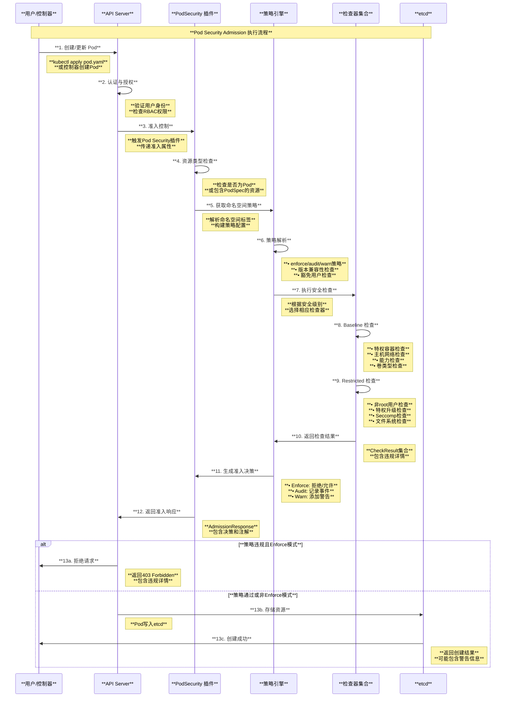
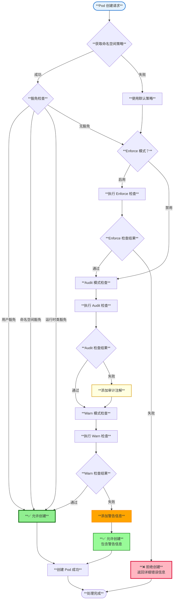

# Kubernetes Pod 安全策略深度解读

## 目录

1. [概述](#概述)
2. [PodSecurityPolicy 到 Pod Security Standards 的演进](#podsecuritypolicy-到-pod-security-standards-的演进)
3. [Pod Security Standards 核心概念](#pod-security-standards-核心概念)
4. [Pod Security Admission 架构](#pod-security-admission-架构)
5. [安全级别与策略检查](#安全级别与策略检查)
6. [准入控制流程](#准入控制流程)
7. [配置与部署](#配置与部署)
8. [迁移指南与最佳实践](#迁移指南与最佳实践)
9. [总结](#总结)

---

## 概述

Pod 安全策略是 Kubernetes 中用于控制 Pod 安全上下文的重要机制。从 Kubernetes 1.25 版本开始，传统的 PodSecurityPolicy 已被移除，取而代之的是更加简洁高效的 Pod Security Standards (PSS) 和 Pod Security Admission (PSA)。本文档基于 Kubernetes 源码深入解读 Pod 安全策略的架构设计、工作原理和迁移策略。

### 核心特性

- **三级安全标准**：Privileged、Baseline、Restricted 三个安全级别
- **命名空间级别控制**：通过命名空间标签实现策略配置
- **多种执行模式**：enforce、audit、warn 三种执行模式
- **内置准入控制**：无需额外安装，内置于 API Server
- **向后兼容**：提供从 PodSecurityPolicy 的平滑迁移路径

---

## PodSecurityPolicy 到 Pod Security Standards 的演进

### 1. PodSecurityPolicy 的局限性

```yaml
# 传统 PodSecurityPolicy（已弃用）
apiVersion: policy/v1beta1
kind: PodSecurityPolicy
metadata:
  name: restricted
spec:
  privileged: false
  allowPrivilegeEscalation: false
  requiredDropCapabilities:
    - ALL
  volumes:
    - 'configMap'
    - 'emptyDir'
    - 'projected'
    - 'secret'
    - 'downwardAPI'
    - 'persistentVolumeClaim'
  runAsUser:
    rule: 'MustRunAsNonRoot'
  seLinux:
    rule: 'RunAsAny'
  fsGroup:
    rule: 'RunAsAny'
```

**PodSecurityPolicy 问题总结**：
- **复杂的RBAC集成**：需要复杂的 ClusterRole 和 RoleBinding 配置
- **调试困难**：策略选择逻辑复杂，故障排查困难
- **用户体验差**：配置繁琐，容易出错
- **功能冗余**：大部分场景下配置过于复杂

### 2. Pod Security Standards 优势

```yaml
# 新的 Pod Security Standards（命名空间标签）
apiVersion: v1
kind: Namespace
metadata:
  name: my-app
  labels:
    pod-security.kubernetes.io/enforce: restricted
    pod-security.kubernetes.io/enforce-version: v1.25
    pod-security.kubernetes.io/audit: baseline
    pod-security.kubernetes.io/warn: baseline
```

**Pod Security Standards 优势**：
- **简化配置**：通过命名空间标签即可配置
- **预定义标准**：三个预定义安全级别覆盖大部分场景
- **易于理解**：清晰的安全级别定义
- **更好的用户体验**：配置简单，调试友好

### 3. 演进对比图

```mermaid
graph TB
    subgraph "**Pod 安全策略演进对比**"
        style subgraph fill:#f9f9f9,stroke:#333,stroke-width:2px
        
        subgraph "**传统 PodSecurityPolicy（已弃用）**"
            style subgraph fill:#ffe6e6,stroke:#cc0000,stroke-width:2px
            
            PSP_RESOURCES[**PodSecurityPolicy 资源**<br/>• policy/v1beta1 API<br/>• 复杂的策略定义<br/>• 自定义规则配置<br/>• RBAC 强依赖]
            
            PSP_WORKFLOW[**工作流程复杂**<br/>• 策略选择算法<br/>• 多策略冲突处理<br/>• RBAC 权限检查<br/>• 调试困难]
            
            PSP_PROBLEMS[**存在问题**<br/>• 配置复杂度高<br/>• 用户体验差<br/>• 维护成本高<br/>• 功能冗余]
        end
        
        subgraph "**现代 Pod Security Standards**"
            style subgraph fill:#e6ffe6,stroke:#009900,stroke-width:2px
            
            PSS_LEVELS[**三级安全标准**<br/>• **Privileged**: 无限制<br/>• **Baseline**: 基础安全<br/>• **Restricted**: 严格安全<br/>• 预定义策略]
            
            PSS_CONFIG[**简化配置**<br/>• 命名空间标签<br/>• 内置准入控制<br/>• 多种执行模式<br/>• 易于理解]
            
            PSS_BENEFITS[**显著优势**<br/>• 配置简单<br/>• 调试友好<br/>• 维护成本低<br/>• 覆盖主要场景]
        end
        
        subgraph "**迁移路径**"
            style subgraph fill:#fff2e6,stroke:#cc6600,stroke-width:2px
            
            MIGRATION_STEPS[**迁移步骤**<br/>• **评估现有策略**: 分析当前PSP配置<br/>• **映射安全级别**: 选择合适的PSS级别<br/>• **测试验证**: 在测试环境验证<br/>• **分阶段迁移**: 逐步替换PSP]
            
            MIGRATION_TOOLS[**迁移工具**<br/>• psp-migration 工具<br/>• 策略对比分析<br/>• 兼容性检查<br/>• 自动化脚本]
        end
    end
    
    PSP_RESOURCES --> PSP_WORKFLOW
    PSP_WORKFLOW --> PSP_PROBLEMS
    PSP_PROBLEMS --> MIGRATION_STEPS
    
    PSS_LEVELS --> PSS_CONFIG
    PSS_CONFIG --> PSS_BENEFITS
    PSS_BENEFITS --> MIGRATION_TOOLS
    
    MIGRATION_STEPS --> MIGRATION_TOOLS
    
    style PSP_RESOURCES fill:#FFB6C1,stroke:#DC143C,stroke-width:2px
    style PSS_LEVELS fill:#90EE90,stroke:#006400,stroke-width:2px
    style MIGRATION_STEPS fill:#87CEEB,stroke:#4682B4,stroke-width:2px
```

---

## Pod Security Standards 核心概念

### 1. 三级安全标准定义

基于源码 `staging/src/k8s.io/pod-security-admission/api/constants.go`：

```go
// Level 定义安全级别
type Level string

const (
    // LevelPrivileged - 无限制策略，允许已知的特权升级
    LevelPrivileged Level = "privileged"
    
    // LevelBaseline - 最少限制策略，防止已知的特权升级
    LevelBaseline Level = "baseline"
    
    // LevelRestricted - 严格限制策略，遵循当前Pod安全最佳实践
    LevelRestricted Level = "restricted"
)
```

### 2. 安全级别详细对比

```mermaid
graph TB
    subgraph "**Pod Security Standards 安全级别对比**"
        style subgraph fill:#f9f9f9,stroke:#333,stroke-width:2px
        
        subgraph "**Privileged 级别**"
            style subgraph fill:#e6f3ff,stroke:#0066cc,stroke-width:2px
            
            PRIVILEGED[**Privileged 特性**<br/>• **无任何限制**: 允许所有操作<br/>• **特权容器**: 允许privileged=true<br/>• **主机网络**: 允许hostNetwork<br/>• **主机PID**: 允许hostPID<br/>• **主机路径**: 允许hostPath卷<br/>• **所有能力**: 允许所有capabilities]
            
            PRIVILEGED_USE[**适用场景**<br/>• 系统级组件<br/>• 网络插件<br/>• 存储驱动<br/>• 监控Agent<br/>• 调试工具]
        end
        
        subgraph "**Baseline 级别**"
            style subgraph fill:#fff2e6,stroke:#cc6600,stroke-width:2px
            
            BASELINE[**Baseline 限制**<br/>• **禁止特权容器**: privileged=false<br/>• **禁止主机网络**: hostNetwork=false<br/>• **禁止主机PID**: hostPID=false<br/>• **限制主机路径**: 禁用hostPath卷<br/>• **限制能力**: 禁用危险capabilities<br/>• **限制端口**: 禁用特权端口绑定]
            
            BASELINE_USE[**适用场景**<br/>• 普通应用<br/>• 微服务<br/>• Web应用<br/>• 数据库<br/>• 消息队列]
        end
        
        subgraph "**Restricted 级别**"
            style subgraph fill:#e6ffe6,stroke:#009900,stroke-width:2px
            
            RESTRICTED[**Restricted 严格限制**<br/>• **包含Baseline所有限制**<br/>• **强制非root**: runAsNonRoot=true<br/>• **禁止特权升级**: allowPrivilegeEscalation=false<br/>• **丢弃所有能力**: capabilities.drop=[\"ALL\"]<br/>• **Seccomp配置**: 要求RuntimeDefault<br/>• **限制卷类型**: 仅允许安全卷类型]
            
            RESTRICTED_USE[**适用场景**<br/>• 高安全要求应用<br/>• 多租户环境<br/>• 金融应用<br/>• 敏感数据处理<br/>• 合规要求场景]
        end
        
        subgraph "**策略检查机制**"
            style subgraph fill:#f0f8ff,stroke:#4169e1,stroke-width:2px
            
            POLICY_CHECK[**检查维度**<br/>• **容器安全上下文**: privileged、capabilities<br/>• **Pod安全上下文**: runAsUser、fsGroup<br/>• **卷类型**: hostPath、emptyDir、secret<br/>• **主机资源**: network、PID、IPC<br/>• **Seccomp配置**: profile类型和配置]
        end
        
        subgraph "**执行模式**"
            style subgraph fill:#ffe6f2,stroke:#cc0066,stroke-width:2px
            
            EXECUTION_MODES[**三种执行模式**<br/>• **enforce**: 拒绝违反策略的Pod<br/>• **audit**: 记录违反策略的事件<br/>• **warn**: 向用户发出警告<br/>• **组合使用**: 可同时配置多种模式]
        end
    end
    
    PRIVILEGED --> PRIVILEGED_USE
    BASELINE --> BASELINE_USE  
    RESTRICTED --> RESTRICTED_USE
    
    PRIVILEGED_USE --> POLICY_CHECK
    BASELINE_USE --> POLICY_CHECK
    RESTRICTED_USE --> POLICY_CHECK
    
    POLICY_CHECK --> EXECUTION_MODES
    
    style PRIVILEGED fill:#87CEEB,stroke:#4682B4,stroke-width:2px
    style BASELINE fill:#DDA0DD,stroke:#8B008B,stroke-width:2px
    style RESTRICTED fill:#90EE90,stroke:#006400,stroke-width:2px
    style EXECUTION_MODES fill:#98FB98,stroke:#006400,stroke-width:2px
```

---

## Pod Security Admission 架构

### 1. 整体架构图

```mermaid
graph TB
    subgraph "**Pod Security Admission 整体架构**"
        style subgraph fill:#f9f9f9,stroke:#333,stroke-width:2px
        
        subgraph "**配置层**"
            style subgraph fill:#e6f3ff,stroke:#0066cc,stroke-width:2px
            
            NS_LABELS[**命名空间标签**<br/>• pod-security.kubernetes.io/enforce<br/>• pod-security.kubernetes.io/audit<br/>• pod-security.kubernetes.io/warn<br/>• pod-security.kubernetes.io/enforce-version]
            
            PSA_CONFIG[**PSA 配置文件**<br/>• PodSecurityConfiguration<br/>• 默认策略设置<br/>• 豁免配置<br/>• 版本控制]
        end
        
        subgraph "**API Server 集成**"
            style subgraph fill:#fff2e6,stroke:#cc6600,stroke-width:2px
            
            API_SERVER[**API Server**<br/>• 接收Pod创建请求<br/>• 触发准入控制链<br/>• 返回准入决策<br/>• 记录审计日志]
            
            ADMISSION_CHAIN[**准入控制链**<br/>• MutatingAdmissionWebhook<br/>• **PodSecurity**: 内置准入控制<br/>• ValidatingAdmissionWebhook<br/>• 其他准入控制器]
        end
        
        subgraph "**Pod Security Admission 核心**"
            style subgraph fill:#e6ffe6,stroke:#009900,stroke-width:2px
            
            PSA_PLUGIN[**PSA 插件**<br/>• 策略解析器<br/>• 规则评估引擎<br/>• 违规检测<br/>• 决策生成]
            
            POLICY_ENGINE[**策略引擎**<br/>• 安全级别检查<br/>• 版本兼容性<br/>• 豁免处理<br/>• 多模式执行]
        end
        
        subgraph "**检查器集合**"
            style subgraph fill:#f0f8ff,stroke:#4169e1,stroke-width:2px
            
            BASELINE_CHECKS[**Baseline 检查器**<br/>• 特权容器检查<br/>• 主机网络检查<br/>• 主机路径检查<br/>• 能力检查<br/>• 端口检查]
            
            RESTRICTED_CHECKS[**Restricted 检查器**<br/>• 非root用户检查<br/>• 特权升级检查<br/>• Seccomp检查<br/>• 卷类型检查<br/>• 文件系统组检查]
        end
        
        subgraph "**决策与执行**"
            style subgraph fill:#ffe6f2,stroke:#cc0066,stroke-width:2px
            
            DECISION_LOGIC[**决策逻辑**<br/>• Enforce模式: 拒绝违规Pod<br/>• Audit模式: 记录审计事件<br/>• Warn模式: 返回警告信息<br/>• 豁免处理: 跳过检查]
            
            RESPONSE[**响应处理**<br/>• AdmissionResponse<br/>• 错误信息<br/>• 审计注解<br/>• 警告信息]
        end
    end
    
    NS_LABELS --> API_SERVER
    PSA_CONFIG --> PSA_PLUGIN
    
    API_SERVER --> ADMISSION_CHAIN
    ADMISSION_CHAIN --> PSA_PLUGIN
    
    PSA_PLUGIN --> POLICY_ENGINE
    POLICY_ENGINE --> BASELINE_CHECKS
    POLICY_ENGINE --> RESTRICTED_CHECKS
    
    BASELINE_CHECKS --> DECISION_LOGIC
    RESTRICTED_CHECKS --> DECISION_LOGIC
    DECISION_LOGIC --> RESPONSE
    
    RESPONSE --> API_SERVER
    
    style NS_LABELS fill:#90EE90,stroke:#006400,stroke-width:2px
    style PSA_PLUGIN fill:#87CEEB,stroke:#4682B4,stroke-width:2px
    style POLICY_ENGINE fill:#DDA0DD,stroke:#8B008B,stroke-width:2px
    style DECISION_LOGIC fill:#98FB98,stroke:#006400,stroke-width:2px
```

### 2. 准入控制器实现

基于源码 `plugin/pkg/admission/security/podsecurity/admission.go`：

```go
// Plugin 实现 Pod Security 准入控制器
type Plugin struct {
    *admission.Handler
    delegate podsecurityadmission.Interface
}

// Validate 验证 Pod 是否符合安全策略
func (p *Plugin) Validate(ctx context.Context, a admission.Attributes, o admission.ObjectInterfaces) error {
    gr := a.GetResource().GroupResource()
    if !applicableResources[gr] && !p.delegate.PodSpecExtractor.HasPodSpec(gr) {
        return nil
    }

    // 调用核心验证逻辑
    result := p.delegate.Validate(ctx, &lazyConvertingAttributes{Attributes: a})
    
    // 处理警告信息
    for _, w := range result.Warnings {
        warning.AddWarning(ctx, "", w)
    }
    
    // 添加审计注解
    if len(result.AuditAnnotations) > 0 {
        annotations := make([]string, len(result.AuditAnnotations)*2)
        i := 0
        for k, v := range result.AuditAnnotations {
            annotations[i], annotations[i+1] = podsecurityadmissionapi.AuditAnnotationPrefix+k, v
            i += 2
        }
        audit.AddAuditAnnotations(ctx, annotations...)
    }
    
    // 处理拒绝决策
    if !result.Allowed {
        retval := admission.NewForbidden(a, errors.New("Not allowed by PodSecurity")).(*apierrors.StatusError)
        if result.Result != nil {
            if len(result.Result.Message) > 0 {
                retval.ErrStatus.Message = result.Result.Message
            }
        }
        return retval
    }
    return nil
}
```

---

## 安全级别与策略检查

### 1. Baseline 级别检查示例

基于源码 `staging/src/k8s.io/pod-security-admission/policy/check_privileged.go`：

```go
// CheckPrivileged 检查特权容器
func CheckPrivileged() Check {
    return Check{
        ID:    "privileged",
        Level: api.LevelBaseline,
        Versions: []VersionedCheck{
            {
                MinimumVersion: api.MajorMinorVersion(1, 0),
                CheckPod:       privileged_1_0,
            },
        },
    }
}

func privileged_1_0(podMetadata *metav1.ObjectMeta, podSpec *corev1.PodSpec) CheckResult {
    var badContainers []string
    
    // 检查初始化容器
    for _, c := range podSpec.InitContainers {
        if c.SecurityContext != nil && c.SecurityContext.Privileged != nil && *c.SecurityContext.Privileged {
            badContainers = append(badContainers, fmt.Sprintf("initContainer %q", c.Name))
        }
    }
    
    // 检查普通容器
    for _, c := range podSpec.Containers {
        if c.SecurityContext != nil && c.SecurityContext.Privileged != nil && *c.SecurityContext.Privileged {
            badContainers = append(badContainers, fmt.Sprintf("container %q", c.Name))
        }
    }
    
    if len(badContainers) > 0 {
        return CheckResult{
            Allowed:         false,
            ForbiddenReason: "privileged",
            ForbiddenDetail: fmt.Sprintf("%s must not set securityContext.privileged=true", strings.Join(badContainers, ", ")),
        }
    }
    
    return CheckResult{Allowed: true}
}
```

### 2. 策略检查流程图



---

## 准入控制流程

### 1. 核心验证逻辑

基于源码 `staging/src/k8s.io/pod-security-admission/admission/admission.go`：

```go
// EvaluatePod 评估 Pod 是否符合策略
func (a *Admission) EvaluatePod(ctx context.Context, nsPolicy api.Policy, nsPolicyErr error, 
    podMetadata *metav1.ObjectMeta, podSpec *corev1.PodSpec, attrs api.Attributes, enforce bool) *admissionv1.AdmissionResponse {
    
    logger := klog.FromContext(ctx)
    
    // 豁免运行时类检查
    if a.exemptRuntimeClass(podSpec.RuntimeClassName) {
        a.Metrics.RecordExemption(attrs)
        return sharedAllowedByRuntimeClassExemptionResponse
    }

    auditAnnotations := map[string]string{}
    if nsPolicyErr != nil {
        logger.V(2).Info("failed to parse PodSecurity namespace labels", "err", nsPolicyErr)
        auditAnnotations["error"] = fmt.Sprintf("Failed to parse policy: %v", nsPolicyErr)
        a.Metrics.RecordError(false, attrs)
    }

    cachedResults := make(map[api.LevelVersion]policy.AggregateCheckResult)
    response := allowedResponse()
    
    // Enforce 模式检查
    if enforce {
        auditAnnotations[api.EnforcedPolicyAnnotationKey] = nsPolicy.Enforce.String()
        
        result := policy.AggregateCheckResults(a.Evaluator.EvaluatePod(nsPolicy.Enforce, podMetadata, podSpec))
        if !result.Allowed {
            response = forbiddenResponse(attrs, fmt.Errorf(
                "violates PodSecurity %q: %s",
                nsPolicy.Enforce.String(),
                result.ForbiddenDetail(),
            ))
            a.Metrics.RecordEvaluation(metrics.DecisionDeny, nsPolicy.Enforce, metrics.ModeEnforce, attrs)
        } else {
            a.Metrics.RecordEvaluation(metrics.DecisionAllow, nsPolicy.Enforce, metrics.ModeEnforce, attrs)
        }
        cachedResults[nsPolicy.Enforce] = result
    }

    // Audit 模式检查
    auditResult, ok := cachedResults[nsPolicy.Audit]
    if !ok {
        auditResult = policy.AggregateCheckResults(a.Evaluator.EvaluatePod(nsPolicy.Audit, podMetadata, podSpec))
        cachedResults[nsPolicy.Audit] = auditResult
    }
    if !auditResult.Allowed {
        auditAnnotations[api.AuditViolationsAnnotationKey] = fmt.Sprintf(
            "would violate PodSecurity %q: %s",
            nsPolicy.Audit.String(),
            auditResult.ForbiddenDetail(),
        )
        a.Metrics.RecordEvaluation(metrics.DecisionDeny, nsPolicy.Audit, metrics.ModeAudit, attrs)
    }

    // Warn 模式检查（仅在请求不被拒绝时添加警告）
    if response.Allowed {
        warnResult, ok := cachedResults[nsPolicy.Warn]
        if !ok {
            warnResult = policy.AggregateCheckResults(a.Evaluator.EvaluatePod(nsPolicy.Warn, podMetadata, podSpec))
        }
        if !warnResult.Allowed {
            response.Warnings = append(response.Warnings, fmt.Sprintf(
                "would violate PodSecurity %q: %s",
                nsPolicy.Warn.String(),
                warnResult.ForbiddenDetail(),
            ))
            a.Metrics.RecordEvaluation(metrics.DecisionDeny, nsPolicy.Warn, metrics.ModeWarn, attrs)
        }
    }

    response.AuditAnnotations = auditAnnotations
    return response
}
```

### 2. 执行模式决策流程



---

## 配置与部署

### 1. 命名空间级别配置

```yaml
# 为命名空间配置 Pod Security Standards
apiVersion: v1
kind: Namespace
metadata:
  name: my-secure-app
  labels:
    # Enforce 模式：严格执行 restricted 策略
    pod-security.kubernetes.io/enforce: restricted
    pod-security.kubernetes.io/enforce-version: v1.25
    
    # Audit 模式：记录违反 baseline 策略的行为
    pod-security.kubernetes.io/audit: baseline
    pod-security.kubernetes.io/audit-version: v1.25
    
    # Warn 模式：警告违反 baseline 策略的行为
    pod-security.kubernetes.io/warn: baseline
    pod-security.kubernetes.io/warn-version: v1.25
```

### 2. 集群级别配置

基于源码 `staging/src/k8s.io/pod-security-admission/admission/api/v1/types.go`：

```yaml
# PodSecurityConfiguration - 集群默认配置
apiVersion: pod-security.admission.config.k8s.io/v1
kind: PodSecurityConfiguration
defaults:
  enforce: "restricted"
  enforce-version: "latest"
  audit: "baseline" 
  audit-version: "latest"
  warn: "baseline"
  warn-version: "latest"
exemptions:
  # 豁免用户
  usernames:
  - "system:serviceaccount:kube-system:*"
  - "cluster-admin"
  
  # 豁免命名空间
  namespaces:
  - "kube-system"
  - "kube-public"
  - "kube-node-lease"
  
  # 豁免运行时类
  runtimeClasses:
  - "gvisor"
  - "kata-containers"
```

### 3. API Server 配置

```yaml
# 在 kube-apiserver 中启用 Pod Security Admission
apiVersion: v1
kind: Pod
metadata:
  name: kube-apiserver
  namespace: kube-system
spec:
  containers:
  - name: kube-apiserver
    command:
    - kube-apiserver
    - --admission-control-config-file=/etc/kubernetes/admission/admission.yaml
    - --enable-admission-plugins=NodeRestriction,PodSecurity
    volumeMounts:
    - name: admission-config
      mountPath: /etc/kubernetes/admission
      readOnly: true
  volumes:
  - name: admission-config
    configMap:
      name: admission-configuration
```

### 4. 配置最佳实践图

```mermaid
graph TB
    subgraph "**Pod Security Standards 配置策略**"
        style subgraph fill:#f9f9f9,stroke:#333,stroke-width:2px
        
        subgraph "**环境分层配置**"
            style subgraph fill:#e6f3ff,stroke:#0066cc,stroke-width:2px
            
            PRODUCTION[**生产环境**<br/>• **enforce**: restricted<br/>• **audit**: restricted<br/>• **warn**: restricted<br/>• **最高安全级别**]
            
            STAGING[**预发布环境**<br/>• **enforce**: baseline<br/>• **audit**: restricted<br/>• **warn**: restricted<br/>• **平衡安全与兼容性**]
            
            DEVELOPMENT[**开发环境**<br/>• **enforce**: privileged<br/>• **audit**: baseline<br/>• **warn**: baseline<br/>• **开发便利性优先**]
        end
        
        subgraph "**命名空间分类策略**"
            style subgraph fill:#fff2e6,stroke:#cc6600,stroke-width:2px
            
            SYSTEM_NS[**系统命名空间**<br/>• **kube-system**: privileged<br/>• **kube-public**: privileged<br/>• **监控命名空间**: baseline<br/>• **网络插件**: privileged]
            
            APP_NS[**应用命名空间**<br/>• **前端应用**: baseline<br/>• **API服务**: restricted<br/>• **数据库**: restricted<br/>• **缓存服务**: baseline]
            
            TENANT_NS[**租户命名空间**<br/>• **多租户隔离**: restricted<br/>• **资源配额**: restricted<br/>• **网络策略**: restricted<br/>• **严格安全控制**: restricted]
        end
        
        subgraph "**渐进式实施**"
            style subgraph fill:#e6ffe6,stroke:#009900,stroke-width:2px
            
            PHASE1[**第一阶段**<br/>• **audit**: restricted<br/>• **warn**: baseline<br/>• **enforce**: privileged<br/>• **收集违规数据**]
            
            PHASE2[**第二阶段**<br/>• **audit**: restricted<br/>• **warn**: restricted<br/>• **enforce**: baseline<br/>• **逐步收紧策略**]
            
            PHASE3[**第三阶段**<br/>• **audit**: restricted<br/>• **warn**: restricted<br/>• **enforce**: restricted<br/>• **全面安全控制**]
        end
        
        subgraph "**监控与调优**"
            style subgraph fill:#f0f8ff,stroke:#4169e1,stroke-width:2px
            
            MONITORING[**监控指标**<br/>• **违规事件数量**: 审计日志统计<br/>• **拒绝率**: enforce模式拒绝比例<br/>• **警告频率**: warn模式触发次数<br/>• **豁免使用**: 豁免规则命中率]
            
            OPTIMIZATION[**策略优化**<br/>• **分析违规原因**: 找出常见问题<br/>• **调整豁免规则**: 合理设置豁免<br/>• **应用改进**: 指导应用安全改进<br/>• **策略迭代**: 持续优化策略**]
        end
    end
    
    PRODUCTION --> SYSTEM_NS
    STAGING --> APP_NS
    DEVELOPMENT --> TENANT_NS
    
    SYSTEM_NS --> PHASE1
    APP_NS --> PHASE2  
    TENANT_NS --> PHASE3
    
    PHASE1 --> MONITORING
    PHASE2 --> MONITORING
    PHASE3 --> MONITORING
    
    MONITORING --> OPTIMIZATION
    
    style PRODUCTION fill:#90EE90,stroke:#006400,stroke-width:2px
    style STAGING fill:#87CEEB,stroke:#4682B4,stroke-width:2px
    style DEVELOPMENT fill:#DDA0DD,stroke:#8B008B,stroke-width:2px
    style PHASE3 fill:#98FB98,stroke:#006400,stroke-width:2px
```

---

## 迁移指南与最佳实践

### 1. 从 PodSecurityPolicy 迁移

```bash
#!/bin/bash
# PodSecurityPolicy 迁移脚本示例

echo "=== Pod Security Policy 迁移工具 ==="

# 1. 分析现有 PodSecurityPolicy
echo "1. 分析现有 PodSecurityPolicy..."
kubectl get psp -o yaml > current-psp.yaml

# 2. 检查 Pod 违规情况
echo "2. 检查违规 Pod..."
kubectl get pods --all-namespaces -o json | \
  jq '.items[] | select(.spec.securityContext.privileged == true) | {name: .metadata.name, namespace: .metadata.namespace}'

# 3. 创建命名空间标签配置
echo "3. 为命名空间添加 Pod Security 标签..."
for ns in $(kubectl get ns -o name | cut -d/ -f2); do
  if [[ "$ns" == "kube-system" || "$ns" == "kube-public" ]]; then
    # 系统命名空间使用 privileged
    kubectl label namespace $ns pod-security.kubernetes.io/enforce=privileged --overwrite
    kubectl label namespace $ns pod-security.kubernetes.io/audit=baseline --overwrite
    kubectl label namespace $ns pod-security.kubernetes.io/warn=baseline --overwrite
  else
    # 应用命名空间使用 baseline
    kubectl label namespace $ns pod-security.kubernetes.io/enforce=baseline --overwrite
    kubectl label namespace $ns pod-security.kubernetes.io/audit=restricted --overwrite  
    kubectl label namespace $ns pod-security.kubernetes.io/warn=restricted --overwrite
  fi
done

# 4. 测试验证
echo "4. 测试 Pod Security Standards..."
kubectl apply -f test-pods/ --dry-run=server

# 5. 逐步删除 PodSecurityPolicy
echo "5. 清理 PodSecurityPolicy（谨慎操作）..."
# kubectl delete psp --all
# kubectl delete clusterrole psp:*  
# kubectl delete clusterrolebinding psp:*

echo "迁移完成！请仔细测试后再删除 PodSecurityPolicy。"
```

### 2. 安全级别映射表

| PodSecurityPolicy 配置 | Pod Security Standard 级别 | 说明 |
|---|---|---|
| `privileged: true` | **Privileged** | 允许特权容器 |
| `privileged: false` + 基础限制 | **Baseline** | 基础安全控制 |
| `runAsNonRoot: true` + 严格限制 | **Restricted** | 最严格安全控制 |
| 允许所有卷类型 | **Privileged** | 无卷类型限制 |
| 限制危险卷类型 | **Baseline** | 禁用hostPath等 |
| 仅允许安全卷类型 | **Restricted** | 严格卷类型控制 |

### 3. 故障排查指南

```yaml
# 常见问题与解决方案

# 问题1: Pod 被 PodSecurity 拒绝
apiVersion: v1
kind: Pod
metadata:
  name: debug-pod
spec:
  containers:
  - name: app
    image: nginx
    securityContext:
      privileged: true  # ❌ Baseline/Restricted 不允许

# 解决方案1: 调整安全上下文
spec:
  containers:
  - name: app
    image: nginx
    securityContext:
      privileged: false  # ✅ 符合 Baseline
      runAsNonRoot: true # ✅ 符合 Restricted
      allowPrivilegeEscalation: false # ✅ 符合 Restricted

# 问题2: 系统 Pod 无法创建
# 解决方案2: 配置豁免或调整命名空间策略
apiVersion: v1
kind: Namespace
metadata:
  name: kube-system
  labels:
    pod-security.kubernetes.io/enforce: privileged
    pod-security.kubernetes.io/audit: privileged
    pod-security.kubernetes.io/warn: privileged
```

### 4. 监控与运维

```bash
# 监控 Pod Security 违规事件
kubectl get events --all-namespaces | grep "FailedMount\|FailedCreate" | grep -i security

# 查看审计日志中的 Pod Security 事件  
grep "pod-security.kubernetes.io" /var/log/audit.log

# 检查命名空间 Pod Security 配置
kubectl get ns -o custom-columns=NAME:.metadata.name,ENFORCE:.metadata.labels.pod-security\.kubernetes\.io/enforce,AUDIT:.metadata.labels.pod-security\.kubernetes\.io/audit,WARN:.metadata.labels.pod-security\.kubernetes\.io/warn

# 验证 Pod 是否符合特定安全级别
kubectl auth can-i create pods --as=system:serviceaccount:default:default -n restricted-namespace
```

---

## 总结

Pod Security Standards 代表了 Kubernetes 安全策略的重大进步，通过简化配置、预定义标准和内置实现，为集群安全提供了更加实用和易维护的解决方案。

### 核心价值

1. **简化配置**：通过命名空间标签配置，大幅简化安全策略管理
2. **标准化安全级别**：三个预定义安全级别覆盖绝大部分使用场景
3. **多模式执行**：enforce、audit、warn 三种模式支持渐进式实施
4. **内置实现**：无需额外安装，与 API Server 深度集成
5. **易于调试**：清晰的错误信息和警告，便于故障排查

### 技术特点

- **策略引擎**：高效的规则评估和违规检测机制
- **版本兼容**：支持不同 Kubernetes 版本的策略兼容性
- **豁免机制**：灵活的豁免配置支持特殊场景需求
- **审计集成**：完整的审计日志记录策略违规行为
- **性能优化**：内置实现避免网络调用开销

Pod Security Standards 的成功实施需要合理的策略设计、分阶段迁移和持续的监控优化。在多租户和高安全要求的环境中，它是保障 Pod 安全的重要基石。随着 PodSecurityPolicy 的彻底移除，Pod Security Standards 已成为 Kubernetes Pod 安全控制的标准方案。

