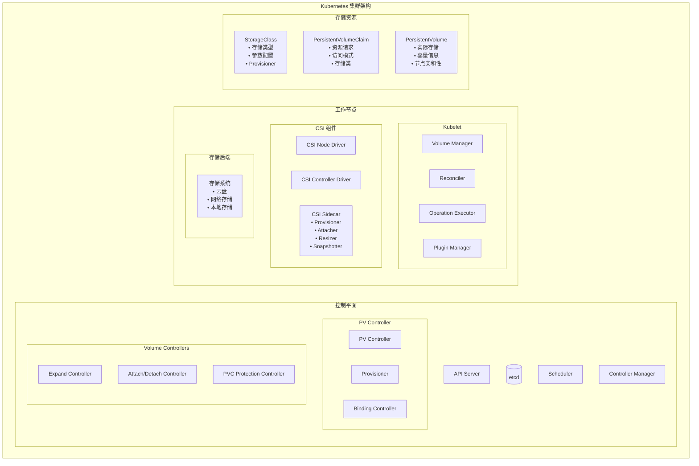
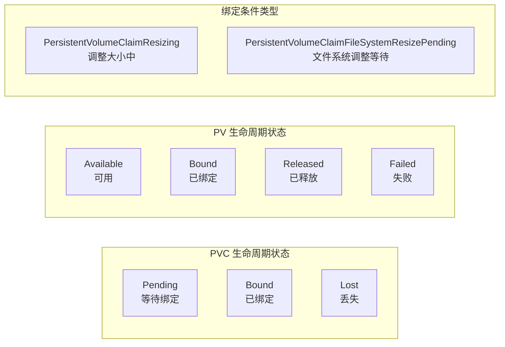
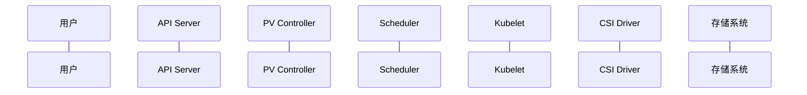
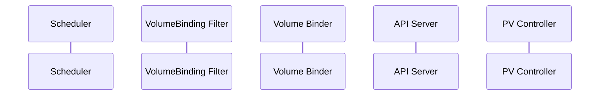
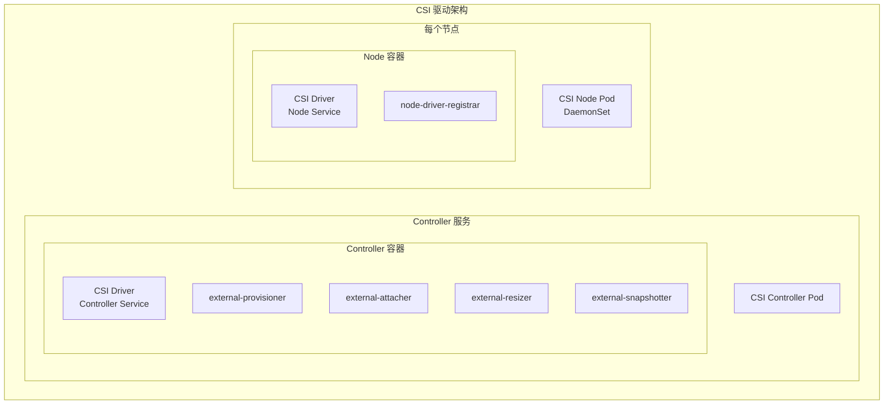
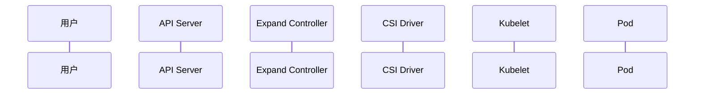

# Kubernetes PVC (PersistentVolumeClaim) 架构与原理深度解读

## 目录

1. [概述](#概述)
2. [PVC 核心概念](#pvc-核心概念)
3. [PVC 整体架构图](#pvc-整体架构图)
4. [PVC 数据结构与源码分析](#pvc-数据结构与源码分析)
5. [PVC 生命周期详解](#pvc-生命周期详解)
6. [动态存储供应机制](#动态存储供应机制)
7. [卷绑定与调度集成](#卷绑定与调度集成)
8. [CSI 驱动架构](#csi-驱动架构)
9. [存储卷扩展机制](#存储卷扩展机制)
10. [存储卷快照功能](#存储卷快照功能)
11. [PVC 保护与回收机制](#pvc-保护与回收机制)
12. [最佳实践与调优建议](#最佳实践与调优建议)
13. [总结](#总结)

---

## 概述

PersistentVolumeClaim (PVC) 是 Kubernetes 中用于请求存储资源的声明式 API 对象。它是存储抽象层的核心组件，提供了一种标准化的方式来管理持久化存储需求。本文档基于 Kubernetes 源码深入解读 PVC 的架构设计、工作原理和实现机制。

### 核心特性

- **存储抽象**：为应用程序提供统一的存储接口
- **动态供应**：支持根据需求自动创建存储卷
- **声明式管理**：通过期望状态驱动的资源管理
- **多种存储后端**：支持云存储、网络存储、本地存储等
- **高级功能**：包括快照、扩展、拓扑感知等

---

## PVC 核心概念

### 1. 基本概念关系

- **PVC (PersistentVolumeClaim)**：存储资源请求，定义了应用对存储的需求
- **PV (PersistentVolume)**：实际的存储资源，集群级别的存储对象
- **StorageClass**：存储类别，定义了动态供应的策略和参数

### 2. 核心数据结构

根据源码 `staging/src/k8s.io/api/core/v1/types.go`：

```go
// PersistentVolumeClaim is a user's request for and claim to a persistent volume
type PersistentVolumeClaim struct {
    metav1.TypeMeta   `json:",inline"`
    metav1.ObjectMeta `json:"metadata,omitempty"`
    
    // Spec defines the desired characteristics of a volume requested by a pod author
    Spec PersistentVolumeClaimSpec `json:"spec,omitempty"`
    
    // Status represents the current information/status of a persistent volume claim
    Status PersistentVolumeClaimStatus `json:"status,omitempty"`
}

type PersistentVolumeClaimSpec struct {
    // AccessModes contains the desired access modes the volume should have
    AccessModes []PersistentVolumeAccessMode `json:"accessModes,omitempty"`
    
    // Selector is a label query over volumes to consider for binding
    Selector *metav1.LabelSelector `json:"selector,omitempty"`
    
    // Resources represents the minimum resources the volume should have
    Resources VolumeResourceRequirements `json:"resources,omitempty"`
    
    // VolumeName is the binding reference to the PersistentVolume backing this claim
    VolumeName string `json:"volumeName,omitempty"`
    
    // StorageClassName is the name of the StorageClass required by the claim
    StorageClassName *string `json:"storageClassName,omitempty"`
    
    // VolumeMode defines what type of volume is required by the claim
    VolumeMode *PersistentVolumeMode `json:"volumeMode,omitempty"`
    
    // DataSource field can be used to specify either:
    // * An existing VolumeSnapshot object
    // * An existing PVC
    DataSource *TypedLocalObjectReference `json:"dataSource,omitempty"`
}
```

---

## PVC 整体架构图



---

## PVC 数据结构与源码分析

### 1. PVC 状态管理

基于 `pkg/controller/volume/persistentvolume/pv_controller.go`：

```go
const (
    // PVC 阶段常量
    ClaimPending PersistentVolumeClaimPhase = "Pending"
    ClaimBound   PersistentVolumeClaimPhase = "Bound" 
    ClaimLost    PersistentVolumeClaimPhase = "Lost"
)

// PVC 条件类型
const (
    // PersistentVolumeClaimResizing - controller resize is in progress
    PersistentVolumeClaimResizing PersistentVolumeClaimConditionType = "Resizing"
    
    // PersistentVolumeClaimFileSystemResizePending - controller resize is finished 
    // and a file system resize is pending on node
    PersistentVolumeClaimFileSystemResizePending PersistentVolumeClaimConditionType = "FileSystemResizePending"
)
```

### 2. PV 控制器核心结构

```go
type PersistentVolumeController struct {
    volumeLister       corelisters.PersistentVolumeLister
    claimLister        corelisters.PersistentVolumeClaimLister  
    classLister        storagelisters.StorageClassLister
    
    kubeClient                clientset.Interface
    eventRecorder             record.EventRecorder
    volumePluginMgr           vol.VolumePluginMgr
    enableDynamicProvisioning bool
    
    // 操作时间戳缓存用于指标收集
    operationTimestamps *metrics.OperationStartTimeCache
}
```

---

## PVC 生命周期详解

### 1. 生命周期状态转换图



### 2. 绑定过程源码分析

基于 `pkg/controller/volume/persistentvolume/pv_controller.go`：

```go
// bind() 执行 PV 和 PVC 的双向绑定
func (ctrl *PersistentVolumeController) bind(ctx context.Context, volume *v1.PersistentVolume, claim *v1.PersistentVolumeClaim) error {
    // 1. 绑定 PV 到 PVC
    if updatedVolume, err = ctrl.bindVolumeToClaim(ctx, volume, claim); err != nil {
        return err
    }
    
    // 2. 更新 PV 状态为 Bound
    if updatedVolume, err = ctrl.updateVolumePhase(ctx, volume, v1.VolumeBound, ""); err != nil {
        return err  
    }
    
    // 3. 绑定 PVC 到 PV
    if updatedClaim, err = ctrl.bindClaimToVolume(ctx, claim, volume); err != nil {
        return err
    }
    
    // 4. 更新 PVC 状态为 Bound
    if updatedClaim, err = ctrl.updateClaimStatus(ctx, claim, v1.ClaimBound, volume); err != nil {
        return err
    }
    
    return nil
}
```

---

## 动态存储供应机制

### 1. 动态供应流程图



### 2. 供应逻辑实现

基于 `pkg/controller/volume/persistentvolume/pv_controller.go` 中的 `provisionClaim()` 方法：

```go
func (ctrl *PersistentVolumeController) provisionClaim(ctx context.Context, claim *v1.PersistentVolumeClaim) error {
    // 1. 检查是否启用动态供应
    if !ctrl.enableDynamicProvisioning {
        return nil
    }
    
    // 2. 查找合适的供应插件
    plugin, storageClass, err := ctrl.findProvisionablePlugin(claim)
    if err != nil {
        return nil  // 让外部控制器处理
    }
    
    // 3. 执行供应操作
    if plugin == nil {
        // 外部供应器（如 CSI）
        _, err = ctrl.provisionClaimOperationExternal(ctx, claim, storageClass)
    } else {
        // 内置供应器
        _, err = ctrl.provisionClaimOperation(ctx, claim, plugin, storageClass)
    }
    
    return err
}
```

### 3. StorageClass 配置

根据源码 `staging/src/k8s.io/api/storage/v1/types.go`：

```go
type StorageClass struct {
    metav1.TypeMeta   `json:",inline"`
    metav1.ObjectMeta `json:"metadata,omitempty"`
    
    // Provisioner indicates the type of the provisioner
    Provisioner string `json:"provisioner"`
    
    // Parameters holds the parameters for the provisioner
    Parameters map[string]string `json:"parameters,omitempty"`
    
    // ReclaimPolicy controls the reclaimPolicy for dynamically provisioned PVs
    ReclaimPolicy *v1.PersistentVolumeReclaimPolicy `json:"reclaimPolicy,omitempty"`
    
    // MountOptions controls the mountOptions for dynamically provisioned PVs
    MountOptions []string `json:"mountOptions,omitempty"`
    
    // AllowVolumeExpansion shows whether the storage class allows volume expand
    AllowVolumeExpansion *bool `json:"allowVolumeExpansion,omitempty"`
    
    // VolumeBindingMode indicates how PVCs should be provisioned and bound
    VolumeBindingMode *VolumeBindingMode `json:"volumeBindingMode,omitempty"`
    
    // AllowedTopologies restrict the node topologies where volumes can be provisioned
    AllowedTopologies []v1.TopologySelectorTerm `json:"allowedTopologies,omitempty"`
}
```

---

## 卷绑定与调度集成

### 1. 卷绑定调度流程



### 2. VolumeBinding 插件实现

基于 `pkg/scheduler/framework/plugins/volumebinding/volume_binding.go`：

```go
// VolumeBinding 插件实现多个调度扩展点
type VolumeBinding struct {
    Binder    SchedulerVolumeBinder
    PVCLister corelisters.PersistentVolumeClaimLister
    scorer    volumeCapacityScorer
}

// PreFilter 阶段：获取 Pod 的卷声明信息
func (pl *VolumeBinding) PreFilter(ctx context.Context, state *framework.CycleState, pod *v1.Pod) (*framework.PreFilterResult, *framework.Status) {
    podVolumeClaims, err := pl.Binder.GetPodVolumeClaims(logger, pod)
    if err != nil {
        return nil, framework.AsStatus(err)
    }
    
    // 检查立即绑定的 PVC
    if len(podVolumeClaims.unboundClaimsImmediate) > 0 {
        return nil, framework.NewStatus(framework.UnschedulableAndUnresolvable)
    }
    
    return result, nil
}

// Filter 阶段：检查节点是否满足卷要求
func (pl *VolumeBinding) Filter(ctx context.Context, cs *framework.CycleState, pod *v1.Pod, nodeInfo *framework.NodeInfo) *framework.Status {
    podVolumes, reasons, err := pl.Binder.FindPodVolumes(logger, pod, state.podVolumeClaims, node)
    if err != nil || len(reasons) > 0 {
        return framework.NewStatus(framework.UnschedulableAndUnresolvable)
    }
    
    // 缓存节点的卷绑定信息
    state.podVolumesByNode[node.Name] = podVolumes
    return nil
}
```

### 3. 卷绑定器核心逻辑

```go
// FindPodVolumes 查找 Pod 所需的卷
func (b *volumeBinder) FindPodVolumes(logger klog.Logger, pod *v1.Pod, podVolumeClaims *PodVolumeClaims, node *v1.Node) (*PodVolumes, ConflictReasons, error) {
    podVolumes := &PodVolumes{}
    
    // 检查已绑定的卷是否与节点兼容
    if len(podVolumeClaims.boundClaims) > 0 {
        boundVolumesSatisfied, boundPVsFound, err := b.checkBoundClaims(logger, podVolumeClaims.boundClaims, node, pod)
        if !boundVolumesSatisfied || !boundPVsFound {
            // 节点不兼容
            return podVolumes, reasons, nil
        }
    }
    
    // 为延迟绑定的 PVC 查找匹配的 PV
    if len(podVolumeClaims.unboundClaimsDelayBinding) > 0 {
        foundMatches, bindings, unboundClaims, err := b.findMatchingVolumes(logger, pod, podVolumeClaims.unboundClaimsDelayBinding, podVolumeClaims.unboundVolumesDelayBinding, node)
        
        podVolumes.StaticBindings = bindings
        podVolumes.DynamicProvisions = unboundClaims
    }
    
    return podVolumes, reasons, nil
}
```

---

## CSI 驱动架构

### 1. CSI 驱动整体架构



### 2. CSI 插件注册机制

基于 `pkg/volume/csi/csi_plugin.go`：

```go
// RegistrationHandler 处理 CSI 驱动注册
type RegistrationHandler struct{}

// RegisterPlugin 注册 CSI 插件
func (h *RegistrationHandler) RegisterPlugin(pluginName string, endpoint string, versions []string) error {
    // 1. 验证版本兼容性
    highestSupportedVersion, err := h.validateVersions("RegisterPlugin", pluginName, endpoint, versions)
    if err != nil {
        return err
    }
    
    // 2. 存储驱动信息
    csiDrivers.Set(pluginName, Driver{
        endpoint:                endpoint,
        highestSupportedVersion: highestSupportedVersion,
    })
    
    // 3. 获取节点信息
    csi, err := newCsiDriverClient(csiDriverName(pluginName))
    if err != nil {
        return err
    }
    
    driverNodeID, maxVolumePerNode, accessibleTopology, err := csi.NodeGetInfo(ctx)
    if err != nil {
        unregisterDriver(pluginName)
        return err
    }
    
    // 4. 安装 CSI 驱动到节点信息管理器
    err = nim.InstallCSIDriver(pluginName, driverNodeID, maxVolumePerNode, accessibleTopology)
    if err != nil {
        unregisterDriver(pluginName)
        return err
    }
    
    return nil
}
```

### 3. CSI 接口调用

基于 `pkg/volume/csi/csi_client.go`：

```go
// CSI 卷操作接口
type csiDriverClient struct {
    network     string
    addr        string
    metricsManager *metrics.CSIMetricsManager
    nodeV1ClientCreator nodeV1ClientCreator
}

// NodePublishVolume 在节点上发布卷
func (c *csiDriverClient) NodePublishVolume(ctx context.Context, opts nodePublishVolumeOptions) error {
    nodeClient, closer, err := c.nodeV1ClientCreator(c.addr, c.metricsManager)
    if err != nil {
        return err
    }
    defer closer.Close()
    
    req := &csipbv1.NodePublishVolumeRequest{
        VolumeId:         opts.volumeID,
        TargetPath:       opts.targetPath,
        VolumeCapability: opts.capability,
        Readonly:         opts.readOnly,
        Secrets:          opts.secrets,
        VolumeContext:    opts.volumeContext,
    }
    
    if opts.stagingTargetPath != "" {
        req.StagingTargetPath = opts.stagingTargetPath
    }
    
    _, err = nodeClient.NodePublishVolume(ctx, req)
    return err
}
```

---

## 存储卷扩展机制

### 1. 卷扩展流程图



### 2. Expand Controller 实现

基于 `pkg/controller/volume/expand/expand_controller.go`：

```go
type expandController struct {
    kubeClient      clientset.Interface
    pvcLister       corelisters.PersistentVolumeClaimLister
    volumePluginMgr volume.VolumePluginMgr
    
    operationGenerator operationexecutor.OperationGenerator
    translator         CSINameTranslator
}

// syncHandler 处理 PVC 扩展请求
func (expc *expandController) syncHandler(ctx context.Context, key string) error {
    pvc, err := expc.pvcLister.PersistentVolumeClaims(namespace).Get(name)
    if err != nil {
        return err
    }
    
    pv, err := expc.getPersistentVolume(ctx, pvc)
    if err != nil {
        return err
    }
    
    pvcRequestSize := pvc.Spec.Resources.Requests[v1.ResourceStorage]
    pvcStatusSize := pvc.Status.Capacity[v1.ResourceStorage]
    
    // 检查是否需要扩展
    if pvcRequestSize.Cmp(pvcStatusSize) <= 0 && !metav1.HasAnnotation(pv.ObjectMeta, util.AnnPreResizeCapacity) {
        return nil
    }
    
    // 查找可扩展的插件
    volumePlugin, err := expc.volumePluginMgr.FindExpandablePluginBySpec(volumeSpec)
    if err != nil || volumePlugin == nil {
        // 等待外部控制器处理
        expc.recorder.Event(pvc, v1.EventTypeNormal, events.ExternalExpanding, "waiting for an external controller to expand this PVC")
        return nil
    }
    
    // 执行扩展操作
    return expc.expand(logger, pvc, pv, volumePlugin.GetPluginName())
}
```

### 3. 节点层面文件系统扩展

```go
// NodeExpand 在节点上扩展文件系统
func (c *csiPlugin) NodeExpand(resizeOptions volume.NodeResizeOptions) (bool, error) {
    csiSource, err := getCSISourceFromSpec(resizeOptions.VolumeSpec)
    if err != nil {
        return false, err
    }
    
    csClient, err := newCsiDriverClient(csiDriverName(csiSource.Driver))
    if err != nil {
        return false, volumetypes.NewTransientOperationFailure(err.Error())
    }
    
    // 调用 CSI NodeExpandVolume
    opts := csiResizeOptions{
        volumeID:   csiSource.VolumeHandle,
        volumePath: resizeOptions.DeviceMountPath,
        newSize:    resizeOptions.NewSize,
        fsType:     csiSource.FSType,
        accessMode: pv.Spec.AccessModes[0],
        secrets:    secrets,
    }
    
    _, err = csClient.NodeExpandVolume(ctx, opts)
    if err != nil {
        if inUseError(err) {
            return false, volumetypes.NewFailedPreconditionError(err.Error())
        }
        return false, err
    }
    
    return true, nil
}
```

---

## 存储卷快照功能

### 1. 快照资源定义

基于 `cluster/addons/volumesnapshots/crd/` 中的 CRD 定义：

```yaml
apiVersion: apiextensions.k8s.io/v1
kind: CustomResourceDefinition
metadata:
  name: volumesnapshots.snapshot.storage.k8s.io
spec:
  group: snapshot.storage.k8s.io
  names:
    kind: VolumeSnapshot
    plural: volumesnapshots
  scope: Namespaced
```

### 2. 快照创建流程

```go
// VolumeSnapshot 规格定义
type VolumeSnapshotSpec struct {
    Source VolumeSnapshotSource `json:"source"`
    VolumeSnapshotClassName *string `json:"volumeSnapshotClassName,omitempty"`
}

type VolumeSnapshotSource struct {
    // 从 PVC 创建快照
    PersistentVolumeClaimName *string `json:"persistentVolumeClaimName,omitempty"`
    // 从现有快照内容创建
    VolumeSnapshotContentName *string `json:"volumeSnapshotContentName,omitempty"`  
}
```

### 3. 快照与恢复

基于测试代码可以看到快照的使用方式：

```go
// 从快照恢复 PVC
restoredPVC.Spec.DataSource = &v1.TypedLocalObjectReference{
    APIGroup: &group,  // "snapshot.storage.k8s.io"
    Kind:     "VolumeSnapshot",
    Name:     vs.GetName(),
}
```

---

## PVC 保护与回收机制

### 1. PVC 保护控制器

基于 `pkg/controller/volume/pvcprotection/pvc_protection_controller.go`：

```go
// Controller 负责 PVC 保护终结器的管理
type Controller struct {
    client clientset.Interface
    
    pvcLister       corelisters.PersistentVolumeClaimLister
    podLister       corelisters.PodLister
    podIndexer      cache.Indexer
}

// syncHandler 处理 PVC 保护逻辑
func (c *Controller) syncHandler(ctx context.Context, pvcNamespace, pvcName string) error {
    pvc, err := c.pvcLister.PersistentVolumeClaims(pvcNamespace).Get(pvcName)
    if err != nil {
        return err
    }
    
    if protectionutil.IsDeletionCandidate(pvc, volumeutil.PVCProtectionFinalizer) {
        // PVC 正在被删除，检查是否仍被使用
        isUsed, err := c.isBeingUsed(ctx, pvc)
        if err != nil {
            return err
        }
        if !isUsed {
            return c.removeFinalizer(ctx, pvc)
        }
    }
    
    if protectionutil.NeedToAddFinalizer(pvc, volumeutil.PVCProtectionFinalizer) {
        // PVC 需要添加保护终结器
        return c.addFinalizer(ctx, pvc)
    }
    
    return nil
}
```

### 2. PV 回收策略

```go
const (
    // PersistentVolumeReclaimRetain 保留策略
    PersistentVolumeReclaimRetain PersistentVolumeReclaimPolicy = "Retain"
    
    // PersistentVolumeReclaimRecycle 回收策略 (已废弃)
    PersistentVolumeReclaimRecycle PersistentVolumeReclaimPolicy = "Recycle"
    
    // PersistentVolumeReclaimDelete 删除策略
    PersistentVolumeReclaimDelete PersistentVolumeReclaimPolicy = "Delete"
)
```

---

## 最佳实践与调优建议

### 1. StorageClass 配置建议

```yaml
apiVersion: storage.k8s.io/v1
kind: StorageClass
metadata:
  name: fast-ssd
parameters:
  type: pd-ssd
  zones: us-central1-a,us-central1-b  
provisioner: kubernetes.io/gce-pd
reclaimPolicy: Delete
allowVolumeExpansion: true
volumeBindingMode: WaitForFirstConsumer  # 延迟绑定
allowedTopologies:
- matchLabelExpressions:
  - key: topology.kubernetes.io/zone
    values:
    - us-central1-a
    - us-central1-b
```

### 2. PVC 配置最佳实践

```yaml
apiVersion: v1
kind: PersistentVolumeClaim
metadata:
  name: app-data
spec:
  accessModes:
    - ReadWriteOnce
  resources:
    requests:
      storage: 10Gi
  storageClassName: fast-ssd
  # 使用选择器进行精确匹配
  selector:
    matchLabels:
      environment: production
      tier: database
```

### 3. 性能优化建议

1. **使用适当的访问模式**：
   - `ReadWriteOnce`：单节点读写（最常用）
   - `ReadOnlyMany`：多节点只读
   - `ReadWriteMany`：多节点读写（需存储支持）

2. **选择合适的卷绑定模式**：
   - `Immediate`：立即绑定（适合单区域）
   - `WaitForFirstConsumer`：延迟绑定（适合多区域）

3. **存储容量规划**：
   - 预留 10-20% 的扩展空间
   - 监控存储使用率
   - 设置合理的存储配额

### 4. 监控和故障排除

```bash
# 查看 PVC 状态
kubectl describe pvc <pvc-name>

# 查看 PV 详细信息
kubectl describe pv <pv-name>

# 查看存储类配置
kubectl describe storageclass <storage-class-name>

# 查看 CSI 驱动状态
kubectl get csidrivers
kubectl get csinodes

# 查看存储相关事件
kubectl get events --field-selector reason=ProvisioningFailed
kubectl get events --field-selector reason=VolumeResizeFailed
```

---

## 总结

PVC 作为 Kubernetes 存储系统的核心抽象，提供了强大而灵活的存储管理能力：

### 🎯 **核心价值**

1. **存储抽象化**：隐藏底层存储复杂性，提供统一接口
2. **动态供应**：根据需求自动创建和配置存储资源
3. **调度集成**：与 Pod 调度紧密结合，确保存储和计算的最优匹配
4. **生命周期管理**：完整的创建、绑定、扩展、快照、回收流程

### 🏗️ **架构优势**

1. **模块化设计**：控制器、调度器、Kubelet 各司其职
2. **插件化扩展**：CSI 标准支持第三方存储集成
3. **状态驱动**：通过状态机管理 PVC/PV 生命周期
4. **事件驱动**：基于 Kubernetes 事件机制的响应式处理

### 🚀 **高级功能**

1. **卷扩展**：支持在线和离线扩展
2. **快照备份**：数据保护和时间点恢复
3. **拓扑感知**：支持多可用区和节点亲和性
4. **资源保护**：防止意外删除和数据丢失

### 🎯 **应用场景**

- **有状态应用**：数据库、缓存、文件系统
- **数据分析**：大数据处理、机器学习工作负载
- **内容管理**：CMS、媒体处理、文档存储
- **备份恢复**：定期快照、灾难恢复

PVC 系统通过其完善的架构设计和丰富的功能特性，为 Kubernetes 中的存储管理提供了企业级的解决方案，是现代云原生应用不可或缺的基础设施组件。
