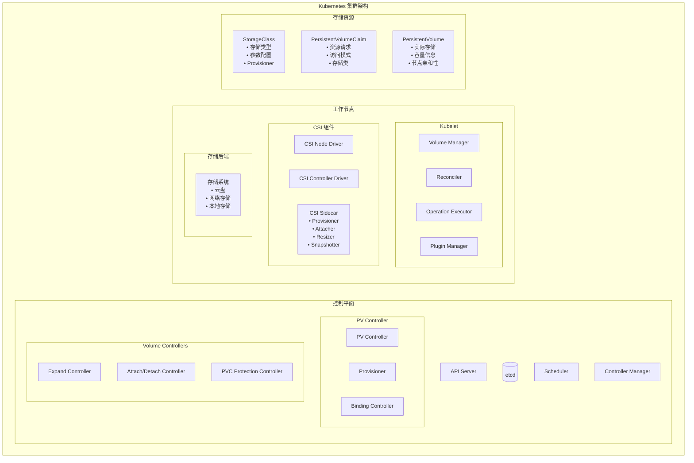
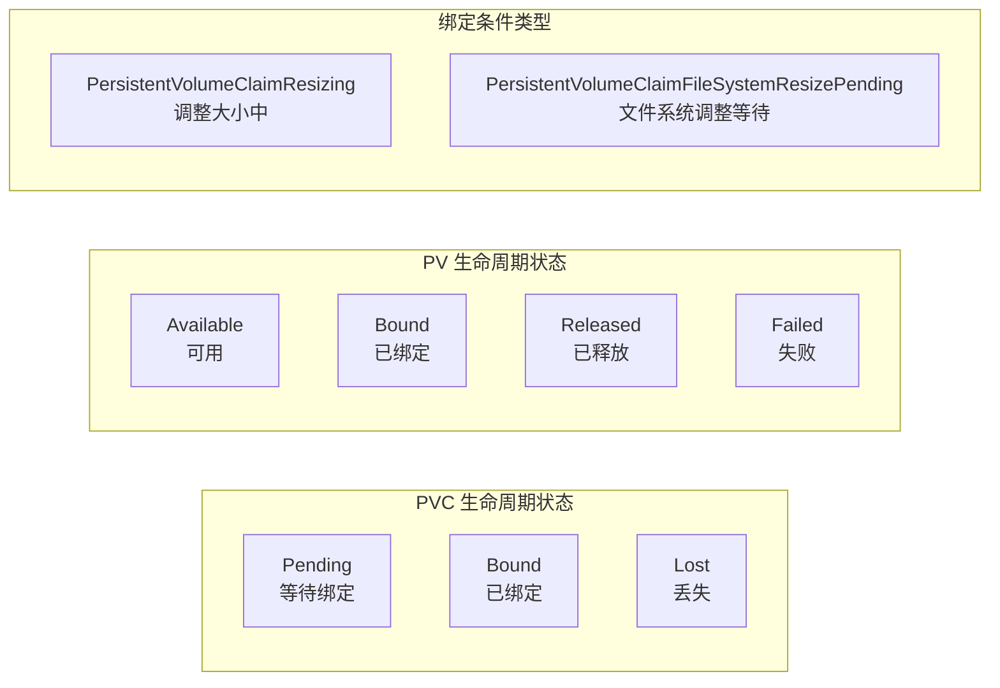
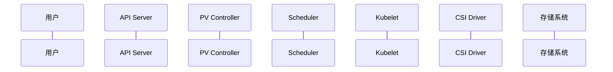
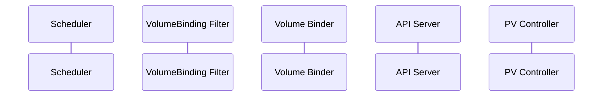
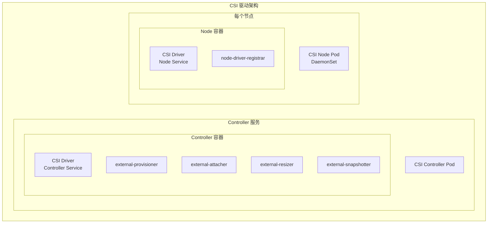
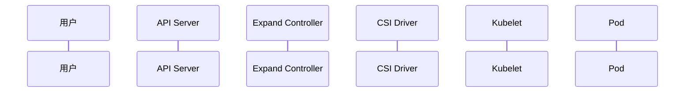
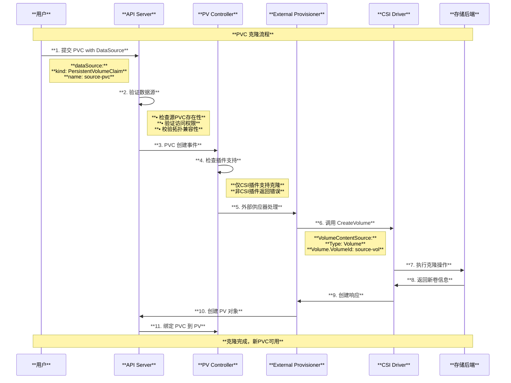
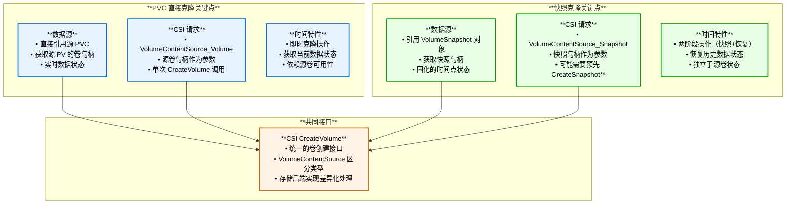

# Kubernetes PVC (PersistentVolumeClaim) 架构与原理深度解读

## 目录

1. [概述](#概述)
2. [PVC 核心概念](#pvc-核心概念)
3. [PVC 整体架构图](#pvc-整体架构图)
4. [PVC 数据结构与源码分析](#pvc-数据结构与源码分析)
5. [PVC 生命周期详解](#pvc-生命周期详解)
6. [动态存储供应机制](#动态存储供应机制)
7. [卷绑定与调度集成](#卷绑定与调度集成)
8. [CSI 驱动架构](#csi-驱动架构)
9. [存储卷扩展机制](#存储卷扩展机制)
10. [存储卷快照功能](#存储卷快照功能)
11. [PVC 保护与回收机制](#pvc-保护与回收机制)
12. [PVC 卷克隆机制](#pvc-卷克隆机制)
13. [最佳实践与调优建议](#最佳实践与调优建议)
14. [总结](#总结)

---

## 概述

PersistentVolumeClaim (PVC) 是 Kubernetes 中用于请求存储资源的声明式 API 对象。它是存储抽象层的核心组件，提供了一种标准化的方式来管理持久化存储需求。本文档基于 Kubernetes 源码深入解读 PVC 的架构设计、工作原理和实现机制。

### 核心特性

- **存储抽象**：为应用程序提供统一的存储接口
- **动态供应**：支持根据需求自动创建存储卷
- **声明式管理**：通过期望状态驱动的资源管理
- **多种存储后端**：支持云存储、网络存储、本地存储等
- **高级功能**：包括快照、扩展、拓扑感知等

---

## PVC 核心概念

### 1. 基本概念关系

- **PVC (PersistentVolumeClaim)**：存储资源请求，定义了应用对存储的需求
- **PV (PersistentVolume)**：实际的存储资源，集群级别的存储对象
- **StorageClass**：存储类别，定义了动态供应的策略和参数

### 2. 核心数据结构

根据源码 `staging/src/k8s.io/api/core/v1/types.go`：

```go
// PersistentVolumeClaim is a user's request for and claim to a persistent volume
type PersistentVolumeClaim struct {
    metav1.TypeMeta   `json:",inline"`
    metav1.ObjectMeta `json:"metadata,omitempty"`
    
    // Spec defines the desired characteristics of a volume requested by a pod author
    Spec PersistentVolumeClaimSpec `json:"spec,omitempty"`
    
    // Status represents the current information/status of a persistent volume claim
    Status PersistentVolumeClaimStatus `json:"status,omitempty"`
}

type PersistentVolumeClaimSpec struct {
    // AccessModes contains the desired access modes the volume should have
    AccessModes []PersistentVolumeAccessMode `json:"accessModes,omitempty"`
    
    // Selector is a label query over volumes to consider for binding
    Selector *metav1.LabelSelector `json:"selector,omitempty"`
    
    // Resources represents the minimum resources the volume should have
    Resources VolumeResourceRequirements `json:"resources,omitempty"`
    
    // VolumeName is the binding reference to the PersistentVolume backing this claim
    VolumeName string `json:"volumeName,omitempty"`
    
    // StorageClassName is the name of the StorageClass required by the claim
    StorageClassName *string `json:"storageClassName,omitempty"`
    
    // VolumeMode defines what type of volume is required by the claim
    VolumeMode *PersistentVolumeMode `json:"volumeMode,omitempty"`
    
    // DataSource field can be used to specify either:
    // * An existing VolumeSnapshot object
    // * An existing PVC
    DataSource *TypedLocalObjectReference `json:"dataSource,omitempty"`
}
```

---

## PVC 整体架构图



---

## PVC 数据结构与源码分析

### 1. PVC 状态管理

基于 `pkg/controller/volume/persistentvolume/pv_controller.go`：

```go
const (
    // PVC 阶段常量
    ClaimPending PersistentVolumeClaimPhase = "Pending"
    ClaimBound   PersistentVolumeClaimPhase = "Bound" 
    ClaimLost    PersistentVolumeClaimPhase = "Lost"
)

// PVC 条件类型
const (
    // PersistentVolumeClaimResizing - controller resize is in progress
    PersistentVolumeClaimResizing PersistentVolumeClaimConditionType = "Resizing"
    
    // PersistentVolumeClaimFileSystemResizePending - controller resize is finished 
    // and a file system resize is pending on node
    PersistentVolumeClaimFileSystemResizePending PersistentVolumeClaimConditionType = "FileSystemResizePending"
)
```

### 2. PV 控制器核心结构

```go
type PersistentVolumeController struct {
    volumeLister       corelisters.PersistentVolumeLister
    claimLister        corelisters.PersistentVolumeClaimLister  
    classLister        storagelisters.StorageClassLister
    
    kubeClient                clientset.Interface
    eventRecorder             record.EventRecorder
    volumePluginMgr           vol.VolumePluginMgr
    enableDynamicProvisioning bool
    
    // 操作时间戳缓存用于指标收集
    operationTimestamps *metrics.OperationStartTimeCache
}
```

---

## PVC 生命周期详解

### 1. 生命周期状态转换图



### 2. 绑定过程源码分析

基于 `pkg/controller/volume/persistentvolume/pv_controller.go`：

```go
// bind() 执行 PV 和 PVC 的双向绑定
func (ctrl *PersistentVolumeController) bind(ctx context.Context, volume *v1.PersistentVolume, claim *v1.PersistentVolumeClaim) error {
    // 1. 绑定 PV 到 PVC
    if updatedVolume, err = ctrl.bindVolumeToClaim(ctx, volume, claim); err != nil {
        return err
    }
    
    // 2. 更新 PV 状态为 Bound
    if updatedVolume, err = ctrl.updateVolumePhase(ctx, volume, v1.VolumeBound, ""); err != nil {
        return err  
    }
    
    // 3. 绑定 PVC 到 PV
    if updatedClaim, err = ctrl.bindClaimToVolume(ctx, claim, volume); err != nil {
        return err
    }
    
    // 4. 更新 PVC 状态为 Bound
    if updatedClaim, err = ctrl.updateClaimStatus(ctx, claim, v1.ClaimBound, volume); err != nil {
        return err
    }
    
    return nil
}
```

---

## 动态存储供应机制

### 1. 动态供应流程图



### 2. 供应逻辑实现

基于 `pkg/controller/volume/persistentvolume/pv_controller.go` 中的 `provisionClaim()` 方法：

```go
func (ctrl *PersistentVolumeController) provisionClaim(ctx context.Context, claim *v1.PersistentVolumeClaim) error {
    // 1. 检查是否启用动态供应
    if !ctrl.enableDynamicProvisioning {
        return nil
    }
    
    // 2. 查找合适的供应插件
    plugin, storageClass, err := ctrl.findProvisionablePlugin(claim)
    if err != nil {
        return nil  // 让外部控制器处理
    }
    
    // 3. 执行供应操作
    if plugin == nil {
        // 外部供应器（如 CSI）
        _, err = ctrl.provisionClaimOperationExternal(ctx, claim, storageClass)
    } else {
        // 内置供应器
        _, err = ctrl.provisionClaimOperation(ctx, claim, plugin, storageClass)
    }
    
    return err
}
```

### 3. StorageClass 配置

根据源码 `staging/src/k8s.io/api/storage/v1/types.go`：

```go
type StorageClass struct {
    metav1.TypeMeta   `json:",inline"`
    metav1.ObjectMeta `json:"metadata,omitempty"`
    
    // Provisioner indicates the type of the provisioner
    Provisioner string `json:"provisioner"`
    
    // Parameters holds the parameters for the provisioner
    Parameters map[string]string `json:"parameters,omitempty"`
    
    // ReclaimPolicy controls the reclaimPolicy for dynamically provisioned PVs
    ReclaimPolicy *v1.PersistentVolumeReclaimPolicy `json:"reclaimPolicy,omitempty"`
    
    // MountOptions controls the mountOptions for dynamically provisioned PVs
    MountOptions []string `json:"mountOptions,omitempty"`
    
    // AllowVolumeExpansion shows whether the storage class allows volume expand
    AllowVolumeExpansion *bool `json:"allowVolumeExpansion,omitempty"`
    
    // VolumeBindingMode indicates how PVCs should be provisioned and bound
    VolumeBindingMode *VolumeBindingMode `json:"volumeBindingMode,omitempty"`
    
    // AllowedTopologies restrict the node topologies where volumes can be provisioned
    AllowedTopologies []v1.TopologySelectorTerm `json:"allowedTopologies,omitempty"`
}
```

---

## 卷绑定与调度集成

### 1. 卷绑定调度流程



### 2. VolumeBinding 插件实现

基于 `pkg/scheduler/framework/plugins/volumebinding/volume_binding.go`：

```go
// VolumeBinding 插件实现多个调度扩展点
type VolumeBinding struct {
    Binder    SchedulerVolumeBinder
    PVCLister corelisters.PersistentVolumeClaimLister
    scorer    volumeCapacityScorer
}

// PreFilter 阶段：获取 Pod 的卷声明信息
func (pl *VolumeBinding) PreFilter(ctx context.Context, state *framework.CycleState, pod *v1.Pod) (*framework.PreFilterResult, *framework.Status) {
    podVolumeClaims, err := pl.Binder.GetPodVolumeClaims(logger, pod)
    if err != nil {
        return nil, framework.AsStatus(err)
    }
    
    // 检查立即绑定的 PVC
    if len(podVolumeClaims.unboundClaimsImmediate) > 0 {
        return nil, framework.NewStatus(framework.UnschedulableAndUnresolvable)
    }
    
    return result, nil
}

// Filter 阶段：检查节点是否满足卷要求
func (pl *VolumeBinding) Filter(ctx context.Context, cs *framework.CycleState, pod *v1.Pod, nodeInfo *framework.NodeInfo) *framework.Status {
    podVolumes, reasons, err := pl.Binder.FindPodVolumes(logger, pod, state.podVolumeClaims, node)
    if err != nil || len(reasons) > 0 {
        return framework.NewStatus(framework.UnschedulableAndUnresolvable)
    }
    
    // 缓存节点的卷绑定信息
    state.podVolumesByNode[node.Name] = podVolumes
    return nil
}
```

### 3. 卷绑定器核心逻辑

```go
// FindPodVolumes 查找 Pod 所需的卷
func (b *volumeBinder) FindPodVolumes(logger klog.Logger, pod *v1.Pod, podVolumeClaims *PodVolumeClaims, node *v1.Node) (*PodVolumes, ConflictReasons, error) {
    podVolumes := &PodVolumes{}
    
    // 检查已绑定的卷是否与节点兼容
    if len(podVolumeClaims.boundClaims) > 0 {
        boundVolumesSatisfied, boundPVsFound, err := b.checkBoundClaims(logger, podVolumeClaims.boundClaims, node, pod)
        if !boundVolumesSatisfied || !boundPVsFound {
            // 节点不兼容
            return podVolumes, reasons, nil
        }
    }
    
    // 为延迟绑定的 PVC 查找匹配的 PV
    if len(podVolumeClaims.unboundClaimsDelayBinding) > 0 {
        foundMatches, bindings, unboundClaims, err := b.findMatchingVolumes(logger, pod, podVolumeClaims.unboundClaimsDelayBinding, podVolumeClaims.unboundVolumesDelayBinding, node)
        
        podVolumes.StaticBindings = bindings
        podVolumes.DynamicProvisions = unboundClaims
    }
    
    return podVolumes, reasons, nil
}
```

---

## CSI 驱动架构

### 1. CSI 驱动整体架构



### 2. CSI 插件注册机制

基于 `pkg/volume/csi/csi_plugin.go`：

```go
// RegistrationHandler 处理 CSI 驱动注册
type RegistrationHandler struct{}

// RegisterPlugin 注册 CSI 插件
func (h *RegistrationHandler) RegisterPlugin(pluginName string, endpoint string, versions []string) error {
    // 1. 验证版本兼容性
    highestSupportedVersion, err := h.validateVersions("RegisterPlugin", pluginName, endpoint, versions)
    if err != nil {
        return err
    }
    
    // 2. 存储驱动信息
    csiDrivers.Set(pluginName, Driver{
        endpoint:                endpoint,
        highestSupportedVersion: highestSupportedVersion,
    })
    
    // 3. 获取节点信息
    csi, err := newCsiDriverClient(csiDriverName(pluginName))
    if err != nil {
        return err
    }
    
    driverNodeID, maxVolumePerNode, accessibleTopology, err := csi.NodeGetInfo(ctx)
    if err != nil {
        unregisterDriver(pluginName)
        return err
    }
    
    // 4. 安装 CSI 驱动到节点信息管理器
    err = nim.InstallCSIDriver(pluginName, driverNodeID, maxVolumePerNode, accessibleTopology)
    if err != nil {
        unregisterDriver(pluginName)
        return err
    }
    
    return nil
}
```

### 3. CSI 接口调用

基于 `pkg/volume/csi/csi_client.go`：

```go
// CSI 卷操作接口
type csiDriverClient struct {
    network     string
    addr        string
    metricsManager *metrics.CSIMetricsManager
    nodeV1ClientCreator nodeV1ClientCreator
}

// NodePublishVolume 在节点上发布卷
func (c *csiDriverClient) NodePublishVolume(ctx context.Context, opts nodePublishVolumeOptions) error {
    nodeClient, closer, err := c.nodeV1ClientCreator(c.addr, c.metricsManager)
    if err != nil {
        return err
    }
    defer closer.Close()
    
    req := &csipbv1.NodePublishVolumeRequest{
        VolumeId:         opts.volumeID,
        TargetPath:       opts.targetPath,
        VolumeCapability: opts.capability,
        Readonly:         opts.readOnly,
        Secrets:          opts.secrets,
        VolumeContext:    opts.volumeContext,
    }
    
    if opts.stagingTargetPath != "" {
        req.StagingTargetPath = opts.stagingTargetPath
    }
    
    _, err = nodeClient.NodePublishVolume(ctx, req)
    return err
}
```

---

## 存储卷扩展机制

### 1. 卷扩展流程图



### 2. Expand Controller 实现

基于 `pkg/controller/volume/expand/expand_controller.go`：

```go
type expandController struct {
    kubeClient      clientset.Interface
    pvcLister       corelisters.PersistentVolumeClaimLister
    volumePluginMgr volume.VolumePluginMgr
    
    operationGenerator operationexecutor.OperationGenerator
    translator         CSINameTranslator
}

// syncHandler 处理 PVC 扩展请求
func (expc *expandController) syncHandler(ctx context.Context, key string) error {
    pvc, err := expc.pvcLister.PersistentVolumeClaims(namespace).Get(name)
    if err != nil {
        return err
    }
    
    pv, err := expc.getPersistentVolume(ctx, pvc)
    if err != nil {
        return err
    }
    
    pvcRequestSize := pvc.Spec.Resources.Requests[v1.ResourceStorage]
    pvcStatusSize := pvc.Status.Capacity[v1.ResourceStorage]
    
    // 检查是否需要扩展
    if pvcRequestSize.Cmp(pvcStatusSize) <= 0 && !metav1.HasAnnotation(pv.ObjectMeta, util.AnnPreResizeCapacity) {
        return nil
    }
    
    // 查找可扩展的插件
    volumePlugin, err := expc.volumePluginMgr.FindExpandablePluginBySpec(volumeSpec)
    if err != nil || volumePlugin == nil {
        // 等待外部控制器处理
        expc.recorder.Event(pvc, v1.EventTypeNormal, events.ExternalExpanding, "waiting for an external controller to expand this PVC")
        return nil
    }
    
    // 执行扩展操作
    return expc.expand(logger, pvc, pv, volumePlugin.GetPluginName())
}
```

### 3. 节点层面文件系统扩展

```go
// NodeExpand 在节点上扩展文件系统
func (c *csiPlugin) NodeExpand(resizeOptions volume.NodeResizeOptions) (bool, error) {
    csiSource, err := getCSISourceFromSpec(resizeOptions.VolumeSpec)
    if err != nil {
        return false, err
    }
    
    csClient, err := newCsiDriverClient(csiDriverName(csiSource.Driver))
    if err != nil {
        return false, volumetypes.NewTransientOperationFailure(err.Error())
    }
    
    // 调用 CSI NodeExpandVolume
    opts := csiResizeOptions{
        volumeID:   csiSource.VolumeHandle,
        volumePath: resizeOptions.DeviceMountPath,
        newSize:    resizeOptions.NewSize,
        fsType:     csiSource.FSType,
        accessMode: pv.Spec.AccessModes[0],
        secrets:    secrets,
    }
    
    _, err = csClient.NodeExpandVolume(ctx, opts)
    if err != nil {
        if inUseError(err) {
            return false, volumetypes.NewFailedPreconditionError(err.Error())
        }
        return false, err
    }
    
    return true, nil
}
```

---

## 存储卷快照功能

### 1. 快照资源定义

基于 `cluster/addons/volumesnapshots/crd/` 中的 CRD 定义：

```yaml
apiVersion: apiextensions.k8s.io/v1
kind: CustomResourceDefinition
metadata:
  name: volumesnapshots.snapshot.storage.k8s.io
spec:
  group: snapshot.storage.k8s.io
  names:
    kind: VolumeSnapshot
    plural: volumesnapshots
  scope: Namespaced
```

### 2. 快照创建流程

```go
// VolumeSnapshot 规格定义
type VolumeSnapshotSpec struct {
    Source VolumeSnapshotSource `json:"source"`
    VolumeSnapshotClassName *string `json:"volumeSnapshotClassName,omitempty"`
}

type VolumeSnapshotSource struct {
    // 从 PVC 创建快照
    PersistentVolumeClaimName *string `json:"persistentVolumeClaimName,omitempty"`
    // 从现有快照内容创建
    VolumeSnapshotContentName *string `json:"volumeSnapshotContentName,omitempty"`  
}
```

### 3. 快照与恢复

基于测试代码可以看到快照的使用方式：

```go
// 从快照恢复 PVC
restoredPVC.Spec.DataSource = &v1.TypedLocalObjectReference{
    APIGroup: &group,  // "snapshot.storage.k8s.io"
    Kind:     "VolumeSnapshot",
    Name:     vs.GetName(),
}
```

---

## PVC 保护与回收机制

### 1. PVC 保护控制器

基于 `pkg/controller/volume/pvcprotection/pvc_protection_controller.go`：

```go
// Controller 负责 PVC 保护终结器的管理
type Controller struct {
    client clientset.Interface
    
    pvcLister       corelisters.PersistentVolumeClaimLister
    podLister       corelisters.PodLister
    podIndexer      cache.Indexer
}

// syncHandler 处理 PVC 保护逻辑
func (c *Controller) syncHandler(ctx context.Context, pvcNamespace, pvcName string) error {
    pvc, err := c.pvcLister.PersistentVolumeClaims(pvcNamespace).Get(pvcName)
    if err != nil {
        return err
    }
    
    if protectionutil.IsDeletionCandidate(pvc, volumeutil.PVCProtectionFinalizer) {
        // PVC 正在被删除，检查是否仍被使用
        isUsed, err := c.isBeingUsed(ctx, pvc)
        if err != nil {
            return err
        }
        if !isUsed {
            return c.removeFinalizer(ctx, pvc)
        }
    }
    
    if protectionutil.NeedToAddFinalizer(pvc, volumeutil.PVCProtectionFinalizer) {
        // PVC 需要添加保护终结器
        return c.addFinalizer(ctx, pvc)
    }
    
    return nil
}
```

### 2. PV 回收策略

```go
const (
    // PersistentVolumeReclaimRetain 保留策略
    PersistentVolumeReclaimRetain PersistentVolumeReclaimPolicy = "Retain"
    
    // PersistentVolumeReclaimRecycle 回收策略 (已废弃)
    PersistentVolumeReclaimRecycle PersistentVolumeReclaimPolicy = "Recycle"
    
    // PersistentVolumeReclaimDelete 删除策略
    PersistentVolumeReclaimDelete PersistentVolumeReclaimPolicy = "Delete"
)
```

---

## PVC 卷克隆机制

### 1. 克隆功能概述

PVC 卷克隆是 Kubernetes 1.15+ 引入的功能，允许从现有的 PVC 或 VolumeSnapshot 创建新的卷。这种功能特别适用于：

- **数据预填充**：创建包含现有数据的新卷
- **数据复制**：为开发/测试环境快速复制生产数据
- **数据迁移**：在不同存储类之间迁移数据
- **备份恢复**：从快照快速恢复数据

### 2. 克隆架构与流程图

```mermaid
graph TB
    subgraph CloneArch ["**PVC 克隆架构**"]
        subgraph UserLayer ["**用户请求层**"]
            USER[**用户**<br/>创建PVC with DataSource]
            YAML[**YAML 配置**<br/>• dataSource: PVC<br/>• dataSourceRef: 跨命名空间]
        end
        
        subgraph ControlPlane ["**控制平面处理**"]
            API[**API Server**<br/>• 验证克隆请求<br/>• 检查权限<br/>• 校验数据源]
            PVC_CTRL[**PV Controller**<br/>• 检查CSI支持<br/>• 处理供应请求]
            SCHEDULER[**Scheduler**<br/>• 拓扑约束检查<br/>• 节点亲和性判断]
        end
        
        subgraph CSILayer ["**CSI 驱动层**"]
            EXTERNAL_PROV[**External Provisioner**<br/>• 监听PVC事件<br/>• 调用CSI CreateVolume]
            CSI_CTRL[**CSI Controller**<br/>• 实现克隆逻辑<br/>• 处理拓扑要求]
        end
        
        subgraph StorageBackend ["**存储后端**"]
            STORAGE[**存储系统**<br/>• 执行实际克隆<br/>• 数据复制操作]
        end
    end
    
    USER --> YAML
    YAML --> API
    API --> PVC_CTRL
    PVC_CTRL --> SCHEDULER
    SCHEDULER --> EXTERNAL_PROV
    EXTERNAL_PROV --> CSI_CTRL
    CSI_CTRL --> STORAGE
    
    classDef cloneArchStyle fill:#f9f9f9,stroke:#333,stroke-width:2px,color:#000
    classDef userLayerStyle fill:#e6f3ff,stroke:#0066cc,stroke-width:2px,color:#000
    classDef controlPlaneStyle fill:#fff2e6,stroke:#cc6600,stroke-width:2px,color:#000
    classDef csiLayerStyle fill:#e6ffe6,stroke:#009900,stroke-width:2px,color:#000
    classDef storageStyle fill:#ffe6f2,stroke:#cc0066,stroke-width:2px,color:#000
    
    class CloneArch cloneArchStyle
    class UserLayer userLayerStyle
    class ControlPlane controlPlaneStyle
    class CSILayer csiLayerStyle
    class StorageBackend storageStyle
```



### 3. 数据源类型与配置

基于源码 `pkg/apis/core/types.go` 中的定义：

```go
// PVC 规格中的数据源字段
type PersistentVolumeClaimSpec struct {
    // DataSource - 传统数据源字段（同命名空间）
    DataSource *TypedLocalObjectReference `json:"dataSource,omitempty"`
    
    // DataSourceRef - 新数据源字段（支持跨命名空间）
    DataSourceRef *TypedObjectReference `json:"dataSourceRef,omitempty"`
}

// 支持的数据源类型
type TypedLocalObjectReference struct {
    APIGroup *string `json:"apiGroup"`
    Kind     string  `json:"kind"`      // "PersistentVolumeClaim" 或 "VolumeSnapshot"
    Name     string  `json:"name"`
}
```

### 4. 克隆流程详解



### 5. 源码实现分析

#### 5.1 数据源验证逻辑

基于 `pkg/api/persistentvolumeclaim/util.go`：

```go
// 检查数据源是否为 PVC 或快照
func dataSourceIsPvcOrSnapshot(dataSource *core.TypedLocalObjectReference) bool {
    if dataSource != nil {
        apiGroup := ""
        if dataSource.APIGroup != nil {
            apiGroup = *dataSource.APIGroup
        }
        
        // PVC 作为数据源（同命名空间）
        if dataSource.Kind == "PersistentVolumeClaim" && apiGroup == "" {
            return true
        }
        
        // VolumeSnapshot 作为数据源
        if dataSource.Kind == "VolumeSnapshot" && apiGroup == "snapshot.storage.k8s.io" {
            return true
        }
    }
    return false
}

// 数据源字段标准化处理
func NormalizeDataSources(pvcSpec *core.PersistentVolumeClaimSpec) {
    if !utilfeature.DefaultFeatureGate.Enabled(features.AnyVolumeDataSource) {
        return
    }
    
    // DataSource -> DataSourceRef 转换
    if pvcSpec.DataSource != nil && pvcSpec.DataSourceRef == nil {
        pvcSpec.DataSourceRef = &core.TypedObjectReference{
            Kind: pvcSpec.DataSource.Kind,
            Name: pvcSpec.DataSource.Name,
        }
        if pvcSpec.DataSource.APIGroup != nil {
            apiGroup := *pvcSpec.DataSource.APIGroup
            pvcSpec.DataSourceRef.APIGroup = &apiGroup
        }
    }
}
```

#### 5.2 CSI 支持验证

基于 `pkg/controller/volume/persistentvolume/pv_controller.go`：

```go
func (ctrl *PersistentVolumeController) provisionClaimOperation(
    ctx context.Context,
    claim *v1.PersistentVolumeClaim,
    plugin vol.ProvisionableVolumePlugin,
    storageClass *storage.StorageClass) (string, error) {
    
    pluginName := plugin.GetPluginName()
    
    // 只有 CSI 插件支持数据源
    if pluginName != "kubernetes.io/csi" && claim.Spec.DataSource != nil {
        strerr := fmt.Sprintf("plugin %q is not a CSI plugin. Only CSI plugin can provision a claim with a datasource", pluginName)
        ctrl.eventRecorder.Event(claim, v1.EventTypeWarning, events.ProvisioningFailed, strerr)
        return pluginName, fmt.Errorf(strerr)
    }
    
    // 执行供应操作
    return ctrl.executeProvisioning(ctx, claim, plugin, storageClass)
}
```

### 6. 拓扑约束与调度

基于测试代码 `test/e2e/storage/testsuites/provisioning.go`：

```go
// 克隆操作的拓扑约束处理
func ensureTopologyRequirements(ctx context.Context, nodeSelection *storageframework.TestNodeSelection, cs clientset.Interface, dInfo *storageframework.DriverInfo, volumeCount int) error {
    
    // 某些驱动不支持跨可用区克隆
    // 需要将所有Pod调度到同一拓扑段（如云可用区）
    if nodeSelection.Name == "" {
        return scheduleToSameTopologySegment(ctx, nodeSelection, cs, dInfo, volumeCount)
    }
    
    return nil
}

// 等待卷分离完成再进行克隆
func waitForVolumeDetachment(ctx context.Context, f *framework.Framework, sourcePVC *v1.PersistentVolumeClaim) error {
    // 克隆失败如果源磁盘仍在分离过程中
    // 因此在克隆前等待 VolumeAttachment 移除
    volumeAttachment := getVolumeAttachmentName(ctx, f.ClientSet, sourcePVC)
    return waitForVolumeAttachmentTerminated(ctx, volumeAttachment, f.ClientSet)
}
```

### 7. 克隆配置示例

#### 7.1 从 PVC 克隆

```yaml
apiVersion: v1
kind: PersistentVolumeClaim
metadata:
  name: clone-of-source-pvc
  namespace: default
spec:
  # 访问模式
  accessModes:
    - ReadWriteOnce
  # 存储需求（可以大于源PVC）
  resources:
    requests:
      storage: 20Gi  # 源PVC只有10Gi
  # 存储类
  storageClassName: fast-ssd
  # **数据源：从现有PVC克隆**
  dataSource:
    kind: PersistentVolumeClaim
    name: source-pvc
```

#### 7.2 从快照克隆

```yaml
apiVersion: v1
kind: PersistentVolumeClaim
metadata:
  name: restore-from-snapshot
  namespace: default
spec:
  accessModes:
    - ReadWriteOnce
  resources:
    requests:
      storage: 15Gi
  storageClassName: fast-ssd
  # **数据源：从快照恢复**
  dataSource:
    apiGroup: snapshot.storage.k8s.io
    kind: VolumeSnapshot
    name: source-snapshot
```

#### 7.3 跨命名空间克隆

```yaml
apiVersion: v1
kind: PersistentVolumeClaim
metadata:
  name: cross-namespace-clone
  namespace: dev
spec:
  accessModes:
    - ReadWriteOnce
  resources:
    requests:
      storage: 10Gi
  storageClassName: standard
  # **使用 dataSourceRef 进行跨命名空间克隆**
  dataSourceRef:
    kind: PersistentVolumeClaim
    name: prod-data
    namespace: production  # 跨命名空间引用
```

### 8. 克隆状态监控

```bash
# 查看克隆 PVC 状态
kubectl describe pvc clone-of-source-pvc

# 查看相关事件
kubectl get events --field-selector involvedObject.name=clone-of-source-pvc

# 检查源 PVC 状态
kubectl describe pvc source-pvc

# 查看存储类支持的功能
kubectl describe storageclass fast-ssd
```

### 9. 克隆限制与注意事项

#### 9.1 技术限制

1. **CSI 驱动要求**：只有 CSI 驱动支持克隆功能
2. **拓扑约束**：某些驱动不支持跨可用区克隆
3. **访问模式**：克隆的 PVC 可以有不同的访问模式
4. **存储大小**：克隆的 PVC 不能小于源 PVC

#### 9.2 性能考量

```go
// 克隆操作的性能优化建议
type CloneOptimization struct {
    // 1. 等待源卷完全分离
    WaitForDetachment bool
    
    // 2. 选择合适的拓扑段
    TopologyAware bool
    
    // 3. 批量操作时的并发控制
    ConcurrencyLimit int
    
    // 4. 监控克隆进度
    ProgressMonitoring bool
}
```

### 10. 使用场景与最佳实践

#### 10.1 开发测试环境

```yaml
# 为开发环境快速创建测试数据
apiVersion: v1
kind: PersistentVolumeClaim
metadata:
  name: dev-database
  namespace: development
spec:
  accessModes:
    - ReadWriteOnce
  resources:
    requests:
      storage: 5Gi  # 开发环境用较小存储
  storageClassName: standard
  dataSource:
    kind: PersistentVolumeClaim
    name: prod-database
    namespace: production  # 从生产环境克隆
```

#### 10.2 数据备份恢复

```yaml
# 从定期快照快速恢复数据
apiVersion: v1
kind: PersistentVolumeClaim
metadata:
  name: recovered-data
spec:
  accessModes:
    - ReadWriteOnce
  resources:
    requests:
      storage: 50Gi
  storageClassName: high-performance
  dataSource:
    apiGroup: snapshot.storage.k8s.io
    kind: VolumeSnapshot
    name: daily-backup-snapshot
```

## PVC 克隆 vs 快照克隆对比分析

### 1. CSI 接口调用机制澄清

**重要澄清**：基于源码分析发现，PVC 克隆和快照克隆都**不是**调用 CSI 的 `CreateSnapshot` 接口，而是都调用 `CreateVolume` 接口，但使用不同的 `VolumeContentSource` 类型：

#### 1.1 接口调用对比

基于 `test/e2e/storage/drivers/csi-test/mock/service/controller.go` 源码：

```go
// CreateVolume 接口处理克隆逻辑
func (s *service) CreateVolume(ctx context.Context, req *csi.CreateVolumeRequest) (*csi.CreateVolumeResponse, error) {
    // 🔍 关键：两种克隆都调用 CreateVolume，区别在于 VolumeContentSource 类型
    if req.GetVolumeContentSource() != nil {
        switch req.GetVolumeContentSource().GetType().(type) {
        case *csi.VolumeContentSource_Snapshot:
            // **快照克隆**：从快照创建新卷
            sid := req.GetVolumeContentSource().GetSnapshot().GetSnapshotId()
            if snapID, _ := s.snapshots.FindSnapshot("id", sid); snapID >= 0 {
                v = s.newVolumeFromSnapshot(req.Name, capacity, snapID)
            } else {
                return nil, status.Errorf(codes.NotFound, "Requested source snapshot %s not found", sid)
            }
            
        case *csi.VolumeContentSource_Volume:
            // **PVC 克隆**：从现有卷克隆
            vid := req.GetVolumeContentSource().GetVolume().GetVolumeId()
            if volID, _ := s.findVolNoLock("id", vid); volID >= 0 {
                v = s.newVolumeFromVolume(req.Name, capacity, volID)
            } else {
                return nil, status.Errorf(codes.NotFound, "Requested source volume %s not found", vid)
            }
        }
    } else {
        // 普通创建：无数据源
        v = s.newVolume(req.Name, capacity)
    }
    
    return &csi.CreateVolumeResponse{Volume: &v}, nil
}
```

#### 1.2 CSI CreateSnapshot 接口的真正用途

`CreateSnapshot` 接口仅用于**创建快照本身**，不用于克隆操作：

```go
// CreateSnapshot 专门用于创建快照
rpc CreateSnapshot(CreateSnapshotRequest) returns (CreateSnapshotResponse) {}

// CreateSnapshotRequest 参数
message CreateSnapshotRequest {
    string name = 1;                    // 快照名称
    string source_volume_id = 2;        // **源卷ID（被快照的卷）**
    map<string, string> secrets = 3;    // 认证信息
    map<string, string> parameters = 4; // 快照参数
}
```

### 2. 技术机制对比

PVC 克隆和快照克隆都是通过 CSI 的 `CreateVolume` 接口实现，但使用不同的 `VolumeContentSource` 类型：

```go
// 基于 test/e2e/storage/drivers/csi-test/mock/service/controller.go
func (s *service) CreateVolume(ctx context.Context, req *csi.CreateVolumeRequest) (*csi.CreateVolumeResponse, error) {
    // Create volume from content source if provided.
    if req.GetVolumeContentSource() != nil {
        switch req.GetVolumeContentSource().GetType().(type) {
        case *csi.VolumeContentSource_Snapshot:
            // **快照克隆**：从快照创建新卷
            sid := req.GetVolumeContentSource().GetSnapshot().GetSnapshotId()
            if snapID, _ := s.snapshots.FindSnapshot("id", sid); snapID >= 0 {
                v = s.newVolumeFromSnapshot(req.Name, capacity, snapID)
            } else {
                return nil, status.Errorf(codes.NotFound, "Requested source snapshot %s not found", sid)
            }
        case *csi.VolumeContentSource_Volume:
            // **PVC 克隆**：从现有卷克隆
            vid := req.GetVolumeContentSource().GetVolume().GetVolumeId()
            if volID, _ := s.findVolNoLock("id", vid); volID >= 0 {
                v = s.newVolumeFromVolume(req.Name, capacity, volID)
            } else {
                return nil, status.Errorf(codes.NotFound, "Requested source volume %s not found", vid)
            }
        }
    }
}
```

### 2. 数据源类型详解

#### 2.1 PVC 克隆数据源

```yaml
# PVC 直接克隆
apiVersion: v1
kind: PersistentVolumeClaim
metadata:
  name: clone-from-pvc
spec:
  dataSource:
    kind: PersistentVolumeClaim  # **数据源类型：PVC**
    name: source-pvc
  # 其他规格配置...
```

#### 2.2 快照克隆数据源

```yaml
# 从快照恢复
apiVersion: v1
kind: PersistentVolumeClaim
metadata:
  name: restore-from-snapshot
spec:
  dataSource:
    apiGroup: snapshot.storage.k8s.io  # **快照 API 组**
    kind: VolumeSnapshot              # **数据源类型：快照**
    name: volume-snapshot-name
```

### 3. 克隆流程时序图详细对比

#### 3.1 PVC 直接克隆增强时序图（含源卷使用判断与分离逻辑）

```mermaid
sequenceDiagram
    participant User as **用户**
    participant APIServer as **API Server**
    participant PVController as **PV Controller**
    participant ExternalProvisioner as **External Provisioner**
    participant ExternalAttacher as **External Attacher**
    participant CSIController as **CSI Controller**
    participant StorageBackend as **存储后端**
    
    Note over User,StorageBackend: **PVC 克隆完整流程（含源卷状态管理）**
    
        Note over User,StorageBackend: **阶段1: 源卷状态检查与准备**
        
        User->>APIServer: **1. 创建目标 PVC**
        Note right of User: **PVC 配置：**<br/>**dataSource:**<br/>**  kind: PersistentVolumeClaim**<br/>**  name: source-pvc**
        
        APIServer->>PVController: **2. PVC 创建事件**
        PVController->>PVController: **3. 验证源 PVC**
        Note right of PVController: **检查项：**<br/>**• 源 PVC 是否存在**<br/>**• 源 PVC 是否已绑定**<br/>**• 访问权限验证**
        
        PVController->>APIServer: **4. 查询源 PVC 状态**
        APIServer->>PVController: **5. 返回源 PVC 详情**
        
        alt 源 PVC 正在被 Pod 使用
            PVController->>PVController: **6a. 检测源卷使用状态**
            Note right of PVController: **判断逻辑：**<br/>**• 检查 VolumeAttachment 对象**<br/>**• 检查 Pod 挂载引用**<br/>**• 评估克隆安全性**
            
            alt CSI 驱动支持在线克隆
                PVController->>PVController: **7a1. 允许在线克隆**
                Note right of PVController: **在线克隆：**<br/>**• 源卷保持附加状态**<br/>**• 一致性由存储保证**<br/>**• 性能影响最小**
            else CSI 驱动不支持在线克隆
                PVController->>User: **7a2. 拒绝克隆请求**
                Note right of PVController: **错误提示：**<br/>**"source volume is in use"**<br/>**"driver does not support online clone"**
            end
        else 源 PVC 未被使用
            PVController->>PVController: **6b. 源卷空闲确认**
            Note right of PVController: **安全克隆条件：**<br/>**• 无 Pod 使用**<br/>**• 无附加状态**<br/>**• 数据一致性保证**
        end
    end
    
        Note over User,StorageBackend: **阶段2: 卷克隆执行**
        
        APIServer->>ExternalProvisioner: **8. PVC 创建事件**
        ExternalProvisioner->>ExternalProvisioner: **9. 检测数据源类型**
        Note right of ExternalProvisioner: **识别为 PVC 克隆请求**<br/>**获取源卷句柄**
        
        ExternalProvisioner->>APIServer: **10. 查询源 PV 详情**
        APIServer->>ExternalProvisioner: **11. 返回源 PV 卷句柄**
        
        ExternalProvisioner->>CSIController: **12. CreateVolume() - 克隆**
        Note right of ExternalProvisioner: **CreateVolumeRequest:**<br/>**• Name: target-volume-name**<br/>**• CapacityRange: requested-size**<br/>**• VolumeContentSource:**<br/>**  • Type: Volume**<br/>**  • Volume.VolumeId: source-vol-handle**<br/>**• Parameters: clone-specific-params**
        
        CSIController->>CSIController: **13. 验证克隆能力**
        Note right of CSIController: **克隆前检查：**<br/>**• 验证源卷存在**<br/>**• 检查克隆支持**<br/>**• 容量兼容性检查**
        
        CSIController->>StorageBackend: **14. 执行存储级克隆**
        Note right of CSIController: **存储后端操作：**<br/>**• 识别源卷**<br/>**• 创建克隆卷**<br/>**• CoW 或完整拷贝**<br/>**• 元数据同步**
        
        StorageBackend->>CSIController: **15. 返回新卷信息**
        Note left of StorageBackend: **克隆结果：**<br/>**• 新卷句柄**<br/>**• 克隆完成状态**<br/>**• 数据一致性确认**
        
        CSIController->>ExternalProvisioner: **16. CreateVolumeResponse**
        Note left of CSIController: **Volume:**<br/>**• VolumeId: new-volume-handle**<br/>**• CapacityBytes: actual-size**<br/>**• VolumeContext: clone-metadata**<br/>**• ContentSource: source-vol-ref**
        
        ExternalProvisioner->>APIServer: **17. 创建目标 PV**
        APIServer->>APIServer: **18. 绑定目标 PVC 到新 PV**
    end
    
        Note over User,StorageBackend: **阶段3: 源卷分离逻辑（如需要）**
        
        alt 克隆期间需要源卷分离
            CSIController->>ExternalAttacher: **19a. 请求临时分离源卷**
            Note right of CSIController: **分离场景：**<br/>**• 存储系统要求**<br/>**• 一致性快照需要**<br/>**• 特定驱动限制**
            
            ExternalAttacher->>APIServer: **20a. 更新 VolumeAttachment**
            Note right of ExternalAttacher: **标记源卷分离中**
            
            ExternalAttacher->>CSIController: **21a. ControllerUnpublishVolume()**
            CSIController->>StorageBackend: **22a. 从节点分离源卷**
            StorageBackend->>CSIController: **23a. 分离完成**
            CSIController->>ExternalAttacher: **24a. 分离确认**
            
            Note over CSIController,StorageBackend: **执行克隆操作**
            
            ExternalAttacher->>CSIController: **25a. ControllerPublishVolume()**
            Note right of ExternalAttacher: **克隆完成后重新附加源卷**
            
            CSIController->>StorageBackend: **26a. 重新附加源卷**
            StorageBackend->>CSIController: **27a. 附加完成**
            CSIController->>ExternalAttacher: **28a. 附加确认**
            ExternalAttacher->>APIServer: **29a. 更新 VA 状态为已附加**
        else 无需分离（在线克隆）
            Note over CSIController,StorageBackend: **30b. 在线克隆完成**<br/>**源卷保持正常使用状态**
        end
    end
    
    APIServer->>User: **31. 克隆完成，目标 PVC 可用**
    
    Note over User,StorageBackend: **PVC 克隆完成，源卷状态已恢复**
```

#### 3.2 快照克隆时序图

```mermaid
sequenceDiagram
    participant User as **用户**
    participant APIServer as **API Server**
    participant SnapshotController as **Snapshot Controller**
    participant ExternalSnapshotter as **External Snapshotter**  
    participant ExternalProvisioner as **External Provisioner**
    participant CSIController as **CSI Controller**
    participant StorageBackend as **存储后端**
    
    Note over User,StorageBackend: **快照克隆完整流程**
    
        Note over User,StorageBackend: **阶段1：创建快照（如果不存在）**
        
        User->>APIServer: **1a. 创建 VolumeSnapshot**
        Note right of User: **VolumeSnapshot:**<br/>**• source.pvcName: source-pvc**<br/>**• volumeSnapshotClassName: snap-class**
        
        APIServer->>SnapshotController: **2a. VolumeSnapshot 事件**
        SnapshotController->>APIServer: **3a. 创建 VolumeSnapshotContent**
        
        APIServer->>ExternalSnapshotter: **4a. VolumeSnapshotContent 事件**
        ExternalSnapshotter->>CSIController: **5a. CreateSnapshot()**
        Note right of ExternalSnapshotter: **CreateSnapshotRequest:**<br/>**• Name: snapshot-name**<br/>**• SourceVolumeId: source-vol-handle**<br/>**• Parameters: snap-parameters**
        
        CSIController->>StorageBackend: **6a. 创建存储快照**
        StorageBackend->>CSIController: **7a. 返回快照句柄**
        CSIController->>ExternalSnapshotter: **8a. CreateSnapshotResponse**
        ExternalSnapshotter->>APIServer: **9a. 更新快照状态为 Ready**
    end
    
        Note over User,StorageBackend: **阶段2：从快照恢复新卷**
        
        User->>APIServer: **1b. 创建目标 PVC**
        Note right of User: **PVC 配置：**<br/>**dataSource:**<br/>**  apiGroup: snapshot.storage.k8s.io**<br/>**  kind: VolumeSnapshot**<br/>**  name: volume-snapshot**
        
        APIServer->>ExternalProvisioner: **2b. PVC 创建事件**
        ExternalProvisioner->>ExternalProvisioner: **3b. 检测数据源类型**
        Note right of ExternalProvisioner: **识别为快照克隆请求**<br/>**获取快照信息**
        
        ExternalProvisioner->>APIServer: **4b. 查询 VolumeSnapshot**
        APIServer->>ExternalProvisioner: **5b. 返回快照和内容信息**
        
        ExternalProvisioner->>CSIController: **6b. CreateVolume() - 快照克隆**
        Note right of ExternalProvisioner: **CreateVolumeRequest:**<br/>**• Name: target-volume-name**<br/>**• CapacityRange: requested-size**<br/>**• VolumeContentSource:**<br/>**  • Type: Snapshot**<br/>**  • Snapshot.SnapshotId: snap-handle**
        
        CSIController->>StorageBackend: **7b. 从快照创建新卷**
        Note right of CSIController: **存储后端操作：**<br/>**• 识别快照句柄**<br/>**• 从快照恢复数据**<br/>**• 创建新的存储卷**
        
        StorageBackend->>CSIController: **8b. 返回恢复的卷**
        Note left of StorageBackend: **新卷已创建**<br/>**包含快照时间点数据**
        
        CSIController->>ExternalProvisioner: **9b. CreateVolumeResponse**
        ExternalProvisioner->>APIServer: **10b. 创建目标 PV**
        APIServer->>APIServer: **11b. 绑定目标 PVC 到新 PV**
        APIServer->>User: **12b. 恢复完成，PVC 可用**
    end
    
    Note over User,StorageBackend: **快照克隆完成，包含快照时间点数据**
```

#### 3.3 关键差异总结



### 4. 卷克隆底层实现原理

#### 4.1 存储级克隆技术对比

```mermaid
graph TB
    subgraph CloneTechnologies ["**卷克隆底层技术**"]
        subgraph FullCopy ["**完整拷贝（Full Copy）**"]
            FullCopyMech[**实现机制**<br/>• 逐块数据复制<br/>• 完全独立的副本<br/>• 不依赖源卷]
            
            FullCopyProcess[**拷贝过程**<br/>• 读取源卷所有块<br/>• 写入目标卷<br/>• 可并行加速<br/>• 时间与卷大小成正比]
            
            FullCopyProps[**特性**<br/>• 耗时较长<br/>• 占用完整空间<br/>• 完全独立<br/>• 性能稳定]
        end
        
        subgraph CoWCopy ["**写时复制（Copy-on-Write）**"]
            CoWMech[**实现机制**<br/>• 共享源卷数据块<br/>• 写入时才复制<br/>• 元数据链接<br/>• 空间高效]
            
            CoWProcess[**克隆过程**<br/>• 创建元数据映射<br/>• 指向源卷数据块<br/>• 即时完成<br/>• 延迟数据拷贝]
            
            CoWProps[**特性**<br/>• 克隆速度快<br/>• 初始空间小<br/>• 依赖源卷<br/>• 写入有开销]
        end
        
        subgraph RoWCopy ["**写时重定向（Redirect-on-Write）**"]
            RoWMech[**实现机制**<br/>• 克隆时完整复制<br/>• 写入时重定向<br/>• 源卷不变<br/>• 写入到新位置]
            
            RoWProcess[**克隆过程**<br/>• 创建快照<br/>• 新写入到克隆卷<br/>• 保护源卷数据<br/>• 读取优先源卷]
            
            RoWProps[**特性**<br/>• 保护源卷<br/>• 克隆速度快<br/>• 写入性能好<br/>• 管理复杂]
        end
        
        subgraph RefLink ["**引用链接（RefLink）**"]
            RefLinkMech[**实现机制**<br/>• 文件系统层面<br/>• 共享数据块<br/>• 自动 CoW<br/>• Btrfs/XFS 支持]
            
            RefLinkProcess[**克隆过程**<br/>• 文件系统 reflink<br/>• 共享 extent<br/>• 即时完成<br/>• 文件级操作]
            
            RefLinkProps[**特性**<br/>• 极快速度<br/>• 空间高效<br/>• 需文件系统支持<br/>• 透明 CoW]
        end
    end
    
    FullCopyMech --> FullCopyProcess
    FullCopyProcess --> FullCopyProps
    
    CoWMech --> CoWProcess
    CoWProcess --> CoWProps
    
    RoWMech --> RoWProcess
    RoWProcess --> RoWProps
    
    RefLinkMech --> RefLinkProcess
    RefLinkProcess --> RefLinkProps
    
    classDef fullStyle fill:#e6f3ff,stroke:#0066cc,stroke-width:2px,color:#000
    classDef cowStyle fill:#fff2e6,stroke:#cc6600,stroke-width:2px,color:#000
    classDef rowStyle fill:#e6ffe6,stroke:#009900,stroke-width:2px,color:#000
    classDef reflinkStyle fill:#ffe6f0,stroke:#cc0066,stroke-width:2px,color:#000
    
    class FullCopyMech,FullCopyProcess,FullCopyProps fullStyle
    class CoWMech,CoWProcess,CoWProps cowStyle
    class RoWMech,RoWProcess,RoWProps rowStyle
    class RefLinkMech,RefLinkProcess,RefLinkProps reflinkStyle
```



#### 4.2 Copy-on-Write（CoW）详细实现原理

```mermaid
sequenceDiagram
    participant User as **用户**
    participant CSI as **CSI Controller**
    participant MetadataEngine as **元数据引擎**
    participant DataBlocks as **数据块存储**
    
    Note over User,DataBlocks: **CoW 克隆实现流程**
    
        Note over User,DataBlocks: **阶段1: 克隆创建（秒级完成）**
        
        User->>CSI: **1. 请求克隆卷**
        CSI->>MetadataEngine: **2. 创建新卷元数据**
        Note right of CSI: **新卷ID: clone-vol-001**<br/>**源卷ID: source-vol-001**
        
        MetadataEngine->>MetadataEngine: **3. 复制元数据映射**
        Note right of MetadataEngine: **克隆卷元数据：**<br/>**Block 0 → Source Block 0**<br/>**Block 1 → Source Block 1**<br/>**...**<br/>**Block N → Source Block N**<br/>**所有块指向源卷数据块**
        
        MetadataEngine->>DataBlocks: **4. 标记数据块为共享**
        Note right of MetadataEngine: **增加引用计数**
        
        DataBlocks->>MetadataEngine: **5. 共享标记完成**
        MetadataEngine->>CSI: **6. 克隆创建完成**
        CSI->>User: **7. 返回克隆卷句柄**
        
        Note over User,DataBlocks: **克隆完成，未复制任何数据块**
    end
    
        Note over User,DataBlocks: **阶段2: 读取操作（无开销）**
        
        User->>CSI: **8. 从克隆卷读取 Block 5**
        CSI->>MetadataEngine: **9. 查询 Block 5 位置**
        MetadataEngine->>CSI: **10. 返回源数据块位置**
        Note left of MetadataEngine: **Block 5 → Source Block 5**<br/>**直接读取源块**
        
        CSI->>DataBlocks: **11. 读取 Source Block 5**
        DataBlocks->>CSI: **12. 返回数据**
        CSI->>User: **13. 数据返回**
        
        Note over User,DataBlocks: **读取性能与普通卷相同**
    end
    
        Note over User,DataBlocks: **阶段3: 写入操作（触发拷贝）**
        
        User->>CSI: **14. 向克隆卷写入 Block 3**
        CSI->>MetadataEngine: **15. 查询 Block 3 状态**
        MetadataEngine->>CSI: **16. 返回：Block 3 为共享块**
        
        CSI->>DataBlocks: **17. 分配新数据块**
        DataBlocks->>CSI: **18. 返回新块地址: New Block 103**
        
        CSI->>DataBlocks: **19. 复制 Source Block 3 → New Block 103**
        Note right of CSI: **Copy-on-Write 发生**<br/>**仅复制被写入的块**
        
        DataBlocks->>CSI: **20. 拷贝完成**
        
        CSI->>DataBlocks: **21. 写入新数据到 New Block 103**
        DataBlocks->>CSI: **22. 写入完成**
        
        CSI->>MetadataEngine: **23. 更新克隆卷元数据**
        Note right of CSI: **更新映射：**<br/>**Block 3 → New Block 103**<br/>**（不再指向源块）**
        
        MetadataEngine->>MetadataEngine: **24. 减少 Source Block 3 引用计数**
        MetadataEngine->>CSI: **25. 元数据更新完成**
        CSI->>User: **26. 写入操作完成**
        
        Note over User,DataBlocks: **仅被修改的块被实际复制**
    end
    
        Note over User,DataBlocks: **阶段4: 空间增长管理**
        
        Note over MetadataEngine,DataBlocks: **克隆卷空间使用 = **<br/>**初始元数据大小 + 已写入块大小**
        
        MetadataEngine->>MetadataEngine: **持续跟踪**
        Note right of MetadataEngine: **统计信息：**<br/>**• 共享块数量**<br/>**• 独立块数量**<br/>**• 实际占用空间**<br/>**• 潜在最大空间**
    end
    
    Note over User,DataBlocks: **CoW 实现完成：空间高效，按需拷贝**
```

#### 4.3 不同存储系统的克隆实现

| 存储系统 | 克隆技术 | 实现层级 | 克隆速度 | 空间效率 | 性能影响 | 独立性 |
|---------|---------|---------|---------|---------|---------|--------|
| **AWS EBS** | 增量快照 + CoW | 块设备层 | 快（秒级） | 高（共享块） | 低 | 中（依赖快照） |
| **GCE PD** | 快照恢复 | 块设备层 | 中（分钟级） | 高（增量） | 低 | 高（完全独立） |
| **Azure Disk** | 托管快照 | 块设备层 | 快（秒级） | 高（增量） | 低 | 高（独立快照） |
| **Ceph RBD** | CoW 克隆 | 分布式块层 | 极快（秒级） | 极高（CoW） | 低 | 低（依赖父卷） |
| **NetApp** | FlexClone | 文件系统层 | 极快（秒级） | 极高（CoW） | 极低 | 中（共享块） |
| **ZFS** | 克隆快照 | 文件系统层 | 极快（即时） | 极高（CoW） | 极低 | 低（依赖快照） |
| **Btrfs** | RefLink | 文件系统层 | 极快（即时） | 极高（RefLink） | 极低 | 低（共享 extent） |
| **LVM** | 快照 + dd | 逻辑卷层 | 慢（完整拷贝） | 低（完整副本） | 高 | 高（完全独立） |

##### 4.3.1 AWS EBS 克隆实现时序图

```mermaid
sequenceDiagram
    participant CSI as **CSI Driver**
    participant AWSAPI as **AWS EBS API**
    participant SourceVolume as **源 EBS 卷**
    participant Snapshot as **EBS 快照**
    participant ClonedVolume as **克隆 EBS 卷**
    
    Note over CSI,ClonedVolume: **AWS EBS 增量快照 + CoW 克隆**
    
        Note over CSI,ClonedVolume: **阶段1: 创建快照**
        
        CSI->>AWSAPI: **1. CreateSnapshot(VolumeId)**
        AWSAPI->>SourceVolume: **2. 拍摄快照**
        Note right of AWSAPI: **增量快照：**<br/>**• 第一次：完整数据**<br/>**• 后续：仅变化块**
        
        SourceVolume->>Snapshot: **3. 异步传输数据到 S3**
        Note right of SourceVolume: **后台增量传输**<br/>**不阻塞源卷 I/O**
        
        AWSAPI->>CSI: **4. 返回快照 ID（pending）**
        Note left of AWSAPI: **快照状态：pending**<br/>**可立即用于克隆**
        
        Snapshot->>Snapshot: **5. 后台完成数据传输**
        Note right of Snapshot: **异步完成**<br/>**状态变为 completed**
    end
    
        Note over CSI,ClonedVolume: **阶段2: 从快照创建新卷**
        
        CSI->>AWSAPI: **6. CreateVolume(SnapshotId)**
        Note right of CSI: **指定快照 ID 作为源**
        
        AWSAPI->>ClonedVolume: **7. 创建新 EBS 卷**
        Note right of AWSAPI: **即时创建（秒级）**<br/>**使用 CoW 技术**
        
        ClonedVolume->>ClonedVolume: **8. 初始化 CoW 元数据**
        Note right of ClonedVolume: **指针指向快照数据块**<br/>**不立即复制数据**
        
        AWSAPI->>CSI: **9. 返回新卷 ID**
        Note left of AWSAPI: **新卷立即可用**<br/>**容量独立计算**
    end
    
        Note over CSI,ClonedVolume: **阶段3: 使用克隆卷（按需复制）**
        
        CSI->>ClonedVolume: **10. 读取数据块 N**
        
        alt 数据块 N 未修改
            ClonedVolume->>Snapshot: **11a. 从快照读取**
            Note right of ClonedVolume: **快速访问共享块**
            Snapshot->>ClonedVolume: **12a. 返回数据**
        else 数据块 N 已写入
            ClonedVolume->>ClonedVolume: **11b. 从本地块读取**
            Note right of ClonedVolume: **访问独立块**
        end
        
        CSI->>ClonedVolume: **13. 写入数据块 M**
        ClonedVolume->>ClonedVolume: **14. 触发 CoW**
        Note right of ClonedVolume: **从快照复制块 M**<br/>**写入新数据到本地块**<br/>**更新元数据**
    end
    
    Note over CSI,ClonedVolume: **AWS EBS 克隆：快速创建，按需复制，依赖快照**
```

##### 4.3.2 GCE PD 克隆实现时序图

```mermaid
sequenceDiagram
    participant CSI as **CSI Driver**
    participant GCEAPI as **GCE API**
    participant SourceDisk as **源 Persistent Disk**
    participant Snapshot as **GCE 快照**
    participant ClonedDisk as **克隆 PD**
    
    Note over CSI,ClonedDisk: **GCE Persistent Disk 快照恢复克隆**
    
        Note over CSI,ClonedDisk: **阶段1: 创建快照**
        
        CSI->>GCEAPI: **1. CreateSnapshot(DiskName)**
        GCEAPI->>SourceDisk: **2. 拍摄增量快照**
        Note right of GCEAPI: **增量快照：**<br/>**• 第一次快照：完整备份**<br/>**• 后续快照：增量数据**<br/>**• 存储在 Google Cloud Storage**
        
        SourceDisk->>Snapshot: **3. 传输数据到 GCS**
        Note right of SourceDisk: **分布式并行传输**<br/>**不影响源盘性能**
        
        GCEAPI->>CSI: **4. 返回快照名称**
        Note left of GCEAPI: **快照创建中**<br/>**异步完成**
        
        Snapshot->>Snapshot: **5. 完成快照**
        Note right of Snapshot: **状态：READY**
    end
    
        Note over CSI,ClonedDisk: **阶段2: 从快照恢复新盘**
        
        CSI->>GCEAPI: **6. CreateDisk(SourceSnapshot)**
        Note right of CSI: **指定快照作为源**
        
        GCEAPI->>GCEAPI: **7. 分配新磁盘资源**
        Note right of GCEAPI: **分配存储空间**<br/>**创建磁盘元数据**
        
        GCEAPI->>ClonedDisk: **8. 开始恢复数据**
        Note right of GCEAPI: **并行流式恢复**<br/>**优先恢复关键元数据**
        
        Snapshot->>ClonedDisk: **9. 传输数据**
        Note right of Snapshot: **从 GCS 读取快照数据**<br/>**写入新磁盘**
        
        ClonedDisk->>ClonedDisk: **10. 后台完整复制**
        Note right of ClonedDisk: **异步完成全量复制**<br/>**新盘完全独立**
        
        GCEAPI->>CSI: **11. 返回新盘名称**
        Note left of GCEAPI: **新盘可用**<br/>**但数据恢复中**
    end
    
        Note over CSI,ClonedDisk: **阶段3: 使用克隆盘（完全独立）**
        
        CSI->>ClonedDisk: **12. 读写数据**
        Note right of CSI: **完全独立的磁盘**<br/>**无 CoW 开销**
        
        ClonedDisk->>ClonedDisk: **13. 本地 I/O**
        Note right of ClonedDisk: **不依赖快照**<br/>**可删除源快照**
    end
    
    Note over CSI,ClonedDisk: **GCE PD 克隆：完整复制，完全独立，耗时较长**
```

##### 4.3.3 Ceph RBD 克隆实现时序图

```mermaid
sequenceDiagram
    participant CSI as **CSI Driver**
    participant CephAPI as **Ceph Monitor**
    participant SourceImage as **源 RBD Image**
    participant Snapshot as **RBD 快照**
    participant ClonedImage as **克隆 RBD Image**
    participant RADOS as **RADOS 对象存储**
    
    Note over CSI,RADOS: **Ceph RBD CoW 克隆实现**
    
        Note over CSI,RADOS: **阶段1: 创建保护性快照**
        
        CSI->>CephAPI: **1. rbd snap create pool/image@snap**
        CephAPI->>SourceImage: **2. 创建快照**
        Note right of CephAPI: **元数据操作**<br/>**即时完成**
        
        SourceImage->>Snapshot: **3. 快照创建完成**
        Note right of SourceImage: **快照元数据：**<br/>**• 指向父 image**<br/>**• 对象引用列表**
        
        CSI->>CephAPI: **4. rbd snap protect pool/image@snap**
        CephAPI->>Snapshot: **5. 标记快照为保护状态**
        Note right of CephAPI: **保护快照不可删除**<br/>**确保克隆源稳定**
        
        CephAPI->>CSI: **6. 快照就绪**
    end
    
        Note over CSI,RADOS: **阶段2: 创建克隆 Image**
        
        CSI->>CephAPI: **7. rbd clone pool/image@snap pool/clone**
        CephAPI->>ClonedImage: **8. 创建克隆 image 元数据**
        Note right of CephAPI: **元数据操作**<br/>**秒级完成**
        
        ClonedImage->>ClonedImage: **9. 设置父快照引用**
        Note right of ClonedImage: **Clone metadata:**<br/>**• parent: pool/image@snap**<br/>**• overlap: 100% 共享**<br/>**• 独立对象列表为空**
        
        CephAPI->>CSI: **10. 返回克隆 image**
        Note left of CephAPI: **克隆立即可用**<br/>**零数据复制**
    end
    
        Note over CSI,RADOS: **阶段3: CoW 读写操作**
        
        CSI->>ClonedImage: **11. 读取对象 N**
        ClonedImage->>ClonedImage: **12. 检查对象 N 状态**
        
        alt 对象 N 不在克隆中
            ClonedImage->>Snapshot: **13a. 从父快照读取**
            Snapshot->>RADOS: **14a. 读取父对象**
            RADOS->>ClonedImage: **15a. 返回数据**
            ClonedImage->>CSI: **16a. 返回数据**
        else 对象 N 已写入克隆
            ClonedImage->>RADOS: **13b. 读取克隆独立对象**
            RADOS->>ClonedImage: **14b. 返回数据**
            ClonedImage->>CSI: **15b. 返回数据**
        end
        
        CSI->>ClonedImage: **17. 写入对象 M**
        ClonedImage->>ClonedImage: **18. 触发 CoW**
        Note right of ClonedImage: **CoW 流程：**<br/>**• 检查父快照有对象 M**<br/>**• 复制父对象到克隆**<br/>**• 写入新数据到克隆对象**
        
        alt 父快照有对象 M
            ClonedImage->>Snapshot: **19a. 复制对象 M**
            Snapshot->>RADOS: **20a. 读取父对象 M**
            RADOS->>ClonedImage: **21a. 数据**
        end
        
        ClonedImage->>RADOS: **22. 写入新对象 M**
        Note right of ClonedImage: **独立对象列表更新**
        
        RADOS->>ClonedImage: **23. 写入完成**
        ClonedImage->>CSI: **24. 写入成功**
    end
    
        Note over CSI,RADOS: **阶段4: 可选扁平化操作**
        
        CSI->>CephAPI: **25. rbd flatten pool/clone**
        Note right of CSI: **移除父依赖**<br/>**完全独立克隆**
        
        CephAPI->>ClonedImage: **26. 开始扁平化**
        ClonedImage->>Snapshot: **27. 复制所有父对象**
        Note right of ClonedImage: **复制所有共享对象**<br/>**到克隆独立空间**
        
        Snapshot->>RADOS: **28. 批量读取父对象**
        RADOS->>ClonedImage: **29. 数据流**
        ClonedImage->>RADOS: **30. 写入独立对象**
        
        ClonedImage->>ClonedImage: **31. 移除父引用**
        Note right of ClonedImage: **更新元数据：**<br/>**• parent: null**<br/>**• 完全独立**
        
        CephAPI->>CSI: **32. 扁平化完成**
    end
    
    Note over CSI,RADOS: **Ceph RBD: 极快克隆，按需 CoW，可扁平化**
```

##### 4.3.4 NetApp FlexClone 实现时序图

```mermaid
sequenceDiagram
    participant CSI as **CSI Driver**
    participant NetAppAPI as **NetApp ONTAP API**
    participant SourceVolume as **源 FlexVol**
    participant Snapshot as **NetApp 快照**
    participant FlexClone as **FlexClone 卷**
    participant WAFL as **WAFL 文件系统**
    
    Note over CSI,WAFL: **NetApp FlexClone 快速克隆**
    
        Note over CSI,WAFL: **阶段1: 创建快照（可选）**
        
        CSI->>NetAppAPI: **1. snapshot create -volume vol1 -snapshot snap1**
        NetAppAPI->>SourceVolume: **2. 创建快照**
        Note right of NetAppAPI: **WAFL 快照：**<br/>**• 元数据操作**<br/>**• 瞬间完成**<br/>**• 不占用额外空间**
        
        SourceVolume->>Snapshot: **3. 快照元数据记录**
        Note right of SourceVolume: **快照记录当前指针**<br/>**后续写入触发 CoW**
        
        NetAppAPI->>CSI: **4. 快照创建完成**
    end
    
        Note over CSI,WAFL: **阶段2: 创建 FlexClone**
        
        CSI->>NetAppAPI: **5. volume clone create -parent vol1 -snapshot snap1**
        Note right of CSI: **指定父卷和快照**
        
        NetAppAPI->>FlexClone: **6. 创建克隆卷元数据**
        Note right of NetAppAPI: **FlexClone 特性：**<br/>**• 瞬间创建**<br/>**• 零空间占用**<br/>**• 完全读写**
        
        FlexClone->>FlexClone: **7. 初始化块指针**
        Note right of FlexClone: **指针指向父快照块**<br/>**不复制任何数据**
        
        NetAppAPI->>CSI: **8. FlexClone 创建完成**
        Note left of NetAppAPI: **耗时 < 1 秒**<br/>**无论卷大小**
    end
    
        Note over CSI,WAFL: **阶段3: CoW 读写操作**
        
        CSI->>FlexClone: **9. 读取块 N**
        FlexClone->>FlexClone: **10. 检查块 N 状态**
        
        alt 块 N 未修改
            FlexClone->>Snapshot: **11a. 从父快照读取**
            Snapshot->>WAFL: **12a. 读取共享块**
            WAFL->>FlexClone: **13a. 返回数据**
            FlexClone->>CSI: **14a. 数据返回**
            Note right of FlexClone: **性能无开销**
        else 块 N 已写入
            FlexClone->>WAFL: **11b. 读取独立块**
            WAFL->>FlexClone: **12b. 返回数据**
            FlexClone->>CSI: **13b. 数据返回**
        end
        
        CSI->>FlexClone: **15. 写入块 M**
        FlexClone->>FlexClone: **16. 检查块 M 是否共享**
        
        alt 块 M 共享
            FlexClone->>FlexClone: **17a. 分配新块**
            Note right of FlexClone: **从卷预留空间分配**
            
            FlexClone->>Snapshot: **18a. 读取原始块 M**
            Snapshot->>WAFL: **19a. 读取共享块**
            WAFL->>FlexClone: **20a. 原始数据**
            
            FlexClone->>WAFL: **21a. 写入新数据到新块**
            FlexClone->>FlexClone: **22a. 更新块指针**
            Note right of FlexClone: **指针指向新块**
        else 块 M 已独立
            FlexClone->>WAFL: **17b. 直接写入独立块**
            Note right of FlexClone: **无 CoW 开销**
        end
        
        WAFL->>FlexClone: **23. 写入完成**
        FlexClone->>CSI: **24. 写入成功**
    end
    
        Note over CSI,WAFL: **阶段4: 分离克隆（可选）**
        
        CSI->>NetAppAPI: **25. volume clone split start -vserver vs1 -flexclone clone1**
        Note right of CSI: **将克隆变为独立卷**
        
        NetAppAPI->>FlexClone: **26. 开始分离操作**
        FlexClone->>Snapshot: **27. 复制所有共享块**
        Note right of FlexClone: **后台异步操作**<br/>**不影响卷使用**
        
        Snapshot->>WAFL: **28. 读取共享块**
        WAFL->>FlexClone: **29. 数据**
        FlexClone->>WAFL: **30. 写入独立块**
        
        FlexClone->>FlexClone: **31. 移除父依赖**
        Note right of FlexClone: **更新元数据**<br/>**变为普通 FlexVol**
        
        NetAppAPI->>CSI: **32. 分离完成**
        Note left of NetAppAPI: **克隆现为完全独立卷**
    end
    
    Note over CSI,WAFL: **NetApp FlexClone: 瞬间创建，空间高效，企业级特性**
```

##### 4.3.5 Azure Disk 克隆实现时序图

```mermaid
sequenceDiagram
    participant CSI as **CSI Driver**
    participant AzureAPI as **Azure API**
    participant SourceDisk as **源 Managed Disk**
    participant Snapshot as **Azure 快照**
    participant ClonedDisk as **克隆 Managed Disk**
    
    Note over CSI,ClonedDisk: **Azure Disk 托管快照克隆**
    
        Note over CSI,ClonedDisk: **阶段1: 创建增量快照**
        
        CSI->>AzureAPI: **1. CreateSnapshot(disk-id)**
        AzureAPI->>SourceDisk: **2. 触发快照操作**
        Note right of AzureAPI: **Azure快照特性：**<br/>**• 增量快照**<br/>**• 存储在 Azure Storage**<br/>**• 跨区域复制支持**
        
        SourceDisk->>Snapshot: **3. 创建快照元数据**
        Note right of SourceDisk: **快照信息：**<br/>**• 快照ID**<br/>**• 父磁盘引用**<br/>**• 增量数据块**
        
        Snapshot->>Snapshot: **4. 异步数据传输**
        Note right of Snapshot: **后台操作：**<br/>**• 增量数据复制**<br/>**• 块级差异**<br/>**• 不影响源盘性能**
        
        AzureAPI->>CSI: **5. 返回快照ID**
        Note left of AzureAPI: **快照状态：Succeeded**<br/>**可立即用于克隆**
    end
    
        Note over CSI,ClonedDisk: **阶段2: 从快照创建磁盘**
        
        CSI->>AzureAPI: **6. CreateDisk(snapshot-id)**
        Note right of CSI: **创建参数：**<br/>**• sourceResourceId: snapshot-id**<br/>**• sku: Premium_LRS/StandardSSD_LRS**<br/>**• diskSizeGB: 100**
        
        AzureAPI->>AzureAPI: **7. 磁盘配额检查**
        Note right of AzureAPI: **验证：**<br/>**• 订阅配额**<br/>**• 区域容量**<br/>**• SKU 可用性**
        
        AzureAPI->>ClonedDisk: **8. 创建托管磁盘**
        Note right of AzureAPI: **即时创建（秒级）**<br/>**使用快照引用**
        
        ClonedDisk->>ClonedDisk: **9. 初始化磁盘元数据**
        Note right of ClonedDisk: **元数据：**<br/>**• 磁盘ID**<br/>**• 源快照引用**<br/>**• 性能层级**<br/>**• 加密设置**
        
        AzureAPI->>CSI: **10. 返回磁盘ID**
        Note left of AzureAPI: **磁盘状态：Succeeded**<br/>**可立即附加**
    end
    
        Note over CSI,ClonedDisk: **阶段3: 使用克隆磁盘（按需复制）**
        
        CSI->>ClonedDisk: **11. 读取数据块 N**
        
        alt 数据块 N 未修改
            ClonedDisk->>Snapshot: **12a. 从快照读取**
            Note right of ClonedDisk: **按需加载：**<br/>**• 从快照服务读取**<br/>**• 缓存到本地**
            Snapshot->>ClonedDisk: **13a. 返回数据**
        else 数据块 N 已写入
            ClonedDisk->>ClonedDisk: **12b. 从本地读取**
            Note right of ClonedDisk: **本地数据块**
        end
        
        CSI->>ClonedDisk: **14. 写入数据块 M**
        ClonedDisk->>ClonedDisk: **15. 触发 CoW**
        Note right of ClonedDisk: **写操作：**<br/>**• 从快照加载原始块**<br/>**• 写入新数据到本地**<br/>**• 更新元数据映射**
        
        ClonedDisk->>ClonedDisk: **16. 后台完整化**
        Note right of ClonedDisk: **异步操作：**<br/>**• 逐步复制快照数据**<br/>**• 降低快照依赖**<br/>**• 最终完全独立**
    end
    
    Note over CSI,ClonedDisk: **Azure Disk: 快速创建，按需复制，逐步独立**
```

##### 4.3.6 ZFS 克隆实现时序图

```mermaid
sequenceDiagram
    participant CSI as **CSI Driver**
    participant ZFS as **ZFS**
    participant SourceDataset as **源 Dataset**
    participant Snapshot as **ZFS 快照**
    participant Clone as **ZFS 克隆**
    participant ARC as **ARC 缓存**
    
    Note over CSI,ARC: **ZFS CoW 快照与克隆**
    
        Note over CSI,ARC: **阶段1: 创建 ZFS 快照**
        
        CSI->>ZFS: **1. zfs snapshot pool/dataset@snap1**
        ZFS->>SourceDataset: **2. 创建快照**
        Note right of ZFS: **ZFS 快照特性：**<br/>**• 即时创建**<br/>**• 零空间占用**<br/>**• 只读快照**<br/>**• CoW 实现**
        
        SourceDataset->>Snapshot: **3. 快照元数据记录**
        Note right of SourceDataset: **快照元数据：**<br/>**• 快照名称**<br/>**• 创建时间**<br/>**• 引用源 dataset**<br/>**• Block Pointer Tree**
        
        ZFS->>CSI: **4. 快照创建完成**
        Note left of ZFS: **耗时 < 1 秒**<br/>**无论数据集大小**
    end
    
        Note over CSI,ARC: **阶段2: 创建克隆**
        
        CSI->>ZFS: **5. zfs clone pool/dataset@snap1 pool/clone1**
        ZFS->>Clone: **6. 创建克隆 dataset**
        Note right of ZFS: **克隆操作：**<br/>**• 即时完成**<br/>**• 可读写**<br/>**• 共享数据块**<br/>**• 独立命名空间**
        
        Clone->>Clone: **7. 初始化克隆元数据**
        Note right of Clone: **克隆属性：**<br/>**• origin: pool/dataset@snap1**<br/>**• used: 0**<br/>**• 独立配额**<br/>**• 独立属性**
        
        ZFS->>CSI: **8. 克隆创建完成**
        Note left of ZFS: **耗时 < 1 秒**<br/>**立即可用**
    end
    
        Note over CSI,ARC: **阶段3: CoW 读写操作**
        
        CSI->>Clone: **9. 读取块 N**
        Clone->>Clone: **10. 查询 Block Pointer Tree**
        
        alt 块 N 未修改
            Clone->>Snapshot: **11a. 从快照读取**
            Snapshot->>ARC: **12a. 查询 ARC 缓存**
            
            alt 块在 ARC 中
                ARC->>Clone: **13a1. 从缓存返回**
                Note right of ARC: **缓存命中**<br/>**极快速度**
            else 块不在 ARC
                ARC->>SourceDataset: **13a2. 从磁盘读取**
                SourceDataset->>ARC: **14a2. 加载到 ARC**
                ARC->>Clone: **15a2. 返回数据**
            end
        else 块 N 已修改
            Clone->>ARC: **11b. 查询克隆块缓存**
            ARC->>Clone: **12b. 返回克隆数据**
        end
        
        CSI->>Clone: **16. 写入块 M**
        Clone->>Clone: **17. 检查块 M 状态**
        
        alt 块 M 共享
            Clone->>Clone: **18a. 触发 CoW**
            Note right of Clone: **CoW 操作：**<br/>**• 分配新数据块**<br/>**• 复制原始数据（如需）**<br/>**• 写入新数据**<br/>**• 更新 Block Pointer**
            
            Clone->>ARC: **19a. 写入新块到 ARC**
            ARC->>Clone: **20a. 写入确认**
        else 块 M 已独立
            Clone->>ARC: **18b. 直接写入**
            Note right of Clone: **无 CoW 开销**
        end
        
        Clone->>CSI: **21. 写入完成**
    end
    
        Note over CSI,ARC: **阶段4: 提升克隆为独立 Dataset（可选）**
        
        CSI->>ZFS: **22. zfs promote pool/clone1**
        Note right of CSI: **提升操作：**<br/>**• 交换克隆和源的关系**<br/>**• 克隆变为父dataset**<br/>**• 原dataset变为克隆**
        
        ZFS->>Clone: **23. 提升克隆**
        Clone->>Snapshot: **24. 重新关联快照**
        Note right of Clone: **关系变化：**<br/>**• clone1 → 父dataset**<br/>**• dataset → clone1的克隆**<br/>**• 快照归属 clone1**
        
        ZFS->>CSI: **25. 提升完成**
        Note left of ZFS: **现在可删除原dataset**<br/>**克隆成为主dataset**
    end
    
    Note over CSI,ARC: **ZFS克隆: 即时创建，CoW高效，提升灵活**
```

##### 4.3.7 Btrfs RefLink 克隆实现时序图

```mermaid
sequenceDiagram
    participant CSI as **CSI Driver**
    participant Btrfs as **Btrfs**
    participant SourceSubvolume as **源 Subvolume**
    participant Snapshot as **Btrfs 快照**
    participant Clone as **克隆 Subvolume**
    participant CoW as **CoW 引擎**
    
    Note over CSI,CoW: **Btrfs RefLink 快照与克隆**
    
        Note over CSI,CoW: **阶段1: 创建 Btrfs 快照**
        
        CSI->>Btrfs: **1. btrfs subvolume snapshot /src /snap**
        Btrfs->>SourceSubvolume: **2. 创建快照 subvolume**
        Note right of Btrfs: **Btrfs 快照：**<br/>**• 即时创建**<br/>**• 可读写快照**<br/>**• 共享 extent**<br/>**• CoW 语义**
        
        SourceSubvolume->>Snapshot: **3. 快照元数据**
        Note right of SourceSubvolume: **快照属性：**<br/>**• 独立 inode 空间**<br/>**• 共享 extent tree**<br/>**• 独立修改**<br/>**• 按需分配空间**
        
        Btrfs->>CSI: **4. 快照创建完成**
        Note left of Btrfs: **瞬间完成**<br/>**零空间占用**
    end
    
        Note over CSI,CoW: **阶段2: 使用 RefLink 创建克隆**
        
        CSI->>Btrfs: **5. cp --reflink=always /snap /clone**
        Note right of CSI: **RefLink 操作：**<br/>**• 文件级克隆**<br/>**• 共享 extent**<br/>**• 独立元数据**
        
        Btrfs->>Clone: **6. 创建克隆 subvolume**
        Clone->>Clone: **7. 初始化 inode**
        Note right of Clone: **inode 元数据：**<br/>**• 独立 inode 编号**<br/>**• 文件大小、权限**<br/>**• 时间戳**<br/>**• extent 引用列表**
        
        Clone->>SourceSubvolume: **8. 复制 extent 引用**
        Note right of Clone: **RefLink 核心：**<br/>**• 复制 extent 指针**<br/>**• 增加 extent 引用计数**<br/>**• 不复制数据块**
        
        Btrfs->>CSI: **9. 克隆创建完成**
        Note left of Btrfs: **即时完成**<br/>**零数据复制**
    end
    
        Note over CSI,CoW: **阶段3: CoW 读写操作**
        
        CSI->>Clone: **10. 读取文件数据**
        Clone->>Clone: **11. 查询 extent map**
        
        Clone->>SourceSubvolume: **12. 读取共享 extent**
        Note right of Clone: **共享读取：**<br/>**• 无性能开销**<br/>**• 缓存友好**
        
        SourceSubvolume->>Clone: **13. 返回数据**
        Clone->>CSI: **14. 数据返回**
        
        CSI->>Clone: **15. 写入文件数据**
        Clone->>Clone: **16. 检查 extent 引用计数**
        
        alt extent 被共享（refcount > 1）
            Clone->>CoW: **17a. 触发 CoW**
            Note right of Clone: **CoW 流程：**<br/>**• 分配新 extent**<br/>**• 复制原数据到新 extent**<br/>**• 写入修改数据**<br/>**• 递减原 extent refcount**<br/>**• 更新 extent map**
            
            CoW->>CoW: **18a. 分配新数据块**
            CoW->>SourceSubvolume: **19a. 读取原 extent**
            SourceSubvolume->>CoW: **20a. 原数据**
            
            CoW->>CoW: **21a. 写入新数据到新 extent**
            CoW->>Clone: **22a. 更新 extent 引用**
            Note right of Clone: **新 extent:**<br/>**• refcount = 1**<br/>**• 独立数据块**
        else extent 独立（refcount = 1）
            Clone->>CoW: **17b. 直接写入**
            Note right of Clone: **无 CoW 开销**<br/>**原地修改**
        end
        
        Clone->>CSI: **23. 写入完成**
    end
    
        Note over CSI,CoW: **阶段4: 空间回收**
        
        Note over CSI,CoW: **删除源 subvolume 或快照**
        
        CSI->>Btrfs: **24. btrfs subvolume delete /src**
        Btrfs->>SourceSubvolume: **25. 删除 subvolume**
        
        SourceSubvolume->>CoW: **26. 递减 extent 引用计数**
        
        alt extent 只被源使用（refcount = 1）
            CoW->>CoW: **27a. 回收 extent 空间**
            Note right of CoW: **空间释放**
        else extent 被克隆使用（refcount > 1）
            CoW->>CoW: **27b. 保留 extent**
            Note right of CoW: **refcount -= 1**<br/>**extent 继续存在**
        end
        
        Btrfs->>CSI: **28. 删除完成**
    end
    
    Note over CSI,CoW: **Btrfs RefLink: 文件级克隆，extent 共享，灵活高效**
```

##### 4.3.8 LVM 快照克隆实现时序图

```mermaid
sequenceDiagram
    participant CSI as **CSI Driver**
    participant LVM as **LVM**
    participant SourceLV as **源逻辑卷 LV**
    participant SnapshotLV as **快照 LV**
    participant CloneLV as **克隆 LV**
    participant DM as **Device Mapper**
    
    Note over CSI,DM: **LVM 快照与完整拷贝克隆**
    
        Note over CSI,DM: **阶段1: 创建 LVM 快照**
        
        CSI->>LVM: **1. lvcreate -s -n snap1 -L 10G /dev/vg0/source-lv**
        Note right of CSI: **快照参数：**<br/>**• -s: 快照模式**<br/>**• -L 10G: CoW 空间**
        
        LVM->>SnapshotLV: **2. 创建快照逻辑卷**
        Note right of LVM: **LVM 快照特性：**<br/>**• 写时复制 CoW**<br/>**• 需要预留 CoW 空间**<br/>**• 快照满会失效**<br/>**• 可读写快照**
        
        SnapshotLV->>DM: **3. 设置 Device Mapper 映射**
        Note right of SnapshotLV: **DM snapshot target:**<br/>**• 源设备**<br/>**• CoW 设备**<br/>**• 块大小（chunk size）**
        
        DM->>DM: **4. 初始化异常表**
        Note right of DM: **Exception Table:**<br/>**• 记录修改的块**<br/>**• 映射源块到 CoW块**<br/>**• 初始为空**
        
        LVM->>CSI: **5. 快照创建完成**
        Note left of LVM: **即时完成**<br/>**无数据复制**
    end
    
        Note over CSI,DM: **阶段2: 快照使用（读写触发 CoW）**
        
        Note over CSI,DM: **对源 LV 的写操作**
        
        CSI->>SourceLV: **6. 写入块 N 到源 LV**
        SourceLV->>DM: **7. 通知 DM 写操作**
        
        DM->>DM: **8. 检查块 N 是否已在异常表**
        
        alt 块 N 首次修改
            DM->>SourceLV: **9a. 读取块 N 原始数据**
            SourceLV->>DM: **10a. 原始数据**
            
            DM->>SnapshotLV: **11a. 写入原始数据到 CoW 空间**
            Note right of DM: **保存原始数据**<br/>**确保快照一致性**
            
            DM->>DM: **12a. 更新异常表**
            Note right of DM: **记录映射：**<br/>**块 N → CoW 块 M**
            
            DM->>SourceLV: **13a. 写入新数据到源 LV**
        else 块 N 已修改
            DM->>SourceLV: **9b. 直接写入新数据**
            Note right of DM: **原始数据已保存**<br/>**无需再次 CoW**
        end
        
        DM->>CSI: **14. 写入完成**
        
        Note over CSI,DM: **从快照 LV 读取**
        
        CSI->>SnapshotLV: **15. 读取块 P**
        SnapshotLV->>DM: **16. 查询异常表**
        
        alt 块 P 在异常表中
            DM->>SnapshotLV: **17a. 从 CoW 空间读取**
            Note right of DM: **读取原始数据**
        else 块 P 不在异常表
            DM->>SourceLV: **17b. 从源 LV 读取**
            Note right of DM: **读取当前数据**
        end
        
        DM->>CSI: **18. 数据返回**
    end
    
        Note over CSI,DM: **阶段3: 从快照创建克隆（完整拷贝）**
        
        CSI->>LVM: **19. lvcreate -n clone-lv -L 100G /dev/vg0**
        LVM->>CloneLV: **20. 创建新逻辑卷**
        LVM->>CSI: **21. 新 LV 创建完成**
        
        CSI->>CSI: **22. dd if=/dev/vg0/snap1 of=/dev/vg0/clone-lv bs=4M**
        Note right of CSI: **完整数据拷贝：**<br/>**• 逐块复制**<br/>**• 耗时长（取决于大小）**<br/>**• 完全独立**
        
        loop 拷贝所有数据块
            CSI->>SnapshotLV: **23. 读取数据块**
            SnapshotLV->>CSI: **24. 返回数据**
            CSI->>CloneLV: **25. 写入数据块**
        end
        
        CSI->>CSI: **26. 拷贝完成**
        Note right of CSI: **100GB 数据可能需要**<br/>**10-30 分钟**<br/>**（取决于 I/O 性能）**
    end
    
        Note over CSI,DM: **阶段4: 清理快照**
        
        CSI->>LVM: **27. lvremove /dev/vg0/snap1**
        LVM->>SnapshotLV: **28. 删除快照 LV**
        SnapshotLV->>DM: **29. 移除 DM 映射**
        
        DM->>DM: **30. 清理异常表**
        DM->>LVM: **31. 释放 CoW 空间**
        
        LVM->>CSI: **32. 快照已删除**
        
        Note over CSI,DM: **克隆 LV 完全独立，可正常使用**
    end
    
    Note over CSI,DM: **LVM: 传统快照，完整拷贝，完全独立，耗时较长**
```

#### 4.4 克隆性能与空间关系图

```mermaid
graph TB
    subgraph PerformanceSpace ["**克隆性能与空间权衡**"]
        subgraph TimeAxis ["**时间维度**"]
            InstantClone[**即时克隆**<br/>**（CoW/RefLink）**<br/>• 克隆时间: 秒级<br/>• 初始空间: 极小<br/>• 写入延迟: +5-10%]
            
            FastClone[**快速克隆**<br/>**（快照+恢复）**<br/>• 克隆时间: 分钟级<br/>• 初始空间: 增量<br/>• 写入延迟: +2-5%]
            
            SlowClone[**完整克隆**<br/>**（Full Copy）**<br/>• 克隆时间: 小时级<br/>• 初始空间: 100%<br/>• 写入延迟: 0%]
        end
        
        subgraph SpaceAxis ["**空间维度**"]
            MinSpace[**最小空间占用**<br/>• 仅元数据<br/>• 按需增长<br/>• 最终可达100%]
            
            MidSpace[**中等空间占用**<br/>• 增量数据<br/>• 共享未修改块<br/>• 通常30-50%]
            
            MaxSpace[**完整空间占用**<br/>• 立即占用100%<br/>• 无共享<br/>• 空间固定]
        end
        
        subgraph Independence ["**独立性维度**"]
            LowIndep[**低独立性**<br/>• 依赖源卷/快照<br/>• 删除源影响克隆<br/>• 性能相互影响]
            
            MidIndep[**中等独立性**<br/>• 部分依赖<br/>• 逐渐变独立<br/>• flatten 操作可用]
            
            HighIndep[**高独立性**<br/>• 完全独立<br/>• 删除源无影响<br/>• 性能完全隔离]
        end
    end
    
    InstantClone --> MinSpace
    InstantClone --> LowIndep
    
    FastClone --> MidSpace
    FastClone --> MidIndep
    
    SlowClone --> MaxSpace
    SlowClone --> HighIndep
    
    classDef instantStyle fill:#e6f3ff,stroke:#0066cc,stroke-width:2px,color:#000
    classDef fastStyle fill:#fff2e6,stroke:#cc6600,stroke-width:2px,color:#000
    classDef slowStyle fill:#e6ffe6,stroke:#009900,stroke-width:2px,color:#000
    
    class InstantClone,MinSpace,LowIndep instantStyle
    class FastClone,MidSpace,MidIndep fastStyle
    class SlowClone,MaxSpace,HighIndep slowStyle
```

#### 4.5 Ceph RBD 克隆实现示例

基于 Ceph 存储系统的实际克隆实现：

```bash
# Ceph RBD 克隆流程示例

# 步骤1：创建源卷的快照（保护快照）
rbd snap create pool/source-volume@snapshot-for-clone
rbd snap protect pool/source-volume@snapshot-for-clone

# 步骤2：从快照克隆新卷（秒级完成）
rbd clone pool/source-volume@snapshot-for-clone pool/cloned-volume

# 步骤3：查看克隆卷信息
rbd info pool/cloned-volume
# 输出:
#   rbd image 'cloned-volume':
#     size 10 GiB
#     parent: pool/source-volume@snapshot-for-clone  # 显示父卷依赖
#     format: 2

# 步骤4：克隆卷使用（写入时自动 CoW）
# 应用程序正常读写克隆卷，修改的块自动复制

# 步骤5：（可选）将克隆卷展平为独立卷
rbd flatten pool/cloned-volume
# 此操作将所有共享块复制为独立块，移除父卷依赖
```

**Ceph RBD 克隆的内部工作原理**：

1. **快照保护**：标记快照为不可删除，确保克隆卷的数据源稳定
2. **元数据克隆**：创建新的 RADOS 对象头，指向父快照的对象
3. **按需复制**：写入时触发 CoW，从父快照读取→写入新对象
4. **空间报告**：跟踪独立对象数量和共享对象数量
5. **Flatten 操作**：可选的扁平化操作，移除父卷依赖

### 5. 技术差异与适用场景

```mermaid
graph TB
    subgraph PVCClone ["**PVC 直接克隆**"]
        PVCSource[**源 PVC**<br/>• 必须存在且可访问<br/>• 可能正在使用中<br/>• 实时数据状态]
        
        PVCProcess[**克隆过程**<br/>• 直接从卷到卷<br/>• 可能需要源卷分离<br/>• 数据一致性依赖源卷状态]
        
        PVCResult[**新 PVC**<br/>• 包含源PVC当前数据<br/>• 大小可以不同<br/>• 即时数据拷贝]
    end
    
    subgraph SnapshotClone ["**快照克隆**"]
        SnapshotSource[**快照对象**<br/>• 时间点数据状态<br/>• 数据已固化<br/>• 独立于源卷]
        
        SnapshotProcess[**恢复过程**<br/>• 从快照内容恢复<br/>• 不依赖源卷状态<br/>• 数据一致性已保证]
        
        SnapshotResult[**新 PVC**<br/>• 包含快照时间点数据<br/>• 恢复历史状态<br/>• 可靠数据基准]
    end
    
    subgraph Comparison ["**对比分析**"]
        DataConsistency[**数据一致性**<br/>• PVC克隆：依赖源卷状态<br/>• 快照克隆：时间点保证]
        
        Performance[**性能表现**<br/>• PVC克隆：可能需要等待源卷<br/>• 快照克隆：无源卷依赖]
        
        UseCase[**适用场景**<br/>• PVC克隆：快速复制当前数据<br/>• 快照克隆：恢复历史状态]
    end
    
    PVCSource --> PVCProcess --> PVCResult
    SnapshotSource --> SnapshotProcess --> SnapshotResult
    
    PVCResult --> DataConsistency
    SnapshotResult --> DataConsistency
    
    PVCProcess --> Performance
    SnapshotProcess --> Performance
    
    DataConsistency --> UseCase
    Performance --> UseCase
    
    classDef pvcStyle fill:#e6f3ff,stroke:#0066cc,stroke-width:2px,color:#000
    classDef snapshotStyle fill:#e6ffe6,stroke:#009900,stroke-width:2px,color:#000
    classDef comparisonStyle fill:#fff2e6,stroke:#cc6600,stroke-width:2px,color:#000
    
    class PVCSource,PVCProcess,PVCResult pvcStyle
    class SnapshotSource,SnapshotProcess,SnapshotResult snapshotStyle
    class DataConsistency,Performance,UseCase comparisonStyle
```

### 4. 数据拷贝机制深度分析

#### 4.1 拷贝动作确认

**是的，两种方式都涉及数据拷贝**，但机制不同：

- **PVC 克隆**：存储系统级别的卷对卷拷贝
- **快照克隆**：从快照内容恢复数据

#### 4.2 拷贝时间和性能影响

基于测试代码可以看到性能相关的考虑：

```go
// 基于 test/e2e/storage/testsuites/snapshottable.go
// 在快照测试中需要等待卷不再被使用
ginkgo.By(fmt.Sprintf("[init] waiting until the node=%s is not using the volume=%s", nodeName, volumeName))
success := storageutils.WaitUntil(framework.Poll, f.Timeouts.PVDelete, func() bool {
    node, err := cs.CoreV1().Nodes().Get(ctx, nodeName, metav1.GetOptions{})
    framework.ExpectNoError(err)
    volumesInUse := node.Status.VolumesInUse
    // 检查卷是否仍在使用中
    for i := 0; i < len(volumesInUse); i++ {
        if strings.HasSuffix(string(volumesInUse[i]), volumeName) {
            return false
        }
    }
    return true
})
```

**性能影响因素**：

1. **数据量大小**：拷贝时间与数据量成正比
2. **存储后端性能**：不同存储系统的拷贝效率差异很大
3. **网络带宽**：跨网络的数据传输限制
4. **源卷状态**：PVC 克隆可能需要等待源卷分离

### 5. 适用场景详细对比

#### 5.1 PVC 直接克隆适用场景

```yaml
# 场景1：开发环境快速复制
apiVersion: v1
kind: PersistentVolumeClaim
metadata:
  name: dev-database-clone
  namespace: development
spec:
  accessModes:
    - ReadWriteOnce
  resources:
    requests:
      storage: 10Gi
  storageClassName: fast-ssd
  # **从生产环境实时克隆最新数据**
  dataSource:
    kind: PersistentVolumeClaim
    name: prod-database
    namespace: production
```

**优势**：
- ✅ 获取最新数据状态
- ✅ 无需预先创建快照
- ✅ 适合频繁更新的场景

**劣势**：
- ❌ 依赖源卷可用性
- ❌ 可能影响源卷性能
- ❌ 数据一致性依赖应用状态

#### 5.2 快照克隆适用场景

```yaml
# 场景1：定期备份恢复
apiVersion: v1
kind: PersistentVolumeClaim
metadata:
  name: backup-restore
spec:
  accessModes:
    - ReadWriteOnce
  resources:
    requests:
      storage: 50Gi
  storageClassName: standard
  # **从定期快照恢复特定时间点数据**
  dataSource:
    apiGroup: snapshot.storage.k8s.io
    kind: VolumeSnapshot
    name: daily-backup-20241201
```

**优势**：
- ✅ 数据一致性保证
- ✅ 独立于源卷状态  
- ✅ 支持时间点恢复
- ✅ 适合灾难恢复场景

**劣势**：
- ❌ 需要预先创建快照
- ❌ 数据可能不是最新的
- ❌ 额外的快照存储成本

### 6. 数据拷贝性能优化策略

#### 6.1 存储层面优化

```yaml
# 选择支持快速克隆的存储类
apiVersion: storage.k8s.io/v1
kind: StorageClass
metadata:
  name: fast-clone-storage
provisioner: ebs.csi.aws.com
parameters:
  type: gp3
  # **启用快速克隆特性**
  csi.storage.k8s.io/fstype: ext4
  encrypted: "true"
  # 某些存储支持 CoW (Copy-on-Write) 快速克隆
volumeBindingMode: WaitForFirstConsumer
allowVolumeExpansion: true
```

#### 6.2 应用层面优化

```go
// 基于测试源码的最佳实践
type CloneOptimization struct {
    // 1. 选择合适的时机进行克隆
    OptimalTiming string `json:"optimalTiming"`
    
    // 2. 预先分离源卷（适用于PVC克隆）
    PreDetachSource bool `json:"preDetachSource"`
    
    // 3. 使用相同可用区减少网络传输
    SameAvailabilityZone bool `json:"sameAvailabilityZone"`
    
    // 4. 批量克隆时的并发控制
    ConcurrencyLimit int `json:"concurrencyLimit"`
}
```

### 7. 监控与故障排查

#### 7.1 克隆状态监控

```bash
# 监控克隆 PVC 状态
kubectl describe pvc clone-pvc-name

# 检查相关事件
kubectl get events --field-selector involvedObject.name=clone-pvc-name

# 监控 CSI 卷操作
kubectl get volumeattachments
kubectl logs -n kube-system deployment/csi-provisioner
```

#### 7.2 性能问题诊断

```bash
# 检查存储类支持的功能
kubectl describe storageclass storage-class-name

# 监控节点资源使用
kubectl top nodes
kubectl describe node node-name

# 检查 CSI 驱动状态
kubectl get csidrivers
kubectl get csinodes
```

### 8. 最佳实践建议

#### 8.1 选择策略建议

| 场景 | 推荐方式 | 理由 |
|------|----------|------|
| **开发测试** | PVC 克隆 | 需要最新数据，频繁更新 |
| **数据备份** | 快照克隆 | 需要一致性保证，定期恢复 |
| **灾难恢复** | 快照克隆 | 可靠的时间点恢复 |
| **数据迁移** | PVC 克隆 | 一次性数据迁移 |
| **A/B 测试** | 快照克隆 | 需要相同基准数据 |

#### 8.2 性能优化建议

1. **选择支持快速克隆的存储**：
   - 云存储（EBS、GCE PD）通常支持快照级克隆
   - 分布式存储（Ceph、GlusterFS）可能需要全量拷贝

2. **合理规划拷贝时机**：
   - 避免在业务高峰期进行大量克隆
   - 利用维护窗口进行批量操作

3. **监控资源使用**：
   - 监控网络带宽使用情况
   - 跟踪存储 IOPS 和延迟变化

---

## 最佳实践与调优建议

### 1. StorageClass 配置建议

```yaml
apiVersion: storage.k8s.io/v1
kind: StorageClass
metadata:
  name: fast-ssd
parameters:
  type: pd-ssd
  zones: us-central1-a,us-central1-b  
provisioner: kubernetes.io/gce-pd
reclaimPolicy: Delete
allowVolumeExpansion: true
volumeBindingMode: WaitForFirstConsumer  # 延迟绑定
allowedTopologies:
- matchLabelExpressions:
  - key: topology.kubernetes.io/zone
    values:
    - us-central1-a
    - us-central1-b
```

### 2. PVC 配置最佳实践

```yaml
apiVersion: v1
kind: PersistentVolumeClaim
metadata:
  name: app-data
spec:
  accessModes:
    - ReadWriteOnce
  resources:
    requests:
      storage: 10Gi
  storageClassName: fast-ssd
  # 使用选择器进行精确匹配
  selector:
    matchLabels:
      environment: production
      tier: database
```

### 3. 性能优化建议

1. **使用适当的访问模式**：
   - `ReadWriteOnce`：单节点读写（最常用）
   - `ReadOnlyMany`：多节点只读
   - `ReadWriteMany`：多节点读写（需存储支持）

2. **选择合适的卷绑定模式**：
   - `Immediate`：立即绑定（适合单区域）
   - `WaitForFirstConsumer`：延迟绑定（适合多区域）

3. **存储容量规划**：
   - 预留 10-20% 的扩展空间
   - 监控存储使用率
   - 设置合理的存储配额

### 4. 监控和故障排除

```bash
# 查看 PVC 状态
kubectl describe pvc <pvc-name>

# 查看 PV 详细信息
kubectl describe pv <pv-name>

# 查看存储类配置
kubectl describe storageclass <storage-class-name>

# 查看 CSI 驱动状态
kubectl get csidrivers
kubectl get csinodes

# 查看存储相关事件
kubectl get events --field-selector reason=ProvisioningFailed
kubectl get events --field-selector reason=VolumeResizeFailed
```

---

## 总结

PVC 作为 Kubernetes 存储系统的核心抽象，提供了强大而灵活的存储管理能力：

### 🎯 **核心价值**

1. **存储抽象化**：隐藏底层存储复杂性，提供统一接口
2. **动态供应**：根据需求自动创建和配置存储资源
3. **调度集成**：与 Pod 调度紧密结合，确保存储和计算的最优匹配
4. **生命周期管理**：完整的创建、绑定、扩展、快照、回收流程

### 🏗️ **架构优势**

1. **模块化设计**：控制器、调度器、Kubelet 各司其职
2. **插件化扩展**：CSI 标准支持第三方存储集成
3. **状态驱动**：通过状态机管理 PVC/PV 生命周期
4. **事件驱动**：基于 Kubernetes 事件机制的响应式处理

### 🚀 **高级功能**

1. **卷扩展**：支持在线和离线扩展
2. **快照备份**：数据保护和时间点恢复
3. **拓扑感知**：支持多可用区和节点亲和性
4. **资源保护**：防止意外删除和数据丢失

### 🎯 **应用场景**

- **有状态应用**：数据库、缓存、文件系统
- **数据分析**：大数据处理、机器学习工作负载
- **内容管理**：CMS、媒体处理、文档存储
- **备份恢复**：定期快照、灾难恢复

PVC 系统通过其完善的架构设计和丰富的功能特性，为 Kubernetes 中的存储管理提供了企业级的解决方案，是现代云原生应用不可或缺的基础设施组件。
