# Kubernetes Service 架构与原理深度解读

## 目录

1. [概述](#概述)
2. [Service 核心概念](#service-核心概念)
3. [Service 整体架构](#service-整体架构)
4. [Service 类型与实现机制](#service-类型与实现机制)
5. [端点管理与发现机制](#端点管理与发现机制)
6. [负载均衡与流量转发](#负载均衡与流量转发)
7. [kube-proxy 实现原理](#kube-proxy-实现原理)
8. [Service 会话亲和性](#service-会话亲和性)
9. [使用场景与最佳实践](#使用场景与最佳实践)
10. [总结](#总结)

---

## 概述

Service 是 Kubernetes 中为一组 Pod 提供网络访问抽象的核心资源，它定义了逻辑上的 Pod 集合以及访问这些 Pod 的策略。Service 解决了 Pod IP 地址不稳定和负载均衡的问题，为应用提供了稳定的网络端点和服务发现机制。本文档基于 Kubernetes 源码深入解读 Service 的架构设计、工作原理和实现机制。

### 核心特性

- **服务抽象**：为动态变化的 Pod 集合提供稳定的访问接口
- **负载均衡**：自动分发流量到后端健康的 Pod 实例
- **服务发现**：通过 DNS 和环境变量提供服务发现能力
- **多种类型**：支持 ClusterIP、NodePort、LoadBalancer 等多种暴露方式
- **会话亲和性**：支持基于客户端 IP 的会话保持

---

## Service 核心概念

### 1. 基本概念关系

- **Service**：定义逻辑上的 Pod 集合和访问策略
- **Selector**：通过标签选择器匹配后端 Pod
- **Endpoints**：Service 选中的 Pod IP 和端口列表
- **EndpointSlice**：Endpoints 的可扩展替代方案
- **kube-proxy**：实现 Service 网络代理和负载均衡

### 2. Service 核心架构图

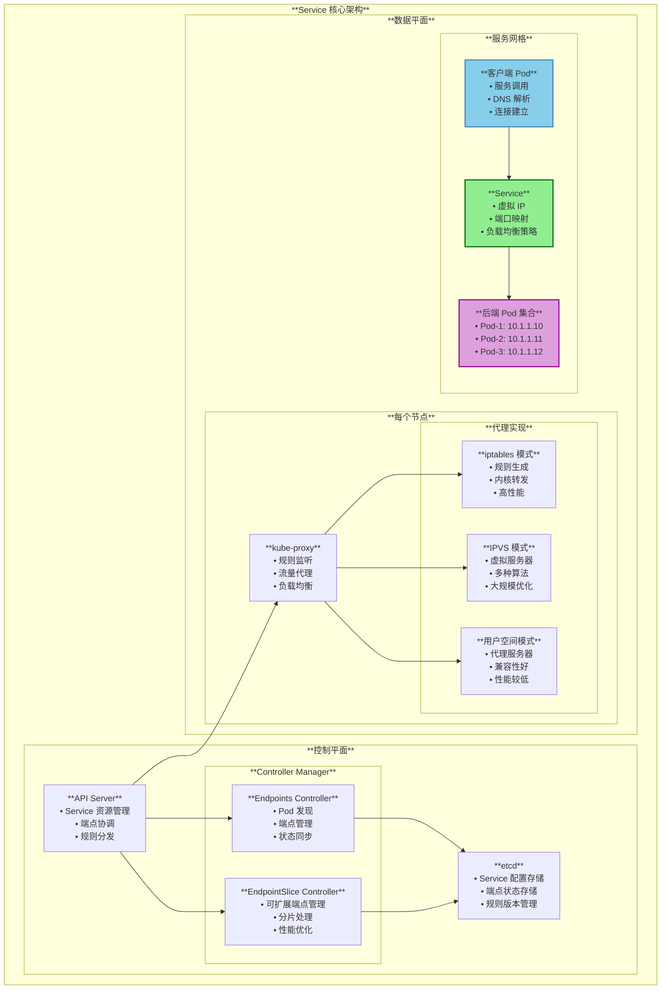

---

## Service 整体架构

### 1. Service 容器与控制器交互架构图

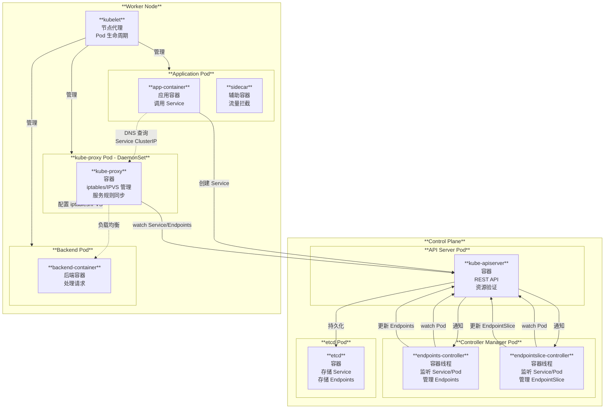

### 2. Service 功能完整时序交互图

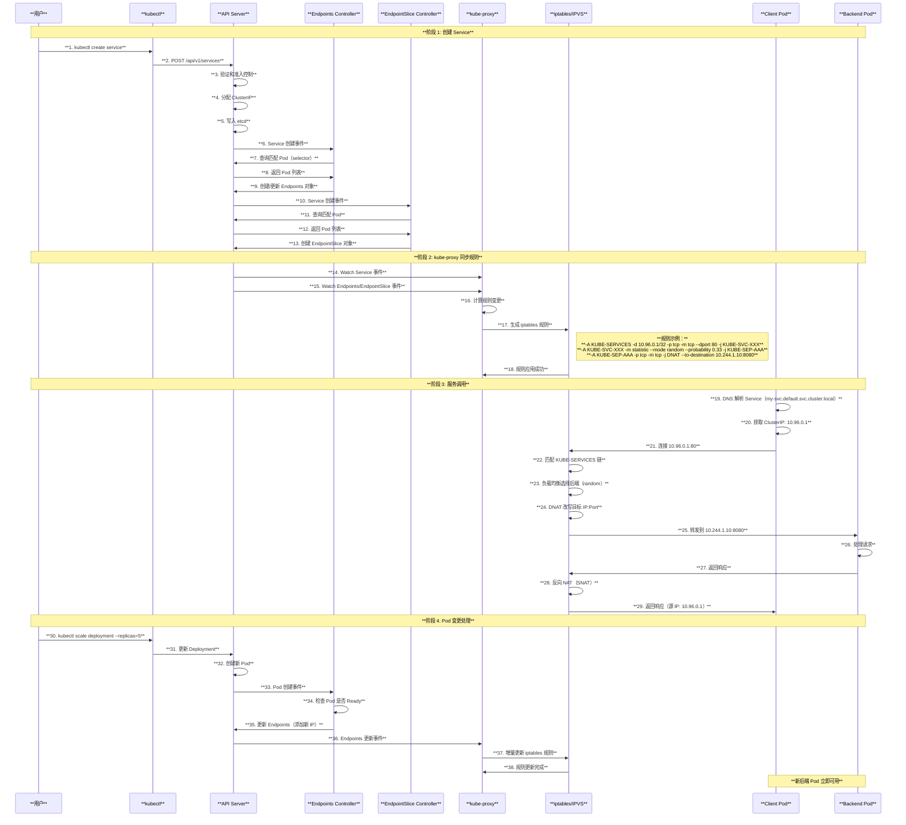

### 3. 系统层次架构图

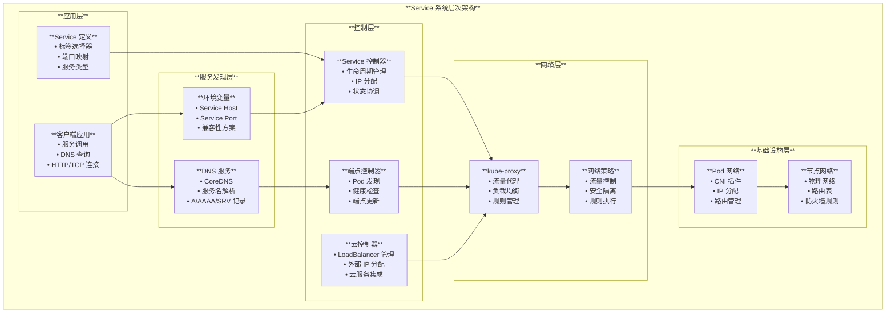

---

## Service 类型与实现机制

### 1. Service 类型定义

基于源码 `pkg/apis/core/types.go`，Service 支持四种主要类型：

```go
type ServiceType string

const (
    // ServiceTypeClusterIP - 仅在集群内部可访问
    ServiceTypeClusterIP ServiceType = "ClusterIP"
    
    // ServiceTypeNodePort - 在每个节点上开放端口
    ServiceTypeNodePort ServiceType = "NodePort"
    
    // ServiceTypeLoadBalancer - 通过外部负载均衡器暴露
    ServiceTypeLoadBalancer ServiceType = "LoadBalancer"
    
    // ServiceTypeExternalName - 通过 DNS CNAME 记录映射
    ServiceTypeExternalName ServiceType = "ExternalName"
)
```

### 2. Service 类型对比图

```mermaid
graph TB
    subgraph "**Service 类型对比**"
        
        subgraph "**ClusterIP 类型**"
            
            CLUSTER_IP_TITLE[**ClusterIP Service**<br/>**（默认类型）**]
            
            subgraph "**访问特性**"
                
                CLUSTER_ACCESS[**集群内部访问**<br/>• ClusterIP: 10.96.0.1<br/>• 端口: 80<br/>• 协议: TCP/UDP<br/>• 负载均衡: 轮询]
            end
            
            subgraph "**实现机制**"
                
                CLUSTER_IMPL[**虚拟 IP 实现**<br/>• iptables/IPVS 规则<br/>• 内核空间转发<br/>• DNS A 记录<br/>• kube-proxy 代理]
            end
            
            CLUSTER_USAGE[**使用场景**<br/>• 内部服务通信<br/>• 微服务架构<br/>• 数据库访问<br/>• 中间件服务]
        end
        
        subgraph "**NodePort 类型**"
            
            NODE_PORT_TITLE[**NodePort Service**<br/>**（节点端口访问）**]
            
            subgraph "**访问特性**"
                
                NODE_ACCESS[**节点端口访问**<br/>• NodePort: 30080<br/>• ClusterIP: 10.96.0.2<br/>• 所有节点开放<br/>• 外部可访问]
            end
            
            subgraph "**实现机制**"
                
                NODE_IMPL[**端口映射实现**<br/>• 节点端口绑定<br/>• DNAT 转换<br/>• 跨节点转发<br/>• 源 IP 保持]
            end
            
            NODE_USAGE[**使用场景**<br/>• 开发测试<br/>• 简单外部访问<br/>• 传统应用迁移<br/>• 调试端口]
        end
        
        subgraph "**LoadBalancer 类型**"
            
            LB_TITLE[**LoadBalancer Service**<br/>**（负载均衡器访问）**]
            
            subgraph "**访问特性**"
                
                LB_ACCESS[**负载均衡器访问**<br/>• External IP: 203.0.113.1<br/>• NodePort: 30080<br/>• ClusterIP: 10.96.0.3<br/>• 高可用入口]
            end
            
            subgraph "**实现机制**"
                
                LB_IMPL[**云服务集成**<br/>• Cloud Controller<br/>• 外部 LB 创建<br/>• 健康检查<br/>• 流量分发]
            end
            
            LB_USAGE[**使用场景**<br/>• 生产环境<br/>• 公网服务<br/>• 高可用应用<br/>• 云原生架构]
        end
        
        subgraph "**ExternalName 类型**"
            
            EXT_NAME_TITLE[**ExternalName Service**<br/>**（DNS 别名映射）**]
            
            subgraph "**访问特性**"
                
                EXT_ACCESS[**DNS 别名访问**<br/>• ExternalName: db.example.com<br/>• CNAME 记录<br/>• 无端点<br/>• DNS 解析]
            end
            
            subgraph "**实现机制**"
                
                EXT_IMPL[**DNS 重定向**<br/>• CoreDNS 配置<br/>• CNAME 解析<br/>• 无代理<br/>• 纯 DNS 服务]
            end
            
            EXT_USAGE[**使用场景**<br/>• 外部服务映射<br/>• 服务迁移<br/>• 第三方集成<br/>• DNS 抽象]
        end
    end
    
    CLUSTER_IP_TITLE --> CLUSTER_ACCESS
    CLUSTER_IP_TITLE --> CLUSTER_IMPL
    CLUSTER_IP_TITLE --> CLUSTER_USAGE
    
    NODE_PORT_TITLE --> NODE_ACCESS
    NODE_PORT_TITLE --> NODE_IMPL
    NODE_PORT_TITLE --> NODE_USAGE
    
    LB_TITLE --> LB_ACCESS
    LB_TITLE --> LB_IMPL
    LB_TITLE --> LB_USAGE
    
    EXT_NAME_TITLE --> EXT_ACCESS
    EXT_NAME_TITLE --> EXT_IMPL
    EXT_NAME_TITLE --> EXT_USAGE
    
    style CLUSTER_IP_TITLE fill:#90EE90,stroke:#006400,stroke-width:2px
    style NODE_PORT_TITLE fill:#FFB6C1,stroke:#DC143C,stroke-width:2px
    style LB_TITLE fill:#87CEEB,stroke:#4682B4,stroke-width:2px
    style EXT_NAME_TITLE fill:#DDA0DD,stroke:#8B008B,stroke-width:2px
```

### 3. Service 访问流程图

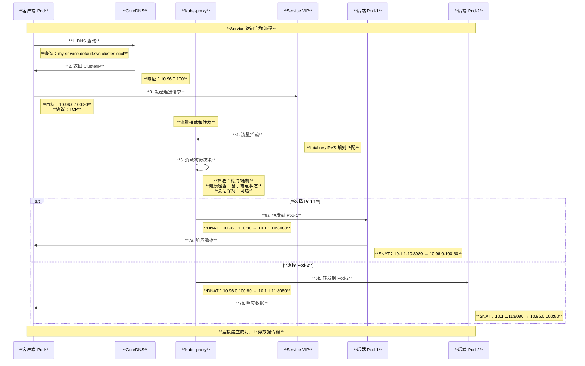

---

## 端点管理与发现机制

### 1. 端点控制器实现

基于源码 `pkg/controller/endpoint/endpoints_controller.go`：

```go
func (e *Controller) syncService(ctx context.Context, key string) error {
    namespace, name, err := cache.SplitMetaNamespaceKey- key
    if err != nil {
        return err
    }

    service, err := e.serviceLister.Services- namespace.Get- name
    if err != nil {
        if !errors.IsNotFound- err {
            return err
        }
        // Service 已删除，删除对应的端点
        err = e.client.CoreV1- .Endpoints- namespace.Delete(ctx, name, metav1.DeleteOptions{})
        return err
    }

    // ExternalName 类型的服务不接收端点
    if service.Spec.Type == v1.ServiceTypeExternalName {
        return nil
    }

    // 没有选择器的服务不接收自动端点
    if service.Spec.Selector == nil {
        return nil
    }

    // 获取匹配标签选择器的 Pod
    pods, err := e.podLister.Pods(service.Namespace).List(labels.Set(service.Spec.Selector).AsSelectorPreValidated- )
    if err != nil {
        return err
    }

    // 构建端点列表并更新
    return e.syncEndpoints(service, pods)
}
```

### 2. EndpointSlice 控制器

基于源码 `pkg/controller/endpointslice/endpointslice_controller.go`：

```go
func (c *Controller) syncService(logger klog.Logger, key string) error {
    namespace, name, err := cache.SplitMetaNamespaceKey- key
    if err != nil {
        return err
    }

    service, err := c.serviceLister.Services- namespace.Get- name
    if err != nil {
        if !apierrors.IsNotFound- err {
            return err
        }
        // 清理相关资源
        c.reconciler.DeleteService(namespace, name)
        return nil
    }

    // 跳过 ExternalName 和无选择器的服务
    if service.Spec.Type == v1.ServiceTypeExternalName || service.Spec.Selector == nil {
        return nil
    }

    // 获取 Pod 和现有 EndpointSlice
    pods, err := c.podLister.Pods(service.Namespace).List(labels.Set(service.Spec.Selector).AsSelectorPreValidated- )
    endpointSlices, err := c.endpointSliceLister.EndpointSlices(service.Namespace).List- esLabelSelector

    // 协调 EndpointSlice
    return c.reconciler.Reconcile(service, pods, endpointSlices, triggerTime)
}
```

### 3. 端点发现架构图

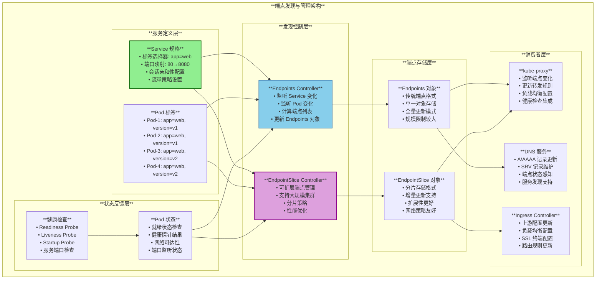

### 4. 端点生命周期状态机

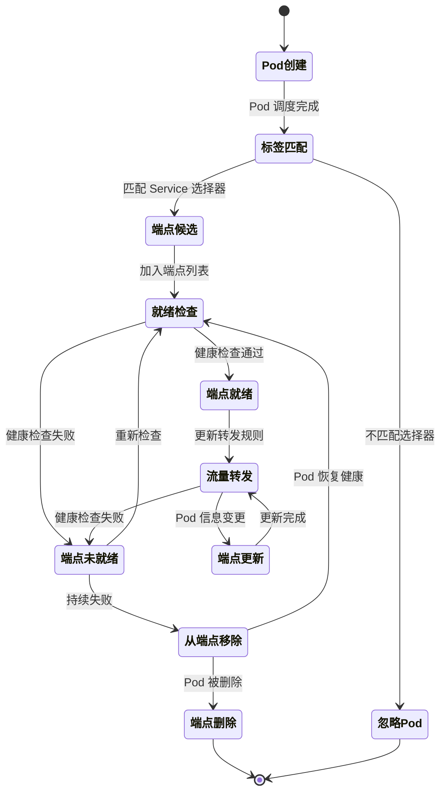

---

## 负载均衡与流量转发

### 1. Service 规格定义

基于源码 `pkg/apis/core/types.go`：

```go
type ServiceSpec struct {
    // Service 类型
    Type ServiceType
    
    // 端口列表
    Ports []ServicePort
    
    // Pod 选择器
    Selector map[string]string
    
    // 集群内部 IP
    ClusterIP string
    ClusterIPs []string
    
    // 会话亲和性
    SessionAffinity ServiceAffinity
    SessionAffinityConfig *SessionAffinityConfig
    
    // 流量策略
    InternalTrafficPolicy *ServiceInternalTrafficPolicy
    ExternalTrafficPolicy ServiceExternalTrafficPolicyType
    
    // 健康检查节点端口
    HealthCheckNodePort int32
}

type ServicePort struct {
    // Service 端口名称
    Name string
    // 协议类型
    Protocol Protocol
    // Service 端口
    Port int32
    // 目标 Pod 端口
    TargetPort intstr.IntOrString
    // 节点端口（NodePort 类型）
    NodePort int32
}
```

### 2. 负载均衡算法与流量分发

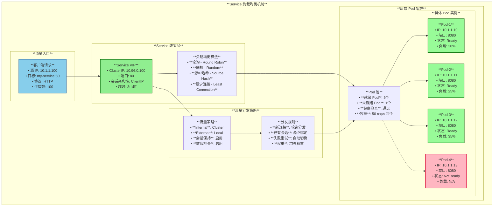

---

## kube-proxy 实现原理

### 1. kube-proxy 架构模式

kube-proxy 支持三种实现模式：

```go
// 代理模式枚举
const (
    proxyModeUserspace   = "userspace"
    proxyModeIPTables    = "iptables" 
    proxyModeIPVS        = "ipvs"
    proxyModeKernelspace = "kernelspace" // Windows only
)
```

### 2. iptables 模式实现

基于源码 `pkg/proxy/iptables/proxier.go`：

```go
// iptables 规则生成
func (proxier *Proxier) syncProxyRules-  {
    // 创建服务链规则
    natRules.Write(
        "-A", string- kubeServicesChain,
        "-m", "comment", "--comment", fmt.Sprintf(`"%s cluster IP"`, svcPortNameString),
        "-m", protocol, "-p", protocol,
        "-d", svcInfo.ClusterIP- .String- ,
        "--dport", strconv.Itoa(svcInfo.Port- ),
        "-j", string- internalTrafficChain)

    // 为每个端点创建规则
    for i, endpointChain := range endpointChains {
        // 负载均衡规则
        natRules.Write(
            "-A", string- svcChain,
            "-m", "comment", "--comment", endpoints[i],
            "-m", "statistic", "--mode", "random", "--probability", probability,
            "-j", string- endpointChain)
            
        // DNAT 规则
        natRules.Write(
            "-A", string- endpointChain,
            "-s", endpoints[i],
            "-j", string- kubeMarkMasqChain)
        natRules.Write(
            "-A", string- endpointChain,
            "-p", protocol,
            "-j", "DNAT", "--to-destination", endpoints[i])
    }
}
```

### 3. kube-proxy 处理流程图

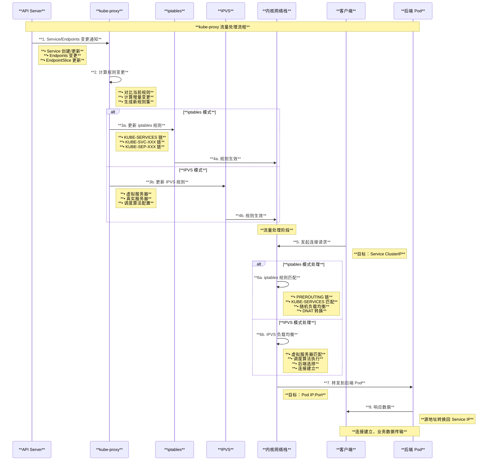

### 4. iptables vs IPVS 对比图

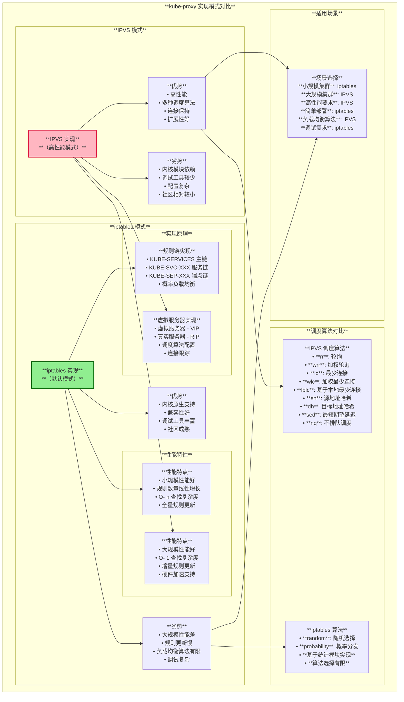

---

## Service 会话亲和性

### 1. 会话亲和性配置

基于源码定义：

```go
type ServiceAffinity string

const (
    // ServiceAffinityClientIP - 基于客户端 IP 的会话亲和性
    ServiceAffinityClientIP ServiceAffinity = "ClientIP"
    
    // ServiceAffinityNone - 无会话亲和性
    ServiceAffinityNone ServiceAffinity = "None"
)

type SessionAffinityConfig struct {
    // ClientIP 配置
    ClientIP *ClientIPConfig
}

type ClientIPConfig struct {
    // 会话超时时间（秒）
    TimeoutSeconds *int32
}
```

### 2. 会话亲和性实现机制

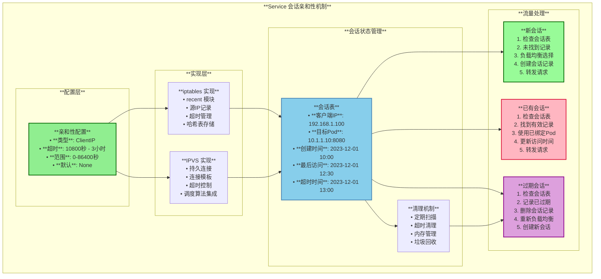

---

## 使用场景与最佳实践

### 1. 主要使用场景

#### **微服务架构**
- **服务间通信**：提供稳定的服务发现和负载均衡
- **API 网关**：作为微服务的统一入口点
- **配置服务**：为配置中心提供高可用访问

#### **数据库与缓存**
- **数据库集群**：为主从数据库提供读写分离
- **缓存服务**：Redis、Memcached 等缓存集群访问
- **消息队列**：Kafka、RabbitMQ 等消息系统负载均衡

#### **Web 应用**
- **前端服务**：静态资源和 SPA 应用服务
- **API 服务**：RESTful API 的负载均衡和故障转移
- **WebSocket 服务**：需要会话保持的实时通信

#### **监控与日志**
- **监控系统**：Prometheus、Grafana 等监控服务
- **日志聚合**：ELK Stack、Fluentd 等日志服务
- **APM 服务**：应用性能监控服务访问

### 2. 最佳实践配置

#### **ClusterIP Service 配置**

```yaml
apiVersion: v1
kind: Service
metadata:
  name: web-service
  labels:
    app: web
spec:
  type: ClusterIP
  selector:
    app: web
    tier: frontend
  ports:
  - name: http
    port: 80
    targetPort: 8080
    protocol: TCP
  # 会话亲和性配置
  sessionAffinity: ClientIP
  sessionAffinityConfig:
    clientIP:
      timeoutSeconds: 3600
  # 内部流量策略
  internalTrafficPolicy: Local
```

#### **NodePort Service 配置**

```yaml
apiVersion: v1
kind: Service
metadata:
  name: web-nodeport
spec:
  type: NodePort
  selector:
    app: web
  ports:
  - name: http
    port: 80
    targetPort: 8080
    nodePort: 30080
  # 外部流量策略
  externalTrafficPolicy: Local
  # 健康检查节点端口
  healthCheckNodePort: 30081
```

#### **LoadBalancer Service 配置**

```yaml
apiVersion: v1
kind: Service
metadata:
  name: web-loadbalancer
  annotations:
    # 云服务商特定注解
    service.beta.kubernetes.io/aws-load-balancer-type: "nlb"
    service.beta.kubernetes.io/aws-load-balancer-cross-zone-load-balancing-enabled: "true"
spec:
  type: LoadBalancer
  selector:
    app: web
  ports:
  - port: 80
    targetPort: 8080
  # 负载均衡器类别
  loadBalancerClass: "aws-network-load-balancer"
  # 源IP范围限制
  loadBalancerSourceRanges:
  - "10.0.0.0/8"
  - "172.16.0.0/12"
```

### 3. Service 类型选择决策树

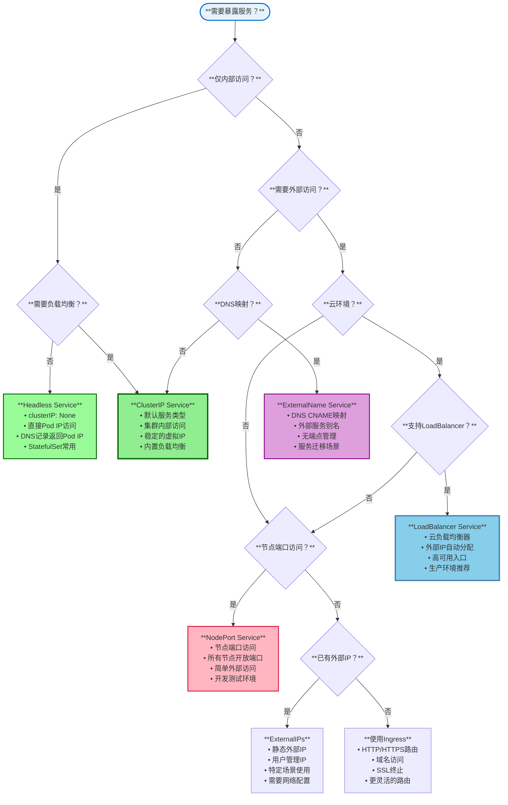

### 4. 性能优化建议

#### **大规模集群优化**

```yaml
# kube-proxy 配置优化
apiVersion: kubeproxy.config.k8s.io/v1alpha1
kind: KubeProxyConfiguration
mode: "ipvs"  # 使用 IPVS 模式
ipvs:
  scheduler: "rr"  # 轮询算法
  strictARP: true
  tcpTimeout: 30m
  udpTimeout: 30s
# iptables 优化
iptables:
  masqueradeAll: false
  masqueradeBit: 14
  minSyncPeriod: 1s
  syncPeriod: 30s
```

#### **资源使用优化**

```yaml
# Endpoints 资源优化
apiVersion: v1
kind: Service
metadata:
  name: optimized-service
  annotations:
    # 启用 EndpointSlice
    service.kubernetes.io/endpoint-slice-hints: "auto"
    # 拓扑感知提示
    service.kubernetes.io/topology-aware-hints: "auto"
spec:
  # 减少不必要的端口
  ports:
  - port: 80
    targetPort: http  # 使用命名端口
  # 精确的标签选择器
  selector:
    app: web
    version: v1
```

---

## 总结

Service 是 Kubernetes 网络模型的核心抽象，它解决了容器化应用中服务发现和负载均衡的根本问题。通过提供稳定的网络端点和灵活的流量分发策略，Service 使得动态的 Pod 集合能够作为稳定的服务对外提供访问。

### 核心价值

1. **服务抽象**：为动态变化的 Pod 提供稳定的访问接口
2. **负载均衡**：内置多种负载均衡算法和流量分发策略
3. **服务发现**：通过 DNS 和环境变量提供自动服务发现
4. **灵活暴露**：支持多种服务暴露方式适应不同场景
5. **高可用性**：自动故障检测和流量转移机制

### 技术特点

- **多层次架构**：从控制平面到数据平面的完整实现
- **高性能代理**：iptables 和 IPVS 两种高性能实现模式
- **扩展性设计**：EndpointSlice 支持大规模集群部署
- **会话保持**：支持基于客户端 IP 的会话亲和性
- **云原生集成**：与云服务商负载均衡器的深度集成

Service 的设计体现了 Kubernetes 对云原生应用网络需求的深刻理解，通过声明式的配置和自动化的管理，大大简化了分布式应用的网络配置和运维工作。无论是简单的内部服务通信，还是复杂的多层应用架构，Service 都能提供可靠、高效的网络访问解决方案。

