# Kubernetes StatefulSet 架构与原理深度解读

## 目录

1. [概述](#概述)
2. [StatefulSet 核心概念](#statefulset-核心概念)
3. [StatefulSet 整体架构](#statefulset-整体架构)
4. [StatefulSet 控制器实现原理](#statefulset-控制器实现原理)
5. [有序部署与终止机制](#有序部署与终止机制)
6. [持久化存储管理](#持久化存储管理)
7. [网络标识与服务发现](#网络标识与服务发现)
8. [滚动更新策略](#滚动更新策略)
9. [Pod 管理策略](#pod-管理策略)
10. [PVC 自动删除策略](#pvc-自动删除策略)
11. [使用场景与最佳实践](#使用场景与最佳实践)
12. [总结](#总结)

---

## 概述

StatefulSet 是 Kubernetes 中用于管理有状态应用的工作负载控制器。与 Deployment 管理无状态应用不同，StatefulSet 为每个 Pod 提供稳定的网络标识、有序的部署和终止序列，以及持久化存储。本文档基于 Kubernetes 源码深入解读 StatefulSet 的架构设计、工作原理和实现机制。

### 核心特性

- **稳定的网络标识**：每个 Pod 拥有唯一且持久的 DNS 名称
- **有序部署和扩缩容**：Pod 按照固定顺序创建和删除
- **持久化存储**：每个 Pod 绑定专用的持久卷声明（PVC）
- **有序滚动更新**：按顺序更新 Pod，确保服务连续性
- **头节点服务**：通过 Headless Service 提供稳定的网络访问

---

## StatefulSet 核心概念

### 1. 基本概念关系

- **StatefulSet**：管理有状态应用的控制器
- **Pod Template**：定义 Pod 规格的模板
- **Volume Claim Templates**：定义存储需求的 PVC 模板
- **Headless Service**：提供网络标识的无头服务
- **Ordinal Index**：Pod 的序号索引（0, 1, 2, ...）

### 2. 核心组件架构图

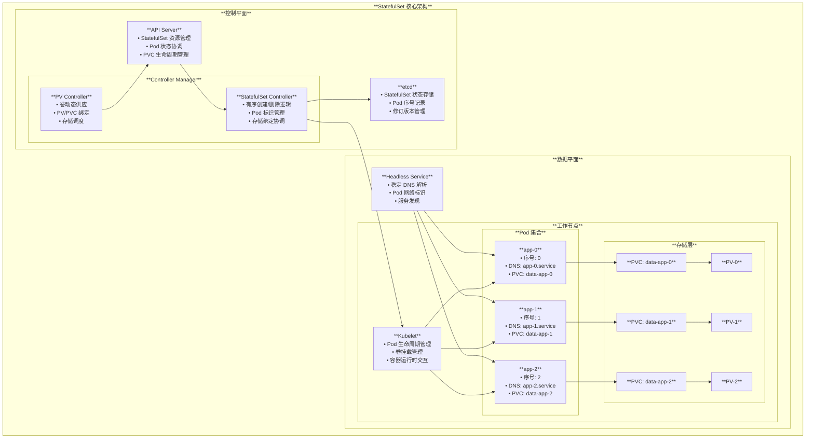

---

## StatefulSet 整体架构

### 1. 系统层次架构

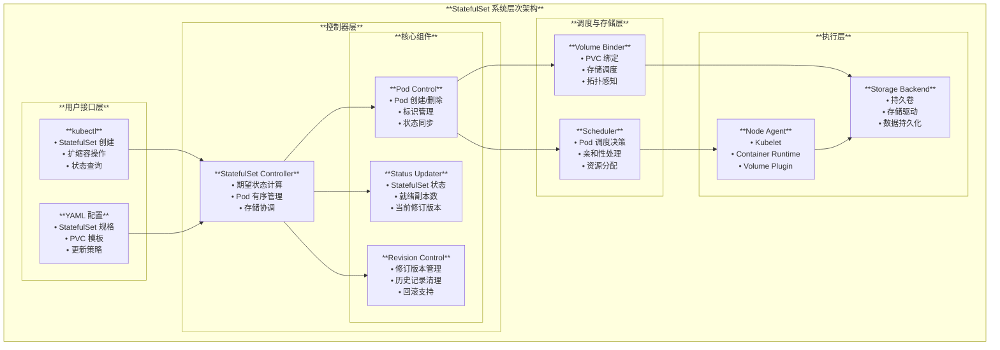

---

## StatefulSet 控制器实现原理

### 1. 控制器同步流程

基于源码 `pkg/controller/statefulset/stateful_set_control.go`，StatefulSet 控制器的核心同步逻辑：

```go
// UpdateStatefulSet 执行 StatefulSet 的核心逻辑循环
func (ssc *defaultStatefulSetControl) UpdateStatefulSet(ctx context.Context, set *apps.StatefulSet, pods []*v1.Pod) (*apps.StatefulSetStatus, error) {
    // 深拷贝 StatefulSet，避免在创建新修订版本时发生变更错误
    set = set.DeepCopy- 

    // 列出所有修订版本并排序
    revisions, err := ssc.ListRevisions- set
    if err != nil {
        return nil, err
    }
    history.SortControllerRevisions- revisions

    // 执行更新操作
    currentRevision, updateRevision, status, err := ssc.performUpdate(ctx, set, pods, revisions)
    if err != nil {
        return nil, err
    }

    // 维护修订历史限制
    return status, ssc.truncateHistory(set, pods, revisions, currentRevision, updateRevision)
}
```

### 2. Pod 处理逻辑

```go
func (ssc *defaultStatefulSetControl) processReplica(
    ctx context.Context,
    set *apps.StatefulSet,
    currentRevision *apps.ControllerRevision,
    updateRevision *apps.ControllerRevision,
    currentSet *apps.StatefulSet,
    updateSet *apps.StatefulSet,
    monotonic bool,
    replicas []*v1.Pod,
    i int) (bool, error) {
    
    // 删除并重新创建失败的 Pod
    if isFailed(replicas[i]) {
        ssc.recorder.Eventf(set, v1.EventTypeWarning, "RecreatingFailedPod",
            "StatefulSet %s/%s is recreating failed Pod %s",
            set.Namespace, set.Name, replicas[i].Name)
        if err := ssc.podControl.DeleteStatefulPod(set, replicas[i]); err != nil {
            return true, err
        }
        // 创建新版本的 Pod
        replicaOrd := i + getStartOrdinal- set
        replicas[i] = newVersionedStatefulSetPod(
            currentSet, updateSet,
            currentRevision.Name, updateRevision.Name, replicaOrd)
    }
    
    // 如果 Pod 尚未创建，则创建 Pod
    if !isCreated(replicas[i]) {
        if err := ssc.podControl.CreateStatefulPod(ctx, set, replicas[i]); err != nil {
            return true, err
        }
        if monotonic {
            // 如果不允许突发模式，立即返回
            return true, nil
        }
    }
    
    return false, nil
}
```

### 3. 控制器状态机图

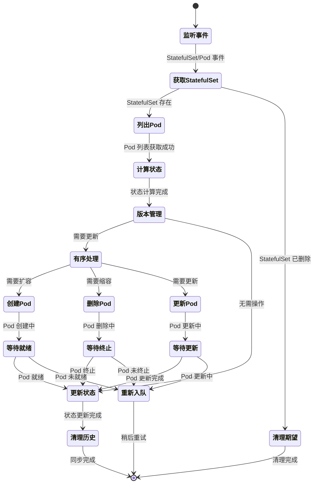

---

## 有序部署与终止机制

### 1. 有序部署流程图

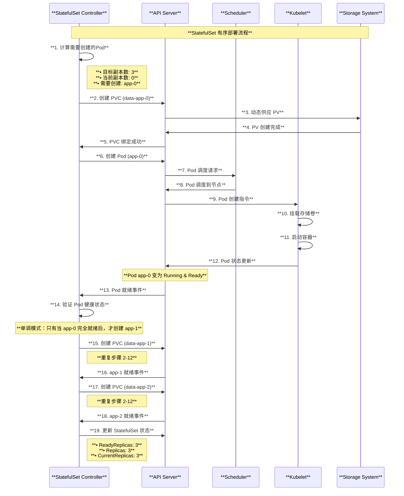

### 2. 有序终止流程

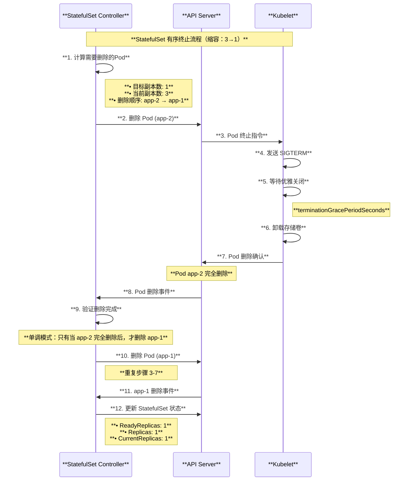

---

## 持久化存储管理

### 1. PVC 生命周期管理

基于源码 `pkg/controller/statefulset/stateful_pod_control.go`：

```go
// CreateStatefulPod 创建 StatefulSet 的 Pod
func (spc *StatefulPodControl) CreateStatefulPod(ctx context.Context, set *apps.StatefulSet, pod *v1.Pod) error {
    // 在创建 Pod 之前先创建 Pod 的 PVC
    if err := spc.createPersistentVolumeClaims(set, pod); err != nil {
        spc.recordPodEvent("create", set, pod, err)
        return err
    }
    
    // 如果成功创建了 PVC，尝试创建 Pod
    err := spc.objectMgr.CreatePod(ctx, pod)
    if apierrors.IsAlreadyExists- err {
        return err
    }
    
    // 根据保留策略设置 PVC 策略
    if utilfeature.DefaultFeatureGate.Enabled(features.StatefulSetAutoDeletePVC) {
        if err := spc.UpdatePodClaimForRetentionPolicy(ctx, set, pod); err != nil {
            spc.recordPodEvent("update", set, pod, err)
            return err
        }
    }
    
    return err
}
```

### 2. PVC 命名规范

```go
// getPersistentVolumeClaimName 获取 PVC 名称
func getPersistentVolumeClaimName(set *apps.StatefulSet, claim *v1.PersistentVolumeClaim, ordinal int) string {
    // 格式：{claimName}-{statefulsetName}-{ordinal}
    return fmt.Sprintf("%s-%s-%d", claim.Name, set.Name, ordinal)
}
```

### 3. 存储管理架构图

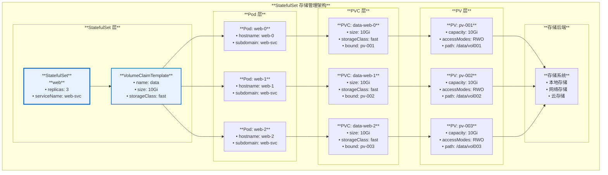

---

## 网络标识与服务发现

### 1. Headless Service 机制

基于源码 `pkg/controller/statefulset/stateful_set_utils.go`：

```go
func initIdentity(set *apps.StatefulSet, pod *v1.Pod) {
    updateIdentity(set, pod)
    // 仅在初始 Pod 创建时设置这些不可变字段，不用于更新
    pod.Spec.Hostname = pod.Name
    pod.Spec.Subdomain = set.Spec.ServiceName
}

// updateIdentity 更新 Pod 的名称、主机名和子域名
func updateIdentity(set *apps.StatefulSet, pod *v1.Pod) {
    ordinal := getOrdinal- pod
    pod.Name = getPodName(set, ordinal)
    pod.Namespace = set.Namespace
    if pod.Labels == nil {
        pod.Labels = make(map[string]string)
    }
    pod.Labels[apps.StatefulSetPodNameLabel] = pod.Name
}
```

### 2. DNS 解析机制图

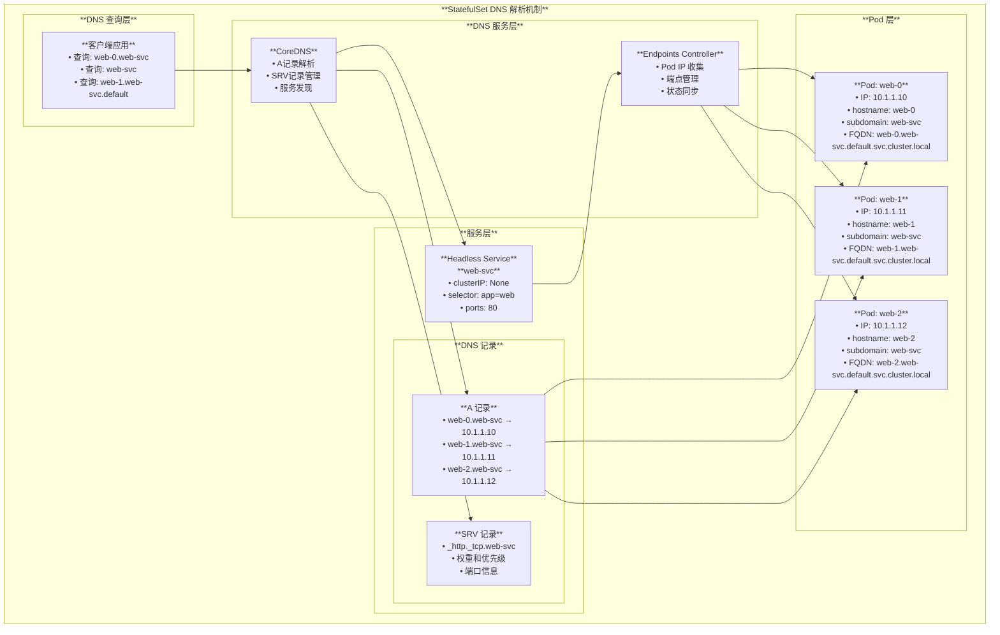

---

## 滚动更新策略

### 1. 更新策略类型

基于源码 `pkg/apis/apps/types.go`：

```go
const (
    // RollingUpdateStatefulSetStrategyType 滚动更新策略
    // 按照 StatefulSet 排序约束应用到所有 Pod
    RollingUpdateStatefulSetStrategyType StatefulSetUpdateStrategyType = "RollingUpdate"
    
    // OnDeleteStatefulSetStrategyType 删除时更新策略
    // 触发传统行为，禁用版本跟踪和有序滚动重启
    OnDeleteStatefulSetStrategyType StatefulSetUpdateStrategyType = "OnDelete"
)

type RollingUpdateStatefulSetStrategy struct {
    // Partition 指示 StatefulSet 应该在哪个序号进行分区更新
    // 在滚动更新期间，所有序号从 Replicas-1 到 Partition 的 Pod 都会被更新
    // 所有序号从 Partition-1 到 0 的 Pod 保持不变
    Partition int32
    
    // MaxUnavailable 更新期间可以不可用的 Pod 的最大数量
    MaxUnavailable *intstr.IntOrString
}
```

### 2. 滚动更新流程图

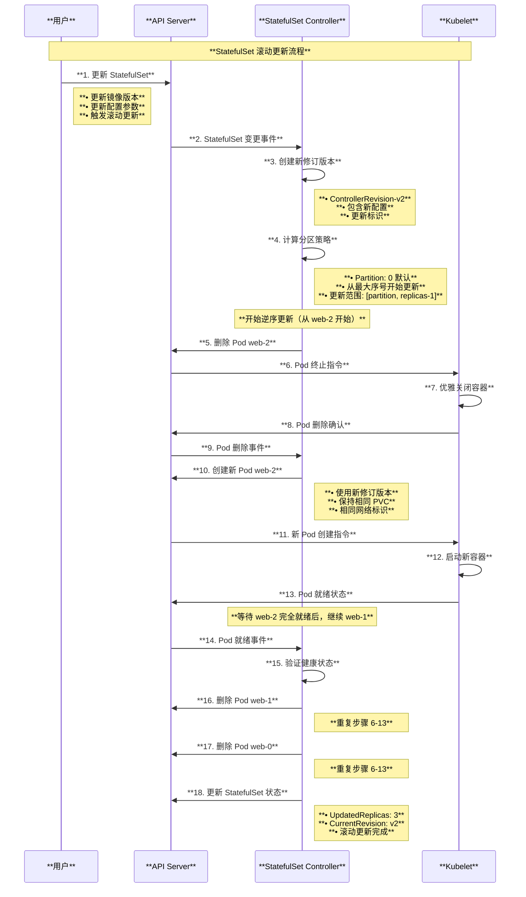

### 3. 分区更新示例图

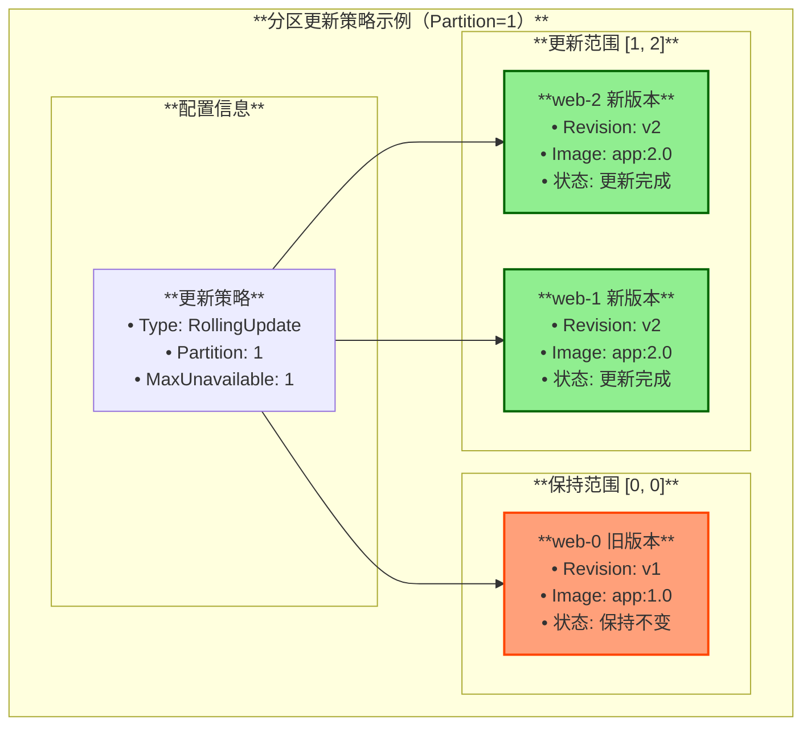

---

## Pod 管理策略

### 1. 管理策略对比

基于源码 `pkg/apis/apps/types.go`：

```go
const (
    // OrderedReadyPodManagement 有序就绪 Pod 管理
    // 在扩容时严格按递增顺序创建 Pod，在缩容时按递减顺序，
    // 只有当前一个 Pod 就绪或终止时才继续处理。一次最多只会更改一个 Pod
    OrderedReadyPodManagement PodManagementPolicyType = "OrderedReady"
    
    // ParallelPodManagement 并行 Pod 管理  
    // 当 StatefulSet 副本数发生变化时，立即创建和删除 Pod，
    // 不等待 Pod 就绪或完全终止
    ParallelPodManagement PodManagementPolicyType = "Parallel"
)
```

### 2. 策略对比图

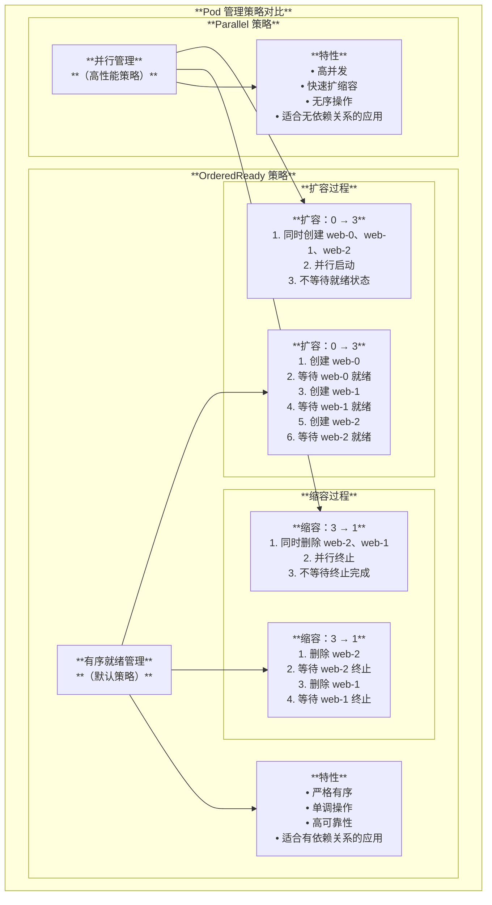

---

## PVC 自动删除策略

### 1. 保留策略配置

基于源码 `pkg/apis/apps/types.go`：

```go
type StatefulSetPersistentVolumeClaimRetentionPolicy struct {
    // WhenDeleted 指定当 StatefulSet 被删除时，
    // 从 StatefulSet VolumeClaimTemplates 创建的 PVC 会发生什么
    // 默认策略 `Retain` 使 PVC 不受 StatefulSet 删除影响
    // `Delete` 策略会删除这些 PVC
    WhenDeleted PersistentVolumeClaimRetentionPolicyType
    
    // WhenScaled 指定当 StatefulSet 缩容时，
    // 从 StatefulSet VolumeClaimTemplates 创建的 PVC 会发生什么  
    // 默认策略 `Retain` 使 PVC 不受缩容影响
    // `Delete` 策略会删除超出副本数的相关 PVC
    WhenScaled PersistentVolumeClaimRetentionPolicyType
}

const (
    // RetainPersistentVolumeClaimRetentionPolicyType 保留策略
    RetainPersistentVolumeClaimRetentionPolicyType PersistentVolumeClaimRetentionPolicyType = "Retain"
    
    // DeletePersistentVolumeClaimRetentionPolicyType 删除策略  
    DeletePersistentVolumeClaimRetentionPolicyType PersistentVolumeClaimRetentionPolicyType = "Delete"
)
```

### 2. PVC 生命周期策略图

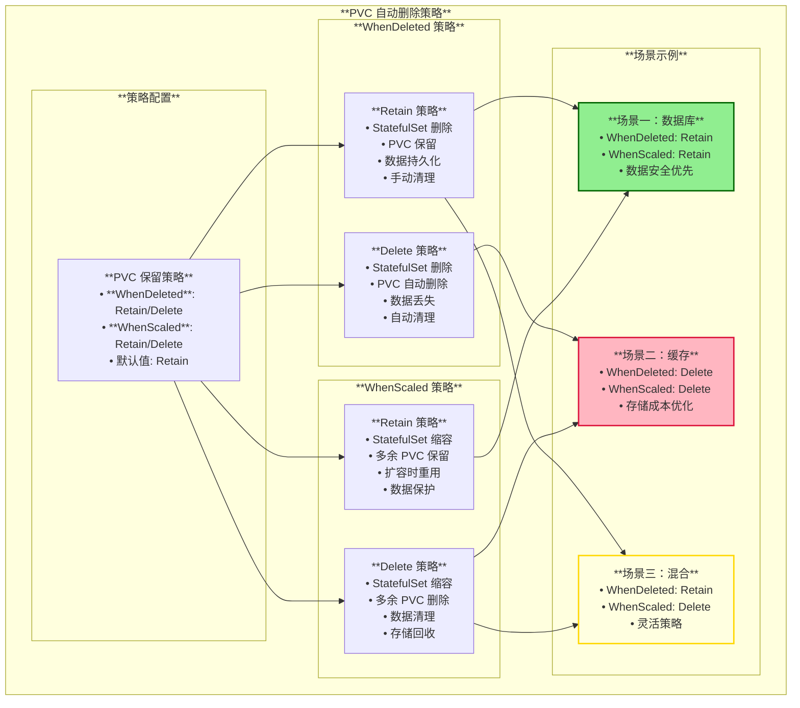

---

## 使用场景与最佳实践

### 1. 主要使用场景

#### **有状态数据库集群**
- **MySQL 主从复制**：主节点固定为 mysql-0，从节点按序启动
- **MongoDB 分片集群**：每个分片维护独立的存储和网络标识
- **Redis 主从**：主节点和从节点需要稳定的网络标识

#### **分布式存储系统**  
- **Elasticsearch 集群**：节点发现依赖稳定的主机名
- **Cassandra 环**：节点间通过网络标识建立环状拓扑
- **Ceph 存储**：OSD 节点需要持久化存储和稳定标识

#### **消息队列集群**
- **Kafka 集群**：broker 需要稳定的 ID 和存储
- **RabbitMQ 集群**：节点间通过主机名建立集群关系
- **Pulsar 集群**：BookKeeper 和 Broker 需要有序部署

#### **协调服务**
- **Zookeeper 集群**：myid 文件需要持久化存储
- **etcd 集群**：成员发现依赖稳定的网络标识
- **Consul 集群**：节点加入需要知道其他成员地址

### 2. 最佳实践建议

#### **配置优化**

```yaml
apiVersion: apps/v1
kind: StatefulSet
metadata:
  name: web
spec:
  serviceName: web-service
  replicas: 3
  # 有序就绪管理，确保部署顺序
  podManagementPolicy: OrderedReady
  updateStrategy:
    type: RollingUpdate
    rollingUpdate:
      # 分区更新，支持金丝雀部署
      partition: 0
      # 最大不可用数量
      maxUnavailable: 1
  # PVC 保留策略
  persistentVolumeClaimRetentionPolicy:
    whenDeleted: Retain
    whenScaled: Delete
  # 修订历史限制
  revisionHistoryLimit: 10
```

#### **存储配置**

```yaml
volumeClaimTemplates:
- metadata:
    name: data
  spec:
    accessModes: ["ReadWriteOnce"]
    storageClassName: "fast-ssd"
    resources:
      requests:
        storage: 100Gi
```

#### **服务配置**

```yaml
apiVersion: v1
kind: Service
metadata:
  name: web-service
spec:
  clusterIP: None  # Headless Service
  selector:
    app: web
  ports:
  - port: 80
    targetPort: 8080
```

### 3. 使用场景决策图

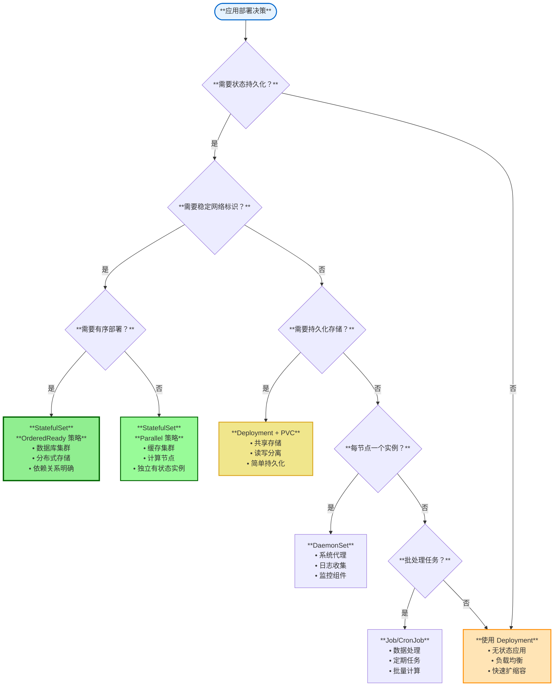

---

## 总结

StatefulSet 是 Kubernetes 中管理有状态应用的核心工作负载控制器，通过提供稳定的网络标识、有序的部署和终止、以及持久化存储绑定，满足了有状态应用对一致性和持久化的严格要求。

### 核心价值

1. **稳定标识**：为每个 Pod 提供唯一且持久的网络标识
2. **有序管理**：确保 Pod 按照预定义顺序创建、更新和删除
3. **存储绑定**：每个 Pod 拥有专属的持久化存储卷
4. **滚动更新**：支持有序的滚动更新，保证服务连续性
5. **灵活策略**：提供多种管理策略适应不同场景需求

### 技术特点

- **控制器架构**：基于声明式 API 和控制循环实现
- **修订版本管理**：支持版本追踪和回滚操作  
- **存储生命周期**：精细化的 PVC 管理和自动删除策略
- **网络集成**：与 Headless Service 深度集成提供服务发现
- **扩展性设计**：支持自定义存储类和调度策略

StatefulSet 的设计体现了 Kubernetes 对有状态应用管理的深度理解，为数据库、分布式存储、消息队列等关键基础设施应用提供了可靠的容器化运行环境。通过合理配置和最佳实践，StatefulSet 能够满足企业级有状态应用的生产要求。

