# Kubernetes Volume 类型深度解析

## 目录

1. [Volume 整体架构](#1-volume-整体架构)
2. [临时存储类 Volume](#2-临时存储类-volume)
3. [配置数据类 Volume](#3-配置数据类-volume)
4. [本地存储类 Volume](#4-本地存储类-volume)
5. [网络存储类 Volume](#5-网络存储类-volume)
6. [云存储类 Volume](#6-云存储类-volume)
7. [持久化存储类 Volume](#7-持久化存储类-volume)
8. [特殊用途类 Volume](#8-特殊用途类-volume)

---

## 1. Volume 整体架构

### 1.1 Volume 插件体系架构

基于源码 `pkg/volume/volume.go`：

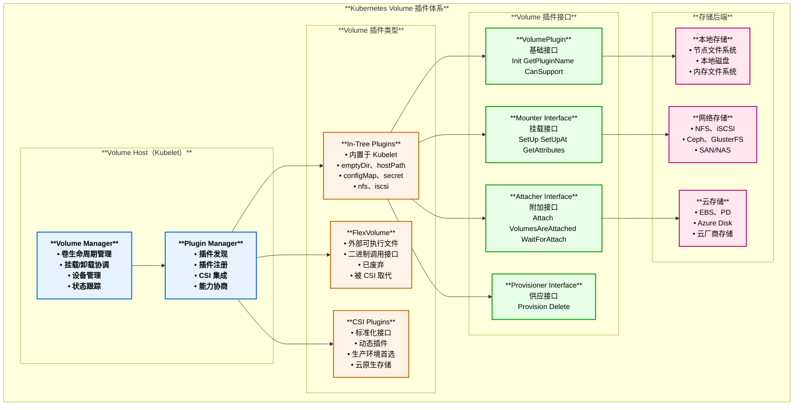

### 1.2 Volume 生命周期管理

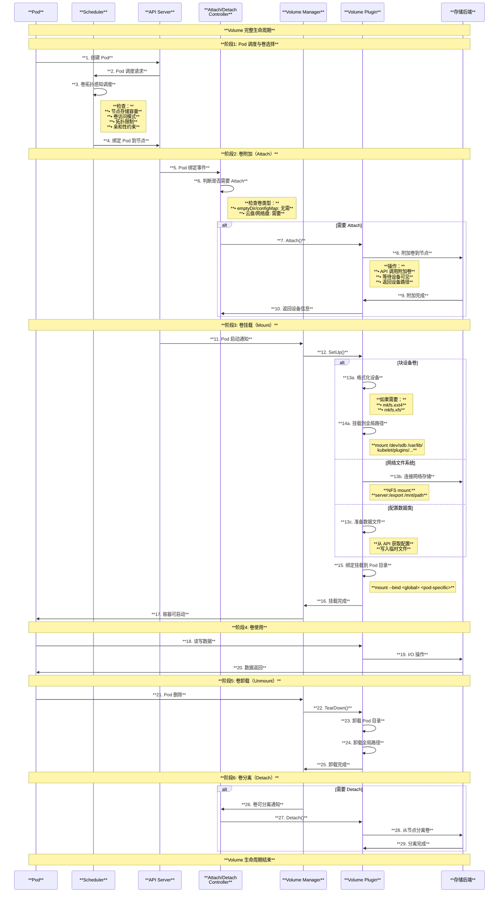

### 1.3 Volume 类型分类图

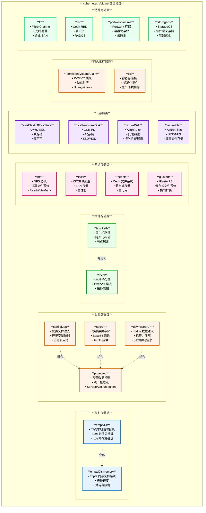

---

## 2. 临时存储类 Volume

### 2.1 emptyDir

#### 2.1.1 架构与原理

基于源码 `pkg/volume/emptydir/empty_dir.go`：

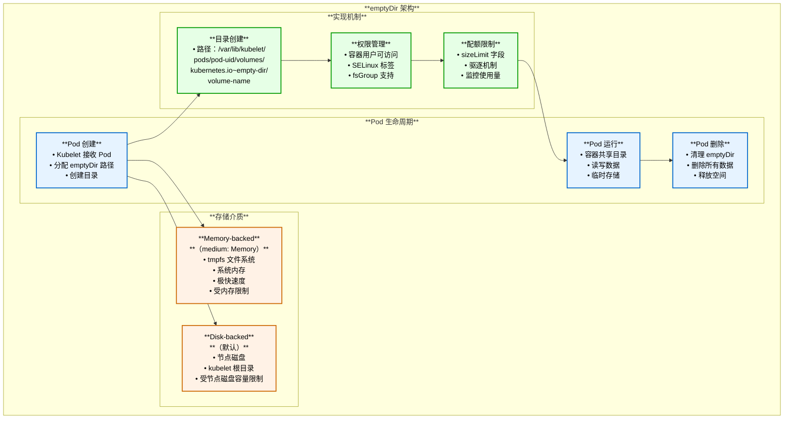

#### 2.1.2 使用场景

| 场景 | 适用性 | 示例 | 注意事项 |
|------|--------|------|----------|
| **容器间数据共享** | ✓ 高 | Sidecar 日志收集器与主容器共享日志目录 | 仅限同一 Pod 内容器 |
| **临时缓存** | ✓ 高 | 编译构建产物、下载缓存 | Pod 删除后数据丢失 |
| **检查点文件** | ✓ 中 | 应用状态检查点、会话数据 | 不适合长期保存 |
| **临时数据处理** | ✓ 高 | ETL 临时数据、排序中间结果 | 可设置 sizeLimit |
| **内存计算** | ✓ 高 (memory) | 大数据内存计算、机器学习训练临时数据 | 使用 medium: Memory |
| **持久化存储** | ✗ 不适用 | 数据库数据、用户文件 | 使用 PVC 代替 |

#### 2.1.3 emptyDir 挂载时序图

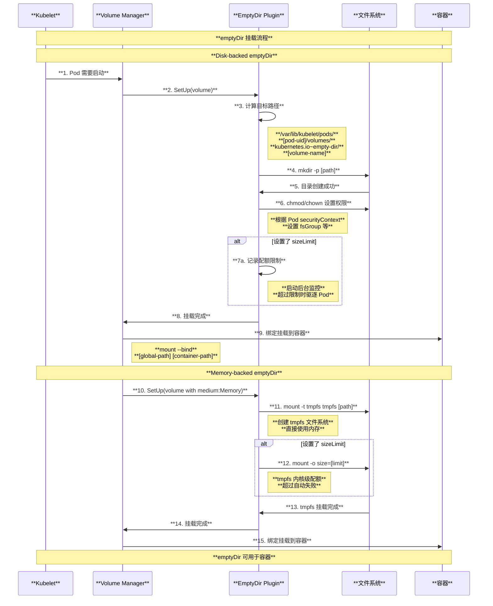

#### 2.1.4 emptyDir 配置示例

```yaml
apiVersion: v1
kind: Pod
metadata:
  name: emptydir-demo
spec:
  containers:
  # 主容器：生成数据
  - name: writer
    image: busybox
    command: ["sh", "-c", "while true; do date >> /data/log.txt; sleep 5; done"]
    volumeMounts:
    - name: shared-data
      mountPath: /data
  
  # Sidecar 容器：读取数据
  - name: reader
    image: busybox
    command: ["sh", "-c", "tail -f /data/log.txt"]
    volumeMounts:
    - name: shared-data
      mountPath: /data
      readOnly: true    # 只读挂载
  
  volumes:
  - name: shared-data
    emptyDir: {}        # 默认：disk-backed
    
---
# Memory-backed emptyDir 示例
apiVersion: v1
kind: Pod
metadata:
  name: emptydir-memory-demo
spec:
  containers:
  - name: memory-cache
    image: redis:alpine
    volumeMounts:
    - name: cache-volume
      mountPath: /data
    resources:
      limits:
        memory: "1Gi"   # 容器内存限制
  
  volumes:
  - name: cache-volume
    emptyDir:
      medium: Memory    # 使用内存文件系统
      sizeLimit: 512Mi  # 限制 emptyDir 大小
```

#### 2.1.5 emptyDir 源码实现关键点

基于 `pkg/volume/emptydir/empty_dir.go`：

```go
// emptyDir 挂载实现
func (ed *emptyDir) SetUpAt(dir string, mounterArgs volume.MounterArgs) error {
    // 创建目录
    if err := os.MkdirAll(dir, 0750); err != nil {
        return err
    }
    
    // 检查是否使用内存作为介质
    if ed.medium == v1.StorageMediumMemory {
        // 挂载 tmpfs
        return ed.setupTmpfs(dir)
    }
    
    // 设置配额（如果指定了 sizeLimit）
    if ed.sizeLimit != nil && ed.sizeLimit.Value() > 0 {
        ed.volumeQuotaApplier.SetQuota(dir, ed.sizeLimit.Value())
    }
    
    // 设置权限和 SELinux 上下文
    return ed.setupPermissions(dir, mounterArgs.FSGroup, mounterArgs.FSGroupChangePolicy)
}

func (ed *emptyDir) setupTmpfs(dir string) error {
    options := []string{}
    
    // 添加大小限制选项
    if ed.sizeLimit != nil && ed.sizeLimit.Value() > 0 {
        options = append(options, fmt.Sprintf("size=%d", ed.sizeLimit.Value()))
    }
    
    // 挂载 tmpfs
    return ed.mounter.Mount("tmpfs", dir, "tmpfs", options)
}
```

---

## 3. 配置数据类 Volume

### 3.1 configMap 与 secret

#### 3.1.1 对比架构图

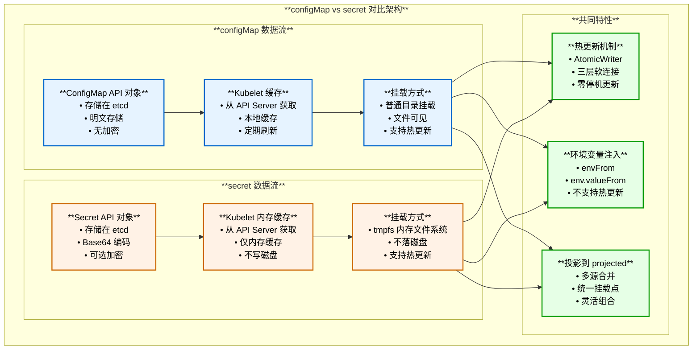

#### 3.1.2 configMap 与 secret 差异对比

| 特性维度 | configMap | secret | 说明 |
|---------|-----------|--------|------|
| **数据存储** | etcd 明文 | etcd Base64 编码（可选加密） | Secret 支持 etcd 静态加密 |
| **节点缓存** | 磁盘缓存 | 仅内存缓存 | Secret 更安全，不写磁盘 |
| **挂载方式** | 普通目录 | tmpfs（内存文件系统） | Secret 数据仅存在内存 |
| **大小限制** | 1MB | 1MB | 两者相同 |
| **热更新** | ✓ 支持 | ✓ 支持 | 基于 AtomicWriter |
| **环境变量** | ✓ 支持 | ✓ 支持 | 不支持热更新 |
| **RBAC 控制** | ✓ 支持 | ✓ 支持 | Secret 权限更严格 |
| **适用场景** | 配置文件、参数 | 密码、密钥、证书 | Secret 用于敏感数据 |
| **性能影响** | 低 | 略高（内存占用） | Secret 占用内存 |
| **Pod 内可见性** | 所有容器可见 | 所有容器可见 | 通过 volumeMounts 控制 |

#### 3.1.3 configMap/secret 挂载时序图

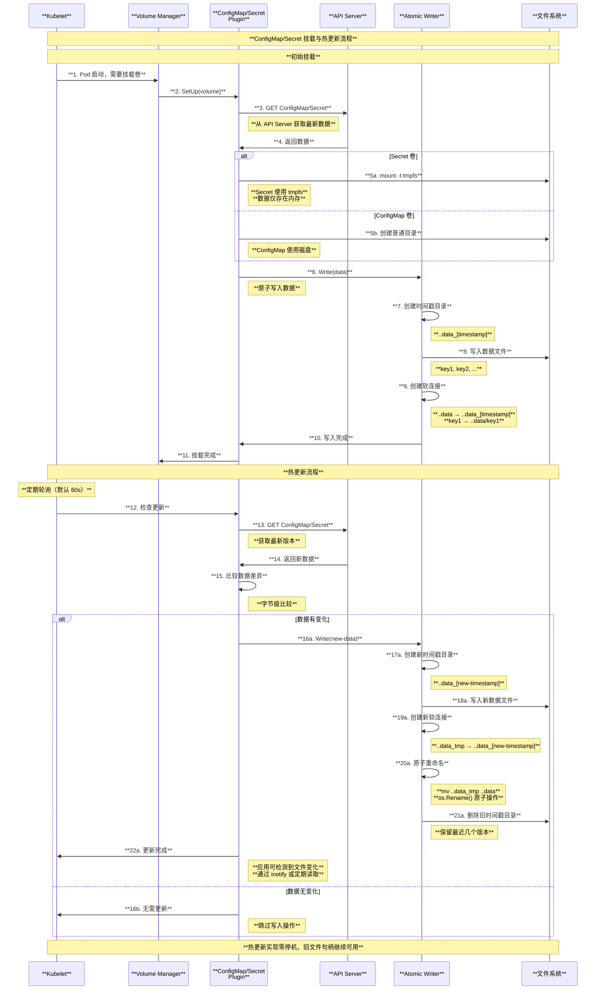

#### 3.1.4 configMap 使用示例

```yaml
# ConfigMap 定义
apiVersion: v1
kind: ConfigMap
metadata:
  name: app-config
data:
  # 键值对配置
  database.url: "mysql://db:3306/myapp"
  max.connections: "100"
  
  # 完整配置文件
  app.properties: |
    server.port=8080
    logging.level=INFO
    cache.enabled=true

---
# Pod 使用 ConfigMap
apiVersion: v1
kind: Pod
metadata:
  name: configmap-demo
spec:
  containers:
  - name: app
    image: myapp:1.0
    
    # 方式1：挂载为文件
    volumeMounts:
    - name: config-volume
      mountPath: /etc/config
      readOnly: true
    
    # 方式2：注入环境变量（单个键）
    env:
    - name: DATABASE_URL
      valueFrom:
        configMapKeyRef:
          name: app-config
          key: database.url
    
    # 方式3：注入所有键为环境变量
    envFrom:
    - configMapRef:
        name: app-config
        prefix: CONFIG_   # 可选前缀
  
  volumes:
  - name: config-volume
    configMap:
      name: app-config
      # 可选：选择特定键
      items:
      - key: app.properties
        path: application.properties
      # 可选：设置文件权限
      defaultMode: 0644
```

#### 3.1.5 secret 使用示例

```yaml
# Secret 定义（多种类型）
---
# 1. Opaque（通用类型）
apiVersion: v1
kind: Secret
metadata:
  name: db-credentials
type: Opaque
data:
  username: YWRtaW4=      # base64编码的 "admin"
  password: cGFzc3dvcmQ=  # base64编码的 "password"

---
# 2. TLS 证书
apiVersion: v1
kind: Secret
metadata:
  name: tls-cert
type: kubernetes.io/tls
data:
  tls.crt: LS0tLS1CRUdJTi...  # base64编码的证书
  tls.key: LS0tLS1CRUdJTi...  # base64编码的私钥

---
# 3. Docker Registry 凭证
apiVersion: v1
kind: Secret
metadata:
  name: docker-registry-secret
type: kubernetes.io/dockerconfigjson
data:
  .dockerconfigjson: eyJhdXRocyI...

---
# Pod 使用 Secret
apiVersion: v1
kind: Pod
metadata:
  name: secret-demo
spec:
  containers:
  - name: app
    image: myapp:1.0
    
    # 方式1：挂载为文件（推荐用于证书、配置文件）
    volumeMounts:
    - name: db-secret
      mountPath: /etc/secrets
      readOnly: true
    
    # 方式2：环境变量注入
    env:
    - name: DB_USERNAME
      valueFrom:
        secretKeyRef:
          name: db-credentials
          key: username
    - name: DB_PASSWORD
      valueFrom:
        secretKeyRef:
          name: db-credentials
          key: password
  
  # 方式3：用于拉取私有镜像
  imagePullSecrets:
  - name: docker-registry-secret
  
  volumes:
  - name: db-secret
    secret:
      secretName: db-credentials
      # Secret 挂载为 tmpfs，不写入磁盘
      defaultMode: 0400  # 只读权限
```

### 3.2 downwardAPI

#### 3.2.1 downwardAPI 架构图

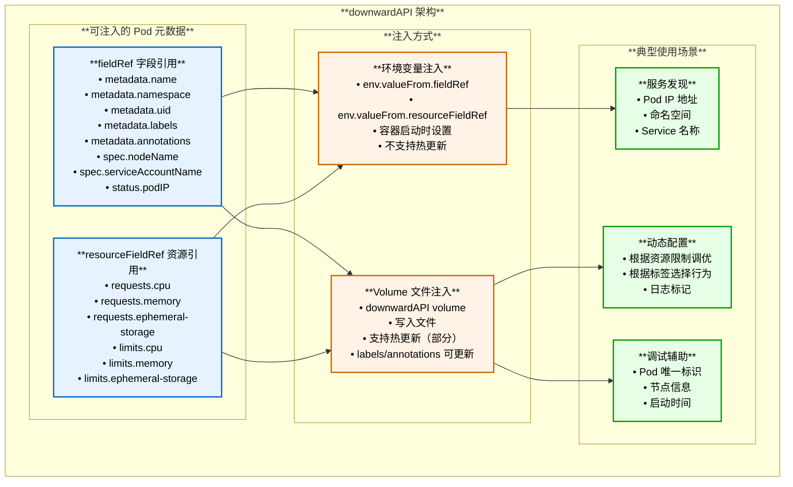

#### 3.2.2 downwardAPI 使用示例

```yaml
apiVersion: v1
kind: Pod
metadata:
  name: downwardapi-demo
  namespace: demo-ns
  labels:
    app: myapp
    tier: backend
  annotations:
    build.version: "v1.2.3"
    commit.sha: "abc123"
spec:
  containers:
  - name: app
    image: busybox
    command: ["sh", "-c", "while true; do cat /etc/podinfo/*; sleep 60; done"]
    
    # 方式1：通过环境变量注入
    env:
    # Pod 字段
    - name: POD_NAME
      valueFrom:
        fieldRef:
          fieldPath: metadata.name
    - name: POD_NAMESPACE
      valueFrom:
        fieldRef:
          fieldPath: metadata.namespace
    - name: POD_IP
      valueFrom:
        fieldRef:
          fieldPath: status.podIP
    - name: NODE_NAME
      valueFrom:
        fieldRef:
          fieldPath: spec.nodeName
    
    # 资源字段
    - name: CPU_REQUEST
      valueFrom:
        resourceFieldRef:
          containerName: app
          resource: requests.cpu
          divisor: "1m"  # 转换单位为 millicores
    - name: MEMORY_LIMIT
      valueFrom:
        resourceFieldRef:
          containerName: app
          resource: limits.memory
          divisor: "1Mi"  # 转换单位为 MiB
    
    # 方式2：通过 Volume 文件注入
    volumeMounts:
    - name: podinfo
      mountPath: /etc/podinfo
      readOnly: true
    
    resources:
      requests:
        cpu: "100m"
        memory: "128Mi"
      limits:
        cpu: "200m"
        memory: "256Mi"
  
  volumes:
  - name: podinfo
    downwardAPI:
      items:
      # 注入字段为文件
      - path: "pod-name"
        fieldRef:
          fieldPath: metadata.name
      - path: "pod-namespace"
        fieldRef:
          fieldPath: metadata.namespace
      - path: "pod-uid"
        fieldRef:
          fieldPath: metadata.uid
      
      # 注入标签为文件
      - path: "labels"
        fieldRef:
          fieldPath: metadata.labels
      
      # 注入注解为文件
      - path: "annotations"
        fieldRef:
          fieldPath: metadata.annotations
      
      # 注入资源信息
      - path: "cpu-request"
        resourceFieldRef:
          containerName: app
          resource: requests.cpu
          divisor: "1m"
      
      - path: "memory-limit"
        resourceFieldRef:
          containerName: app
          resource: limits.memory
          divisor: "1Mi"
```

#### 3.2.3 downwardAPI 热更新行为

| 元数据类型 | 环境变量 | Volume 文件 | 是否可热更新 |
|-----------|---------|------------|-------------|
| **metadata.name** | ✓ | ✓ | ✗（不变） |
| **metadata.namespace** | ✓ | ✓ | ✗（不变） |
| **metadata.uid** | ✓ | ✓ | ✗（不变） |
| **metadata.labels** | ✗ | ✓ | ✓（文件会更新） |
| **metadata.annotations** | ✗ | ✓ | ✓（文件会更新） |
| **status.podIP** | ✓ | ✓ | ✗（Pod 重启才变） |
| **spec.nodeName** | ✓ | ✓ | ✗（不变） |
| **resources.requests** | ✓ | ✓ | ✗（Pod 重启才变） |
| **resources.limits** | ✓ | ✓ | ✗（Pod 重启才变） |

### 3.3 projected Volume

#### 3.3.1 projected Volume 架构

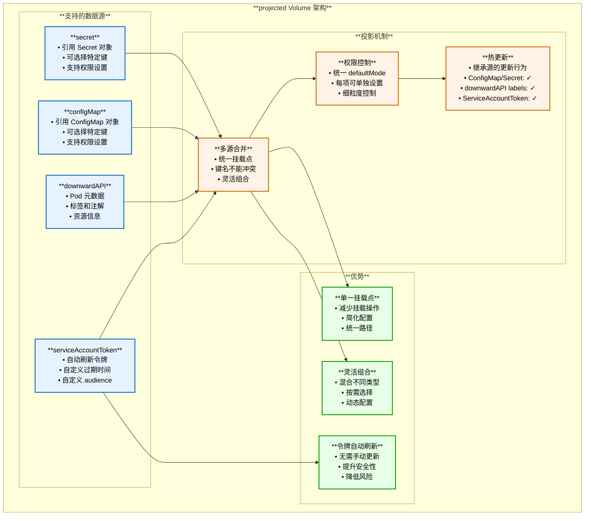

#### 3.3.2 projected Volume 使用示例

```yaml
apiVersion: v1
kind: Pod
metadata:
  name: projected-volume-demo
  labels:
    app: myapp
spec:
  serviceAccountName: my-service-account
  containers:
  - name: app
    image: myapp:1.0
    volumeMounts:
    - name: projected-vol
      mountPath: /projected
      readOnly: true
  
  volumes:
  - name: projected-vol
    projected:
      defaultMode: 0644
      sources:
      # 数据源1：Secret
      - secret:
          name: db-credentials
          items:
          - key: username
            path: db/username
          - key: password
            path: db/password
            mode: 0400  # 更严格的权限
      
      # 数据源2：ConfigMap
      - configMap:
          name: app-config
          items:
          - key: app.properties
            path: config/application.properties
          - key: logging.conf
            path: config/logging.conf
      
      # 数据源3：downwardAPI
      - downwardAPI:
          items:
          - path: "pod-info/name"
            fieldRef:
              fieldPath: metadata.name
          - path: "pod-info/namespace"
            fieldRef:
              fieldPath: metadata.namespace
          - path: "pod-info/labels"
            fieldRef:
              fieldPath: metadata.labels
          - path: "pod-info/annotations"
            fieldRef:
              fieldPath: metadata.annotations
          - path: "resources/cpu-request"
            resourceFieldRef:
              containerName: app
              resource: requests.cpu
      
      # 数据源4：ServiceAccount Token（自动刷新）
      - serviceAccountToken:
          path: token
          expirationSeconds: 3600        # 1小时过期
          audience: "https://myapi.com"  # 自定义 audience
```

#### 3.3.3 projected Volume 文件结构示例

使用上述配置后，挂载点 `/projected` 的文件结构：

```
/projected/
├── db/
│   ├── username          # 来自 Secret
│   └── password          # 来自 Secret (mode: 0400)
├── config/
│   ├── application.properties  # 来自 ConfigMap
│   └── logging.conf            # 来自 ConfigMap
├── pod-info/
│   ├── name              # 来自 downwardAPI
│   ├── namespace         # 来自 downwardAPI
│   ├── labels            # 来自 downwardAPI
│   └── annotations       # 来自 downwardAPI
├── resources/
│   └── cpu-request       # 来自 downwardAPI
└── token                 # ServiceAccount Token（自动刷新）
```

---

## 4. 本地存储类 Volume

### 4.1 hostPath

#### 4.1.1 hostPath 架构与原理

基于源码 `pkg/volume/hostpath/host_path.go`：

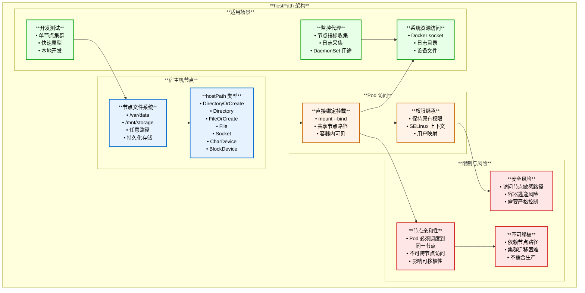

#### 4.1.2 hostPath 类型详解

| hostPath 类型 | 描述 | 检查行为 | 典型用途 |
|--------------|------|---------|---------|
| **(空字符串)** | 不做任何检查 | 无 | 向后兼容，不推荐 |
| **DirectoryOrCreate** | 目录不存在时创建 | 检查是否为目录，不存在则创建 | 日志目录、缓存目录 |
| **Directory** | 必须存在的目录 | 检查路径必须是已存在的目录 | 配置文件目录、数据目录 |
| **FileOrCreate** | 文件不存在时创建 | 检查是否为文件，不存在则创建空文件 | 特定配置文件 |
| **File** | 必须存在的文件 | 检查路径必须是已存在的文件 | 证书文件、密钥文件 |
| **Socket** | 必须存在的 UNIX socket | 检查路径必须是 socket | Docker socket、监控 socket |
| **CharDevice** | 必须存在的字符设备 | 检查路径必须是字符设备 | GPU 设备、串口设备 |
| **BlockDevice** | 必须存在的块设备 | 检查路径必须是块设备 | 磁盘设备、裸设备 |

#### 4.1.3 hostPath 挂载时序图

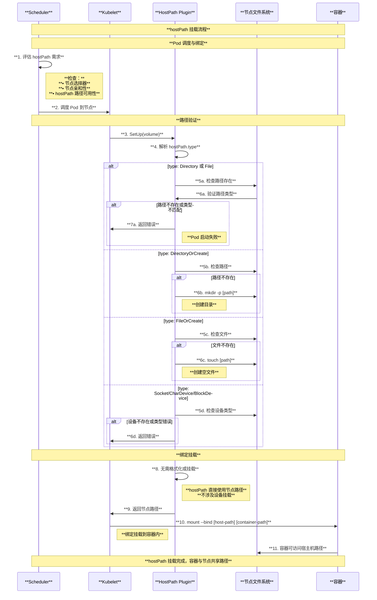

#### 4.1.4 hostPath 使用示例与安全配置

```yaml
# 示例1：访问 Docker Socket（监控/CI/CD 场景）
apiVersion: v1
kind: Pod
metadata:
  name: docker-client
spec:
  containers:
  - name: docker
    image: docker:latest
    command: ["docker", "ps"]
    volumeMounts:
    - name: docker-socket
      mountPath: /var/run/docker.sock
  
  volumes:
  - name: docker-socket
    hostPath:
      path: /var/run/docker.sock
      type: Socket  # 验证是 socket 文件

---
# 示例2：日志收集（DaemonSet）
apiVersion: apps/v1
kind: DaemonSet
metadata:
  name: fluentd
spec:
  selector:
    matchLabels:
      app: fluentd
  template:
    metadata:
      labels:
        app: fluentd
    spec:
      containers:
      - name: fluentd
        image: fluentd:latest
        volumeMounts:
        - name: varlog
          mountPath: /var/log
          readOnly: true  # 只读，提升安全性
        - name: varlibdockercontainers
          mountPath: /var/lib/docker/containers
          readOnly: true
      
      volumes:
      - name: varlog
        hostPath:
          path: /var/log
          type: Directory
      - name: varlibdockercontainers
        hostPath:
          path: /var/lib/docker/containers
          type: Directory

---
# 示例3：GPU 设备访问
apiVersion: v1
kind: Pod
metadata:
  name: gpu-pod
spec:
  containers:
  - name: cuda-app
    image: nvidia/cuda:11.0-base
    volumeMounts:
    - name: nvidia-device
      mountPath: /dev/nvidia0
  
  volumes:
  - name: nvidia-device
    hostPath:
      path: /dev/nvidia0
      type: CharDevice  # 验证是字符设备

---
# 示例4：持久化数据（单节点开发环境）
apiVersion: v1
kind: Pod
metadata:
  name: mysql-hostpath
spec:
  nodeSelector:
    kubernetes.io/hostname: specific-node  # 固定节点
  containers:
  - name: mysql
    image: mysql:8.0
    env:
    - name: MYSQL_ROOT_PASSWORD
      value: "password"
    volumeMounts:
    - name: mysql-data
      mountPath: /var/lib/mysql
  
  volumes:
  - name: mysql-data
    hostPath:
      path: /mnt/data/mysql
      type: DirectoryOrCreate  # 不存在则创建
```

#### 4.1.5 hostPath 安全限制配置

**PodSecurityPolicy 示例（已废弃，仅供参考）：**

```yaml
apiVersion: policy/v1beta1
kind: PodSecurityPolicy
metadata:
  name: restricted-hostpath
spec:
  # 限制 hostPath 使用
  volumes:
  - configMap
  - emptyDir
  - projected
  - secret
  - downwardAPI
  - persistentVolumeClaim
  # 不包括 hostPath
  
  # 或者允许特定路径
  allowedHostPaths:
  - pathPrefix: "/var/log"      # 只允许日志目录
    readOnly: true
  - pathPrefix: "/var/run/docker.sock"  # 允许 Docker socket
```

**推荐使用 Pod Security Standards（PSS）：**

```yaml
# Namespace 级别限制
apiVersion: v1
kind: Namespace
metadata:
  name: production
  labels:
    pod-security.kubernetes.io/enforce: restricted  # 禁止 hostPath
    pod-security.kubernetes.io/audit: restricted
    pod-security.kubernetes.io/warn: restricted

---
# 允许特定场景的 Namespace
apiVersion: v1
kind: Namespace
metadata:
  name: monitoring
  labels:
    pod-security.kubernetes.io/enforce: baseline  # 允许特定 hostPath
```

### 4.2 local PersistentVolume

#### 4.2.1 local 与 hostPath 对比

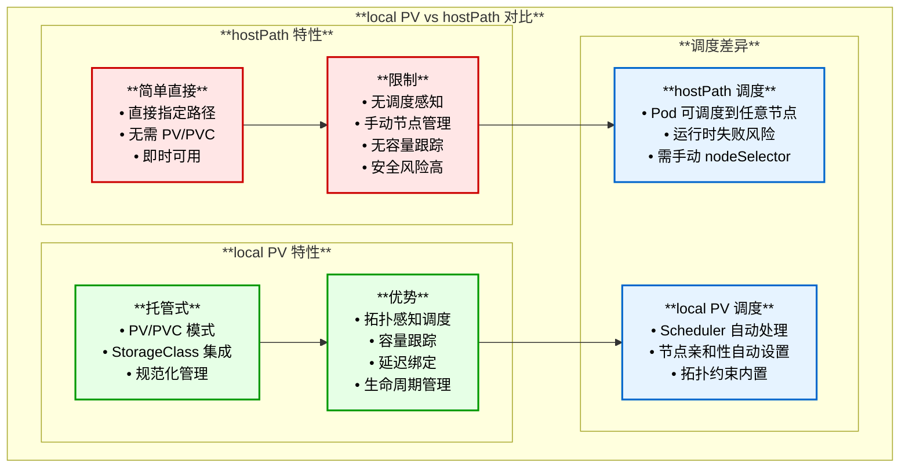

#### 4.2.2 local PV 使用示例

```yaml
# 1. 创建 StorageClass
apiVersion: storage.k8s.io/v1
kind: StorageClass
metadata:
  name: local-storage
provisioner: kubernetes.io/no-provisioner  # 不支持动态供应
volumeBindingMode: WaitForFirstConsumer    # 延迟绑定
reclaimPolicy: Delete

---
# 2. 创建 local PersistentVolume
apiVersion: v1
kind: PersistentVolume
metadata:
  name: local-pv-1
spec:
  capacity:
    storage: 100Gi
  volumeMode: Filesystem
  accessModes:
  - ReadWriteOnce
  persistentVolumeReclaimPolicy: Delete
  storageClassName: local-storage
  local:
    path: /mnt/disks/ssd1  # 节点本地路径
  nodeAffinity:            # 关键：指定节点
    required:
      nodeSelectorTerms:
      - matchExpressions:
        - key: kubernetes.io/hostname
          operator: In
          values:
          - node-1

---
# 3. 创建 PVC
apiVersion: v1
kind: PersistentVolumeClaim
metadata:
  name: local-claim
spec:
  accessModes:
  - ReadWriteOnce
  storageClassName: local-storage
  resources:
    requests:
      storage: 50Gi

---
# 4. 使用 PVC 的 Pod
apiVersion: v1
kind: Pod
metadata:
  name: app-with-local-pv
spec:
  containers:
  - name: app
    image: nginx
    volumeMounts:
    - name: local-storage
      mountPath: /data
  
  volumes:
  - name: local-storage
    persistentVolumeClaim:
      claimName: local-claim
  # 注意：Pod 会自动调度到拥有 local PV 的节点（node-1）
```

#### 4.2.3 local PV 延迟绑定机制

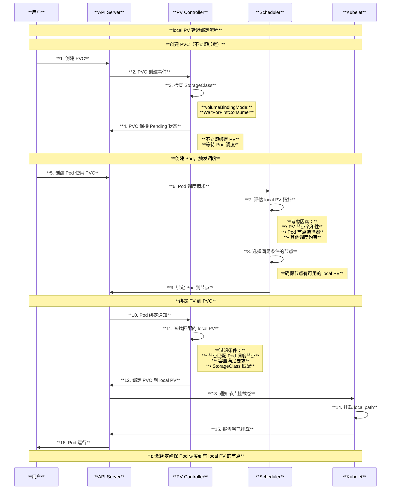

---

## 5. 网络存储类 Volume

### 5.1 NFS

#### 5.1.1 NFS 架构与原理

基于源码 `pkg/volume/nfs/nfs.go`：

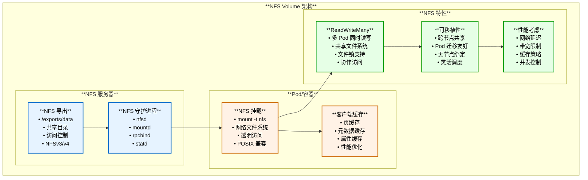

#### 5.1.2 NFS 使用示例

```yaml
apiVersion: v1
kind: Pod
metadata:
  name: nfs-demo
spec:
  containers:
  - name: app
    image: nginx
    volumeMounts:
    - name: nfs-storage
      mountPath: /data
  
  volumes:
  - name: nfs-storage
    nfs:
      server: nfs-server.example.com
      path: /exports/data
      readOnly: false

---
# PersistentVolume 方式
apiVersion: v1
kind: PersistentVolume
metadata:
  name: nfs-pv
spec:
  capacity:
    storage: 100Gi
  accessModes:
  - ReadWriteMany  # NFS 支持多节点读写
  persistentVolumeReclaimPolicy: Retain
  nfs:
    server: nfs-server.example.com
    path: /exports/data
```

---

## 6. 云存储类 Volume

### 6.1 云存储概述

| 云提供商 | Volume 类型 | 访问模式 | 特性 | 推荐场景 |
|---------|------------|---------|------|---------|
| **AWS** | awsElasticBlockStore | RWO | 高性能块存储、快照支持 | 数据库、高 I/O 应用 |
| **GCE** | gcePersistentDisk | RWO, ROX | SSD/HDD 选项、区域持久化 | 通用工作负载 |
| **Azure** | azureDisk | RWO | 托管磁盘、多性能层级 | 企业应用 |
| **Azure** | azureFile | RWX | SMB/NFS 协议、共享存储 | 共享文件系统 |

### 6.2 AWS EBS 示例

```yaml
apiVersion: v1
kind: Pod
metadata:
  name: aws-ebs-demo
spec:
  containers:
  - name: app
    image: nginx
    volumeMounts:
    - name: ebs-storage
      mountPath: /data
  
  volumes:
  - name: ebs-storage
    awsElasticBlockStore:
      volumeID: vol-0123456789abcdef0
      fsType: ext4
      # 注意：Pod 必须运行在 EBS 卷所在的可用区

---
# 推荐使用 CSI + StorageClass 动态供应
apiVersion: storage.k8s.io/v1
kind: StorageClass
metadata:
  name: aws-ebs-gp3
provisioner: ebs.csi.aws.com
parameters:
  type: gp3
  iops: "3000"
  throughput: "125"
  encrypted: "true"
volumeBindingMode: WaitForFirstConsumer
allowVolumeExpansion: true
```

---

## 7. 持久化存储类 Volume

### 7.1 PersistentVolumeClaim

PVC 是请求存储的抽象，与具体存储实现解耦。

```yaml
apiVersion: v1
kind: PersistentVolumeClaim
metadata:
  name: my-pvc
spec:
  accessModes:
  - ReadWriteOnce
  resources:
    requests:
      storage: 10Gi
  storageClassName: fast-ssd
  
  # 可选：从快照恢复
  dataSource:
    kind: VolumeSnapshot
    name: my-snapshot
    apiGroup: snapshot.storage.k8s.io
```

### 7.2 CSI Volume

CSI（容器存储接口）是现代 Kubernetes 存储的标准。

```yaml
apiVersion: v1
kind: Pod
metadata:
  name: csi-demo
spec:
  containers:
  - name: app
    image: nginx
    volumeMounts:
    - name: csi-storage
      mountPath: /data
  
  volumes:
  - name: csi-storage
    persistentVolumeClaim:
      claimName: my-pvc
```

详细的 CSI 架构和原理请参考 `vdocs/csi.md`。

---

## 8. 特殊用途类 Volume

### 8.1 Volume 类型对比总结

| 特性维度 | emptyDir | hostPath | local PV | NFS | PVC/CSI |
|---------|----------|----------|----------|-----|---------|
| **持久化** | ✗ | ✓ | ✓ | ✓ | ✓ |
| **跨节点共享** | ✗ | ✗ | ✗ | ✓ | 取决于后端 |
| **访问模式** | RWO | RWO | RWO | RWX | 取决于后端 |
| **性能** | 极高 | 高 | 高 | 中 | 取决于后端 |
| **管理复杂度** | 低 | 低 | 中 | 中 | 高 |
| **适用场景** | 临时数据 | 系统访问 | 本地高性能 | 共享文件 | 生产环境 |
| **生产推荐** | ✗ | △ | ✓ | ✓ | ✓ |

### 8.2 Volume 选择决策树

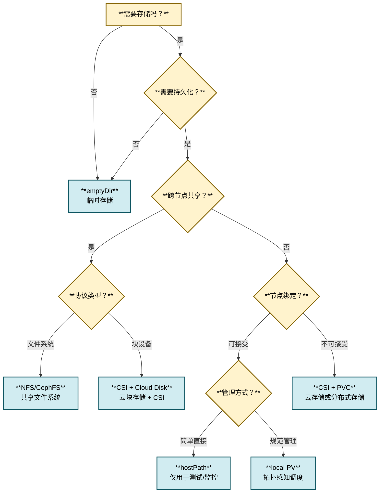

### 8.3 最佳实践建议

#### 8.3.1 按环境选择

| 环境 | 推荐 Volume 类型 | 原因 |
|------|----------------|------|
| **开发环境** | emptyDir, hostPath | 快速迭代，无需持久化 |
| **测试环境** | local PV, NFS | 模拟生产，成本可控 |
| **生产环境** | CSI + PVC (云存储或分布式存储) | 高可用、可靠、易管理 |
| **边缘计算** | local PV, hostPath | 本地高性能，网络受限 |

#### 8.3.2 按应用类型选择

| 应用类型 | 推荐 Volume 类型 | 关键考虑 |
|---------|----------------|---------|
| **无状态应用** | emptyDir, configMap | 临时缓存、配置注入 |
| **有状态应用（单实例）** | PVC (RWO) | 数据库、单节点应用 |
| **有状态应用（多实例）** | PVC (RWX) 或 StatefulSet | 共享存储或独立存储 |
| **缓存层** | emptyDir (memory) | 内存文件系统，极速访问 |
| **日志收集** | hostPath, emptyDir | 节点日志访问 |
| **配置管理** | configMap, secret | 配置文件、敏感数据 |

#### 8.3.3 性能优化建议

**高 I/O 应用**：
- 优先选择：local PV (NVMe SSD) > CSI (Premium SSD) > 网络存储
- 避免：NFS (高延迟)，emptyDir disk-backed (共享节点I/O)

**共享文件场景**：
- 优先选择：NFS, CephFS, Azure Files
- 考虑：并发控制、文件锁、一致性要求

**数据库应用**：
- 优先选择：CSI + 块存储 (AWS EBS gp3/io2, GCE PD SSD)
- 配置：快照备份、卷扩展、IOPS 预留

#### 8.3.4 安全加固建议

1. **最小权限原则**：
   ```yaml
   securityContext:
     fsGroup: 2000
     runAsNonRoot: true
     runAsUser: 1000
   
   volumeMounts:
   - name: data
     mountPath: /data
     readOnly: true  # 只读挂载
   ```

2. **敏感数据保护**：
   - 使用 `secret` 存储密码、密钥
   - 启用静态加密（etcd encryption, 云存储加密）
   - 限制 `hostPath` 使用（Pod Security Standards）

3. **资源配额**：
   ```yaml
   # ResourceQuota
   spec:
     hard:
       persistentvolumeclaims: "10"
       requests.storage: "100Gi"
   ```

---

## 9. 总结

### 9.1 Volume 技术演进

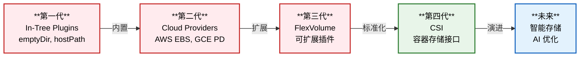

### 9.2 关键要点

1. **emptyDir**：临时存储，Pod 删除即清空，适合缓存和临时数据
2. **configMap/secret**：配置注入，支持热更新，文件和环境变量两种方式
3. **hostPath**：节点路径，持久化但节点绑定，谨慎使用
4. **local PV**：本地持久卷，拓扑感知调度，高性能本地存储
5. **NFS**：网络文件系统，ReadWriteMany，适合共享文件
6. **PVC + CSI**：生产环境首选，标准化接口，云原生存储

### 9.3 未来趋势

- **CSI 规范**持续演进，增强快照、克隆、扩展能力
- **存储类优化**：自动分层、智能缓存、AI 驱动的性能优化
- **边缘存储**：适应边缘计算场景的轻量级存储方案
- **多云存储**：统一接口管理跨云存储资源
- **数据保护**：内置加密、合规审计、灾难恢复

---

**本文档基于 Kubernetes 源码深度分析，涵盖了所有主要 Volume 类型的架构、原理和使用场景。**


