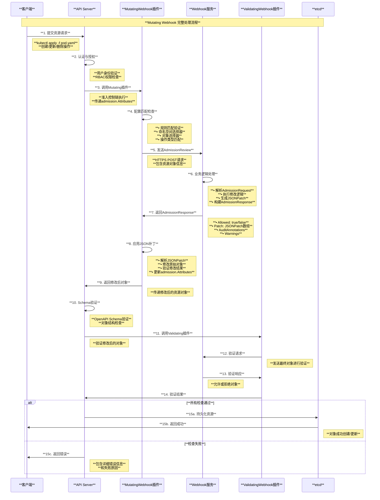

# Kubernetes Admission Webhook 准入控制深度解读

## 目录

1. [概述](#概述)
2. [Webhook 核心概念](#webhook-核心概念)
3. [Webhook 整体架构](#webhook-整体架构)
4. [Mutating Webhook 机制](#mutating-webhook-机制)
5. [Validating Webhook 机制](#validating-webhook-机制)
6. [AdmissionReview 协议](#admissionreview-协议)
7. [配置与部署](#配置与部署)
8. [实际应用场景](#实际应用场景)
9. [最佳实践与排查](#最佳实践与排查)
10. [总结](#总结)

---

## 概述

Admission Webhook 是 Kubernetes 准入控制器系统的重要扩展机制，允许用户通过 HTTP 回调的方式实现自定义的准入逻辑。Webhook 分为 Mutating Admission Webhook 和 Validating Admission Webhook 两种类型，分别用于资源修改和验证。本文档基于 Kubernetes 源码深入解读 Webhook 的架构设计、工作原理和实现机制。

### 核心特性

- **动态扩展**：无需修改 Kubernetes 源码即可扩展准入控制逻辑
- **双阶段处理**：Mutating 和 Validating 两阶段处理模式
- **高度可配置**：支持细粒度的规则匹配和错误处理策略
- **标准化协议**：基于 AdmissionReview 的标准 API 接口
- **高可用设计**：支持故障转移和超时处理机制

---

## Webhook 核心概念

### 1. Webhook 类型分类

```mermaid
graph TB
    subgraph "**Kubernetes Admission Webhook 类型**"
        style subgraph fill:#f9f9f9,stroke:#333,stroke-width:2px
        
        subgraph "**Mutating Admission Webhook**"
            style subgraph fill:#e6f3ff,stroke:#0066cc,stroke-width:2px
            
            MUTATING[**MutatingAdmissionWebhook**<br/>• **功能**: 修改请求对象<br/>• **执行时机**: 资源对象变更前<br/>• **典型用途**: 注入sidecar、设置默认值<br/>• **返回**: AdmissionReview + JSONPatch]
            
            MUTATING_EXAMPLES[**应用示例**<br/>• **Istio**: 自动注入Envoy代理<br/>• **Vault**: 注入secret管理<br/>• **Default值**: 自动填充默认配置<br/>• **Label注入**: 添加标准标签]
        end
        
        subgraph "**Validating Admission Webhook**"
            style subgraph fill:#fff2e6,stroke:#cc6600,stroke-width:2px
            
            VALIDATING[**ValidatingAdmissionWebhook**<br/>• **功能**: 验证请求对象<br/>• **执行时机**: 资源对象变更前<br/>• **典型用途**: 策略检查、合规验证<br/>• **返回**: AdmissionReview + Allow/Deny]
            
            VALIDATING_EXAMPLES[**应用示例**<br/>• **OPA**: 开放策略代理验证<br/>• **Security策略**: 安全规则检查<br/>• **资源配额**: 资源限制验证<br/>• **镜像策略**: 镜像安全扫描]
        end
        
        subgtml:graph "**执行顺序**"
            style subgraph fill:#e6ffe6,stroke:#009900,stroke-width:2px
            
            EXECUTION_ORDER[**Webhook执行顺序**<br/>1. **内置Mutating插件**<br/>2. **MutatingAdmissionWebhook**<br/>3. **Object Schema验证**<br/>4. **内置Validating插件**<br/>5. **ValidatingAdmissionWebhook**]
        end
        
        subgraph "**配置资源**"
            style subgraph fill:#f0f8ff,stroke:#4169e1,stroke-width:2px
            
            CONFIGURATIONS[**Webhook配置**<br/>• **MutatingWebhookConfiguration**<br/>• **ValidatingWebhookConfiguration**<br/>• **规则匹配配置**<br/>• **客户端连接配置**<br/>• **故障处理策略**]
        end
        
        subgraph "**通信协议**"
            style subgraph fill:#ffe6f2,stroke:#cc0066,stroke-width:2px
            
            PROTOCOL[**AdmissionReview协议**<br/>• **Request**: 包含资源信息<br/>• **Response**: 包含决策结果<br/>• **版本兼容**: v1/v1beta1<br/>• **序列化**: JSON格式<br/>• **传输**: HTTPS强制要求]
        end
    end
    
    MUTATING --> MUTATING_EXAMPLES
    VALIDATING --> VALIDATING_EXAMPLES
    
    MUTATING_EXAMPLES --> EXECUTION_ORDER
    VALIDATING_EXAMPLES --> EXECUTION_ORDER
    
    EXECUTION_ORDER --> CONFIGURATIONS
    CONFIGURATIONS --> PROTOCOL
    
    style MUTATING fill:#90EE90,stroke:#006400,stroke-width:2px
    style VALIDATING fill:#87CEEB,stroke:#4682B4,stroke-width:2px
    style EXECUTION_ORDER fill:#DDA0DD,stroke:#8B008B,stroke-width:2px
    style PROTOCOL fill:#98FB98,stroke:#006400,stroke-width:2px
```

### 2. Webhook Configuration 结构

基于源码 `pkg/apis/admissionregistration/types.go`：

```go
// MutatingWebhookConfiguration 描述修改性准入webhook配置
type MutatingWebhookConfiguration struct {
    metav1.TypeMeta
    metav1.ObjectMeta
    
    // Webhooks 定义webhook列表和影响的资源操作
    Webhooks []MutatingWebhook
}

// MutatingWebhook 描述准入webhook及其应用的资源和操作
type MutatingWebhook struct {
    // webhook名称 - 必须全限定名称
    Name string
    
    // 客户端配置 - 定义如何与webhook通信
    ClientConfig WebhookClientConfig
    
    // 规则 - 描述webhook关心的操作和资源
    Rules []RuleWithOperations
    
    // 故障策略 - Ignore或Fail，默认为Ignore
    FailurePolicy *FailurePolicyType
    
    // 匹配策略 - Exact或Equivalent
    MatchPolicy *MatchPolicyType
    
    // 命名空间选择器
    NamespaceSelector *metav1.LabelSelector
    
    // 对象选择器
    ObjectSelector *metav1.LabelSelector
    
    // 准入审查版本 - 支持的AdmissionReview版本
    AdmissionReviewVersions []string
    
    // 副作用配置 - None, NoneOnDryRun等
    SideEffects *SideEffectClass
    
    // 超时时间 - 默认10秒
    TimeoutSeconds *int32
    
    // 重新调用策略 - Never或IfNeeded
    ReinvocationPolicy *ReinvocationPolicyType
    
    // 匹配条件 - 基于CEL表达式的高级匹配
    MatchConditions []MatchCondition
}
```

---

## Webhook 整体架构

### 1. 系统架构图

```mermaid
graph TB
    subgraph "**Kubernetes Admission Webhook 整体架构**"
        style subgraph fill:#f9f9f9,stroke:#333,stroke-width:2px
        
        subgraph "**客户端请求层**"
            style subgraph fill:#e6f3ff,stroke:#0066cc,stroke-width:2px
            
            KUBECTL[**kubectl**<br/>• 用户命令行操作<br/>• 资源YAML提交<br/>• 配置管理<br/>• API调用发起]
            
            CONTROLLER[**控制器**<br/>• Deployment控制器<br/>• StatefulSet控制器<br/>• 自定义控制器<br/>• API资源操作]
        end
        
        subgraph "**API Server 准入控制**"
            style subgraph fill:#fff2e6,stroke:#cc6600,stroke-width:2px
            
            API_SERVER[**API Server**<br/>• 接收API请求<br/>• 认证授权检查<br/>• 准入控制链执行<br/>• 资源持久化]
            
            ADMISSION_CHAIN[**准入控制链**<br/>• **1. 内置Mutating插件**<br/>• **2. MutatingAdmissionWebhook**<br/>• **3. Object Schema验证**<br/>• **4. 内置Validating插件**<br/>• **5. ValidatingAdmissionWebhook**]
        end
        
        subgraph "**Webhook 插件层**"
            style subgraph fill:#e6ffe6,stroke:#009900,stroke-width:2px
            
            MUTATING_PLUGIN[**Mutating插件**<br/>• 配置管理器<br/>• 规则匹配引擎<br/>• HTTP客户端<br/>• 响应处理器]
            
            VALIDATING_PLUGIN[**Validating插件**<br/>• 配置管理器<br/>• 规则匹配引擎<br/>• HTTP客户端<br/>• 响应验证器]
        end
        
        subgraph "**外部Webhook服务**"
            style subgraph fill:#f0f8ff,stroke:#4169e1,stroke-width:2px
            
            WEBHOOK_SERVICE[**Webhook服务端**<br/>• HTTPS服务器<br/>• AdmissionReview处理<br/>• 业务逻辑实现<br/>• 证书管理]
            
            WEBHOOK_LOGIC[**业务逻辑**<br/>• 策略验证<br/>• 资源修改<br/>• 外部系统集成<br/>• 日志审计]
        end
        
        subgraph "**配置管理**"
            style subgraph fill:#ffe6f2,stroke:#cc0066,stroke-width:2px
            
            WEBHOOK_CONFIG[**Webhook配置**<br/>• MutatingWebhookConfiguration<br/>• ValidatingWebhookConfiguration<br/>• 规则定义<br/>• 客户端配置]
            
            CERTIFICATES[**证书管理**<br/>• TLS证书<br/>• CA证书<br/>• 证书轮换<br/>• 安全通信]
        end
        
        subgraph "**监控与观测**"
            style subgraph fill:#f5f5dc,stroke:#daa520,stroke-width:2px
            
            MONITORING[**监控指标**<br/>• 请求延迟<br/>• 成功率<br/>• 错误统计<br/>• 性能指标]
            
            LOGGING[**日志记录**<br/>• 请求日志<br/>• 决策日志<br/>• 错误日志<br/>• 审计跟踪]
        end
    end
    
    KUBECTL --> API_SERVER
    CONTROLLER --> API_SERVER
    
    API_SERVER --> ADMISSION_CHAIN
    ADMISSION_CHAIN --> MUTATING_PLUGIN
    ADMISSION_CHAIN --> VALIDATING_PLUGIN
    
    MUTATING_PLUGIN --> WEBHOOK_SERVICE
    VALIDATING_PLUGIN --> WEBHOOK_SERVICE
    WEBHOOK_SERVICE --> WEBHOOK_LOGIC
    
    WEBHOOK_CONFIG --> MUTATING_PLUGIN
    WEBHOOK_CONFIG --> VALIDATING_PLUGIN
    CERTIFICATES --> WEBHOOK_SERVICE
    
    WEBHOOK_SERVICE --> MONITORING
    WEBHOOK_SERVICE --> LOGGING
    
    style API_SERVER fill:#90EE90,stroke:#006400,stroke-width:2px
    style ADMISSION_CHAIN fill:#87CEEB,stroke:#4682B4,stroke-width:2px
    style WEBHOOK_SERVICE fill:#DDA0DD,stroke:#8B008B,stroke-width:2px
    style WEBHOOK_CONFIG fill:#98FB98,stroke:#006400,stroke-width:2px
```

---

## Mutating Webhook 机制

### 1. Mutating Webhook 实现

基于源码 `staging/src/k8s.io/apiserver/pkg/admission/plugin/webhook/mutating/plugin.go`：

```go
// Plugin 是MutatingAdmissionWebhook的实现
type Plugin struct {
    *generic.Webhook
}

// Admit 基于请求属性做准入决策
func (a *Plugin) Admit(ctx context.Context, attr admission.Attributes, o admission.ObjectInterfaces) error {
    return a.Webhook.Dispatch(ctx, attr, o)
}

// NewMutatingWebhook 返回通用的准入webhook插件
func NewMutatingWebhook(configFile io.Reader) (*Plugin, error) {
    handler := admission.NewHandler(admission.Connect, admission.Create, admission.Delete, admission.Update)
    p := &Plugin{}
    var err error
    p.Webhook, err = generic.NewWebhook(handler, configFile, 
        configuration.NewMutatingWebhookConfigurationManager, 
        newMutatingDispatcher(p))
    if err != nil {
        return nil, err
    }
    return p, nil
}
```

### 2. Mutating Webhook 处理流程



### 3. JSONPatch 示例

```yaml
# 原始 Pod 对象
apiVersion: v1
kind: Pod
metadata:
  name: example-pod
  namespace: default
spec:
  containers:
  - name: app
    image: nginx:1.20

---
# Mutating Webhook 返回的 JSONPatch
[
  {
    "op": "add",
    "path": "/metadata/labels",
    "value": {
      "app": "example",
      "version": "1.0",
      "managed-by": "webhook"
    }
  },
  {
    "op": "add", 
    "path": "/spec/containers/0/env",
    "value": [
      {
        "name": "ENVIRONMENT",
        "value": "production"
      }
    ]
  },
  {
    "op": "add",
    "path": "/spec/containers/-",
    "value": {
      "name": "sidecar",
      "image": "istio/proxy:1.12.0",
      "ports": [
        {
          "containerPort": 15090
        }
      ]
    }
  }
]

---
# 应用JSONPatch后的Pod对象
apiVersion: v1
kind: Pod
metadata:
  name: example-pod
  namespace: default
  labels:
    app: example
    version: "1.0"
    managed-by: webhook
spec:
  containers:
  - name: app
    image: nginx:1.20
    env:
    - name: ENVIRONMENT
      value: production
  - name: sidecar
    image: istio/proxy:1.12.0
    ports:
    - containerPort: 15090
```

---

## Validating Webhook 机制

### 1. Validating Webhook 配置示例

```yaml
apiVersion: admissionregistration.k8s.io/v1
kind: ValidatingWebhookConfiguration
metadata:
  name: security-policy-webhook
webhooks:
- name: security-policy.example.com
  clientConfig:
    service:
      name: security-webhook
      namespace: webhook-system
      path: "/validate"
    caBundle: LS0tLS1CRUdJTi... # Base64编码的CA证书
  
  # 规则配置
  rules:
  - apiGroups: [""]
    apiVersions: ["v1"] 
    resources: ["pods"]
    operations: ["CREATE", "UPDATE"]
  - apiGroups: ["apps"]
    apiVersions: ["v1"]
    resources: ["deployments", "replicasets"]
    operations: ["CREATE", "UPDATE"]
  
  # 选择器配置
  namespaceSelector:
    matchLabels:
      security-policy: "enabled"
  
  objectSelector:
    matchExpressions:
    - key: "security-scan"
      operator: NotIn
      values: ["disabled"]
  
  # 故障处理策略
  failurePolicy: Fail
  
  # 匹配策略
  matchPolicy: Equivalent
  
  # 支持的AdmissionReview版本
  admissionReviewVersions: ["v1", "v1beta1"]
  
  # 副作用配置
  sideEffects: None
  
  # 超时配置（秒）
  timeoutSeconds: 30
  
  # 高级匹配条件（Beta功能）
  matchConditions:
  - name: "exclude-system-pods"
    expression: '!(object.metadata.namespace in ["kube-system", "kube-public"])'
```

### 2. Validating Webhook 处理逻辑

```go
// 基于源码的ValidatingWebhook处理示例
func (h *SecurityWebhookHandler) ValidatePod(req *admissionv1.AdmissionRequest) *admissionv1.AdmissionResponse {
    // 解析Pod对象
    pod := &corev1.Pod{}
    if err := json.Unmarshal(req.Object.Raw, pod); err != nil {
        return &admissionv1.AdmissionResponse{
            UID:     req.UID,
            Allowed: false,
            Result: &metav1.Status{
                Message: fmt.Sprintf("Failed to decode Pod: %v", err),
            },
        }
    }
    
    var warnings []string
    
    // 安全策略检查1：禁止特权容器
    for _, container := range pod.Spec.Containers {
        if container.SecurityContext != nil && 
           container.SecurityContext.Privileged != nil && 
           *container.SecurityContext.Privileged {
            return &admissionv1.AdmissionResponse{
                UID:     req.UID,
                Allowed: false,
                Result: &metav1.Status{
                    Code:    http.StatusForbidden,
                    Reason:  metav1.StatusReasonForbidden,
                    Message: "Privileged containers are not allowed",
                },
            }
        }
    }
    
    // 安全策略检查2：镜像安全扫描
    for _, container := range pod.Spec.Containers {
        if !h.isImageSecure(container.Image) {
            warnings = append(warnings, fmt.Sprintf("Image %s may have security vulnerabilities", container.Image))
        }
    }
    
    // 安全策略检查3：资源限制检查
    for _, container := range pod.Spec.Containers {
        if container.Resources.Limits == nil {
            return &admissionv1.AdmissionResponse{
                UID:     req.UID,
                Allowed: false,
                Result: &metav1.Status{
                    Message: "Resource limits must be specified for all containers",
                },
            }
        }
    }
    
    // 审计注解
    auditAnnotations := map[string]string{
        "security-policy.example.com/scanned": "true",
        "security-policy.example.com/image-count": fmt.Sprintf("%d", len(pod.Spec.Containers)),
    }
    
    return &admissionv1.AdmissionResponse{
        UID:              req.UID,
        Allowed:          true,
        Warnings:         warnings,
        AuditAnnotations: auditAnnotations,
    }
}
```

---

## AdmissionReview 协议

### 1. AdmissionReview 结构定义

基于源码 `pkg/apis/admission/types.go`：

```go
// AdmissionReview 描述准入审查请求/响应
type AdmissionReview struct {
    metav1.TypeMeta
    
    // Request 描述准入请求的属性
    Request *AdmissionRequest
    
    // Response 描述准入响应的属性
    Response *AdmissionResponse
}

// AdmissionRequest 描述准入请求的属性
type AdmissionRequest struct {
    // UID 是请求/响应的唯一标识符
    UID types.UID
    
    // Kind 是正在操作的对象的类型
    Kind metav1.GroupVersionKind
    
    // Resource 是正在操作的资源
    Resource metav1.GroupVersionResource
    
    // SubResource 是正在操作的子资源
    SubResource string
    
    // RequestKind 是原始API请求的类型
    RequestKind *metav1.GroupVersionKind
    
    // RequestResource 是原始API请求的资源
    RequestResource *metav1.GroupVersionResource
    
    // RequestSubResource 是原始API请求的子资源
    RequestSubResource string
    
    // Name 是对象的名称
    Name string
    
    // Namespace 是对象的命名空间
    Namespace string
    
    // Operation 是正在执行的操作
    Operation Operation
    
    // UserInfo 包含发起请求的用户信息
    UserInfo authentication.UserInfo
    
    // Object 是新对象（CREATE/UPDATE）
    Object runtime.RawExtension
    
    // OldObject 是现有对象（UPDATE/DELETE）
    OldObject runtime.RawExtension
    
    // DryRun 表示这是否为dry-run请求
    DryRun *bool
    
    // Options 包含操作选项
    Options runtime.Object
}

// AdmissionResponse 描述准入响应
type AdmissionResponse struct {
    // UID 是请求的唯一标识符
    UID types.UID
    
    // Allowed 指示准入请求是否被允许
    Allowed bool
    
    // Result 包含拒绝原因的额外详情
    Result *metav1.Status
    
    // Patch 包含实际的补丁（JSONPatch格式）
    Patch []byte
    
    // PatchType 指示补丁的形式（目前仅支持JSONPatch）
    PatchType *PatchType
    
    // AuditAnnotations 是审计注解的键值映射
    AuditAnnotations map[string]string
    
    // Warnings 是要返回给API客户端的警告消息列表
    Warnings []string
}
```

### 2. AdmissionReview 请求响应示例

```json
// AdmissionReview 请求示例
{
  "apiVersion": "admission.k8s.io/v1",
  "kind": "AdmissionReview",
  "request": {
    "uid": "705ab4f5-6393-11e8-b7cc-42010a800002",
    "kind": {
      "group": "",
      "version": "v1",
      "kind": "Pod"
    },
    "resource": {
      "group": "",
      "version": "v1",
      "resource": "pods"
    },
    "namespace": "default",
    "name": "example-pod",
    "operation": "CREATE",
    "userInfo": {
      "username": "admin",
      "uid": "014fbff9a07c",
      "groups": ["system:authenticated", "my-admin-group"]
    },
    "object": {
      "apiVersion": "v1",
      "kind": "Pod",
      "metadata": {
        "name": "example-pod",
        "namespace": "default"
      },
      "spec": {
        "containers": [{
          "name": "app",
          "image": "nginx:1.20"
        }]
      }
    }
  }
}

// AdmissionReview 响应示例 - Mutating Webhook
{
  "apiVersion": "admission.k8s.io/v1", 
  "kind": "AdmissionReview",
  "response": {
    "uid": "705ab4f5-6393-11e8-b7cc-42010a800002",
    "allowed": true,
    "patchType": "JSONPatch",
    "patch": "W3sib3AiOiJhZGQiLCJwYXRoIjoiL21ldGFkYXRhL2xhYmVscyIsInZhbHVlIjp7ImFwcCI6ImV4YW1wbGUifX1d",
    "auditAnnotations": {
      "mutating-webhook.example.com/applied": "true",
      "mutating-webhook.example.com/patch-count": "1"
    },
    "warnings": [
      "Image nginx:1.20 is using an older version, consider upgrading"
    ]
  }
}

// AdmissionReview 响应示例 - Validating Webhook  
{
  "apiVersion": "admission.k8s.io/v1",
  "kind": "AdmissionReview", 
  "response": {
    "uid": "705ab4f5-6393-11e8-b7cc-42010a800002",
    "allowed": false,
    "status": {
      "code": 403,
      "reason": "Forbidden",
      "message": "Pod must have resource limits specified",
      "details": {
        "causes": [{
          "reason": "FieldValueRequired",
          "message": "Resource limits are required for container 'app'",
          "field": "spec.containers[0].resources.limits"
        }]
      }
    },
    "auditAnnotations": {
      "validating-webhook.example.com/checked": "true",
      "validating-webhook.example.com/violation": "missing-resource-limits"
    }
  }
}
```

---

## 配置与部署

### 1. Webhook 服务器实现

基于源码 `test/images/agnhost/webhook/main.go` 和其他示例：

```go
package main

import (
    "context"
    "encoding/json"
    "fmt"
    "net/http"
    "io"
    
    admissionv1 "k8s.io/api/admission/v1"
    corev1 "k8s.io/api/core/v1"
    metav1 "k8s.io/apimachinery/pkg/apis/meta/v1"
    "k8s.io/apimachinery/pkg/runtime"
)

// WebhookServer webhook服务器
type WebhookServer struct {
    server *http.Server
}

// WhSvrParameters webhook服务器参数
type WhSvrParameters struct {
    port     int    // webhook服务器端口
    certFile string // TLS证书文件路径
    keyFile  string // TLS私钥文件路径
}

// 主函数
func main() {
    var parameters WhSvrParameters
    
    // 解析命令行参数
    flag.IntVar(&parameters.port, "port", 8443, "Webhook server port.")
    flag.StringVar(&parameters.certFile, "tlsCertFile", "/etc/webhook/certs/tls.crt", "TLS certificate file.")
    flag.StringVar(&parameters.keyFile, "tlsPrivateKeyFile", "/etc/webhook/certs/tls.key", "TLS private key file.")
    flag.Parse()
    
    // 创建webhook服务器
    whsvr := &WebhookServer{
        server: &http.Server{
            Addr:      fmt.Sprintf(":%d", parameters.port),
            TLSConfig: configTLS(),
        },
    }
    
    // 定义路由
    mux := http.NewServeMux()
    mux.HandleFunc("/mutate", whsvr.mutate)
    mux.HandleFunc("/validate", whsvr.validate)
    whsvr.server.Handler = mux
    
    // 启动webhook服务器
    log.Printf("Starting webhook server on port %d", parameters.port)
    if err := whsvr.server.ListenAndServeTLS(parameters.certFile, parameters.keyFile); err != nil {
        log.Fatalf("Failed to start webhook server: %v", err)
    }
}

// mutate 处理mutating webhook请求
func (whsvr *WebhookServer) mutate(w http.ResponseWriter, r *http.Request) {
    // 读取请求体
    body, err := io.ReadAll(r.Body)
    if err != nil {
        http.Error(w, err.Error(), http.StatusInternalServerError)
        return
    }
    
    // 解析AdmissionReview
    var admissionReview admissionv1.AdmissionReview
    if err := json.Unmarshal(body, &admissionReview); err != nil {
        http.Error(w, err.Error(), http.StatusBadRequest)
        return
    }
    
    // 处理请求
    response := whsvr.mutatePod(admissionReview.Request)
    
    // 构建响应
    admissionResponse := &admissionv1.AdmissionReview{
        TypeMeta: metav1.TypeMeta{
            APIVersion: "admission.k8s.io/v1",
            Kind:       "AdmissionReview",
        },
        Response: response,
    }
    admissionResponse.Response.UID = admissionReview.Request.UID
    
    // 返回响应
    respBytes, _ := json.Marshal(admissionResponse)
    w.Header().Set("Content-Type", "application/json")
    w.Write(respBytes)
}

// mutatePod Pod修改逻辑
func (whsvr *WebhookServer) mutatePod(req *admissionv1.AdmissionRequest) *admissionv1.AdmissionResponse {
    // 解析Pod对象
    var pod corev1.Pod
    if err := json.Unmarshal(req.Object.Raw, &pod); err != nil {
        return &admissionv1.AdmissionResponse{
            Allowed: false,
            Result: &metav1.Status{
                Message: err.Error(),
            },
        }
    }
    
    // 构建JSONPatch
    patches := []map[string]interface{}{}
    
    // 添加标签
    if pod.Labels == nil {
        patches = append(patches, map[string]interface{}{
            "op":    "add",
            "path":  "/metadata/labels",
            "value": map[string]string{},
        })
    }
    
    patches = append(patches, map[string]interface{}{
        "op":    "add", 
        "path":  "/metadata/labels/injected-by",
        "value": "mutating-webhook",
    })
    
    // 序列化patch
    patchBytes, _ := json.Marshal(patches)
    
    return &admissionv1.AdmissionResponse{
        Allowed: true,
        Patch:   patchBytes,
        PatchType: func() *admissionv1.PatchType {
            pt := admissionv1.PatchTypeJSONPatch
            return &pt
        }(),
        AuditAnnotations: map[string]string{
            "mutating-webhook.example.com/applied": "true",
        },
    }
}

// validate 处理validating webhook请求
func (whsvr *WebhookServer) validate(w http.ResponseWriter, r *http.Request) {
    // 类似的实现，但返回允许/拒绝决策
    // ...
}
```

### 2. 部署清单

```yaml
# Webhook服务部署
apiVersion: apps/v1
kind: Deployment
metadata:
  name: admission-webhook
  namespace: webhook-system
spec:
  replicas: 2
  selector:
    matchLabels:
      app: admission-webhook
  template:
    metadata:
      labels:
        app: admission-webhook
    spec:
      containers:
      - name: webhook
        image: admission-webhook:latest
        imagePullPolicy: Always
        ports:
        - containerPort: 8443
        volumeMounts:
        - name: webhook-certs
          mountPath: /etc/webhook/certs
          readOnly: true
        env:
        - name: TLS_CERT_FILE
          value: /etc/webhook/certs/tls.crt
        - name: TLS_PRIVATE_KEY_FILE
          value: /etc/webhook/certs/tls.key
        resources:
          limits:
            memory: 128Mi
            cpu: 100m
          requests:
            memory: 64Mi
            cpu: 50m
        livenessProbe:
          httpGet:
            path: /health
            port: 8443
            scheme: HTTPS
        readinessProbe:
          httpGet:
            path: /ready
            port: 8443
            scheme: HTTPS
      volumes:
      - name: webhook-certs
        secret:
          secretName: webhook-certs

---
# Webhook服务
apiVersion: v1
kind: Service
metadata:
  name: admission-webhook
  namespace: webhook-system
spec:
  selector:
    app: admission-webhook
  ports:
  - port: 443
    targetPort: 8443

---
# TLS证书Secret
apiVersion: v1
kind: Secret
metadata:
  name: webhook-certs
  namespace: webhook-system
type: kubernetes.io/tls
data:
  tls.crt: LS0tLS1CRUdJTi... # Base64编码的证书
  tls.key: LS0tLS1CRUdJTi... # Base64编码的私钥
```

### 3. 证书管理自动化

```yaml
# cert-manager证书颁发器
apiVersion: cert-manager.io/v1
kind: Issuer
metadata:
  name: selfsigned-issuer
  namespace: webhook-system
spec:
  selfSigned: {}

---
# 证书资源
apiVersion: cert-manager.io/v1
kind: Certificate
metadata:
  name: webhook-cert
  namespace: webhook-system
spec:
  secretName: webhook-certs
  issuerRef:
    name: selfsigned-issuer
  commonName: admission-webhook.webhook-system.svc
  dnsNames:
  - admission-webhook.webhook-system.svc
  - admission-webhook.webhook-system.svc.cluster.local
```

---

## 实际应用场景

### 1. 典型应用场景汇总

```mermaid
graph TB
    subgraph "**Webhook 典型应用场景**"
        style subgraph fill:#f9f9f9,stroke:#333,stroke-width:2px
        
        subgraph "**安全与合规**"
            style subgraph fill:#e6f3ff,stroke:#0066cc,stroke-width:2px
            
            SECURITY[**安全策略实施**<br/>• **镜像安全扫描**: 阻止漏洞镜像<br/>• **特权容器检查**: 禁用特权模式<br/>• **资源限制验证**: 强制资源配额<br/>• **网络策略检查**: 验证网络访问规则]
            
            COMPLIANCE[**合规性检查**<br/>• **PCI DSS合规**: 支付卡行业标准<br/>• **SOC 2合规**: 安全控制验证<br/>• **HIPAA合规**: 医疗数据保护<br/>• **自定义策略**: 组织特定规则]
        end
        
        subgraph "**资源管理**"
            style subgraph fill:#fff2e6,stroke:#cc6600,stroke-width:2px
            
            RESOURCE_MGMT[**资源配置管理**<br/>• **默认值注入**: 自动设置默认配置<br/>• **资源配额控制**: 防止资源滥用<br/>• **标签标准化**: 统一标签规范<br/>• **命名规范**: 强制命名约定]
            
            COST_CONTROL[**成本控制**<br/>• **资源使用监控**: 防止过度配置<br/>• **实例类型限制**: 控制昂贵资源<br/>• **地域限制**: 限制部署区域<br/>• **预算告警**: 成本超限警告]
        end
        
        subgraph "**服务网格集成**"
            style subgraph fill:#e6ffe6,stroke:#009900,stroke-width:2px
            
            SERVICE_MESH[**Sidecar注入**<br/>• **Istio**: Envoy代理自动注入<br/>• **Linkerd**: 服务网格集成<br/>• **Consul Connect**: 服务连接<br/>• **配置管理**: 网格配置自动化]
            
            OBSERVABILITY[**可观测性增强**<br/>• **监控标签**: 自动添加监控标签<br/>• **日志配置**: 统一日志格式<br/>• **链路追踪**: 分布式追踪配置<br/>• **指标收集**: 自动化指标配置]
        end
        
        subgraph "**DevOps自动化**"
            style subgraph fill:#f0f8ff,stroke:#4169e1,stroke-width:2px
            
            CICD_INTEGRATION[**CI/CD集成**<br/>• **部署验证**: 发布前检查<br/>• **版本管理**: 版本标签管理<br/>• **回滚保护**: 防止危险回滚<br/>• **环境隔离**: 环境配置验证]
            
            GITOPS[**GitOps工作流**<br/>• **配置验证**: Git配置一致性<br/>• **变更追踪**: 变更记录和审计<br/>• **自动同步**: 配置自动同步<br/>• **冲突检测**: 配置冲突预防]
        end
        
        subgraph "**多租户管理**"
            style subgraph fill:#ffe6f2,stroke:#cc0066,stroke-width:2px
            
            MULTI_TENANT[**租户隔离**<br/>• **资源隔离**: 命名空间资源分离<br/>• **网络隔离**: 租户网络隔离<br/>• **数据隔离**: 数据访问控制<br/>• **权限管理**: 细粒度权限控制]
            
            QUOTA_MGMT[**配额管理**<br/>• **租户配额**: 按租户限制资源<br/>• **优先级管理**: 资源使用优先级<br/>• **弹性扩缩**: 动态资源分配<br/>• **成本分摊**: 使用成本分配]
        end
    end
    
    SECURITY --> COMPLIANCE
    RESOURCE_MGMT --> COST_CONTROL
    SERVICE_MESH --> OBSERVABILITY
    CICD_INTEGRATION --> GITOPS
    MULTI_TENANT --> QUOTA_MGMT
    
    COMPLIANCE --> SERVICE_MESH
    COST_CONTROL --> CICD_INTEGRATION
    OBSERVABILITY --> MULTI_TENANT
    
    style SECURITY fill:#90EE90,stroke:#006400,stroke-width:2px
    style SERVICE_MESH fill:#87CEEB,stroke:#4682B4,stroke-width:2px
    style CICD_INTEGRATION fill:#DDA0DD,stroke:#8B008B,stroke-width:2px
    style MULTI_TENANT fill:#98FB98,stroke:#006400,stroke-width:2px
```

### 2. 实际案例：Istio Sidecar 注入

```yaml
# Istio自动sidecar注入配置
apiVersion: admissionregistration.k8s.io/v1
kind: MutatingWebhookConfiguration
metadata:
  name: istio-sidecar-injector
webhooks:
- name: sidecar-injector.istio.io
  clientConfig:
    service:
      name: istio-sidecar-injector
      namespace: istio-system
      path: "/inject"
    caBundle: LS0tLS1CRUdJTi...
  rules:
  - apiGroups: [""]
    apiVersions: ["v1"]
    resources: ["pods"]
    operations: ["CREATE"]
  
  # 命名空间选择 - 只在标记的命名空间注入
  namespaceSelector:
    matchLabels:
      istio-injection: enabled
      
  # 对象选择 - 排除已有sidecar的Pod
  objectSelector:
    matchExpressions:
    - key: sidecar.istio.io/inject
      operator: NotIn
      values: ["false"]
      
  admissionReviewVersions: ["v1", "v1beta1"]
  sideEffects: None
  failurePolicy: Fail
  
---
# 启用Istio注入的命名空间
apiVersion: v1
kind: Namespace
metadata:
  name: production
  labels:
    istio-injection: enabled

---
# Istio注入后的Pod示例
apiVersion: v1
kind: Pod
metadata:
  name: app-pod
  namespace: production
  annotations:
    sidecar.istio.io/status: '{"version":"...","initContainers":["istio-init"],"containers":["istio-proxy"]}'
spec:
  initContainers:
  - name: istio-init
    image: docker.io/istio/proxyv2:1.16.0
    # iptables规则初始化配置
  containers:
  - name: app
    image: nginx:1.20
  - name: istio-proxy  # 注入的sidecar容器
    image: docker.io/istio/proxyv2:1.16.0
    ports:
    - containerPort: 15090
      name: http-monitoring
    env:
    - name: PILOT_CERT_PROVIDER
      value: istiod
    # Envoy配置和启动参数
```

---

## 最佳实践与排查

### 1. 开发最佳实践

```yaml
# Webhook开发最佳实践清单

apiVersion: v1
kind: ConfigMap
metadata:
  name: webhook-best-practices
data:
  development.yaml: |
    # 1. 错误处理策略
    error_handling:
      - 使用适当的failurePolicy（生产环境推荐Fail）
      - 实现超时处理（默认10秒，可调整至30秒）
      - 提供详细的错误信息和原因
      - 实现重试机制和熔断器
    
    # 2. 性能优化
    performance:
      - 实现高效的规则匹配（使用selectors减少不必要调用）
      - 缓存频繁访问的数据
      - 使用异步处理避免阻塞
      - 监控响应时间和成功率
    
    # 3. 安全考虑
    security:
      - 强制HTTPS通信
      - 验证AdmissionReview的完整性
      - 实现访问控制和认证
      - 定期轮换TLS证书
    
    # 4. 可观测性
    observability:
      - 实现健康检查端点
      - 记录详细的审计日志
      - 提供Prometheus指标
      - 使用分布式链路追踪
    
    # 5. 测试策略
    testing:
      - 编写单元测试覆盖所有逻辑分支
      - 实现集成测试验证端到端流程
      - 进行负载测试评估性能
      - 测试故障场景和恢复机制

---
# Webhook监控配置
apiVersion: monitoring.coreos.com/v1
kind: ServiceMonitor
metadata:
  name: admission-webhook
spec:
  selector:
    matchLabels:
      app: admission-webhook
  endpoints:
  - port: metrics
    path: /metrics
    interval: 30s

---
# 关键监控指标
apiVersion: v1  
kind: ConfigMap
metadata:
  name: webhook-metrics
data:
  key-metrics.yaml: |
    # Webhook关键指标
    - webhook_admission_requests_total        # 请求总数
    - webhook_admission_request_duration_seconds  # 请求延迟
    - webhook_admission_errors_total          # 错误总数
    - webhook_admission_allowed_total         # 允许的请求数
    - webhook_admission_denied_total          # 拒绝的请求数
    - webhook_tls_certificate_expiry_seconds  # 证书过期时间
```

### 2. 故障排查指南

```bash
#!/bin/bash
# Webhook故障排查脚本

echo "=== Admission Webhook 故障排查工具 ==="

# 1. 检查Webhook配置
echo "1. 检查Webhook配置..."
kubectl get mutatingwebhookconfigurations
kubectl get validatingwebhookconfigurations

# 2. 检查Webhook服务状态
echo "2. 检查Webhook服务状态..."
kubectl get pods -n webhook-system -l app=admission-webhook
kubectl get svc -n webhook-system admission-webhook

# 3. 检查证书有效性
echo "3. 检查TLS证书..."
kubectl get secret -n webhook-system webhook-certs -o yaml
openssl x509 -in <(kubectl get secret webhook-certs -n webhook-system -o jsonpath='{.data.tls\.crt}' | base64 -d) -text -noout

# 4. 测试网络连通性
echo "4. 测试Webhook连通性..."
kubectl run webhook-test --image=curlimages/curl --rm -it --restart=Never -- \
  curl -k https://admission-webhook.webhook-system.svc:443/health

# 5. 检查Webhook日志
echo "5. 检查Webhook服务日志..."
kubectl logs -n webhook-system -l app=admission-webhook --tail=100

# 6. 检查API Server日志
echo "6. 检查API Server相关日志..."
kubectl logs -n kube-system -l component=kube-apiserver | grep -i webhook

# 7. 测试准入控制
echo "7. 测试准入控制功能..."
kubectl apply --dry-run=server -f test-pod.yaml -v=5

# 8. 检查性能指标
echo "8. 检查Webhook性能指标..."
kubectl exec -n webhook-system deploy/admission-webhook -- \
  wget -qO- http://localhost:8080/metrics | grep webhook_

# 9. 验证配置语法
echo "9. 验证Webhook配置..."
kubectl get validatingwebhookconfigurations -o yaml | kubectl apply --dry-run=server -f -

echo "故障排查完成！"
```

### 3. 常见问题解决方案

```yaml
# 常见问题及解决方案

apiVersion: v1
kind: ConfigMap  
metadata:
  name: webhook-troubleshooting
data:
  common-issues.yaml: |
    # 问题1: Webhook超时
    timeout_issues:
      symptoms:
        - "context deadline exceeded"
        - "admission webhook timeout"
      solutions:
        - 增加timeoutSeconds配置（最大30秒）
        - 优化webhook处理逻辑提高响应速度
        - 检查网络延迟和DNS解析
        - 实现健康检查确保服务可用性
    
    # 问题2: 证书问题
    certificate_issues:
      symptoms:
        - "x509: certificate signed by unknown authority"
        - "tls: bad certificate"
      solutions:
        - 验证caBundle配置正确
        - 确保证书包含正确的SAN
        - 检查证书未过期
        - 验证私钥和证书匹配
    
    # 问题3: 规则匹配问题
    rule_matching_issues:
      symptoms:
        - "webhook没有被调用"
        - "不应该调用的资源被拦截"
      solutions:
        - 检查rules配置的resource和operations
        - 验证namespaceSelector和objectSelector
        - 使用matchPolicy: Equivalent处理API版本转换
        - 添加调试日志跟踪规则匹配
    
    # 问题4: 性能问题
    performance_issues:
      symptoms:
        - "API请求响应慢"
        - "webhook请求堆积"
      solutions:
        - 实现资源缓存减少外部调用
        - 使用selector减少不必要的webhook调用
        - 增加webhook服务副本数
        - 优化JSON处理和对象序列化
    
    # 问题5: 高可用问题
    availability_issues:
      symptoms:
        - "webhook服务不可用"
        - "准入控制失败"
      solutions:
        - 配置多副本部署
        - 设置适当的failurePolicy
        - 实现优雅关闭处理
        - 配置存活检查和就绪检查
```

---

## 总结

Admission Webhook 是 Kubernetes 扩展准入控制的强大机制，通过标准化的 HTTP 接口允许用户实现自定义的资源验证和修改逻辑。其双阶段设计（Mutating + Validating）提供了灵活且安全的资源处理能力。

### 核心价值

1. **动态扩展性**：无需修改 Kubernetes 源码即可实现自定义准入逻辑
2. **标准化接口**：基于 AdmissionReview 的统一 API 协议
3. **双阶段处理**：先修改后验证的科学处理流程
4. **高度可配置**：丰富的匹配规则和错误处理策略
5. **生态集成**：与云原生生态系统深度集成

### 技术特点

- **HTTP回调机制**：基于HTTPS的安全通信协议
- **JSONPatch支持**：标准化的对象修改机制
- **细粒度控制**：支持命名空间、对象、操作等多维度匹配
- **故障容错**：完善的超时和错误处理机制
- **版本兼容**：支持多版本AdmissionReview API

Admission Webhook 的成功实施需要深入理解其工作原理、正确的配置管理和完善的监控体系。在云原生环境中，它是实现安全策略、资源管理、服务网格集成等高级功能的重要技术基础。随着 Kubernetes 生态的发展，Webhook 机制将在更多场景中发挥关键作用。

